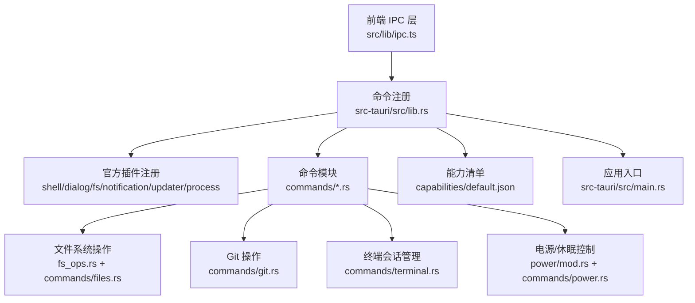
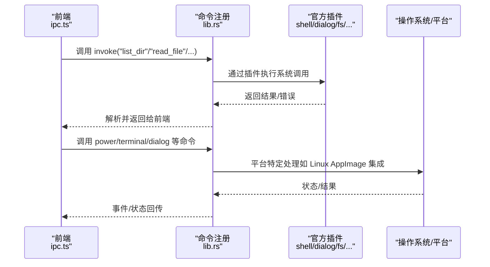
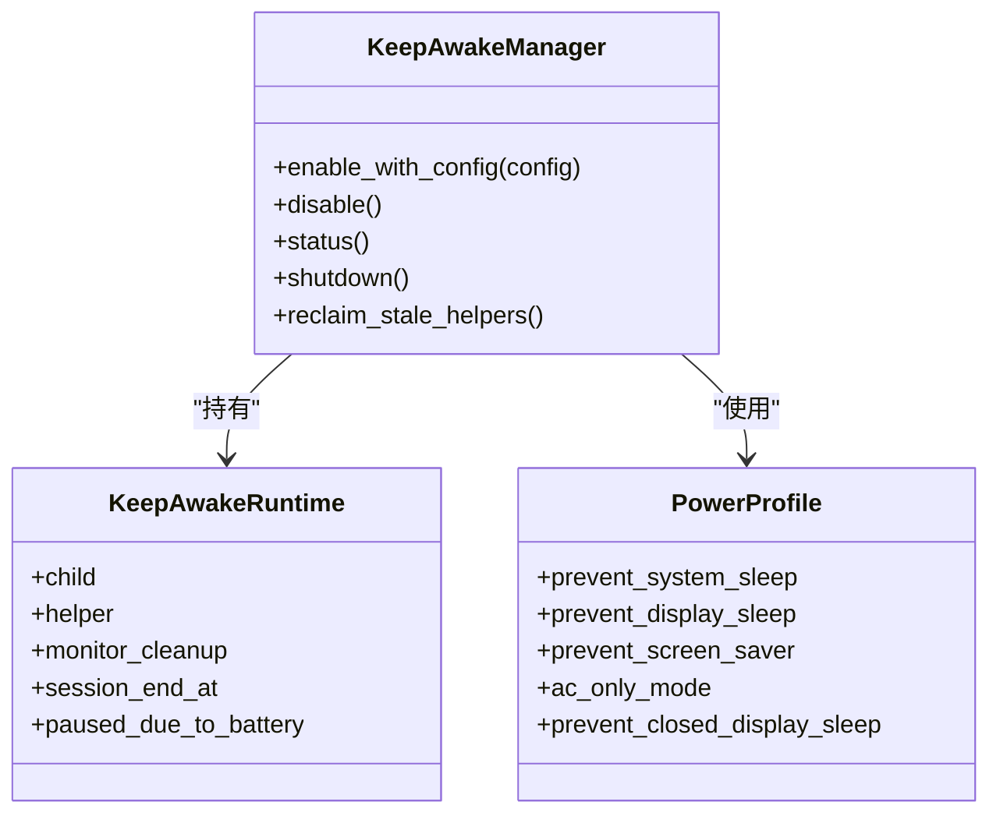
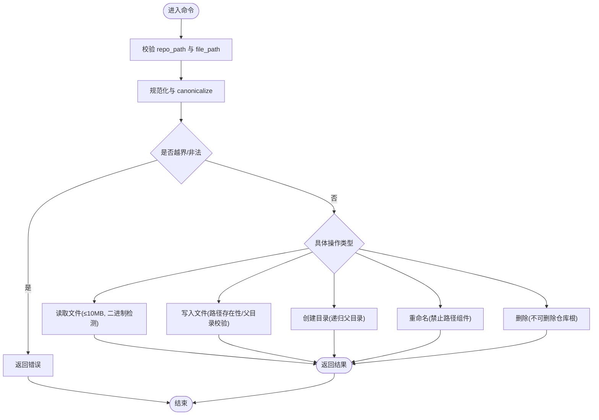
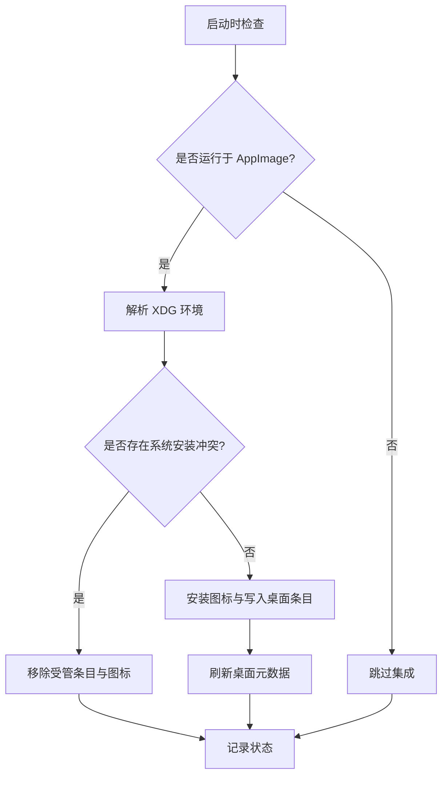
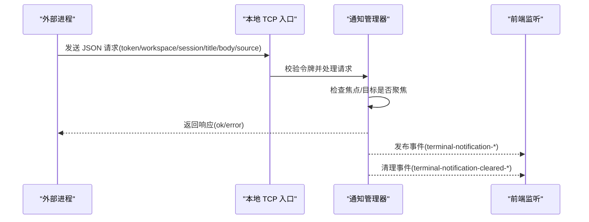
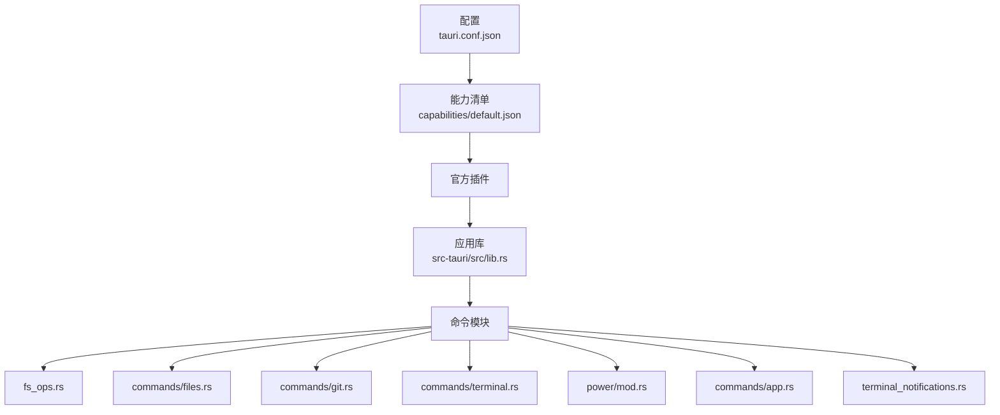

# 插件架构

<cite>
**本文档引用的文件**
- [Cargo.toml](file://src-tauri/Cargo.toml)
- [tauri.conf.json](file://src-tauri/tauri.conf.json)
- [lib.rs](file://src-tauri/src/lib.rs)
- [main.rs](file://src-tauri/src/main.rs)
- [mod.rs](file://src-tauri/src/power/mod.rs)
- [power.rs](file://src-tauri/src/commands/power.rs)
- [linux_appimage.rs](file://src-tauri/src/linux_appimage.rs)
- [process_utils.rs](file://src-tauri/src/process_utils.rs)
- [default.json](file://src-tauri/capabilities/default.json)
- [ipc.ts](file://src/lib/ipc.ts)
- [fs_ops.rs](file://src-tauri/src/fs_ops.rs)
- [files.rs](file://src-tauri/src/commands/files.rs)
- [git.rs](file://src-tauri/src/commands/git.rs)
- [terminal.rs](file://src-tauri/src/commands/terminal.rs)
- [app.rs](file://src-tauri/src/commands/app.rs)
- [terminal_notifications.rs](file://src-tauri/src/terminal_notifications.rs)
</cite>

## 目录
1. [简介](#简介)
2. [项目结构](#项目结构)
3. [核心组件](#核心组件)
4. [架构总览](#架构总览)
5. [详细组件分析](#详细组件分析)
6. [依赖关系分析](#依赖关系分析)
7. [性能考虑](#性能考虑)
8. [故障排查指南](#故障排查指南)
9. [结论](#结论)
10. [附录](#附录)

## 简介
本文件系统性阐述 Panes 的 Tauri 插件架构与扩展机制，覆盖官方插件的集成与配置、自定义插件开发流程、以及 Linux AppImage 集成与原生命令行工具等平台特性。文档同时给出 power、fs、dialog 等插件的功能说明、配置要点与最佳实践，并提供性能优化建议与故障排查方法。

## 项目结构
Panes 的插件体系由前端 IPC 调用与后端 Tauri 命令桥接构成，后端通过 Builder 模式注册官方插件（shell、dialog、fs、notification、updater、process），并在应用初始化阶段完成窗口、菜单、事件监听与平台适配逻辑。能力清单（capabilities）用于声明权限范围，确保最小权限原则。

**图表来源**
- [lib.rs:98-105](file://src-tauri/src/lib.rs#L98-L105)
- [ipc.ts:73-648](file://src/lib/ipc.ts#L73-L648)
- [default.json:6-21](file://src-tauri/capabilities/default.json#L6-L21)

**章节来源**
- [lib.rs:98-105](file://src-tauri/src/lib.rs#L98-L105)
- [tauri.conf.json:47-56](file://src-tauri/tauri.conf.json#L47-L56)
- [default.json:6-21](file://src-tauri/capabilities/default.json#L6-L21)

## 核心组件
- 官方插件集成
  - shell：用于打开外部链接或默认应用
  - dialog：用于弹出对话框（如更新对话框）
  - fs：文件系统读写、目录遍历、路径校验
  - notification：桌面通知
  - updater：自动更新
  - process：进程重启能力
- 自定义插件与平台适配
  - power：跨平台保持唤醒（Windows/macOS/Linux）
  - linux_appimage：Linux AppImage 桌面集成
  - 终端通知：TCP 入口、会话环境注入、焦点感知
- 能力与权限
  - capabilities/default.json 声明窗口、shell、fs、dialog、notification、updater、process 权限

**章节来源**
- [Cargo.toml:19-25](file://src-tauri/Cargo.toml#L19-L25)
- [lib.rs:98-105](file://src-tauri/src/lib.rs#L98-L105)
- [default.json:6-21](file://src-tauri/capabilities/default.json#L6-L21)

## 架构总览
下图展示从前端到后端命令、再到官方插件与平台特性的调用链路与数据流。

**图表来源**
- [lib.rs:181-327](file://src-tauri/src/lib.rs#L181-L327)
- [ipc.ts:442-514](file://src/lib/ipc.ts#L442-L514)
- [files.rs:18-28](file://src-tauri/src/commands/files.rs#L18-L28)
- [git.rs:15-23](file://src-tauri/src/commands/git.rs#L15-L23)
- [terminal.rs:25-62](file://src-tauri/src/commands/terminal.rs#L25-L62)

## 详细组件分析

### power 插件（保持唤醒）
- 功能概述
  - 提供跨平台保持系统/显示器唤醒的能力，支持 AC 仅模式、电池阈值、会话时长限制、关闭屏幕时防休眠等
  - 在 Linux 上通过 D-Bus 抑制（gdbus/bash）实现显示抑制；在 macOS 使用辅助工具与系统 API
- 关键接口
  - get_keep_awake_state / set_keep_awake_enabled：查询与启用/禁用
  - get_power_settings / set_power_settings：读取与设置电源配置
  - get_helper_status / register_keep_awake_helper：macOS 辅助工具状态与注册
- 数据模型
  - KeepAwakeStateDto、PowerSettingsDto、PowerSettingsInput
- 平台差异
  - Windows：无窗口创建标志（CREATE_NO_WINDOW）
  - Linux：桌面集成与显示抑制
  - macOS：辅助工具注册与关闭屏幕睡眠控制

**图表来源**
- [mod.rs:54-77](file://src-tauri/src/power/mod.rs#L54-L77)
- [mod.rs:92-121](file://src-tauri/src/power/mod.rs#L92-L121)
- [power.rs:10-32](file://src-tauri/src/commands/power.rs#L10-L32)

**章节来源**
- [mod.rs:199-426](file://src-tauri/src/power/mod.rs#L199-L426)
- [power.rs:58-126](file://src-tauri/src/commands/power.rs#L58-L126)
- [process_utils.rs:1-24](file://src-tauri/src/process_utils.rs#L1-L24)

### fs 插件（文件系统）
- 功能概述
  - 列目录、读文件、写文件、创建/删除/重命名路径、打开/定位文件
  - 内置路径校验与安全检查（防止路径穿越、限制大文件）
- 关键接口
  - list_dir、read_file、write_file、create_file、create_dir、rename_path、delete_path、reveal_path、open_path_with_default_app
- 安全与性能
  - canonicalize 与 starts_with 校验防止路径穿越
  - 读取上限 10MB，二进制检测避免大文本解析
  - 异步任务线程池执行 IO 操作

**图表来源**
- [fs_ops.rs:13-24](file://src-tauri/src/fs_ops.rs#L13-L24)
- [fs_ops.rs:88-118](file://src-tauri/src/fs_ops.rs#L88-L118)
- [fs_ops.rs:120-154](file://src-tauri/src/fs_ops.rs#L120-L154)
- [fs_ops.rs:239-258](file://src-tauri/src/fs_ops.rs#L239-L258)
- [fs_ops.rs:260-267](file://src-tauri/src/fs_ops.rs#L260-L267)
- [files.rs:18-28](file://src-tauri/src/commands/files.rs#L18-L28)

**章节来源**
- [fs_ops.rs:13-118](file://src-tauri/src/fs_ops.rs#L13-L118)
- [files.rs:18-266](file://src-tauri/src/commands/files.rs#L18-L266)

### dialog 插件（对话框）
- 功能概述
  - 通过 tauri-plugin-dialog 提供系统级对话框能力
  - 在 tauri.conf.json 中配置更新器对话框与安装模式
- 配置要点
  - dialog 字段控制是否显示对话框
  - 安装模式 passivity（被动安装）

**章节来源**
- [tauri.conf.json:47-56](file://src-tauri/tauri.conf.json#L47-L56)

### Linux AppImage 集成
- 功能概述
  - 在 Linux 下检测 AppImage 环境，生成并维护桌面条目与图标缓存
  - 支持冲突检测（系统已安装版本）、清理与刷新
- 关键流程
  - 解析 XDG 环境变量与数据目录
  - 写入/更新 .desktop 文件与图标
  - 调用 update-desktop-database 与 gtk-update-icon-cache

**图表来源**
- [linux_appimage.rs:94-139](file://src-tauri/src/linux_appimage.rs#L94-L139)
- [linux_appimage.rs:364-384](file://src-tauri/src/linux_appimage.rs#L364-L384)

**章节来源**
- [linux_appimage.rs:94-139](file://src-tauri/src/linux_appimage.rs#L94-L139)
- [lib.rs:140-155](file://src-tauri/src/lib.rs#L140-L155)

### 终端通知系统
- 功能概述
  - 通过 TCP 入口接收外部进程通知，发布到桌面通知与前端事件
  - 支持会话级焦点感知与自动清理
- 关键点
  - 启动 TCP 监听，生成随机令牌
  - CLI 子命令 panes notify/clear-notification/codex-notify/claude-hook
  - 会话环境注入 PANES_NOTIFY_ADDR/PANES_NOTIFY_TOKEN/PANES_SESSION_ID/PANES_WORKSPACE_ID

**图表来源**
- [terminal_notifications.rs:219-265](file://src-tauri/src/terminal_notifications.rs#L219-L265)
- [terminal_notifications.rs:341-360](file://src-tauri/src/terminal_notifications.rs#L341-L360)
- [terminal_notifications.rs:592-643](file://src-tauri/src/terminal_notifications.rs#L592-L643)

**章节来源**
- [terminal_notifications.rs:219-265](file://src-tauri/src/terminal_notifications.rs#L219-L265)
- [terminal_notifications.rs:592-643](file://src-tauri/src/terminal_notifications.rs#L592-L643)

### Git 插件（命令封装）
- 功能概述
  - 封装 Git 状态、diff、分支、提交、stash、远程仓库、工作树等常用操作
  - 通过异步任务执行，避免阻塞 UI
- 关键接口
  - get_git_status、get_file_diff、stage_files/unstage_files/discard_files、commit、fetch/pull/push、分支/提交/stash/远程/工作树管理等

**章节来源**
- [git.rs:15-559](file://src-tauri/src/commands/git.rs#L15-L559)

### 终端命令（会话管理）
- 功能概述
  - 创建/写入/调整大小/关闭终端会话
  - 会话输出恢复、通知列表与焦点清理
- 关键接口
  - terminal_create_session、terminal_write、terminal_resize、terminal_close_session、terminal_list_sessions、terminal_get_renderer_diagnostics、terminal_resume_session、terminal_drain_output、terminal_list_notifications、terminal_clear_notification、terminal_set_notification_focus

**章节来源**
- [terminal.rs:25-275](file://src-tauri/src/commands/terminal.rs#L25-L275)

### 应用配置与通知设置
- 功能概述
  - 应用语言、终端加速渲染开关、聊天/终端通知开关、通知声音设置与预览
  - 安装终端通知集成（Claude/Codex）
- 关键接口
  - get_app_locale/set_app_locale、get_terminal_accelerated_rendering/set_terminal_accelerated_rendering
  - get_agent_notification_settings、set_chat_notifications_enabled、set_terminal_notifications_enabled、install_terminal_notification_integration_command、set_notification_sound、preview_notification_sound、show_agent_notification

**章节来源**
- [app.rs:128-292](file://src-tauri/src/commands/app.rs#L128-L292)

## 依赖关系分析
- 外部依赖与插件
  - 官方插件：tauri-plugin-shell、tauri-plugin-dialog、tauri-plugin-fs、tauri-plugin-notification、tauri-plugin-updater、tauri-plugin-process
  - 平台相关：rusqlite、git2、notify、portable-pty、which、env_logger 等
- 能力清单
  - default.json 声明窗口、shell、fs、dialog、notification、updater、process 权限，确保最小权限

**图表来源**
- [tauri.conf.json:47-56](file://src-tauri/tauri.conf.json#L47-L56)
- [default.json:6-21](file://src-tauri/capabilities/default.json#L6-L21)
- [lib.rs:98-105](file://src-tauri/src/lib.rs#L98-L105)

**章节来源**
- [Cargo.toml:19-25](file://src-tauri/Cargo.toml#L19-L25)
- [default.json:6-21](file://src-tauri/capabilities/default.json#L6-L21)

## 性能考虑
- 异步与线程池
  - 所有 IO 密集型操作通过 tokio::task::spawn_blocking 包裹，避免阻塞事件循环
- 资源释放
  - 退出事件中显式释放保持唤醒与终端资源，确保进程平滑退出
- 平台差异
  - Windows 使用 CREATE_NO_WINDOW 隐藏子进程窗口，减少系统开销
- 通知与事件
  - 通知采用 TCP 入口与令牌校验，避免重复与越权；焦点感知减少无效通知

**章节来源**
- [lib.rs:330-343](file://src-tauri/src/lib.rs#L330-L343)
- [process_utils.rs:1-24](file://src-tauri/src/process_utils.rs#L1-L24)
- [terminal_notifications.rs:219-265](file://src-tauri/src/terminal_notifications.rs#L219-L265)

## 故障排查指南
- 无法写入受限仓库
  - 当仓库信任级别为 Restricted 时，用户直接编辑会被拒绝，需先提升信任级别
- 路径穿越与非法路径
  - fs_ops 对路径进行 canonicalize 与 starts_with 校验，若失败请检查输入路径与仓库根
- Linux AppImage 集成未生效
  - 检查 PANES_DISABLE_APPIMAGE_INTEGRATION 环境变量、系统安装冲突、XDG 数据目录解析
- 通知不显示或被清理
  - 确认通知开关、焦点状态；若会话处于聚焦状态，通知会被自动清理
- 保持唤醒异常
  - 查看支持状态与错误消息；在电池阈值触发或切换到电池时会自动暂停

**章节来源**
- [files.rs:83-100](file://src-tauri/src/commands/files.rs#L83-L100)
- [fs_ops.rs:13-24](file://src-tauri/src/fs_ops.rs#L13-L24)
- [linux_appimage.rs:94-139](file://src-tauri/src/linux_appimage.rs#L94-L139)
- [terminal_notifications.rs:450-463](file://src-tauri/src/terminal_notifications.rs#L450-L463)
- [power.rs:258-287](file://src-tauri/src/commands/power.rs#L258-L287)

## 结论
Panes 的插件架构以 Tauri 官方插件为基础，结合自定义模块（power、fs、git、terminal、app、terminal_notifications）与平台适配（Linux AppImage），实现了稳定、可扩展且跨平台的系统级能力。通过能力清单与最小权限设计，既保证了安全性也兼顾了易用性。建议在新功能开发中遵循现有命令注册与错误处理模式，充分利用异步任务与平台特性，持续优化性能与用户体验。

## 附录
- 插件配置示例（基于 tauri.conf.json）
  - 更新器 endpoint、dialog 开关、安装模式与公钥
  - 参考路径：[tauri.conf.json:47-56](file://src-tauri/tauri.conf.json#L47-L56)
- 能力清单示例（基于 capabilities/default.json）
  - 权限声明与窗口标签
  - 参考路径：[default.json:6-21](file://src-tauri/capabilities/default.json#L6-L21)
- 前端 IPC 使用参考
  - 通过 ipc.ts 调用命令与监听事件
  - 参考路径：[ipc.ts:73-764](file://src/lib/ipc.ts#L73-L764)