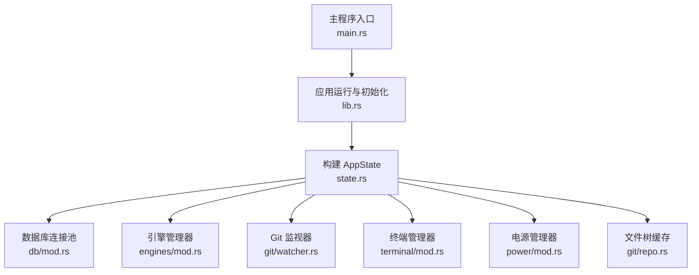
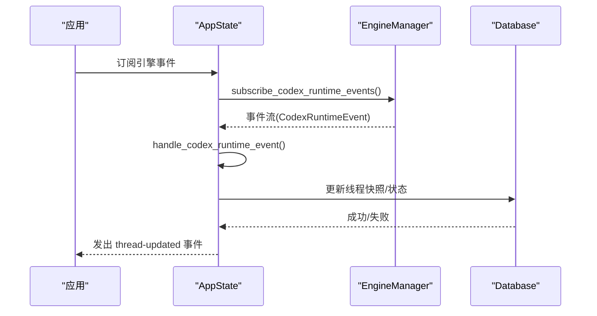
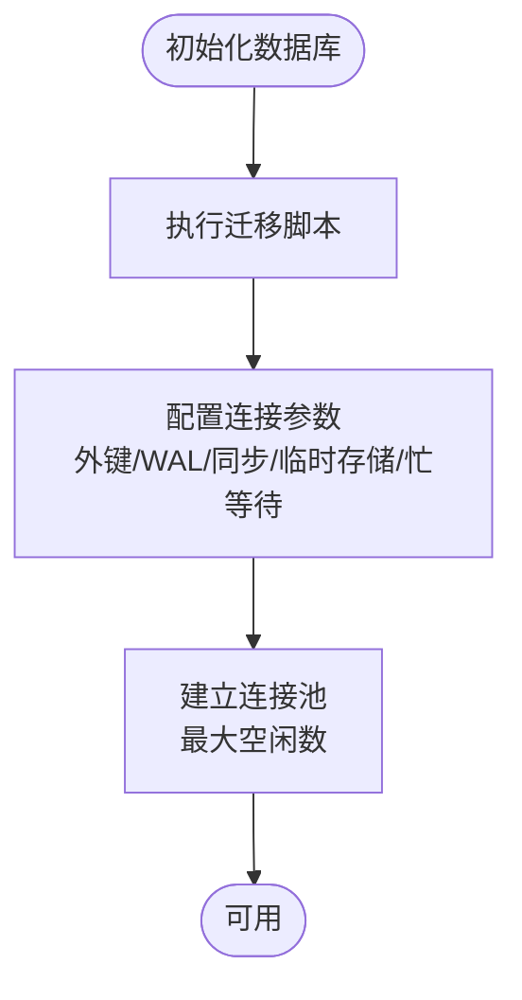
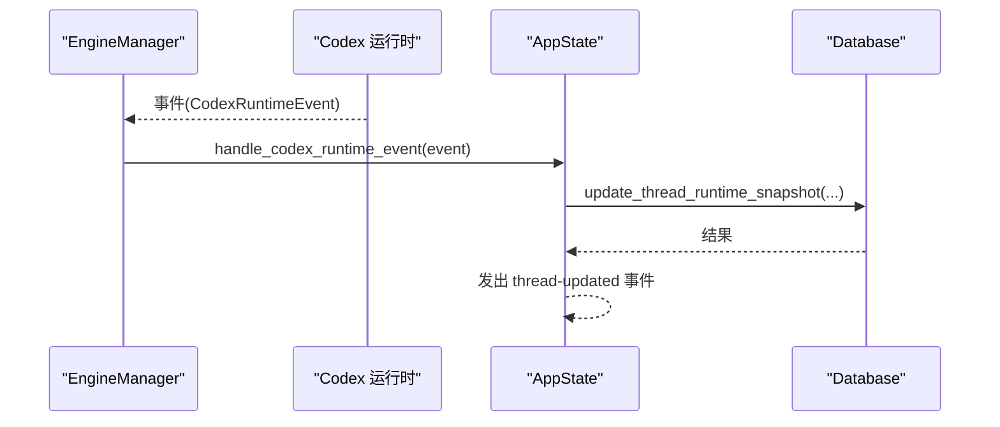
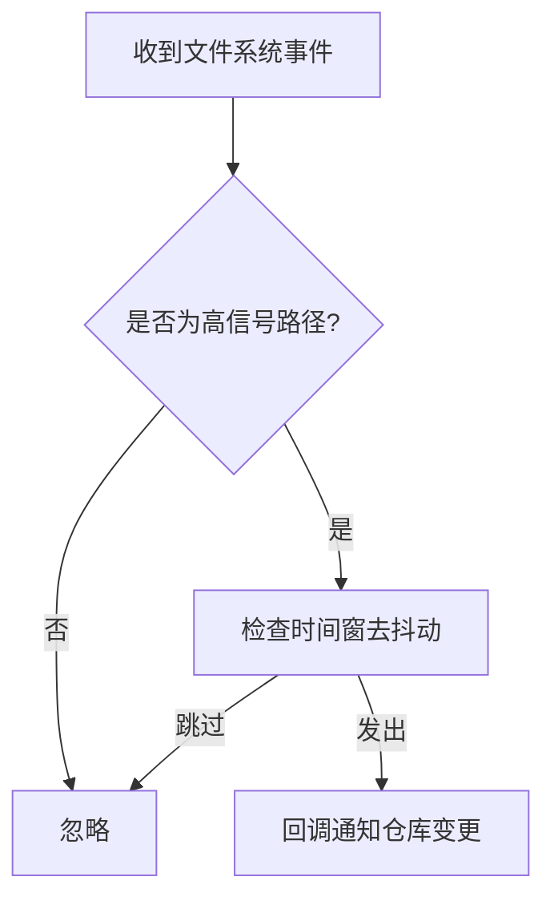
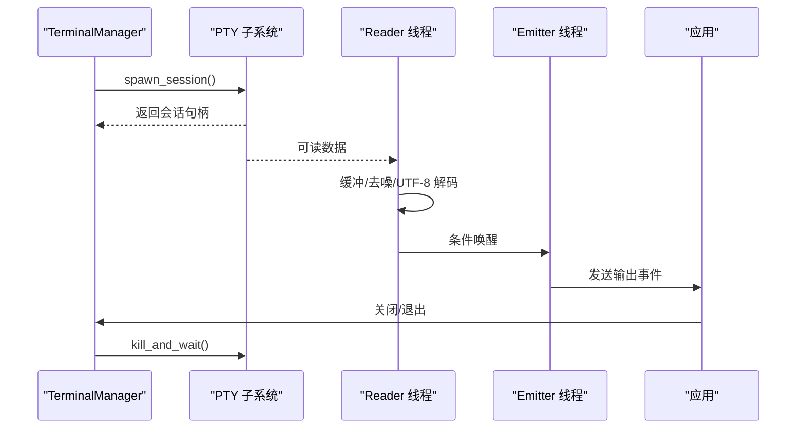
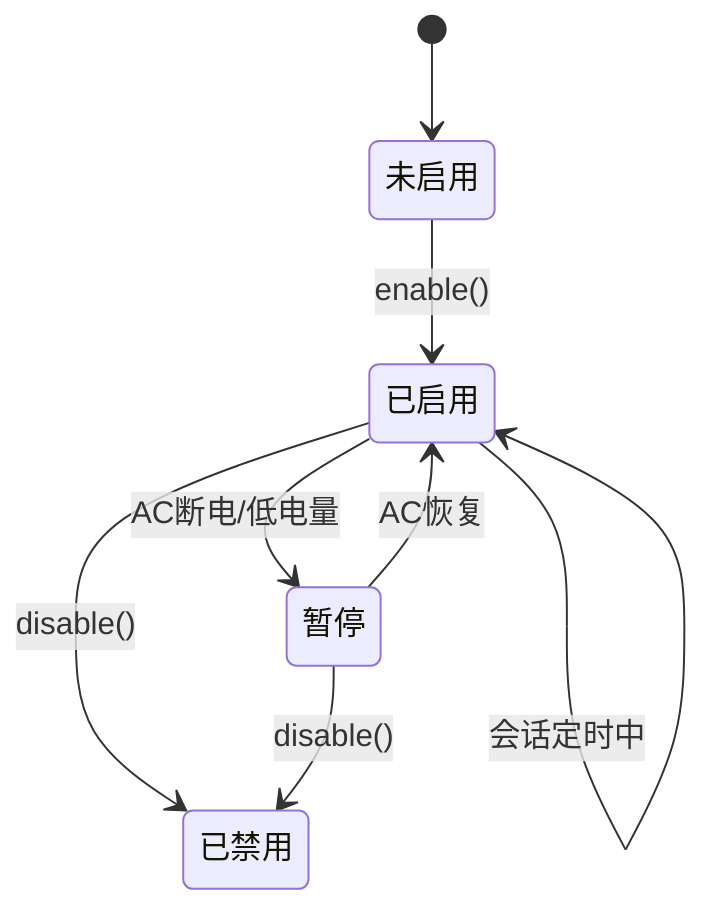
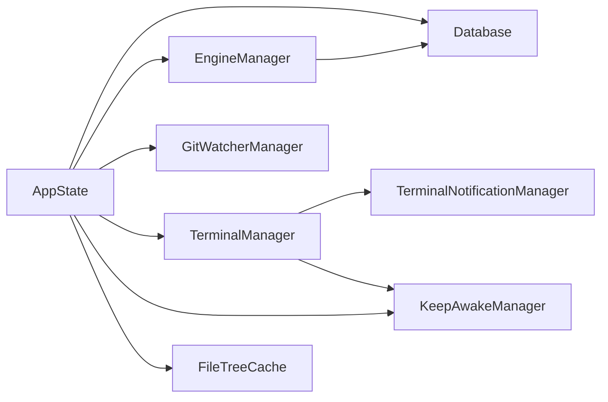

# 状态管理

<cite>
**本文引用的文件**
- [state.rs](file://src-tauri/src/state.rs)
- [lib.rs](file://src-tauri/src/lib.rs)
- [main.rs](file://src-tauri/src/main.rs)
- [mod.rs（数据库）](file://src-tauri/src/db/mod.rs)
- [mod.rs（引擎）](file://src-tauri/src/engines/mod.rs)
- [watcher.rs（Git 监视器）](file://src-tauri/src/git/watcher.rs)
- [mod.rs（终端）](file://src-tauri/src/terminal/mod.rs)
- [mod.rs（电源管理）](file://src-tauri/src/power/mod.rs)
- [repo.rs（仓库）](file://src-tauri/src/git/repo.rs)
- [models.rs](file://src-tauri/src/models.rs)
</cite>

## 目录
1. [简介](#简介)
2. [项目结构](#项目结构)
3. [核心组件](#核心组件)
4. [架构总览](#架构总览)
5. [详细组件分析](#详细组件分析)
6. [依赖关系分析](#依赖关系分析)
7. [性能考量](#性能考量)
8. [故障排查指南](#故障排查指南)
9. [结论](#结论)
10. [附录](#附录)

## 简介
本文件聚焦 Panes 后端状态管理，围绕 AppState 设计与实现展开，覆盖共享状态管理、并发访问控制、状态同步机制；详解数据库连接池、引擎管理器、终端管理器等子系统的状态协调；阐述状态持久化、内存管理与资源清理策略，并提供状态流转图与并发访问示例，帮助开发者在复杂异步场景中正确使用与扩展状态管理。

## 项目结构
后端采用 Rust/Tauri 架构，状态集中于 AppState，通过 Arc+Tokio 同步原语实现跨模块共享与并发安全。应用启动时初始化数据库、配置、各子系统管理器，并将其注入到全局状态中，供命令处理器与事件桥接使用。



**图表来源**
- [main.rs:1-14](file://src-tauri/src/main.rs#L1-L14)
- [lib.rs:48-106](file://src-tauri/src/lib.rs#L48-L106)
- [state.rs:12-24](file://src-tauri/src/state.rs#L12-L24)
- [mod.rs（数据库）:23-27](file://src-tauri/src/db/mod.rs#L23-L27)
- [mod.rs（引擎）:463-468](file://src-tauri/src/engines/mod.rs#L463-L468)
- [watcher.rs（Git 监视器）:18-22](file://src-tauri/src/git/watcher.rs#L18-L22)
- [mod.rs（终端）:44-48](file://src-tauri/src/terminal/mod.rs#L44-L48)
- [mod.rs（电源管理）:53-60](file://src-tauri/src/power/mod.rs#L53-L60)
- [repo.rs（仓库）:66-68](file://src-tauri/src/git/repo.rs#L66-L68)

**章节来源**
- [main.rs:1-14](file://src-tauri/src/main.rs#L1-L14)
- [lib.rs:48-106](file://src-tauri/src/lib.rs#L48-L106)
- [state.rs:12-24](file://src-tauri/src/state.rs#L12-L24)

## 核心组件
- AppState：全局共享状态容器，包含数据库、配置、引擎、Git 监视器、终端、通知、保持清醒、回合管理、文件树缓存等。
- 数据库连接池：基于 SQLite 的连接池，支持最大空闲连接数、连接复用与迁移。
- 引擎管理器：统一调度多引擎（Codex、Claude、OpenCode 等），订阅运行时事件并进行状态同步。
- Git 监视器：监听仓库变更，去抖动与高信号路径过滤，避免噪声刷新。
- 终端管理器：PTY 会话生命周期管理、输出缓冲与节流、回放快照与前台进程检测。
- 电源管理器：跨平台保持系统唤醒，支持会话定时、电池阈值、AC 恢复等。
- 文件树缓存：按仓库维度缓存文件树，带 TTL 清理与失效策略。

**章节来源**
- [state.rs:12-24](file://src-tauri/src/state.rs#L12-L24)
- [mod.rs（数据库）:23-27](file://src-tauri/src/db/mod.rs#L23-L27)
- [mod.rs（引擎）:463-468](file://src-tauri/src/engines/mod.rs#L463-L468)
- [watcher.rs（Git 监视器）:18-22](file://src-tauri/src/git/watcher.rs#L18-L22)
- [mod.rs（终端）:44-48](file://src-tauri/src/terminal/mod.rs#L44-L48)
- [mod.rs（电源管理）:53-60](file://src-tauri/src/power/mod.rs#L53-L60)
- [repo.rs（仓库）:66-68](file://src-tauri/src/git/repo.rs#L66-L68)

## 架构总览
AppState 作为全局状态根节点，被注入到 Tauri 应用中，所有命令处理与后台任务通过 AppHandle 获取其引用，实现跨模块状态共享与事件驱动同步。

```mermaid
classDiagram
class AppState {
+db : Database
+config : Arc<AppConfig>
+config_write_lock : Arc<Mutex<()>>
+engines : Arc<EngineManager>
+git_watchers : Arc<GitWatcherManager>
+terminals : Arc<TerminalManager>
+notifications : Arc<TerminalNotificationManager>
+keep_awake : Arc<KeepAwakeManager>
+turns : Arc<TurnManager>
+file_tree_cache : Arc<FileTreeCache>
}
class Database {
+connect() PooledConnection
+run_migrations()
}
class EngineManager {
+subscribe_codex_runtime_events()
+ensure_engine_thread()
+send_message()
}
class GitWatcherManager {
+watch_repo()
}
class TerminalManager {
+create_session()
+write()/resize()/close()
+shutdown()
}
class KeepAwakeManager {
+enable()/disable()/shutdown()
+status()
}
class FileTreeCache {
+get()/insert()/invalidate_()
}
AppState --> Database
AppState --> EngineManager
AppState --> GitWatcherManager
AppState --> TerminalManager
AppState --> KeepAwakeManager
AppState --> FileTreeCache
```

**图表来源**
- [state.rs:12-24](file://src-tauri/src/state.rs#L12-L24)
- [mod.rs（数据库）:74-135](file://src-tauri/src/db/mod.rs#L74-L135)
- [mod.rs（引擎）:463-468](file://src-tauri/src/engines/mod.rs#L463-L468)
- [watcher.rs（Git 监视器）:24-54](file://src-tauri/src/git/watcher.rs#L24-L54)
- [mod.rs（终端）:319-543](file://src-tauri/src/terminal/mod.rs#L319-L543)
- [mod.rs（电源管理）:199-498](file://src-tauri/src/power/mod.rs#L199-L498)
- [repo.rs（仓库）:66-127](file://src-tauri/src/git/repo.rs#L66-L127)

## 详细组件分析

### AppState 设计与实现
- 共享状态：全部字段以 Arc 包装，确保线程安全传递与克隆。
- 并发控制：配置写锁用于串行化配置持久化；TurnManager 使用读写锁与取消令牌协调回合生命周期。
- 状态同步：通过引擎事件桥（Codex 运行时事件）将外部状态变更映射到本地线程模型，触发 UI 事件。



**图表来源**
- [lib.rs:350-361](file://src-tauri/src/lib.rs#L350-L361)
- [lib.rs:363-511](file://src-tauri/src/lib.rs#L363-L511)
- [state.rs:26-55](file://src-tauri/src/state.rs#L26-L55)

**章节来源**
- [state.rs:12-24](file://src-tauri/src/state.rs#L12-L24)
- [state.rs:26-55](file://src-tauri/src/state.rs#L26-L55)
- [lib.rs:350-511](file://src-tauri/src/lib.rs#L350-L511)

### 数据库连接池
- 连接池：维护空闲连接队列，最大空闲数受控；连接复用减少打开/关闭开销。
- 连接配置：启用外键、WAL、同步模式、临时存储于内存、忙等待超时。
- 迁移：启动时执行迁移脚本，确保表结构与列存在性。



**图表来源**
- [mod.rs（数据库）:74-135](file://src-tauri/src/db/mod.rs#L74-L135)
- [mod.rs（数据库）:137-149](file://src-tauri/src/db/mod.rs#L137-L149)

**章节来源**
- [mod.rs（数据库）:23-27](file://src-tauri/src/db/mod.rs#L23-L27)
- [mod.rs（数据库）:74-135](file://src-tauri/src/db/mod.rs#L74-L135)
- [mod.rs（数据库）:137-149](file://src-tauri/src/db/mod.rs#L137-L149)

### 引擎管理器与状态同步
- 多引擎统一接口：Engine trait 定义线程生命周期、消息发送、中断、归档/恢复等。
- 事件桥接：订阅 Codex 运行时事件，映射为本地线程状态与元数据更新，必要时发出 UI 事件。
- 回调解析：审批事件解析后更新本地审批记录与消息块，条件推进线程状态。



**图表来源**
- [mod.rs（引擎）:419-461](file://src-tauri/src/engines/mod.rs#L419-L461)
- [lib.rs:363-511](file://src-tauri/src/lib.rs#L363-L511)

**章节来源**
- [mod.rs（引擎）:419-461](file://src-tauri/src/engines/mod.rs#L419-L461)
- [lib.rs:363-511](file://src-tauri/src/lib.rs#L363-L511)

### Git 监视器状态协调
- 去抖动：同一仓库事件在窗口内合并，降低刷新频率。
- 高信号路径过滤：仅允许 HEAD、index、refs/*、FETCH_HEAD、packed-refs 等路径变更触发，避免工作区大文件变动引发噪声。
- 回退策略：当原生监视器达到系统限制时回退到轮询模式。



**图表来源**
- [watcher.rs（Git 监视器）:202-229](file://src-tauri/src/git/watcher.rs#L202-L229)
- [watcher.rs（Git 监视器）:231-252](file://src-tauri/src/git/watcher.rs#L231-L252)
- [watcher.rs（Git 监视器）:268-318](file://src-tauri/src/git/watcher.rs#L268-L318)

**章节来源**
- [watcher.rs（Git 监视器）:18-22](file://src-tauri/src/git/watcher.rs#L18-L22)
- [watcher.rs（Git 监视器）:202-361](file://src-tauri/src/git/watcher.rs#L202-L361)

### 终端管理器状态与资源清理
- 会话生命周期：创建、写入、调整大小、关闭、工作区批量关闭、优雅退出。
- 输出缓冲与节流：读者线程持续从 PTY 读取，发射线程按最小间隔与最大字节限制合并输出，避免 UI 冻结。
- 回放与前台检测：记录输出回放缓冲，支持重放；检测前台进程变化并上报。
- 资源清理：应用退出或工作区关闭时，终止所有会话并等待退出，记录日志。



**图表来源**
- [mod.rs（终端）:385-429](file://src-tauri/src/terminal/mod.rs#L385-L429)
- [mod.rs（终端）:622-758](file://src-tauri/src/terminal/mod.rs#L622-L758)
- [mod.rs（终端）:515-543](file://src-tauri/src/terminal/mod.rs#L515-L543)

**章节来源**
- [mod.rs（终端）:44-48](file://src-tauri/src/terminal/mod.rs#L44-L48)
- [mod.rs（终端）:385-543](file://src-tauri/src/terminal/mod.rs#L385-L543)
- [mod.rs（终端）:622-758](file://src-tauri/src/terminal/mod.rs#L622-L758)

### 电源管理器状态与会话控制
- 功能特性：系统/显示/屏保睡眠抑制、AC 仅模式、关闭显示器睡眠抑制、会话定时、电池阈值。
- 状态机：启用/禁用/暂停/恢复/会话到期；与监控器事件联动。
- 跨平台：Linux 显示抑制、macOS 辅助工具集成；Windows 标记识别。



**图表来源**
- [mod.rs（电源管理）:324-426](file://src-tauri/src/power/mod.rs#L324-L426)
- [mod.rs（电源管理）:500-635](file://src-tauri/src/power/mod.rs#L500-L635)

**章节来源**
- [mod.rs（电源管理）:53-60](file://src-tauri/src/power/mod.rs#L53-L60)
- [mod.rs（电源管理）:324-498](file://src-tauri/src/power/mod.rs#L324-L498)
- [mod.rs（电源管理）:500-635](file://src-tauri/src/power/mod.rs#L500-L635)

### 文件树缓存与失效策略
- 缓存条目：按仓库路径键值缓存，带 TTL 过期清理。
- 失效策略：工作区失效、包含路径失效（双向包含时清理）。
- 读写：并发安全的互斥访问，插入时复制 Arc 列表以降低持有成本。

**章节来源**
- [repo.rs（仓库）:66-127](file://src-tauri/src/git/repo.rs#L66-L127)

## 依赖关系分析
- 组件耦合：AppState 将各子系统聚合，命令处理器与后台任务通过 AppHandle 获取状态引用，形成松耦合。
- 直接依赖：引擎事件桥直接依赖数据库与 AppState；终端管理器依赖通知管理器与电源管理器环境。
- 外部依赖：Tokio 同步原语（RwLock、Mutex、broadcast）、notify 文件系统事件库、git2 与 portable-pty。



**图表来源**
- [state.rs:12-24](file://src-tauri/src/state.rs#L12-L24)
- [lib.rs:160-166](file://src-tauri/src/lib.rs#L160-L166)

**章节来源**
- [state.rs:12-24](file://src-tauri/src/state.rs#L12-L24)
- [lib.rs:160-166](file://src-tauri/src/lib.rs#L160-L166)

## 性能考量
- 数据库：WAL 模式提升并发读写；连接池复用减少频繁打开/关闭；迁移一次性执行。
- 终端：输出缓冲与最小发射间隔控制 IPC 压力；回放缓冲限制总字节数与条目数。
- Git：高信号路径白名单与去抖动显著降低刷新频率；原生监视器不可用时回退轮询。
- 引擎：事件广播接收可能丢弃已滞后事件，避免阻塞主线程；审批解析事务化保证一致性。

[本节为通用指导，无需特定文件引用]

## 故障排查指南
- 引擎事件滞后：事件桥接收时可能跳过滞后事件，确认事件消费速率与 UI 响应链路。
- 终端输出卡顿：检查最小发射间隔与最大发射字节设置；确认 Reader/Emitter 线程未被阻塞。
- Git 监视器噪声：确认事件路径是否属于高信号白名单；Linux 下检查 inotify 限制并观察回退到轮询的日志。
- 电源管理异常：查看 AC/电池状态事件处理分支；确认辅助进程状态与清理流程。
- 数据库连接问题：检查 busy_timeout 与 WAL 配置；确认迁移脚本执行成功。

**章节来源**
- [lib.rs:355-359](file://src-tauri/src/lib.rs#L355-L359)
- [mod.rs（终端）:649-758](file://src-tauri/src/terminal/mod.rs#L649-L758)
- [watcher.rs（Git 监视器）:231-252](file://src-tauri/src/git/watcher.rs#L231-L252)
- [mod.rs（电源管理）:500-635](file://src-tauri/src/power/mod.rs#L500-L635)
- [mod.rs（数据库）:137-149](file://src-tauri/src/db/mod.rs#L137-L149)

## 结论
AppState 通过统一的并发原语与事件驱动机制，将数据库、引擎、Git、终端、电源与文件树等子系统整合为可扩展的状态中心。借助连接池、去抖动、输出节流与 TTL 缓存等策略，系统在复杂异步场景下仍能保持稳定与高性能。建议在新增子系统时遵循现有并发模式与事件桥接方式，确保状态一致性与可观测性。

[本节为总结，无需特定文件引用]

## 附录

### 并发访问示例（要点）
- 全局状态读取：通过 AppHandle.state::<AppState>() 获取只读引用。
- 配置写入：使用 config_write_lock 串行化写操作，避免竞态。
- 引擎事件：使用 broadcast 接收，注意滞后与关闭错误处理。
- 终端输出：Reader 线程追加缓冲，Emitter 线程按节流策略发送。

**章节来源**
- [lib.rs:159-166](file://src-tauri/src/lib.rs#L159-L166)
- [state.rs:16-16](file://src-tauri/src/state.rs#L16-L16)
- [lib.rs:350-361](file://src-tauri/src/lib.rs#L350-L361)
- [mod.rs（终端）:649-758](file://src-tauri/src/terminal/mod.rs#L649-L758)