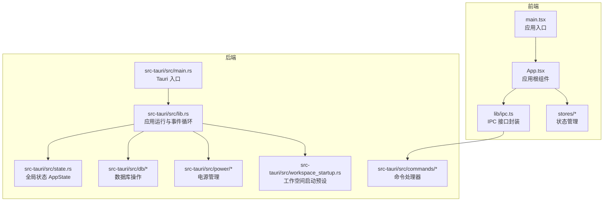
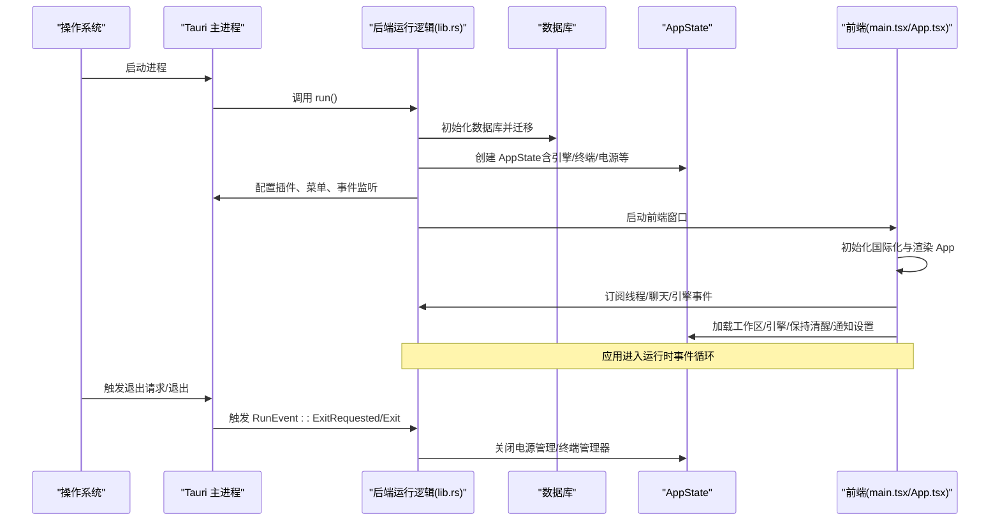
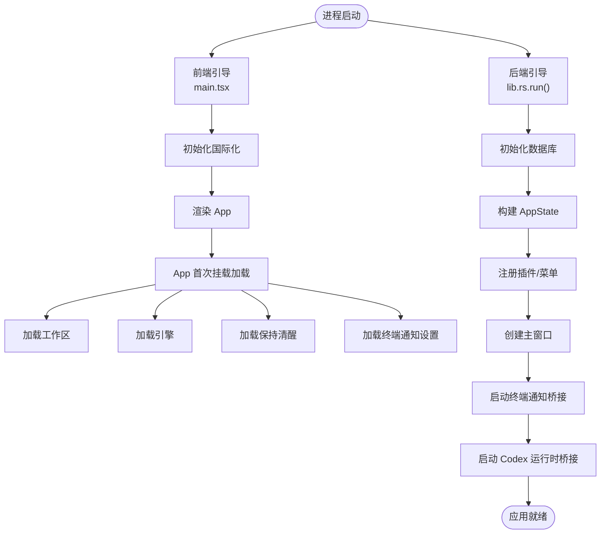
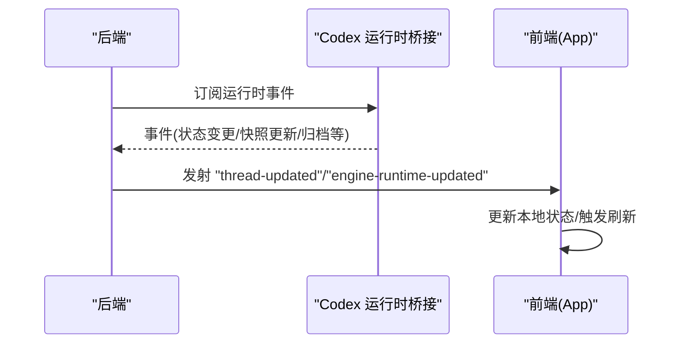
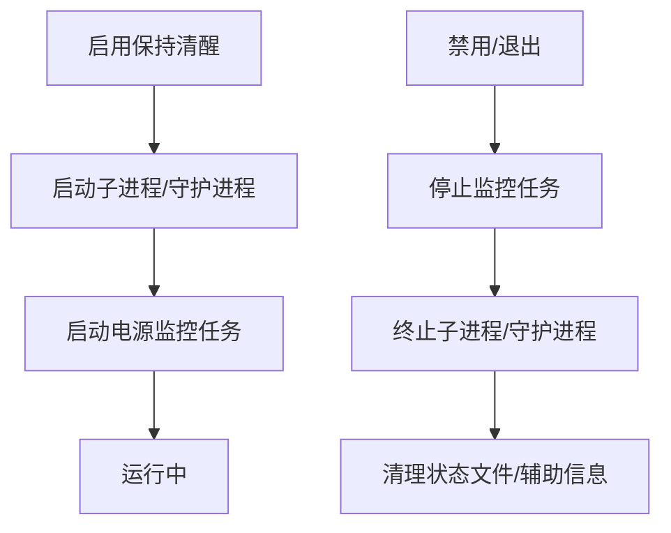
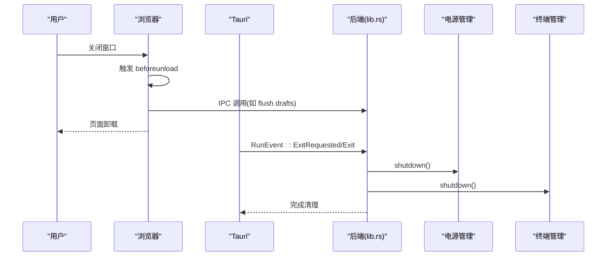
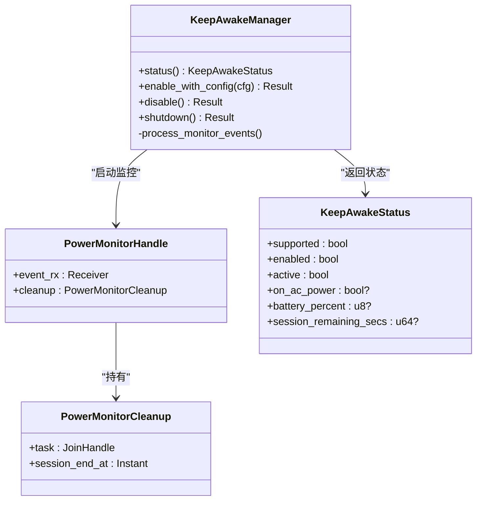
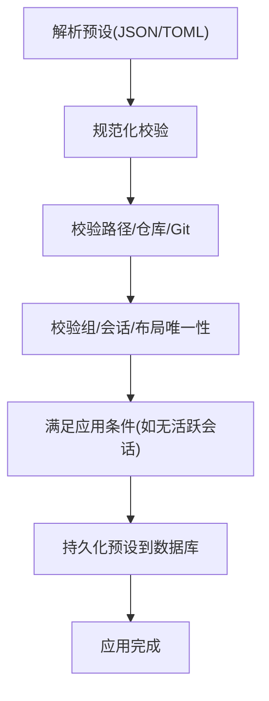
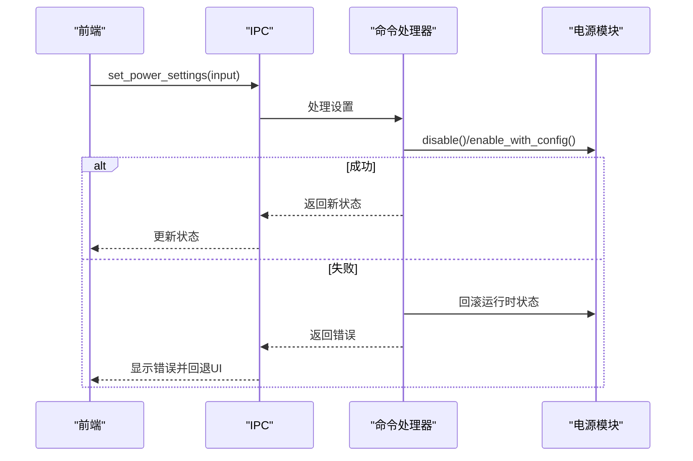
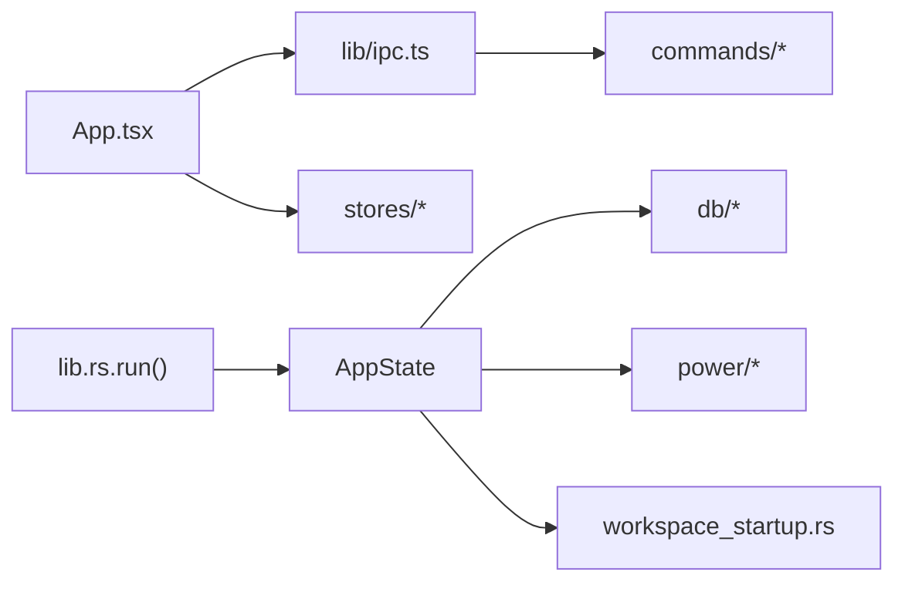

# 生命周期管理

<cite>
**本文档引用的文件**
- [src/main.tsx](file://src/main.tsx)
- [src/App.tsx](file://src/App.tsx)
- [src-tauri/src/lib.rs](file://src-tauri/src/lib.rs)
- [src-tauri/src/main.rs](file://src-tauri/src/main.rs)
- [src-tauri/src/state.rs](file://src-tauri/src/state.rs)
- [src-tauri/src/power/mod.rs](file://src-tauri/src/power/mod.rs)
- [src-tauri/src/power/monitor.rs](file://src-tauri/src/power/monitor.rs)
- [src-tauri/src/commands/power.rs](file://src-tauri/src/commands/power.rs)
- [src-tauri/src/db/workspaces.rs](file://src-tauri/src/db/workspaces.rs)
- [src-tauri/src/workspace_startup.rs](file://src-tauri/src/workspace_startup.rs)
- [src/lib/ipc.ts](file://src/lib/ipc.ts)
- [src/stores/keepAwakeStore.ts](file://src/stores/keepAwakeStore.ts)
- [src/stores/workspacePaneStore.ts](file://src/stores/workspacePaneStore.ts)
</cite>

## 目录
1. [简介](#简介)
2. [项目结构](#项目结构)
3. [核心组件](#核心组件)
4. [架构总览](#架构总览)
5. [详细组件分析](#详细组件分析)
6. [依赖关系分析](#依赖关系分析)
7. [性能考虑](#性能考虑)
8. [故障排除指南](#故障排除指南)
9. [结论](#结论)

## 简介
本文件系统性阐述 Panes 应用的生命周期管理，覆盖应用启动流程、运行时管理与优雅关闭机制。内容包括启动阶段初始化顺序、资源加载与错误处理；运行时事件处理、内存与系统资源管理；应用退出处理、数据持久化与状态清理策略；电源管理监控与工作空间启动流程等。

## 项目结构
Panes 采用前端 React + 后端 Tauri 的双层架构。前端负责 UI 渲染与用户交互，后端负责系统级能力（数据库、引擎、终端、电源管理）与跨平台集成。

**图表来源**
- [src/main.tsx:1-32](file://src/main.tsx#L1-L32)
- [src/App.tsx:1-592](file://src/App.tsx#L1-L592)
- [src-tauri/src/main.rs:1-14](file://src-tauri/src/main.rs#L1-L14)
- [src-tauri/src/lib.rs:1-996](file://src-tauri/src/lib.rs#L1-L996)
- [src-tauri/src/state.rs:1-56](file://src-tauri/src/state.rs#L1-L56)

**章节来源**
- [src/main.tsx:1-32](file://src/main.tsx#L1-L32)
- [src/App.tsx:1-592](file://src/App.tsx#L1-L592)
- [src-tauri/src/main.rs:1-14](file://src-tauri/src/main.rs#L1-L14)
- [src-tauri/src/lib.rs:1-996](file://src-tauri/src/lib.rs#L1-L996)
- [src-tauri/src/state.rs:1-56](file://src-tauri/src/state.rs#L1-L56)

## 核心组件
- 应用入口与引导：前端通过 main.tsx 初始化国际化、监听 IPC 并渲染根组件 App；后端在 main.rs 中调用 run() 进入 Tauri 主循环。
- 应用根组件：App.tsx 负责加载工作区、引擎、保持清醒等初始状态，并订阅线程更新、聊天完成、引擎运行时更新等事件。
- 全局状态：AppState 将数据库、配置、引擎、终端、通知、电源管理、文件树缓存等聚合为可注入的全局对象。
- 电源管理：KeepAwakeManager 提供跨平台的“保持系统唤醒”能力，包含会话计时、电池阈值、AC 仅模式与关闭显示器睡眠控制。
- 工作空间启动：支持预设格式（JSON/TOML）、规范化校验与应用策略（如仅在无活跃会话时应用）。

**章节来源**
- [src/main.tsx:1-32](file://src/main.tsx#L1-L32)
- [src/App.tsx:121-300](file://src/App.tsx#L121-L300)
- [src-tauri/src/state.rs:12-24](file://src-tauri/src/state.rs#L12-L24)
- [src-tauri/src/power/mod.rs:53-77](file://src-tauri/src/power/mod.rs#L53-L77)
- [src-tauri/src/workspace_startup.rs:60-81](file://src-tauri/src/workspace_startup.rs#L60-L81)

## 架构总览
下图展示从进程启动到应用就绪、运行时事件与优雅关闭的整体流程。

**图表来源**
- [src-tauri/src/main.rs:3-13](file://src-tauri/src/main.rs#L3-L13)
- [src-tauri/src/lib.rs:48-344](file://src-tauri/src/lib.rs#L48-L344)
- [src/main.tsx:11-31](file://src/main.tsx#L11-L31)
- [src/App.tsx:150-173](file://src/App.tsx#L150-L173)

## 详细组件分析

### 启动流程与初始化顺序
- 前端启动
  - main.tsx 异步执行引导函数：获取浏览器语言、尝试通过 IPC 获取应用语言、初始化国际化、创建根节点并渲染 App。
  - App.tsx 在首次挂载时并行加载工作区、引擎、保持清醒与终端通知设置。
- 后端启动
  - main.rs 检测 CLI 子命令，若未处理则调用 run()。
  - lib.rs.run() 完成日志初始化、数据库初始化与恢复、默认工作区确保、构建 AppState、注册插件与菜单、建立主窗口、启动终端通知入口、启动 Codex 运行时桥接任务。
  - 注册 RunEvent 监听，在退出请求时释放电源管理与终端资源。

**图表来源**
- [src/main.tsx:11-31](file://src/main.tsx#L11-L31)
- [src/App.tsx:150-155](file://src/App.tsx#L150-L155)
- [src-tauri/src/lib.rs:48-180](file://src-tauri/src/lib.rs#L48-L180)
- [src-tauri/src/db/workspaces.rs:99-120](file://src-tauri/src/db/workspaces.rs#L99-L120)

**章节来源**
- [src/main.tsx:11-31](file://src/main.tsx#L11-L31)
- [src/App.tsx:150-155](file://src/App.tsx#L150-L155)
- [src-tauri/src/lib.rs:48-180](file://src-tauri/src/lib.rs#L48-L180)
- [src-tauri/src/db/workspaces.rs:99-120](file://src-tauri/src/db/workspaces.rs#L99-L120)

### 运行时事件处理
- 线程更新事件：后端监听 Codex 运行时事件，转换为线程更新事件并广播给前端；前端收到后决定是否刷新线程列表或进行本地同步。
- 聊天回合完成事件：前端根据通知设置与焦点状态决定是否显示系统通知。
- 引擎运行时更新事件：前端接收运行时诊断与提示信息，驱动 UI 展示。

**图表来源**
- [src-tauri/src/lib.rs:355-516](file://src-tauri/src/lib.rs#L355-L516)
- [src/App.tsx:175-215](file://src/App.tsx#L175-L215)
- [src/App.tsx:261-281](file://src/App.tsx#L261-L281)

**章节来源**
- [src-tauri/src/lib.rs:355-516](file://src-tauri/src/lib.rs#L355-L516)
- [src/App.tsx:175-215](file://src/App.tsx#L175-L215)
- [src/App.tsx:261-281](file://src/App.tsx#L261-L281)

### 内存管理与系统资源释放
- 电源管理：KeepAwakeManager 在启用时启动子进程/守护进程并启动电源监控任务；在禁用或退出时清理子进程、停止监控、清除辅助状态文件。
- 终端管理：后端在退出事件中调用终端管理器的 shutdown，确保会话与输出通道正确关闭。
- 前端定时器与事件监听：App.tsx 使用 useEffect 注册键盘快捷键、菜单动作、线程更新、聊天完成等监听；在卸载时清理定时器与事件监听，避免内存泄漏。

**图表来源**
- [src-tauri/src/power/mod.rs:324-498](file://src-tauri/src/power/mod.rs#L324-L498)
- [src-tauri/src/power/monitor.rs:70-142](file://src-tauri/src/power/monitor.rs#L70-L142)
- [src-tauri/src/lib.rs:331-343](file://src-tauri/src/lib.rs#L331-L343)

**章节来源**
- [src-tauri/src/power/mod.rs:324-498](file://src-tauri/src/power/mod.rs#L324-L498)
- [src-tauri/src/power/monitor.rs:70-142](file://src-tauri/src/power/monitor.rs#L70-L142)
- [src-tauri/src/lib.rs:331-343](file://src-tauri/src/lib.rs#L331-L343)
- [src/App.tsx:283-293](file://src/App.tsx#L283-L293)

### 优雅关闭机制
- 退出事件：后端在 RunEvent::ExitRequested/Exit 时优先释放电源管理与终端资源，保证系统资源被正确回收。
- 前端 beforeunload：在页面卸载前尝试刷新草稿（Git 草稿），确保未提交更改不丢失。
- IPC 与状态：前端通过 IPC 控制电源设置与状态，后端持久化配置并在失败时回滚，确保磁盘与运行时状态一致。

**图表来源**
- [src-tauri/src/lib.rs:331-343](file://src-tauri/src/lib.rs#L331-L343)
- [src/App.tsx:283-293](file://src/App.tsx#L283-L293)
- [src-tauri/src/power/mod.rs:683-685](file://src-tauri/src/power/mod.rs#L683-L685)

**章节来源**
- [src-tauri/src/lib.rs:331-343](file://src-tauri/src/lib.rs#L331-L343)
- [src/App.tsx:283-293](file://src/App.tsx#L283-L293)
- [src-tauri/src/power/mod.rs:683-685](file://src-tauri/src/power/mod.rs#L683-L685)

### 电源管理监控与策略
- 功能特性：支持 AC 仅模式、电池阈值（低电量自动禁用）、会话计时（到期自动禁用）、防止显示器睡眠、防止屏保、关闭显示器睡眠控制。
- 实现机制：跨平台电源源轮询（macOS/Linux/Windows），监控任务周期性检查状态并通过事件通道通知；KeepAwakeManager 根据配置动态启停子进程与守护进程。
- 前端交互：前端通过 keepAwakeStore 读取状态、切换开关、保存电源设置、注册辅助程序（macOS）。

**图表来源**
- [src-tauri/src/power/mod.rs:53-77](file://src-tauri/src/power/mod.rs#L53-L77)
- [src-tauri/src/power/monitor.rs:54-66](file://src-tauri/src/power/monitor.rs#L54-L66)
- [src-tauri/src/commands/power.rs:58-126](file://src-tauri/src/commands/power.rs#L58-L126)

**章节来源**
- [src-tauri/src/power/mod.rs:53-77](file://src-tauri/src/power/mod.rs#L53-L77)
- [src-tauri/src/power/monitor.rs:70-142](file://src-tauri/src/power/monitor.rs#L70-L142)
- [src-tauri/src/commands/power.rs:58-126](file://src-tauri/src/commands/power.rs#L58-L126)
- [src/stores/keepAwakeStore.ts:186-317](file://src/stores/keepAwakeStore.ts#L186-L317)

### 工作空间启动流程
- 预设格式：支持 JSON/TOML，包含默认视图、分割面板大小、终端组与会话布局、工作组树等。
- 规范化：对路径进行规范化与合法性校验（绝对/相对/工作树模式、Git 仓库校验、会话 ID 唯一性等）。
- 应用策略：可在“无活跃会话”时应用预设，避免覆盖正在进行的工作。
- 数据持久化：工作空间启动预设以 JSON 字符串形式存储于数据库，支持读取、序列化与导出。

**图表来源**
- [src-tauri/src/workspace_startup.rs:141-167](file://src-tauri/src/workspace_startup.rs#L141-L167)
- [src-tauri/src/workspace_startup.rs:169-199](file://src-tauri/src/workspace_startup.rs#L169-L199)
- [src-tauri/src/workspace_startup.rs:201-238](file://src-tauri/src/workspace_startup.rs#L201-L238)
- [src-tauri/src/db/workspaces.rs:266-307](file://src-tauri/src/db/workspaces.rs#L266-L307)

**章节来源**
- [src-tauri/src/workspace_startup.rs:60-167](file://src-tauri/src/workspace_startup.rs#L60-L167)
- [src-tauri/src/workspace_startup.rs:169-238](file://src-tauri/src/workspace_startup.rs#L169-L238)
- [src-tauri/src/db/workspaces.rs:266-307](file://src-tauri/src/db/workspaces.rs#L266-L307)

### 生命周期事件图与异常处理示例
- 生命周期事件：前端通过 IPC 订阅多类事件；后端在退出事件中统一释放资源。
- 异常处理：电源设置保存失败时进行运行时回滚；前端在加载/切换电源状态失败时显示提示并回退状态；数据库操作使用上下文错误包装便于定位问题。

**图表来源**
- [src-tauri/src/commands/power.rs:143-200](file://src-tauri/src/commands/power.rs#L143-L200)
- [src-tauri/src/power/mod.rs:324-426](file://src-tauri/src/power/mod.rs#L324-L426)
- [src/stores/keepAwakeStore.ts:259-277](file://src/stores/keepAwakeStore.ts#L259-L277)

**章节来源**
- [src-tauri/src/commands/power.rs:143-200](file://src-tauri/src/commands/power.rs#L143-L200)
- [src-tauri/src/power/mod.rs:324-426](file://src-tauri/src/power/mod.rs#L324-L426)
- [src/stores/keepAwakeStore.ts:259-277](file://src/stores/keepAwakeStore.ts#L259-L277)

## 依赖关系分析
- 组件耦合
  - AppState 作为全局容器，被后端运行时与前端多个 Store/组件依赖。
  - IPC 层封装了所有后端命令与事件，前端通过统一接口访问后端能力。
  - 电源管理模块与监控模块解耦，通过事件通道通信。
- 外部依赖
  - Tauri 插件体系（shell、dialog、fs、notification、process、updater）。
  - 数据库（SQLite）与连接池。
  - 平台特定能力（macOS IOKit、Linux D-Bus、Windows API）。

**图表来源**
- [src/App.tsx:10-28](file://src/App.tsx#L10-L28)
- [src/lib/ipc.ts:73-648](file://src/lib/ipc.ts#L73-L648)
- [src-tauri/src/lib.rs:85-96](file://src-tauri/src/lib.rs#L85-L96)
- [src-tauri/src/state.rs:12-24](file://src-tauri/src/state.rs#L12-L24)

**章节来源**
- [src/App.tsx:10-28](file://src/App.tsx#L10-L28)
- [src/lib/ipc.ts:73-648](file://src/lib/ipc.ts#L73-L648)
- [src-tauri/src/lib.rs:85-96](file://src-tauri/src/lib.rs#L85-L96)
- [src-tauri/src/state.rs:12-24](file://src-tauri/src/state.rs#L12-L24)

## 性能考虑
- 前端
  - 使用 useEffect 管理一次性订阅与清理，避免重复监听导致的内存泄漏。
  - 对频繁轮询（如保持清醒状态刷新）采用节流/去抖策略，减少不必要的网络与系统调用。
- 后端
  - 电源监控采用异步任务与通道通信，避免阻塞主线程。
  - 数据库操作使用连接池与事务，降低锁竞争与 I/O 开销。
  - 事件桥接使用广播通道，避免事件堆积与丢弃。

## 故障排除指南
- 无法加载电源状态
  - 检查平台支持与权限（macOS 辅助程序注册）。
  - 查看前端 keepAwakeStore 的错误提示与后端日志。
- 设置电源参数失败
  - 确认输入范围（电池阈值应在 1-99）。
  - 若持久化失败，后端会回滚运行时状态，前端应提示并重试。
- 退出时资源未释放
  - 确认 RunEvent 监听已注册且未被覆盖。
  - 检查电源管理与终端管理器的 shutdown 是否被调用。

**章节来源**
- [src-tauri/src/commands/power.rs:148-200](file://src-tauri/src/commands/power.rs#L148-L200)
- [src-tauri/src/power/mod.rs:683-685](file://src-tauri/src/power/mod.rs#L683-L685)
- [src-tauri/src/lib.rs:331-343](file://src-tauri/src/lib.rs#L331-L343)

## 结论
Panes 的生命周期管理通过前后端协同实现了从启动到运行再到优雅关闭的完整闭环。前端负责 UI 与事件编排，后端负责系统级能力与资源管理。电源管理与工作空间启动预设提供了灵活的用户体验与强大的可配置性。通过严格的错误处理与回滚策略，系统在异常情况下仍能保持一致性与稳定性。