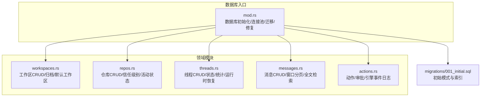
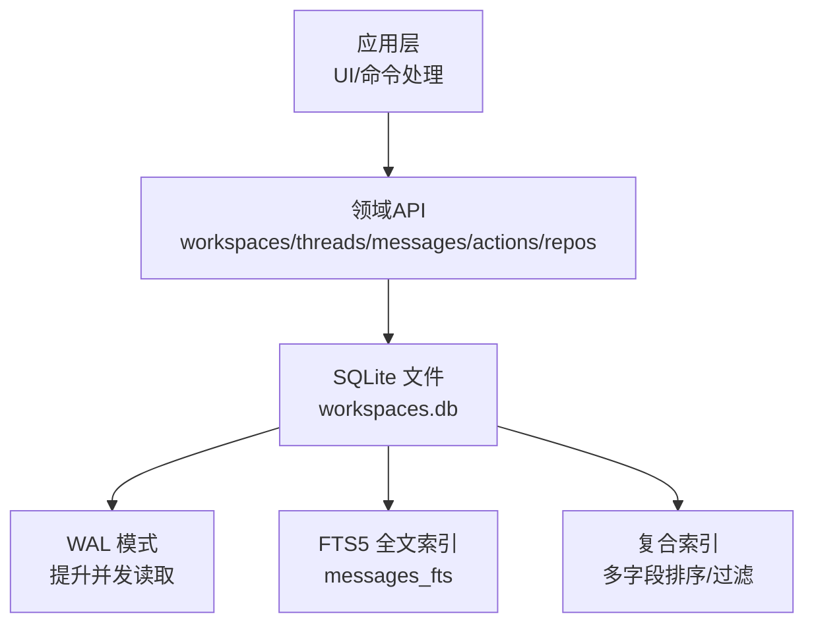
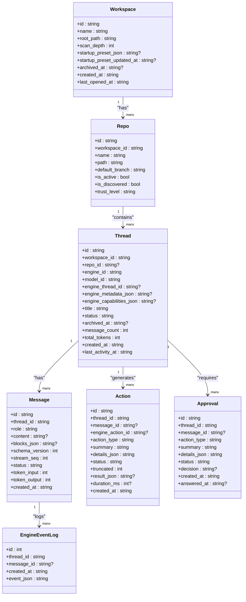
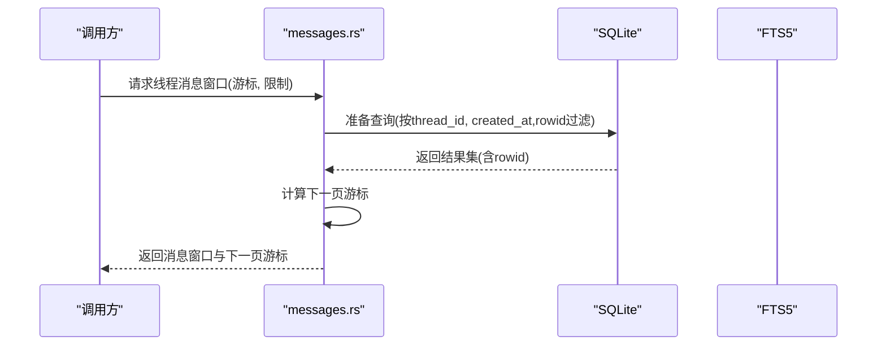
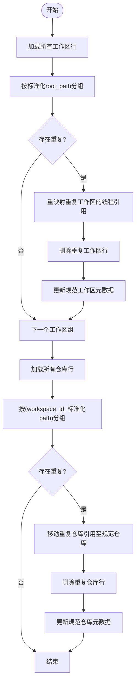
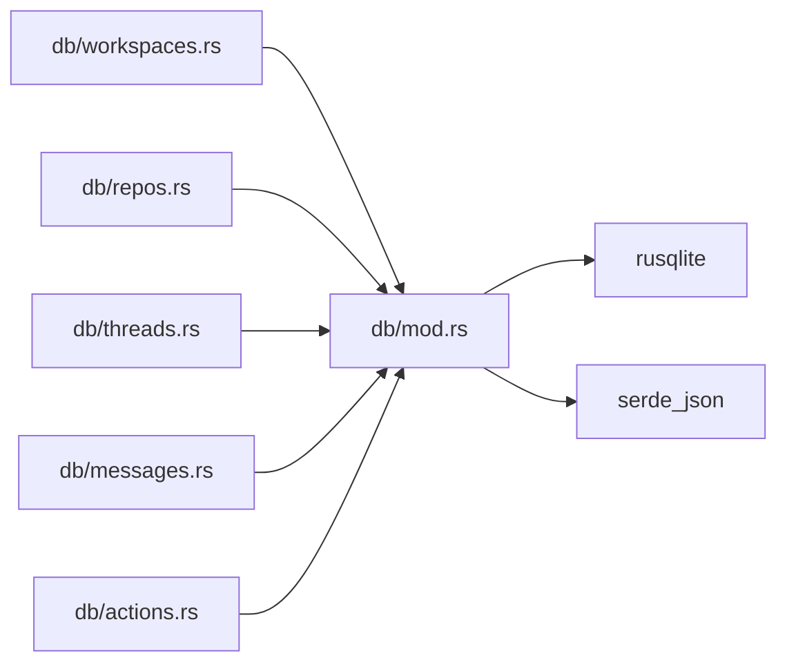

# 数据库设计

<cite>
**本文引用的文件**
- [src-tauri/src/db/mod.rs](file://src-tauri/src/db/mod.rs)
- [src-tauri/src/db/migrations/001_initial.sql](file://src-tauri/src/db/migrations/001_initial.sql)
- [src-tauri/src/db/messages.rs](file://src-tauri/src/db/messages.rs)
- [src-tauri/src/db/threads.rs](file://src-tauri/src/db/threads.rs)
- [src-tauri/src/db/workspaces.rs](file://src-tauri/src/db/workspaces.rs)
- [src-tauri/src/db/repos.rs](file://src-tauri/src/db/repos.rs)
- [src-tauri/src/db/actions.rs](file://src-tauri/src/db/actions.rs)
- [src-tauri/src/models.rs](file://src-tauri/src/models.rs)
</cite>

## 目录
1. [简介](#简介)
2. [项目结构](#项目结构)
3. [核心组件](#核心组件)
4. [架构总览](#架构总览)
5. [详细组件分析](#详细组件分析)
6. [依赖关系分析](#依赖关系分析)
7. [性能考量](#性能考量)
8. [故障排查指南](#故障排查指南)
9. [结论](#结论)
10. [附录](#附录)

## 简介
本文件系统化阐述 Panes 基于 SQLite 的数据库设计与实现，覆盖表结构、索引策略、约束定义、模式演进与版本管理、查询优化、事务隔离与并发控制、数据完整性保障、备份与恢复策略以及性能监控指标。目标是帮助开发者与运维人员全面理解数据库层的设计思想与最佳实践。

## 项目结构
数据库层位于 Tauri 后端的 Rust 模块中，采用“按功能域划分”的组织方式：每个领域（工作区、仓库、线程、消息、动作等）对应一个独立模块；公共的数据库连接池、迁移与修复逻辑集中在统一入口模块中。

图表来源
- [src-tauri/src/db/mod.rs:1-200](file://src-tauri/src/db/mod.rs#L1-L200)
- [src-tauri/src/db/migrations/001_initial.sql:1-132](file://src-tauri/src/db/migrations/001_initial.sql#L1-L132)

章节来源
- [src-tauri/src/db/mod.rs:1-200](file://src-tauri/src/db/mod.rs#L1-L200)
- [src-tauri/src/db/migrations/001_initial.sql:1-132](file://src-tauri/src/db/migrations/001_initial.sql#L1-L132)

## 核心组件
- 数据库实例与连接池
  - 单例式数据库实例负责应用数据目录迁移、数据库文件路径确定、初始化与迁移执行。
  - 连接池通过空闲队列复用 SQLite 连接，限制最大空闲数，避免频繁打开/关闭带来的开销。
- 迁移与列补全
  - 首次启动应用时执行初始迁移脚本；随后对既有表进行列补全（如归档时间戳、启动预设 JSON、信任级别、流序列号等），确保向后兼容。
- 路径修复与去重
  - 针对 Windows 路径差异（如带设备前缀与不带前缀）进行合并与引用重定向，消除重复记录并保持外键一致性。
- 查询与事务
  - 大多数读写操作封装在领域模块中，使用参数化 SQL 防止注入；关键流程采用显式事务，保证原子性与一致性。

章节来源
- [src-tauri/src/db/mod.rs:74-135](file://src-tauri/src/db/mod.rs#L74-L135)
- [src-tauri/src/db/mod.rs:137-149](file://src-tauri/src/db/mod.rs#L137-L149)
- [src-tauri/src/db/mod.rs:151-200](file://src-tauri/src/db/mod.rs#L151-L200)
- [src-tauri/src/db/mod.rs:253-449](file://src-tauri/src/db/mod.rs#L253-L449)

## 架构总览
数据库采用单文件 SQLite，结合 WAL 日志模式提升并发读取能力；通过连接池与 PRAGMA 配置优化性能与可靠性；迁移脚本与动态列补全共同维护模式演进；全文检索通过 FTS5 实现，配合触发器同步更新。

图表来源
- [src-tauri/src/db/mod.rs:137-149](file://src-tauri/src/db/mod.rs#L137-L149)
- [src-tauri/src/db/migrations/001_initial.sql:108-132](file://src-tauri/src/db/migrations/001_initial.sql#L108-L132)

## 详细组件分析

### 表结构与约束
- 工作区（workspaces）
  - 主键：id
  - 唯一：root_path
  - 可选归档时间戳 archived_at
  - 默认扫描深度 scan_depth
  - 启动预设 JSON 与更新时间
  - 创建/最近打开时间
- 仓库（repos）
  - 主键：id
  - 外键：workspace_id → workspaces(id)（级联删除）
  - 唯一：(workspace_id, path)
  - 活跃标志 is_active、发现标志 is_discovered、信任级别 trust_level
- 线程（threads）
  - 主键：id
  - 外键：workspace_id → workspaces(id)（级联删除）
  - 外键：repo_id → repos(id)（删除置空）
  - 状态 status、消息计数 message_count、token 总量 total_tokens
  - 引擎元数据 engine_metadata_json、能力 engine_capabilities_json
  - 归档时间戳 archived_at
- 消息（messages）
  - 主键：id
  - 外键：thread_id → threads(id)（级联删除）
  - 角色 role、内容 content、块数据 blocks_json
  - 流序列号 stream_seq、状态 status、schema_version
  - token 输入/输出统计
- 动作（actions）
  - 主键：id
  - 外键：thread_id → threads(id)（级联删除）
  - 关联消息 message_id（删除置空）
  - 结果 JSON、耗时 duration_ms、截断标记 truncated
- 审批（approvals）
  - 主键：id
  - 外键：thread_id → threads(id)（级联删除）
  - 关联消息 message_id（删除置空）
  - 决策 status/decision 与回答时间 answered_at
- 引擎事件日志（engine_event_logs）
  - 自增主键 id
  - 外键：thread_id → threads(id)（级联删除）
  - 关联消息 message_id（删除置空）
  - 事件 JSON

章节来源
- [src-tauri/src/db/migrations/001_initial.sql:1-132](file://src-tauri/src/db/migrations/001_initial.sql#L1-L132)

### 索引策略
- 单列索引
  - repos(workspace_id)
  - threads(workspace_id)
  - threads(repo_id)
  - messages(thread_id, created_at ASC)
  - actions(thread_id, created_at ASC)
  - approvals(thread_id, created_at ASC)
- 复合索引
  - threads(last_activity_at DESC)（配合 workspace_id）
  - threads(status, last_activity_at DESC)（按工作区+状态+活跃度排序）
  - messages(thread_id, status, created_at DESC)
  - actions(thread_id, status, created_at DESC)
  - approvals(message_id, status, created_at ASC)
- 全文检索
  - FTS5 虚拟表 messages_fts，基于 messages.content 建立可搜索文本，自动触发器同步插入/删除/更新

章节来源
- [src-tauri/src/db/migrations/001_initial.sql:96-132](file://src-tauri/src/db/migrations/001_initial.sql#L96-L132)

### 查询优化策略
- 使用复合索引覆盖常见查询模式（按工作区筛选、按活跃度倒序、按状态+活跃度组合排序）
- 分页窗口查询通过 rowid 与 created_at 组合游标，避免大偏移导致的性能退化
- 全文检索使用 FTS5 并限定作用域（仅针对当前工作区且未归档的线程）
- 批量删除/更新采用分块（chunk）策略，降低锁持有时间

章节来源
- [src-tauri/src/db/messages.rs:397-476](file://src-tauri/src/db/messages.rs#L397-L476)
- [src-tauri/src/db/messages.rs:637-682](file://src-tauri/src/db/messages.rs#L637-L682)
- [src-tauri/src/db/messages.rs:228-270](file://src-tauri/src/db/messages.rs#L228-L270)

### 事务隔离级别与并发控制
- 隔离级别
  - SQLite 默认使用一致性隔离级别，通过 WAL 模式提升并发读取能力，减少写入阻塞
- 并发控制
  - 连接池限制空闲连接数量，避免过多连接造成资源竞争
  - 关键业务流程（如路径修复、批量导入、滚动回滚）显式开启事务，确保原子性
  - PRAGMA 配置启用外键约束、设置 journal_mode=WAL、synchronous=NORMAL、temp_store=MEMORY，并设置 busy_timeout

章节来源
- [src-tauri/src/db/mod.rs:137-149](file://src-tauri/src/db/mod.rs#L137-L149)
- [src-tauri/src/db/mod.rs:98-121](file://src-tauri/src/db/mod.rs#L98-L121)

### 数据完整性保障
- 外键约束
  - threads.repo_id 删除置空；threads/thread_id 级联删除；messages/actions/approvals 对应删除
- 列补全与默认值
  - 新增列（如归档时间戳、启动预设 JSON、信任级别、流序列号、截断标记等）通过迁移阶段补齐
- 路径修复
  - 合并重复工作区/仓库（Windows 路径差异），重定向引用，删除冗余行，保持外键一致

章节来源
- [src-tauri/src/db/mod.rs:151-200](file://src-tauri/src/db/mod.rs#L151-L200)
- [src-tauri/src/db/mod.rs:253-449](file://src-tauri/src/db/mod.rs#L253-L449)

### 版本管理与模式演进
- 初始迁移
  - 执行初始 SQL 脚本，创建所有表与索引
- 运行时补丁
  - 逐项检查并添加缺失列，确保新旧版本平滑升级
- 路径修复
  - 在迁移完成后执行一次性的路径规范化与去重，解决历史遗留问题

章节来源
- [src-tauri/src/db/mod.rs:122-134](file://src-tauri/src/db/mod.rs#L122-L134)
- [src-tauri/src/db/mod.rs:151-200](file://src-tauri/src/db/mod.rs#L151-L200)
- [src-tauri/src/db/mod.rs:253-449](file://src-tauri/src/db/mod.rs#L253-L449)

### 备份与恢复策略
- 备份
  - 直接复制 SQLite 数据库文件（workspaces.db）即可完成完整备份
- 恢复
  - 将备份文件替换到应用数据目录下的同名文件，重启应用后会自动应用迁移与修复逻辑
- 注意事项
  - 建议在应用关闭状态下进行备份
  - 若数据库处于 WAL 模式，可同时备份 wal 文件以获得更一致的快照

章节来源
- [src-tauri/src/db/mod.rs:74-96](file://src-tauri/src/db/mod.rs#L74-L96)

### 性能监控指标
- 连接池健康
  - 空闲连接数量、最大空闲阈值
- 查询性能
  - 关键查询的执行计划与耗时（可通过 EXPLAIN QUERY PLAN 或外部工具）
- 存储与 IO
  - 数据库文件大小、WAL 文件大小、磁盘空间占用
- 事务与锁
  - busy_timeout 触发次数、长时间持有锁的事务识别

章节来源
- [src-tauri/src/db/mod.rs:21](file://src-tauri/src/db/mod.rs#L21)
- [src-tauri/src/db/mod.rs:137-149](file://src-tauri/src/db/mod.rs#L137-L149)

### 类图：领域模型与关系

图表来源
- [src-tauri/src/db/migrations/001_initial.sql:1-132](file://src-tauri/src/db/migrations/001_initial.sql#L1-L132)
- [src-tauri/src/models.rs:4-151](file://src-tauri/src/models.rs#L4-L151)

### 序列图：消息分页加载流程

图表来源
- [src-tauri/src/db/messages.rs:397-476](file://src-tauri/src/db/messages.rs#L397-L476)

### 流程图：路径修复与去重

图表来源
- [src-tauri/src/db/mod.rs:253-449](file://src-tauri/src/db/mod.rs#L253-L449)

## 依赖关系分析
- 模块耦合
  - 所有领域模块均依赖统一的 Database 实例与连接池
  - 迁移脚本与动态列补全逻辑集中于入口模块，被各领域模块间接受益
- 外部依赖
  - rusqlite 提供 SQLite 访问与事务支持
  - serde_json 用于 JSON 字段的序列化/反序列化
- 潜在风险
  - 大量参数化 SQL 降低了注入风险，但需持续审查复杂查询的索引覆盖情况
  - FTS5 依赖与触发器同步需确保在事务内执行，避免不一致

图表来源
- [src-tauri/src/db/mod.rs:1-20](file://src-tauri/src/db/mod.rs#L1-L20)
- [src-tauri/src/db/messages.rs:1-10](file://src-tauri/src/db/messages.rs#L1-L10)
- [src-tauri/src/db/actions.rs:1-10](file://src-tauri/src/db/actions.rs#L1-L10)

章节来源
- [src-tauri/src/db/mod.rs:1-20](file://src-tauri/src/db/mod.rs#L1-L20)
- [src-tauri/src/db/messages.rs:1-10](file://src-tauri/src/db/messages.rs#L1-L10)
- [src-tauri/src/db/actions.rs:1-10](file://src-tauri/src/db/actions.rs#L1-L10)

## 性能考量
- 索引设计
  - 针对高频查询（按工作区、活跃度、状态）建立复合索引，减少排序与过滤成本
- 查询模式
  - 使用游标分页避免 OFFSET 大偏移
  - 全文检索限定范围，避免跨工作区全表扫描
- IO 与缓存
  - WAL 模式提升并发读取；内存临时存储减少磁盘 IO
- 连接与锁
  - 连接池复用连接；批量操作分块执行，缩短锁持有时间

## 故障排查指南
- 迁移失败
  - 检查迁移脚本是否成功执行；确认列补全逻辑是否报错
- 路径异常
  - 观察是否存在重复工作区/仓库；运行路径修复流程后重试
- 查询缓慢
  - 使用 EXPLAIN QUERY PLAN 分析执行计划；补充或调整索引
- 锁等待超时
  - 检查 busy_timeout 设置；减少长事务；拆分批量操作

章节来源
- [src-tauri/src/db/mod.rs:122-134](file://src-tauri/src/db/mod.rs#L122-L134)
- [src-tauri/src/db/mod.rs:253-449](file://src-tauri/src/db/mod.rs#L253-L449)

## 结论
该数据库设计以 SQLite 为核心，结合 WAL、连接池与完善的迁移/修复机制，在保证数据一致性的同时兼顾了查询性能与并发能力。通过合理的索引策略与分页方案，满足聊天与线程场景下的高吞吐需求；通过 FTS5 实现高效全文检索；通过显式事务与外键约束确保关键业务流程的可靠性。

## 附录

### SQL 模式定义与索引设计示例（路径引用）
- 初始迁移脚本（包含表结构与索引）
  - [src-tauri/src/db/migrations/001_initial.sql](file://src-tauri/src/db/migrations/001_initial.sql)
- 全文检索虚拟表与触发器
  - [src-tauri/src/db/migrations/001_initial.sql:108-132](file://src-tauri/src/db/migrations/001_initial.sql#L108-L132)
- 复合索引示例
  - [src-tauri/src/db/migrations/001_initial.sql:96-107](file://src-tauri/src/db/migrations/001_initial.sql#L96-L107)

### 数据模型映射
- 领域 DTO 与数据库字段映射
  - [src-tauri/src/models.rs:4-151](file://src-tauri/src/models.rs#L4-L151)