# 数据架构

<cite>
**本文档引用的文件**
- [src-tauri/src/db/mod.rs](file://src-tauri/src/db/mod.rs)
- [src-tauri/src/db/migrations/001_initial.sql](file://src-tauri/src/db/migrations/001_initial.sql)
- [src-tauri/src/db/messages.rs](file://src-tauri/src/db/messages.rs)
- [src-tauri/src/db/threads.rs](file://src-tauri/src/db/threads.rs)
- [src-tauri/src/db/workspaces.rs](file://src-tauri/src/db/workspaces.rs)
- [src-tauri/src/db/repos.rs](file://src-tauri/src/db/repos.rs)
- [src-tauri/src/db/actions.rs](file://src-tauri/src/db/actions.rs)
- [src-tauri/src/models.rs](file://src-tauri/src/models.rs)
</cite>

## 更新摘要
**所做更改**
- 更新了数据库模式部分，反映新增的对话跟踪系统支持
- 添加了新的对话跟踪相关列和索引说明
- 更新了消息审计列的详细说明
- 增强了路径规范化和重复数据合并机制的描述
- 更新了数据库迁移管理的实现细节

## 目录
1. [简介](#简介)
2. [项目结构](#项目结构)
3. [核心组件](#核心组件)
4. [架构概览](#架构概览)
5. [详细组件分析](#详细组件分析)
6. [依赖关系分析](#依赖关系分析)
7. [性能考虑](#性能考虑)
8. [故障排除指南](#故障排除指南)
9. [结论](#结论)

## 简介

Panes 是一个基于 Tauri 和 Rust 构建的应用程序，采用 SQLite 作为主要数据存储引擎。该数据架构围绕三个核心实体构建：Workspace（工作空间）、Thread（对话线程）和 Message（消息），并通过 Actions（操作）和 Approvals（审批）机制支持复杂的交互流程。

**更新** 新增了对对话跟踪系统的全面支持，包括消息流序列号、引擎标识符跟踪和推理努力级别的管理。

本架构设计注重以下关键特性：
- 基于 SQLite 的本地持久化存储
- 完整的外键约束和数据完整性保证
- 高效的全文搜索功能
- 智能的路径规范化和重复数据合并
- 事务安全的操作和并发控制
- 全面的对话跟踪和审计功能

## 项目结构

数据架构采用模块化设计，每个数据库表都有对应的模块进行管理：

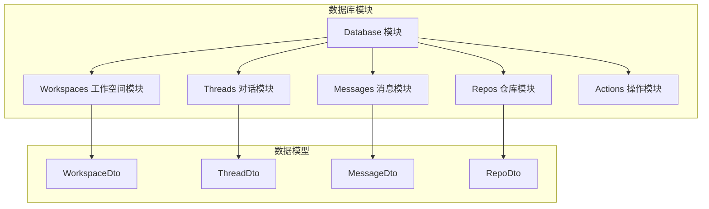

**图表来源**
- [src-tauri/src/db/mod.rs:1-135](file://src-tauri/src/db/mod.rs#L1-L135)
- [src-tauri/src/db/workspaces.rs:15-58](file://src-tauri/src/db/workspaces.rs#L15-L58)
- [src-tauri/src/db/threads.rs:15-33](file://src-tauri/src/db/threads.rs#L15-L33)

**章节来源**
- [src-tauri/src/db/mod.rs:1-135](file://src-tauri/src/db/mod.rs#L1-L135)
- [src-tauri/src/db/migrations/001_initial.sql:1-132](file://src-tauri/src/db/migrations/001_initial.sql#L1-L132)

## 核心组件

### 数据库连接池管理

系统实现了高效的 SQLite 连接池管理，通过 `ConnectionPool` 结构体实现连接复用：

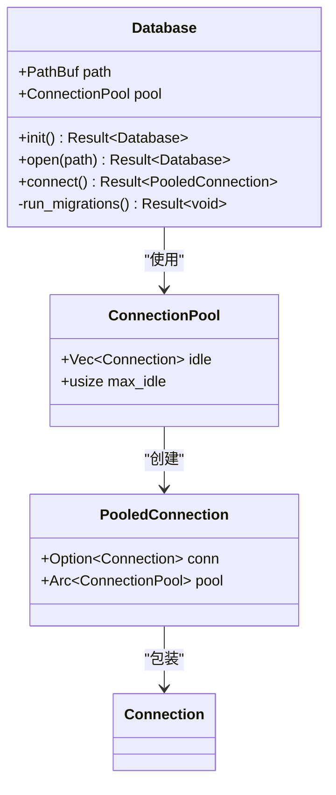

**图表来源**
- [src-tauri/src/db/mod.rs:23-72](file://src-tauri/src/db/mod.rs#L23-L72)

### 数据模型映射

所有数据库表都对应着清晰的数据传输对象（DTO），确保类型安全和序列化一致性：

**章节来源**
- [src-tauri/src/db/mod.rs:227-251](file://src-tauri/src/db/mod.rs#L227-L251)
- [src-tauri/src/models.rs:4-13](file://src-tauri/src/models.rs#L4-L13)
- [src-tauri/src/models.rs:15-25](file://src-tauri/src/models.rs#L15-L25)
- [src-tauri/src/models.rs:59-75](file://src-tauri/src/models.rs#L59-L75)
- [src-tauri/src/models.rs:153-168](file://src-tauri/src/models.rs#L153-L168)

## 架构概览

### 数据库模式设计

Panes 使用标准化的关系型数据库设计，包含以下核心表。**更新** 新增了对话跟踪相关的列和索引：

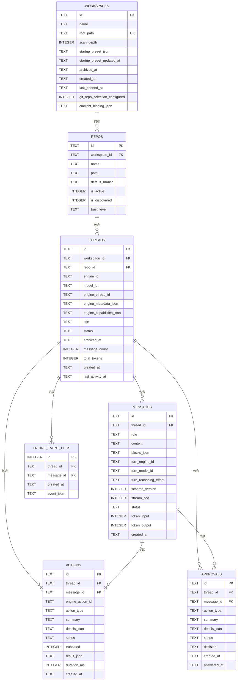

**图表来源**
- [src-tauri/src/db/migrations/001_initial.sql:1-132](file://src-tauri/src/db/migrations/001_initial.sql#L1-L132)

### 外键约束和级联操作

系统采用严格的外键约束确保数据完整性：

- **工作空间到仓库**：`ON DELETE CASCADE` - 删除工作空间时自动删除其所有仓库
- **仓库到对话**：`ON DELETE SET NULL` - 删除仓库时将相关对话的仓库字段设为空
- **对话到消息**：`ON DELETE CASCADE` - 删除对话时自动删除其所有消息
- **对话到操作**：`ON DELETE CASCADE` - 删除对话时自动删除其所有操作
- **对话到审批**：`ON DELETE CASCADE` - 删除对话时自动删除其所有审批

**章节来源**
- [src-tauri/src/db/migrations/001_initial.sql:13-41](file://src-tauri/src/db/migrations/001_initial.sql#L13-L41)

### 对话跟踪系统

**新增** 系统现在支持完整的对话跟踪功能，包括：

- **消息流序列号** (`stream_seq`)：跟踪消息的流式传输顺序
- **引擎标识符跟踪** (`turn_engine_id`, `turn_model_id`)：记录每次对话轮次使用的引擎和模型
- **推理努力级别** (`turn_reasoning_effort`)：跟踪推理过程的计算强度
- **引擎能力元数据**：存储引擎特定的功能和限制信息

**章节来源**
- [src-tauri/src/db/mod.rs:179-226](file://src-tauri/src/db/mod.rs#L179-L226)
- [src-tauri/src/db/migrations/001_initial.sql:49-51](file://src-tauri/src/db/migrations/001_initial.sql#L49-L51)

## 详细组件分析

### 工作空间管理模块

工作空间模块负责管理用户的工作环境配置和状态：

#### 核心功能
- **工作空间创建和更新**：支持路径规范化和扫描深度配置
- **归档和恢复**：提供工作空间的归档和恢复功能
- **默认工作空间选择**：智能选择合适的默认工作空间根目录
- **Git 仓库选择配置**：跟踪 Git 仓库的选择状态
- **CueLight 绑定配置**：支持 CueLight 项目的绑定管理

#### 路径规范化机制

系统实现了智能的路径规范化，处理 Windows 特定的路径格式问题：

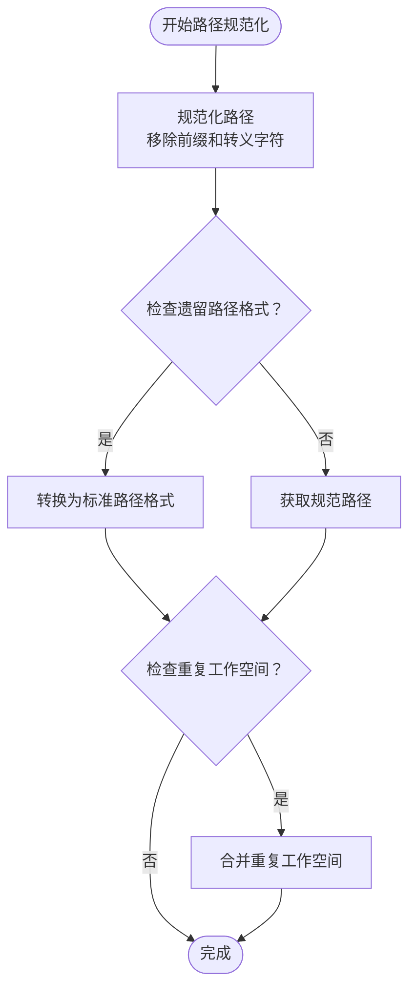

**图表来源**
- [src-tauri/src/db/mod.rs:253-262](file://src-tauri/src/db/mod.rs#L253-L262)
- [src-tauri/src/db/mod.rs:264-294](file://src-tauri/src/db/mod.rs#L264-L294)

**章节来源**
- [src-tauri/src/db/workspaces.rs:15-58](file://src-tauri/src/db/workspaces.rs#L15-L58)
- [src-tauri/src/db/workspaces.rs:202-255](file://src-tauri/src/db/workspaces.rs#L202-L255)

### 仓库管理模块

仓库模块负责管理与 Git 仓库的集成和配置：

#### 仓库发现和管理
- **智能仓库发现**：自动扫描工作空间中的 Git 仓库
- **信任级别管理**：支持受信任、标准和受限三种信任级别
- **活动状态跟踪**：维护活跃仓库的状态信息
- **发现状态管理**：跟踪仓库是否被系统发现

#### 仓库路径解析

系统提供了强大的仓库路径解析功能，支持跨工作空间的仓库查找：

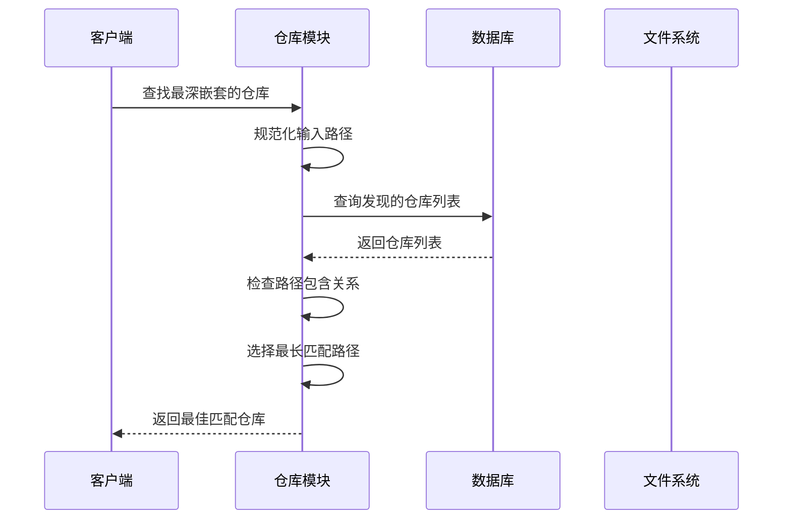

**图表来源**
- [src-tauri/src/db/repos.rs:220-274](file://src-tauri/src/db/repos.rs#L220-L274)

**章节来源**
- [src-tauri/src/db/repos.rs:12-79](file://src-tauri/src/db/repos.rs#L12-L79)
- [src-tauri/src/db/repos.rs:101-154](file://src-tauri/src/db/repos.rs#L101-L154)

### 对话线程管理模块

对话线程模块管理用户的聊天会话和状态：

#### 线程状态管理
- **状态枚举**：支持空闲、流式传输、等待审批、错误和完成状态
- **运行时恢复**：自动检测和恢复中断的对话状态
- **计数器管理**：维护消息数量和令牌使用统计
- **引擎能力管理**：跟踪和存储引擎特定的功能信息

#### 运行时恢复机制

系统实现了智能的运行时恢复，确保应用重启后对话状态的一致性：

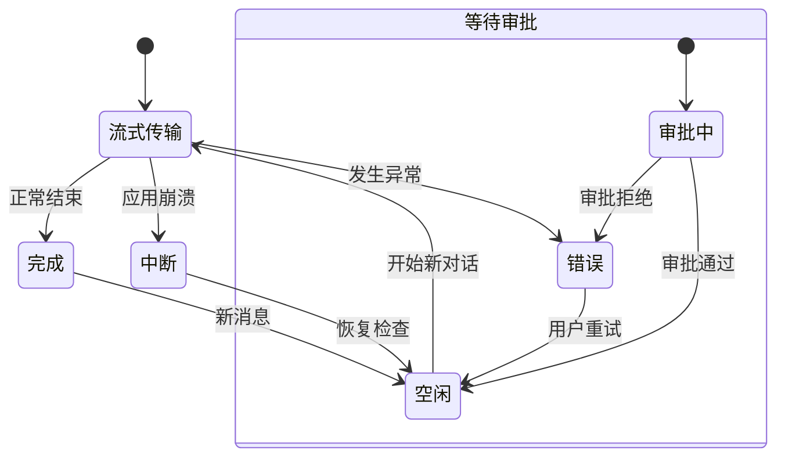

**图表来源**
- [src-tauri/src/db/threads.rs:314-367](file://src-tauri/src/db/threads.rs#L314-L367)
- [src-tauri/src/models.rs:121-129](file://src-tauri/src/models.rs#L121-L129)

**章节来源**
- [src-tauri/src/db/threads.rs:9-141](file://src-tauri/src/db/threads.rs#L9-L141)
- [src-tauri/src/db/threads.rs:314-413](file://src-tauri/src/db/threads.rs#L314-L413)

### 消息管理模块

消息模块是数据架构的核心，负责管理所有对话内容：

#### 消息状态管理
- **状态枚举**：支持已完成、流式传输、中断和错误状态
- **令牌使用统计**：精确跟踪输入和输出令牌使用量
- **块结构管理**：支持复杂的消息块结构，包括审批和操作块
- **对话跟踪集成**：与对话跟踪系统无缝集成

#### 全文搜索功能

系统集成了 SQLite FTS5 全文搜索引擎，提供高效的搜索能力：

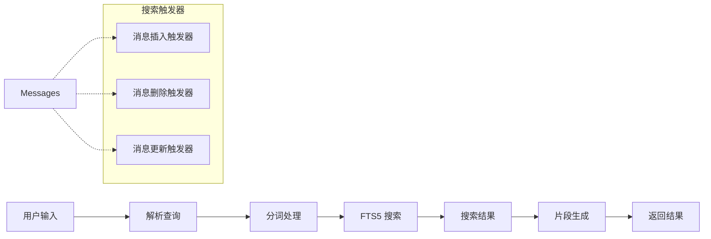

**图表来源**
- [src-tauri/src/db/migrations/001_initial.sql:108-131](file://src-tauri/src/db/migrations/001_initial.sql#L108-L131)
- [src-tauri/src/db/messages.rs:637-682](file://src-tauri/src/db/messages.rs#L637-L682)

#### 消息审计功能

**新增** 系统现在提供完整的消息审计功能：

- **流序列号跟踪**：精确跟踪消息的流式传输顺序
- **引擎标识符记录**：记录每次消息使用的具体引擎和模型
- **推理努力级别**：跟踪推理过程的计算强度和资源消耗
- **Schema 版本管理**：支持消息格式的向后兼容性

**章节来源**
- [src-tauri/src/db/messages.rs:16-28](file://src-tauri/src/db/messages.rs#L16-L28)
- [src-tauri/src/db/messages.rs:376-395](file://src-tauri/src/db/messages.rs#L376-L395)
- [src-tauri/src/db/messages.rs:637-794](file://src-tauri/src/db/messages.rs#L637-L794)

### 操作和审批模块

操作和审批模块管理用户需要批准的操作：

#### 审批状态管理
- **状态跟踪**：支持待定、已回答和解决状态
- **决策记录**：记录审批决策和时间戳
- **块结构集成**：在消息块中显示审批状态
- **截断状态管理**：跟踪操作结果是否被截断

#### 操作生命周期

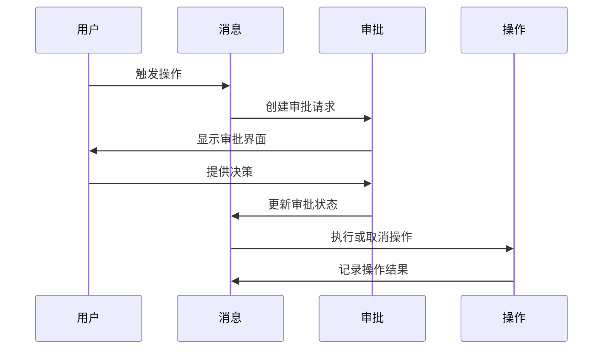

**图表来源**
- [src-tauri/src/db/actions.rs:100-111](file://src-tauri/src/db/actions.rs#L100-L111)
- [src-tauri/src/db/messages.rs:588-635](file://src-tauri/src/db/messages.rs#L588-L635)

**章节来源**
- [src-tauri/src/db/actions.rs:9-98](file://src-tauri/src/db/actions.rs#L9-L98)
- [src-tauri/src/db/messages.rs:588-1093](file://src-tauri/src/db/messages.rs#L588-L1093)

### 数据库迁移管理系统

**更新** 系统采用了增强的数据库迁移管理机制：

#### 动态列管理
系统实现了智能的列添加机制，确保数据库模式的演进：

- **架构列管理**：动态添加 `archived_at` 列支持归档功能
- **Git 集成列**：添加 `git_repo_selection_configured` 支持 Git 仓库选择
- **运行时列**：添加 `engine_capabilities_json` 存储引擎能力
- **消息审计列**：动态添加 `turn_engine_id`、`turn_model_id`、`turn_reasoning_effort`
- **CueLight 支持**：添加 `cuelight_binding_json` 支持 CueLight 集成

#### 路径修复机制
系统提供了完整的路径修复功能，处理不同平台的路径格式差异：

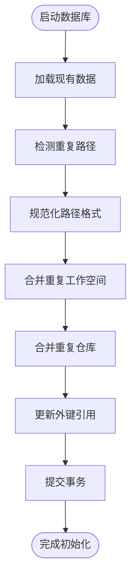

**图表来源**
- [src-tauri/src/db/mod.rs:259-268](file://src-tauri/src/db/mod.rs#L259-L268)
- [src-tauri/src/db/mod.rs:270-336](file://src-tauri/src/db/mod.rs#L270-L336)

**章节来源**
- [src-tauri/src/db/mod.rs:152-231](file://src-tauri/src/db/mod.rs#L152-L231)
- [src-tauri/src/db/mod.rs:259-466](file://src-tauri/src/db/mod.rs#L259-L466)

## 依赖关系分析

### 数据访问层设计

系统采用分层的数据访问模式，每张表都有专门的模块：

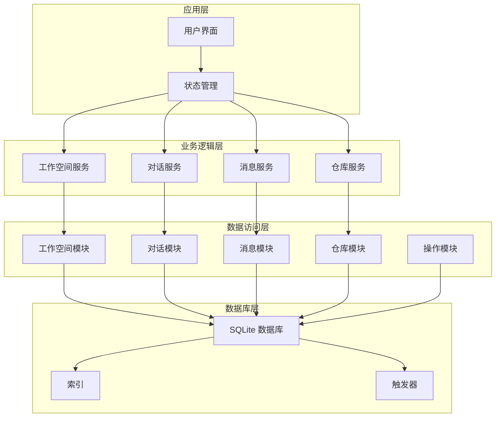

**图表来源**
- [src-tauri/src/db/mod.rs:15-19](file://src-tauri/src/db/mod.rs#L15-L19)

### 外部依赖关系

系统的主要外部依赖包括：
- **rusqlite**：SQLite 数据库绑定
- **serde_json**：JSON 序列化和反序列化
- **uuid**：唯一标识符生成
- **chrono**：时间戳处理

**章节来源**
- [src-tauri/src/db/messages.rs:1-7](file://src-tauri/src/db/messages.rs#L1-L7)
- [src-tauri/src/db/mod.rs:1-13](file://src-tauri/src/db/mod.rs#L1-L13)

## 性能考虑

### 连接池优化

系统实现了智能的连接池管理，通过以下机制优化性能：

- **最大空闲连接数**：限制同时保持的空闲连接数量
- **连接复用**：避免频繁创建和销毁数据库连接
- **自动清理**：超出限制的连接会被自动清理

### 索引策略

系统针对高频查询场景建立了专门的索引：

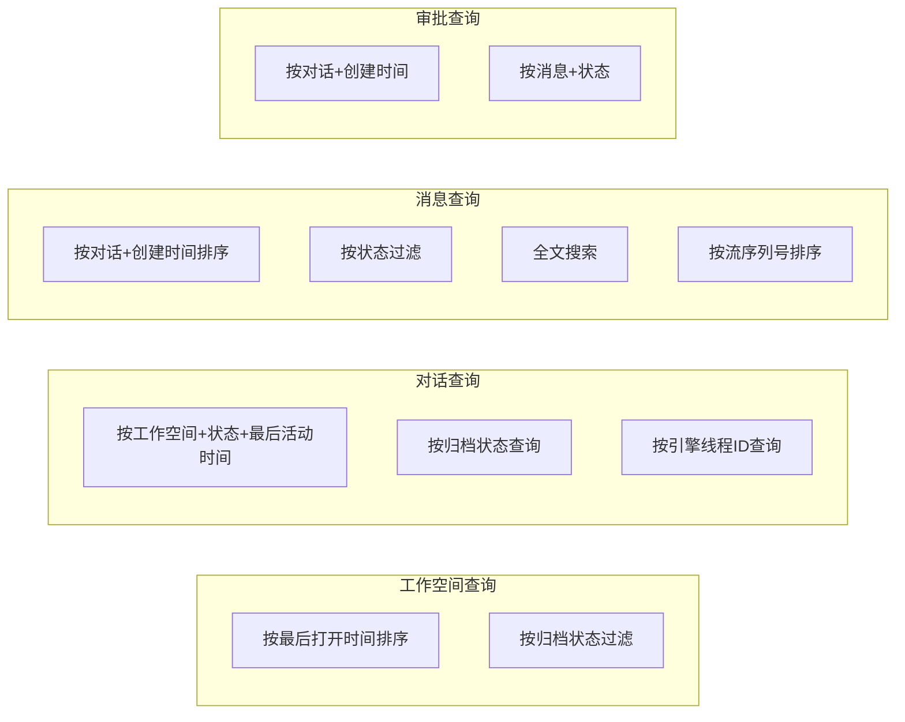

**图表来源**
- [src-tauri/src/db/migrations/001_initial.sql:96-106](file://src-tauri/src/db/migrations/001_initial.sql#L96-L106)

### 查询优化技术

#### 分页查询
系统实现了高效的分页查询机制，支持游标驱动的分页：

```rust
// 查询窗口函数用于高效分页
"SELECT id, thread_id, role, content, blocks_json, schema_version, status,
    token_input, token_output, turn_engine_id, turn_model_id, turn_reasoning_effort, created_at, rowid
 FROM messages
 WHERE thread_id = ?1
   AND (
     ?2 IS NULL
     OR created_at < ?2
     OR (
       created_at = ?2
       AND (
         (?3 IS NOT NULL AND rowid < ?3)
         OR (?3 IS NULL AND ?4 IS NOT NULL AND id < ?4)
       )
     )
   )
 ORDER BY created_at DESC, rowid DESC
 LIMIT ?5"
```

#### 批量操作
对于大量数据的删除和更新，系统使用批量操作减少数据库往返：

#### 对话跟踪优化
**新增** 系统针对对话跟踪进行了专门的查询优化：

- **流序列号索引**：支持按流顺序的快速检索
- **引擎标识符索引**：优化特定引擎的查询性能
- **推理努力级别过滤**：支持基于计算强度的查询

**章节来源**
- [src-tauri/src/db/messages.rs:232-260](file://src-tauri/src/db/messages.rs#L232-L260)
- [src-tauri/src/db/messages.rs:402-476](file://src-tauri/src/db/messages.rs#L402-L476)

### 并发控制

系统通过以下机制确保并发安全性：

- **事务隔离**：所有批量操作都在事务中执行
- **连接池同步**：使用互斥锁保护连接池状态
- **原子操作**：关键更新操作使用原子性保证

**章节来源**
- [src-tauri/src/db/mod.rs:57-72](file://src-tauri/src/db/mod.rs#L57-L72)
- [src-tauri/src/db/messages.rs:86-131](file://src-tauri/src/db/messages.rs#L86-L131)

## 故障排除指南

### 常见问题诊断

#### 数据库初始化失败
- **症状**：应用启动时报数据库初始化错误
- **原因**：权限不足或路径不存在
- **解决方案**：检查应用程序数据目录权限

#### 路径冲突问题
- **症状**：工作空间或仓库路径显示不正确
- **原因**：Windows 路径格式差异导致的重复条目
- **解决方案**：系统会自动进行路径规范化和合并

#### 搜索结果不准确
- **症状**：全文搜索返回意外的结果
- **原因**：FTS5 索引可能过期
- **解决方案**：重新建立搜索索引或重启应用

#### 对话跟踪异常
- **症状**：消息流序列号混乱或引擎标识符丢失
- **原因**：数据库迁移过程中缺少必要的列
- **解决方案**：运行数据库迁移以添加缺失的列

### 性能监控

系统提供了以下监控指标：

- **连接池利用率**：监控数据库连接使用情况
- **查询响应时间**：记录关键查询的执行时间
- **磁盘使用量**：跟踪数据库文件大小增长
- **对话跟踪性能**：监控消息流序列号的处理效率

**章节来源**
- [src-tauri/src/db/mod.rs:137-149](file://src-tauri/src/db/mod.rs#L137-L149)
- [src-tauri/src/db/messages.rs:178-186](file://src-tauri/src/db/messages.rs#L178-L186)

## 结论

Panes 的数据架构设计体现了现代桌面应用的最佳实践：

### 设计优势
- **类型安全**：完整的 Rust 类型系统确保编译时错误检测
- **数据完整性**：严格的外键约束和事务保证数据一致性
- **性能优化**：智能索引和连接池提升查询效率
- **可扩展性**：模块化设计便于功能扩展和维护
- **对话跟踪**：完整的对话生命周期管理支持

### 技术亮点
- **智能路径管理**：自动处理不同平台的路径格式差异
- **全文搜索**：集成 FTS5 提供高效的文本搜索能力
- **状态恢复**：完善的运行时状态恢复机制
- **并发安全**：线程安全的设计确保多线程环境下的稳定性
- **审计追踪**：全面的消息审计功能支持合规性要求

### 新增功能
**更新** 最新的数据库架构增强了以下功能：
- **对话跟踪系统**：支持完整的对话生命周期追踪
- **引擎能力管理**：动态管理不同引擎的功能特性
- **消息审计功能**：精确记录每次对话轮次的技术细节
- **智能迁移管理**：自动处理数据库模式的演进

该架构为 Panes 提供了可靠、高性能且易于维护的数据存储解决方案，能够满足复杂对话应用的各种需求，特别是在支持新的对话跟踪系统方面表现卓越。