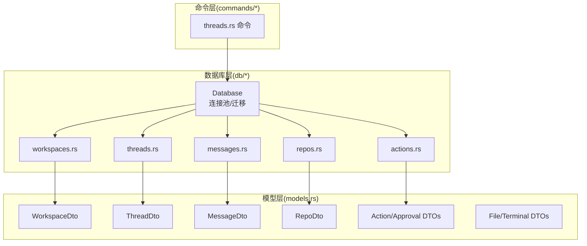
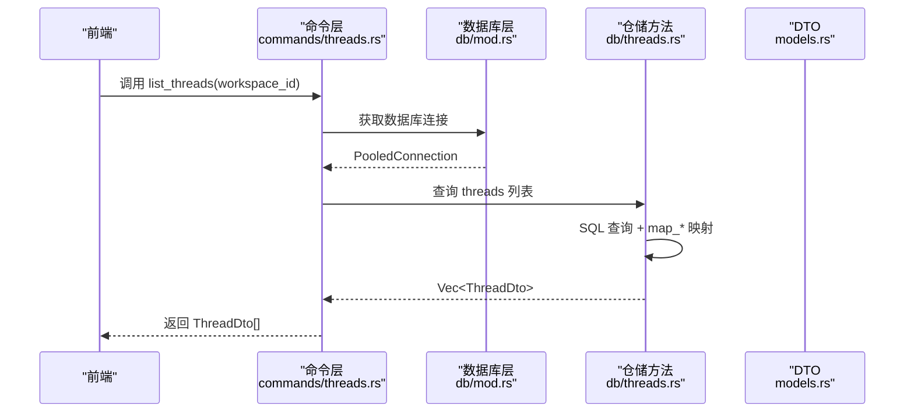
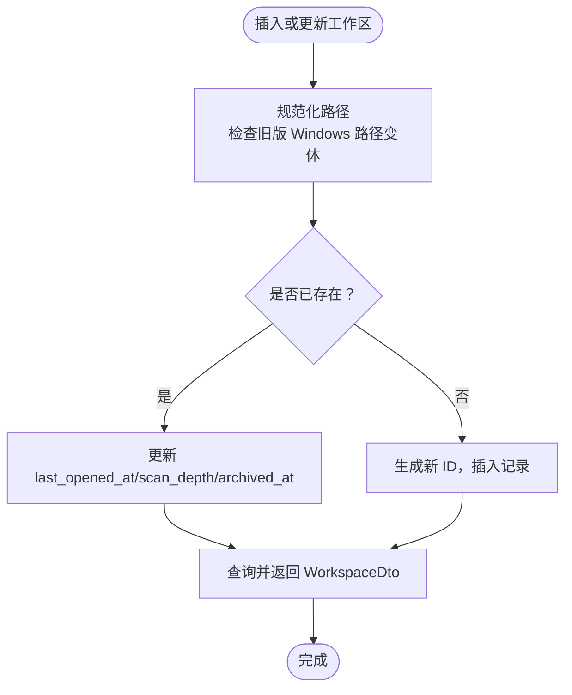
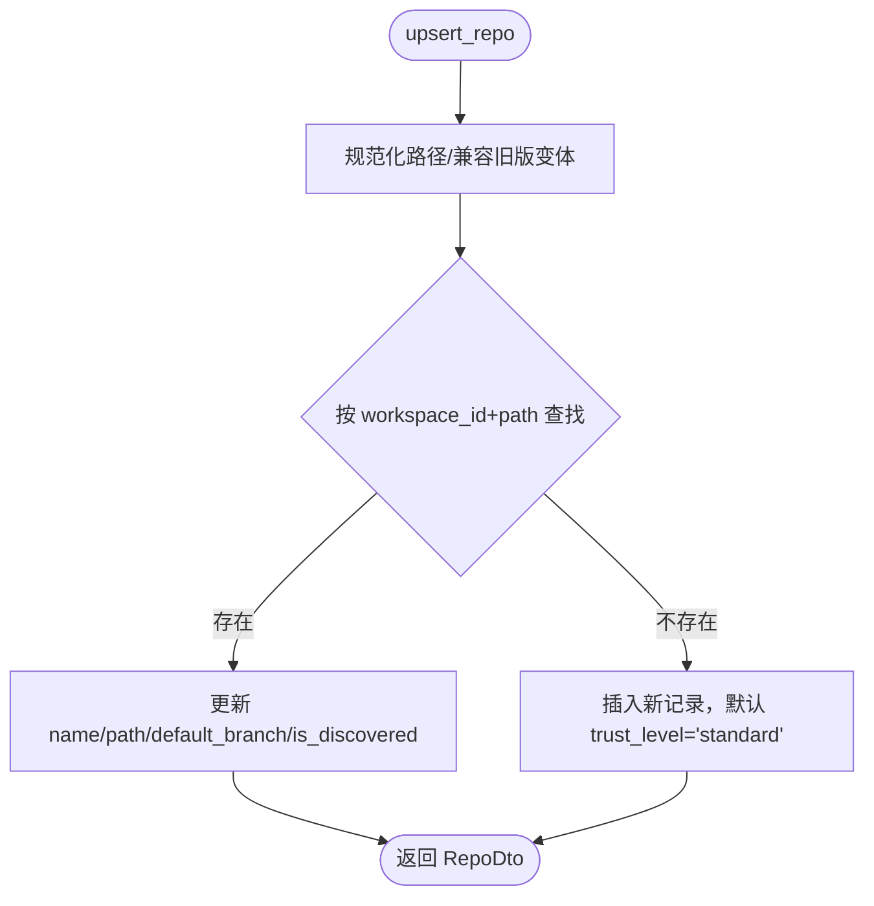
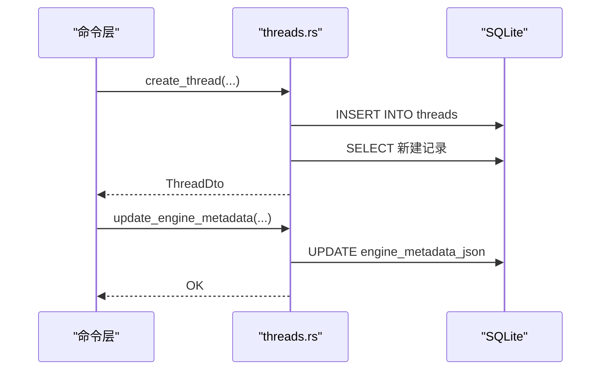
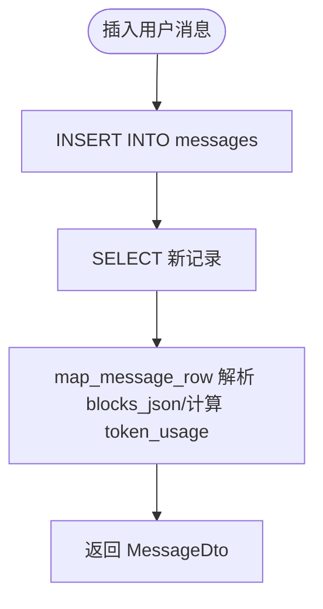
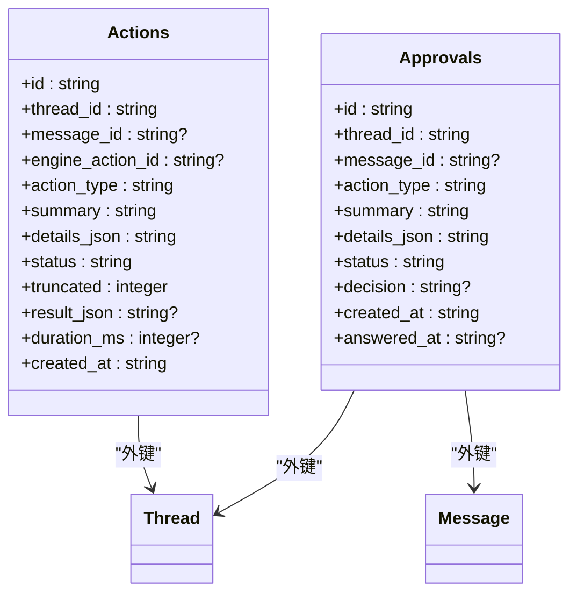
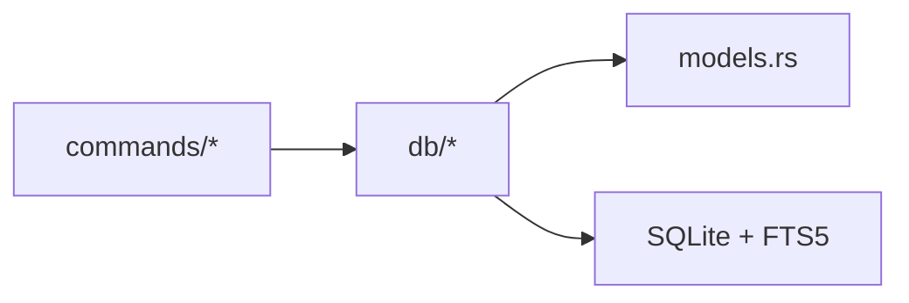

# 数据模型

<cite>
**本文档引用的文件**
- [models.rs](file://src-tauri/src/models.rs)
- [db/mod.rs](file://src-tauri/src/db/mod.rs)
- [db/workspaces.rs](file://src-tauri/src/db/workspaces.rs)
- [db/threads.rs](file://src-tauri/src/db/threads.rs)
- [db/messages.rs](file://src-tauri/src/db/messages.rs)
- [db/repos.rs](file://src-tauri/src/db/repos.rs)
- [db/actions.rs](file://src-tauri/src/db/actions.rs)
- [db/migrations/001_initial.sql](file://src-tauri/src/db/migrations/001_initial.sql)
- [commands/threads.rs](file://src-tauri/src/commands/threads.rs)
</cite>

## 目录
1. [简介](#简介)
2. [项目结构](#项目结构)
3. [核心组件](#核心组件)
4. [架构总览](#架构总览)
5. [详细组件分析](#详细组件分析)
6. [依赖分析](#依赖分析)
7. [性能考虑](#性能考虑)
8. [故障排查指南](#故障排查指南)
9. [结论](#结论)

## 简介
本文件系统性梳理 Panes 的数据模型与持久化层，覆盖以下核心业务实体：
- Workspace（工作区）
- Thread（会话线程）
- Message（消息）
- Repo（仓库）及与 Workspace 的关联
- Actions/Approvals（动作与审批）
- 文件树与终端相关 DTO（用于扩展场景）

重点说明：
- Rust 结构体与数据库表之间的映射关系
- DTO 的序列化策略与 API 响应格式
- 数据验证规则与向后兼容机制
- 扩展点设计与版本演进策略

## 项目结构
围绕数据模型的关键文件组织如下：
- 模型定义：src-tauri/src/models.rs（包含所有 DTO）
- 数据库层：src-tauri/src/db/*（连接池、迁移、仓储方法）
- 命令层：src-tauri/src/commands/*（对外 API 命令，调用数据库层并返回 DTO）

图示来源
- [models.rs:1-1043](file://src-tauri/src/models.rs#L1-L1043)
- [db/mod.rs:1-135](file://src-tauri/src/db/mod.rs#L1-L135)
- [db/workspaces.rs:1-564](file://src-tauri/src/db/workspaces.rs#L1-L564)
- [db/threads.rs:1-589](file://src-tauri/src/db/threads.rs#L1-L589)
- [db/messages.rs:1-1767](file://src-tauri/src/db/messages.rs#L1-L1767)
- [db/repos.rs:1-551](file://src-tauri/src/db/repos.rs#L1-L551)
- [db/actions.rs:1-187](file://src-tauri/src/db/actions.rs#L1-L187)
- [commands/threads.rs:1-200](file://src-tauri/src/commands/threads.rs#L1-L200)

章节来源
- [models.rs:1-1043](file://src-tauri/src/models.rs#L1-L1043)
- [db/mod.rs:1-135](file://src-tauri/src/db/mod.rs#L1-L135)
- [commands/threads.rs:1-200](file://src-tauri/src/commands/threads.rs#L1-L200)

## 核心组件
本节聚焦于核心业务实体的字段定义、数据类型、关系映射与序列化策略。

- Workspace（工作区）
  - 字段：id(String)、name(String)、root_path(String)、scan_depth(i64)、startup_preset_json/updated_at(String?)、git_repo_selection_configured(bool)、archived_at(String?)、created_at/last_opened_at(String)
  - 关系：一对多到 Repo；一对多到 Thread
  - 序列化：camelCase
  - 参考：[WorkspaceDto:6-13](file://src-tauri/src/models.rs#L6-L13)，[workspaces 表结构:1-11](file://src-tauri/src/db/migrations/001_initial.sql#L1-L11)

- Repo（仓库）
  - 字段：id(String)、workspace_id(String)、name(String)、path(String)、default_branch(String)、is_active/is_discovered(bool)、trust_level(String 枚举)
  - 关系：多对一到 Workspace；一对多到 Thread（通过 repo_id）
  - 序列化：camelCase
  - 参考：[RepoDto:17-25](file://src-tauri/src/models.rs#L17-L25)，[repos 表结构:13-23](file://src-tauri/src/db/migrations/001_initial.sql#L13-L23)

- Thread（会话线程）
  - 字段：id(String)、workspace_id(String)、repo_id(String?)、engine_id(String)、model_id(String)、engine_thread_id(String?)、engine_metadata_json(String?)、title(String)、status(String 枚举)、message_count/total_tokens(i64)、archived_at(String?)、created_at/last_activity_at(String)
  - 关系：多对一到 Workspace；可选多对一到 Repo；一对多到 Message
  - 序列化：camelCase
  - 参考：[ThreadDto:61-75](file://src-tauri/src/models.rs#L61-L75)，[threads 表结构:25-41](file://src-tauri/src/db/migrations/001_initial.sql#L25-L41)

- Message（消息）
  - 字段：id(String)、thread_id(String)、role(String)、content(String?)、blocks_json(String?)、turn_engine_id/turn_model_id/turn_reasoning_effort(String?)、schema_version(i64)、status(String 枚举)、token_input/token_output(i64)、created_at(String)
  - 关系：多对一到 Thread
  - 序列化：camelCase
  - 参考：[MessageDto:155-168](file://src-tauri/src/models.rs#L155-L168)，[messages 表结构:43-58](file://src-tauri/src/db/migrations/001_initial.sql#L43-L58)

- Actions/Approvals（动作与审批）
  - Actions：id、thread_id、message_id、engine_action_id、action_type、summary、details_json、status、truncated、result_json、duration_ms、created_at
  - Approvals：id、thread_id、message_id、action_type、summary、details_json、status、decision、created_at、answered_at
  - 关系：分别与 Thread 和 Message 关联
  - 参考：[actions 表结构:60-73](file://src-tauri/src/db/migrations/001_initial.sql#L60-L73)，[approvals 表结构:75-86](file://src-tauri/src/db/migrations/001_initial.sql#L75-L86)，[actions.rs:1-187](file://src-tauri/src/db/actions.rs#L1-L187)

- 文件树与终端相关 DTO（扩展场景）
  - FileTreeEntryDto/FileTreePageDto、Terminal* 系列 DTO
  - 参考：[models.rs:808-906](file://src-tauri/src/models.rs#L808-L906)

章节来源
- [models.rs:1-1043](file://src-tauri/src/models.rs#L1-L1043)
- [db/migrations/001_initial.sql:1-132](file://src-tauri/src/db/migrations/001_initial.sql#L1-L132)

## 架构总览
数据流从命令层进入，经由数据库层的仓储方法访问 SQLite，并通过映射函数将数据库行转换为 DTO 返回给前端。

图示来源
- [commands/threads.rs:32-52](file://src-tauri/src/commands/threads.rs#L32-L52)
- [db/mod.rs:74-112](file://src-tauri/src/db/mod.rs#L74-L112)
- [db/threads.rs:68-95](file://src-tauri/src/db/threads.rs#L68-L95)

章节来源
- [commands/threads.rs:1-200](file://src-tauri/src/commands/threads.rs#L1-L200)
- [db/mod.rs:1-135](file://src-tauri/src/db/mod.rs#L1-L135)
- [db/threads.rs:1-120](file://src-tauri/src/db/threads.rs#L1-L120)

## 详细组件分析

### 工作区（Workspace）模型
- 数据库表：workspaces（主键 id，唯一 root_path，带索引）
- 仓储方法：upsert/list/archive/restore/find/get/set 启动预设等
- 映射：map_workspace_row 将数据库行映射为 WorkspaceDto
- 验证与兼容：路径规范化、默认扫描深度、归档时间字段

图示来源
- [db/workspaces.rs:15-58](file://src-tauri/src/db/workspaces.rs#L15-L58)
- [db/migrations/001_initial.sql:1-11](file://src-tauri/src/db/migrations/001_initial.sql#L1-L11)

章节来源
- [db/workspaces.rs:1-200](file://src-tauri/src/db/workspaces.rs#L1-L200)
- [db/migrations/001_initial.sql:1-11](file://src-tauri/src/db/migrations/001_initial.sql#L1-L11)

### 仓库（Repo）模型
- 数据库表：repos（外键 workspace_id，唯一约束 workspace_id+path）
- 仓储方法：upsert/reconcile/find_deepest_repo 等
- 映射：map_repo_row 将数据库行映射为 RepoDto
- 验证与兼容：信任级别枚举、发现状态、路径规范化

图示来源
- [db/repos.rs:12-79](file://src-tauri/src/db/repos.rs#L12-L79)
- [db/migrations/001_initial.sql:13-23](file://src-tauri/src/db/migrations/001_initial.sql#L13-L23)

章节来源
- [db/repos.rs:1-200](file://src-tauri/src/db/repos.rs#L1-L200)
- [db/migrations/001_initial.sql:13-23](file://src-tauri/src/db/migrations/001_initial.sql#L13-L23)

### 会话线程（Thread）模型
- 数据库表：threads（外键 workspace_id/repo_id，状态/计数字段）
- 仓储方法：create/get/find/list/archive/restore/update_engine_metadata/bump_message_counters 等
- 映射：map_thread_row 将数据库行映射为 ThreadDto，含状态枚举转换
- 验证与兼容：引擎元数据 JSON、手动标题锁定逻辑、运行时恢复

图示来源
- [db/threads.rs:15-33](file://src-tauri/src/db/threads.rs#L15-L33)
- [db/threads.rs:209-221](file://src-tauri/src/db/threads.rs#L209-L221)
- [db/migrations/001_initial.sql:25-41](file://src-tauri/src/db/migrations/001_initial.sql#L25-L41)

章节来源
- [db/threads.rs:1-200](file://src-tauri/src/db/threads.rs#L1-L200)
- [db/migrations/001_initial.sql:25-41](file://src-tauri/src/db/migrations/001_initial.sql#L25-L41)

### 消息（Message）模型
- 数据库表：messages（外键 thread_id，FTS 支持）
- 仓储方法：insert_user_message/assistant_placeholder/complete/update/status 等
- 映射：map_message_row 将数据库行映射为 MessageDto，含 blocks_json 解析、token_usage 条件生成
- 验证与兼容：搜索全文索引（messages_fts）、块内审批状态同步

图示来源
- [db/messages.rs:30-50](file://src-tauri/src/db/messages.rs#L30-L50)
- [db/messages.rs:840-882](file://src-tauri/src/db/messages.rs#L840-L882)
- [db/messages.rs:884-909](file://src-tauri/src/db/messages.rs#L884-L909)
- [db/migrations/001_initial.sql:43-58](file://src-tauri/src/db/migrations/001_initial.sql#L43-L58)

章节来源
- [db/messages.rs:1-200](file://src-tauri/src/db/messages.rs#L1-L200)
- [db/migrations/001_initial.sql:43-58](file://src-tauri/src/db/migrations/001_initial.sql#L43-L58)

### 动作与审批（Actions/Approvals）模型
- 数据库表：actions、approvals（均与 thread/message 关联）
- 仓储方法：insert_action_started/update_action_completed/insert_approval/answer_approval 等
- 映射：JSON 字段解析（details_json/result_json），状态管理

图示来源
- [db/actions.rs:1-187](file://src-tauri/src/db/actions.rs#L1-L187)
- [db/migrations/001_initial.sql:60-86](file://src-tauri/src/db/migrations/001_initial.sql#L60-L86)

章节来源
- [db/actions.rs:1-187](file://src-tauri/src/db/actions.rs#L1-L187)
- [db/migrations/001_initial.sql:60-86](file://src-tauri/src/db/migrations/001_initial.sql#L60-L86)

### DTO 设计与转换机制
- 序列化策略
  - 所有 DTO 使用 camelCase 字段名（如 created_at → createdAt）
  - 枚举类型使用 snake_case 存储并在 DTO 中转换为 camelCase
  - 可选字段使用 skip_serializing_if 或条件生成
- Rust 结构体到数据库记录的映射
  - 通过 map_* 函数将 rusqlite::Row 映射为 DTO
  - JSON 字段（如 blocks_json/engine_metadata_json）在读取时解析为 serde_json::Value
  - 计数与令牌用量在需要时才暴露为结构体字段
- API 响应格式
  - 命令层直接返回 DTO 或 DTO 容器（如 Vec<ThreadDto>、CodexRemoteThreadPageDto）
  - 错误通过 err_to_string 统一封装为字符串

章节来源
- [models.rs:1-200](file://src-tauri/src/models.rs#L1-L200)
- [db/threads.rs:415-434](file://src-tauri/src/db/threads.rs#L415-L434)
- [db/messages.rs:884-909](file://src-tauri/src/db/messages.rs#L884-L909)
- [commands/threads.rs:32-52](file://src-tauri/src/commands/threads.rs#L32-L52)

### 数据验证规则
- 路径与兼容性
  - 工作区与仓库路径规范化，支持 Windows Verbatim 路径变体
  - 运行时自动修复重复路径，合并元数据
- 引擎配置与权限
  - 线程元数据中包含 approvalPolicy、permissionProfile、sandbox 等字段的校验与归一化
- 搜索与排序
  - 消息全文检索基于 FTS5，提供高亮片段与排名

章节来源
- [db/mod.rs:253-330](file://src-tauri/src/db/mod.rs#L253-L330)
- [db/messages.rs:637-682](file://src-tauri/src/db/messages.rs#L637-L682)
- [commands/threads.rs:2443-2561](file://src-tauri/src/commands/threads.rs#L2443-L2561)

### 模型扩展点与向后兼容
- 迁移与列补全
  - 运行时检测缺失列并动态添加（如 archived_at、engine_capabilities_json、stream_seq 等）
  - 通过 ensure_column/table_has_column 保障不同版本数据库的一致性
- 版本演进
  - schema_version 字段用于消息块结构演进
  - FTS 触发器自动维护搜索索引
- 兼容性策略
  - 旧版路径变体识别与迁移
  - 归档字段与启动预设字段的渐进式引入

章节来源
- [db/mod.rs:1011-1045](file://src-tauri/src/db/mod.rs#L1011-L1045)
- [db/migrations/001_initial.sql:108-132](file://src-tauri/src/db/migrations/001_initial.sql#L108-L132)

## 依赖分析
- 组件耦合
  - commands 层仅依赖 db 仓储接口，不直接操作 SQL
  - db 层通过 map_* 函数解耦数据库行与 DTO
- 外部依赖
  - SQLite（rusqlite）作为本地存储
  - FTS5 提供全文检索能力
- 循环依赖
  - 未见循环导入；各模块职责清晰

图示来源
- [commands/threads.rs:1-20](file://src-tauri/src/commands/threads.rs#L1-L20)
- [db/mod.rs:1-20](file://src-tauri/src/db/mod.rs#L1-L20)
- [db/migrations/001_initial.sql:108-132](file://src-tauri/src/db/migrations/001_initial.sql#L108-L132)

章节来源
- [commands/threads.rs:1-20](file://src-tauri/src/commands/threads.rs#L1-L20)
- [db/mod.rs:1-20](file://src-tauri/src/db/mod.rs#L1-L20)
- [db/migrations/001_initial.sql:108-132](file://src-tauri/src/db/migrations/001_initial.sql#L108-L132)

## 性能考虑
- 连接池与事务
  - 数据库连接池限制空闲连接数量，减少资源占用
  - 大批量操作使用事务包裹（如克隆/导入消息、路径修复）
- 索引与查询
  - threads/messages 等表建立复合索引，优化常用查询
  - FTS5 降低全文检索成本
- 内存与序列化
  - JSON 字段延迟解析，仅在需要时进行 serde 解析
  - 分页游标（MessageWindowCursor）避免一次性加载大量数据

章节来源
- [db/mod.rs:21-72](file://src-tauri/src/db/mod.rs#L21-L72)
- [db/messages.rs:397-476](file://src-tauri/src/db/messages.rs#L397-L476)
- [db/migrations/001_initial.sql:96-106](file://src-tauri/src/db/migrations/001_initial.sql#L96-L106)

## 故障排查指南
- 常见错误
  - 未找到记录：如删除/归档线程时返回“not found”类错误
  - 路径问题：Windows 路径大小写/变体导致查找失败
  - JSON 解析异常：approval details 等 JSON 字段解析失败时记录警告
- 排查步骤
  - 检查数据库连接与 busy_timeout 设置
  - 核对表结构与列是否存在（ensure_column）
  - 使用事务包裹批量操作，确保一致性
  - 开启日志查看 JSON 解析与映射过程中的异常

章节来源
- [db/threads.rs:157-167](file://src-tauri/src/db/threads.rs#L157-L167)
- [db/actions.rs:129-151](file://src-tauri/src/db/actions.rs#L129-L151)
- [db/mod.rs:1011-1045](file://src-tauri/src/db/mod.rs#L1011-L1045)

## 结论
Panes 的数据模型以清晰的 DTO 与仓储分离为核心，结合 SQLite 连接池、FTS5 搜索与运行时迁移机制，实现了稳定、可扩展且具备向后兼容性的本地存储方案。通过严格的映射与序列化策略，命令层能够以统一的 API 响应格式服务前端，同时为后续功能扩展（如文件树、终端诊断等）预留了良好的扩展点。