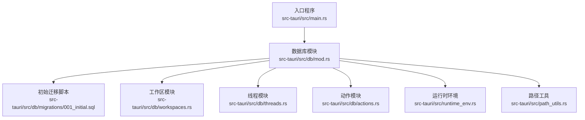
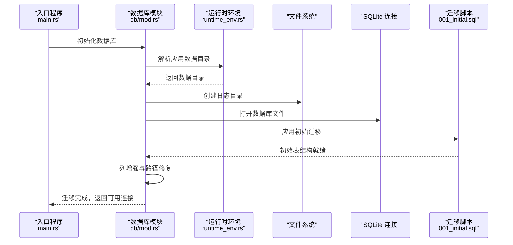
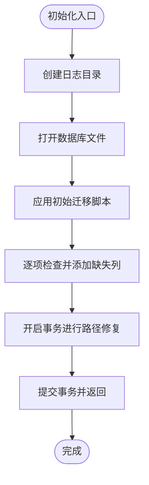
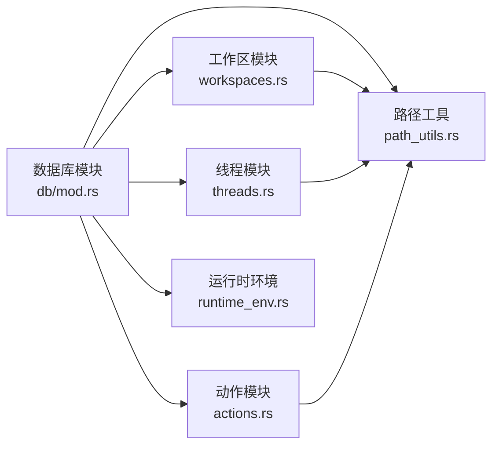

# 迁移管理

<cite>
**本文引用的文件**
- [src-tauri/src/db/mod.rs](file://src-tauri/src/db/mod.rs)
- [src-tauri/src/db/migrations/001_initial.sql](file://src-tauri/src/db/migrations/001_initial.sql)
- [src-tauri/src/db/actions.rs](file://src-tauri/src/db/actions.rs)
- [src-tauri/src/db/threads.rs](file://src-tauri/src/db/threads.rs)
- [src-tauri/src/db/workspaces.rs](file://src-tauri/src/db/workspaces.rs)
- [src-tauri/src/runtime_env.rs](file://src-tauri/src/runtime_env.rs)
- [src-tauri/src/path_utils.rs](file://src-tauri/src/path_utils.rs)
- [src-tauri/src/main.rs](file://src-tauri/src/main.rs)
- [Cargo.toml](file://Cargo.toml)
</cite>

## 目录
1. [简介](#简介)
2. [项目结构](#项目结构)
3. [核心组件](#核心组件)
4. [架构总览](#架构总览)
5. [详细组件分析](#详细组件分析)
6. [依赖关系分析](#依赖关系分析)
7. [性能考量](#性能考量)
8. [故障排查指南](#故障排查指南)
9. [结论](#结论)
10. [附录：迁移脚本与执行流程](#附录迁移脚本与执行流程)

## 简介
本文件系统化阐述 Panes 应用的数据库迁移管理机制，覆盖自动化迁移流程、脚本编写规范、版本控制策略、回滚机制、初始结构定义与后续变更管理、执行监控、错误处理与数据一致性保障，以及生产环境迁移的最佳实践、风险控制与测试策略。目标是帮助开发者在不直接阅读源码的情况下，也能准确理解并安全地维护数据库演进。

## 项目结构
与迁移管理直接相关的代码位于 Tauri 后端模块中，核心位置如下：
- 数据库初始化与迁移入口：src-tauri/src/db/mod.rs
- 初始数据库结构（SQL 脚本）：src-tauri/src/db/migrations/001_initial.sql
- 工作区、线程、动作等业务子模块：src-tauri/src/db/workspaces.rs、src-tauri/src/db/threads.rs、src-tauri/src/db/actions.rs
- 运行时环境与应用数据目录：src-tauri/src/runtime_env.rs
- 路径规范化与兼容性工具：src-tauri/src/path_utils.rs
- 入口程序：src-tauri/src/main.rs
- 工作区与依赖声明：Cargo.toml

**图表来源**
- [src-tauri/src/main.rs:1-14](file://src-tauri/src/main.rs#L1-L14)
- [src-tauri/src/db/mod.rs:1-150](file://src-tauri/src/db/mod.rs#L1-L150)
- [src-tauri/src/db/migrations/001_initial.sql:1-132](file://src-tauri/src/db/migrations/001_initial.sql#L1-L132)
- [src-tauri/src/db/workspaces.rs:1-120](file://src-tauri/src/db/workspaces.rs#L1-L120)
- [src-tauri/src/db/threads.rs:1-120](file://src-tauri/src/db/threads.rs#L1-L120)
- [src-tauri/src/db/actions.rs:1-60](file://src-tauri/src/db/actions.rs#L1-L60)
- [src-tauri/src/runtime_env.rs:50-80](file://src-tauri/src/runtime_env.rs#L50-L80)
- [src-tauri/src/path_utils.rs:1-40](file://src-tauri/src/path_utils.rs#L1-L40)

**章节来源**
- [src-tauri/src/main.rs:1-14](file://src-tauri/src/main.rs#L1-L14)
- [src-tauri/src/db/mod.rs:70-150](file://src-tauri/src/db/mod.rs#L70-L150)
- [src-tauri/src/db/migrations/001_initial.sql:1-132](file://src-tauri/src/db/migrations/001_initial.sql#L1-L132)

## 核心组件
- 数据库初始化与连接池
  - 初始化时确保应用数据目录存在并创建日志目录；打开数据库文件并立即执行迁移；随后建立连接池以复用 SQLite 连接，降低开销。
  - 关键点：连接池最大空闲数、连接配置（外键、WAL、同步级别、临时存储、忙等待超时）均在连接建立后即时生效。
- 迁移执行与增强
  - 首先应用初始 SQL 脚本；随后通过一系列“列增强”函数确保历史数据库具备新增字段，避免破坏性 ALTER 或重复添加。
  - 提供路径修复逻辑，合并重复的工作区与仓库记录，统一规范化路径，保证数据一致性。
- 业务模块
  - 工作区：UPSERT 工作区、列表查询、归档/恢复、默认工作区选择、启动预设 JSON 管理、CueLight 绑定等。
  - 线程：创建、查询、状态更新、引擎线程 ID 绑定、归档/恢复、消息计数器与令牌统计重算、运行时恢复。
  - 动作：插入动作开始、完成动作、审批请求与回答、事件日志追加等。
- 运行时环境与路径
  - 应用数据目录解析与旧版目录迁移；路径规范化与 Windows 前缀兼容；默认工作区根路径选择策略。

**章节来源**
- [src-tauri/src/db/mod.rs:74-150](file://src-tauri/src/db/mod.rs#L74-L150)
- [src-tauri/src/db/mod.rs:122-135](file://src-tauri/src/db/mod.rs#L122-L135)
- [src-tauri/src/db/mod.rs:152-231](file://src-tauri/src/db/mod.rs#L152-L231)
- [src-tauri/src/db/mod.rs:259-466](file://src-tauri/src/db/mod.rs#L259-L466)
- [src-tauri/src/db/workspaces.rs:16-120](file://src-tauri/src/db/workspaces.rs#L16-L120)
- [src-tauri/src/db/threads.rs:15-120](file://src-tauri/src/db/threads.rs#L15-L120)
- [src-tauri/src/db/actions.rs:9-60](file://src-tauri/src/db/actions.rs#L9-L60)
- [src-tauri/src/runtime_env.rs:53-70](file://src-tauri/src/runtime_env.rs#L53-L70)
- [src-tauri/src/path_utils.rs:7-20](file://src-tauri/src/path_utils.rs#L7-L20)

## 架构总览
下图展示从应用启动到数据库迁移与连接建立的关键调用链：

**图表来源**
- [src-tauri/src/main.rs:3-13](file://src-tauri/src/main.rs#L3-L13)
- [src-tauri/src/db/mod.rs:74-135](file://src-tauri/src/db/mod.rs#L74-L135)
- [src-tauri/src/runtime_env.rs:53-70](file://src-tauri/src/runtime_env.rs#L53-L70)
- [src-tauri/src/db/migrations/001_initial.sql:1-132](file://src-tauri/src/db/migrations/001_initial.sql#L1-L132)

## 详细组件分析

### 数据库模块与迁移执行
- 初始化流程
  - 解析并迁移旧版应用数据目录，确保新路径存在且可写。
  - 创建日志子目录，避免后续写入失败。
  - 打开数据库文件并建立连接池，设置连接级 PRAGMA（外键、WAL、同步、临时存储、忙等待）。
- 迁移执行
  - 使用 include_str 引入初始 SQL 并一次性执行，保证原子性。
  - 依次执行列增强函数，确保新增字段存在且类型正确，避免重复 ALTER 导致的潜在问题。
  - 执行路径修复事务，合并重复工作区/仓库记录，统一规范化路径，减少歧义与冗余。
- 错误处理
  - 每一步操作均使用上下文包装错误，明确失败阶段与原因，便于定位问题。
  - 连接池采用互斥锁保护空闲队列，异常情况下仍能安全释放资源。

**图表来源**
- [src-tauri/src/db/mod.rs:74-135](file://src-tauri/src/db/mod.rs#L74-L135)
- [src-tauri/src/db/mod.rs:152-231](file://src-tauri/src/db/mod.rs#L152-L231)
- [src-tauri/src/db/mod.rs:259-268](file://src-tauri/src/db/mod.rs#L259-L268)

**章节来源**
- [src-tauri/src/db/mod.rs:74-150](file://src-tauri/src/db/mod.rs#L74-L150)
- [src-tauri/src/db/mod.rs:122-135](file://src-tauri/src/db/mod.rs#L122-L135)

### 初始数据库结构（001_initial.sql）
- 表与索引
  - 工作区、仓库、线程、消息、动作、审批、引擎事件日志等核心表。
  - 大量复合索引与全文检索（FTS）触发器，优化查询与搜索体验。
- 设计要点
  - 外键约束保证引用完整性；UNIQUE 约束避免重复路径。
  - 时间戳字段默认值使用数据库函数生成，确保一致性。
  - FTS 触发器自动维护可搜索文本，简化检索实现。

**章节来源**
- [src-tauri/src/db/migrations/001_initial.sql:1-132](file://src-tauri/src/db/migrations/001_initial.sql#L1-L132)

### 工作区模块（workspaces.rs）
- UPSERT 工作区
  - 支持规范化路径与旧版 Windows 前缀兼容；若已存在则仅更新最近打开时间与扫描深度。
- 查询与归档
  - 列表查询按最近打开时间排序；支持归档/恢复与删除。
- 默认工作区
  - 在多种候选路径中选择合适根目录，避开临时挂载、系统目录与安装目录。
- 启动预设与绑定
  - 提供启动预设 JSON 的读写接口；支持 CueLight 绑定的序列化/反序列化。

**章节来源**
- [src-tauri/src/db/workspaces.rs:16-120](file://src-tauri/src/db/workspaces.rs#L16-L120)
- [src-tauri/src/db/workspaces.rs:258-345](file://src-tauri/src/db/workspaces.rs#L258-L345)
- [src-tauri/src/db/workspaces.rs:421-470](file://src-tauri/src/db/workspaces.rs#L421-L470)

### 线程模块（threads.rs）
- 生命周期管理
  - 创建、查询、状态更新、引擎线程 ID 绑定、归档/恢复、删除。
- 计数器与统计
  - 自增消息计数与令牌总数；支持重算统计并更新线程最后活跃时间。
- 运行时恢复
  - 将过期流式消息标记为中断，基于审批与最新助手消息推导线程状态，确保重启后状态一致。

**章节来源**
- [src-tauri/src/db/threads.rs:15-120](file://src-tauri/src/db/threads.rs#L15-L120)
- [src-tauri/src/db/threads.rs:223-278](file://src-tauri/src/db/threads.rs#L223-L278)
- [src-tauri/src/db/threads.rs:314-413](file://src-tauri/src/db/threads.rs#L314-L413)

### 动作与审批模块（actions.rs）
- 动作生命周期
  - 插入动作开始（OR REPLACE）、完成动作（更新状态、结果与耗时）。
- 审批管理
  - 插入审批请求、回答审批、查询详情与上下文；提供测试辅助方法。
- 事件日志
  - 追加引擎事件日志，便于调试与审计。

**章节来源**
- [src-tauri/src/db/actions.rs:9-60](file://src-tauri/src/db/actions.rs#L9-L60)
- [src-tauri/src/db/actions.rs:113-187](file://src-tauri/src/db/actions.rs#L113-L187)

### 路径工具与运行时环境
- 路径工具
  - 规范化 Windows 路径、去除/添加 verbatim 前缀、大小写与分隔符标准化、包含关系判断。
- 运行时环境
  - 应用数据目录解析与旧版迁移；默认工作区根路径选择策略；平台差异处理。

**章节来源**
- [src-tauri/src/path_utils.rs:7-20](file://src-tauri/src/path_utils.rs#L7-L20)
- [src-tauri/src/path_utils.rs:31-85](file://src-tauri/src/path_utils.rs#L31-L85)
- [src-tauri/src/runtime_env.rs:53-80](file://src-tauri/src/runtime_env.rs#L53-L80)
- [src-tauri/src/runtime_env.rs:100-120](file://src-tauri/src/runtime_env.rs#L100-L120)

## 依赖关系分析
- 模块耦合
  - 数据库模块作为中心枢纽，被各业务模块（工作区、线程、动作）广泛依赖。
  - 路径工具与运行时环境为数据库模块提供基础能力（路径规范化、数据目录解析）。
- 外部依赖
  - SQLite（rusqlite）用于本地持久化；anyhow 提供统一错误处理；serde_json 用于 JSON 字段序列化。
- 版本与特性
  - 工作区与线程模块使用 UUID 生成主键；事务用于批量修复与状态恢复，保证原子性。

**图表来源**
- [src-tauri/src/db/mod.rs:15-20](file://src-tauri/src/db/mod.rs#L15-L20)
- [src-tauri/src/db/workspaces.rs:1-12](file://src-tauri/src/db/workspaces.rs#L1-L12)
- [src-tauri/src/db/threads.rs:1-8](file://src-tauri/src/db/threads.rs#L1-L8)
- [src-tauri/src/db/actions.rs:1-7](file://src-tauri/src/db/actions.rs#L1-L7)
- [src-tauri/src/path_utils.rs:1-6](file://src-tauri/src/path_utils.rs#L1-L6)
- [src-tauri/src/runtime_env.rs:1-16](file://src-tauri/src/runtime_env.rs#L1-L16)

**章节来源**
- [Cargo.toml:1-24](file://Cargo.toml#L1-L24)

## 性能考量
- 连接池与 PRAGMA 设置
  - 最大空闲连接数限制，避免过多文件句柄占用；启用 WAL 模式提升并发读写；适度同步级别与内存临时存储平衡可靠性与性能。
- 索引与全文检索
  - 大量复合索引与 FTS 触发器显著提升查询与搜索效率；需注意写入成本与存储占用。
- 事务与批量修复
  - 路径修复与运行时恢复采用单事务，减少中间态，提高一致性同时避免频繁 IO。

[本节为通用性能建议，无需特定文件引用]

## 故障排查指南
- 常见问题与定位
  - 数据库无法打开：检查应用数据目录权限与路径；确认日志目录创建成功。
  - 迁移失败：查看具体报错上下文，定位是在初始脚本执行还是列增强阶段；核对数据库版本与 schema 差异。
  - 路径冲突或重复：关注路径修复日志，确认是否发生重复工作区/仓库合并。
- 排查步骤
  - 查看应用日志目录中的错误输出。
  - 在测试环境中重建数据库，逐步执行迁移与修复逻辑，观察事务提交前后的状态变化。
  - 对比不同版本的 schema 差异，确认列增强函数是否覆盖了所有历史版本字段。

**章节来源**
- [src-tauri/src/db/mod.rs:122-135](file://src-tauri/src/db/mod.rs#L122-L135)
- [src-tauri/src/db/mod.rs:259-268](file://src-tauri/src/db/mod.rs#L259-L268)

## 结论
Panes 的迁移管理以“初始脚本 + 增强函数 + 事务修复”的组合实现，既保证了新安装的一次性完整初始化，也兼顾了历史数据库的平滑演进。通过严格的连接配置、索引设计与事务封装，系统在功能扩展的同时维持了良好的性能与数据一致性。建议在引入新字段或结构变更时，遵循现有模式：优先使用列增强函数，避免破坏性 ALTER；对复杂修复逻辑采用事务包裹，确保原子性与可回溯性。

[本节为总结性内容，无需特定文件引用]

## 附录：迁移脚本与执行流程

### 迁移脚本编写规范
- 文件命名
  - 使用四位递增序号（如 001_initial.sql），确保顺序稳定。
- 脚本内容
  - 明确 CREATE TABLE、索引与触发器定义；对外键、唯一约束、默认值进行清晰声明。
  - 对于需要历史数据兼容的字段，采用列增强函数补充，避免 ALTER 导致的阻塞与失败。
- 变更策略
  - 新增表或字段时，先在新版本脚本中声明；同时在迁移函数中提供幂等的列增强逻辑，兼容旧版本数据库。

**章节来源**
- [src-tauri/src/db/migrations/001_initial.sql:1-132](file://src-tauri/src/db/migrations/001_initial.sql#L1-L132)
- [src-tauri/src/db/mod.rs:152-231](file://src-tauri/src/db/mod.rs#L152-L231)

### 版本控制策略
- 分支与标签
  - 以语义化版本管理数据库 schema；每个版本对应一个稳定的迁移脚本集合。
- 向后兼容
  - 保持列增强函数对历史字段的兼容性；避免删除或重命名关键字段。
- 回滚准备
  - 对于高风险变更，提供逆向逻辑或备份策略；在事务中执行修复，便于失败时回滚。

**章节来源**
- [src-tauri/src/db/mod.rs:122-135](file://src-tauri/src/db/mod.rs#L122-L135)

### 回滚机制
- 事务回滚
  - 路径修复与运行时恢复均在事务内执行，失败时自动回滚，确保数据库处于一致状态。
- 建议的回滚流程
  - 在生产环境执行高风险迁移前，备份数据库文件；迁移失败时，使用备份快速恢复；必要时通过列增强函数撤销部分变更。

**章节来源**
- [src-tauri/src/db/mod.rs:259-268](file://src-tauri/src/db/mod.rs#L259-L268)
- [src-tauri/src/db/threads.rs:314-367](file://src-tauri/src/db/threads.rs#L314-L367)

### 初始数据库结构与后续变更
- 初始结构
  - 由 001_initial.sql 定义，包含核心表、索引与 FTS 触发器。
- 后续变更
  - 通过迁移函数补充缺失列与修复数据；对路径进行规范化与去重；根据业务需求扩展 JSON 字段与关联表。

**章节来源**
- [src-tauri/src/db/migrations/001_initial.sql:1-132](file://src-tauri/src/db/migrations/001_initial.sql#L1-L132)
- [src-tauri/src/db/mod.rs:152-231](file://src-tauri/src/db/mod.rs#L152-L231)

### 迁移执行监控与错误处理
- 监控
  - 在迁移前后记录关键指标（如消息计数、线程状态），确保数据完整性。
- 错误处理
  - 每个操作均携带上下文信息，便于定位失败节点；连接池与 PRAGMA 设置在迁移前完成，减少运行时异常。

**章节来源**
- [src-tauri/src/db/mod.rs:122-150](file://src-tauri/src/db/mod.rs#L122-L150)

### 生产环境迁移最佳实践
- 风险控制
  - 预发布验证：在测试环境模拟真实数据规模与路径场景，执行迁移与修复流程。
  - 低峰时段：选择业务低峰期执行迁移，缩短停机窗口。
  - 渐进式部署：先对小范围用户开放，收集反馈后再全量推送。
- 数据一致性保证
  - 使用事务包裹复杂修复逻辑；对关键表的变更进行前后对比校验。
- 迁移测试策略
  - 单元测试：针对迁移函数与修复逻辑编写测试用例，覆盖边界条件。
  - 集成测试：构造多版本历史数据，验证列增强与路径修复效果。

**章节来源**
- [src-tauri/src/db/mod.rs:259-466](file://src-tauri/src/db/mod.rs#L259-L466)
- [src-tauri/src/db/threads.rs:436-589](file://src-tauri/src/db/threads.rs#L436-L589)
- [src-tauri/src/db/workspaces.rs:472-620](file://src-tauri/src/db/workspaces.rs#L472-L620)

### 具体迁移脚本示例与执行流程
- 示例：列增强函数（以消息表审计字段为例）
  - 流程：查询表结构 → 检查是否存在指定列 → 若不存在则添加列 → 提交并返回。
  - 作用：确保历史数据库具备新审计字段，不影响现有数据。
- 示例：路径修复事务
  - 流程：开启事务 → 合并重复工作区 → 合并重复仓库 → 更新引用与元数据 → 提交事务。
  - 作用：统一路径表示，消除重复与歧义，提升查询与展示一致性。

**章节来源**
- [src-tauri/src/db/mod.rs:186-226](file://src-tauri/src/db/mod.rs#L186-L226)
- [src-tauri/src/db/mod.rs:259-466](file://src-tauri/src/db/mod.rs#L259-L466)