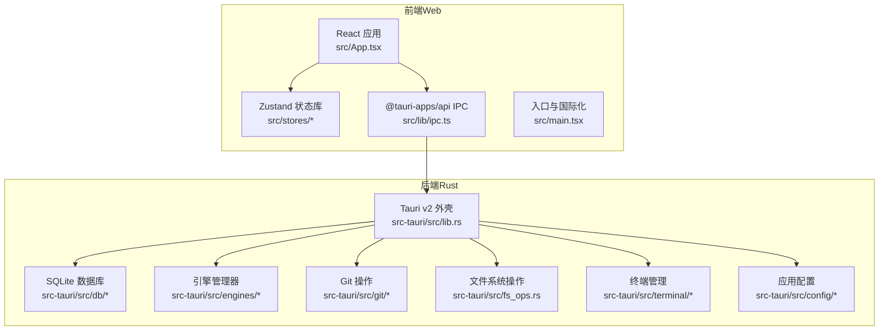
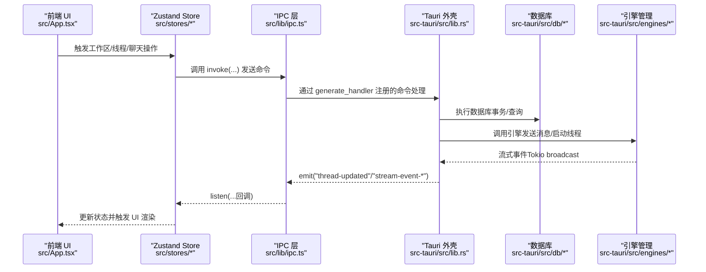
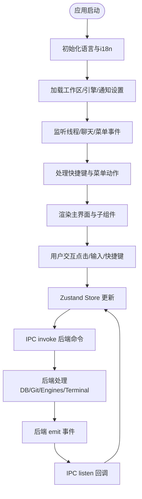
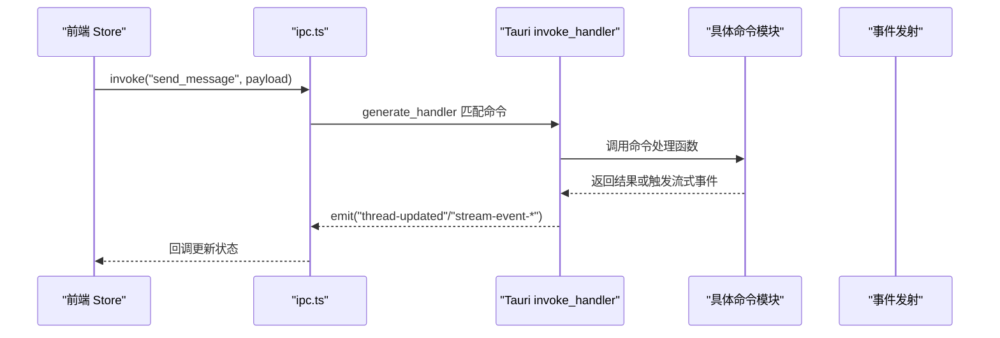
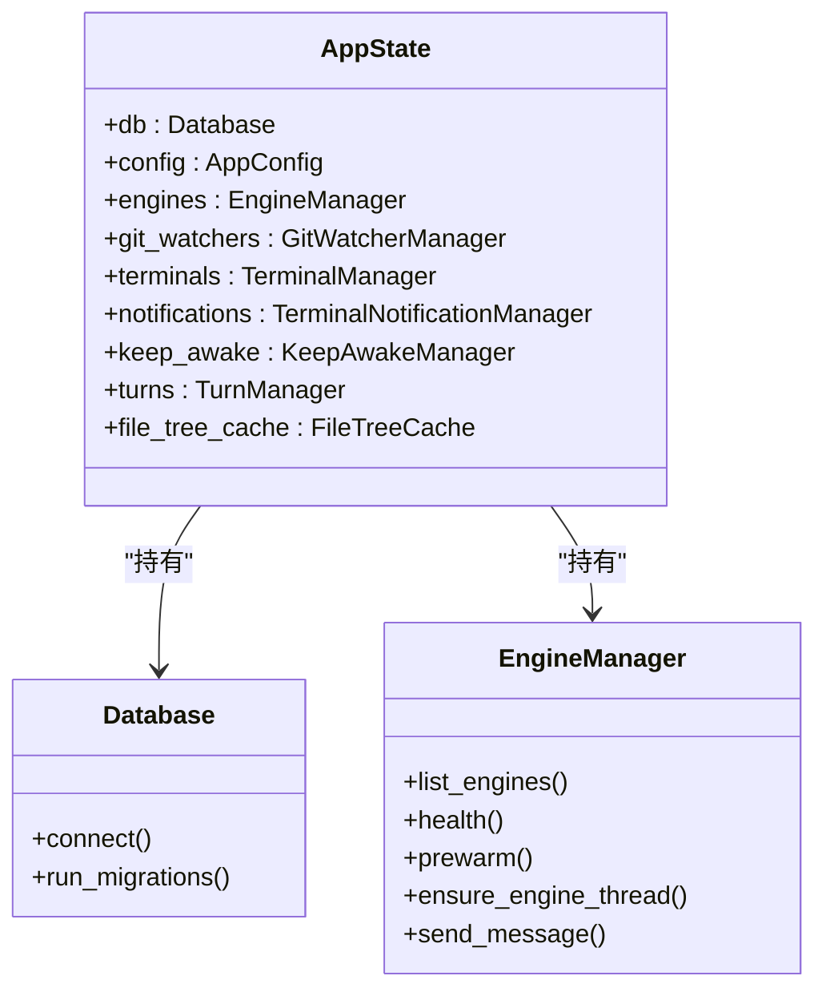
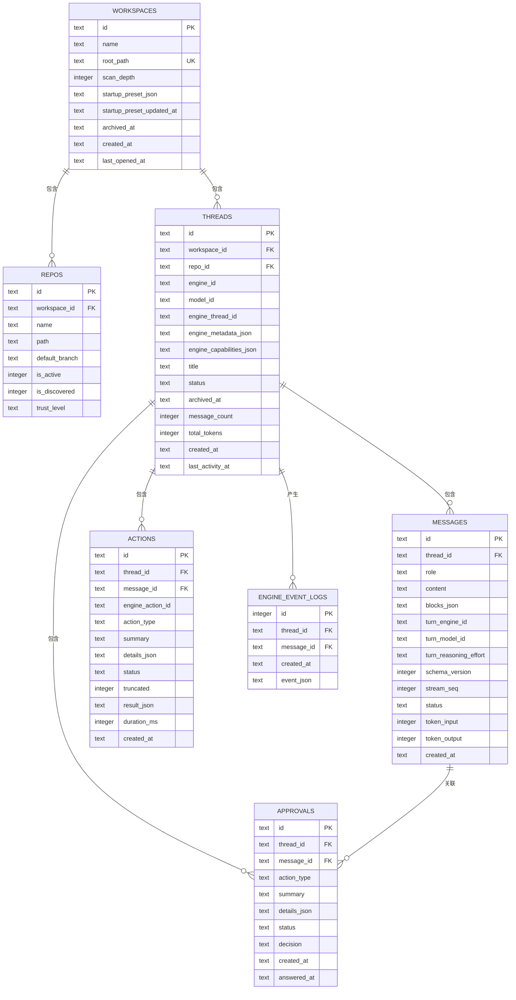
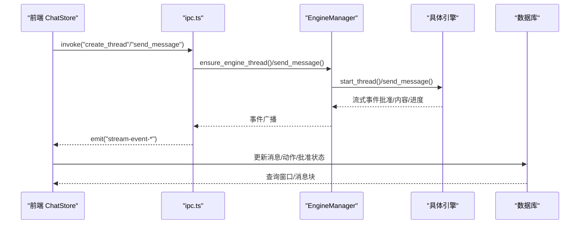
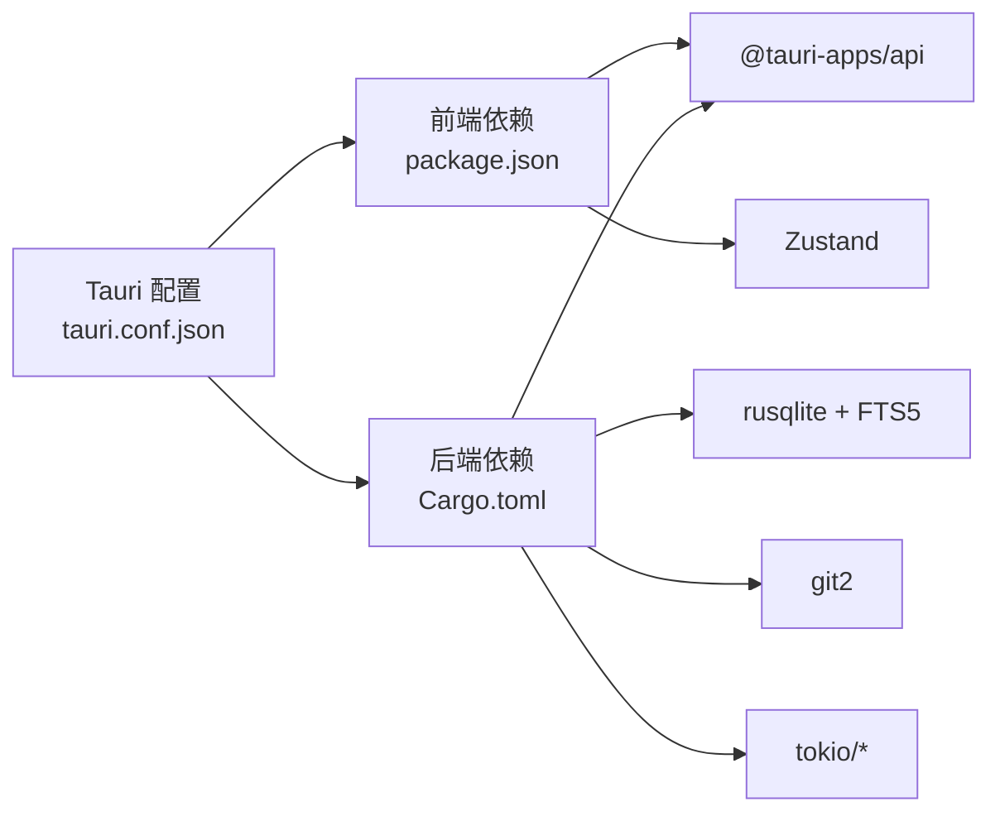

# 架构设计

<cite>
**本文档引用的文件**
- [README.md](file://README.md)
- [package.json](file://package.json)
- [src-tauri/Cargo.toml](file://src-tauri/Cargo.toml)
- [src/main.tsx](file://src/main.tsx)
- [src/App.tsx](file://src/App.tsx)
- [src/lib/ipc.ts](file://src/lib/ipc.ts)
- [src-tauri/src/main.rs](file://src-tauri/src/main.rs)
- [src-tauri/tauri.conf.json](file://src-tauri/tauri.conf.json)
- [src/stores/workspaceStore.ts](file://src/stores/workspaceStore.ts)
- [src/stores/chatStore.ts](file://src/stores/chatStore.ts)
- [src-tauri/src/db/mod.rs](file://src-tauri/src/db/mod.rs)
- [src-tauri/src/db/migrations/001_initial.sql](file://src-tauri/src/db/migrations/001_initial.sql)
- [src-tauri/src/engines/mod.rs](file://src-tauri/src/engines/mod.rs)
- [src/types.ts](file://src/types.ts)
- [src-tauri/src/lib.rs](file://src-tauri/src/lib.rs)
</cite>

## 目录
1. [引言](#引言)
2. [项目结构](#项目结构)
3. [核心组件](#核心组件)
4. [架构总览](#架构总览)
5. [详细组件分析](#详细组件分析)
6. [依赖关系分析](#依赖关系分析)
7. [性能考量](#性能考量)
8. [故障排除指南](#故障排除指南)
9. [结论](#结论)
10. [附录](#附录)

## 引言
本架构文档面向 Panes 项目的开发者与维护者，系统阐述其整体架构模式与实现细节：前端采用 React + Zustand + Tauri Shell，后端采用 Rust + SQLite + Git2；重点说明组件交互、数据流、IPC 通信机制与系统边界。文档同时覆盖跨平台考虑、性能优化策略、可扩展性设计、安全与监控、灾难恢复等主题。

## 项目结构
Panes 采用前后端分离的桌面应用架构：
- 前端（src/）：React + TypeScript + Zustand 状态管理，通过 @tauri-apps/api 与后端进行 IPC 通信。
- 后端（src-tauri/）：Rust 应用，使用 Tauri v2 作为外壳，封装数据库、引擎、Git、终端、文件系统等能力。
- 配置与构建：package.json 管理前端依赖与脚本；src-tauri/Cargo.toml 管理 Rust 依赖与特性；tauri.conf.json 定义窗口、打包与插件配置。

**图表来源**
- [src/main.tsx:1-32](file://src/main.tsx#L1-L32)
- [src/App.tsx:1-577](file://src/App.tsx#L1-L577)
- [src/lib/ipc.ts:1-792](file://src/lib/ipc.ts#L1-L792)
- [src-tauri/src/lib.rs:1-800](file://src-tauri/src/lib.rs#L1-L800)

**章节来源**
- [README.md:236-256](file://README.md#L236-L256)
- [package.json:1-89](file://package.json#L1-L89)
- [src-tauri/Cargo.toml:1-66](file://src-tauri/Cargo.toml#L1-L66)
- [src-tauri/tauri.conf.json:1-58](file://src-tauri/tauri.conf.json#L1-L58)

## 核心组件
- 前端应用与状态管理
  - 入口初始化：国际化加载、错误边界、根组件渲染。
  - 主应用：工作区加载、引擎加载、保持清醒、通知设置、线程刷新、快捷键处理、菜单动作监听。
  - 状态存储：Zustand Store（工作区、聊天、Git、终端、UI、更新、通知等），统一管理前端状态与副作用。
- IPC 与命令桥接
  - 统一的 IPC 封装，暴露后端命令调用与事件监听（线程事件、Git 变化、菜单动作、终端输出等）。
- 后端服务层
  - Tauri 插件注册、菜单构建、窗口管理、命令处理器、应用状态管理（数据库、引擎、Git 监视器、终端管理器、通知管理器、KeepAwake 管理器、Turn 管理器、文件树缓存）。
- 数据持久化与模型
  - SQLite 数据库（rusqlite + FTS5），迁移脚本定义表结构与索引；类型定义在前端与后端共享。

**章节来源**
- [src/main.tsx:11-32](file://src/main.tsx#L11-L32)
- [src/App.tsx:119-577](file://src/App.tsx#L119-L577)
- [src/lib/ipc.ts:72-627](file://src/lib/ipc.ts#L72-L627)
- [src-tauri/src/lib.rs:47-337](file://src-tauri/src/lib.rs#L47-L337)
- [src-tauri/src/db/migrations/001_initial.sql:1-132](file://src-tauri/src/db/migrations/001_initial.sql#L1-L132)
- [src/types.ts:1-800](file://src/types.ts#L1-L800)

## 架构总览
Panes 的整体架构遵循“前端轻量、后端强健”的原则：
- 前端负责用户界面与交互、状态聚合与事件驱动；通过 IPC 调用后端命令，订阅后端事件以保持 UI 与后端状态同步。
- 后端负责业务逻辑、数据持久化、外部系统集成（Git、终端、文件系统、引擎）、系统级能力（通知、电源管理、进程控制）。
- IPC 采用 Tauri 的 invoke/listen 模式，事件命名空间清晰，避免全局污染。

**图表来源**
- [src/App.tsx:139-204](file://src/App.tsx#L139-L204)
- [src/lib/ipc.ts:629-686](file://src/lib/ipc.ts#L629-L686)
- [src-tauri/src/lib.rs:179-320](file://src-tauri/src/lib.rs#L179-L320)
- [src-tauri/src/db/mod.rs:74-134](file://src-tauri/src/db/mod.rs#L74-L134)
- [src-tauri/src/engines/mod.rs:463-478](file://src-tauri/src/engines/mod.rs#L463-L478)

## 详细组件分析

### 前端应用与状态管理
- 初始化流程
  - 获取浏览器语言，尝试通过 IPC 获取应用语言，初始化 i18n，挂载错误边界与根组件。
- 主应用生命周期
  - 加载工作区、引擎、保持清醒、终端通知设置；监听线程更新、聊天回合完成、引擎运行时更新；处理 beforeunload 写回 Git Drafts；检查更新。
- 快捷键与菜单
  - 前端 JS 键盘监听与原生菜单动作监听双轨并行，带去抖保护；支持编辑菜单动作转发到后端执行。
- 状态存储
  - 工作区 Store：打开/归档/恢复/扫描工作区，加载仓库列表，持久化上次活动工作区与仓库。
  - 聊天 Store：消息窗口加载、流式事件批处理、批准请求响应、动作输出水合、性能指标记录。

**图表来源**
- [src/main.tsx:11-32](file://src/main.tsx#L11-L32)
- [src/App.tsx:139-290](file://src/App.tsx#L139-L290)
- [src/stores/workspaceStore.ts:142-158](file://src/stores/workspaceStore.ts#L142-L158)
- [src/stores/chatStore.ts:64-82](file://src/stores/chatStore.ts#L64-L82)

**章节来源**
- [src/main.tsx:11-32](file://src/main.tsx#L11-L32)
- [src/App.tsx:119-577](file://src/App.tsx#L119-L577)
- [src/stores/workspaceStore.ts:134-429](file://src/stores/workspaceStore.ts#L134-L429)
- [src/stores/chatStore.ts:1-800](file://src/stores/chatStore.ts#L1-L800)

### IPC 通信机制
- 命令调用
  - 统一的 ipc 对象封装所有 invoke 调用，参数与返回值类型在前端 types.ts 中定义，确保类型安全。
- 事件监听
  - 提供 listenThreadEvents、listenGitRepoChanged、listenThreadUpdated、listenChatTurnFinished、listenEngineRuntimeUpdated、listenMenuAction、listenTerminalOutput 等高阶监听函数。
- 终端会话写入
  - writeCommandToNewSession 在会话就绪后写入命令，具备超时回退与输出延迟策略。

**图表来源**
- [src/lib/ipc.ts:72-627](file://src/lib/ipc.ts#L72-L627)
- [src-tauri/src/lib.rs:179-320](file://src-tauri/src/lib.rs#L179-L320)

**章节来源**
- [src/lib/ipc.ts:1-792](file://src/lib/ipc.ts#L1-L792)
- [src-tauri/src/lib.rs:179-320](file://src-tauri/src/lib.rs#L179-L320)

### 后端服务层设计
- 应用启动与状态管理
  - 初始化数据库、应用配置、KeepAwake 管理器、Git 监视器、终端管理器、通知管理器、Turn 管理器、文件树缓存。
  - 注册 Tauri 插件（shell/dialog/fs/notification/updater/process），构建菜单，设置窗口属性。
- 命令处理
  - 通过 generate_handler 注册大量命令，覆盖工作区、Git、文件、聊天、线程、终端、引擎、设置等模块。
- 引擎桥接
  - 运行 Codex 运行时事件桥接任务，将远端事件转换为本地事件并广播给前端。

**图表来源**
- [src-tauri/src/lib.rs:83-94](file://src-tauri/src/lib.rs#L83-L94)
- [src-tauri/src/engines/mod.rs:463-478](file://src-tauri/src/engines/mod.rs#L463-L478)
- [src-tauri/src/db/mod.rs:74-134](file://src-tauri/src/db/mod.rs#L74-L134)

**章节来源**
- [src-tauri/src/lib.rs:47-337](file://src-tauri/src/lib.rs#L47-L337)
- [src-tauri/src/engines/mod.rs:1-800](file://src-tauri/src/engines/mod.rs#L1-L800)
- [src-tauri/src/db/mod.rs:1-800](file://src-tauri/src/db/mod.rs#L1-L800)

### 数据库模式与文件系统操作
- 数据库模式
  - 表：workspaces、repos、threads、messages、actions、approvals、engine_event_logs。
  - 索引：针对 workspace/repo/thread/message/action/approval 的常用查询建立索引。
  - FTS5：messages 表的全文检索，自动触发插入/删除/更新触发器。
- 文件系统操作
  - 通过 Tauri FS 插件与自定义 fs_ops 模块提供文件读写、目录遍历、路径操作等能力。
- 路径修复与迁移
  - 运行时对重复工作区与仓库路径进行合并修复，保证跨平台路径一致性。

**图表来源**
- [src-tauri/src/db/migrations/001_initial.sql:1-132](file://src-tauri/src/db/migrations/001_initial.sql#L1-L132)

**章节来源**
- [src-tauri/src/db/migrations/001_initial.sql:1-132](file://src-tauri/src/db/migrations/001_initial.sql#L1-L132)
- [src-tauri/src/db/mod.rs:1-800](file://src-tauri/src/db/mod.rs#L1-L800)

### 引擎与聊天交互
- 引擎抽象
  - Engine trait 抽象了多引擎通用能力（开始线程、发送消息、响应批准、中断、归档/恢复线程）。
  - EngineManager 统一管理 Codex、Claude（Sidecar/Native）、OpenCode，提供健康检查、预热、模型列表等。
- 聊天状态机
  - ChatStore 维护线程状态（idle/streaming/awaiting_approval/error/completed），批处理流式事件，合并文本增量，处理批准请求与动作输出水合。
- 类型与协议
  - 前端 types.ts 定义 Thread、Message、ContentBlock、ApprovalResponse 等类型，确保前后端一致。

**图表来源**
- [src/stores/chatStore.ts:118-155](file://src/stores/chatStore.ts#L118-L155)
- [src-tauri/src/engines/mod.rs:419-461](file://src-tauri/src/engines/mod.rs#L419-L461)
- [src-tauri/src/lib.rs:348-509](file://src-tauri/src/lib.rs#L348-L509)

**章节来源**
- [src-tauri/src/engines/mod.rs:1-800](file://src-tauri/src/engines/mod.rs#L1-L800)
- [src/stores/chatStore.ts:1-800](file://src/stores/chatStore.ts#L1-L800)
- [src/types.ts:146-446](file://src/types.ts#L146-L446)

### 终端与通知
- 终端管理
  - TerminalManager 管理会话创建、写入、调整大小、关闭、输出诊断、会话恢复与输出排空。
- 通知集成
  - 支持 Claude/Codex 通知集成与通用 OSC 通知；通过 Tauri Notification 插件与系统通知通道联动。
- 电源与保持清醒
  - KeepAwakeManager 提供跨平台的保持清醒能力，支持 AC 电源、电池阈值、会话时长等策略。

**章节来源**
- [src-tauri/src/lib.rs:31-40](file://src-tauri/src/lib.rs#L31-L40)
- [src-tauri/src/lib.rs:164-164](file://src-tauri/src/lib.rs#L164-L164)
- [src/lib/ipc.ts:87-100](file://src/lib/ipc.ts#L87-L100)

## 依赖关系分析
- 前端依赖
  - React 19、Zustand 5、@tauri-apps/api、@xterm/*、diff2html、react-markdown 等。
- 后端依赖
  - Tauri v2、rusqlite（含 WAL、同步模式配置）、git2、tokio 生态、notify、portable-pty、env_logger 等。
- 构建与打包
  - Tauri v2 配置、多目标打包（DMG/NSIS/DEB/AppImage）、侧车资源分发。

**图表来源**
- [package.json:27-72](file://package.json#L27-L72)
- [src-tauri/Cargo.toml:15-54](file://src-tauri/Cargo.toml#L15-L54)
- [src-tauri/tauri.conf.json:1-58](file://src-tauri/tauri.conf.json#L1-L58)

**章节来源**
- [package.json:1-89](file://package.json#L1-L89)
- [src-tauri/Cargo.toml:1-66](file://src-tauri/Cargo.toml#L1-L66)
- [src-tauri/tauri.conf.json:1-58](file://src-tauri/tauri.conf.json#L1-L58)

## 性能考量
- 前端性能
  - Zustand 无中间件开销，按需订阅；聊天 Store 使用事件批处理与增量合并，减少重渲染。
  - 终端输出监听采用命名空间事件，避免全局风暴。
- 后端性能
  - SQLite WAL 模式提升并发读写；批量索引与 FTS5 全文检索优化查询；连接池复用降低开销。
  - 引擎事件使用 Tokio broadcast，避免阻塞主线程。
- 跨平台
  - Linux AppImage 桌面集成、WebKit 显示修复；Windows/Linux/macOS 平台差异通过条件编译与插件适配。

[本节为通用指导，无需特定文件引用]

## 故障排除指南
- IPC 调用失败
  - 检查 invoke 名称是否与 generate_handler 注册一致；确认参数类型与后端期望匹配。
- 事件未到达
  - 确认事件名称与命名空间（如 "stream-event-<threadId>"）正确；检查前端 listen 是否在组件挂载时注册并在卸载时清理。
- 数据库异常
  - 查看迁移日志与连接配置；确认 WAL 模式与 busy_timeout 设置；检查外键约束与唯一索引冲突。
- 引擎不可用
  - 通过 health 接口检查可用性与诊断信息；查看预热与模型目录配置。
- 通知与终端
  - 检查通知集成安装状态与环境变量；验证终端会话创建与输出监听。

**章节来源**
- [src/lib/ipc.ts:629-742](file://src/lib/ipc.ts#L629-L742)
- [src-tauri/src/db/mod.rs:137-149](file://src-tauri/src/db/mod.rs#L137-L149)
- [src-tauri/src/lib.rs:545-605](file://src-tauri/src/lib.rs#L545-L605)

## 结论
Panes 采用“前端轻量 + 后端强健”的桌面应用架构，通过 Tauri 实现跨平台外壳，前端以 React + Zustand 构建交互体验，后端以 Rust 提供高性能的数据持久化、引擎编排与系统集成能力。该架构在安全性、可观测性、可扩展性与跨平台兼容方面均具备良好基础，适合持续演进与功能扩展。

[本节为总结，无需特定文件引用]

## 附录
- 系统上下文图
  - 前端通过 IPC 访问后端命令与事件；后端访问数据库、Git、引擎、终端与文件系统；系统插件提供通知、对话框、进程与更新能力。
- 关键路径参考
  - 应用入口与国际化：[src/main.tsx:11-32](file://src/main.tsx#L11-L32)
  - 主应用生命周期与事件监听：[src/App.tsx:139-290](file://src/App.tsx#L139-L290)
  - IPC 命令与事件：[src/lib/ipc.ts:72-742](file://src/lib/ipc.ts#L72-L742)
  - 后端启动与命令注册：[src-tauri/src/lib.rs:47-337](file://src-tauri/src/lib.rs#L47-L337)
  - 数据库模式与迁移：[src-tauri/src/db/migrations/001_initial.sql:1-132](file://src-tauri/src/db/migrations/001_initial.sql#L1-L132)
  - 引擎抽象与管理：[src-tauri/src/engines/mod.rs:419-800](file://src-tauri/src/engines/mod.rs#L419-L800)
  - 类型定义：[src/types.ts:1-800](file://src/types.ts#L1-L800)