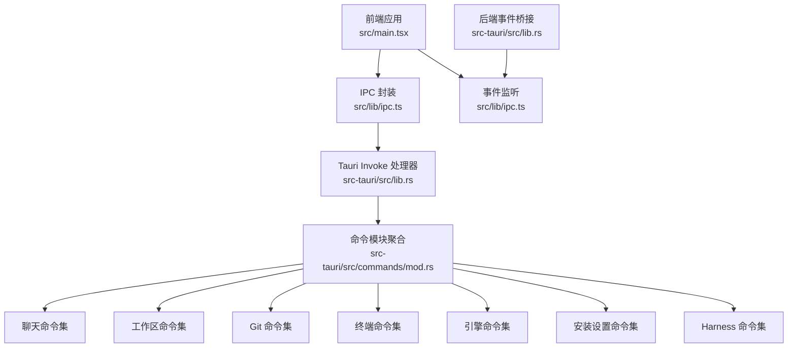
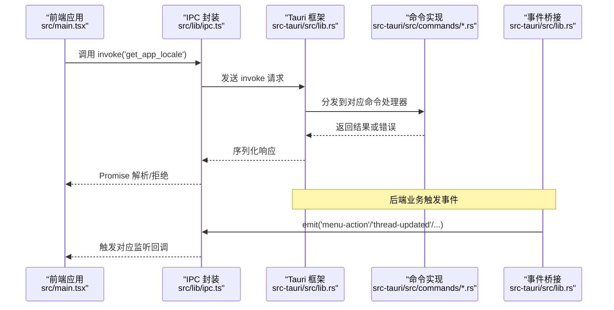
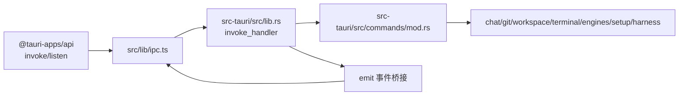

# IPC 通信

<cite>
**本文引用的文件**
- [src/lib/ipc.ts](file://src/lib/ipc.ts)
- [src-tauri/src/lib.rs](file://src-tauri/src/lib.rs)
- [src-tauri/src/commands/mod.rs](file://src-tauri/src/commands/mod.rs)
- [src/main.tsx](file://src/main.tsx)
- [src/stores/onboardingStore.ts](file://src/stores/onboardingStore.ts)
- [src/stores/chatStore.ts](file://src/stores/chatStore.ts)
- [src/types.ts](file://src/types.ts)
- [src-tauri/src/commands/terminal.rs](file://src-tauri/src/commands/terminal.rs)
</cite>

## 目录
1. [简介](#简介)
2. [项目结构](#项目结构)
3. [核心组件](#核心组件)
4. [架构总览](#架构总览)
5. [详细组件分析](#详细组件分析)
6. [依赖关系分析](#依赖关系分析)
7. [性能考量](#性能考量)
8. [故障排除指南](#故障排除指南)
9. [结论](#结论)
10. [附录](#附录)

## 简介
本文件系统性梳理 Panes 的进程间通信（IPC）机制，覆盖前端通过 @tauri-apps/api 调用后端 Tauri 命令、事件监听与数据序列化、接口设计与参数校验、返回值处理、异步调用模式、错误传播与超时控制、性能优化策略、调试与故障排除方法，并提供可直接定位到源码位置的调用与监听示例路径。

## 项目结构
- 前端 IPC 封装位于 src/lib/ipc.ts，统一导出 invoke 方法与各类 listen 事件监听函数。
- 后端在 src-tauri/src/lib.rs 中注册 invoke 处理器，映射到各模块命令；事件由后端主动 emit 到前端。
- 全局入口 src/main.tsx 在启动阶段通过 ipc.getAppLocale 进行本地化探测。
- 多个 store 使用 ipc 接口与事件监听，如 onboardingStore.ts、chatStore.ts 等。
- 类型定义集中于 src/types.ts，确保前后端数据契约一致。

图表来源
- [src/lib/ipc.ts:1-792](file://src/lib/ipc.ts#L1-L792)
- [src-tauri/src/lib.rs:180-379](file://src-tauri/src/lib.rs#L180-L379)
- [src-tauri/src/commands/mod.rs:1-12](file://src-tauri/src/commands/mod.rs#L1-L12)

章节来源
- [src/lib/ipc.ts:1-792](file://src/lib/ipc.ts#L1-L792)
- [src-tauri/src/lib.rs:180-379](file://src-tauri/src/lib.rs#L180-L379)
- [src-tauri/src/commands/mod.rs:1-12](file://src-tauri/src/commands/mod.rs#L1-L12)
- [src/main.tsx:1-31](file://src/main.tsx#L1-L31)

## 核心组件
- 前端 IPC 封装：提供统一的 invoke 调用集合与事件监听工厂，覆盖应用、工作区、Git、聊天、终端、引擎、安装设置、Harness 等领域。
- 后端命令注册：在 lib.rs 中集中注册所有 invoke 命令处理器，按功能拆分至独立模块。
- 事件桥接：后端通过 emit 主动向前端推送事件，前端以 listen 工厂订阅。
- 类型契约：types.ts 定义了线程、仓库、终端通知、权限等关键类型，保证序列化一致性。

章节来源
- [src/lib/ipc.ts:72-627](file://src/lib/ipc.ts#L72-L627)
- [src-tauri/src/lib.rs:180-322](file://src-tauri/src/lib.rs#L180-L322)
- [src/types.ts:1-200](file://src/types.ts#L1-L200)

## 架构总览
下图展示从前端发起 invoke 到后端命令执行再到事件回传的整体流程。

图表来源
- [src/main.tsx:11-31](file://src/main.tsx#L11-L31)
- [src/lib/ipc.ts:72-100](file://src/lib/ipc.ts#L72-L100)
- [src-tauri/src/lib.rs:180-379](file://src-tauri/src/lib.rs#L180-L379)

## 详细组件分析

### 1) IPC 接口设计与参数验证
- 统一使用 invoke(method, payload) 形式，payload 参数在前端进行空值归一化（null），后端命令签名严格匹配。
- 多数命令对可选参数采用可选字段或显式 null，避免类型不匹配。
- 返回值泛型约束，确保前端类型安全。

示例路径（仅路径，不含具体代码内容）
- [获取应用语言环境:73-74](file://src/lib/ipc.ts#L73-L74)
- [发送消息（含可选参数）:357-376](file://src/lib/ipc.ts#L357-L376)
- [终端写入字节:551-552](file://src/lib/ipc.ts#L551-L552)

章节来源
- [src/lib/ipc.ts:72-627](file://src/lib/ipc.ts#L72-L627)

### 2) invoke 调用模式与返回值处理
- 所有 invoke 调用均返回 Promise，前端需正确处理成功与失败分支。
- 对于需要序列化的复杂对象（如 Workspace、Thread、FileTreePage 等），前后端类型一致，避免二次转换开销。
- 部分命令封装内部会做轻量归一化（如依赖检查报告），便于前端消费。

示例路径（仅路径，不含具体代码内容）
- [列表工作区:101-101](file://src/lib/ipc.ts#L101-L101)
- [创建线程:243-260](file://src/lib/ipc.ts#L243-L260)
- [读取文件树分页:164-175](file://src/lib/ipc.ts#L164-L175)

章节来源
- [src/lib/ipc.ts:101-175](file://src/lib/ipc.ts#L101-L175)
- [src/types.ts:3-200](file://src/types.ts#L3-L200)

### 3) 事件监听与数据序列化
- 前端通过 listen(channel, handler) 订阅后端事件，channel 名称与后端 emit 保持一致。
- 事件负载包含强类型结构，前端以接口定义接收，减少解析成本。
- 写入新会话命令采用“输出就绪 + 回退定时器”策略，兼顾实时性与鲁棒性。

示例路径（仅路径，不含具体代码内容）
- [监听菜单动作:682-686](file://src/lib/ipc.ts#L682-L686)
- [监听线程更新:661-665](file://src/lib/ipc.ts#L661-L665)
- [监听安装进度:698-702](file://src/lib/ipc.ts#L698-L702)
- [监听终端输出:688-696](file://src/lib/ipc.ts#L688-L696)
- [写入新会话命令（带回退）:749-791](file://src/lib/ipc.ts#L749-L791)

章节来源
- [src/lib/ipc.ts:629-791](file://src/lib/ipc.ts#L629-L791)

### 4) 异步调用模式、错误传播与超时控制
- 异步：所有 invoke 返回 Promise，适合并发与流水线式调用。
- 错误传播：后端命令返回 Result，统一映射为字符串错误；前端捕获并上抛或记录。
- 超时控制：当前未见全局超时配置；建议在前端对关键长耗时操作引入超时包装（例如基于 AbortSignal 或定时器）。

示例路径（仅路径，不含具体代码内容）
- [菜单事件桥接与 emit:167-178](file://src-tauri/src/lib.rs#L167-L178)
- [终端命令返回错误映射:85-100](file://src-tauri/src/commands/terminal.rs#L85-L100)

章节来源
- [src-tauri/src/lib.rs:167-178](file://src-tauri/src/lib.rs#L167-L178)
- [src-tauri/src/commands/terminal.rs:85-100](file://src-tauri/src/commands/terminal.rs#L85-L100)

### 5) IPC 性能优化
- 减少不必要的序列化：优先传递必要字段，避免大对象重复传输。
- 批量与去抖：对高频事件（如终端输出）采用合并策略或节流。
- 事件命名空间：按 workspaceId/threadId 命名通道，降低广播风暴影响。
- 并发控制：对高并发 invoke 使用队列或限流，避免后端过载。

（本节为通用指导，无需源码引用）

### 6) 调试工具与故障排除
- 启动阶段探测：前端尝试调用后端获取语言环境，若失败则进入前端开发/测试上下文。
- 事件监听：通过 listenInstallProgress 等通道观察后台任务状态。
- 错误日志：后端命令中统一错误转字符串，便于前端捕获与上报。

示例路径（仅路径，不含具体代码内容）
- [启动时语言环境探测:14-18](file://src/main.tsx#L14-L18)
- [监听安装进度并消费日志:226-246](file://src/stores/onboardingStore.ts#L226-L246)

章节来源
- [src/main.tsx:14-18](file://src/main.tsx#L14-L18)
- [src/stores/onboardingStore.ts:226-246](file://src/stores/onboardingStore.ts#L226-L246)

### 7) IPC 调用与事件监听示例（路径索引）
- 获取应用语言环境
  - [调用位置:15-15](file://src/main.tsx#L15-L15)
  - [封装位置:73-74](file://src/lib/ipc.ts#L73-L74)
- 发送聊天消息
  - [封装位置:357-376](file://src/lib/ipc.ts#L357-L376)
  - [监听线程事件:629-634](file://src/lib/ipc.ts#L629-L634)
- 终端会话管理
  - [创建会话:547-548](file://src/lib/ipc.ts#L547-L548)
  - [写入字节:551-552](file://src/lib/ipc.ts#L551-L552)
  - [重排版面:553-568](file://src/lib/ipc.ts#L553-L568)
  - [关闭会话:569-570](file://src/lib/ipc.ts#L569-L570)
  - [监听输出/退出/前台变化:688-722](file://src/lib/ipc.ts#L688-L722)
- 安装与设置
  - [监听安装进度:698-702](file://src/lib/ipc.ts#L698-L702)
  - [store 中使用监听与调用:226-246](file://src/stores/onboardingStore.ts#L226-L246)
- 菜单与通知
  - [菜单动作监听:682-686](file://src/lib/ipc.ts#L682-L686)
  - [通知设置相关调用:87-100](file://src/lib/ipc.ts#L87-L100)

章节来源
- [src/main.tsx:14-18](file://src/main.tsx#L14-L18)
- [src/lib/ipc.ts:547-702](file://src/lib/ipc.ts#L547-L702)
- [src/stores/onboardingStore.ts:226-246](file://src/stores/onboardingStore.ts#L226-L246)

## 依赖关系分析
- 前端依赖 @tauri-apps/api 提供 invoke 与 listen；ipc.ts 作为统一门面。
- 后端在 lib.rs 中集中注册命令，commands/mod.rs 聚合各模块命令。
- 事件桥接：后端通过 emit 将运行时事件推送到前端，前端以 listen 订阅。

图表来源
- [src/lib/ipc.ts:1-3](file://src/lib/ipc.ts#L1-L3)
- [src-tauri/src/lib.rs:180-322](file://src-tauri/src/lib.rs#L180-L322)
- [src-tauri/src/commands/mod.rs:1-12](file://src-tauri/src/commands/mod.rs#L1-L12)

章节来源
- [src/lib/ipc.ts:1-3](file://src/lib/ipc.ts#L1-L3)
- [src-tauri/src/lib.rs:180-322](file://src-tauri/src/lib.rs#L180-L322)
- [src-tauri/src/commands/mod.rs:1-12](file://src-tauri/src/commands/mod.rs#L1-L12)

## 性能考量
- 数据最小化：仅传输必要字段，避免大对象深拷贝。
- 事件去噪：对高频事件采用批量/节流策略。
- 并发治理：对高并发 invoke 设置上限与排队策略。
- 序列化成本：复用已定义类型，减少自定义编解码逻辑。
- 缓存与预热：对常用查询结果进行缓存，对引擎进行预热。

（本节为通用指导，无需源码引用）

## 故障排除指南
- invoke 无响应
  - 检查命令是否已在 lib.rs 注册。
  - 确认前端调用方法名与后端签名一致。
  - 参考：[命令注册清单:180-322](file://src-tauri/src/lib.rs#L180-L322)
- 事件不触发
  - 确认后端 emit 的 channel 名称与前端 listen 的名称一致。
  - 参考：[菜单事件桥接:167-178](file://src-tauri/src/lib.rs#L167-L178)、[监听示例:682-686](file://src/lib/ipc.ts#L682-L686)
- 错误信息难以理解
  - 后端统一将错误映射为字符串，前端应记录原始错误以便排查。
  - 参考：[错误映射示例:85-100](file://src-tauri/src/commands/terminal.rs#L85-L100)
- 启动阶段异常
  - 前端已对无法连接后端的情况进行容错处理，可降级运行。
  - 参考：[启动探测与降级:14-18](file://src/main.tsx#L14-L18)

章节来源
- [src-tauri/src/lib.rs:167-178](file://src-tauri/src/lib.rs#L167-L178)
- [src-tauri/src/commands/terminal.rs:85-100](file://src-tauri/src/commands/terminal.rs#L85-L100)
- [src/main.tsx:14-18](file://src/main.tsx#L14-L18)

## 结论
Panes 的 IPC 体系以 src/lib/ipc.ts 为前端统一入口，结合 src-tauri/src/lib.rs 的集中命令注册与事件桥接，形成清晰、可维护的前后端通信模型。通过强类型契约与合理的事件命名空间，系统在易用性与性能之间取得平衡。建议后续在超时控制、并发治理与事件去噪方面进一步完善，以提升复杂场景下的稳定性与吞吐能力。

## 附录
- 关键类型参考
  - [线程/仓库/终端通知等类型定义:1-200](file://src/types.ts#L1-L200)

章节来源
- [src/types.ts:1-200](file://src/types.ts#L1-L200)