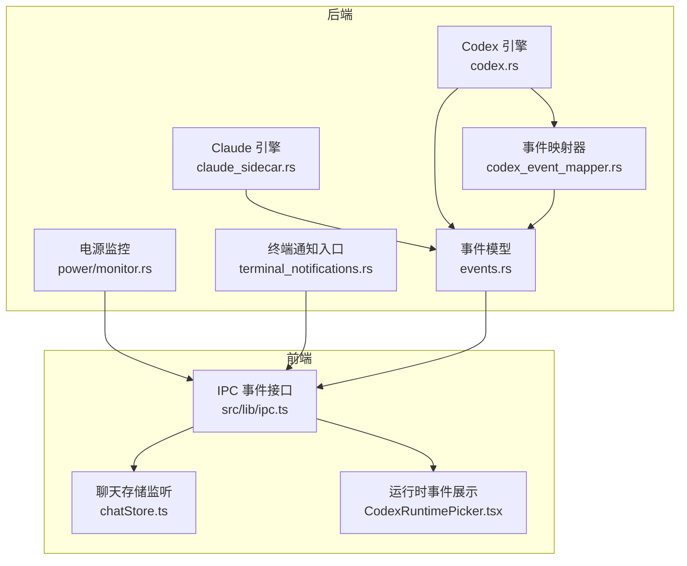
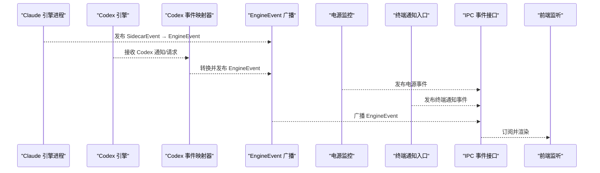
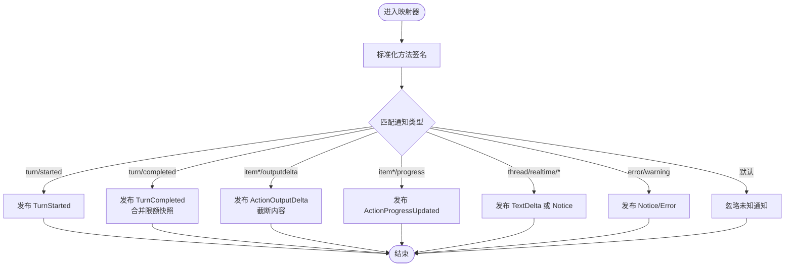
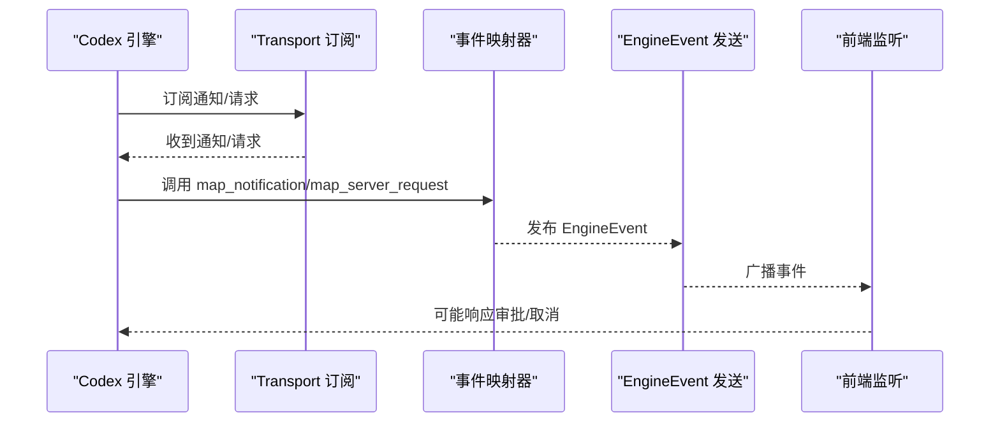
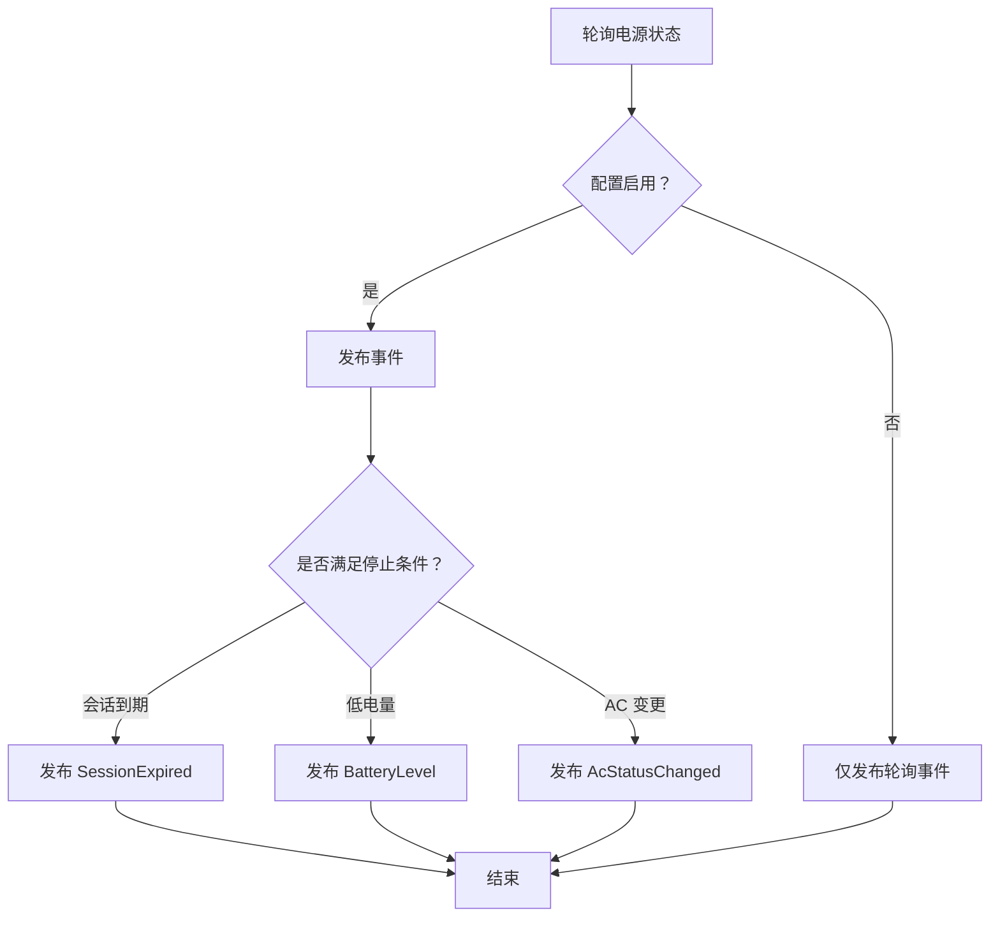
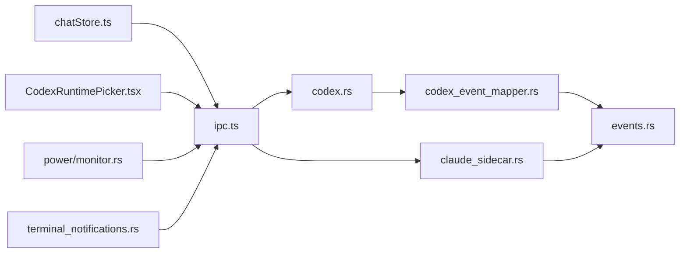

# 事件系统

<cite>
**本文引用的文件**
- [src-tauri/src/engines/events.rs](file://src-tauri/src/engines/events.rs)
- [src-tauri/src/engines/codex_event_mapper.rs](file://src-tauri/src/engines/codex_event_mapper.rs)
- [src-tauri/src/engines/codex.rs](file://src-tauri/src/engines/codex.rs)
- [src-tauri/src/engines/claude_sidecar.rs](file://src-tauri/src/engines/claude_sidecar.rs)
- [src-tauri/src/power/monitor.rs](file://src-tauri/src/power/monitor.rs)
- [src/lib/ipc.ts](file://src/lib/ipc.ts)
- [src/stores/chatStore.ts](file://src/stores/chatStore.ts)
- [src/components/chat/CodexRuntimePicker.tsx](file://src/components/chat/CodexRuntimePicker.tsx)
- [src-tauri/src/terminal_notifications.rs](file://src-tauri/src/terminal_notifications.rs)
</cite>

## 目录
1. [引言](#引言)
2. [项目结构](#项目结构)
3. [核心组件](#核心组件)
4. [架构总览](#架构总览)
5. [详细组件分析](#详细组件分析)
6. [依赖关系分析](#依赖关系分析)
7. [性能考量](#性能考量)
8. [故障排查指南](#故障排查指南)
9. [结论](#结论)
10. [附录](#附录)

## 引言
本文件系统性梳理 Panes 的事件系统，围绕“广播式事件通信”展开，覆盖事件发布订阅、事件过滤、事件处理与运行时事件（如引擎事件、线程状态变化、系统事件）的流转路径。文档同时讨论事件优先级、事件去重与事件持久化策略，并提供事件监控、性能分析与调试工具的使用建议及实际代码示例路径。

## 项目结构
Panes 的事件系统由 Rust 后端（引擎与系统监控）与前端（IPC 事件监听）协同构成：
- 后端引擎层：将外部协议事件映射为统一的 EngineEvent，并通过广播通道分发；同时维护运行时事件（如 Codex 运行时事件）。
- 前端层：通过 IPC 将后端广播事件转换为前端可订阅的事件流，并在 UI 中消费。

图表来源
- [src-tauri/src/engines/claude_sidecar.rs](file://src-tauri/src/engines/claude_sidecar.rs)
- [src-tauri/src/engines/codex.rs](file://src-tauri/src/engines/codex.rs)
- [src-tauri/src/engines/codex_event_mapper.rs](file://src-tauri/src/engines/codex_event_mapper.rs)
- [src-tauri/src/engines/events.rs](file://src-tauri/src/engines/events.rs)
- [src-tauri/src/power/monitor.rs](file://src-tauri/src/power/monitor.rs)
- [src-tauri/src/terminal_notifications.rs](file://src-tauri/src/terminal_notifications.rs)
- [src/lib/ipc.ts](file://src/lib/ipc.ts)
- [src/stores/chatStore.ts](file://src/stores/chatStore.ts)
- [src/components/chat/CodexRuntimePicker.tsx](file://src/components/chat/CodexRuntimePicker.tsx)

章节来源
- [src-tauri/src/engines/claude_sidecar.rs](file://src-tauri/src/engines/claude_sidecar.rs)
- [src-tauri/src/engines/codex.rs](file://src-tauri/src/engines/codex.rs)
- [src-tauri/src/engines/codex_event_mapper.rs](file://src-tauri/src/engines/codex_event_mapper.rs)
- [src-tauri/src/engines/events.rs](file://src-tauri/src/engines/events.rs)
- [src-tauri/src/power/monitor.rs](file://src-tauri/src/power/monitor.rs)
- [src-tauri/src/terminal_notifications.rs](file://src-tauri/src/terminal_notifications.rs)
- [src/lib/ipc.ts](file://src/lib/ipc.ts)
- [src/stores/chatStore.ts](file://src/stores/chatStore.ts)
- [src/components/chat/CodexRuntimePicker.tsx](file://src/components/chat/CodexRuntimePicker.tsx)

## 核心组件
- 统一事件模型：EngineEvent 定义了引擎事件的完整集合，包含对话轮次、文本/思考增量、动作执行、审批请求、用量限制、模型重路由、通知与错误等类型。
- 事件映射器：Codex 事件映射器负责将 Codex 协议通知与服务器请求转化为统一的 EngineEvent，并进行上下文合并、限额快照、输出截断等处理。
- 广播通道：引擎内部使用广播通道向多个订阅者分发事件；同时提供运行时事件通道（如 CodexRuntimeEvent）用于系统级运行态信息。
- 前端事件接口：IPC 层将后端广播事件转换为前端可订阅的命名事件，支持按线程粒度订阅与全局事件订阅。

章节来源
- [src-tauri/src/engines/events.rs](file://src-tauri/src/engines/events.rs)
- [src-tauri/src/engines/codex_event_mapper.rs](file://src-tauri/src/engines/codex_event_mapper.rs)
- [src-tauri/src/engines/codex.rs](file://src-tauri/src/engines/codex.rs)
- [src/lib/ipc.ts](file://src/lib/ipc.ts)

## 架构总览
下图展示了从引擎到前端的事件传播路径，以及事件过滤与去重的关键节点。

图表来源
- [src-tauri/src/engines/claude_sidecar.rs](file://src-tauri/src/engines/claude_sidecar.rs)
- [src-tauri/src/engines/codex.rs](file://src-tauri/src/engines/codex.rs)
- [src-tauri/src/engines/codex_event_mapper.rs](file://src-tauri/src/engines/codex_event_mapper.rs)
- [src-tauri/src/power/monitor.rs](file://src-tauri/src/power/monitor.rs)
- [src-tauri/src/terminal_notifications.rs](file://src-tauri/src/terminal_notifications.rs)
- [src/lib/ipc.ts](file://src/lib/ipc.ts)

## 详细组件分析

### 统一事件模型与映射
- EngineEvent 类型体系：覆盖对话轮次开始/完成、文本/思考增量、动作生命周期、审批请求、用量限制更新、模型重路由、通知与错误等。
- Codex 事件映射器：将 Codex 通知方法名标准化为统一事件，处理令牌用量、限额快照、实时转录、MCP 工具调用进度、权限请求等；并对输出内容进行长度截断以控制带宽与内存占用。
- 输出截断策略：对动作输出增量采用尾部截断策略，确保关键信息可见且避免超长消息影响前端渲染与网络传输。

图表来源
- [src-tauri/src/engines/codex_event_mapper.rs](file://src-tauri/src/engines/codex_event_mapper.rs)
- [src-tauri/src/engines/events.rs](file://src-tauri/src/engines/events.rs)

章节来源
- [src-tauri/src/engines/events.rs](file://src-tauri/src/engines/events.rs)
- [src-tauri/src/engines/codex_event_mapper.rs](file://src-tauri/src/engines/codex_event_mapper.rs)

### 引擎事件发布与订阅
- Claude 引擎：通过侧车进程接收事件，按请求 ID 过滤事件，将 SidecarEvent 映射为 EngineEvent 并广播。
- Codex 引擎：启动 turn 时创建订阅，接收通知与服务器请求，映射为 EngineEvent 并发送；同时维护活动 turn 状态与会话信息。
- 广播容量：事件通道具备固定缓冲容量，避免高负载时阻塞；在 lag 场景下发出告警并触发合成完成或错误事件。

图表来源
- [src-tauri/src/engines/codex.rs](file://src-tauri/src/engines/codex.rs)
- [src-tauri/src/engines/codex_event_mapper.rs](file://src-tauri/src/engines/codex_event_mapper.rs)
- [src/lib/ipc.ts](file://src/lib/ipc.ts)

章节来源
- [src-tauri/src/engines/claude_sidecar.rs](file://src-tauri/src/engines/claude_sidecar.rs)
- [src-tauri/src/engines/codex.rs](file://src-tauri/src/engines/codex.rs)
- [src-tauri/src/engines/codex_event_mapper.rs](file://src-tauri/src/engines/codex_event_mapper.rs)
- [src/lib/ipc.ts](file://src/lib/ipc.ts)

### 系统事件与线程状态变化
- 电源监控：周期性轮询电源状态，根据配置触发 AC 状态变更、低电量阈值、会话到期等事件；支持 macOS 功率源监听回调。
- 终端通知入口：通过 TCP 入口解析通知载荷，校验令牌后发布事件，便于外部系统推送终端通知。
- 线程状态变化：Codex 引擎通过运行时事件通道发布线程状态变更、名称更新、归档/恢复等事件，前端可据此刷新 UI。

图表来源
- [src-tauri/src/power/monitor.rs](file://src-tauri/src/power/monitor.rs)
- [src-tauri/src/terminal_notifications.rs](file://src-tauri/src/terminal_notifications.rs)
- [src-tauri/src/engines/codex.rs](file://src-tauri/src/engines/codex.rs)

章节来源
- [src-tauri/src/power/monitor.rs](file://src-tauri/src/power/monitor.rs)
- [src-tauri/src/terminal_notifications.rs](file://src-tauri/src/terminal_notifications.rs)
- [src-tauri/src/engines/codex.rs](file://src-tauri/src/engines/codex.rs)

### 事件过滤与去重
- 请求 ID 过滤：Claude 引擎按请求 ID 过滤侧车事件，确保只处理当前对话轮次相关事件。
- 活动轮次过滤：Codex 引擎在 turn/completed 前严格按轮次过滤，避免跨轮事件污染。
- 广播 lag 处理：当订阅 lag 时，发出 Notice/Error 并尝试合成 TurnCompleted，保证前端状态一致性。
- 输出截断：对动作输出增量进行尾部截断，避免超长内容影响性能与稳定性。

章节来源
- [src-tauri/src/engines/claude_sidecar.rs](file://src-tauri/src/engines/claude_sidecar.rs)
- [src-tauri/src/engines/codex.rs](file://src-tauri/src/engines/codex.rs)
- [src-tauri/src/engines/codex_event_mapper.rs](file://src-tauri/src/engines/codex_event_mapper.rs)

### 事件优先级与持久化
- 优先级：事件处理遵循“先到先处理”的顺序，但对关键系统事件（如会话到期、低电量）具有更高优先级，会在轮询阶段提前触发。
- 持久化：运行时事件（如线程状态、限额快照）通过广播通道传递至前端，前端可结合本地存储实现 UI 状态持久化；动作输出与消息内容不作为系统级持久化对象，避免状态膨胀。

章节来源
- [src-tauri/src/power/monitor.rs](file://src-tauri/src/power/monitor.rs)
- [src-tauri/src/engines/codex.rs](file://src-tauri/src/engines/codex.rs)

### 事件监控、性能分析与调试
- 监控：电源监控定期发布轮询事件，便于 UI 实时显示电源状态；事件通道容量与 lag 处理保障高负载下的稳定性。
- 性能：输出截断与限额快照减少大消息对前端与网络的影响；事件通道缓冲避免阻塞。
- 调试：前端提供事件监听函数，可在聊天存储中注册线程事件监听，实现事件去重与背景监听，便于诊断轮次切换与流式事件丢失问题。

章节来源
- [src-tauri/src/power/monitor.rs](file://src-tauri/src/power/monitor.rs)
- [src-tauri/src/engines/codex_event_mapper.rs](file://src-tauri/src/engines/codex_event_mapper.rs)
- [src/stores/chatStore.ts](file://src/stores/chatStore.ts)

### 实际代码示例路径
- 事件定义与映射
  - [EngineEvent 类型定义](file://src-tauri/src/engines/events.rs)
  - [Codex 事件映射器](file://src-tauri/src/engines/codex_event_mapper.rs)
- 引擎事件发布与订阅
  - [Codex 引擎事件分发](file://src-tauri/src/engines/codex.rs)
  - [Claude 引擎事件分发](file://src-tauri/src/engines/claude_sidecar.rs)
- 系统事件与运行时事件
  - [电源监控事件](file://src-tauri/src/power/monitor.rs)
  - [终端通知入口](file://src-tauri/src/terminal_notifications.rs)
  - [Codex 运行时事件通道](file://src-tauri/src/engines/codex.rs)
- 前端事件监听与 UI 展示
  - [IPC 事件监听接口](file://src/lib/ipc.ts)
  - [聊天存储中的线程事件监听](file://src/stores/chatStore.ts)
  - [运行时事件展示组件](file://src/components/chat/CodexRuntimePicker.tsx)

章节来源
- [src-tauri/src/engines/events.rs](file://src-tauri/src/engines/events.rs)
- [src-tauri/src/engines/codex_event_mapper.rs](file://src-tauri/src/engines/codex_event_mapper.rs)
- [src-tauri/src/engines/codex.rs](file://src-tauri/src/engines/codex.rs)
- [src-tauri/src/engines/claude_sidecar.rs](file://src-tauri/src/engines/claude_sidecar.rs)
- [src-tauri/src/power/monitor.rs](file://src-tauri/src/power/monitor.rs)
- [src-tauri/src/terminal_notifications.rs](file://src-tauri/src/terminal_notifications.rs)
- [src/lib/ipc.ts](file://src/lib/ipc.ts)
- [src/stores/chatStore.ts](file://src/stores/chatStore.ts)
- [src/components/chat/CodexRuntimePicker.tsx](file://src/components/chat/CodexRuntimePicker.tsx)

## 依赖关系分析
- 组件耦合
  - 引擎层依赖事件映射器进行协议到统一事件的转换，降低协议差异带来的复杂度。
  - 广播通道提供松耦合的事件分发，前端通过 IPC 接口解耦于具体引擎实现。
- 外部依赖
  - Claude 引擎依赖侧车进程与 Node.js 环境；Codex 引擎依赖应用内嵌传输与外部可执行文件。
  - 电源监控在不同平台使用系统 API；终端通知入口依赖 TCP 服务与令牌校验。

图表来源
- [src/stores/chatStore.ts](file://src/stores/chatStore.ts)
- [src/components/chat/CodexRuntimePicker.tsx](file://src/components/chat/CodexRuntimePicker.tsx)
- [src/lib/ipc.ts](file://src/lib/ipc.ts)
- [src-tauri/src/engines/codex.rs](file://src-tauri/src/engines/codex.rs)
- [src-tauri/src/engines/claude_sidecar.rs](file://src-tauri/src/engines/claude_sidecar.rs)
- [src-tauri/src/engines/codex_event_mapper.rs](file://src-tauri/src/engines/codex_event_mapper.rs)
- [src-tauri/src/engines/events.rs](file://src-tauri/src/engines/events.rs)
- [src-tauri/src/power/monitor.rs](file://src-tauri/src/power/monitor.rs)
- [src-tauri/src/terminal_notifications.rs](file://src-tauri/src/terminal_notifications.rs)

章节来源
- [src/stores/chatStore.ts](file://src/stores/chatStore.ts)
- [src/components/chat/CodexRuntimePicker.tsx](file://src/components/chat/CodexRuntimePicker.tsx)
- [src/lib/ipc.ts](file://src/lib/ipc.ts)
- [src-tauri/src/engines/codex.rs](file://src-tauri/src/engines/codex.rs)
- [src-tauri/src/engines/claude_sidecar.rs](file://src-tauri/src/engines/claude_sidecar.rs)
- [src-tauri/src/engines/codex_event_mapper.rs](file://src-tauri/src/engines/codex_event_mapper.rs)
- [src-tauri/src/engines/events.rs](file://src-tauri/src/engines/events.rs)
- [src-tauri/src/power/monitor.rs](file://src-tauri/src/power/monitor.rs)
- [src-tauri/src/terminal_notifications.rs](file://src-tauri/src/terminal_notifications.rs)

## 性能考量
- 事件通道缓冲：广播通道具备固定容量，避免高并发事件导致阻塞；在 lag 场景下发出告警并触发合成完成，提升用户体验。
- 输出截断：对动作输出增量进行尾部截断，减少大消息对前端渲染与网络传输的压力。
- 限额快照：定期拉取账户限额快照，避免频繁查询造成的性能开销。
- 电源轮询：合理设置轮询间隔，平衡 UI 实时性与系统资源消耗。

## 故障排查指南
- 事件丢失与 lag
  - 现象：前端长时间无事件或出现 Notice/Error。
  - 排查：检查事件通道 lag 数量与订阅关闭原因；确认轮次过滤逻辑是否正确。
  - 参考路径：[事件 lag 处理](file://src-tauri/src/engines/codex.rs)
- 电源事件异常
  - 现象：电源状态不更新或低电量未触发。
  - 排查：确认轮询实现与平台特定 API 是否可用；检查配置项（AC 仅模式、低电量阈值、会话时长）。
  - 参考路径：[电源监控实现](file://src-tauri/src/power/monitor.rs)
- 终端通知入口失败
  - 现象：TCP 入口无法解析或令牌无效。
  - 排查：验证令牌校验逻辑与入站载荷格式。
  - 参考路径：[终端通知入口](file://src-tauri/src/terminal_notifications.rs)
- 前端监听与去重
  - 建议：在切换线程时清理旧监听，避免重复事件；对 TurnCompleted 进行背景监听以修复状态。
  - 参考路径：[聊天存储监听与去重](file://src/stores/chatStore.ts)

章节来源
- [src-tauri/src/engines/codex.rs](file://src-tauri/src/engines/codex.rs)
- [src-tauri/src/power/monitor.rs](file://src-tauri/src/power/monitor.rs)
- [src-tauri/src/terminal_notifications.rs](file://src-tauri/src/terminal_notifications.rs)
- [src/stores/chatStore.ts](file://src/stores/chatStore.ts)

## 结论
Panes 的事件系统通过统一的 EngineEvent 模型与广播通道，实现了引擎事件、线程状态变化与系统事件的高效分发。事件映射器与输出截断策略提升了兼容性与性能；前端 IPC 接口提供了灵活的订阅能力。结合电源监控与终端通知入口，系统在多平台环境下保持一致的事件体验。建议在生产环境中关注事件 lag 处理、限额快照与输出截断策略，以进一步优化性能与稳定性。

## 附录
- 事件定义与映射参考路径
  - [EngineEvent 类型定义](file://src-tauri/src/engines/events.rs)
  - [Codex 事件映射器](file://src-tauri/src/engines/codex_event_mapper.rs)
- 引擎事件参考路径
  - [Codex 引擎事件分发](file://src-tauri/src/engines/codex.rs)
  - [Claude 引擎事件分发](file://src-tauri/src/engines/claude_sidecar.rs)
- 系统事件参考路径
  - [电源监控事件](file://src-tauri/src/power/monitor.rs)
  - [终端通知入口](file://src-tauri/src/terminal_notifications.rs)
- 前端事件监听参考路径
  - [IPC 事件监听接口](file://src/lib/ipc.ts)
  - [聊天存储中的线程事件监听](file://src/stores/chatStore.ts)
  - [运行时事件展示组件](file://src/components/chat/CodexRuntimePicker.tsx)