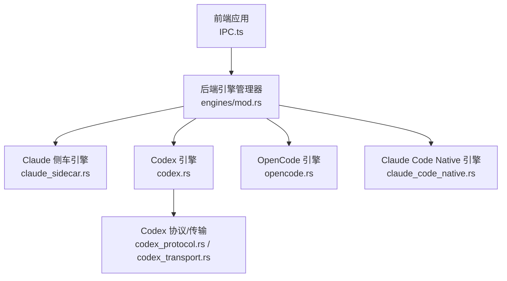
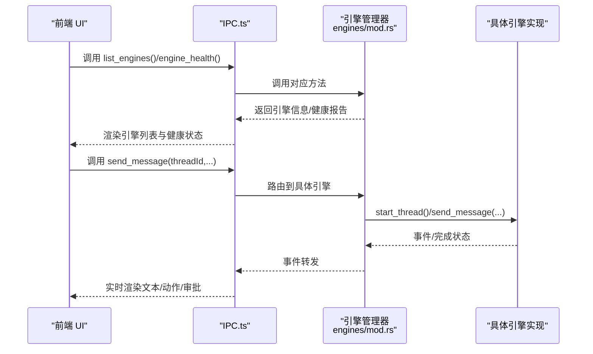
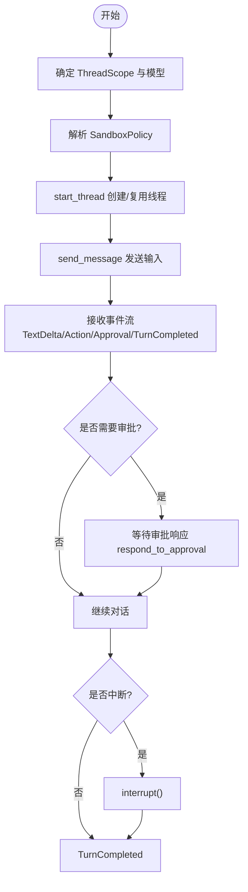
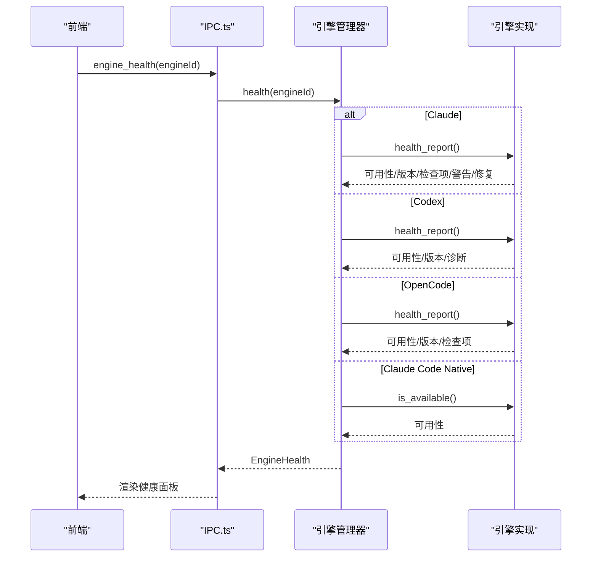
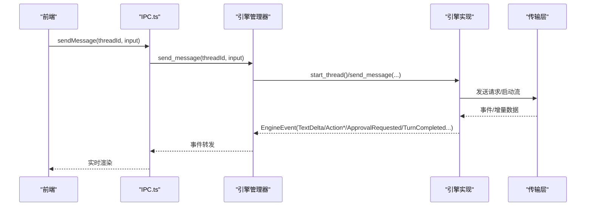
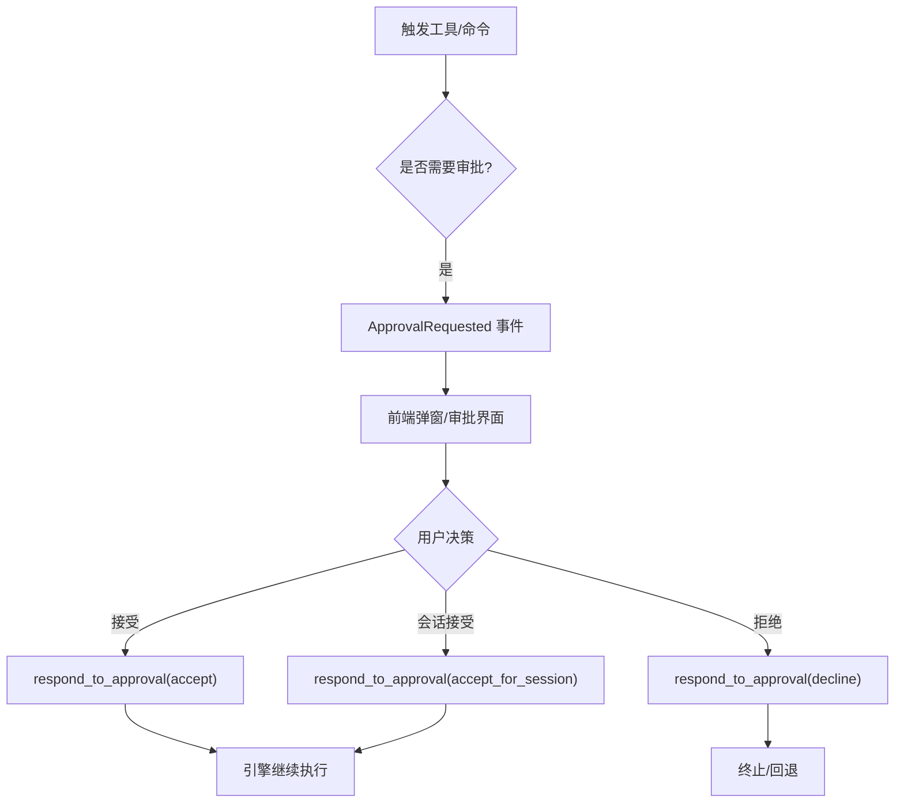
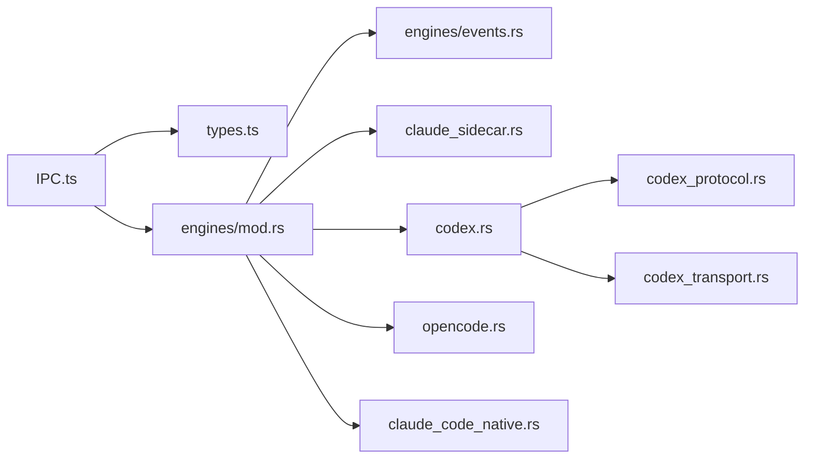

# 引擎通信

<cite>
**本文引用的文件**
- [chatEngineIds.ts](file://src/lib/chatEngineIds.ts)
- [engineStore.ts](file://src/stores/engineStore.ts)
- [engineCapabilities.ts](file://src/components/chat/engineCapabilities.ts)
- [mod.rs](file://src-tauri/src/engines/mod.rs)
- [claude_sidecar.rs](file://src-tauri/src/engines/claude_sidecar.rs)
- [codex.rs](file://src-tauri/src/engines/codex.rs)
- [opencode.rs](file://src-tauri/src/engines/opencode.rs)
- [claude_code_native.rs](file://src-tauri/src/engines/claude_code_native.rs)
- [events.rs](file://src-tauri/src/engines/events.rs)
- [codex_protocol.rs](file://src-tauri/src/engines/codex_protocol.rs)
- [codex_transport.rs](file://src-tauri/src/engines/codex_transport.rs)
- [ipc.ts](file://src/lib/ipc.ts)
- [types.ts](file://src/types.ts)
</cite>

## 目录
1. [简介](#简介)
2. [项目结构](#项目结构)
3. [核心组件](#核心组件)
4. [架构总览](#架构总览)
5. [详细组件分析](#详细组件分析)
6. [依赖关系分析](#依赖关系分析)
7. [性能考量](#性能考量)
8. [故障排查指南](#故障排查指南)
9. [结论](#结论)

## 简介
本文件面向 Panes 引擎通信子系统，系统性阐述与 AI 引擎（Claude、Codex、OpenCode）的通信协议与集成方式，覆盖生命周期管理、健康检查、故障转移、消息序列化、流式传输与实时响应处理，并给出配置管理、性能监控与资源优化策略，以及连接建立、消息传递与状态同步的实现要点。

## 项目结构
- 前端层通过 IPC 接口与后端交互，统一调度引擎发现、健康检查、预热、消息发送与事件订阅。
- 后端引擎模块以统一 Trait 抽象封装不同引擎差异，提供一致的启动线程、发送消息、中断、归档等能力。
- 引擎间通信采用各自专有的协议与传输通道：Codex 使用自研 RPC 协议与进程间 STDIO；Claude 通过 Node Agent SDK Sidecar 进程；OpenCode 通过本地 HTTP 服务；Claude Code Native 则直接调用本地库。

图示来源
- [ipc.ts:337-341](file://src/lib/ipc.ts#L337-L341)
- [mod.rs:463-468](file://src-tauri/src/engines/mod.rs#L463-L468)
- [claude_sidecar.rs:1-120](file://src-tauri/src/engines/claude_sidecar.rs#L1-L120)
- [codex.rs:1-120](file://src-tauri/src/engines/codex.rs#L1-L120)
- [opencode.rs:1-120](file://src-tauri/src/engines/opencode.rs#L1-L120)
- [claude_code_native.rs:1-120](file://src-tauri/src/engines/claude_code_native.rs#L1-L120)
- [codex_protocol.rs:1-120](file://src-tauri/src/engines/codex_protocol.rs#L1-L120)
- [codex_transport.rs:1-120](file://src-tauri/src/engines/codex_transport.rs#L1-L120)

章节来源
- [ipc.ts:337-341](file://src/lib/ipc.ts#L337-L341)
- [mod.rs:463-468](file://src-tauri/src/engines/mod.rs#L463-L468)

## 核心组件
- 引擎抽象与统一接口
  - 后端定义通用 Engine Trait，包含启动线程、发送消息、中断、归档等方法，屏蔽各引擎差异。
  - 引擎管理器聚合多引擎实例，提供统一的列表、健康检查、预热与线程生命周期管理。
- 前端引擎状态与健康
  - Store 负责拉取引擎清单、缓存健康报告、合并并发健康请求、应用运行时更新事件。
  - 能力解析模块根据引擎 ID 返回权限模式、沙箱模式与审批决策能力集合。
- 通信协议与传输
  - Codex：基于 JSON-RPC 的 STDIO 传输，支持请求/通知/响应，带超时与错误处理。
  - Claude：Node Agent SDK Sidecar 子进程，JSON 事件流广播，Ready/Session/Turn/Approval 等事件类型。
  - OpenCode：HTTP 服务器 + SSE 事件总线，按会话维护事件通道。
  - Claude Code Native：直接调用本地库，SSE 流式增量推送文本与工具调用片段。

章节来源
- [mod.rs:419-461](file://src-tauri/src/engines/mod.rs#L419-L461)
- [engineStore.ts:1-164](file://src/stores/engineStore.ts#L1-L164)
- [engineCapabilities.ts:1-69](file://src/components/chat/engineCapabilities.ts#L1-L69)
- [codex_transport.rs:1-120](file://src-tauri/src/engines/codex_transport.rs#L1-L120)
- [codex_protocol.rs:1-120](file://src-tauri/src/engines/codex_protocol.rs#L1-L120)
- [claude_sidecar.rs:39-157](file://src-tauri/src/engines/claude_sidecar.rs#L39-L157)
- [opencode.rs:1-120](file://src-tauri/src/engines/opencode.rs#L1-L120)
- [claude_code_native.rs:1-120](file://src-tauri/src/engines/claude_code_native.rs#L1-L120)

## 架构总览
引擎通信采用“前端 IPC + 后端引擎管理器 + 多引擎适配”的分层设计。前端通过 IPC 发起操作（列举引擎、健康检查、发送消息、响应审批），后端根据引擎 ID 路由到具体引擎实现；引擎内部通过各自的传输层与外部系统交互。

图示来源
- [ipc.ts:337-377](file://src/lib/ipc.ts#L337-L377)
- [mod.rs:795-808](file://src-tauri/src/engines/mod.rs#L795-L808)

章节来源
- [ipc.ts:337-377](file://src/lib/ipc.ts#L337-L377)
- [mod.rs:795-808](file://src-tauri/src/engines/mod.rs#L795-L808)

## 详细组件分析

### 引擎生命周期与线程管理
- 统一生命周期
  - start_thread：根据 ThreadScope、模型与沙箱策略创建或复用线程，返回引擎线程 ID。
  - send_message：发送一轮对话输入，异步接收事件流，支持取消令牌中断。
  - interrupt/steer/archive/unarchive：控制会话行为与归档状态。
- 线程作用域与沙箱
  - ThreadScope 支持仓库级与工作区级作用域；SandboxPolicy 控制可写根、网络访问、权限配置、推理努力等。
- 引擎特定细节
  - Claude/Claude Code Native：基于会话的历史与工具定义构建系统提示，支持工具调用与自动审批。
  - Codex：支持线程复用、外置沙箱探测与回退、速率限制快照、授权失效重置。
  - OpenCode：按会话维护事件总线，SSE 超时保护，消息去重与补全。

图示来源
- [mod.rs:427-461](file://src-tauri/src/engines/mod.rs#L427-L461)
- [claude_code_native.rs:600-720](file://src-tauri/src/engines/claude_code_native.rs#L600-L720)
- [codex.rs:524-750](file://src-tauri/src/engines/codex.rs#L524-L750)
- [opencode.rs:687-800](file://src-tauri/src/engines/opencode.rs#L687-L800)

章节来源
- [mod.rs:427-461](file://src-tauri/src/engines/mod.rs#L427-L461)
- [claude_code_native.rs:600-720](file://src-tauri/src/engines/claude_code_native.rs#L600-L720)
- [codex.rs:524-750](file://src-tauri/src/engines/codex.rs#L524-L750)
- [opencode.rs:687-800](file://src-tauri/src/engines/opencode.rs#L687-L800)

### 健康检查与故障转移
- 健康检查
  - 前端通过 IPC 调用 engine_health 获取可用性、版本、检查项、警告与修复建议。
  - 后端针对各引擎实现独立健康报告：Node/Claude SDK、Codex 可执行文件、OpenCode HTTP 可达性、Claude Code Native API Key 等。
- 故障转移
  - Codex：传输层异常、认证失败、流中断时进行重连与回退；必要时重启子进程。
  - Claude：Sidecar 进程存活检测与重启；Ready 超时保护。
  - OpenCode：SSE 超时与事件总线重建；会话级错误隔离。
  - Claude Code Native：流读取失败与超时处理，转为错误事件并完成回合。

图示来源
- [ipc.ts:338-338](file://src/lib/ipc.ts#L338-L338)
- [mod.rs:555-615](file://src-tauri/src/engines/mod.rs#L555-L615)
- [claude_sidecar.rs:633-702](file://src-tauri/src/engines/claude_sidecar.rs#L633-L702)
- [codex.rs:1-120](file://src-tauri/src/engines/codex.rs#L1-L120)
- [opencode.rs:1-120](file://src-tauri/src/engines/opencode.rs#L1-L120)
- [claude_code_native.rs:562-568](file://src-tauri/src/engines/claude_code_native.rs#L562-L568)

章节来源
- [ipc.ts:338-338](file://src/lib/ipc.ts#L338-L338)
- [mod.rs:555-615](file://src-tauri/src/engines/mod.rs#L555-L615)
- [claude_sidecar.rs:633-702](file://src-tauri/src/engines/claude_sidecar.rs#L633-L702)
- [codex.rs:1-120](file://src-tauri/src/engines/codex.rs#L1-L120)
- [opencode.rs:1-120](file://src-tauri/src/engines/opencode.rs#L1-L120)
- [claude_code_native.rs:562-568](file://src-tauri/src/engines/claude_code_native.rs#L562-L568)

### 消息序列化与流式传输
- Codex
  - 协议：JSON-RPC，STDIO 传输；请求/通知/响应三类消息；大字段自动截断。
  - 传输：广播通道订阅事件，请求超时与错误码映射。
- Claude
  - 协议：JSON 事件流，Ready/SessionInit/TurnStarted/TextDelta/ThinkingDelta/Action*/ApprovalRequested/TurnCompleted/Notice/UsageLimitsUpdated/Error 等。
  - 传输：Sidecar 子进程 STDOUT/STDERR，事件广播，Ready 超时保护。
- OpenCode
  - 协议：HTTP + SSE；事件总线按会话分发；消息去重与补全。
- Claude Code Native
  - 协议：SSE 流式增量；文本 delta 与工具调用片段聚合；TokenUsage 最终上报。

图示来源
- [ipc.ts:358-377](file://src/lib/ipc.ts#L358-L377)
- [mod.rs:795-808](file://src-tauri/src/engines/mod.rs#L795-L808)
- [events.rs:113-177](file://src-tauri/src/engines/events.rs#L113-L177)
- [codex_transport.rs:169-208](file://src-tauri/src/engines/codex_transport.rs#L169-L208)
- [codex_protocol.rs:61-104](file://src-tauri/src/engines/codex_protocol.rs#L61-L104)
- [claude_sidecar.rs:238-290](file://src-tauri/src/engines/claude_sidecar.rs#L238-L290)
- [opencode.rs:709-796](file://src-tauri/src/engines/opencode.rs#L709-L796)
- [claude_code_native.rs:709-800](file://src-tauri/src/engines/claude_code_native.rs#L709-L800)

章节来源
- [ipc.ts:358-377](file://src/lib/ipc.ts#L358-L377)
- [mod.rs:795-808](file://src-tauri/src/engines/mod.rs#L795-L808)
- [events.rs:113-177](file://src-tauri/src/engines/events.rs#L113-L177)
- [codex_transport.rs:169-208](file://src-tauri/src/engines/codex_transport.rs#L169-L208)
- [codex_protocol.rs:61-104](file://src-tauri/src/engines/codex_protocol.rs#L61-L104)
- [claude_sidecar.rs:238-290](file://src-tauri/src/engines/claude_sidecar.rs#L238-L290)
- [opencode.rs:709-796](file://src-tauri/src/engines/opencode.rs#L709-L796)
- [claude_code_native.rs:709-800](file://src-tauri/src/engines/claude_code_native.rs#L709-L800)

### 审批与权限控制
- 权限模式与沙箱
  - 不同引擎支持不同的权限模式、沙箱模式与审批决策集合，前端据此动态渲染与校验。
- 审批路由
  - 某些引擎的审批请求可能携带持久化的路由信息，后端可据此定位原始请求并响应。
- 引擎特定
  - Claude/Claude Code Native：命令执行审批，支持 accept/accept_for_session/decline。
  - OpenCode：Ask/Allow/Deny 三种模式；问题型审批。
  - Codex：支持审批策略与评审者配置。

图示来源
- [engineCapabilities.ts:1-69](file://src/components/chat/engineCapabilities.ts#L1-L69)
- [mod.rs:295-304](file://src-tauri/src/engines/mod.rs#L295-L304)
- [claude_code_native.rs:369-419](file://src-tauri/src/engines/claude_code_native.rs#L369-L419)
- [opencode.rs:1-120](file://src-tauri/src/engines/opencode.rs#L1-L120)
- [codex.rs:1-120](file://src-tauri/src/engines/codex.rs#L1-L120)

章节来源
- [engineCapabilities.ts:1-69](file://src/components/chat/engineCapabilities.ts#L1-L69)
- [mod.rs:295-304](file://src-tauri/src/engines/mod.rs#L295-L304)
- [claude_code_native.rs:369-419](file://src-tauri/src/engines/claude_code_native.rs#L369-L419)
- [opencode.rs:1-120](file://src-tauri/src/engines/opencode.rs#L1-L120)
- [codex.rs:1-120](file://src-tauri/src/engines/codex.rs#L1-L120)

### 配置管理与运行时更新
- 前端 Store
  - 加载引擎清单与健康报告，合并并发健康请求，应用运行时更新事件（如 Codex 协议诊断）。
- 引擎运行时
  - 各引擎维护线程级运行时配置（cwd、模型、权限策略、推理努力、代理等），变更时进行一致性校验与回退。
- 前端事件
  - 通过 IPC 订阅 engine-runtime-updated 事件，动态刷新 UI 与能力展示。

章节来源
- [engineStore.ts:116-162](file://src/stores/engineStore.ts#L116-L162)
- [ipc.ts:694-701](file://src/lib/ipc.ts#L694-L701)
- [types.ts:709-713](file://src/types.ts#L709-L713)

## 依赖关系分析
- 前端依赖
  - IPC.ts 提供统一调用入口；chatEngineIds.ts 用于识别 Claude 家族引擎；engineCapabilities.ts 提供能力映射。
- 后端依赖
  - engines/mod.rs 聚合各引擎实现；events.rs 定义跨引擎事件模型；各引擎实现依赖自身传输与协议模块。

图示来源
- [ipc.ts:1-120](file://src/lib/ipc.ts#L1-L120)
- [types.ts:457-518](file://src/types.ts#L457-L518)
- [mod.rs:1-80](file://src-tauri/src/engines/mod.rs#L1-L80)
- [events.rs:1-120](file://src-tauri/src/engines/events.rs#L1-L120)
- [claude_sidecar.rs:1-120](file://src-tauri/src/engines/claude_sidecar.rs#L1-L120)
- [codex.rs:1-120](file://src-tauri/src/engines/codex.rs#L1-L120)
- [opencode.rs:1-120](file://src-tauri/src/engines/opencode.rs#L1-L120)
- [claude_code_native.rs:1-120](file://src-tauri/src/engines/claude_code_native.rs#L1-L120)
- [codex_protocol.rs:1-120](file://src-tauri/src/engines/codex_protocol.rs#L1-L120)
- [codex_transport.rs:1-120](file://src-tauri/src/engines/codex_transport.rs#L1-L120)

章节来源
- [ipc.ts:1-120](file://src/lib/ipc.ts#L1-L120)
- [types.ts:457-518](file://src/types.ts#L457-L518)
- [mod.rs:1-80](file://src-tauri/src/engines/mod.rs#L1-L80)
- [events.rs:1-120](file://src-tauri/src/engines/events.rs#L1-L120)

## 性能考量
- 事件缓冲与内存
  - Codex 传输层对事件缓冲容量有限制，避免空闲时长期持有大对象导致内存膨胀。
- 大输出截断
  - 协议解析与传输层对大字段（如工具输出、diff、JSON 字符串）进行截断，保障 UI 流畅与稳定性。
- 超时与重试
  - 各引擎设置合理的超时时间（如 OpenCode/Sidecar/Codex），并在失败时进行重试或回退。
- 资源占用
  - Claude Sidecar 与 OpenCode 本地服务需注意进程生命周期管理与资源回收；Codex 传输层在异常时主动关闭子进程。

章节来源
- [codex_transport.rs:20-33](file://src-tauri/src/engines/codex_transport.rs#L20-L33)
- [codex_protocol.rs:120-185](file://src-tauri/src/engines/codex_protocol.rs#L120-L185)
- [claude_sidecar.rs:517-596](file://src-tauri/src/engines/claude_sidecar.rs#L517-L596)
- [opencode.rs:41-80](file://src-tauri/src/engines/opencode.rs#L41-L80)

## 故障排查指南
- 健康检查
  - 若某引擎不可用，查看 health 报告中的检查项、警告与修复建议，按指引修正环境变量、可执行文件或配置。
- 连接与传输
  - Codex：确认可执行文件存在、STDIO 可用、未被杀软拦截；关注 parse_error/transport/read_error 事件。
  - Claude：确认 Node 可用、Sidecar 脚本存在、Ready 超时；检查错误事件与认证错误标记。
  - OpenCode：确认本地 HTTP 服务监听、SSE 连接正常、会话存在；留意超时与事件丢失。
- 审批与权限
  - 检查前端能力映射与引擎实际支持的决策集合；确保审批路由正确回传。
- 日志与事件
  - 通过前端事件订阅（如 stream-event、engine-runtime-updated）观察实时状态变化，定位问题阶段。

章节来源
- [ipc.ts:650-701](file://src/lib/ipc.ts#L650-L701)
- [engineStore.ts:58-115](file://src/stores/engineStore.ts#L58-L115)
- [claude_sidecar.rs:633-702](file://src-tauri/src/engines/claude_sidecar.rs#L633-L702)
- [codex_transport.rs:83-154](file://src-tauri/src/engines/codex_transport.rs#L83-L154)
- [opencode.rs:709-796](file://src-tauri/src/engines/opencode.rs#L709-L796)

## 结论
Panes 引擎通信体系通过统一抽象与多引擎适配，实现了与 Claude、Codex、OpenCode、Claude Code Native 的稳定集成。前端 IPC 与后端引擎管理器协同，结合各引擎特有的协议与传输层，提供了从健康检查、生命周期管理到流式传输与实时响应的完整链路。通过严格的超时与截断策略、事件缓冲控制与故障转移机制，系统在复杂场景下仍保持高可用与高性能。