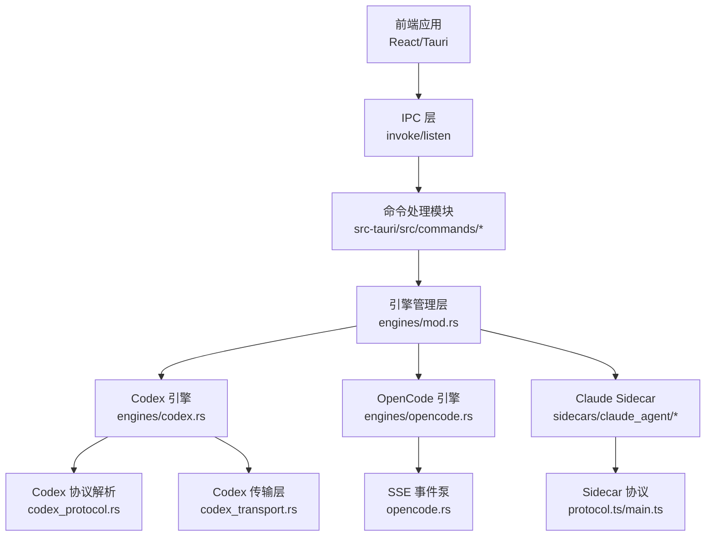
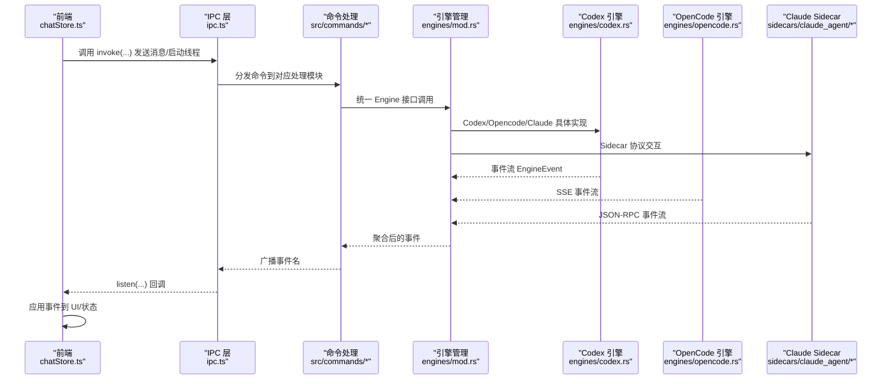
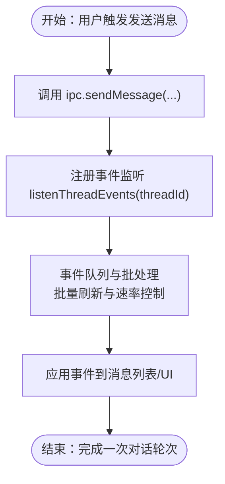
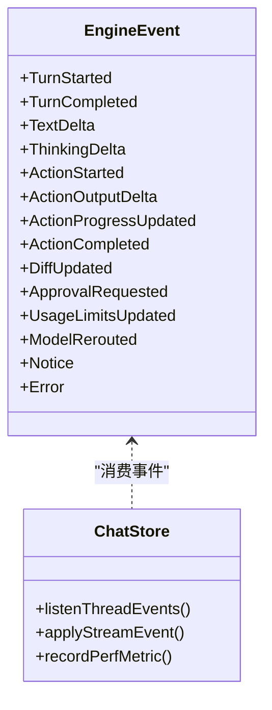
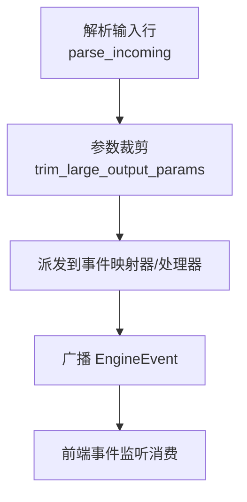
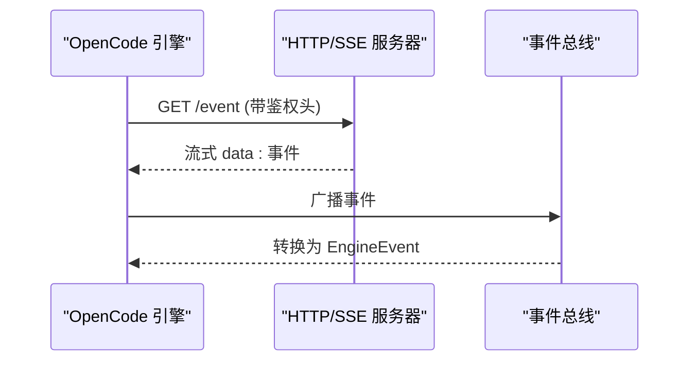
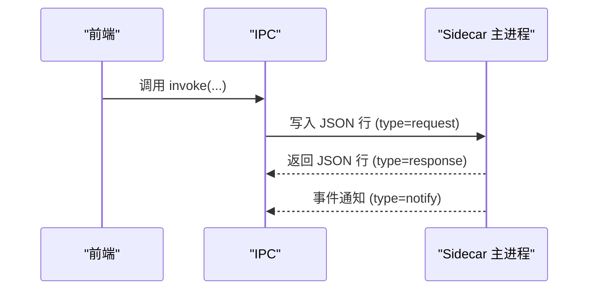
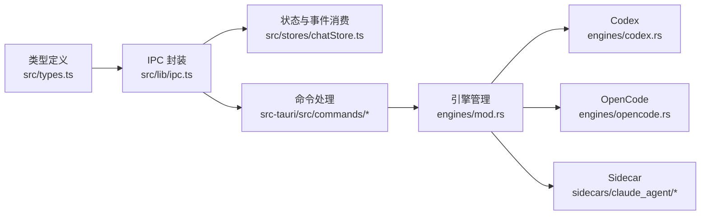

# 通信架构

<cite>
**本文档引用的文件**
- [src/lib/ipc.ts](file://src/lib/ipc.ts)
- [src/types.ts](file://src/types.ts)
- [src/stores/chatStore.ts](file://src/stores/chatStore.ts)
- [src-tauri/src/engines/mod.rs](file://src-tauri/src/engines/mod.rs)
- [src-tauri/src/engines/events.rs](file://src-tauri/src/engines/events.rs)
- [src-tauri/src/engines/codex_protocol.rs](file://src-tauri/src/engines/codex_protocol.rs)
- [src-tauri/src/engines/codex_transport.rs](file://src-tauri/src/engines/codex_transport.rs)
- [src-tauri/src/engines/codex.rs](file://src-tauri/src/engines/codex.rs)
- [src-tauri/src/engines/opencode.rs](file://src-tauri/src/engines/opencode.rs)
- [src-tauri/src/sidecars/claude_agent/src/protocol.ts](file://src-tauri/src/sidecars/claude_agent/src/protocol.ts)
- [src-tauri/src/sidecars/claude_agent/src/main.ts](file://src-tauri/src/sidecars/claude_agent/src/main.ts)
- [src-tauri/src/sidecar-dist/claude-agent-sdk-server.mjs](file://src-tauri/src/sidecar-dist/claude-agent-sdk-server.mjs)
- [src/lib/perfTelemetry.ts](file://src/lib/perfTelemetry.ts)
</cite>

## 目录
1. [简介](#简介)
2. [项目结构](#项目结构)
3. [核心组件](#核心组件)
4. [架构总览](#架构总览)
5. [详细组件分析](#详细组件分析)
6. [依赖关系分析](#依赖关系分析)
7. [性能考量](#性能考量)
8. [故障排查指南](#故障排查指南)
9. [结论](#结论)

## 简介
本文件系统性梳理 Panes 的通信架构，覆盖前端与后端（Tauri/Rust）之间的 IPC 通信机制，包括命令调用、事件监听与数据传输协议；深入解析异步通信模式、错误处理与超时管理；阐述引擎间通信、Sidecar WebSocket 连接与实时事件推送；并给出通信安全策略、性能优化与调试工具建议。

## 项目结构
- 前端通过 @tauri-apps/api 与后端进行双向通信：命令调用使用 invoke，事件订阅使用 listen。
- 后端以 Rust 引擎层为核心，抽象统一的 Engine 接口，支持多引擎（Codex、Claude、OpenCode 等），并通过内部广播/通道实现事件分发。
- 引擎与外部 Sidecar 通过 JSON-RPC 协议交互，部分引擎采用 SSE 实时推送事件。
- 类型定义在 TypeScript 与 Rust 双侧保持一致，确保序列化/反序列化正确性。

图表来源
- [src/lib/ipc.ts:1-792](file://src/lib/ipc.ts#L1-L792)
- [src-tauri/src/engines/mod.rs:1-800](file://src-tauri/src/engines/mod.rs#L1-L800)
- [src-tauri/src/engines/codex.rs:1-200](file://src-tauri/src/engines/codex.rs#L1-L200)
- [src-tauri/src/engines/opencode.rs:1-200](file://src-tauri/src/engines/opencode.rs#L1-L200)
- [src-tauri/src/sidecars/claude_agent/src/protocol.ts:1-21](file://src-tauri/src/sidecars/claude_agent/src/protocol.ts#L1-L21)
- [src-tauri/src/sidecars/claude_agent/src/main.ts:1-32](file://src-tauri/src/sidecars/claude_agent/src/main.ts#L1-L32)

章节来源
- [src/lib/ipc.ts:1-792](file://src/lib/ipc.ts#L1-L792)
- [src-tauri/src/engines/mod.rs:1-800](file://src-tauri/src/engines/mod.rs#L1-L800)

## 核心组件
- IPC 命令接口封装：前端集中导出所有可调用命令与事件监听函数，统一类型约束与返回值。
- 引擎事件模型：统一的 EngineEvent 枚举，涵盖文本增量、动作输出、差异更新、审批请求等。
- 协议与传输：Codex 使用自定义 JSON-RPC 解析与参数裁剪；OpenCode 使用 HTTP SSE；Claude Sidecar 使用 Node readline JSON 消息流。
- 性能遥测：前端内置性能指标记录与阈值告警，便于定位通信与渲染瓶颈。

章节来源
- [src/lib/ipc.ts:72-627](file://src/lib/ipc.ts#L72-L627)
- [src-tauri/src/engines/events.rs:113-262](file://src-tauri/src/engines/events.rs#L113-L262)
- [src-tauri/src/engines/codex_protocol.rs:1-611](file://src-tauri/src/engines/codex_protocol.rs#L1-L611)
- [src-tauri/src/engines/codex_transport.rs:273-413](file://src-tauri/src/engines/codex_transport.rs#L273-L413)
- [src-tauri/src/engines/opencode.rs:1-200](file://src-tauri/src/engines/opencode.rs#L1-L200)
- [src-tauri/src/sidecars/claude_agent/src/protocol.ts:1-21](file://src-tauri/src/sidecars/claude_agent/src/protocol.ts#L1-L21)
- [src/lib/perfTelemetry.ts:1-146](file://src/lib/perfTelemetry.ts#L1-L146)

## 架构总览
下图展示从前端到后端、再到各引擎与 Sidecar 的完整通信路径，以及事件回推与性能监控闭环。

图表来源
- [src/stores/chatStore.ts:1615-1801](file://src/stores/chatStore.ts#L1615-L1801)
- [src/lib/ipc.ts:629-791](file://src/lib/ipc.ts#L629-L791)
- [src-tauri/src/engines/mod.rs:420-461](file://src-tauri/src/engines/mod.rs#L420-L461)
- [src-tauri/src/engines/codex.rs:1-200](file://src-tauri/src/engines/codex.rs#L1-L200)
- [src-tauri/src/engines/opencode.rs:2496-2561](file://src-tauri/src/engines/opencode.rs#L2496-L2561)
- [src-tauri/src/sidecars/claude_agent/src/main.ts:15-32](file://src-tauri/src/sidecars/claude_agent/src/main.ts#L15-L32)

## 详细组件分析

### 前端 IPC 封装与事件监听
- 命令调用：通过 ipc 对象导出大量 invoke 方法，覆盖工作区、线程、引擎、Git、终端等操作；每个方法携带明确的参数与返回类型。
- 事件监听：提供 listenThreadEvents、listenGitRepoChanged、listenEngineRuntimeUpdated 等高阶监听器，自动拼接命名空间事件名并解耦 UI。
- 终端写入优化：writeCommandToNewSession 提供“等待输出就绪再写入”的策略，并带回退超时，避免空会话写入失败。

图表来源
- [src/lib/ipc.ts:357-420](file://src/lib/ipc.ts#L357-L420)
- [src/lib/ipc.ts:629-634](file://src/lib/ipc.ts#L629-L634)
- [src/stores/chatStore.ts:1615-1801](file://src/stores/chatStore.ts#L1615-L1801)

章节来源
- [src/lib/ipc.ts:72-627](file://src/lib/ipc.ts#L72-L627)
- [src/lib/ipc.ts:629-791](file://src/lib/ipc.ts#L629-L791)
- [src/stores/chatStore.ts:1-200](file://src/stores/chatStore.ts#L1-L200)

### 引擎事件模型与数据流
- EngineEvent 定义了统一的事件类型集合，包括 TurnStarted/Completed、TextDelta、ThinkingDelta、Action*、DiffUpdated、ApprovalRequested、UsageLimitsUpdated、Error 等。
- 事件在 Rust 引擎内部通过广播/通道传播，最终由命令层转换为前端可消费的事件名，前端通过 listen 注册回调。

图表来源
- [src-tauri/src/engines/events.rs:113-262](file://src-tauri/src/engines/events.rs#L113-L262)
- [src/stores/chatStore.ts:118-155](file://src/stores/chatStore.ts#L118-L155)

章节来源
- [src-tauri/src/engines/events.rs:1-262](file://src-tauri/src/engines/events.rs#L1-L262)
- [src/stores/chatStore.ts:118-155](file://src/stores/chatStore.ts#L118-L155)

### Codex 引擎通信协议与传输
- 协议解析：codex_protocol.rs 提供 IncomingMessage 抽象，支持 Request/Notification/Response 三类消息；对大字段（如 action output、diff、item.completed）进行参数裁剪，防止内存膨胀。
- 传输层：codex_transport.rs 在解析前对大负载进行裁剪与错误行截断，保障日志与诊断信息可控。
- 超时与健康检查：codex.rs 中设置多种超时（默认、TURN 请求、健康检查），并限制传输重启次数与回退策略。

图表来源
- [src-tauri/src/engines/codex_protocol.rs:61-104](file://src-tauri/src/engines/codex_protocol.rs#L61-L104)
- [src-tauri/src/engines/codex_protocol.rs:120-169](file://src-tauri/src/engines/codex_protocol.rs#L120-L169)
- [src-tauri/src/engines/codex_transport.rs:278-297](file://src-tauri/src/engines/codex_transport.rs#L278-L297)
- [src-tauri/src/engines/codex.rs:72-84](file://src-tauri/src/engines/codex.rs#L72-L84)

章节来源
- [src-tauri/src/engines/codex_protocol.rs:1-611](file://src-tauri/src/engines/codex_protocol.rs#L1-L611)
- [src-tauri/src/engines/codex_transport.rs:273-413](file://src-tauri/src/engines/codex_transport.rs#L273-L413)
- [src-tauri/src/engines/codex.rs:1-200](file://src-tauri/src/engines/codex.rs#L1-L200)

### OpenCode 引擎与 SSE 实时推送
- 启动与健康：opencode.rs 管理本地 HTTP 服务生命周期，包含启动超时、健康检查与消息限制。
- SSE 事件泵：通过循环连接与流式读取，按行解析 data: 行，将事件投递到广播通道，再由引擎层转换为 EngineEvent。
- 超时与稳定性：设置 SSE 空闲超时，避免长时间无事件导致资源占用；连接失败时指数回退重试。

图表来源
- [src-tauri/src/engines/opencode.rs:2496-2561](file://src-tauri/src/engines/opencode.rs#L2496-L2561)
- [src-tauri/src/engines/opencode.rs:1-200](file://src-tauri/src/engines/opencode.rs#L1-L200)

章节来源
- [src-tauri/src/engines/opencode.rs:1-200](file://src-tauri/src/engines/opencode.rs#L1-L200)
- [src-tauri/src/engines/opencode.rs:2496-2561](file://src-tauri/src/engines/opencode.rs#L2496-L2561)

### Claude Sidecar 协议与命令
- 协议定义：protocol.ts 规范了 SidecarRequest/Response/Notify 三种消息类型，支持 id、method、params 字段。
- 主循环：main.ts 通过 readline 逐行读取 JSON，解析后交由 runner 处理，响应逐条写出。
- 服务端实现：sidecar-dist/claude-agent-sdk-server.mjs 支持 cancel/approval_response/version/query 等方法，具备 ready 通知与信号处理。

图表来源
- [src-tauri/src/sidecars/claude_agent/src/protocol.ts:1-21](file://src-tauri/src/sidecars/claude_agent/src/protocol.ts#L1-L21)
- [src-tauri/src/sidecars/claude_agent/src/main.ts:15-32](file://src-tauri/src/sidecars/claude_agent/src/main.ts#L15-L32)
- [src-tauri/src/sidecar-dist/claude-agent-sdk-server.mjs:1454-1489](file://src-tauri/src/sidecar-dist/claude-agent-sdk-server.mjs#L1454-L1489)

章节来源
- [src-tauri/src/sidecars/claude_agent/src/protocol.ts:1-21](file://src-tauri/src/sidecars/claude_agent/src/protocol.ts#L1-L21)
- [src-tauri/src/sidecars/claude_agent/src/main.ts:1-32](file://src-tauri/src/sidecars/claude_agent/src/main.ts#L1-L32)
- [src-tauri/src/sidecar-dist/claude-agent-sdk-server.mjs:1454-1489](file://src-tauri/src/sidecar-dist/claude-agent-sdk-server.mjs#L1454-L1489)

### 异步通信模式、错误处理与超时管理
- 异步模式：前端使用 Promise 包裹 invoke，事件使用 listen 订阅；后端使用 tokio::mpsc/broadcast 实现事件分发。
- 错误处理：Codex 传输层对解析错误进行行截断与结构化载荷生成；OpenCode 对连接失败进行回退重试；前端对不可恢复错误更新线程状态。
- 超时管理：Codex 设置默认/TURN/健康检查超时；OpenCode 设置 SSE 空闲超时；Sidecar 服务端处理 SIGTERM/SIGINT。

章节来源
- [src-tauri/src/engines/codex_transport.rs:299-305](file://src-tauri/src/engines/codex_transport.rs#L299-L305)
- [src-tauri/src/engines/opencode.rs:45-46](file://src-tauri/src/engines/opencode.rs#L45-L46)
- [src-tauri/src/sidecar-dist/claude-agent-sdk-server.mjs:1482-1489](file://src-tauri/src/sidecar-dist/claude-agent-sdk-server.mjs#L1482-L1489)

### 通信安全策略
- 权限与沙箱：引擎层支持权限模式、沙箱模式、网络策略与审批决策；前端 UI 提供权限选择器与审批响应构建。
- 配置校验：后端对权限配置文件系统与网络项进行严格校验，拒绝非法结构。
- 传输安全：Sidecar 通过密码鉴权头访问；OpenCode 服务端仅监听本地回环地址。

章节来源
- [src-tauri/src/engines/mod.rs:114-187](file://src-tauri/src/engines/mod.rs#L114-L187)
- [src-tauri/src/commands/threads.rs:2593-2625](file://src-tauri/src/commands/threads.rs#L2593-L2625)
- [src-tauri/src/engines/opencode.rs:47-48](file://src-tauri/src/engines/opencode.rs#L47-L48)

### 性能优化与调试工具
- 前端性能遥测：记录聊天首帧、事件速率、渲染耗时等指标，超过预算自动告警并保留最近 4000 条记录。
- 事件批处理：聊天流事件采用微批窗口与阈值控制，降低 UI 刷新频率与重排成本。
- 日志裁剪：Codex 事件日志对大字段进行截断，避免日志膨胀影响可观测性。

章节来源
- [src/lib/perfTelemetry.ts:1-146](file://src/lib/perfTelemetry.ts#L1-L146)
- [src/stores/chatStore.ts:65-66](file://src/stores/chatStore.ts#L65-L66)
- [src-tauri/src/engines/codex_protocol.rs:28-30](file://src-tauri/src/engines/codex_protocol.rs#L28-L30)

## 依赖关系分析
- 前端依赖 @tauri-apps/api 进行 IPC；ipc.ts 将命令与事件统一封装，降低上层耦合。
- 后端引擎层通过统一 Engine trait 与 EngineManager 管理多引擎；Codex/OpenCode/Sidecar 各自实现差异化协议。
- 类型一致性：src/types.ts 与 Rust models 保持字段与枚举一致，确保跨语言序列化稳定。

图表来源
- [src/types.ts:1-800](file://src/types.ts#L1-L800)
- [src/lib/ipc.ts:1-792](file://src/lib/ipc.ts#L1-L792)
- [src/stores/chatStore.ts:1-200](file://src/stores/chatStore.ts#L1-L200)
- [src-tauri/src/engines/mod.rs:463-478](file://src-tauri/src/engines/mod.rs#L463-L478)

章节来源
- [src/types.ts:1-800](file://src/types.ts#L1-L800)
- [src/lib/ipc.ts:1-792](file://src/lib/ipc.ts#L1-L792)
- [src-tauri/src/engines/mod.rs:1-800](file://src-tauri/src/engines/mod.rs#L1-L800)

## 性能考量
- 事件批处理与节流：前端聊天流事件采用微批窗口与阈值控制，避免高频 UI 更新引发掉帧。
- 参数裁剪：Codex 协议对大字段进行截断，减少内存占用与序列化开销。
- 超时与回退：多处设置超时与指数回退，提升系统在异常场景下的稳定性。
- 遥测与告警：内置性能预算与告警，帮助快速定位瓶颈。

## 故障排查指南
- 事件未到达：确认前端是否正确注册 listenThreadEvents，检查事件名拼接与线程 ID；查看前端事件队列与批处理逻辑。
- 超时问题：Codex TURN 请求超时或 OpenCode SSE 空闲超时，检查后端日志与网络连通性；必要时增大超时或优化上游响应。
- 协议解析错误：Codex 传输层对错误行进行截断与结构化载荷生成，关注日志中的错误行尾部截断提示。
- Sidecar 不可用：检查 sidecar-dist/claude-agent-sdk-server.mjs 是否正常启动并发出 ready 通知；验证信号处理与退出路径。

章节来源
- [src/lib/ipc.ts:629-791](file://src/lib/ipc.ts#L629-L791)
- [src-tauri/src/engines/codex_transport.rs:299-305](file://src-tauri/src/engines/codex_transport.rs#L299-L305)
- [src-tauri/src/sidecar-dist/claude-agent-sdk-server.mjs:1482-1489](file://src-tauri/src/sidecar-dist/claude-agent-sdk-server.mjs#L1482-L1489)

## 结论
Panes 的通信架构以统一的 IPC 层为入口，结合 Rust 引擎层的事件模型与多协议适配（JSON-RPC、SSE、Sidecar），实现了前后端高效、稳定的异步通信。通过严格的超时与错误处理、参数裁剪与性能遥测，系统在复杂工程场景中仍能保持良好的用户体验与可观测性。建议在后续迭代中进一步完善跨引擎协议的标准化与安全审计，持续优化事件批处理与渲染性能。