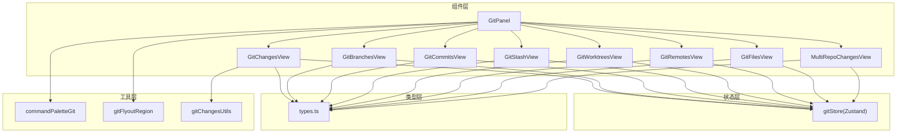
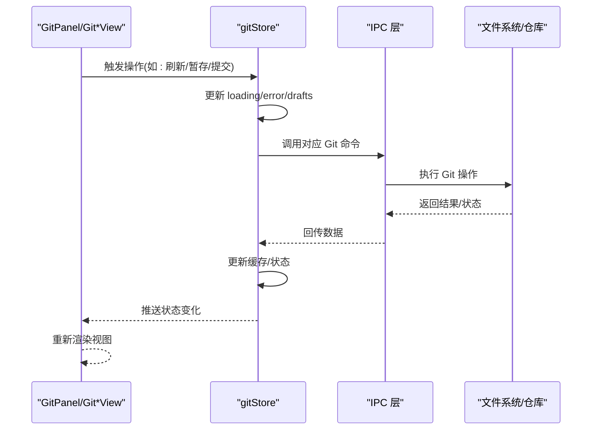
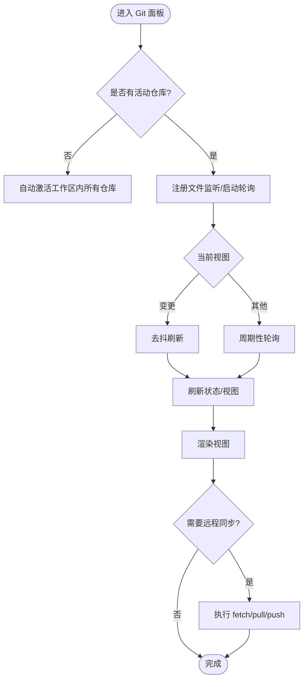
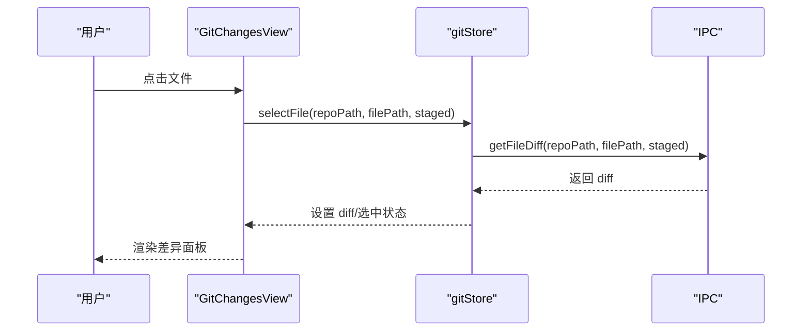
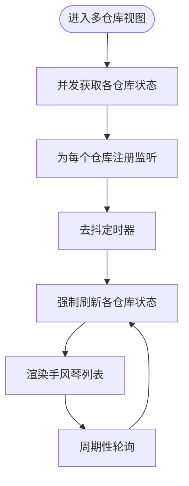
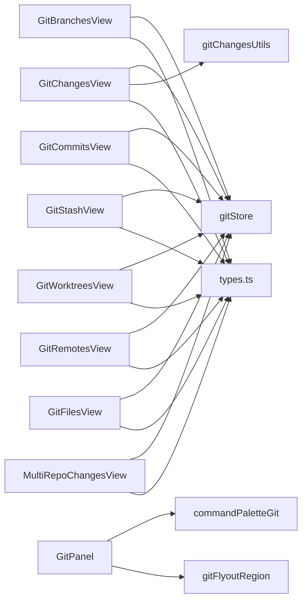

# Git 版本控制

<cite>
**本文档引用的文件**
- [GitPanel.tsx](file://src/components/git/GitPanel.tsx)
- [gitStore.ts](file://src/stores/gitStore.ts)
- [GitChangesView.tsx](file://src/components/git/GitChangesView.tsx)
- [MultiRepoChangesView.tsx](file://src/components/git/MultiRepoChangesView.tsx)
- [GitBranchesView.tsx](file://src/components/git/GitBranchesView.tsx)
- [GitCommitsView.tsx](file://src/components/git/GitCommitsView.tsx)
- [GitStashView.tsx](file://src/components/git/GitStashView.tsx)
- [GitWorktreesView.tsx](file://src/components/git/GitWorktreesView.tsx)
- [gitChangesUtils.ts](file://src/components/git/gitChangesUtils.ts)
- [GitRemotesView.tsx](file://src/components/git/GitRemotesView.tsx)
- [GitFilesView.tsx](file://src/components/git/GitFilesView.tsx)
- [commandPaletteGit.ts](file://src/lib/commandPaletteGit.ts)
- [gitFlyoutRegion.ts](file://src/lib/gitFlyoutRegion.ts)
- [types.ts](file://src/types.ts)
</cite>

## 目录
1. [简介](#简介)
2. [项目结构](#项目结构)
3. [核心组件](#核心组件)
4. [架构总览](#架构总览)
5. [详细组件分析](#详细组件分析)
6. [依赖关系分析](#依赖关系分析)
7. [性能考量](#性能考量)
8. [故障排除指南](#故障排除指南)
9. [结论](#结论)
10. [附录](#附录)

## 简介
本文件系统性梳理了代码库中的 Git 版本控制功能，涵盖仓库管理、分支操作、提交历史与差异查看等核心能力。重点解析 Git 面板组件、变更视图、提交视图、文件视图、工作树与多仓库支持的实现方式，并阐述状态缓存、文件监听、远程同步、草稿历史等工程化特性。同时提供最佳实践、常见问题与性能优化建议，帮助开发者与用户高效使用 Git 功能。

## 项目结构
Git 相关前端代码主要位于 src/components/git 与 src/stores 下，配合 src/lib 中的工具模块与 src/types 定义的数据模型协同工作。整体采用“组件 + 状态存储 + 工具函数”的分层设计：

- 组件层：GitPanel、各子视图（变更、分支、提交、stash、工作树、远程、文件）
- 状态层：gitStore（Zustand）集中管理 Git 状态、缓存与异步操作
- 工具层：命令面板集成、飞出菜单区域检测、变更树构建等
- 类型层：Git 状态、分支、提交、差异、工作树等类型定义

图表来源
- [GitPanel.tsx:48-82](file://src/components/git/GitPanel.tsx#L48-L82)
- [gitStore.ts:476-654](file://src/stores/gitStore.ts#L476-L654)
- [GitChangesView.tsx:104-121](file://src/components/git/GitChangesView.tsx#L104-L121)
- [GitBranchesView.tsx:29-48](file://src/components/git/GitBranchesView.tsx#L29-L48)
- [GitCommitsView.tsx:13-25](file://src/components/git/GitCommitsView.tsx#L13-L25)
- [GitStashView.tsx:14-16](file://src/components/git/GitStashView.tsx#L14-L16)
- [GitWorktreesView.tsx:50-60](file://src/components/git/GitWorktreesView.tsx#L50-L60)
- [GitRemotesView.tsx:15-26](file://src/components/git/GitRemotesView.tsx#L15-L26)
- [GitFilesView.tsx:77-87](file://src/components/git/GitFilesView.tsx#L77-L87)
- [MultiRepoChangesView.tsx:56-61](file://src/components/git/MultiRepoChangesView.tsx#L56-L61)
- [commandPaletteGit.ts:1-45](file://src/lib/commandPaletteGit.ts#L1-L45)
- [gitFlyoutRegion.ts:1-42](file://src/lib/gitFlyoutRegion.ts#L1-L42)
- [gitChangesUtils.ts:1-144](file://src/components/git/gitChangesUtils.ts#L1-L144)
- [types.ts:724-800](file://src/types.ts#L724-L800)

章节来源
- [GitPanel.tsx:48-82](file://src/components/git/GitPanel.tsx#L48-L82)
- [gitStore.ts:476-654](file://src/stores/gitStore.ts#L476-L654)

## 核心组件
- Git 面板（GitPanel）：作为入口容器，负责视图切换、仓库选择、远程同步、错误展示、工作树管理与多仓库聚合视图。
- 变更视图（GitChangesView）：展示工作区与暂存区文件变更，支持逐文件/目录暂存/取消暂存、丢弃、打开编辑器、提交等。
- 分支视图（GitBranchesView）：列出本地/远程分支，支持筛选、新建、检出、重命名、删除等。
- 提交视图（GitCommitsView）：展示提交历史，支持筛选、加载更多、查看提交差异。
- Stash 视图（GitStashView）：保存/应用/弹出暂存条目。
- 工作树视图（GitWorktreesView）：管理主仓库与工作树，支持创建、删除、修剪、在面板中打开。
- 远程视图（GitRemotesView）：管理远程仓库，支持增删改名与确认删除。
- 文件视图（GitFilesView）：以虚拟化树形展示工作目录文件，支持过滤与打开。
- 多仓库视图（MultiRepoChangesView）：在多仓库场景下聚合变更，带文件监听与轮询刷新。

章节来源
- [GitPanel.tsx:100-109](file://src/components/git/GitPanel.tsx#L100-L109)
- [GitChangesView.tsx:104-121](file://src/components/git/GitChangesView.tsx#L104-L121)
- [GitBranchesView.tsx:29-48](file://src/components/git/GitBranchesView.tsx#L29-L48)
- [GitCommitsView.tsx:13-25](file://src/components/git/GitCommitsView.tsx#L13-L25)
- [GitStashView.tsx:14-16](file://src/components/git/GitStashView.tsx#L14-L16)
- [GitWorktreesView.tsx:50-60](file://src/components/git/GitWorktreesView.tsx#L50-L60)
- [GitRemotesView.tsx:15-26](file://src/components/git/GitRemotesView.tsx#L15-L26)
- [GitFilesView.tsx:77-87](file://src/components/git/GitFilesView.tsx#L77-L87)
- [MultiRepoChangesView.tsx:56-61](file://src/components/git/MultiRepoChangesView.tsx#L56-L61)

## 架构总览
Git 功能由前端组件通过 IPC 调用后端命令实现，状态通过 Zustand 存储统一管理，并内置多级缓存与去抖/轮询策略提升交互性能与稳定性。

图表来源
- [gitStore.ts:522-620](file://src/stores/gitStore.ts#L522-L620)
- [GitPanel.tsx:316-324](file://src/components/git/GitPanel.tsx#L316-L324)

## 详细组件分析

### Git 面板组件（GitPanel）
- 视图切换：支持变更、分支、提交、stash、工作树五个标签页。
- 仓库选择：多仓库与工作树切换，支持“回到主仓库”。
- 远程同步：一键刷新/拉取/推送，显示 ahead/beind 状态。
- 错误处理：集中错误展示与清除。
- 自动激活：无仓库时自动激活工作区内的所有仓库。
- 文件监听与轮询：根据当前视图与同步状态动态调度刷新，避免频繁请求。
- 初始化仓库：首次进入空工作区时可初始化 Git 仓库。

图表来源
- [GitPanel.tsx:275-285](file://src/components/git/GitPanel.tsx#L275-L285)
- [GitPanel.tsx:316-324](file://src/components/git/GitPanel.tsx#L316-L324)
- [GitPanel.tsx:386-418](file://src/components/git/GitPanel.tsx#L386-L418)
- [GitPanel.tsx:420-462](file://src/components/git/GitPanel.tsx#L420-L462)

章节来源
- [GitPanel.tsx:48-82](file://src/components/git/GitPanel.tsx#L48-L82)
- [GitPanel.tsx:137-167](file://src/components/git/GitPanel.tsx#L137-L167)
- [GitPanel.tsx:180-202](file://src/components/git/GitPanel.tsx#L180-L202)
- [GitPanel.tsx:220-258](file://src/components/git/GitPanel.tsx#L220-L258)
- [GitPanel.tsx:260-273](file://src/components/git/GitPanel.tsx#L260-L273)

### 变更视图（GitChangesView）
- 结构化展示：按目录折叠/展开，区分未暂存与已暂存文件。
- 操作能力：单文件/目录暂存/取消暂存、批量操作、丢弃、打开编辑器、提交草稿。
- 差异预览：点击文件后右侧显示 diff，支持大文件截断提示。
- 提交草稿：支持历史记录上下键导航与持久化草稿。

图表来源
- [GitChangesView.tsx:104-121](file://src/components/git/GitChangesView.tsx#L104-L121)
- [gitStore.ts:725-752](file://src/stores/gitStore.ts#L725-L752)

章节来源
- [GitChangesView.tsx:104-121](file://src/components/git/GitChangesView.tsx#L104-L121)
- [GitChangesView.tsx:199-217](file://src/components/git/GitChangesView.tsx#L199-L217)
- [GitChangesView.tsx:219-249](file://src/components/git/GitChangesView.tsx#L219-L249)
- [GitChangesView.tsx:273-297](file://src/components/git/GitChangesView.tsx#L273-L297)
- [GitChangesView.tsx:299-345](file://src/components/git/GitChangesView.tsx#L299-L345)

### 多仓库变更视图（MultiRepoChangesView）
- 聚合展示：当存在多个活动仓库时，以手风琴形式展示各仓库变更。
- 并发刷新：对每个仓库独立发起状态查询，支持强制刷新与去抖。
- 文件监听：为每个仓库注册监听事件，触发后去抖刷新。
- 轮询刷新：在后台定期轮询，保证变更及时可见。
- 自动展开：脏仓库首次加载时自动展开。

图表来源
- [MultiRepoChangesView.tsx:56-61](file://src/components/git/MultiRepoChangesView.tsx#L56-L61)
- [MultiRepoChangesView.tsx:91-125](file://src/components/git/MultiRepoChangesView.tsx#L91-L125)
- [MultiRepoChangesView.tsx:166-231](file://src/components/git/MultiRepoChangesView.tsx#L166-L231)
- [MultiRepoChangesView.tsx:233-262](file://src/components/git/MultiRepoChangesView.tsx#L233-L262)

章节来源
- [MultiRepoChangesView.tsx:56-61](file://src/components/git/MultiRepoChangesView.tsx#L56-L61)
- [MultiRepoChangesView.tsx:91-125](file://src/components/git/MultiRepoChangesView.tsx#L91-L125)
- [MultiRepoChangesView.tsx:166-231](file://src/components/git/MultiRepoChangesView.tsx#L166-L231)
- [MultiRepoChangesView.tsx:233-262](file://src/components/git/MultiRepoChangesView.tsx#L233-L262)

### 分支视图（GitBranchesView）
- 分支范围：支持本地/远程分支切换。
- 搜索与分页：支持搜索、加载更多。
- 操作菜单：检出、重命名、删除（含二次确认）。
- 草稿历史：分支名称输入支持历史记录上下键导航。

章节来源
- [GitBranchesView.tsx:29-48](file://src/components/git/GitBranchesView.tsx#L29-L48)
- [GitBranchesView.tsx:75-113](file://src/components/git/GitBranchesView.tsx#L75-L113)
- [GitBranchesView.tsx:158-187](file://src/components/git/GitBranchesView.tsx#L158-L187)
- [GitBranchesView.tsx:203-264](file://src/components/git/GitBranchesView.tsx#L203-L264)

### 提交视图（GitCommitsView）
- 提交列表：分页加载、筛选标题/哈希/作者。
- 差异查看：点击提交后加载并展示 diff。
- 加载更多：滚动到底部触发加载下一页。

章节来源
- [GitCommitsView.tsx:13-25](file://src/components/git/GitCommitsView.tsx#L13-L25)
- [GitCommitsView.tsx:30-58](file://src/components/git/GitCommitsView.tsx#L30-L58)
- [GitCommitsView.tsx:125-208](file://src/components/git/GitCommitsView.tsx#L125-L208)

### Stash 视图（GitStashView）
- 保存：基于当前工作区状态保存为 stash 条目。
- 应用/弹出：支持应用与弹出 stash。
- 过滤：按名称或分支提示过滤。

章节来源
- [GitStashView.tsx:14-16](file://src/components/git/GitStashView.tsx#L14-L16)
- [GitStashView.tsx:22-29](file://src/components/git/GitStashView.tsx#L22-L29)
- [GitStashView.tsx:33-41](file://src/components/git/GitStashView.tsx#L33-L41)
- [GitStashView.tsx:43-85](file://src/components/git/GitStashView.tsx#L43-L85)

### 工作树视图（GitWorktreesView）
- 创建：指定分支与基引用，自动生成路径。
- 删除/修剪：支持删除工作树与删除不可达工作树。
- 在面板打开：在 Git 面板中切换到对应工作树。
- 过滤：按分支或路径过滤。

章节来源
- [GitWorktreesView.tsx:50-60](file://src/components/git/GitWorktreesView.tsx#L50-L60)
- [GitWorktreesView.tsx:75-84](file://src/components/git/GitWorktreesView.tsx#L75-L84)
- [GitWorktreesView.tsx:144-152](file://src/components/git/GitWorktreesView.tsx#L144-L152)
- [GitWorktreesView.tsx:188-250](file://src/components/git/GitWorktreesView.tsx#L188-L250)

### 远程视图（GitRemotesView）
- 添加/删除/重命名远程。
- 错误提示与 ESC 关闭。
- 确认删除对话框。

章节来源
- [GitRemotesView.tsx:15-26](file://src/components/git/GitRemotesView.tsx#L15-L26)
- [GitRemotesView.tsx:39-58](file://src/components/git/GitRemotesView.tsx#L39-L58)
- [GitRemotesView.tsx:77-106](file://src/components/git/GitRemotesView.tsx#L77-L106)
- [GitRemotesView.tsx:159-210](file://src/components/git/GitRemotesView.tsx#L159-L210)

### 文件视图（GitFilesView）
- 虚拟化树：对大目录进行虚拟化渲染，提升性能。
- 过滤：支持按文件名过滤。
- 打开文件：直接在编辑器中打开文件。

章节来源
- [GitFilesView.tsx:77-87](file://src/components/git/GitFilesView.tsx#L77-L87)
- [GitFilesView.tsx:97-122](file://src/components/git/GitFilesView.tsx#L97-L122)
- [GitFilesView.tsx:166-217](file://src/components/git/GitFilesView.tsx#L166-L217)
- [GitFilesView.tsx:261-285](file://src/components/git/GitFilesView.tsx#L261-L285)

### 数据模型与工具
- 数据模型：GitStatus、GitFileStatus、GitDiffPreview、GitBranch、GitCommit、GitWorktree、GitStash 等。
- 变更树工具：构建目录文件映射与树形行列表，支持折叠/展开与排序。
- 命令面板集成：判断仓库作用域可用性、获取活动仓库集合、解析命令面板状态。
- 飞出菜单区域：检测焦点离开与关闭逻辑，确保菜单行为一致。

章节来源
- [types.ts:724-800](file://src/types.ts#L724-L800)
- [gitChangesUtils.ts:32-123](file://src/components/git/gitChangesUtils.ts#L32-L123)
- [commandPaletteGit.ts:10-45](file://src/lib/commandPaletteGit.ts#L10-L45)
- [gitFlyoutRegion.ts:12-42](file://src/lib/gitFlyoutRegion.ts#L12-L42)

## 依赖关系分析
- 组件依赖 gitStore：所有 Git 视图均通过 useGitStore 访问状态与调用方法。
- IPC 依赖：gitStore 内部通过 ipc 调用后端命令，返回值经缓存与状态更新。
- 工具依赖：GitChangesView 依赖 gitChangesUtils 构建树形结构；GitPanel 依赖 commandPaletteGit 与 gitFlyoutRegion。
- 类型依赖：所有组件共享 types.ts 中的 Git 数据模型。

图表来源
- [GitChangesView.tsx:104-121](file://src/components/git/GitChangesView.tsx#L104-L121)
- [GitBranchesView.tsx:29-48](file://src/components/git/GitBranchesView.tsx#L29-L48)
- [GitCommitsView.tsx:13-25](file://src/components/git/GitCommitsView.tsx#L13-L25)
- [GitStashView.tsx:14-16](file://src/components/git/GitStashView.tsx#L14-L16)
- [GitWorktreesView.tsx:50-60](file://src/components/git/GitWorktreesView.tsx#L50-L60)
- [GitRemotesView.tsx:15-26](file://src/components/git/GitRemotesView.tsx#L15-L26)
- [GitFilesView.tsx:77-87](file://src/components/git/GitFilesView.tsx#L77-L87)
- [MultiRepoChangesView.tsx:56-61](file://src/components/git/MultiRepoChangesView.tsx#L56-L61)
- [gitChangesUtils.ts:1-144](file://src/components/git/gitChangesUtils.ts#L1-L144)
- [commandPaletteGit.ts:1-45](file://src/lib/commandPaletteGit.ts#L1-L45)
- [gitFlyoutRegion.ts:1-42](file://src/lib/gitFlyoutRegion.ts#L1-L42)
- [types.ts:724-800](file://src/types.ts#L724-L800)

章节来源
- [GitChangesView.tsx:104-121](file://src/components/git/GitChangesView.tsx#L104-L121)
- [gitStore.ts:476-654](file://src/stores/gitStore.ts#L476-L654)

## 性能考量
- 缓存策略
  - Git 状态缓存：按仓库路径与修订号缓存，TTL 限制，命中后更新时间戳。
  - 差异缓存：按 repoPath::staged::filePath 组合键缓存，支持最大条目与字节上限裁剪。
  - 状态/差异飞行中队列：避免重复请求，请求完成后清理。
- 刷新控制
  - 活跃视图最小刷新间隔：防止频繁刷新导致卡顿。
  - 多仓库去抖：监听事件触发后去抖，降低刷新频率。
  - 后台轮询：在非变更视图下采用较长轮询间隔。
- 虚拟化渲染
  - GitFilesView 对大目录启用虚拟化，减少 DOM 节点数量。
- 草稿与历史
  - 提交消息与分支名称草稿持久化至 localStorage，限制历史长度，避免内存膨胀。

章节来源
- [gitStore.ts:15-25](file://src/stores/gitStore.ts#L15-L25)
- [gitStore.ts:103-128](file://src/stores/gitStore.ts#L103-L128)
- [gitStore.ts:161-181](file://src/stores/gitStore.ts#L161-L181)
- [gitStore.ts:232-257](file://src/stores/gitStore.ts#L232-L257)
- [gitStore.ts:259-300](file://src/stores/gitStore.ts#L259-L300)
- [gitStore.ts:302-350](file://src/stores/gitStore.ts#L302-L350)
- [gitStore.ts:432-474](file://src/stores/gitStore.ts#L432-L474)
- [GitFilesView.tsx:261-285](file://src/components/git/GitFilesView.tsx#L261-L285)

## 故障排除指南
- 无法看到仓库
  - 检查工作区是否扫描到仓库，必要时手动刷新工作区。
  - 若为空工作区，可尝试初始化仓库。
- 刷新不生效
  - 查看“正在同步/批量刷新”状态，等待去抖与轮询完成。
  - 强制刷新：在多仓库模式下使用“全部拉取/推送”，或在单仓库模式下点击刷新按钮。
- 操作失败
  - 查看面板顶部错误栏，包含具体错误信息。
  - 清除错误后重试，或检查网络/权限。
- 差异过大被截断
  - 差异面板会提示原始大小与返回大小，建议在终端或外部工具查看完整 diff。
- 多仓库冲突
  - 使用“回到主仓库”按钮切换回主仓库上下文，再进行操作。

章节来源
- [GitPanel.tsx:489-513](file://src/components/git/GitPanel.tsx#L489-L513)
- [GitPanel.tsx:618-617](file://src/components/git/GitPanel.tsx#L618-L617)
- [GitChangesView.tsx:69-85](file://src/components/git/GitChangesView.tsx#L69-L85)

## 结论
该 Git 功能以组件化与状态集中化为核心，结合缓存、去抖、轮询与虚拟化等工程手段，在保证交互流畅的同时覆盖了从变更管理到分支/提交/工作树/远程的全链路操作。多仓库与工作树的支持进一步增强了复杂项目的管理能力。建议在实际使用中遵循最佳实践，合理利用草稿与历史记录，遇到问题时优先检查错误栏与同步状态。

## 附录
- 最佳实践
  - 使用“回到主仓库”在多工作树间切换，避免误操作。
  - 提交前先暂存关键文件，使用“丢弃”谨慎撤销未暂存更改。
  - 分支与远程操作前先执行“刷新/拉取”，避免冲突。
  - 大目录文件操作建议使用“文件视图”进行过滤与定位。
- 常见问题
  - 仓库未显示：确认工作区扫描与仓库路径正确。
  - 无法推送/拉取：检查远程配置与网络权限。
  - 差异过大：使用外部工具或调整 diff 截断阈值。
- 性能优化
  - 合理使用去抖与轮询间隔，避免频繁刷新。
  - 大文件 diff 开启截断，必要时分批查看。
  - 启用虚拟化渲染，减少 DOM 占用。