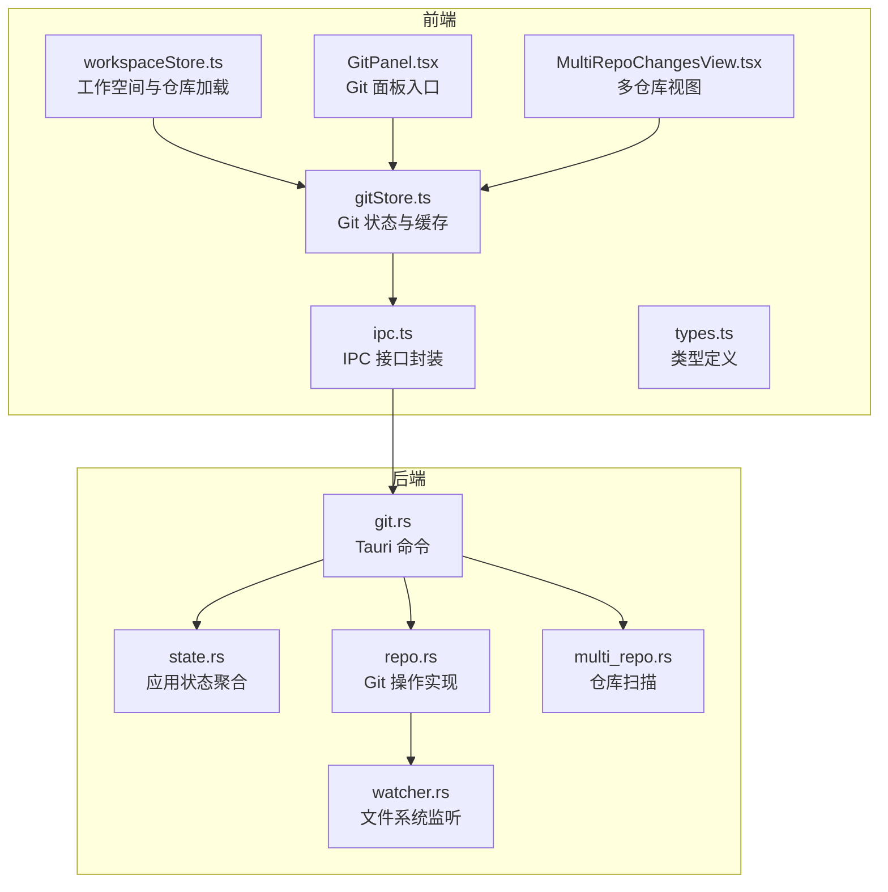
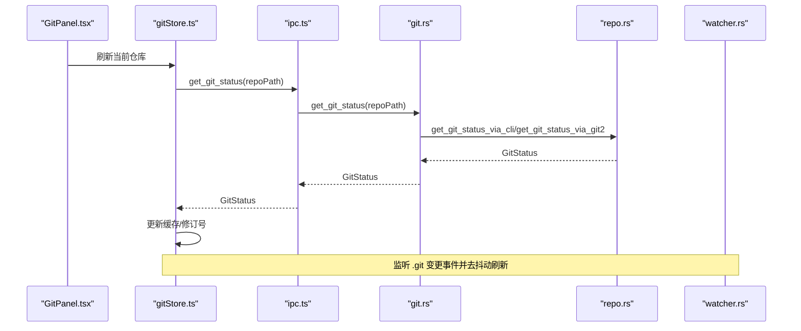
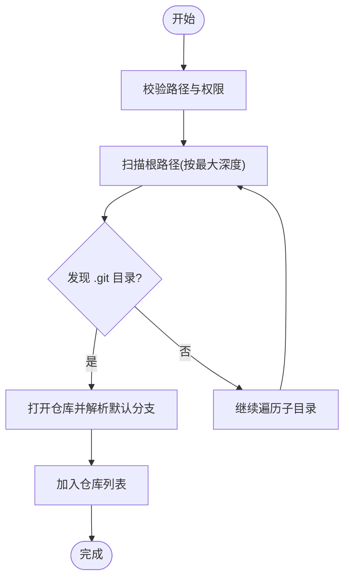
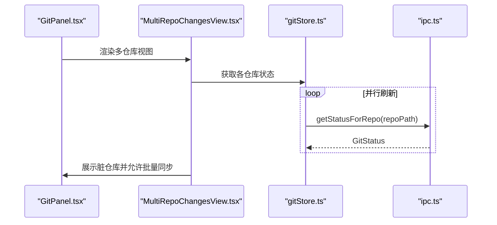
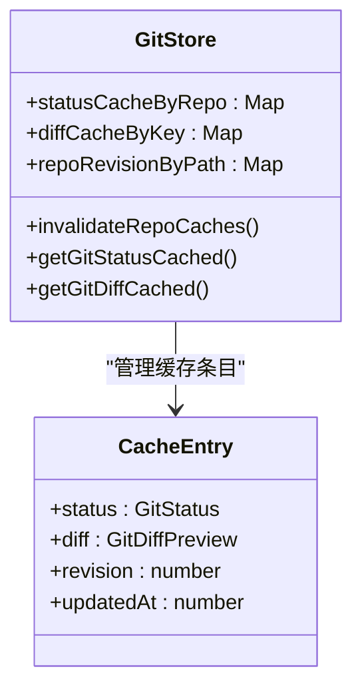
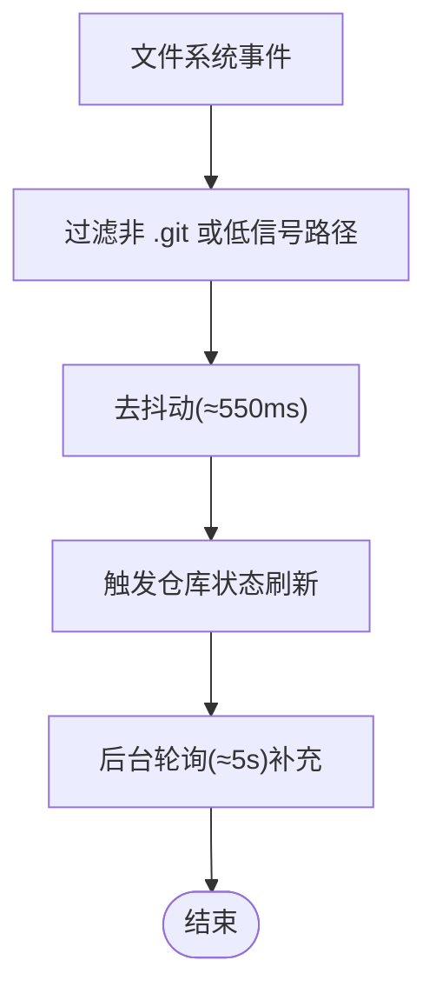
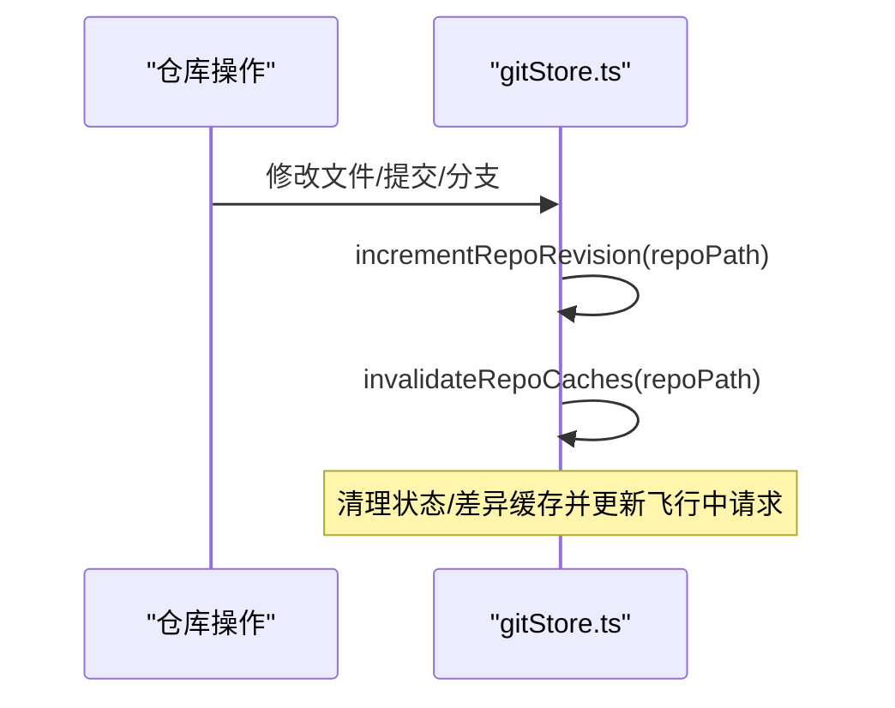
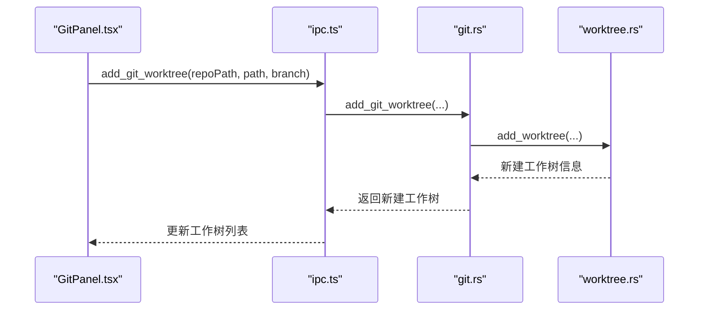
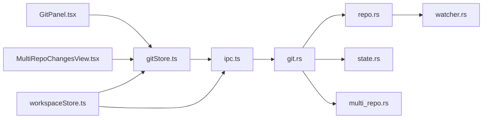

# 仓库管理

<cite>
**本文档引用的文件**
- [gitStore.ts](file://src/stores/gitStore.ts)
- [MultiRepoChangesView.tsx](file://src/components/git/MultiRepoChangesView.tsx)
- [GitPanel.tsx](file://src/components/git/GitPanel.tsx)
- [git.rs](file://src-tauri/src/commands/git.rs)
- [repo.rs](file://src-tauri/src/git/repo.rs)
- [watcher.rs](file://src-tauri/src/git/watcher.rs)
- [multi_repo.rs](file://src-tauri/src/git/multi_repo.rs)
- [workspaceStore.ts](file://src/stores/workspaceStore.ts)
- [ipc.ts](file://src/lib/ipc.ts)
- [types.ts](file://src/types.ts)
- [state.rs](file://src-tauri/src/state.rs)
</cite>

## 目录
1. [简介](#简介)
2. [项目结构](#项目结构)
3. [核心组件](#核心组件)
4. [架构总览](#架构总览)
5. [详细组件分析](#详细组件分析)
6. [依赖关系分析](#依赖关系分析)
7. [性能考量](#性能考量)
8. [故障排查指南](#故障排查指南)
9. [结论](#结论)

## 简介
本文件系统性阐述本项目的 Git 仓库管理能力，覆盖仓库初始化、检测与监控、多仓库支持、路径与状态管理、缓存与变更检测、版本号递增与失效策略、配置与工作树管理以及与工作空间的关联。文档同时提供最佳实践、性能优化建议与常见问题解决方案，帮助开发者与用户高效使用与维护 Git 仓库。

## 项目结构
仓库管理相关代码主要分布在前端状态层（Zustand）、UI 组件层（React）与后端命令与服务层（Tauri/Rust）。整体采用“前端状态 + IPC 调用 + Rust 命令”的分层设计，确保高性能与可维护性。

**图表来源**
- [workspaceStore.ts:134-428](file://src/stores/workspaceStore.ts#L134-L428)
- [gitStore.ts:476-800](file://src/stores/gitStore.ts#L476-L800)
- [GitPanel.tsx:48-864](file://src/components/git/GitPanel.tsx#L48-L864)
- [MultiRepoChangesView.tsx:56-341](file://src/components/git/MultiRepoChangesView.tsx#L56-L341)
- [ipc.ts:72-792](file://src/lib/ipc.ts#L72-L792)
- [git.rs:15-559](file://src-tauri/src/commands/git.rs#L15-L559)
- [state.rs:12-24](file://src-tauri/src/state.rs#L12-L24)
- [repo.rs:129-800](file://src-tauri/src/git/repo.rs#L129-L800)
- [watcher.rs:19-519](file://src-tauri/src/git/watcher.rs#L19-L519)
- [multi_repo.rs:12-69](file://src-tauri/src/git/multi_repo.rs#L12-L69)

**章节来源**
- [workspaceStore.ts:134-428](file://src/stores/workspaceStore.ts#L134-L428)
- [gitStore.ts:476-800](file://src/stores/gitStore.ts#L476-L800)
- [GitPanel.tsx:48-864](file://src/components/git/GitPanel.tsx#L48-L864)
- [MultiRepoChangesView.tsx:56-341](file://src/components/git/MultiRepoChangesView.tsx#L56-L341)
- [ipc.ts:72-792](file://src/lib/ipc.ts#L72-L792)
- [git.rs:15-559](file://src-tauri/src/commands/git.rs#L15-L559)
- [state.rs:12-24](file://src-tauri/src/state.rs#L12-L24)
- [repo.rs:129-800](file://src-tauri/src/git/repo.rs#L129-L800)
- [watcher.rs:19-519](file://src-tauri/src/git/watcher.rs#L19-L519)
- [multi_repo.rs:12-69](file://src-tauri/src/git/multi_repo.rs#L12-L69)

## 核心组件
- 仓库扫描与默认分支识别：在指定根路径下按深度扫描，识别 .git 目录并解析默认分支。
- Git 状态与差异缓存：基于内存的 TTL 与容量限制缓存，支持状态与差异预览缓存，并通过修订号驱动失效。
- 文件系统监听与多仓库刷新：针对 .git 内部高信号变更进行去抖动监听，结合轮询保障工作树变更可见性。
- 多仓库视图与工作树管理：支持多仓库聚合展示、工作树切换与主仓库模式。
- 工作空间集成：工作空间扫描与仓库选择持久化，支持自动激活与回退逻辑。

**章节来源**
- [multi_repo.rs:12-69](file://src-tauri/src/git/multi_repo.rs#L12-L69)
- [repo.rs:129-800](file://src-tauri/src/git/repo.rs#L129-L800)
- [watcher.rs:19-519](file://src-tauri/src/git/watcher.rs#L19-L519)
- [gitStore.ts:82-230](file://src/stores/gitStore.ts#L82-L230)
- [MultiRepoChangesView.tsx:56-341](file://src/components/git/MultiRepoChangesView.tsx#L56-L341)
- [workspaceStore.ts:134-428](file://src/stores/workspaceStore.ts#L134-L428)

## 架构总览
前端通过 IPC 调用后端命令，后端命令执行 Rust 实现的 Git 操作，利用文件系统监听与缓存策略提升响应速度与稳定性。

**图表来源**
- [GitPanel.tsx:316-418](file://src/components/git/GitPanel.tsx#L316-L418)
- [gitStore.ts:259-300](file://src/stores/gitStore.ts#L259-L300)
- [ipc.ts:425-425](file://src/lib/ipc.ts#L425-L425)
- [git.rs:15-23](file://src-tauri/src/commands/git.rs#L15-L23)
- [repo.rs:129-150](file://src-tauri/src/git/repo.rs#L129-L150)
- [watcher.rs:320-361](file://src-tauri/src/git/watcher.rs#L320-L361)

## 详细组件分析

### 仓库初始化与检测
- 初始化流程：前端调用初始化命令，后端验证路径有效性并可选仅验证；成功后触发工作空间重新扫描。
- 仓库检测：扫描指定根路径，按最大深度遍历目录，遇到 .git 目录即视为仓库；默认分支优先从远程 HEAD 解析，其次本地 main/master，最后回退到当前 HEAD。
- 默认分支解析策略：优先 origin/HEAD，其次任意远程 HEAD，再本地 main/master，最后 HEAD 分支名。

**图表来源**
- [multi_repo.rs:12-69](file://src-tauri/src/git/multi_repo.rs#L12-L69)
- [multi_repo.rs:71-83](file://src-tauri/src/git/multi_repo.rs#L71-L83)

**章节来源**
- [git.rs:471-491](file://src-tauri/src/commands/git.rs#L471-L491)
- [multi_repo.rs:12-69](file://src-tauri/src/git/multi_repo.rs#L12-L69)
- [multi_repo.rs:71-83](file://src-tauri/src/git/multi_repo.rs#L71-L83)

### 多仓库支持与路径管理
- 多仓库聚合：当存在多个仓库时，变更视图切换为多仓库面板，支持批量拉取/推送与自动展开脏仓库。
- 路径管理：支持主仓库与工作树切换，有效路径与实际仓库路径映射，避免跨仓库误操作。
- 工作空间集成：工作空间内仓库选择持久化，启动时自动激活或回退到上次活动仓库。

**图表来源**
- [GitPanel.tsx:694-720](file://src/components/git/GitPanel.tsx#L694-L720)
- [MultiRepoChangesView.tsx:56-341](file://src/components/git/MultiRepoChangesView.tsx#L56-L341)
- [gitStore.ts:476-520](file://src/stores/gitStore.ts#L476-L520)
- [ipc.ts:425-425](file://src/lib/ipc.ts#L425-L425)

**章节来源**
- [GitPanel.tsx:694-720](file://src/components/git/GitPanel.tsx#L694-L720)
- [MultiRepoChangesView.tsx:56-341](file://src/components/git/MultiRepoChangesView.tsx#L56-L341)
- [workspaceStore.ts:134-428](file://src/stores/workspaceStore.ts#L134-L428)

### 仓库状态跟踪与缓存系统
- 缓存键与失效：以仓库路径为键，配合修订号（revision）与 TTL 控制缓存有效性；状态与差异分别独立缓存。
- 缓存淘汰：基于条目数量与字节大小上限的 LRU 式淘汰，优先移除最旧条目。
- 去重与并发：同一仓库的请求去重，避免重复并发请求；失败请求不写入缓存。
- 性能度量：记录刷新耗时、命中率与视图刷新情况，便于性能分析。

**图表来源**
- [gitStore.ts:82-230](file://src/stores/gitStore.ts#L82-L230)
- [gitStore.ts:183-230](file://src/stores/gitStore.ts#L183-L230)

**章节来源**
- [gitStore.ts:82-230](file://src/stores/gitStore.ts#L82-L230)
- [gitStore.ts:183-230](file://src/stores/gitStore.ts#L183-L230)

### 变更检测与监听机制
- 文件系统监听：仅对 .git 内高信号路径（HEAD、index、refs/*、FETCH_HEAD、packed-refs 等）进行监听，过滤访问类事件与无关变更。
- 去抖动与轮询：监听事件去抖动窗口（约 550ms），同时对工作树变更采用周期轮询（约 5s）以覆盖未被监听到的场景。
- 回退策略：在 Linux 下若原生监听达到系统限制，自动回退到轮询模式。

**图表来源**
- [watcher.rs:320-361](file://src-tauri/src/git/watcher.rs#L320-L361)
- [watcher.rs:231-252](file://src-tauri/src/git/watcher.rs#L231-L252)
- [GitPanel.tsx:420-462](file://src/components/git/GitPanel.tsx#L420-L462)

**章节来源**
- [watcher.rs:19-519](file://src-tauri/src/git/watcher.rs#L19-L519)
- [GitPanel.tsx:420-462](file://src/components/git/GitPanel.tsx#L420-L462)

### 版本号递增与缓存失效策略
- 修订号（revision）：每个仓库维护一个递增整数，任何可能改变仓库状态的操作都会使该值自增。
- 失效范围：缓存失效包含状态缓存、差异缓存、飞行中请求集合、活跃视图刷新时间戳等，确保一致性。
- 视图刷新控制：对非 Changes 视图设置最小刷新间隔，避免频繁刷新造成抖动。

**图表来源**
- [gitStore.ts:197-230](file://src/stores/gitStore.ts#L197-L230)
- [gitStore.ts:211-230](file://src/stores/gitStore.ts#L211-L230)

**章节来源**
- [gitStore.ts:197-230](file://src/stores/gitStore.ts#L197-L230)
- [gitStore.ts:232-257](file://src/stores/gitStore.ts#L232-L257)

### 仓库配置与工作树管理
- 仓库配置：支持添加/删除/重命名远程，列出远程信息；初始化时可验证路径是否满足要求。
- 工作树：支持创建工作树、列出/移除/修剪工作树；工作树路径与主仓库路径联动，支持在面板中切换。
- 配置持久化：工作空间内的仓库选择与信任级别持久化，重启后恢复。

**图表来源**
- [GitPanel.tsx:515-522](file://src/components/git/GitPanel.tsx#L515-L522)
- [git.rs:354-400](file://src-tauri/src/commands/git.rs#L354-L400)
- [worktree.rs:9-26](file://src-tauri/src/git/worktree.rs#L9-L26)

**章节来源**
- [git.rs:494-554](file://src-tauri/src/commands/git.rs#L494-L554)
- [git.rs:354-444](file://src-tauri/src/commands/git.rs#L354-L444)
- [worktree.rs:48-144](file://src-tauri/src/git/worktree.rs#L48-L144)
- [workspaceStore.ts:319-357](file://src/stores/workspaceStore.ts#L319-L357)

### 与工作空间的关联
- 工作空间扫描：加载工作空间时，读取上次活动工作空间 ID，准备终端环境，加载仓库并恢复上次活动仓库。
- 仓库选择：支持单仓库与多仓库模式，自动激活或回退到上次活动仓库；支持全量设置仓库为 Git 活跃状态。
- 信任级别：支持为仓库设置信任级别，影响后续行为与权限控制。

**章节来源**
- [workspaceStore.ts:142-157](file://src/stores/workspaceStore.ts#L142-L157)
- [workspaceStore.ts:251-286](file://src/stores/workspaceStore.ts#L251-L286)
- [workspaceStore.ts:319-357](file://src/stores/workspaceStore.ts#L319-L357)

## 依赖关系分析
- 前端依赖：Zustand 状态管理、React 组件、IPC 封装；类型定义统一于 types.ts。
- 后端依赖：Tauri 命令注册、Tokio 并发、notify 文件系统监听、git2 与 CLI 双通道实现。
- 共享状态：AppState 聚合数据库、配置、终端、通知、保持清醒与文件树缓存等。

**图表来源**
- [gitStore.ts:476-800](file://src/stores/gitStore.ts#L476-L800)
- [GitPanel.tsx:48-864](file://src/components/git/GitPanel.tsx#L48-L864)
- [MultiRepoChangesView.tsx:56-341](file://src/components/git/MultiRepoChangesView.tsx#L56-L341)
- [ipc.ts:72-792](file://src/lib/ipc.ts#L72-L792)
- [git.rs:15-559](file://src-tauri/src/commands/git.rs#L15-L559)
- [state.rs:12-24](file://src-tauri/src/state.rs#L12-L24)
- [repo.rs:129-800](file://src-tauri/src/git/repo.rs#L129-L800)
- [watcher.rs:19-519](file://src-tauri/src/git/watcher.rs#L19-L519)
- [multi_repo.rs:12-69](file://src-tauri/src/git/multi_repo.rs#L12-L69)
- [workspaceStore.ts:134-428](file://src/stores/workspaceStore.ts#L134-L428)

**章节来源**
- [types.ts:72-80](file://src/types.ts#L72-L80)
- [state.rs:12-24](file://src-tauri/src/state.rs#L12-L24)

## 性能考量
- 缓存策略：合理设置 TTL 与容量上限，避免内存膨胀；对状态与差异分别缓存，减少重复 IO。
- 去抖动与轮询：监听去抖动降低刷新频率，轮询作为补充保障工作树变更及时可见。
- 并发控制：请求去重与飞行中集合避免重复计算；批量操作（如多仓库拉取/推送）使用 Promise.allSettled 提升吞吐。
- I/O 优化：CLI 与 git2 双通道回退，保证在不同平台与环境下稳定运行。

[本节为通用指导，无需特定文件引用]

## 故障排查指南
- 无法监听到变更：检查监听器是否已附加、事件路径是否在 .git 高信号路径白名单内；Linux 下若出现“文件句柄不足”，监听器会自动回退到轮询。
- 刷新不生效：确认修订号是否递增、缓存是否被清理；检查活跃视图刷新间隔与强制刷新参数。
- 多仓库冲突：确认仓库路径映射与主仓库/工作树切换逻辑；必要时手动刷新或禁用轮询进行对比。
- 初始化失败：检查路径是否存在且为目录，远程配置是否正确；查看后端错误信息并根据提示修复。

**章节来源**
- [watcher.rs:231-252](file://src-tauri/src/git/watcher.rs#L231-L252)
- [gitStore.ts:211-230](file://src/stores/gitStore.ts#L211-L230)
- [git.rs:471-491](file://src-tauri/src/commands/git.rs#L471-L491)

## 结论
本仓库管理系统通过“前端状态 + IPC + Rust 命令”的架构实现了高性能、可扩展的 Git 仓库管理能力。其核心优势在于完善的缓存与失效策略、智能的文件系统监听与轮询、灵活的多仓库与工作树支持，以及与工作空间的紧密集成。遵循本文档的最佳实践与性能建议，可在复杂工程中稳定运行并获得良好体验。