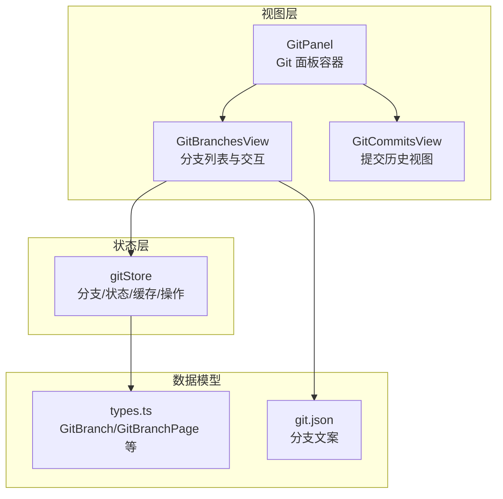
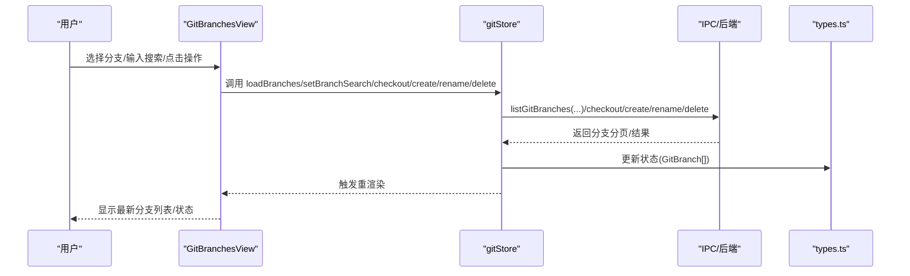
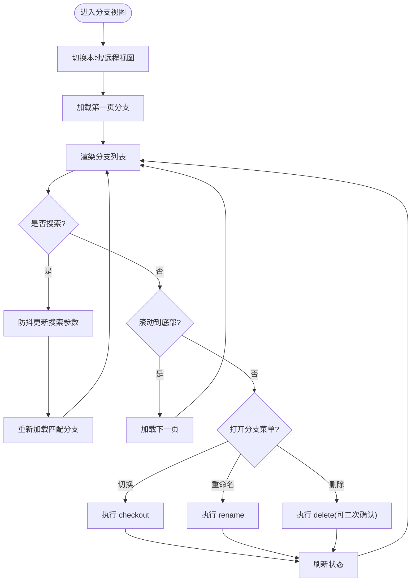
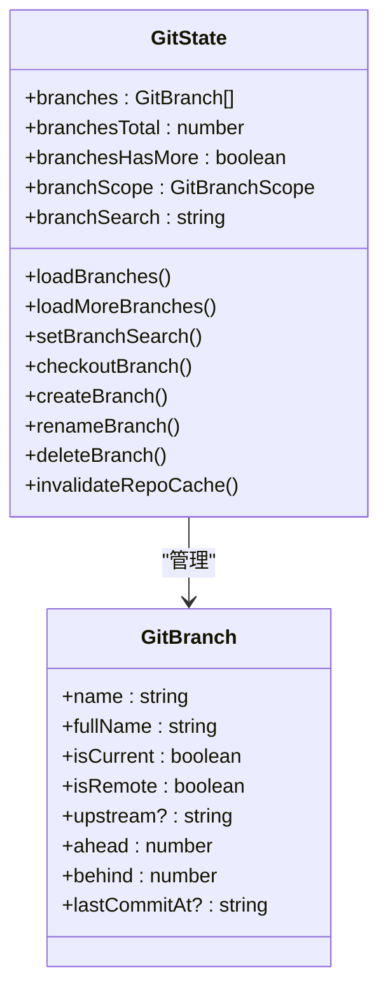
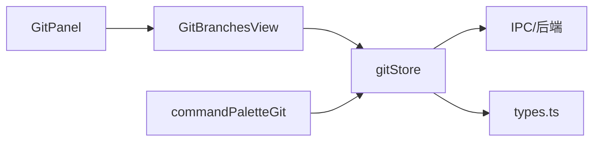

# 分支管理

<cite>
**本文档引用的文件**
- [GitBranchesView.tsx](file://src/components/git/GitBranchesView.tsx)
- [gitStore.ts](file://src/stores/gitStore.ts)
- [types.ts](file://src/types.ts)
- [git.json](file://src/i18n/resources/zh-CN/git.json)
- [GitPanel.tsx](file://src/components/git/GitPanel.tsx)
- [GitCommitsView.tsx](file://src/components/git/GitCommitsView.tsx)
- [commandPaletteGit.ts](file://src/lib/commandPaletteGit.ts)
</cite>

## 目录
1. [简介](#简介)
2. [项目结构](#项目结构)
3. [核心组件](#核心组件)
4. [架构总览](#架构总览)
5. [详细组件分析](#详细组件分析)
6. [依赖关系分析](#依赖关系分析)
7. [性能考量](#性能考量)
8. [故障排查指南](#故障排查指南)
9. [结论](#结论)
10. [附录](#附录)

## 简介
本文件系统性梳理 Panes 应用中的 Git 分支管理能力，覆盖分支列表展示、分支切换与创建、分支搜索与筛选、分支状态与统计、分支删除与重命名等完整流程，并结合实际源码路径进行说明。同时提供分支管理最佳实践、分支策略建议与冲突解决指引，帮助用户高效、安全地使用分支管理功能。

## 项目结构
分支管理功能由前端 UI 组件、状态管理与数据模型三部分协同完成：
- 视图层：GitBranchesView 负责分支列表渲染、交互与操作入口
- 状态层：gitStore 提供分支分页加载、搜索、切换、创建、重命名、删除等动作
- 数据模型：types 定义分支、远程、提交等核心类型
- 国际化：git.json 提供分支相关文案与提示
- 集成层：GitPanel 将分支视图嵌入整体 Git 面板；GitCommitsView 展示提交历史；commandPaletteGit 提供命令面板中的仓库作用域判断

**图表来源**
- [GitBranchesView.tsx:29-635](file://src/components/git/GitBranchesView.tsx#L29-L635)
- [gitStore.ts:351-430](file://src/stores/gitStore.ts#L351-L430)
- [types.ts:767-786](file://src/types.ts#L767-L786)
- [git.json:44-73](file://src/i18n/resources/zh-CN/git.json#L44-L73)
- [GitPanel.tsx:709-720](file://src/components/git/GitPanel.tsx#L709-L720)
- [GitCommitsView.tsx:13-236](file://src/components/git/GitCommitsView.tsx#L13-L236)

**章节来源**
- [GitBranchesView.tsx:29-635](file://src/components/git/GitBranchesView.tsx#L29-L635)
- [gitStore.ts:351-430](file://src/stores/gitStore.ts#L351-L430)
- [types.ts:767-786](file://src/types.ts#L767-L786)
- [git.json:44-73](file://src/i18n/resources/zh-CN/git.json#L44-L73)
- [GitPanel.tsx:709-720](file://src/components/git/GitPanel.tsx#L709-L720)
- [GitCommitsView.tsx:13-236](file://src/components/git/GitCommitsView.tsx#L13-L236)

## 核心组件
- 分支视图组件：负责分支列表渲染、搜索过滤、分页加载、上下文菜单与批量操作
- 分支状态管理：封装分支分页查询、搜索、切换、创建、重命名、删除等动作
- 类型定义：GitBranch、GitBranchPage 等，承载分支元数据与分页信息
- 国际化资源：提供分支相关文案与提示语
- 面板集成：GitPanel 将分支视图嵌入 Git 面板，支持多仓库与工作树场景

**章节来源**
- [GitBranchesView.tsx:29-635](file://src/components/git/GitBranchesView.tsx#L29-L635)
- [gitStore.ts:397-868](file://src/stores/gitStore.ts#L397-L868)
- [types.ts:767-786](file://src/types.ts#L767-L786)
- [git.json:44-73](file://src/i18n/resources/zh-CN/git.json#L44-L73)
- [GitPanel.tsx:709-720](file://src/components/git/GitPanel.tsx#L709-L720)

## 架构总览
分支管理采用“视图-状态-IPC-模型”的分层设计：
- 视图层通过 useGitStore 获取分支数据与操作方法
- 状态层封装 IPC 调用，处理分页、搜索、缓存与错误
- 模型层提供 GitBranch/GitBranchPage 等类型
- 国际化资源统一管理文案

**图表来源**
- [GitBranchesView.tsx:795-868](file://src/components/git/GitBranchesView.tsx#L795-L868)
- [gitStore.ts:397-868](file://src/stores/gitStore.ts#L397-L868)
- [types.ts:767-786](file://src/types.ts#L767-L786)

## 详细组件分析

### 分支列表与交互（GitBranchesView）
- 列表渲染：按 GitBranch 渲染每条分支，支持当前分支高亮、上游远程标识、ahead/behind 同步状态、最后提交时间
- 作用域切换：支持本地/远程分支视图切换
- 搜索与筛选：本地搜索框，带防抖与计数提示
- 分页加载：滚动到底部触发加载更多
- 上下文菜单：根据分支状态动态显示切换、重命名、删除选项
- 新建分支：内联输入框，支持分支历史快捷选择与回车创建

**图表来源**
- [GitBranchesView.tsx:353-635](file://src/components/git/GitBranchesView.tsx#L353-L635)

**章节来源**
- [GitBranchesView.tsx:29-635](file://src/components/git/GitBranchesView.tsx#L29-L635)

### 分支状态管理（gitStore）
- 分页与搜索：loadBranches/loadMoreBranches 支持按 scope/search 分页加载
- 操作封装：checkoutBranch/createBranch/renameBranch/deleteBranch 统一封装 IPC 调用与错误处理
- 缓存与刷新：invalidateRepoCache 与 runRefresh 在变更后自动刷新状态
- 草稿与历史：分支名草稿与历史记录持久化至 localStorage

**图表来源**
- [gitStore.ts:351-430](file://src/stores/gitStore.ts#L351-L430)
- [types.ts:767-778](file://src/types.ts#L767-L778)

**章节来源**
- [gitStore.ts:397-868](file://src/stores/gitStore.ts#L397-L868)
- [types.ts:767-778](file://src/types.ts#L767-L778)

### 类型与国际化
- GitBranch/GitBranchPage：描述分支基本信息、同步状态与分页结构
- 国际化资源：提供分支标签、按钮文案、提示语与 Toast 文案

**章节来源**
- [types.ts:767-786](file://src/types.ts#L767-L786)
- [git.json:44-73](file://src/i18n/resources/zh-CN/git.json#L44-L73)

### 面板集成与联动
- GitPanel 将分支视图嵌入 Git 面板，支持多仓库与工作树场景
- 与其他视图（提交、变更、贮藏、工作树）联动，统一错误处理与刷新机制

**章节来源**
- [GitPanel.tsx:709-720](file://src/components/git/GitPanel.tsx#L709-L720)

### 提交历史与分支关联
- GitCommitsView 支持按关键字过滤提交，便于定位分支相关提交
- 与分支视图配合，形成“分支-提交”闭环

**章节来源**
- [GitCommitsView.tsx:13-236](file://src/components/git/GitCommitsView.tsx#L13-L236)

## 依赖关系分析
- GitBranchesView 依赖 useGitStore 提供的操作与状态
- gitStore 依赖 IPC 接口与 types 类型定义
- GitPanel 驱动分支视图渲染与全局刷新
- commandPaletteGit 提供仓库作用域判断，辅助命令面板中的分支相关操作

**图表来源**
- [GitBranchesView.tsx:29-635](file://src/components/git/GitBranchesView.tsx#L29-L635)
- [gitStore.ts:351-430](file://src/stores/gitStore.ts#L351-L430)
- [GitPanel.tsx:709-720](file://src/components/git/GitPanel.tsx#L709-L720)
- [commandPaletteGit.ts:10-45](file://src/lib/commandPaletteGit.ts#L10-L45)

**章节来源**
- [GitBranchesView.tsx:29-635](file://src/components/git/GitBranchesView.tsx#L29-L635)
- [gitStore.ts:351-430](file://src/stores/gitStore.ts#L351-L430)
- [GitPanel.tsx:709-720](file://src/components/git/GitPanel.tsx#L709-L720)
- [commandPaletteGit.ts:10-45](file://src/lib/commandPaletteGit.ts#L10-L45)

## 性能考量
- 分页加载：分支列表默认分页大小为 200，避免一次性加载大量分支导致卡顿
- 搜索防抖：分支搜索输入具有 300ms 防抖，降低频繁 IPC 请求
- 缓存与刷新：状态与差异缓存控制 TTL 与容量上限，减少重复计算
- 主动刷新：变更后通过 invalidateRepoCache 与 runRefresh 自动刷新，保证 UI 一致性

**章节来源**
- [gitStore.ts:15-24](file://src/stores/gitStore.ts#L15-L24)
- [gitStore.ts:852-854](file://src/stores/gitStore.ts#L852-L854)
- [gitStore.ts:252-257](file://src/stores/gitStore.ts#L252-L257)

## 故障排查指南
- 操作失败：gitStore 在 runRepoMutationWithRefresh 中捕获错误并设置 error，UI 通过 GitPanel 的错误栏展示
- 删除分支：支持二次确认删除，若首次删除失败会尝试强制删除
- 刷新异常：调用 invalidateRepoCache 后手动触发 refresh 或等待自动刷新
- 多仓库/工作树：确保当前激活仓库与工作树上下文正确，必要时通过 GitPanel 的仓库选择器切换

**章节来源**
- [gitStore.ts:622-654](file://src/stores/gitStore.ts#L622-L654)
- [GitBranchesView.tsx:242-264](file://src/components/git/GitBranchesView.tsx#L242-L264)
- [GitPanel.tsx:766-777](file://src/components/git/GitPanel.tsx#L766-L777)

## 结论
该分支管理模块以清晰的分层架构实现了完整的分支生命周期管理：从列表展示、搜索筛选、分页加载，到切换、创建、重命名与删除，并配套状态缓存与错误处理。通过 GitPanel 的统一集成与国际化资源的完善，用户可在不同仓库与工作树场景下高效、安全地管理分支。

## 附录

### 分支操作一览
- 切换分支：checkoutBranch
- 创建分支：createBranch（可指定 fromRef）
- 重命名分支：renameBranch
- 删除分支：deleteBranch（支持强制删除）

**章节来源**
- [gitStore.ts:855-868](file://src/stores/gitStore.ts#L855-L868)

### 分支搜索与筛选
- 本地搜索：GitBranchesView 内置搜索框，支持实时过滤
- 远程/本地切换：通过 branchScope 控制视图范围
- 计数提示：显示当前匹配数量与总数

**章节来源**
- [GitBranchesView.tsx:447-476](file://src/components/git/GitBranchesView.tsx#L447-L476)
- [gitStore.ts:722-724](file://src/stores/gitStore.ts#L722-L724)

### 分支状态与统计
- 当前分支高亮：isCurrent 字段标识
- 同步状态：ahead/behind 表示与上游的差异
- 最后提交时间：lastCommitAt 用于排序与筛选
- 统计信息：分支总数、已加载数量与剩余数量

**章节来源**
- [types.ts:769-778](file://src/types.ts#L769-L778)
- [GitBranchesView.tsx:496-586](file://src/components/git/GitBranchesView.tsx#L496-L586)

### 本地分支与远程分支
- 本地分支：isRemote=false，通常可直接重命名与删除
- 远程分支：isRemote=true，切换时需传入 isRemote 标识
- 上游信息：upstream 字段指示远程跟踪关系

**章节来源**
- [types.ts:769-778](file://src/types.ts#L769-L778)
- [GitBranchesView.tsx:189-201](file://src/components/git/GitBranchesView.tsx#L189-L201)

### 分支管理最佳实践与策略建议
- 命名规范：使用清晰、可读的分支名，遵循团队约定
- 及时同步：定期 fetch/pull 保持与远程一致，关注 ahead/behind 状态
- 小步提交：频繁提交并保持提交信息简洁明确
- 合理删除：合并完成后及时删除已合并分支，保持分支整洁
- 工作树隔离：在复杂任务中使用工作树隔离不同分支工作

### 冲突解决指南
- 发生冲突时优先在编辑器中查看差异，逐文件解决
- 使用提交历史视图定位引入冲突的提交，必要时进行变基或合并
- 若冲突复杂，考虑创建临时分支备份后再尝试解决