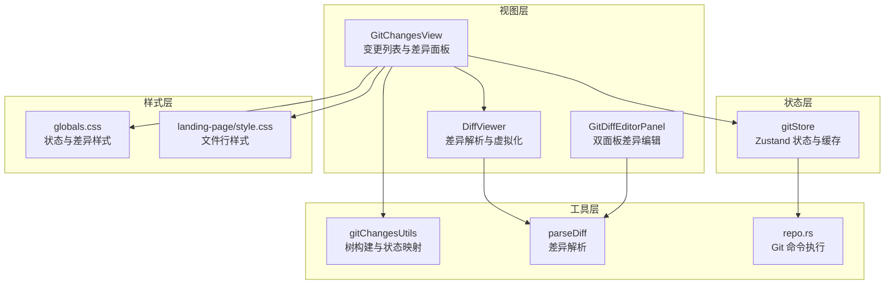
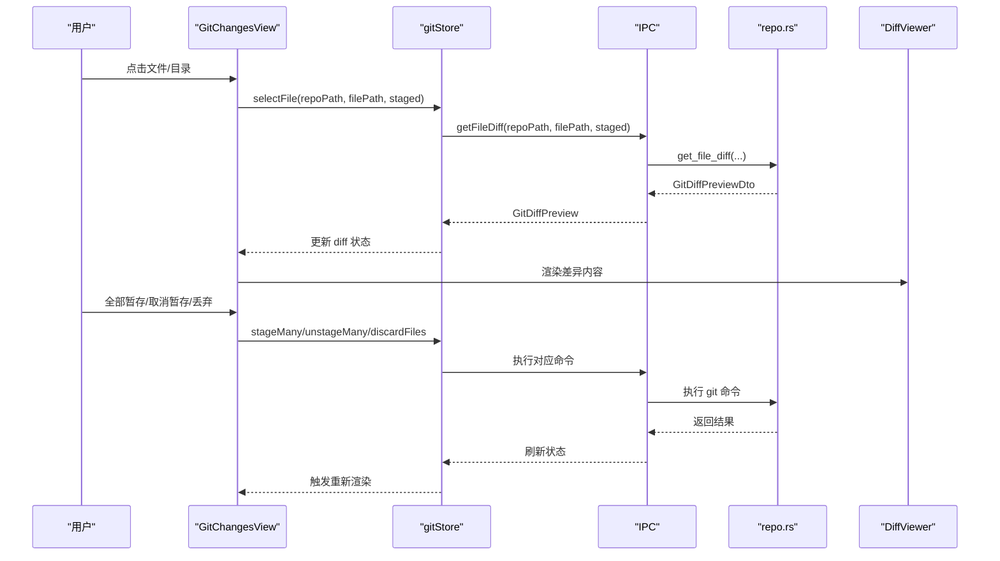
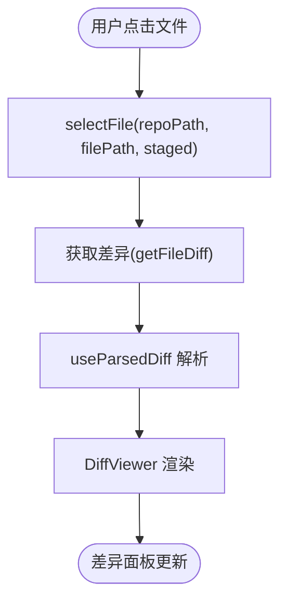
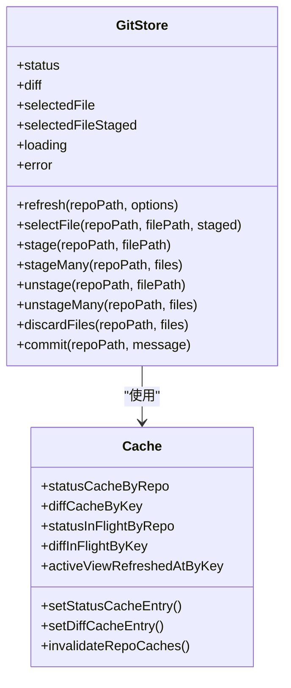
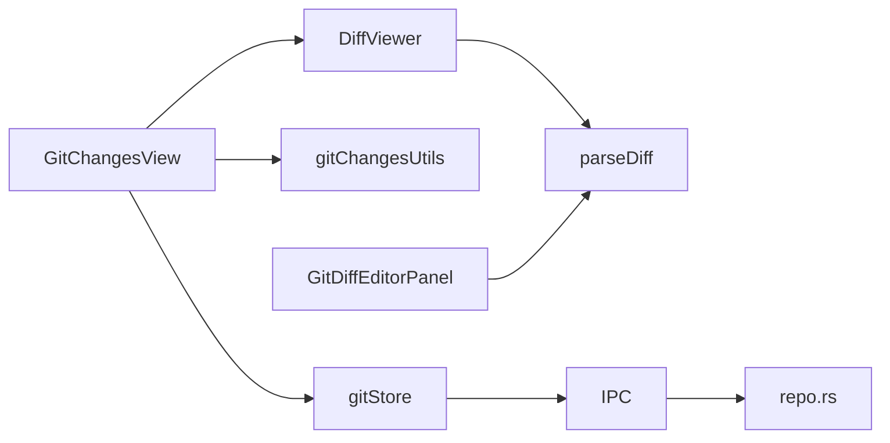

# 变更查看

<cite>
**本文档引用的文件**
- [GitChangesView.tsx](file://src/components/git/GitChangesView.tsx)
- [gitChangesUtils.ts](file://src/components/git/gitChangesUtils.ts)
- [gitStore.ts](file://src/stores/gitStore.ts)
- [DiffViewer.tsx](file://src/components/shared/DiffViewer.tsx)
- [parseDiff.ts](file://src/lib/parseDiff.ts)
- [GitDiffEditorPanel.tsx](file://src/components/editor/GitDiffEditorPanel.tsx)
- [git.json](file://src/i18n/resources/zh-CN/git.json)
- [globals.css](file://src/globals.css)
- [landing-page/style.css](file://landing-page/style.css)
- [gitFlyoutRegion.ts](file://src/lib/gitFlyoutRegion.ts)
- [repo.rs](file://src-tauri/src/git/repo.rs)
</cite>

## 目录
1. [简介](#简介)
2. [项目结构](#项目结构)
3. [核心组件](#核心组件)
4. [架构总览](#架构总览)
5. [详细组件分析](#详细组件分析)
6. [依赖关系分析](#依赖关系分析)
7. [性能考量](#性能考量)
8. [故障排除指南](#故障排除指南)
9. [结论](#结论)
10. [附录](#附录)

## 简介
本文件系统性阐述 Panes 应用中的 Git 变更查看功能，涵盖文件状态显示、变更列表管理、差异预览与对比、已暂存/未暂存文件区分、文件状态图标与颜色编码、文件选择与批量操作、差异比较机制、文件过滤与搜索、性能优化策略，以及使用指南、快捷键与用户体验优化建议。目标是帮助开发者与用户全面理解变更查看的实现原理与最佳实践。

## 项目结构
变更查看功能由前端 React 组件、状态管理、差异解析与渲染、以及后端 Git 命令调用共同构成：
- 视图层：GitChangesView 负责展示变更列表与差异面板；DiffViewer 提供差异解析与虚拟化渲染；GitDiffEditorPanel 提供双面板差异编辑体验。
- 状态层：gitStore 使用 Zustand 管理 Git 状态、缓存与操作序列，支持仓库级缓存与并发控制。
- 工具层：gitChangesUtils 提供树形结构构建与状态标签映射；parseDiff 提供差异解析；repo.rs 提供底层 Git 命令执行。
- 样式层：globals.css 定义状态颜色与差异高亮样式；landing-page/style.css 提供部分 Git 文件行样式。

图表来源
- [GitChangesView.tsx:104-752](file://src/components/git/GitChangesView.tsx#L104-L752)
- [gitStore.ts:476-800](file://src/stores/gitStore.ts#L476-L800)
- [gitChangesUtils.ts:1-144](file://src/components/git/gitChangesUtils.ts#L1-L144)
- [DiffViewer.tsx:1-418](file://src/components/shared/DiffViewer.tsx#L1-L418)
- [parseDiff.ts:1-175](file://src/lib/parseDiff.ts#L1-L175)
- [repo.rs:280-344](file://src-tauri/src/git/repo.rs#L280-L344)
- [globals.css:1260-1464](file://src/globals.css#L1260-L1464)
- [landing-page/style.css:1041-1111](file://landing-page/style.css#L1041-L1111)

章节来源
- [GitChangesView.tsx:104-752](file://src/components/git/GitChangesView.tsx#L104-L752)
- [gitStore.ts:476-800](file://src/stores/gitStore.ts#L476-L800)

## 核心组件
- GitChangesView：变更列表主视图，负责渲染未暂存/已暂存文件树、目录折叠/展开、文件选择、批量操作（全部暂存/取消暂存）、丢弃更改、提交输入与提交。
- gitChangesUtils：构建文件树、目录文件映射、状态标签与类名映射。
- gitStore：Zustand 状态管理，封装 IPC 调用，提供状态缓存、并发请求去重、仓库修订号、差异缓存与性能指标记录。
- DiffViewer：差异解析与虚拟化渲染，支持 Web Worker 解析、阈值触发、滚动虚拟化、行高计算。
- parseDiff：纯 JS 差异解析，生成带类型与行列信息的结构化数据。
- GitDiffEditorPanel：双面板差异编辑器，支持同步滚动、活动块高亮、上下一块导航、只读/可编辑切换。
- 样式系统：通过 CSS 类名映射状态类型到颜色与背景，统一视觉反馈。

章节来源
- [GitChangesView.tsx:104-752](file://src/components/git/GitChangesView.tsx#L104-L752)
- [gitChangesUtils.ts:1-144](file://src/components/git/gitChangesUtils.ts#L1-L144)
- [gitStore.ts:476-800](file://src/stores/gitStore.ts#L476-L800)
- [DiffViewer.tsx:1-418](file://src/components/shared/DiffViewer.tsx#L1-L418)
- [parseDiff.ts:1-175](file://src/lib/parseDiff.ts#L1-L175)
- [GitDiffEditorPanel.tsx:125-526](file://src/components/editor/GitDiffEditorPanel.tsx#L125-L526)

## 架构总览
变更查看采用“视图-状态-工具-后端”的分层架构：
- 视图层：GitChangesView 渲染文件树与差异面板，处理用户交互（点击、批量操作、提交）。
- 状态层：gitStore 统一管理 Git 状态、差异、错误、加载状态，并通过 IPC 调用后端命令。
- 工具层：gitChangesUtils 构建树结构；parseDiff 将 raw diff 转换为结构化数据；DiffViewer 虚拟化渲染。
- 后端层：repo.rs 执行 git status/diff 等命令，返回 DTO 并供 IPC 层消费。

图表来源
- [GitChangesView.tsx:273-345](file://src/components/git/GitChangesView.tsx#L273-L345)
- [gitStore.ts:725-773](file://src/stores/gitStore.ts#L725-L773)
- [repo.rs:333-344](file://src-tauri/src/git/repo.rs#L333-L344)

## 详细组件分析

### GitChangesView：变更列表与差异面板
- 文件状态显示与区分
  - 未暂存文件：来自 status.files 中 worktreeStatus 存在的条目；已暂存文件：来自 indexStatus 存在的条目。
  - 通过 buildTreeRows 将文件按路径构建为树形结构，支持目录折叠/展开与排序。
- 文件状态图标与颜色编码
  - 通过 getStatusClass 映射状态字符串到 CSS 类，如 added→git-status-added、modified→git-status-modified、deleted→git-status-deleted、renamed→git-status-renamed、conflicted→git-status-conflicted、untracked→git-status-untracked。
  - 对应样式在 globals.css 中定义，分别设置前景色与半透明背景，确保视觉一致性。
- 文件选择与差异预览
  - 点击文件时调用 selectFile，触发差异解析与渲染；支持在编辑器中打开文件进行内容查看。
  - 当 showDiff 为真时，变更面板与差异面板垂直分栏布局；否则仅显示变更面板。
- 批量操作
  - 全部暂存/取消暂存：基于目录映射一次性操作该目录下所有文件。
  - 目录级操作：支持对目录内的所有文件进行暂存/取消暂存/丢弃。
  - 单文件操作：支持单文件暂存/取消暂存/丢弃。
- 提交流程
  - 支持多行提交消息，支持 Ctrl/Cmd+Enter 快捷键提交；内置提交历史浏览（上下箭头）。
- 错误处理与加载状态
  - 通过 loadingKey 控制并发操作，避免重复请求；错误通过 onError 回调传递给父组件。

图表来源
- [GitChangesView.tsx:441-448](file://src/components/git/GitChangesView.tsx#L441-L448)
- [gitStore.ts:725-752](file://src/stores/gitStore.ts#L725-L752)
- [DiffViewer.tsx:161-234](file://src/components/shared/DiffViewer.tsx#L161-L234)

章节来源
- [GitChangesView.tsx:104-752](file://src/components/git/GitChangesView.tsx#L104-L752)
- [gitChangesUtils.ts:60-123](file://src/components/git/gitChangesUtils.ts#L60-L123)
- [globals.css:1280-1295](file://src/globals.css#L1280-L1295)

### gitChangesUtils：树构建与状态映射
- buildTreeRows：将文件列表转换为树形行数组，支持目录折叠状态记忆与深度层级。
- buildDirectoryFileMap：按目录聚合文件路径，用于批量操作与目录级按钮可用性判断。
- getStatusLabel/getStatusClass：将 Git 状态码映射为单字符标签与 CSS 类名，便于 UI 展示。

章节来源
- [gitChangesUtils.ts:32-144](file://src/components/git/gitChangesUtils.ts#L32-L144)

### gitStore：状态管理与缓存
- 缓存策略
  - 状态缓存：按仓库路径与修订号缓存 GitStatus，TTL 与最大条目/字节限制，避免频繁查询。
  - 差异缓存：按“仓库路径::是否暂存::文件路径”键缓存 GitDiffPreview，支持 TTL 与淘汰策略。
  - 仓库修订号：当仓库发生变更（如提交、暂存等）时递增，失效旧缓存并触发刷新。
- 并发控制
  - 通过 in-flight 请求 Map 避免重复请求；通过序列号确保请求与响应匹配。
- 性能指标
  - 记录 git.refresh.ms 与 git.file_diff.ms，统计耗时、是否命中缓存、是否截断等指标。
- IPC 封装
  - 提供 stage/unstage/discard/commit 等方法，统一错误处理与刷新逻辑。

图表来源
- [gitStore.ts:94-230](file://src/stores/gitStore.ts#L94-L230)
- [gitStore.ts:476-800](file://src/stores/gitStore.ts#L476-L800)

章节来源
- [gitStore.ts:94-230](file://src/stores/gitStore.ts#L94-L230)
- [gitStore.ts:476-800](file://src/stores/gitStore.ts#L476-L800)

### DiffViewer：差异解析与虚拟化渲染
- 解析策略
  - 小文本直接同步解析；大文本通过 Web Worker 异步解析，解析完成后自动终止 Worker 以节省资源。
  - 解析结果包含行类型（add/del/context/hunk/meta）、行列信息与文件名提取。
- 虚拟化渲染
  - 行数超过阈值启用虚拟化，计算可见窗口与偏移，仅渲染可视区域，显著提升大差异文件的滚动性能。
- 截断提示
  - 当差异过大时显示截断提示，告知返回字节数与原始字节数，引导用户在编辑器中打开完整内容。

章节来源
- [DiffViewer.tsx:1-418](file://src/components/shared/DiffViewer.tsx#L1-418)
- [parseDiff.ts:1-175](file://src/lib/parseDiff.ts#L1-L175)

### GitDiffEditorPanel：双面板差异编辑
- 双面板设计
  - 左侧为 base 内容（历史版本），右侧为 modified 内容（当前工作区/暂存区）。
  - 支持只读/可编辑切换，根据文件类型与变更类型决定是否允许编辑。
- 同步滚动与活动块高亮
  - 通过监听滚动事件实现左右面板同步滚动；根据当前活动块索引高亮对应行范围。
- 块导航
  - 支持 F7 与 Shift+F7 导航到上一块/下一块，提供块计数与导航按钮。
- 二进制文件处理
  - 对于二进制文件显示不可用提示，避免无效渲染。

章节来源
- [GitDiffEditorPanel.tsx:125-526](file://src/components/editor/GitDiffEditorPanel.tsx#L125-L526)

### 文件状态图标与颜色编码
- 状态映射
  - added/untracked → 绿色前景（success）
  - modified → 黄色前景（warning）
  - deleted → 红色前景（danger）
  - renamed → 蓝色前景（info）
  - conflicted → 红色前景（danger），加粗强调
  - 其他未识别状态 → 灰色前景（text-3）
- 样式实现
  - 通过 CSS 类名绑定到 .git-status-*，配合半透明背景增强可读性。

章节来源
- [gitChangesUtils.ts:125-143](file://src/components/git/gitChangesUtils.ts#L125-L143)
- [globals.css:1280-1295](file://src/globals.css#L1280-L1295)
- [landing-page/style.css:1062-1070](file://landing-page/style.css#L1062-L1070)

### 文件选择、批量操作与差异比较机制
- 文件选择
  - 点击文件行触发 selectFile，更新 selectedFile 与 selectedFileStaged，并加载对应差异。
- 批量操作
  - 目录级：根据 buildDirectoryFileMap 获取目录下所有文件，一次性执行暂存/取消暂存/丢弃。
  - 全部：对当前视图下的所有文件执行批量操作。
- 差异比较
  - 未暂存文件：diff 由工作树与 HEAD 比较得到；已暂存文件：diff 由暂存区与 HEAD 比较得到。
  - 通过 IPC 调用 repo.rs 的 get_file_diff 实现。

章节来源
- [GitChangesView.tsx:251-345](file://src/components/git/GitChangesView.tsx#L251-L345)
- [gitStore.ts:725-773](file://src/stores/gitStore.ts#L725-L773)
- [repo.rs:333-344](file://src-tauri/src/git/repo.rs#L333-L344)

### 文件过滤与搜索
- GitChangesView 内部未实现文件过滤与搜索功能；可通过外部文件树视图（如 GitFilesView）进行过滤，但变更面板本身不直接支持。
- 如需在变更面板内实现过滤，可在 GitChangesView 中引入过滤逻辑并结合 buildDirectoryFileMap 进行目录级过滤。

章节来源
- [GitChangesView.tsx:160-183](file://src/components/git/GitChangesView.tsx#L160-L183)

## 依赖关系分析
- 组件耦合
  - GitChangesView 依赖 gitStore、gitChangesUtils、DiffViewer；DiffViewer 依赖 parseDiff；GitDiffEditorPanel 依赖 parseDiff 与 CodeMirror。
- 外部依赖
  - IPC 层调用 repo.rs 执行 Git 命令；Web Worker 用于大差异解析；React-resizable-panels 用于面板分割。
- 循环依赖
  - 未发现循环依赖；各模块职责清晰，通过函数与接口解耦。

图表来源
- [GitChangesView.tsx:104-752](file://src/components/git/GitChangesView.tsx#L104-L752)
- [gitStore.ts:476-800](file://src/stores/gitStore.ts#L476-L800)
- [DiffViewer.tsx:1-418](file://src/components/shared/DiffViewer.tsx#L1-L418)
- [parseDiff.ts:1-175](file://src/lib/parseDiff.ts#L1-L175)
- [GitDiffEditorPanel.tsx:125-526](file://src/components/editor/GitDiffEditorPanel.tsx#L125-L526)
- [repo.rs:280-344](file://src-tauri/src/git/repo.rs#L280-L344)

## 性能考量
- 缓存与去重
  - 状态缓存与差异缓存均设置 TTL 与容量上限，避免内存膨胀；通过修订号与 in-flight 请求避免重复请求。
- 虚拟化渲染
  - DiffViewer 在行数超过阈值时启用虚拟化，减少 DOM 节点数量，显著提升大差异文件的渲染性能。
- Web Worker 解析
  - 大差异文本通过 Worker 异步解析，主线程不阻塞；空闲时自动终止 Worker，降低资源占用。
- 滚动同步
  - GitDiffEditorPanel 通过 requestAnimationFrame 与事件监听实现高效同步滚动，避免频繁重排。
- 性能指标
  - git.refresh.ms 与 git.file_diff.ms 记录耗时、是否截断、文件数量等，便于定位性能瓶颈。

章节来源
- [gitStore.ts:139-181](file://src/stores/gitStore.ts#L139-L181)
- [DiffViewer.tsx:143-214](file://src/components/shared/DiffViewer.tsx#L143-L214)
- [GitDiffEditorPanel.tsx:214-256](file://src/components/editor/GitDiffEditorPanel.tsx#L214-L256)

## 故障排除指南
- 差异解析失败
  - DiffViewer 在 Worker 出错时回退到同步解析；若仍失败，检查 parseDiff 输入格式与大小阈值。
- 加载卡顿
  - 检查差异大小是否超过阈值；考虑在编辑器中打开完整差异；关注截断提示。
- 并发冲突
  - 若出现重复请求或状态不同步，检查 loadingKey 与序列号逻辑；确认 IPC 调用是否正确刷新缓存。
- 权限问题
  - 某些文件可能因权限无法丢弃或暂存，检查文件系统权限与 Git 配置。

章节来源
- [DiffViewer.tsx:130-138](file://src/components/shared/DiffViewer.tsx#L130-L138)
- [gitStore.ts:622-654](file://src/stores/gitStore.ts#L622-L654)

## 结论
变更查看功能通过清晰的分层架构与完善的缓存/虚拟化策略，在保证性能的同时提供了直观的文件状态展示与差异预览能力。GitChangesView 作为核心视图，结合 gitStore 的状态管理与 repo.rs 的后端命令执行，实现了从文件选择到差异渲染、从批量操作到提交的完整闭环。未来可在变更面板内增加文件过滤与搜索功能，进一步提升用户体验。

## 附录

### 使用指南与快捷键
- 文件选择
  - 点击文件行选择；再次点击同一文件可取消选择。
- 目录操作
  - 点击目录展开/折叠；目录按钮支持暂存/取消暂存/丢弃整目录。
- 批量操作
  - “全部暂存/取消暂存”按钮对当前视图下所有文件生效。
- 提交
  - 在提交框中输入消息，Ctrl/Cmd+Enter 提交；支持上下箭头浏览历史。
- 差异导航
  - GitDiffEditorPanel：F7 下一块，Shift+F7 上一块；支持左右面板同步滚动与活动块高亮。

章节来源
- [GitChangesView.tsx:199-217](file://src/components/git/GitChangesView.tsx#L199-L217)
- [GitChangesView.tsx:698-725](file://src/components/git/GitChangesView.tsx#L698-L725)
- [GitDiffEditorPanel.tsx:338-353](file://src/components/editor/GitDiffEditorPanel.tsx#L338-L353)

### 用户体验优化建议
- 增强可访问性
  - 为按钮与图标添加 aria-label；确保键盘可达性与焦点管理。
- 视觉反馈
  - 为加载状态提供旋转动画与占位符；为成功/失败状态提供 Toast 提示。
- 性能优化
  - 对超大差异文件启用自动截断与“在编辑器中打开完整差异”的入口。
- 交互细节
  - 为目录按钮与文件行悬停时显示操作按钮；为提交历史提供快速选择与自动补全。

章节来源
- [GitChangesView.tsx:676-685](file://src/components/git/GitChangesView.tsx#L676-L685)
- [git.json:138-178](file://src/i18n/resources/zh-CN/git.json#L138-L178)