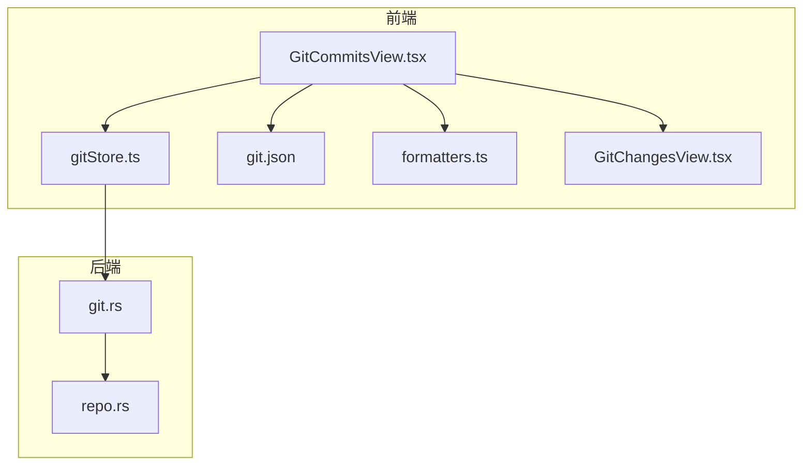
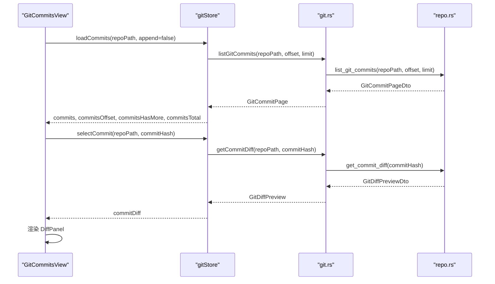
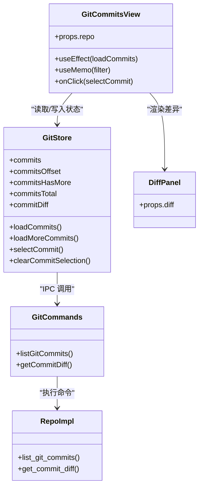

# 提交历史

<cite>
**本文档引用的文件**
- [GitCommitsView.tsx](file://src/components/git/GitCommitsView.tsx)
- [gitStore.ts](file://src/stores/gitStore.ts)
- [git.json](file://src/i18n/resources/zh-CN/git.json)
- [types.ts](file://src/types.ts)
- [git.rs](file://src-tauri/src/commands/git.rs)
- [repo.rs](file://src-tauri/src/git/repo.rs)
- [formatters.ts](file://src/lib/formatters.ts)
- [GitChangesView.tsx](file://src/components/git/GitChangesView.tsx)
</cite>

## 目录
1. [简介](#简介)
2. [项目结构](#项目结构)
3. [核心组件](#核心组件)
4. [架构总览](#架构总览)
5. [组件详解](#组件详解)
6. [依赖关系分析](#依赖关系分析)
7. [性能考量](#性能考量)
8. [故障排查指南](#故障排查指南)
9. [结论](#结论)
10. [附录](#附录)

## 简介
本文件系统性梳理 Panes 应用中的 Git 提交历史功能，覆盖提交列表显示、提交详情查看、提交比较与差异查看、提交搜索与筛选、分页加载机制，以及提交撤销（软重置）与提交差异查看等能力。文档同时解释提交信息格式、作者信息与时间戳显示方式，并提供提交历史导航、信息解读与版本控制最佳实践建议。

## 项目结构
提交历史功能由前端组件、全局状态管理、国际化资源、类型定义与后端命令/实现共同构成：
- 前端展示层：GitCommitsView 负责渲染提交列表、过滤、分页与详情展开
- 全局状态：gitStore 统一管理提交数据、分页参数、选择态与缓存
- 国际化：git.json 提供多语言文案
- 类型定义：types.ts 定义 GitCommit、GitCommitPage 等核心类型
- 后端命令：git.rs 暴露 IPC 接口；repo.rs 实现具体逻辑（提交列表、差异生成）
- 工具函数：formatters.ts 提供时间格式化

图表来源
- [GitCommitsView.tsx:1-236](file://src/components/git/GitCommitsView.tsx#L1-L236)
- [gitStore.ts:476-1021](file://src/stores/gitStore.ts#L476-L1021)
- [git.rs:158-156](file://src-tauri/src/commands/git.rs#L158-L156)
- [repo.rs:690-765](file://src-tauri/src/git/repo.rs#L690-L765)
- [formatters.ts:137-149](file://src/lib/formatters.ts#L137-L149)
- [GitChangesView.tsx:49-102](file://src/components/git/GitChangesView.tsx#L49-L102)

章节来源
- [GitCommitsView.tsx:1-236](file://src/components/git/GitCommitsView.tsx#L1-L236)
- [gitStore.ts:476-1021](file://src/stores/gitStore.ts#L476-L1021)
- [git.rs:158-156](file://src-tauri/src/commands/git.rs#L158-L156)
- [repo.rs:690-765](file://src-tauri/src/git/repo.rs#L690-L765)
- [formatters.ts:137-149](file://src/lib/formatters.ts#L137-L149)
- [GitChangesView.tsx:49-102](file://src/components/git/GitChangesView.tsx#L49-L102)

## 核心组件
- 提交列表视图：GitCommitsView 负责渲染提交项、过滤、分页按钮与详情面板
- 全局状态：gitStore 管理提交数据、分页偏移、总数、是否还有更多、当前选中提交哈希与差异
- 提交详情：DiffPanel 渲染差异内容，支持预览截断提示
- 国际化：git.json 提供“历史”、“筛选提交”、“加载更多”等文案
- 类型模型：GitCommit、GitCommitPage 描述提交字段与分页结构
- 时间格式化：formatDateTime 将 authoredAt 格式化为本地化日期时间

章节来源
- [GitCommitsView.tsx:13-236](file://src/components/git/GitCommitsView.tsx#L13-L236)
- [gitStore.ts:351-430](file://src/stores/gitStore.ts#L351-L430)
- [GitChangesView.tsx:49-102](file://src/components/git/GitChangesView.tsx#L49-L102)
- [types.ts:797-813](file://src/types.ts#L797-L813)
- [formatters.ts:137-149](file://src/lib/formatters.ts#L137-L149)

## 架构总览
提交历史功能采用“前端组件 + 全局状态 + IPC 命令 + Rust 实现”的分层设计：
- 前端组件通过 useGitStore 触发加载与分页
- gitStore 通过 IPC 命令调用后端 listGitCommits 获取分页数据
- 后端 repo.rs 解析 git log 输出，构造 GitCommitPageDto 并返回给前端
- 选择某次提交时，gitStore 调用 getCommitDiff，后端生成 diff-tree 预览并返回

图表来源
- [gitStore.ts:875-903](file://src/stores/gitStore.ts#L875-L903)
- [gitStore.ts:992-1021](file://src/stores/gitStore.ts#L992-L1021)
- [git.rs:158-156](file://src-tauri/src/commands/git.rs#L158-L156)
- [repo.rs:690-765](file://src-tauri/src/git/repo.rs#L690-L765)
- [repo.rs:828-835](file://src-tauri/src/git/repo.rs#L828-L835)

## 组件详解

### 提交列表显示与交互
- 列表渲染：遍历 commits，每条显示短哈希、主题、作者名与本地化时间戳
- 详情展开：点击提交行触发 selectCommit，若存在差异则渲染 DiffPanel，否则显示“无更改”
- 分页加载：当 commitsHasMore 且未处于筛选状态时显示“加载更多”，调用 loadMoreCommits
- 空状态：无提交时显示空状态图标与提示；筛选结果为空时显示“无匹配提交”

章节来源
- [GitCommitsView.tsx:114-232](file://src/components/git/GitCommitsView.tsx#L114-L232)
- [GitCommitsView.tsx:131-209](file://src/components/git/GitCommitsView.tsx#L131-L209)

### 提交详情查看与差异渲染
- 选择提交：selectCommit 设置 selectedCommitHash 并清空 commitDiff，随后异步请求 getCommitDiff
- 差异预览：后端使用 diff-tree 生成差异文本，限制最大行数与字节数，返回 GitDiffPreviewDto
- 前端渲染：DiffPanel 解析并虚拟化显示差异，支持“预览已截断”提示

章节来源
- [gitStore.ts:992-1021](file://src/stores/gitStore.ts#L992-L1021)
- [repo.rs:828-901](file://src-tauri/src/git/repo.rs#L828-L901)
- [GitChangesView.tsx:49-102](file://src/components/git/GitChangesView.tsx#L49-L102)

### 提交搜索与筛选
- 支持按主题、短哈希、作者名进行筛选
- 筛选输入框提供清除按钮与实时计数（当前/总数）

章节来源
- [GitCommitsView.tsx:39-48](file://src/components/git/GitCommitsView.tsx#L39-L48)
- [GitCommitsView.tsx:82-111](file://src/components/git/GitCommitsView.tsx#L82-L111)

### 分页加载机制
- 页面大小：COMMIT_PAGE_SIZE 默认 100
- 请求参数：offset 与 limit 传入后端，后端根据 total 计算 hasMore
- 加载策略：首次加载 append=false，滚动到底部且未筛选时调用 loadMoreCommits 追加

章节来源
- [gitStore.ts:15-16](file://src/stores/gitStore.ts#L15-L16)
- [gitStore.ts:875-897](file://src/stores/gitStore.ts#L875-L897)
- [repo.rs:690-765](file://src-tauri/src/git/repo.rs#L690-L765)

### 提交信息格式与时间戳显示
- 提交字段：hash、shortHash、authorName、authorEmail、subject、body、authoredAt
- 时间显示：authoredAt 使用 formatDateTime 格式化为本地化日期时间字符串

章节来源
- [types.ts:797-805](file://src/types.ts#L797-L805)
- [repo.rs:745-753](file://src-tauri/src/git/repo.rs#L745-L753)
- [formatters.ts:137-149](file://src/lib/formatters.ts#L137-L149)
- [GitCommitsView.tsx:153-157](file://src/components/git/GitCommitsView.tsx#L153-L157)

### 提交撤销（软重置）与提交差异查看
- 软重置：gitStore 暴露 softResetLastCommit，调用后端 soft_reset_last_commit
- 差异查看：getCommitDiff 返回 GitDiffPreview，前端通过 DiffPanel 展示

章节来源
- [gitStore.ts:393-393](file://src/stores/gitStore.ts#L393-L393)
- [git.rs:105-114](file://src-tauri/src/commands/git.rs#L105-L114)
- [repo.rs:828-835](file://src-tauri/src/git/repo.rs#L828-L835)

### 国际化与文案
- 历史标签、筛选占位符、空状态提示、加载更多文案均来自 git.json

章节来源
- [git.json:74-86](file://src/i18n/resources/zh-CN/git.json#L74-L86)

## 依赖关系分析

图表来源
- [GitCommitsView.tsx:13-236](file://src/components/git/GitCommitsView.tsx#L13-L236)
- [gitStore.ts:476-1021](file://src/stores/gitStore.ts#L476-L1021)
- [git.rs:158-156](file://src-tauri/src/commands/git.rs#L158-L156)
- [repo.rs:690-765](file://src-tauri/src/git/repo.rs#L690-L765)
- [GitChangesView.tsx:49-102](file://src/components/git/GitChangesView.tsx#L49-L102)

章节来源
- [GitCommitsView.tsx:13-236](file://src/components/git/GitCommitsView.tsx#L13-L236)
- [gitStore.ts:476-1021](file://src/stores/gitStore.ts#L476-L1021)
- [git.rs:158-156](file://src-tauri/src/commands/git.rs#L158-L156)
- [repo.rs:690-765](file://src-tauri/src/git/repo.rs#L690-L765)
- [GitChangesView.tsx:49-102](file://src/components/git/GitChangesView.tsx#L49-L102)

## 性能考量
- 分页与缓存
  - 前端使用 COMMIT_PAGE_SIZE=100 控制单页数量，避免一次性加载过多提交
  - gitStore 内部维护状态与序列号，确保并发请求不会互相覆盖
- 差异预览截断
  - 后端对 diff-tree 输出进行预览截断，限制最大行数与字节数，防止大差异导致界面卡顿
- 时间格式化
  - formatDateTime 使用本地化格式，减少重复计算

章节来源
- [gitStore.ts:15-16](file://src/stores/gitStore.ts#L15-L16)
- [repo.rs:837-901](file://src-tauri/src/git/repo.rs#L837-L901)
- [formatters.ts:137-149](file://src/lib/formatters.ts#L137-L149)

## 故障排查指南
- 无法加载提交
  - 检查 gitStore 是否抛错，确认 IPC 调用 listGitCommits 是否成功
  - 确认 repoPath 正确且仓库存在
- 差异为空或不显示
  - 若 commitDiff 为空，可能是该提交无更改；若 isLoadingDiff 为真，等待异步加载完成
  - 检查 getCommitDiff 是否返回错误
- 筛选无效
  - 确认筛选查询非空且与主题、短哈希、作者名匹配
- 分页不生效
  - 确认 commitsHasMore 为真且未处于筛选状态
  - 滚动至底部触发 loadMoreCommits

章节来源
- [gitStore.ts:875-897](file://src/stores/gitStore.ts#L875-L897)
- [gitStore.ts:992-1021](file://src/stores/gitStore.ts#L992-L1021)
- [GitCommitsView.tsx:114-232](file://src/components/git/GitCommitsView.tsx#L114-L232)

## 结论
Panes 的提交历史功能通过清晰的前后端分层与完善的分页/缓存机制，提供了流畅的提交浏览体验。前端组件负责交互与展示，全局状态统一管理数据与选择态，后端命令封装底层 Git 操作，形成稳定可靠的功能闭环。结合筛选、分页与差异预览，用户可以高效地理解变更历史并进行后续操作（如软重置）。

## 附录

### 提交信息字段说明
- hash：完整提交哈希
- shortHash：短哈希
- authorName：作者名
- authorEmail：作者邮箱
- subject：提交主题
- body：提交正文
- authoredAt：提交时间（ISO-8601 字符串）

章节来源
- [types.ts:797-805](file://src/types.ts#L797-L805)
- [repo.rs:745-753](file://src-tauri/src/git/repo.rs#L745-L753)

### 提交历史导航与最佳实践
- 导航建议
  - 使用筛选快速定位目标提交
  - 在长列表中优先查看最近提交，再向下翻页
  - 通过差异预览快速判断影响范围
- 最佳实践
  - 提交信息应简洁明确，主题与正文配合
  - 大改动建议拆分为多个小提交，便于回溯与审阅
  - 对重要变更保留简要说明，便于未来检索