# 暂存和工作树

<cite>
**本文档引用的文件**
- [GitStashView.tsx](file://src/components/git/GitStashView.tsx)
- [GitWorktreesView.tsx](file://src/components/git/GitWorktreesView.tsx)
- [gitStore.ts](file://src/stores/gitStore.ts)
- [worktree.rs](file://src-tauri/src/git/worktree.rs)
- [git.rs](file://src-tauri/src/commands/git.rs)
- [repo.rs](file://src-tauri/src/git/repo.rs)
- [models.rs](file://src-tauri/src/models.rs)
- [types.ts](file://src/types.ts)
- [commandPaletteGit.ts](file://src/lib/commandPaletteGit.ts)
</cite>

## 目录
1. [简介](#简介)
2. [项目结构概览](#项目结构概览)
3. [核心组件](#核心组件)
4. [架构总览](#架构总览)
5. [详细组件分析](#详细组件分析)
6. [依赖关系分析](#依赖关系分析)
7. [性能考虑](#性能考虑)
8. [故障排除指南](#故障排除指南)
9. [结论](#结论)

## 简介

本文件详细介绍了 Panes 应用中的 Git 暂存和工作树功能。该应用提供了完整的 Git 工作流程支持，包括暂存区管理、工作树配置和多工作目录支持。通过直观的用户界面和强大的后端支持，用户可以高效地管理代码变更、创建和维护多个工作树，并进行安全的暂存操作。

## 项目结构概览

应用采用前后端分离的架构设计，前端使用 React 构建用户界面，后端使用 Rust 提供 Git 操作能力。

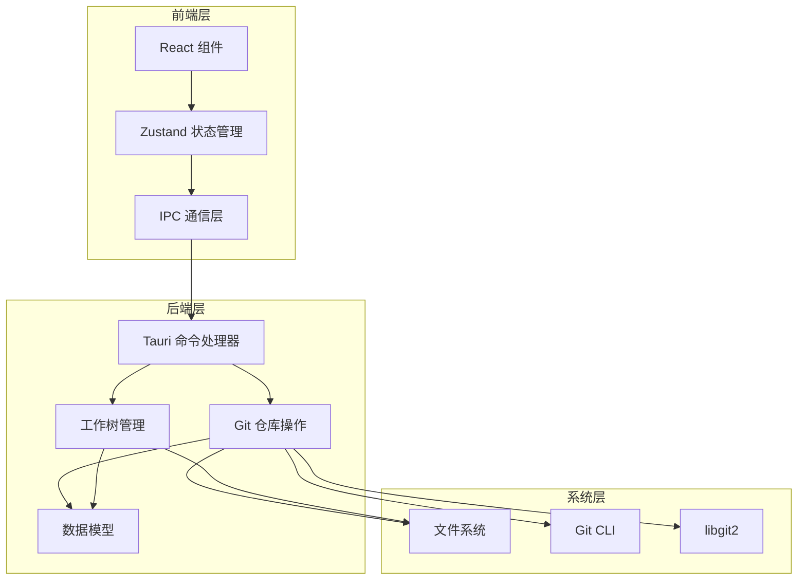

**图表来源**
- [gitStore.ts:476-654](file://src/stores/gitStore.ts#L476-L654)
- [git.rs:15-559](file://src-tauri/src/commands/git.rs#L15-L559)

**章节来源**
- [gitStore.ts:1-1132](file://src/stores/gitStore.ts#L1-L1132)
- [git.rs:1-559](file://src-tauri/src/commands/git.rs#L1-L559)

## 核心组件

### 暂存区管理组件

暂存区管理通过 `GitStashView` 组件实现，提供完整的暂存操作界面：

- **暂存创建**: 支持带消息的暂存创建
- **暂存应用**: 支持暂存应用和弹出操作
- **暂存过滤**: 支持按名称和分支提示过滤
- **状态显示**: 实时显示暂存列表和状态

### 工作树管理组件

工作树管理通过 `GitWorktreesView` 组件实现，支持多工作目录操作：

- **工作树创建**: 支持从指定分支创建新工作树
- **工作树删除**: 支持强制删除和分支删除
- **工作树修剪**: 清理不存在的工作树目录
- **工作树切换**: 在主工作树和其他工作树之间切换

**章节来源**
- [GitStashView.tsx:1-266](file://src/components/git/GitStashView.tsx#L1-L266)
- [GitWorktreesView.tsx:1-565](file://src/components/git/GitWorktreesView.tsx#L1-L565)

## 架构总览

应用采用分层架构，确保前后端分离和职责清晰：

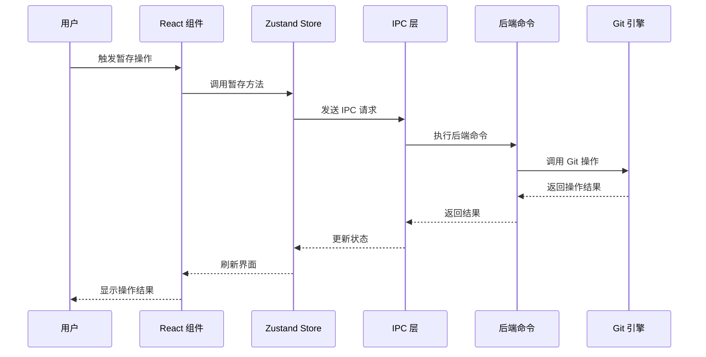

**图表来源**
- [gitStore.ts:753-779](file://src/stores/gitStore.ts#L753-L779)
- [git.rs:233-279](file://src-tauri/src/commands/git.rs#L233-L279)

## 详细组件分析

### 暂存区管理组件分析

#### 组件架构

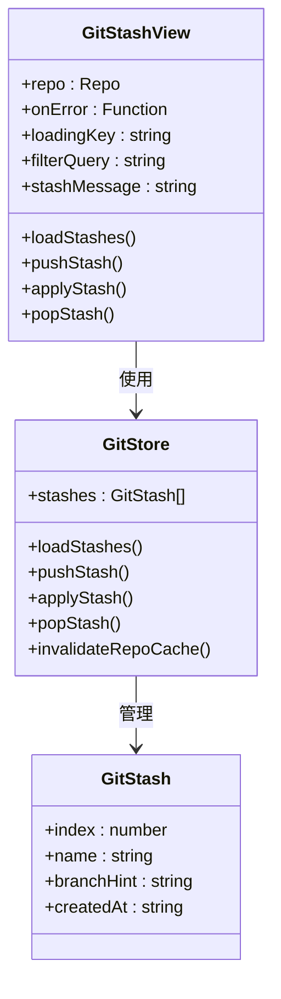

**图表来源**
- [GitStashView.tsx:14-85](file://src/components/git/GitStashView.tsx#L14-L85)
- [gitStore.ts:372-414](file://src/stores/gitStore.ts#L372-L414)

#### 暂存操作流程

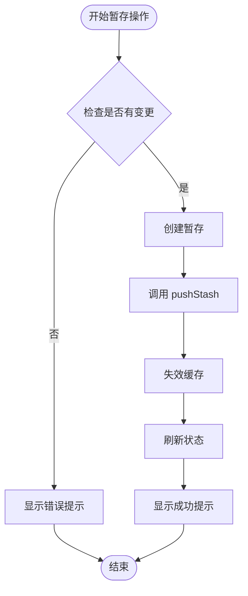

**图表来源**
- [GitStashView.tsx:43-57](file://src/components/git/GitStashView.tsx#L43-L57)
- [gitStore.ts:983-985](file://src/stores/gitStore.ts#L983-L985)

#### 暂存应用流程

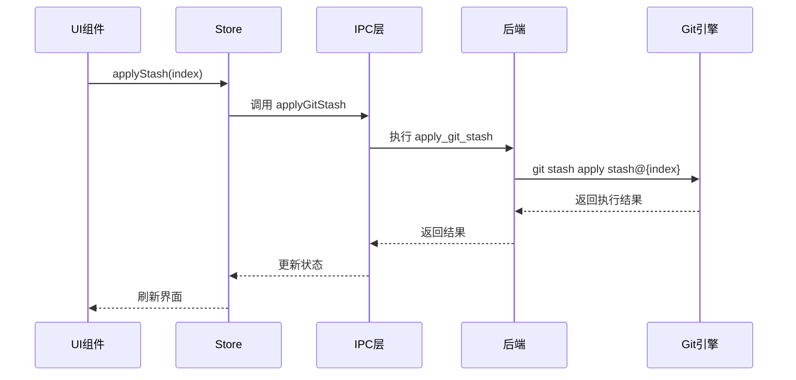

**图表来源**
- [gitStore.ts:986-991](file://src/stores/gitStore.ts#L986-L991)
- [git.rs:256-266](file://src-tauri/src/commands/git.rs#L256-L266)

**章节来源**
- [GitStashView.tsx:1-266](file://src/components/git/GitStashView.tsx#L1-L266)
- [gitStore.ts:966-991](file://src/stores/gitStore.ts#L966-L991)

### 工作树管理组件分析

#### 组件架构

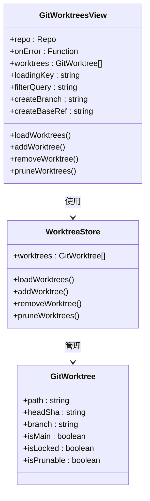

**图表来源**
- [GitWorktreesView.tsx:50-60](file://src/components/git/GitWorktreesView.tsx#L50-L60)
- [gitStore.ts:373-410](file://src/stores/gitStore.ts#L373-L410)

#### 工作树创建流程

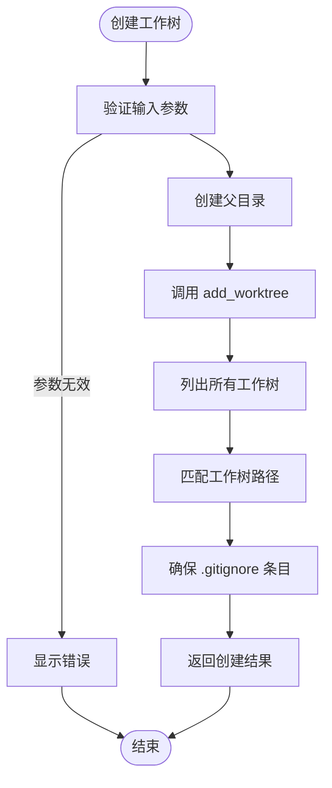

**图表来源**
- [git.rs:354-399](file://src-tauri/src/commands/git.rs#L354-L399)
- [worktree.rs:9-26](file://src-tauri/src/git/worktree.rs#L9-L26)

#### 工作树删除流程

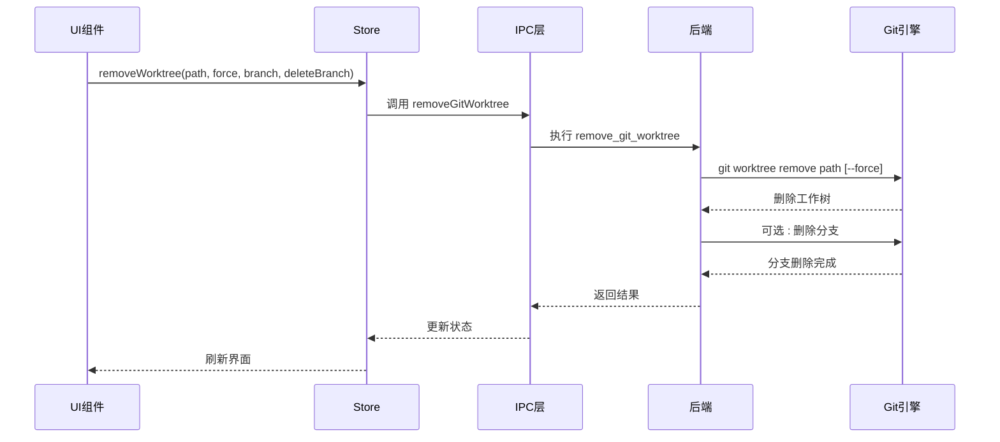

**图表来源**
- [gitStore.ts:947-961](file://src/stores/gitStore.ts#L947-L961)
- [git.rs:412-432](file://src-tauri/src/commands/git.rs#L412-L432)
- [worktree.rs:116-137](file://src-tauri/src/git/worktree.rs#L116-L137)

**章节来源**
- [GitWorktreesView.tsx:1-565](file://src/components/git/GitWorktreesView.tsx#L1-L565)
- [gitStore.ts:947-965](file://src/stores/gitStore.ts#L947-L965)

### 状态管理和缓存机制

应用实现了智能的状态管理和缓存机制，确保性能和用户体验：

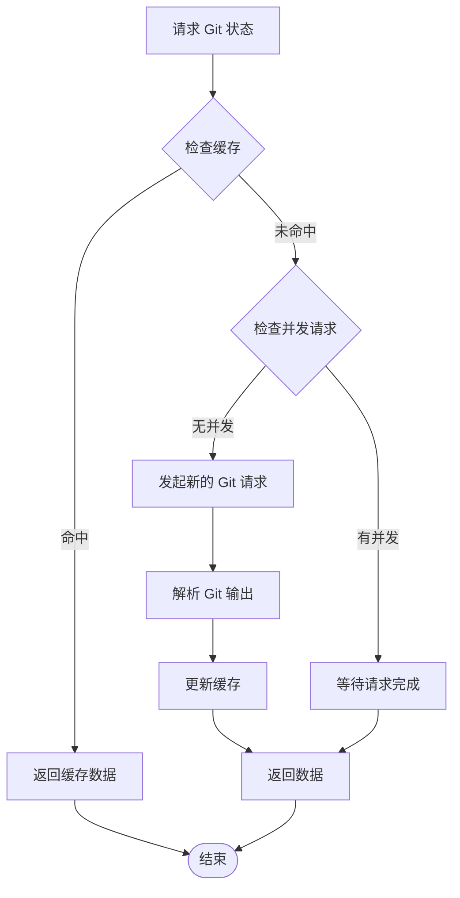

**图表来源**
- [gitStore.ts:259-300](file://src/stores/gitStore.ts#L259-L300)
- [repo.rs:129-150](file://src-tauri/src/git/repo.rs#L129-L150)

**章节来源**
- [gitStore.ts:82-257](file://src/stores/gitStore.ts#L82-L257)
- [repo.rs:129-200](file://src-tauri/src/git/repo.rs#L129-L200)

## 依赖关系分析

### 前端依赖关系

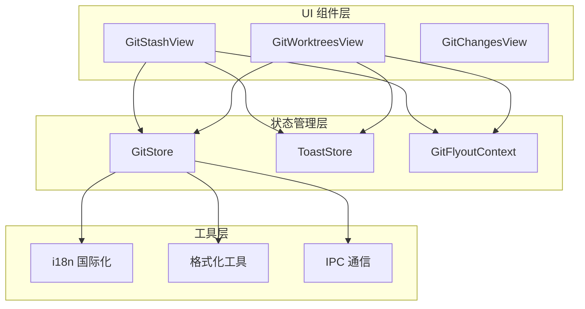

**图表来源**
- [GitStashView.tsx:1-266](file://src/components/git/GitStashView.tsx#L1-L266)
- [GitWorktreesView.tsx:1-565](file://src/components/git/GitWorktreesView.tsx#L1-L565)
- [gitStore.ts:1-1132](file://src/stores/gitStore.ts#L1-L1132)

### 后端依赖关系

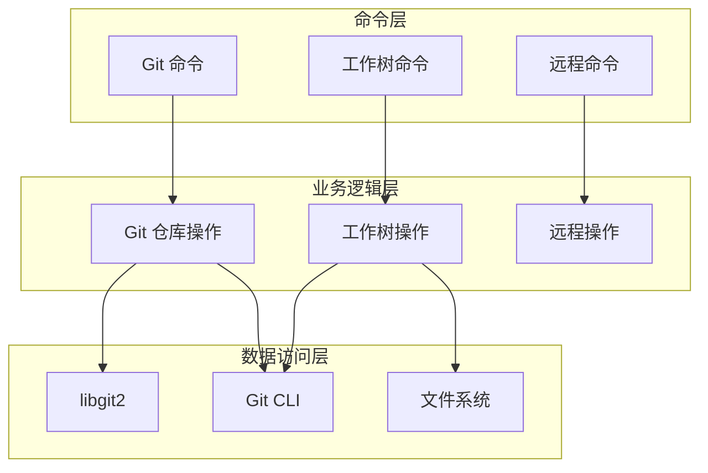

**图表来源**
- [git.rs:15-559](file://src-tauri/src/commands/git.rs#L15-L559)
- [worktree.rs:1-144](file://src-tauri/src/git/worktree.rs#L1-L144)
- [repo.rs:1-200](file://src-tauri/src/git/repo.rs#L1-L200)

**章节来源**
- [git.rs:1-559](file://src-tauri/src/commands/git.rs#L1-L559)
- [worktree.rs:1-144](file://src-tauri/src/git/worktree.rs#L1-L144)

## 性能考虑

### 缓存策略

应用实现了多层次的缓存策略来优化性能：

- **状态缓存**: 默认缓存时间为 1 秒，最多缓存 32 个仓库状态
- **差异缓存**: 默认缓存时间为 1.2 秒，最多缓存 320 个差异
- **内存限制**: 状态缓存最大 3MB，差异缓存最大 24MB
- **LRU 淘汰**: 超限时自动淘汰最旧的缓存条目

### 并发控制

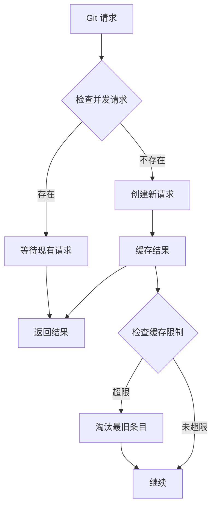

**图表来源**
- [gitStore.ts:139-181](file://src/stores/gitStore.ts#L139-L181)

### 性能监控

应用集成了性能指标记录，用于监控 Git 操作的性能表现：

- **刷新时间**: 记录 Git 刷新操作耗时
- **文件差异**: 记录文件差异计算耗时
- **缓存命中率**: 监控缓存使用效率
- **错误统计**: 统计操作失败情况

**章节来源**
- [gitStore.ts:15-25](file://src/stores/gitStore.ts#L15-L25)
- [gitStore.ts:604-620](file://src/stores/gitStore.ts#L604-L620)

## 故障排除指南

### 常见问题及解决方案

#### 暂存操作失败

**问题**: 暂存创建或应用失败
**可能原因**:
- 仓库处于分离头指针状态
- 存在未提交的变更
- 权限不足

**解决步骤**:
1. 检查仓库状态是否正常
2. 确认有足够的磁盘空间
3. 验证用户权限
4. 查看详细的错误信息

#### 工作树创建失败

**问题**: 工作树无法创建或删除
**可能原因**:
- 目标路径已存在
- 分支名不符合规范
- 文件系统权限问题

**解决步骤**:
1. 检查目标路径的可用性
2. 验证分支名的合法性
3. 确认工作树路径的唯一性
4. 检查文件系统权限

#### 缓存问题

**问题**: 界面显示过期的 Git 状态
**解决步骤**:
1. 手动刷新页面
2. 清除浏览器缓存
3. 重新加载仓库
4. 检查网络连接

**章节来源**
- [gitStore.ts:611-654](file://src/stores/gitStore.ts#L611-L654)
- [git.rs:362-370](file://src-tauri/src/commands/git.rs#L362-L370)

## 结论

Panes 应用提供了完整且高效的 Git 暂存和工作树管理功能。通过精心设计的架构和优化的性能策略，用户可以轻松地管理代码变更、创建和维护多个工作树环境。

### 主要优势

1. **直观的用户界面**: 通过 React 组件提供友好的交互体验
2. **高性能的后端支持**: Rust 实现的高效 Git 操作
3. **智能缓存机制**: 自动化的缓存管理和性能优化
4. **完整的错误处理**: 全面的错误捕获和用户反馈
5. **多工作目录支持**: 完整的多工作树生命周期管理

### 最佳实践建议

1. **定期清理**: 使用工作树修剪功能清理无用的工作树
2. **合理命名**: 为工作树和暂存创建有意义的描述性名称
3. **备份策略**: 在进行重大操作前创建临时暂存
4. **权限管理**: 确保工作树目录具有适当的访问权限
5. **监控性能**: 关注性能指标，及时发现潜在问题

通过遵循这些指导原则，用户可以充分利用 Panes 应用的强大功能，提高 Git 工作流程的效率和可靠性。