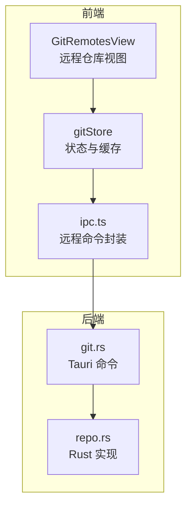
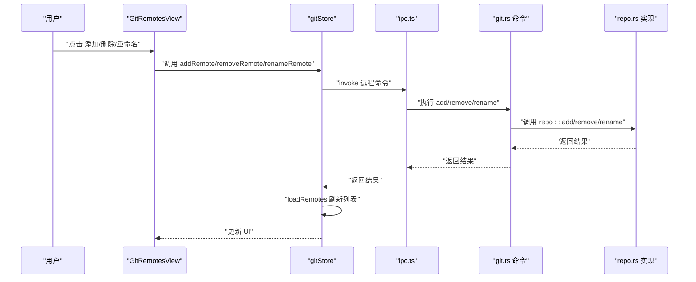
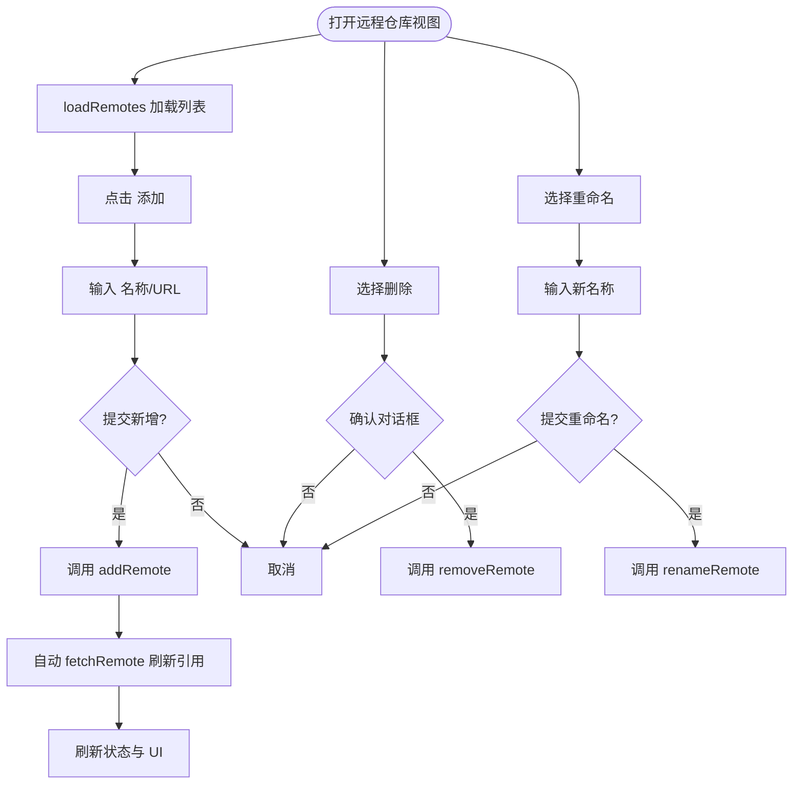
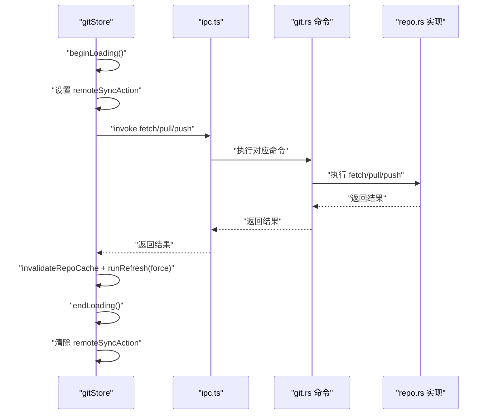
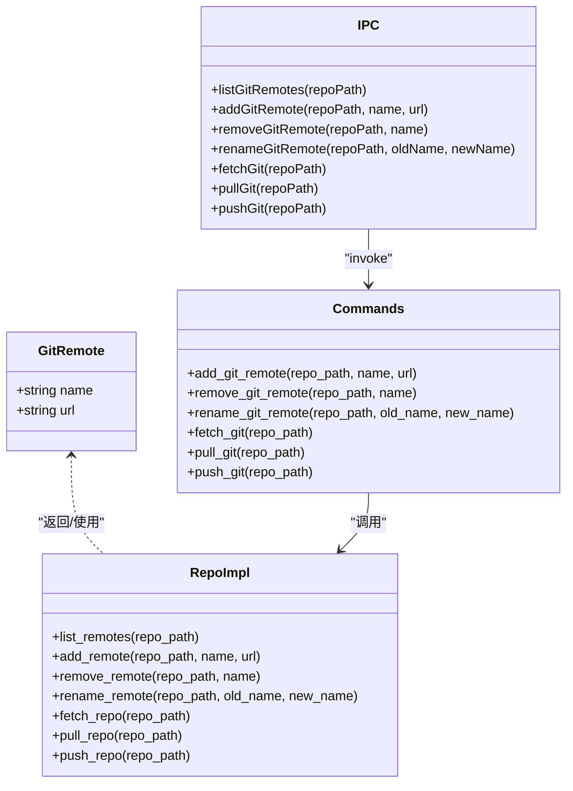
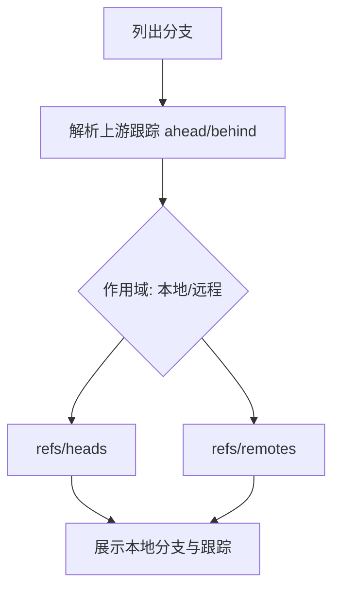
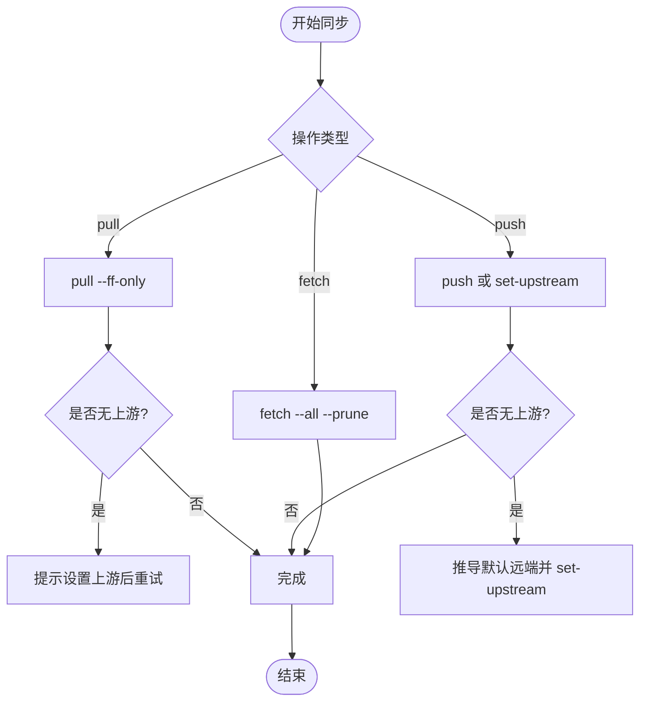

# 远程仓库

<cite>
**本文引用的文件**
- [GitRemotesView.tsx](file://src/components/git/GitRemotesView.tsx)
- [gitStore.ts](file://src/stores/gitStore.ts)
- [ipc.ts](file://src/lib/ipc.ts)
- [git.rs](file://src-tauri/src/commands/git.rs)
- [repo.rs](file://src-tauri/src/git/repo.rs)
- [types.ts](file://src/types.ts)
- [commandPaletteGit.ts](file://src/lib/commandPaletteGit.ts)
- [gitStore.test.ts](file://src/stores/gitStore.test.ts)
</cite>

## 目录
1. [简介](#简介)
2. [项目结构](#项目结构)
3. [核心组件](#核心组件)
4. [架构总览](#架构总览)
5. [详细组件分析](#详细组件分析)
6. [依赖分析](#依赖分析)
7. [性能考量](#性能考量)
8. [故障排除指南](#故障排除指南)
9. [结论](#结论)
10. [附录](#附录)

## 简介
本章节概述 Git 远程仓库功能的目标与范围，涵盖远程仓库的配置、增删改、以及与远端的同步（拉取、推送、获取）流程；同时介绍远程分支管理、跟踪关系与冲突处理策略，并提供协作最佳实践、网络优化建议与常见问题排查方法。

## 项目结构
远程仓库能力由前端 UI 组件、状态管理、IPC 调用层与后端 Tauri 命令及 Rust 实现共同构成：
- 前端 UI：GitRemotesView 提供远程仓库列表、新增、删除、重命名交互
- 状态管理：gitStore 封装远程仓库加载、增删改、同步动作的状态与缓存
- IPC 层：ipc.ts 定义远程命令调用接口
- 后端命令：git.rs 暴露 fetch/pull/push、远程增删改等命令
- Rust 实现：repo.rs 执行 fetch/pull/push、远程增删改、分支列表与跟踪信息解析

图表来源
- [GitRemotesView.tsx:15-282](file://src/components/git/GitRemotesView.tsx#L15-L282)
- [gitStore.ts:351-430](file://src/stores/gitStore.ts#L351-L430)
- [ipc.ts:460-466](file://src/lib/ipc.ts#L460-L466)
- [git.rs:117-135](file://src-tauri/src/commands/git.rs#L117-L135)
- [repo.rs:472-517](file://src-tauri/src/git/repo.rs#L472-L517)

章节来源
- [GitRemotesView.tsx:15-282](file://src/components/git/GitRemotesView.tsx#L15-L282)
- [gitStore.ts:351-430](file://src/stores/gitStore.ts#L351-L430)
- [ipc.ts:460-466](file://src/lib/ipc.ts#L460-L466)
- [git.rs:117-135](file://src-tauri/src/commands/git.rs#L117-L135)
- [repo.rs:472-517](file://src-tauri/src/git/repo.rs#L472-L517)

## 核心组件
- 远程仓库数据模型：GitRemote（名称、URL）
- 远程操作入口：addRemote/removeRemote/renameRemote/loadRemotes
- 同步操作入口：fetchRemote/pullRemote/pushRemote
- 状态与缓存：远程仓库列表、加载状态、错误状态、远程同步动作标记

章节来源
- [types.ts:829-832](file://src/types.ts#L829-L832)
- [gitStore.ts:374-420](file://src/stores/gitStore.ts#L374-L420)

## 架构总览
远程仓库功能遵循“UI → 状态管理 → IPC → Tauri 命令 → Rust 实现”的分层设计。UI 触发远程操作，状态管理负责统一加载态与刷新，IPC 将调用转发至后端，后端通过 Rust 执行具体 Git 命令。

图表来源
- [GitRemotesView.tsx:77-128](file://src/components/git/GitRemotesView.tsx#L77-L128)
- [gitStore.ts:1063-1094](file://src/stores/gitStore.ts#L1063-L1094)
- [ipc.ts:539-545](file://src/lib/ipc.ts#L539-L545)
- [git.rs:504-554](file://src-tauri/src/commands/git.rs#L504-L554)
- [repo.rs:1668-1682](file://src-tauri/src/git/repo.rs#L1668-L1682)

## 详细组件分析

### 远程仓库视图组件（GitRemotesView）
- 功能要点
  - 加载远程仓库列表：首次进入时触发 loadRemotes
  - 新增远程：校验名称与 URL，调用 addRemote 并自动触发一次 fetchRemote 以刷新引用
  - 删除远程：确认对话框后调用 removeRemote
  - 重命名远程：输入新名称并提交，调用 renameRemote
  - 错误提示与加载态：使用 toast 展示错误或成功消息
- 关键交互
  - ESC 取消重命名
  - Enter 提交新增与重命名
  - 确认删除对话框二次确认

图表来源
- [GitRemotesView.tsx:39-128](file://src/components/git/GitRemotesView.tsx#L39-L128)
- [gitStore.ts:1063-1094](file://src/stores/gitStore.ts#L1063-L1094)

章节来源
- [GitRemotesView.tsx:15-282](file://src/components/git/GitRemotesView.tsx#L15-L282)
- [gitStore.ts:1048-1094](file://src/stores/gitStore.ts#L1048-L1094)

### 状态管理与缓存（gitStore）
- 远程仓库状态字段
  - remotes、remotesRepoPath、remotesLoading、remotesError
  - remoteSyncAction、remoteSyncRepoPath 用于标记当前正在执行的远程同步动作
- 远程操作流程
  - runRepoMutationWithRefresh 包裹远程操作：设置 remoteSyncAction，执行后失效缓存并强制刷新
  - addRemote 在新增后自动 fetchRemote 并刷新状态，吞掉网络/空远端失败
- 缓存与并发
  - 使用 beginLoading/endLoading 统一管理多个并发操作的加载态
  - 测试验证：并发 fetch/pull 会保持 loading 直到所有操作完成

图表来源
- [gitStore.ts:622-654](file://src/stores/gitStore.ts#L622-L654)
- [gitStore.ts:780-794](file://src/stores/gitStore.ts#L780-L794)
- [ipc.ts:462-466](file://src/lib/ipc.ts#L462-L466)
- [git.rs:117-135](file://src-tauri/src/commands/git.rs#L117-L135)
- [repo.rs:472-517](file://src-tauri/src/git/repo.rs#L472-L517)

章节来源
- [gitStore.ts:358-420](file://src/stores/gitStore.ts#L358-L420)
- [gitStore.ts:622-654](file://src/stores/gitStore.ts#L622-L654)
- [gitStore.ts:780-794](file://src/stores/gitStore.ts#L780-L794)
- [gitStore.test.ts:138-163](file://src/stores/gitStore.test.ts#L138-L163)

### IPC 与后端命令（ipc.ts、git.rs、repo.rs）
- IPC 接口
  - listGitRemotes/addGitRemote/removeGitRemote/renameGitRemote
  - fetchGit/pullGit/pushGit
- Tauri 命令
  - 对应暴露 add/remove/rename/list/fetch/pull/push
- Rust 实现
  - add/remove/rename 远程：直接调用 git remote 子命令
  - fetch：git fetch --all --prune
  - pull：git pull --ff-only；若无上游则报错
  - push：git push；若无上游则推导默认远端并设置 --set-upstream

图表来源
- [types.ts:829-832](file://src/types.ts#L829-L832)
- [ipc.ts:539-545](file://src/lib/ipc.ts#L539-L545)
- [ipc.ts:462-466](file://src/lib/ipc.ts#L462-L466)
- [git.rs:504-554](file://src-tauri/src/commands/git.rs#L504-L554)
- [git.rs:117-135](file://src-tauri/src/commands/git.rs#L117-L135)
- [repo.rs:1653-1682](file://src-tauri/src/git/repo.rs#L1653-L1682)
- [repo.rs:472-517](file://src-tauri/src/git/repo.rs#L472-L517)

章节来源
- [ipc.ts:539-545](file://src/lib/ipc.ts#L539-L545)
- [ipc.ts:462-466](file://src/lib/ipc.ts#L462-L466)
- [git.rs:504-554](file://src-tauri/src/commands/git.rs#L504-L554)
- [git.rs:117-135](file://src-tauri/src/commands/git.rs#L117-L135)
- [repo.rs:1653-1682](file://src-tauri/src/git/repo.rs#L1653-L1682)
- [repo.rs:472-517](file://src-tauri/src/git/repo.rs#L472-L517)

### 远程分支管理与跟踪关系
- 分支列表与跟踪
  - list_git_branches 支持本地/远程两种作用域，解析上游分支与 ahead/behind
  - parse_upstream_track 解析分支跟踪状态
- 跟踪关系与冲突
  - 状态解析包含冲突标记（如 UU），并在 UI 中统一显示为冲突状态
  - checkout_git_branch 支持基于远程分支创建跟踪分支

图表来源
- [repo.rs:519-624](file://src-tauri/src/git/repo.rs#L519-L624)
- [repo.rs:1351-1364](file://src-tauri/src/git/repo.rs#L1351-L1364)
- [repo.rs:626-653](file://src-tauri/src/git/repo.rs#L626-L653)

章节来源
- [repo.rs:519-624](file://src-tauri/src/git/repo.rs#L519-L624)
- [repo.rs:1351-1364](file://src-tauri/src/git/repo.rs#L1351-L1364)
- [repo.rs:626-653](file://src-tauri/src/git/repo.rs#L626-L653)

### 同步机制：拉取、推送与获取
- 获取（fetch）
  - git fetch --all --prune，清理已删除远端分支引用
- 拉取（pull）
  - git pull --ff-only；若无上游则抛出明确错误，提示先设置跟踪或推送后再拉取
- 推送（push）
  - git push；若无上游则推导默认远端并设置 --set-upstream

图表来源
- [repo.rs:472-517](file://src-tauri/src/git/repo.rs#L472-L517)
- [git.rs:117-135](file://src-tauri/src/commands/git.rs#L117-L135)

章节来源
- [repo.rs:472-517](file://src-tauri/src/git/repo.rs#L472-L517)
- [git.rs:117-135](file://src-tauri/src/commands/git.rs#L117-L135)

## 依赖分析
- 组件耦合
  - GitRemotesView 仅依赖 gitStore 的远程 CRUD 与 loadRemotes
  - gitStore 通过 ipc.ts 调用后端命令，不直接依赖 Rust 实现
  - git.rs 与 repo.rs 通过 spawn_blocking 执行阻塞操作，避免阻塞主线程
- 外部依赖
  - Git CLI 作为主要实现载体，保证跨平台一致性
  - Tauri IPC 作为前端与系统命令之间的桥梁

图表来源
- [GitRemotesView.tsx:15-26](file://src/components/git/GitRemotesView.tsx#L15-L26)
- [gitStore.ts:1048-1094](file://src/stores/gitStore.ts#L1048-L1094)
- [ipc.ts:539-545](file://src/lib/ipc.ts#L539-L545)
- [git.rs:504-554](file://src-tauri/src/commands/git.rs#L504-L554)
- [repo.rs:1668-1682](file://src-tauri/src/git/repo.rs#L1668-L1682)

章节来源
- [GitRemotesView.tsx:15-26](file://src/components/git/GitRemotesView.tsx#L15-L26)
- [gitStore.ts:1048-1094](file://src/stores/gitStore.ts#L1048-L1094)
- [ipc.ts:539-545](file://src/lib/ipc.ts#L539-L545)
- [git.rs:504-554](file://src-tauri/src/commands/git.rs#L504-L554)
- [repo.rs:1668-1682](file://src-tauri/src/git/repo.rs#L1668-L1682)

## 性能考量
- 并发控制
  - beginLoading/endLoading 统一管理多个并发操作的加载态，避免 UI 频繁闪烁
  - 测试覆盖并发 fetch/pull 场景，确保 loading 在所有操作完成后才结束
- 缓存与刷新
  - runRepoMutationWithRefresh 在操作后强制刷新并失效缓存，保证 UI 与状态一致
- 网络与远端可用性
  - addRemote 成功后自动触发 fetchRemote 并吞掉网络/空远端失败，提升用户体验

章节来源
- [gitStore.test.ts:138-163](file://src/stores/gitStore.test.ts#L138-L163)
- [gitStore.ts:622-654](file://src/stores/gitStore.ts#L622-L654)
- [gitStore.ts:1063-1081](file://src/stores/gitStore.ts#L1063-L1081)

## 故障排除指南
- 无法拉取（pull）
  - 症状：提示当前分支没有上游配置
  - 处理：先推送一次以设置上游，或切换到有跟踪关系的分支再拉取
- 无法推送（push）
  - 症状：提示未配置上游或处于分离头指针状态
  - 处理：在本地分支上执行一次推送以设置上游；或先检出本地分支再推送
- 新增远程后看不到远端分支
  - 处理：新增远程后会自动触发 fetchRemote；若仍不可见，检查网络连通性或手动执行获取
- 删除/重命名远程后 UI 未更新
  - 处理：调用 remove/rename 后会重新 loadRemotes；若未更新，刷新页面或再次打开远程面板

章节来源
- [repo.rs:477-489](file://src-tauri/src/git/repo.rs#L477-L489)
- [repo.rs:491-517](file://src-tauri/src/git/repo.rs#L491-L517)
- [gitStore.ts:1063-1094](file://src/stores/gitStore.ts#L1063-L1094)

## 结论
该远程仓库功能通过清晰的分层设计实现了从 UI 到后端的完整闭环：UI 提供直观交互，状态管理统一处理加载态与缓存，IPC 与 Tauri 命令桥接前端与系统命令，Rust 实现稳定可靠地执行 Git 操作。配合自动获取与错误提示，既保证了易用性也兼顾了可靠性。

## 附录
- 最佳实践
  - 优先使用 SSH 或 HTTPS 凭据管理器保存凭据，减少交互成本
  - 为常用远端设置默认名称（如 origin），便于快速推送/拉取
  - 定期执行获取（fetch）以同步远端变更，降低合并冲突概率
  - 在多人协作中，尽量使用短生命周期分支并及时清理
- 网络优化建议
  - 使用 SSH 或 HTTP/2 传输协议，提高带宽利用率
  - 合理设置 Git pack 配置与压缩级别，平衡速度与存储
  - 在大型仓库中启用 shallow clone 与增量 fetch，减少初始负载
- 相关工具与命令
  - git remote：查看/添加/删除/重命名远端
  - git fetch/pull/push：获取/拉取/推送
  - git for-each-ref：列出本地/远程分支及其跟踪信息