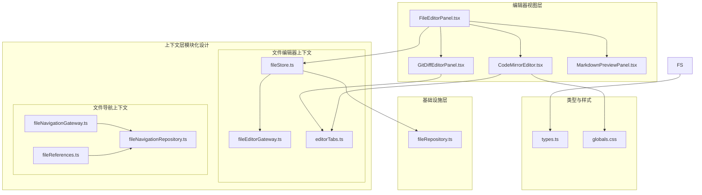
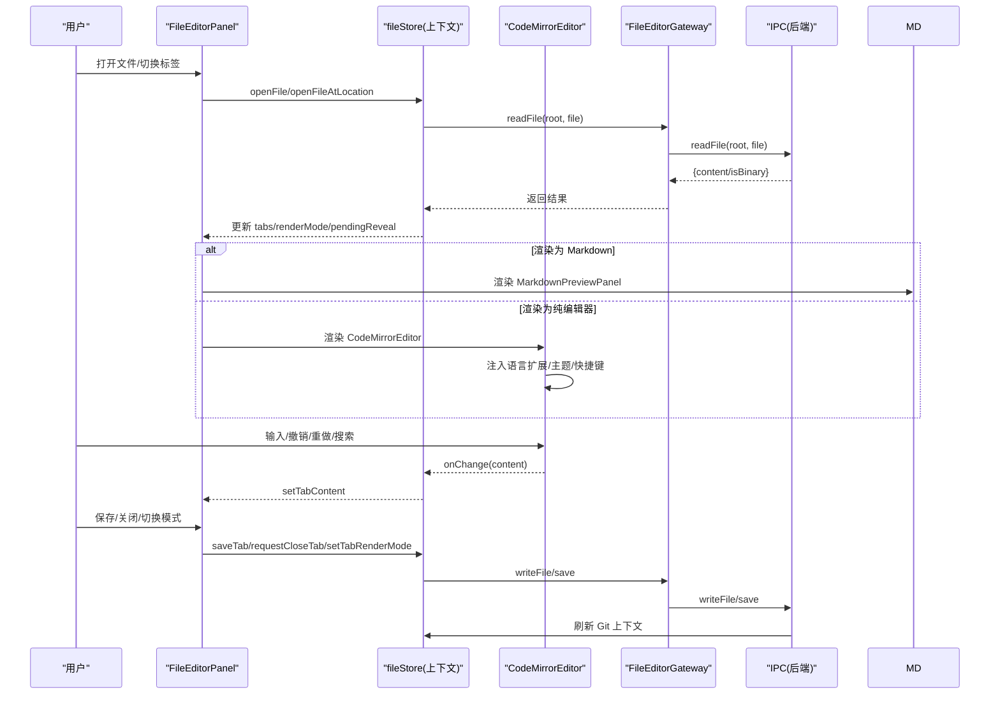
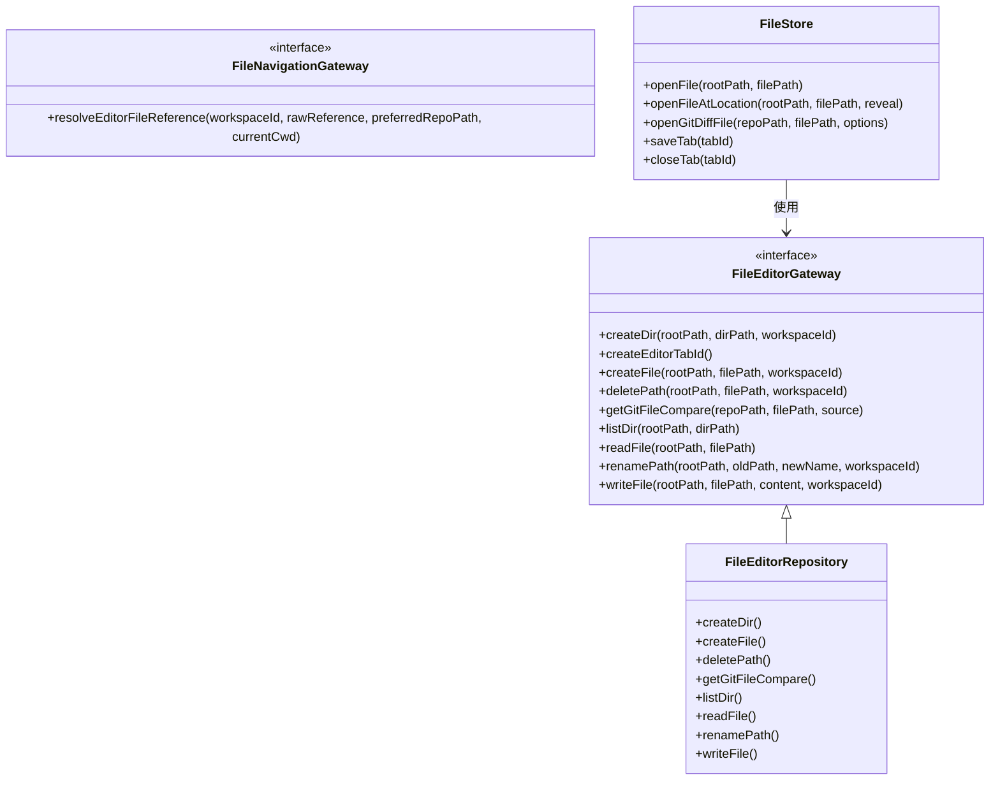
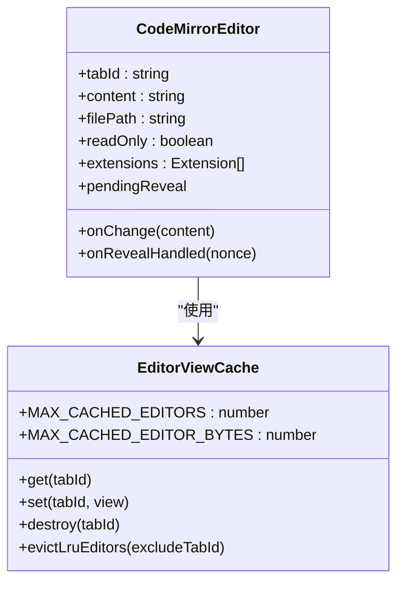
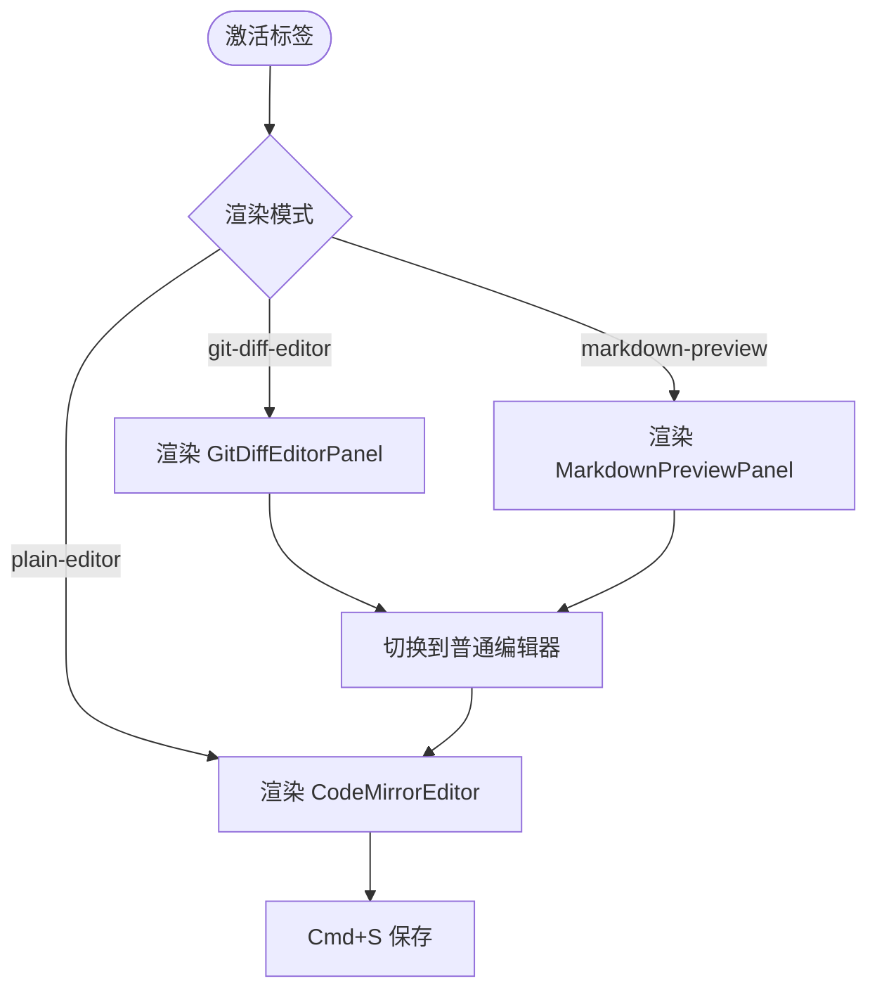
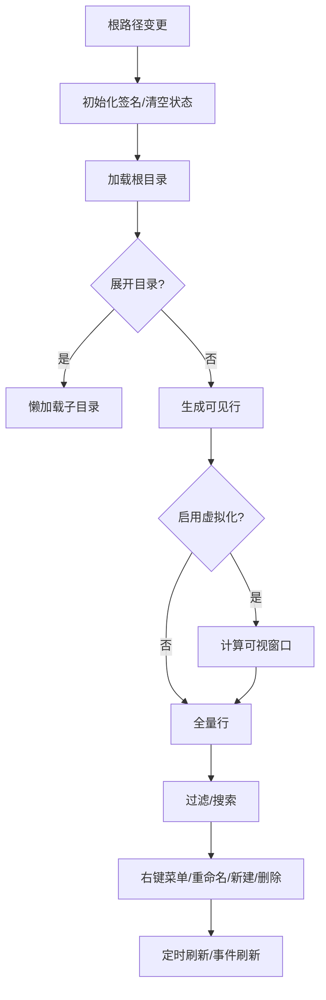
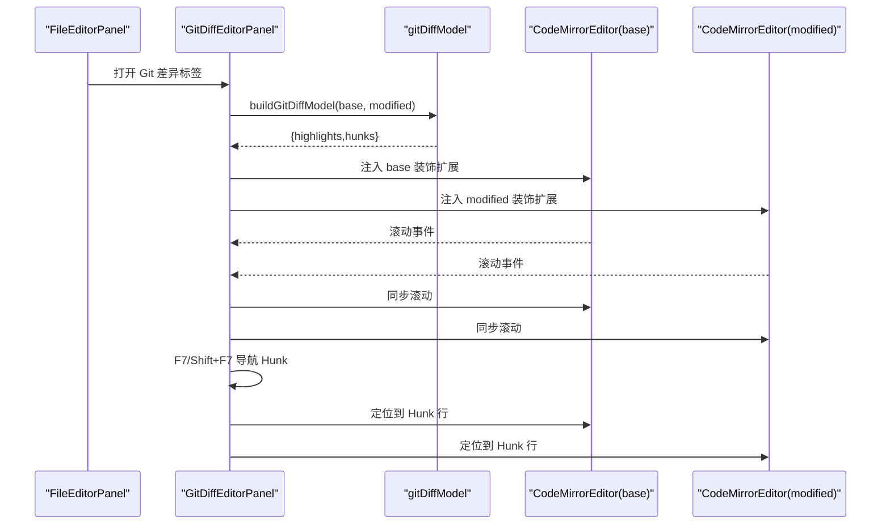
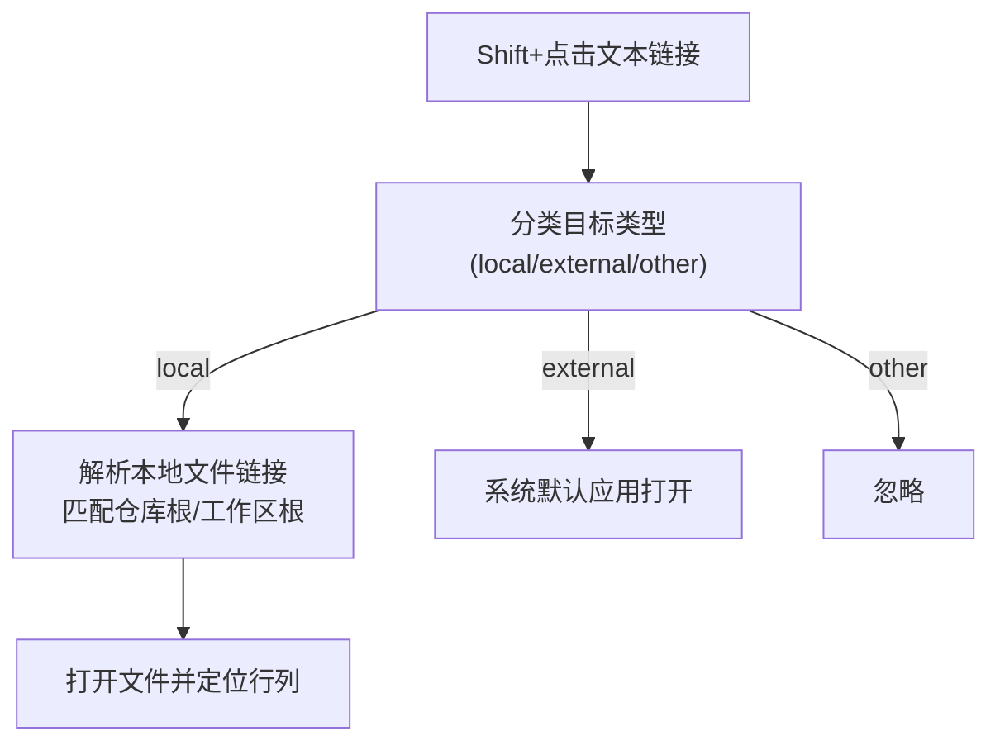
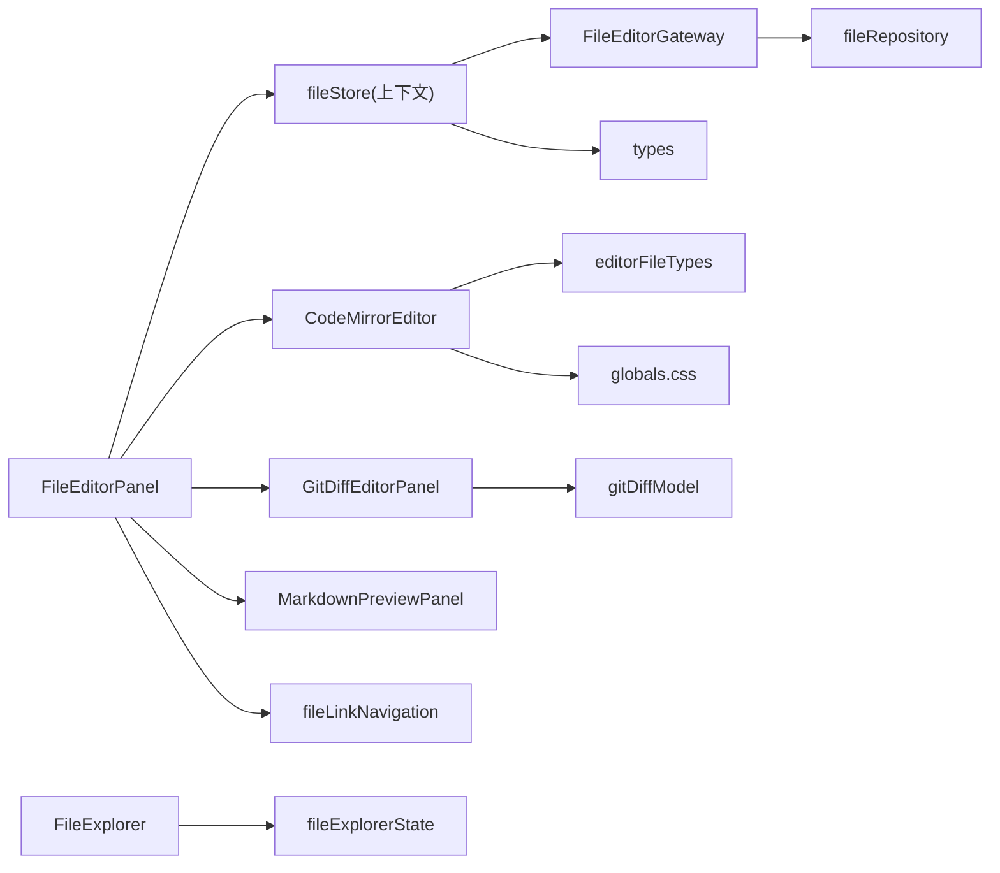

# 代码编辑器

<cite>
**本文引用的文件**
- [CodeMirrorEditor.tsx](file://src/components/editor/CodeMirrorEditor.tsx)
- [FileEditorPanel.tsx](file://src/components/editor/FileEditorPanel.tsx)
- [FileExplorer.tsx](file://src/components/editor/FileExplorer.tsx)
- [GitDiffEditorPanel.tsx](file://src/components/editor/GitDiffEditorPanel.tsx)
- [MarkdownPreviewPanel.tsx](file://src/components/editor/MarkdownPreviewPanel.tsx)
- [editorFileTypes.ts](file://src/lib/editorFileTypes.ts)
- [fileExplorerState.ts](file://src/components/editor/fileExplorerState.ts)
- [gitDiffModel.ts](file://src/components/editor/gitDiffModel.ts)
- [fileLinkNavigation.ts](file://src/lib/fileLinkNavigation.ts)
- [fileStore.ts](file://src/stores/fileStore.ts)
- [types.ts](file://src/types.ts)
- [globals.css](file://src/globals.css)
- [fileEditorGateway.ts](file://src/contexts/file-editor/application/fileEditorGateway.ts)
- [fileStore.ts](file://src/contexts/file-editor/application/fileStore.ts)
- [editorTabs.ts](file://src/contexts/file-editor/domain/editorTabs.ts)
- [fileRepository.ts](file://src/contexts/file-editor/infrastructure/fileRepository.ts)
- [fileNavigationGateway.ts](file://src/contexts/file-navigation/application/fileNavigationGateway.ts)
- [fileNavigationApplicationBoundaries.test.ts](file://src/contexts/file-navigation/application/fileNavigationApplicationBoundaries.test.ts)
- [fileNavigationRepository.ts](file://src/contexts/file-navigation/infrastructure/fileNavigationRepository.ts)
- [fileReferences.ts](file://src/contexts/file-navigation/domain/fileReferences.ts)
</cite>

## 更新摘要
**所做更改**
- 更新了上下文架构重构对编辑器功能的影响分析
- 新增了模块化设计的上下文层架构说明
- 更新了文件编辑器和文件导航的模块化实现
- 增强了网关接口和基础设施层的设计说明
- 更新了测试边界验证机制的说明

## 目录
1. [简介](#简介)
2. [项目结构](#项目结构)
3. [核心组件](#核心组件)
4. [架构总览](#架构总览)
5. [详细组件分析](#详细组件分析)
6. [依赖关系分析](#依赖关系分析)
7. [性能考量](#性能考量)
8. [故障排查指南](#故障排查指南)
9. [结论](#结论)
10. [附录](#附录)

## 简介
本文件面向"代码编辑器"子系统，围绕基于 CodeMirror 的编辑器实现、文件浏览器与文件系统集成展开，覆盖文件类型识别、语法高亮、代码折叠、搜索替换、Git 差异查看、Markdown 预览、文件链接导航、编辑器主题与快捷键支持。**更新**：代码编辑器功能采用新的上下文架构，file-editor 和 file-navigation 上下文重构为模块化设计，支持更好的文件管理和编辑功能。

## 项目结构
编辑器相关模块集中在 src/components/editor 下，配合 src/lib 中的工具函数与 src/stores 中的状态管理，形成"视图层（React 组件）—状态层（Zustand）—语言能力（CodeMirror 扩展）—工具函数（文件类型、链接解析、差异模型）"的分层架构。**更新**：采用模块化上下文架构，将文件编辑器和文件导航功能分离为独立的上下文模块。

**图表来源**
- [FileEditorPanel.tsx:1-358](file://src/components/editor/FileEditorPanel.tsx#L1-L358)
- [CodeMirrorEditor.tsx:1-516](file://src/components/editor/CodeMirrorEditor.tsx#L1-L516)
- [GitDiffEditorPanel.tsx:1-526](file://src/components/editor/GitDiffEditorPanel.tsx#L1-L526)
- [MarkdownPreviewPanel.tsx:1-19](file://src/components/editor/MarkdownPreviewPanel.tsx#L1-L19)
- [fileEditorGateway.ts:1-58](file://src/contexts/file-editor/application/fileEditorGateway.ts#L1-L58)
- [fileStore.ts:1-392](file://src/contexts/file-editor/application/fileStore.ts#L1-392)
- [editorTabs.ts:1-218](file://src/contexts/file-editor/domain/editorTabs.ts#L1-L218)
- [fileNavigationGateway.ts:1-24](file://src/contexts/file-navigation/application/fileNavigationGateway.ts#L1-L24)
- [fileNavigationRepository.ts:1-7](file://src/contexts/file-navigation/infrastructure/fileNavigationRepository.ts#L1-L7)
- [fileRepository.ts:1-39](file://src/contexts/file-editor/infrastructure/fileRepository.ts#L1-L39)

**章节来源**
- [FileEditorPanel.tsx:1-358](file://src/components/editor/FileEditorPanel.tsx#L1-L358)
- [CodeMirrorEditor.tsx:1-516](file://src/components/editor/CodeMirrorEditor.tsx#L1-L516)
- [FileExplorer.tsx:1-800](file://src/components/editor/FileExplorer.tsx#L1-L800)
- [gitDiffModel.ts:1-298](file://src/components/editor/gitDiffModel.ts#L1-L298)
- [fileStore.ts:1-551](file://src/stores/fileStore.ts#L1-L551)
- [globals.css:1-200](file://src/globals.css#L1-L200)
- [fileEditorGateway.ts:1-58](file://src/contexts/file-editor/application/fileEditorGateway.ts#L1-L58)
- [fileStore.ts:1-392](file://src/contexts/file-editor/application/fileStore.ts#L1-392)
- [editorTabs.ts:1-218](file://src/contexts/file-editor/domain/editorTabs.ts#L1-L218)
- [fileNavigationGateway.ts:1-24](file://src/contexts/file-navigation/application/fileNavigationGateway.ts#L1-L24)
- [fileNavigationRepository.ts:1-7](file://src/contexts/file-navigation/infrastructure/fileNavigationRepository.ts#L1-L7)
- [fileRepository.ts:1-39](file://src/contexts/file-editor/infrastructure/fileRepository.ts#L1-L39)

## 核心组件
- **模块化上下文架构**：采用分层的上下文设计，将文件编辑器和文件导航功能分离为独立的模块，支持更好的可维护性和扩展性。
- **文件编辑器上下文**：包含文件编辑器网关、状态管理、标签处理和基础设施层，提供完整的文件编辑功能。
- **文件导航上下文**：专注于文件引用解析、链接导航和路径解析，支持多种文件引用格式。
- **CodeMirror 编辑器**：负责内容渲染、语法高亮、搜索替换、键盘快捷键、滚动与焦点管理、语言扩展注入与缓存复用。
- **文件编辑器面板**：聚合标签页、切换渲染模式（纯编辑器/Markdown 预览/Git 差异）、保存与关闭流程、打开外部应用等。
- **文件浏览器**：目录树虚拟化、过滤与搜索、上下文菜单、重命名/新建、删除确认、Git 变更监听与刷新。
- **Git 差异编辑器**：左右对比视图、差异高亮与选中行装饰、Hunk 导航、同步滚动、只读/可编辑策略。
- **Markdown 预览**：基于 MarkdownContent 的预览容器。
- **工具与模型**：文件类型判定、文件链接解析与导航、差异模型构建与锚点定位。
- **状态管理**：文件标签、内容、脏状态、Git 上下文、渲染模式、打开/关闭/保存、重命名重定向等。

**章节来源**
- [fileEditorGateway.ts:1-58](file://src/contexts/file-editor/application/fileEditorGateway.ts#L1-L58)
- [fileStore.ts:1-392](file://src/contexts/file-editor/application/fileStore.ts#L1-392)
- [editorTabs.ts:1-218](file://src/contexts/file-editor/domain/editorTabs.ts#L1-L218)
- [fileNavigationGateway.ts:1-24](file://src/contexts/file-navigation/application/fileNavigationGateway.ts#L1-L24)
- [fileNavigationRepository.ts:1-7](file://src/contexts/file-navigation/infrastructure/fileNavigationRepository.ts#L1-L7)
- [CodeMirrorEditor.tsx:319-516](file://src/components/editor/CodeMirrorEditor.tsx#L319-L516)
- [FileEditorPanel.tsx:25-358](file://src/components/editor/FileEditorPanel.tsx#L25-L358)
- [FileExplorer.tsx:173-800](file://src/components/editor/FileExplorer.tsx#L173-L800)
- [GitDiffEditorPanel.tsx:125-526](file://src/components/editor/GitDiffEditorPanel.tsx#L125-L526)
- [MarkdownPreviewPanel.tsx:7-19](file://src/components/editor/MarkdownPreviewPanel.tsx#L7-L19)
- [editorFileTypes.ts:1-7](file://src/lib/editorFileTypes.ts#L1-L7)
- [fileLinkNavigation.ts:1-242](file://src/lib/fileLinkNavigation.ts#L1-L242)
- [gitDiffModel.ts:1-298](file://src/components/editor/gitDiffModel.ts#L1-L298)
- [fileStore.ts:1-551](file://src/stores/fileStore.ts#L1-L551)

## 架构总览
编辑器子系统采用"模块化上下文 + 组件驱动 + 状态驱动"的三层设计：
- **上下文层**：将功能按领域划分为独立的上下文模块，每个模块包含应用层、领域层和基础设施层。
- **视图层**：通过 React 组件组合，按需渲染不同编辑模式。
- **状态层**：集中管理标签、内容、Git 上下文与渲染模式。
- **语言与工具层**：提供 CodeMirror 扩展、差异模型与链接解析。
- **样式层**：以 CSS 变量统一主题色板与排版。

**图表来源**
- [FileEditorPanel.tsx:25-358](file://src/components/editor/FileEditorPanel.tsx#L25-L358)
- [fileStore.ts:82-153](file://src/contexts/file-editor/application/fileStore.ts#L82-153)
- [fileEditorGateway.ts:23-43](file://src/contexts/file-editor/application/fileEditorGateway.ts#L23-L43)
- [CodeMirrorEditor.tsx:319-516](file://src/components/editor/CodeMirrorEditor.tsx#L319-L516)
- [MarkdownPreviewPanel.tsx:7-19](file://src/components/editor/MarkdownPreviewPanel.tsx#L7-L19)

## 详细组件分析

### 模块化上下文架构
**更新**：代码编辑器功能采用新的上下文架构，file-editor 和 file-navigation 上下文重构为模块化设计。

- **文件编辑器上下文**
  - **应用层**：提供文件编辑器网关接口和状态管理，封装所有文件编辑相关的业务逻辑。
  - **领域层**：包含标签处理、文件上下文解析、渲染模式转换等核心业务规则。
  - **基础设施层**：通过网关接口抽象底层文件系统操作，支持依赖注入和测试隔离。

- **文件导航上下文**
  - **应用层**：提供文件导航网关接口，专门处理文件引用解析和导航逻辑。
  - **领域层**：包含文件引用解析、路径解析、特殊文件名识别等业务规则。
  - **基础设施层**：通过网关接口抽象底层导航操作，支持跨平台兼容性。

**图表来源**
- [fileEditorGateway.ts:9-44](file://src/contexts/file-editor/application/fileEditorGateway.ts#L9-L44)
- [fileNavigationGateway.ts:3-9](file://src/contexts/file-navigation/application/fileNavigationGateway.ts#L3-L9)
- [fileStore.ts:45-75](file://src/contexts/file-editor/application/fileStore.ts#L45-75)
- [fileRepository.ts:23-38](file://src/contexts/file-editor/infrastructure/fileRepository.ts#L23-L38)

**章节来源**
- [fileEditorGateway.ts:1-58](file://src/contexts/file-editor/application/fileEditorGateway.ts#L1-L58)
- [fileNavigationGateway.ts:1-24](file://src/contexts/file-navigation/application/fileNavigationGateway.ts#L1-L24)
- [fileStore.ts:1-392](file://src/contexts/file-editor/application/fileStore.ts#L1-392)
- [editorTabs.ts:1-218](file://src/contexts/file-editor/domain/editorTabs.ts#L1-L218)
- [fileRepository.ts:1-39](file://src/contexts/file-editor/infrastructure/fileRepository.ts#L1-L39)
- [fileNavigationRepository.ts:1-7](file://src/contexts/file-navigation/infrastructure/fileNavigationRepository.ts#L1-L7)

### CodeMirror 编辑器组件
- **功能要点**
  - 语言扩展：根据文件扩展名动态加载对应语言包（JS/TS/HTML/CSS/JSON/Python/Rust/SQL/YAML/Markdown 等）。
  - 主题与高亮：内置 Dark Void 主题与高亮样式，支持 fallback 高亮风格。
  - 快捷键：默认键位、历史记录、折叠、搜索面板快捷键；支持自定义扩展键位。
  - 搜索替换：集成搜索模块与搜索面板，支持替换输入聚焦。
  - 代码折叠：折叠注释与块级结构。
  - 缓存复用：全局 EditorView 缓存，保留光标、滚动与历史，限制最大缓存数量与字节上限。
  - 外部更新同步：检测到外部内容变化时安全 dispatch，避免循环更新。
  - 可访问性：支持焦点管理、滚动定位与"显示到中心"。

**图表来源**
- [CodeMirrorEditor.tsx:237-317](file://src/components/editor/CodeMirrorEditor.tsx#L237-L317)
- [CodeMirrorEditor.tsx:319-516](file://src/components/editor/CodeMirrorEditor.tsx#L319-L516)

**章节来源**
- [CodeMirrorEditor.tsx:198-235](file://src/components/editor/CodeMirrorEditor.tsx#L198-L235)
- [CodeMirrorEditor.tsx:364-414](file://src/components/editor/CodeMirrorEditor.tsx#L364-L414)
- [CodeMirrorEditor.tsx:441-471](file://src/components/editor/CodeMirrorEditor.tsx#L441-L471)
- [CodeMirrorEditor.tsx:473-503](file://src/components/editor/CodeMirrorEditor.tsx#L473-L503)

### 文件编辑器面板
- **功能要点**
  - 标签栏：多标签展示、脏标记、关闭按钮、滚动条适配标题栏安全区域。
  - 渲染模式切换：Markdown 预览、Git 差异视图、纯编辑器。
  - Git 差异视图：在当前仓库内定位文件，生成 base/modified 对比。
  - 外部应用打开：调用系统默认应用打开文件。
  - 保存快捷键：Cmd+S 触发保存，嵌入式场景下受工作区布局约束。
  - 加载/错误态：加载中、加载失败提示。
  - 二进制文件：不可编辑时显示提示。

**图表来源**
- [FileEditorPanel.tsx:25-358](file://src/components/editor/FileEditorPanel.tsx#L25-L358)
- [MarkdownPreviewPanel.tsx:7-19](file://src/components/editor/MarkdownPreviewPanel.tsx#L7-L19)
- [GitDiffEditorPanel.tsx:125-526](file://src/components/editor/GitDiffEditorPanel.tsx#L125-L526)

**章节来源**
- [FileEditorPanel.tsx:47-157](file://src/components/editor/FileEditorPanel.tsx#L47-L157)
- [FileEditorPanel.tsx:246-341](file://src/components/editor/FileEditorPanel.tsx#L246-L341)

### 文件浏览器
- **功能要点**
  - 虚拟化树：大目录采用虚拟化渲染，阈值以上启用可视窗口计算。
  - 过滤与搜索：支持工作区范围文件搜索，带去抖与总数统计。
  - 目录展开/收起：懒加载子目录，记录展开状态。
  - 上下文菜单：文件/目录/空区/多选不同菜单项，自动定位菜单位置。
  - 重命名/新建：内联输入，校验与错误提示。
  - 删除确认：批量路径去包含、删除前确认。
  - 刷新策略：窗口可见、焦点变化、聊天结束事件触发刷新；监听 Git 变更。
  - 状态工具：路径映射、删除路径修剪、祖先路径重映射。

**图表来源**
- [FileExplorer.tsx:295-324](file://src/components/editor/FileExplorer.tsx#L295-L324)
- [FileExplorer.tsx:448-468](file://src/components/editor/FileExplorer.tsx#L448-L468)
- [FileExplorer.tsx:470-524](file://src/components/editor/FileExplorer.tsx#L470-L524)
- [FileExplorer.tsx:583-653](file://src/components/editor/FileExplorer.tsx#L583-L653)
- [FileExplorer.tsx:702-731](file://src/components/editor/FileExplorer.tsx#L702-L731)
- [fileExplorerState.ts:1-103](file://src/components/editor/fileExplorerState.ts#L1-L103)

**章节来源**
- [FileExplorer.tsx:173-800](file://src/components/editor/FileExplorer.tsx#L173-L800)
- [fileExplorerState.ts:1-103](file://src/components/editor/fileExplorerState.ts#L1-L103)

### Git 差异编辑器
- **功能要点**
  - 差异模型：基于 diff-lines 计算 base 与 modified 的行级高亮与 Hunk 列表。
  - 行装饰：为 base/modified 区域添加类名，突出新增/删除/修改行。
  - Hunk 锚点：记录当前活动 Hunk 的主侧与锚点行，用于滚动与聚焦。
  - 同步滚动：左右视图滚动联动，避免递归同步。
  - 快捷键：F7/Shift+F7 导航下一个/上一个 Hunk。
  - 只读策略：deleted/conflicted 等场景下的只读/可编辑判断。

**图表来源**
- [GitDiffEditorPanel.tsx:125-526](file://src/components/editor/GitDiffEditorPanel.tsx#L125-L526)
- [gitDiffModel.ts:134-199](file://src/components/editor/gitDiffModel.ts#L134-L199)

**章节来源**
- [GitDiffEditorPanel.tsx:125-526](file://src/components/editor/GitDiffEditorPanel.tsx#L125-L526)
- [gitDiffModel.ts:1-298](file://src/components/editor/gitDiffModel.ts#L1-L298)

### Markdown 预览与文件链接导航
**更新**：文件链接导航功能现在通过专门的文件导航上下文处理，支持更复杂的引用解析。

- **Markdown 预览**：使用 MarkdownContent 渲染，容器提供滚动与排版样式。
- **文件链接导航**：支持本地绝对/相对路径与行号列号跳转，结合仓库根与工作区根进行解析与定位；支持 Shift+点击触发导航；外部链接交由系统默认应用打开。
- **引用解析增强**：支持多种引用格式，包括哈希定位、冒号定位等复杂语法。

**图表来源**
- [MarkdownPreviewPanel.tsx:7-19](file://src/components/editor/MarkdownPreviewPanel.tsx#L7-L19)
- [fileLinkNavigation.ts:49-92](file://src/lib/fileLinkNavigation.ts#L49-L92)
- [fileLinkNavigation.ts:118-176](file://src/lib/fileLinkNavigation.ts#L118-L176)
- [fileLinkNavigation.ts:193-242](file://src/lib/fileLinkNavigation.ts#L193-L242)

**章节来源**
- [MarkdownPreviewPanel.tsx:7-19](file://src/components/editor/MarkdownPreviewPanel.tsx#L7-L19)
- [fileLinkNavigation.ts:1-242](file://src/lib/fileLinkNavigation.ts#L1-L242)
- [fileReferences.ts:1-508](file://src/contexts/file-navigation/domain/fileReferences.ts#L1-L508)

## 依赖关系分析
**更新**：依赖关系现在通过模块化上下文架构组织，增强了系统的可维护性和可测试性。

- **模块间依赖**
  - FileEditorPanel 依赖 fileStore(上下文) 管理标签与渲染模式，依赖 CodeMirrorEditor/GitDiffEditorPanel/MarkdownPreviewPanel 渲染不同视图。
  - fileStore(上下文) 通过 FileEditorGateway 接口访问基础设施层，避免直接依赖具体实现。
  - FileNavigationGateway 通过 fileNavigationRepository 处理文件引用解析，保持与 UI 层的解耦。
  - FileExplorer 依赖 fileExplorerState 管理路径与状态修剪，依赖 IPC 列举目录与搜索。
- **组件耦合**
  - 视图层通过 React 组件组合，按需渲染不同编辑模式。
  - 状态层集中管理标签、内容、Git 上下文与渲染模式。
  - 语言与工具层提供 CodeMirror 扩展、差异模型与链接解析。
  - 样式层以 CSS 变量统一主题色板与排版。
- **外部依赖**
  - CodeMirror 生态（@codemirror/*）：视图、状态、语言、搜索、命令等。
  - diff 库：行级差异计算。
  - @tauri-apps/plugin-shell：外部链接打开。
  - Zustand：轻量状态管理。

**图表来源**
- [FileEditorPanel.tsx:1-358](file://src/components/editor/FileEditorPanel.tsx#L1-L358)
- [fileStore.ts:1-392](file://src/contexts/file-editor/application/fileStore.ts#L1-392)
- [fileEditorGateway.ts:1-58](file://src/contexts/file-editor/application/fileEditorGateway.ts#L1-L58)
- [fileRepository.ts:1-39](file://src/contexts/file-editor/infrastructure/fileRepository.ts#L1-L39)
- [CodeMirrorEditor.tsx:1-516](file://src/components/editor/CodeMirrorEditor.tsx#L1-L516)
- [GitDiffEditorPanel.tsx:1-526](file://src/components/editor/GitDiffEditorPanel.tsx#L1-L526)
- [MarkdownPreviewPanel.tsx:1-19](file://src/components/editor/MarkdownPreviewPanel.tsx#L1-L19)
- [editorFileTypes.ts:1-7](file://src/lib/editorFileTypes.ts#L1-L7)
- [gitDiffModel.ts:1-298](file://src/components/editor/gitDiffModel.ts#L1-L298)
- [fileLinkNavigation.ts:1-242](file://src/lib/fileLinkNavigation.ts#L1-L242)
- [fileExplorerState.ts:1-103](file://src/components/editor/fileExplorerState.ts#L1-L103)
- [types.ts:1-200](file://src/types.ts#L1-L200)
- [globals.css:1-200](file://src/globals.css#L1-L200)

**章节来源**
- [fileStore.ts:1-551](file://src/stores/fileStore.ts#L1-L551)
- [types.ts:1-200](file://src/types.ts#L1-L200)

## 性能考量
**更新**：模块化架构带来了新的性能优化机会和挑战。

- **编辑器缓存**
  - 使用 Map 缓存 EditorView，保留光标、滚动与历史；LRU 淘汰策略控制数量与内存上限。
  - 文档大小估算与增量更新，避免频繁重建。
- **虚拟化树**
  - FileExplorer 在节点数超过阈值时启用虚拟化，计算可视窗口减少 DOM 节点数量。
  - 滚动边界与 Overscan 增强滚动流畅度。
- **异步加载与刷新**
  - 目录懒加载与批量刷新，降低首屏与交互延迟。
  - 事件驱动刷新（窗口可见、焦点、Git 变更），避免轮询。
- **差异计算**
  - 行级 diff，仅在内容变化时重新构建模型；Hunk 锚点与距离计算减少不必要的滚动。
- **上下文层优化**
  - 网关接口抽象减少了直接依赖，支持更好的缓存和测试隔离。
  - 模块化设计允许按需加载，减少初始包体积。
- **样式与主题**
  - CSS 变量统一主题，减少重复样式计算；CodeMirror 主题与高亮样式按需注入。

**章节来源**
- [CodeMirrorEditor.tsx:241-292](file://src/components/editor/CodeMirrorEditor.tsx#L241-L292)
- [CodeMirrorEditor.tsx:400-413](file://src/components/editor/CodeMirrorEditor.tsx#L400-L413)
- [FileExplorer.tsx:702-731](file://src/components/editor/FileExplorer.tsx#L702-L731)
- [FileExplorer.tsx:326-361](file://src/components/editor/FileExplorer.tsx#L326-L361)
- [gitDiffModel.ts:134-199](file://src/components/editor/gitDiffModel.ts#L134-L199)

## 故障排查指南
**更新**：模块化架构提供了更好的故障诊断和隔离能力。

- **上下文层问题**
  - 检查 FileEditorGateway 是否正确配置，未配置时会抛出错误异常。
  - 验证 fileStore(上下文) 的状态管理逻辑，确保标签生命周期正确处理。
  - 确认网关接口的实现完整性，避免方法缺失导致的功能异常。
- **打开文件或显示二进制**
  - 检查 fileStore(上下文) 的 openFileAtLocation 流程与 loadError 字段。
  - 若 isBinary 为真，强制回退到纯编辑器视图。
- **无法保存或提示外部修改**
  - 保存前检查磁盘内容是否被外部修改，必要时提示并更新 savedContent。
  - 保存失败时通过 toast 展示错误信息。
- **Git 差异为空或不可用**
  - 确认已定位到正确仓库与文件路径，且文件非二进制。
  - 通过 refreshGitContext 重新拉取比较结果。
- **搜索替换无效**
  - 确认已注入搜索扩展与快捷键；使用 openSearchPanel 并聚焦替换输入框。
- **缓存导致的旧视图残留**
  - 使用 destroyCachedEditor 或 getActiveEditorView 获取当前视图，必要时重建。
- **链接无法跳转**
  - 检查 Shift+点击触发条件与本地链接解析逻辑，确保匹配仓库根或工作区根。
  - 验证 fileNavigationGateway 的配置和实现。
- **测试边界验证**
  - 确保应用层不直接导入基础设施层实现，保持清晰的边界。
  - 验证网关接口的正确使用，避免绕过依赖注入。

**章节来源**
- [fileStore.ts:52-57](file://src/contexts/file-editor/application/fileStore.ts#L52-57)
- [fileStore.ts:205-230](file://src/contexts/file-editor/application/fileStore.ts#L205-230)
- [fileStore.ts:337-391](file://src/contexts/file-editor/application/fileStore.ts#L337-391)
- [fileEditorGateway.ts:48-57](file://src/contexts/file-editor/application/fileEditorGateway.ts#L48-L57)
- [fileNavigationApplicationBoundaries.test.ts:1-24](file://src/contexts/file-navigation/application/fileNavigationApplicationBoundaries.test.ts#L1-L24)

## 结论
**更新**：该编辑器子系统经过模块化重构，采用上下文架构设计，以 CodeMirror 为核心，结合 React 组件与 Zustand 状态管理，实现了从文件浏览、打开编辑、语法高亮、搜索替换、Git 差异对比到 Markdown 预览的完整链路。

新的模块化设计将文件编辑器和文件导航功能分离为独立的上下文模块，通过网关接口抽象底层实现，提供了更好的可维护性、可测试性和扩展性。通过虚拟化树、编辑器缓存与事件驱动刷新等手段，在保证交互流畅的同时兼顾了大工程的性能表现。建议在扩展新语言或增强导航能力时，遵循现有的模块职责划分与状态流设计，确保一致性与可维护性。

## 附录
- **文件类型识别与 Markdown 预览**
  - 依据扩展名判断是否进入 Markdown 预览模式。
- **主题与样式**
  - 使用 CSS 变量统一主题色板，Dark Void 主题应用于编辑器视图。
- **快捷键与可访问性**
  - 默认键位与搜索面板快捷键；焦点管理与滚动定位提升可用性。
- **模块化设计优势**
  - 清晰的职责分离，便于单元测试和集成测试。
  - 支持依赖注入和运行时配置，提高灵活性。
  - 网关接口抽象隐藏实现细节，降低耦合度。

**章节来源**
- [editorFileTypes.ts:1-7](file://src/lib/editorFileTypes.ts#L1-L7)
- [globals.css:1-200](file://src/globals.css#L1-L200)
- [CodeMirrorEditor.tsx:380-397](file://src/components/editor/CodeMirrorEditor.tsx#L380-L397)
- [fileEditorGateway.ts:1-58](file://src/contexts/file-editor/application/fileEditorGateway.ts#L1-L58)
- [fileNavigationGateway.ts:1-24](file://src/contexts/file-navigation/application/fileNavigationGateway.ts#L1-L24)