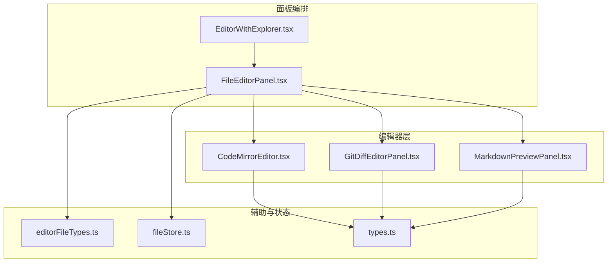
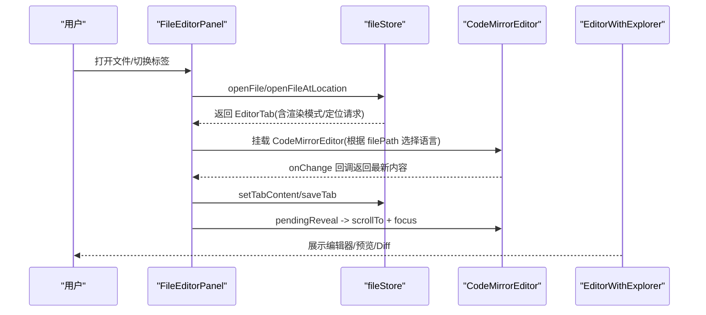
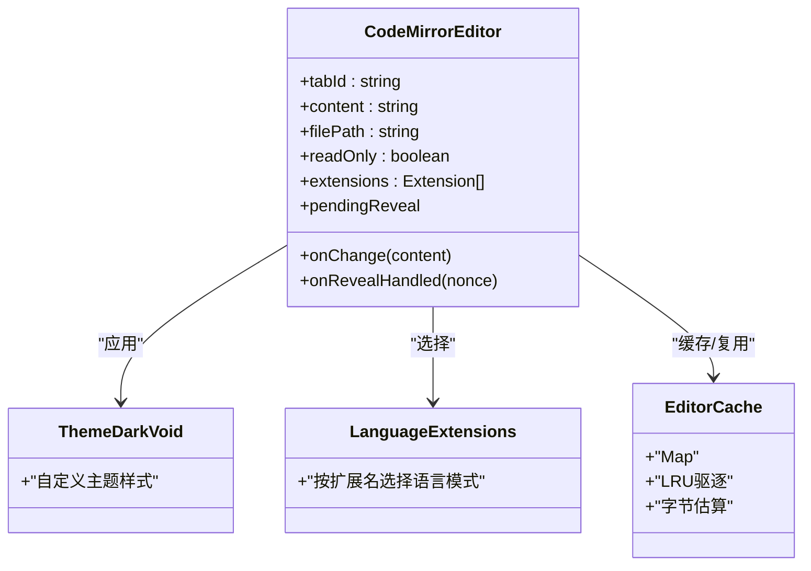
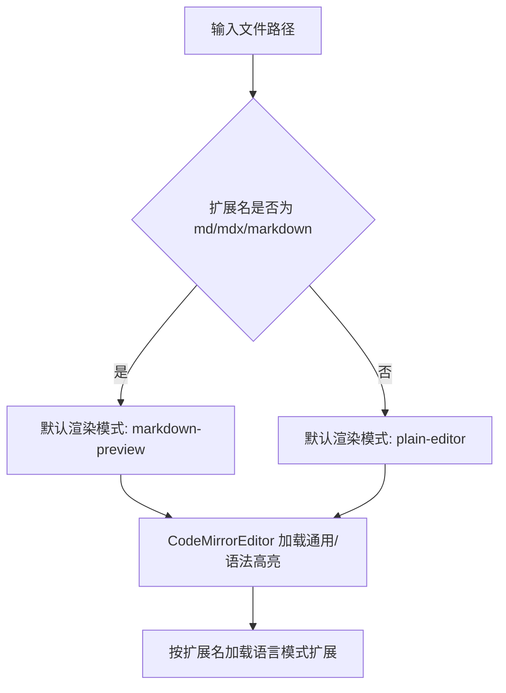
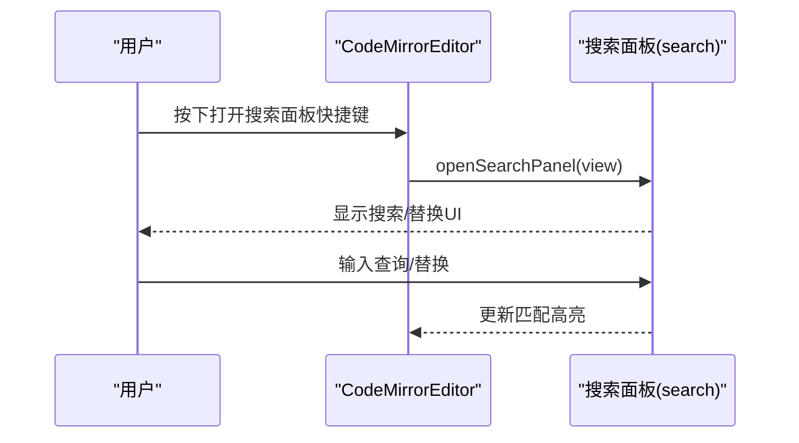
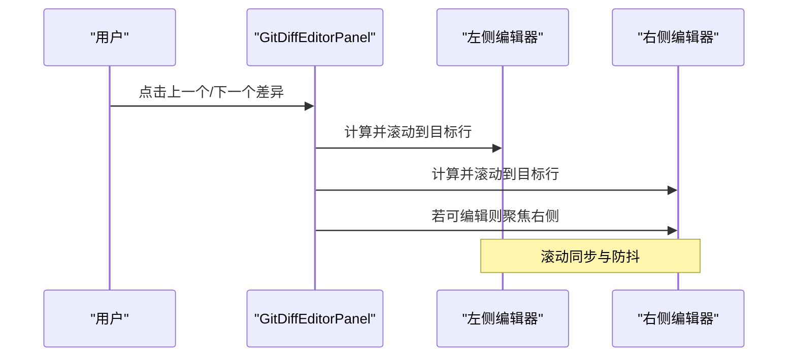
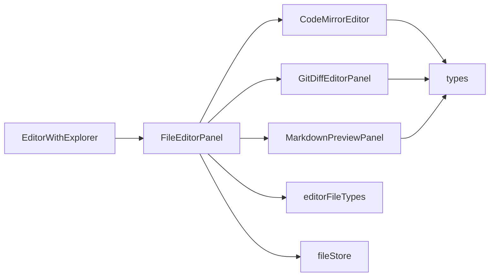

# 代码编辑核心

<cite>
**本文引用的文件**
- [CodeMirrorEditor.tsx](file://src/components/editor/CodeMirrorEditor.tsx)
- [FileEditorPanel.tsx](file://src/components/editor/FileEditorPanel.tsx)
- [EditorWithExplorer.tsx](file://src/components/editor/EditorWithExplorer.tsx)
- [GitDiffEditorPanel.tsx](file://src/components/editor/GitDiffEditorPanel.tsx)
- [MarkdownPreviewPanel.tsx](file://src/components/editor/MarkdownPreviewPanel.tsx)
- [editorFileTypes.ts](file://src/lib/editorFileTypes.ts)
- [fileStore.ts](file://src/stores/fileStore.ts)
- [types.ts](file://src/types.ts)
</cite>

## 目录
1. [简介](#简介)
2. [项目结构](#项目结构)
3. [核心组件](#核心组件)
4. [架构总览](#架构总览)
5. [组件详解](#组件详解)
6. [依赖关系分析](#依赖关系分析)
7. [性能与内存优化](#性能与内存优化)
8. [故障排查指南](#故障排查指南)
9. [结论](#结论)
10. [附录：扩展开发与自定义配置](#附录扩展开发与自定义配置)

## 简介
本文件面向“代码编辑核心”能力，围绕基于 CodeMirror 的编辑器实现进行系统化说明。内容涵盖语法高亮、代码折叠、智能提示、自动补全、括号匹配、文件类型识别与语言模式切换、搜索替换、主题系统、快捷键绑定、渲染模式（普通编辑器/Markdown 预览/Git Diff）以及缓存与性能优化策略。同时提供扩展开发与自定义配置指引，帮助开发者在现有架构上进行二次开发。

## 项目结构
编辑器相关模块主要位于 src/components/editor 下，配合 src/lib/editorFileTypes.ts 提供文件类型判断，通过 src/stores/fileStore.ts 管理标签页状态与渲染模式切换，最终由 src/components/editor/EditorWithExplorer.ts 组织侧边栏与编辑器区域布局。

图表来源
- [CodeMirrorEditor.tsx:1-516](file://src/components/editor/CodeMirrorEditor.tsx#L1-L516)
- [FileEditorPanel.tsx:1-358](file://src/components/editor/FileEditorPanel.tsx#L1-L358)
- [EditorWithExplorer.tsx:1-124](file://src/components/editor/EditorWithExplorer.tsx#L1-L124)
- [GitDiffEditorPanel.tsx:1-526](file://src/components/editor/GitDiffEditorPanel.tsx#L1-L526)
- [MarkdownPreviewPanel.tsx:1-19](file://src/components/editor/MarkdownPreviewPanel.tsx#L1-L19)
- [editorFileTypes.ts:1-7](file://src/lib/editorFileTypes.ts#L1-L7)
- [fileStore.ts:1-200](file://src/stores/fileStore.ts#L1-L200)
- [types.ts:1-200](file://src/types.ts#L1-L200)

章节来源
- [CodeMirrorEditor.tsx:1-516](file://src/components/editor/CodeMirrorEditor.tsx#L1-L516)
- [FileEditorPanel.tsx:1-358](file://src/components/editor/FileEditorPanel.tsx#L1-L358)
- [EditorWithExplorer.tsx:1-124](file://src/components/editor/EditorWithExplorer.tsx#L1-L124)
- [GitDiffEditorPanel.tsx:1-526](file://src/components/editor/GitDiffEditorPanel.tsx#L1-L526)
- [MarkdownPreviewPanel.tsx:1-19](file://src/components/editor/MarkdownPreviewPanel.tsx#L1-L19)
- [editorFileTypes.ts:1-7](file://src/lib/editorFileTypes.ts#L1-L7)
- [fileStore.ts:1-200](file://src/stores/fileStore.ts#L1-L200)
- [types.ts:1-200](file://src/types.ts#L1-L200)

## 核心组件
- CodeMirrorEditor：封装 CodeMirror 视图、主题、语言模式、扩展、键盘映射、搜索面板、滚动定位与缓存复用。
- FileEditorPanel：标签页容器与渲染模式编排，支持普通编辑器、Markdown 预览、Git Diff 编辑器三种视图。
- EditorWithExplorer：左侧文件资源管理器与编辑器区域的可拖拽分栏布局。
- GitDiffEditorPanel：双窗格对比视图，基于 CodeMirror 的装饰与滚动同步，提供 Diff 跳转与高亮。
- MarkdownPreviewPanel：Markdown 内容预览展示。
- editorFileTypes：文件类型判定（如 Markdown 扩展名）。
- fileStore：标签页状态、打开/保存/关闭、渲染模式切换、定位请求等。
- types：编辑器相关类型定义（如 EditorRevealRequest、EditorRenderMode 等）。

章节来源
- [CodeMirrorEditor.tsx:319-516](file://src/components/editor/CodeMirrorEditor.tsx#L319-L516)
- [FileEditorPanel.tsx:25-358](file://src/components/editor/FileEditorPanel.tsx#L25-L358)
- [EditorWithExplorer.tsx:36-124](file://src/components/editor/EditorWithExplorer.tsx#L36-L124)
- [GitDiffEditorPanel.tsx:125-526](file://src/components/editor/GitDiffEditorPanel.tsx#L125-L526)
- [MarkdownPreviewPanel.tsx:7-19](file://src/components/editor/MarkdownPreviewPanel.tsx#L7-L19)
- [editorFileTypes.ts:1-7](file://src/lib/editorFileTypes.ts#L1-L7)
- [fileStore.ts:168-200](file://src/stores/fileStore.ts#L168-L200)
- [types.ts:109-142](file://src/types.ts#L109-L142)

## 架构总览
编辑器采用“视图缓存 + 动态扩展 + 渲染模式编排”的架构：
- CodeMirrorEditor 负责单个编辑器实例的创建、更新与销毁；通过 Compartment 实现只读模式与额外扩展的动态重配置。
- FileEditorPanel 负责标签页集合、激活标签、渲染模式切换与外部事件（如保存、打开默认应用）。
- EditorWithExplorer 负责布局与侧边栏宽度持久化。
- GitDiffEditorPanel 基于两个 CodeMirrorEditor 实例构建左右对比视图，使用装饰（decorations）高亮差异行，实现滚动同步与焦点切换。
- MarkdownPreviewPanel 将 Markdown 文本交给 MarkdownContent 组件渲染。
- editorFileTypes 与 fileStore 协作决定默认渲染模式与定位请求。

图表来源
- [FileEditorPanel.tsx:25-358](file://src/components/editor/FileEditorPanel.tsx#L25-L358)
- [CodeMirrorEditor.tsx:319-516](file://src/components/editor/CodeMirrorEditor.tsx#L319-L516)
- [fileStore.ts:168-200](file://src/stores/fileStore.ts#L168-L200)
- [EditorWithExplorer.tsx:36-124](file://src/components/editor/EditorWithExplorer.tsx#L36-L124)

## 组件详解

### CodeMirrorEditor 组件
职责与特性
- 语言模式识别：依据文件扩展名选择对应语言包（JavaScript/TypeScript/JSX/TSX/Rust/Python/HTML/CSS/JSON/Markdown/SQL/YAML）。
- 主题系统：自定义 darkVoid 主题与高亮样式，覆盖滚动条、行号、活动行、折叠标记、搜索高亮等。
- 编辑器扩展：启用行号、活动行高亮、特殊字符高亮、历史记录、代码折叠、矩形选择、十字光标、缩进输入、括号匹配、语法高亮、搜索面板与默认快捷键。
- 快捷键绑定：包含默认键位、历史撤销/重做、折叠键位、搜索键位、自定义“打开搜索面板”快捷键。
- 外部内容同步：检测外部变更，避免循环更新。
- 缓存与复用：以 Map 缓存 EditorView，按 tabId 与 filePath 管理，支持 LRU 驱逐与字节估算，保留光标、滚动与撤销历史。
- 定位显示：接收 pendingReveal 请求，计算行列位置并滚动居中，随后聚焦。

图表来源
- [CodeMirrorEditor.tsx:319-516](file://src/components/editor/CodeMirrorEditor.tsx#L319-L516)

章节来源
- [CodeMirrorEditor.tsx:198-235](file://src/components/editor/CodeMirrorEditor.tsx#L198-L235)
- [CodeMirrorEditor.tsx:37-172](file://src/components/editor/CodeMirrorEditor.tsx#L37-L172)
- [CodeMirrorEditor.tsx:364-419](file://src/components/editor/CodeMirrorEditor.tsx#L364-L419)
- [CodeMirrorEditor.tsx:241-292](file://src/components/editor/CodeMirrorEditor.tsx#L241-L292)
- [CodeMirrorEditor.tsx:473-503](file://src/components/editor/CodeMirrorEditor.tsx#L473-L503)

### 文件类型识别与语言模式切换
- editorFileTypes 提供 Markdown 预览扩展名集合与判定函数。
- fileStore 在创建标签时根据文件路径与定位请求决定默认渲染模式（Markdown 预览优先）。
- CodeMirrorEditor 根据 filePath 动态加载对应语言扩展。

图表来源
- [editorFileTypes.ts:1-7](file://src/lib/editorFileTypes.ts#L1-L7)
- [fileStore.ts:134-142](file://src/stores/fileStore.ts#L134-L142)
- [CodeMirrorEditor.tsx:198-235](file://src/components/editor/CodeMirrorEditor.tsx#L198-L235)

章节来源
- [editorFileTypes.ts:1-7](file://src/lib/editorFileTypes.ts#L1-L7)
- [fileStore.ts:134-142](file://src/stores/fileStore.ts#L134-L142)
- [CodeMirrorEditor.tsx:198-235](file://src/components/editor/CodeMirrorEditor.tsx#L198-L235)

### 搜索与替换机制
- 使用 @codemirror/search 提供搜索状态与键位映射。
- 自定义快捷键打开搜索面板，并在打开后聚焦“替换”输入框。
- 搜索结果高亮样式与选中高亮由主题控制。

图表来源
- [CodeMirrorEditor.tsx:380-397](file://src/components/editor/CodeMirrorEditor.tsx#L380-L397)
- [CodeMirrorEditor.tsx:13-13](file://src/components/editor/CodeMirrorEditor.tsx#L13-L13)

章节来源
- [CodeMirrorEditor.tsx:13-13](file://src/components/editor/CodeMirrorEditor.tsx#L13-L13)
- [CodeMirrorEditor.tsx:380-397](file://src/components/editor/CodeMirrorEditor.tsx#L380-L397)

### Git Diff 编辑器
- 双窗格：左侧基线版本只读，右侧修改版本可编辑。
- 差异高亮：基于 diff 模型生成装饰范围，分别对 base 与 modified 区域应用被动/主动高亮。
- 滚动同步：监听两侧滚动 DOM，互相同步滚动位置，避免程序化滚动触发互相干扰。
- 键位导航：F7/Shift+F7 在差异块之间跳转。
- 焦点与定位：根据当前差异块定位到对应行并居中，必要时聚焦修改区。

图表来源
- [GitDiffEditorPanel.tsx:125-526](file://src/components/editor/GitDiffEditorPanel.tsx#L125-L526)

章节来源
- [GitDiffEditorPanel.tsx:125-526](file://src/components/editor/GitDiffEditorPanel.tsx#L125-L526)

### Markdown 预览
- 将 Markdown 文本交由 MarkdownContent 渲染，提供基础排版样式与滚动容器。

章节来源
- [MarkdownPreviewPanel.tsx:7-19](file://src/components/editor/MarkdownPreviewPanel.tsx#L7-L19)

### 标签页与渲染模式编排
- FileEditorPanel 管理标签集合、激活标签、关闭确认、保存快捷键、打开默认应用、切换 Diff/预览视图。
- 支持加载中/错误/二进制文件等状态占位。
- 与 fileStore 协作，设置渲染模式、更新内容、处理定位请求。

章节来源
- [FileEditorPanel.tsx:25-358](file://src/components/editor/FileEditorPanel.tsx#L25-L358)
- [fileStore.ts:168-200](file://src/stores/fileStore.ts#L168-L200)

### 布局与侧边栏
- EditorWithExplorer 提供可拖拽的侧边栏宽度，支持最小/最大限制与本地存储持久化。
- 编辑器区域懒加载，提升首屏性能。

章节来源
- [EditorWithExplorer.tsx:36-124](file://src/components/editor/EditorWithExplorer.tsx#L36-L124)

## 依赖关系分析
- 组件内聚：每个面板职责清晰，编辑器仅负责渲染与交互，布局与状态由更高层组件编排。
- 组件耦合：FileEditorPanel 依赖 CodeMirrorEditor、GitDiffEditorPanel、MarkdownPreviewPanel；EditorWithExplorer 依赖 FileEditorPanel；fileStore 与 types 提供跨组件共享的状态与类型。
- 外部依赖：@codemirror/* 提供视图、状态、命令、语言、搜索、装饰等能力；lucide-react 图标库；react-i18n 翻译；zustand 状态管理。

图表来源
- [FileEditorPanel.tsx:1-358](file://src/components/editor/FileEditorPanel.tsx#L1-L358)
- [CodeMirrorEditor.tsx:1-516](file://src/components/editor/CodeMirrorEditor.tsx#L1-L516)
- [GitDiffEditorPanel.tsx:1-526](file://src/components/editor/GitDiffEditorPanel.tsx#L1-L526)
- [MarkdownPreviewPanel.tsx:1-19](file://src/components/editor/MarkdownPreviewPanel.tsx#L1-L19)
- [EditorWithExplorer.tsx:1-124](file://src/components/editor/EditorWithExplorer.tsx#L1-L124)
- [editorFileTypes.ts:1-7](file://src/lib/editorFileTypes.ts#L1-L7)
- [fileStore.ts:1-200](file://src/stores/fileStore.ts#L1-L200)
- [types.ts:1-200](file://src/types.ts#L1-L200)

## 性能与内存优化
- 视图缓存与复用
  - 以 Map 缓存 EditorView，key 为 tabId，值包含视图、onChange 引用、额外扩展与只读状态的 Compartment，以及最后访问时间与文档字节数。
  - LRU 驱逐策略：当缓存数量或总字节数超过阈值时，按最后访问时间排序，移除断开连接的旧视图，释放 DOM 与内存。
  - 字节估算：以字符串长度乘以 2 近似估算 UTF-16 字节大小。
- 外部内容同步
  - 通过 isExternalUpdate 标记避免外部 dispatch 导致的 onChange 循环。
  - 使用 EditorView.updateListener 仅在 docChanged 时更新字节统计并触发驱逐。
- 滚动同步与防抖
  - GitDiffEditorPanel 对两侧滚动事件加锁，防止程序化滚动与用户滚动相互干扰。
- 懒加载与布局
  - EditorWithExplorer 对 Explorer 与编辑器面板使用 Suspense 懒加载，减少初始负载。
- 大文件处理建议
  - 控制缓存上限与字节阈值，确保内存占用可控。
  - 对超大文件可考虑延迟加载语言扩展或禁用某些昂贵的扩展（如实时语法高亮），并在用户交互时再启用。
  - 分页/虚拟滚动：若未来引入虚拟滚动，可进一步降低 DOM 节点数量。

章节来源
- [CodeMirrorEditor.tsx:241-292](file://src/components/editor/CodeMirrorEditor.tsx#L241-L292)
- [CodeMirrorEditor.tsx:400-413](file://src/components/editor/CodeMirrorEditor.tsx#L400-L413)
- [GitDiffEditorPanel.tsx:214-256](file://src/components/editor/GitDiffEditorPanel.tsx#L214-L256)
- [EditorWithExplorer.tsx:83-124](file://src/components/editor/EditorWithExplorer.tsx#L83-L124)

## 故障排查指南
- 无法打开搜索面板
  - 检查快捷键绑定是否正确注册，确认 openSearchPanel 是否被调用。
  - 章节来源
    - [CodeMirrorEditor.tsx:380-397](file://src/components/editor/CodeMirrorEditor.tsx#L380-L397)
- 搜索结果不匹配
  - 确认 @codemirror/search 已启用，检查搜索状态与高亮样式。
  - 章节来源
    - [CodeMirrorEditor.tsx:13-13](file://src/components/editor/CodeMirrorEditor.tsx#L13-L13)
- 差异导航无效
  - 检查 diff 模型是否为空，确认 activeHunkIndex 与 hunk 列表长度。
  - 章节来源
    - [GitDiffEditorPanel.tsx:196-206](file://src/components/editor/GitDiffEditorPanel.tsx#L196-L206)
- 滚动不同步或闪烁
  - 检查程序化滚动锁与 requestAnimationFrame 解锁逻辑，确保只在非程序化滚动时同步。
  - 章节来源
    - [GitDiffEditorPanel.tsx:214-256](file://src/components/editor/GitDiffEditorPanel.tsx#L214-L256)
- 定位失败
  - 检查 pendingReveal 的行/列边界校验与 EditorSelection.cursor 设置。
  - 章节来源
    - [CodeMirrorEditor.tsx:473-503](file://src/components/editor/CodeMirrorEditor.tsx#L473-L503)
- 缓存未生效或内存增长
  - 检查 LRU 驱逐条件与字节估算，确认断开连接的视图会被清理。
  - 章节来源
    - [CodeMirrorEditor.tsx:260-284](file://src/components/editor/CodeMirrorEditor.tsx#L260-L284)

## 结论
该编辑器以 CodeMirror 为核心，结合主题、语言扩展、搜索与缓存复用，实现了高性能、可扩展的多视图编辑体验。通过清晰的组件边界与状态编排，既满足日常编码需求，也为 Git Diff 与 Markdown 预览提供了良好支持。建议在大文件场景下进一步优化扩展启用策略与内存阈值，并持续评估虚拟滚动等技术以提升极限性能。

## 附录：扩展开发与自定义配置

- 自定义语言模式
  - 在 CodeMirrorEditor 中新增扩展名分支，返回对应语言扩展。
  - 章节来源
    - [CodeMirrorEditor.tsx:198-235](file://src/components/editor/CodeMirrorEditor.tsx#L198-L235)
- 自定义主题
  - 修改 darkVoid 主题与高亮样式数组，覆盖颜色与字体等细节。
  - 章节来源
    - [CodeMirrorEditor.tsx:39-172](file://src/components/editor/CodeMirrorEditor.tsx#L39-L172)
- 动态扩展与只读模式
  - 使用 Compartment 重配置额外扩展与只读状态，无需重建视图。
  - 章节来源
    - [CodeMirrorEditor.tsx:361-399](file://src/components/editor/CodeMirrorEditor.tsx#L361-L399)
- 搜索面板与快捷键
  - 在 keymap 中添加自定义快捷键，或扩展 openSearchPanel 行为。
  - 章节来源
    - [CodeMirrorEditor.tsx:380-397](file://src/components/editor/CodeMirrorEditor.tsx#L380-L397)
- 渲染模式切换
  - 通过 fileStore 的 setTabRenderMode 切换 plain-editor/markdown-preview/git-diff-editor。
  - 章节来源
    - [fileStore.ts:189-191](file://src/stores/fileStore.ts#L189-L191)
- 定位显示
  - 通过 EditorRevealRequest 与 clearPendingReveal 协同实现定位与回调。
  - 章节来源
    - [types.ts:109-142](file://src/types.ts#L109-L142)
    - [fileStore.ts:109-119](file://src/stores/fileStore.ts#L109-L119)