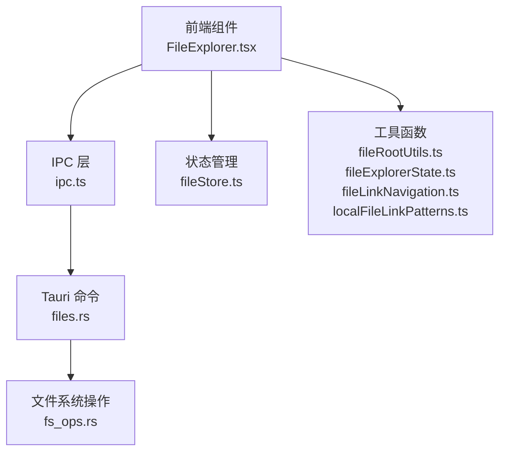
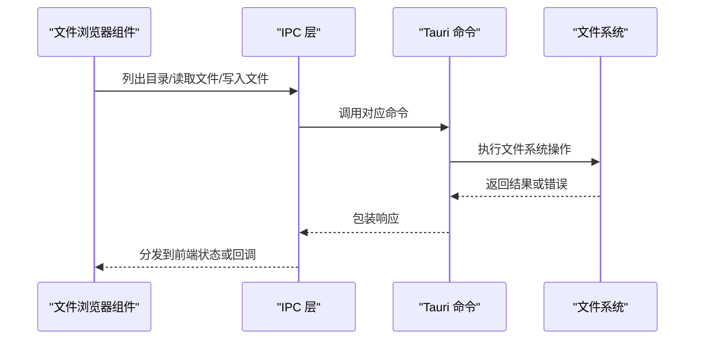
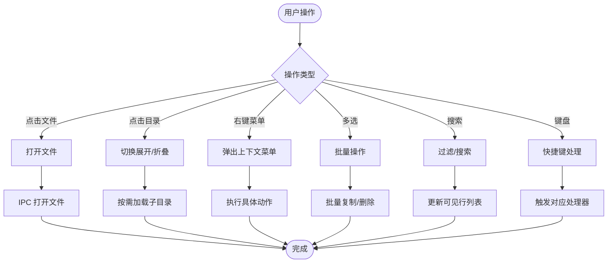
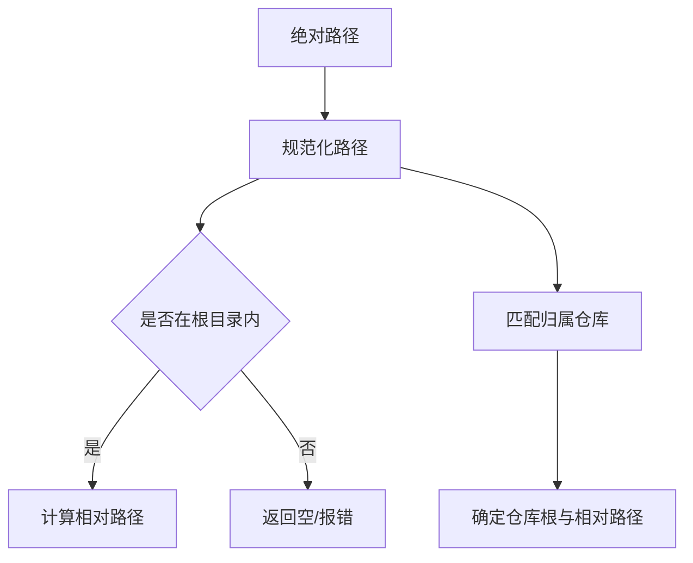
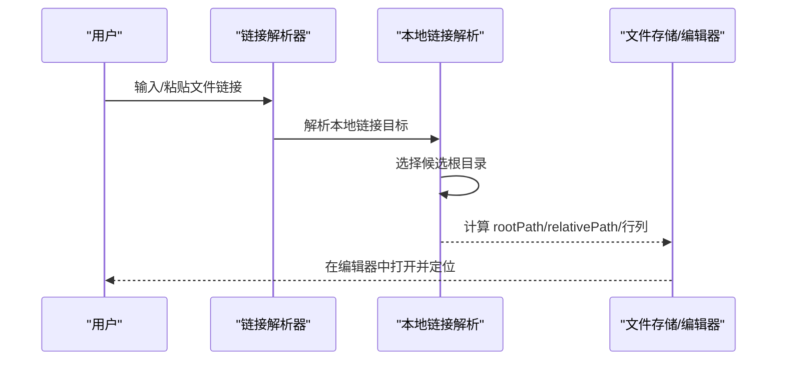
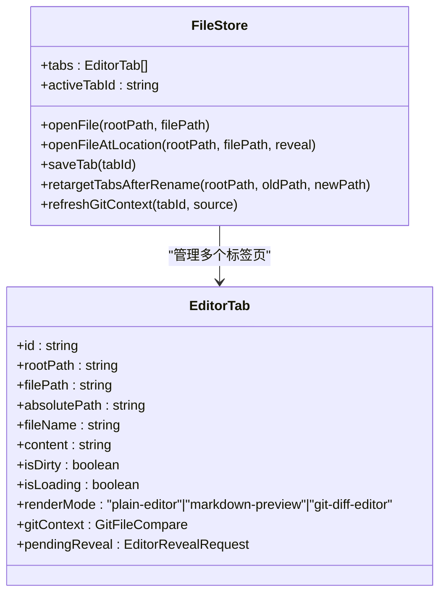
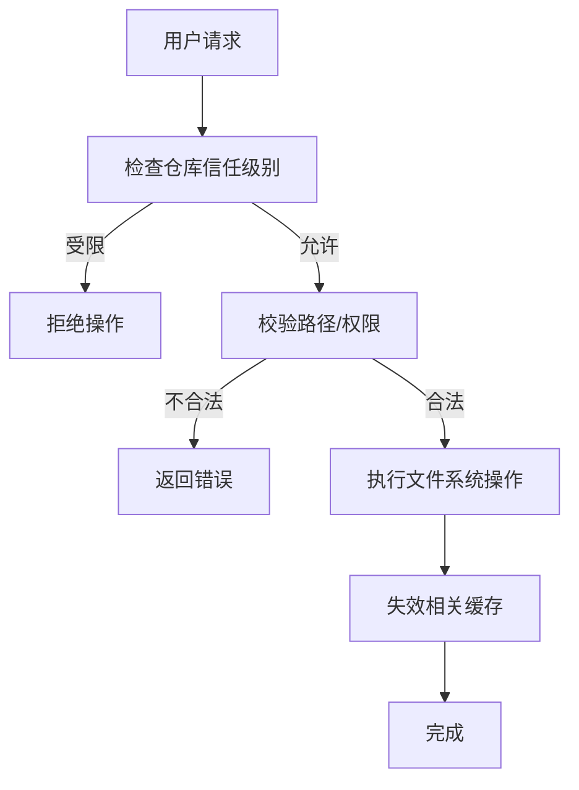
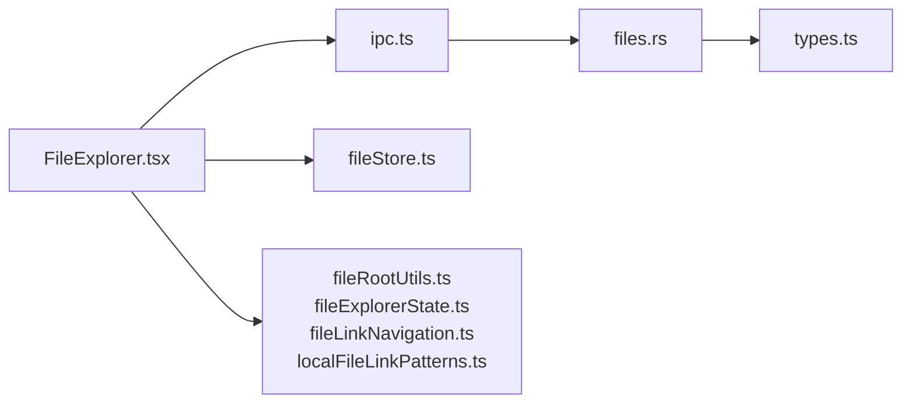

# 文件管理

<cite>
**本文档引用的文件**
- [FileExplorer.tsx](file://src/components/editor/FileExplorer.tsx)
- [fileExplorerState.ts](file://src/components/editor/fileExplorerState.ts)
- [fileRootUtils.ts](file://src/lib/fileRootUtils.ts)
- [fileLinkNavigation.ts](file://src/lib/fileLinkNavigation.ts)
- [localFileLinkPatterns.ts](file://src/lib/localFileLinkPatterns.ts)
- [fileStore.ts](file://src/stores/fileStore.ts)
- [ipc.ts](file://src/lib/ipc.ts)
- [files.rs](file://src-tauri/src/commands/files.rs)
- [types.ts](file://src/types.ts)
</cite>

## 目录
1. [简介](#简介)
2. [项目结构](#项目结构)
3. [核心组件](#核心组件)
4. [架构总览](#架构总览)
5. [详细组件分析](#详细组件分析)
6. [依赖关系分析](#依赖关系分析)
7. [性能考虑](#性能考虑)
8. [故障排除指南](#故障排除指南)
9. [结论](#结论)

## 简介
本文件管理功能文档聚焦于文件浏览器组件的实现与使用，涵盖文件树结构构建、文件类型识别、目录展开/折叠、文件搜索与过滤、文件根目录管理、文件引用解析与链接导航、文件状态管理与缓存策略、权限检查与安全文件操作、以及拖拽、右键菜单、批量操作等交互功能。同时提供文件系统集成的最佳实践与性能优化建议。

## 项目结构
文件管理功能主要由前端 React 组件与后端 Tauri 命令组成，并通过 IPC 进行通信。前端负责 UI 渲染、用户交互与状态管理；后端负责文件系统读写、路径解析与权限校验；两者共同实现安全、高效的文件浏览体验。

**图表来源**
- [FileExplorer.tsx:173-1895](file://src/components/editor/FileExplorer.tsx#L173-L1895)
- [ipc.ts:72-627](file://src/lib/ipc.ts#L72-L627)
- [files.rs:18-914](file://src-tauri/src/commands/files.rs#L18-L914)
- [fileStore.ts:200-551](file://src/stores/fileStore.ts#L200-L551)
- [fileRootUtils.ts:1-129](file://src/lib/fileRootUtils.ts#L1-L129)
- [fileExplorerState.ts:1-103](file://src/components/editor/fileExplorerState.ts#L1-L103)
- [fileLinkNavigation.ts:1-242](file://src/lib/fileLinkNavigation.ts#L1-L242)
- [localFileLinkPatterns.ts:1-297](file://src/lib/localFileLinkPatterns.ts#L1-L297)

**章节来源**
- [FileExplorer.tsx:173-1895](file://src/components/editor/FileExplorer.tsx#L173-L1895)
- [ipc.ts:72-627](file://src/lib/ipc.ts#L72-L627)
- [files.rs:18-914](file://src-tauri/src/commands/files.rs#L18-L914)

## 核心组件
- 文件浏览器组件：负责渲染文件树、处理用户交互（点击、右键、键盘快捷键）、执行文件操作（打开、新建、重命名、删除）。
- 状态管理：集中管理打开的文件标签页、当前激活标签、渲染模式、内容与脏状态等。
- 工具函数：提供路径规范化、根目录判断、相对路径解析、文件引用匹配与解析等能力。
- IPC 层：封装与后端的通信接口，暴露列出目录、读取/写入文件、创建/删除/重命名路径等命令。
- 后端命令：实现文件系统操作、权限校验、信任级别检查与缓存失效。

**章节来源**
- [FileExplorer.tsx:173-1895](file://src/components/editor/FileExplorer.tsx#L173-L1895)
- [fileStore.ts:168-551](file://src/stores/fileStore.ts#L168-L551)
- [fileRootUtils.ts:1-129](file://src/lib/fileRootUtils.ts#L1-L129)
- [fileExplorerState.ts:1-103](file://src/components/editor/fileExplorerState.ts#L1-L103)
- [fileLinkNavigation.ts:1-242](file://src/lib/fileLinkNavigation.ts#L1-L242)
- [localFileLinkPatterns.ts:1-297](file://src/lib/localFileLinkPatterns.ts#L1-L297)
- [ipc.ts:72-627](file://src/lib/ipc.ts#L72-L627)
- [files.rs:18-914](file://src-tauri/src/commands/files.rs#L18-L914)

## 架构总览
文件管理采用“前端渲染 + IPC 调用 + 后端命令”的分层架构。前端负责 UI 与交互，IPC 封装跨进程调用，后端命令负责实际的文件系统操作与安全控制。

**图表来源**
- [FileExplorer.tsx:255-289](file://src/components/editor/FileExplorer.tsx#L255-L289)
- [ipc.ts:441-512](file://src/lib/ipc.ts#L441-L512)
- [files.rs:19-37](file://src-tauri/src/commands/files.rs#L19-L37)

## 详细组件分析

### 文件浏览器组件（FileExplorer）
- 文件树结构与虚拟化
  - 使用扁平化的可见行数组，结合虚拟化窗口仅渲染可视区域，提升大目录加载性能。
  - 支持按深度缩进显示目录层级，展开/折叠时按需加载子目录。
- 文件类型识别
  - 基于扩展名映射颜色，辅助视觉区分不同类型的文件。
- 搜索与过滤
  - 支持工作区范围的文件搜索与本地过滤，具备防抖与计数提示。
- 用户交互
  - 右键菜单支持打开、复制路径、在默认应用中打开、在资源管理器中定位、重命名、删除等。
  - 多选支持 Ctrl/Cmd + 点击、Shift + 点击选择范围，支持批量复制与删除。
  - 键盘快捷键：F2 重命名、Delete/Backspace 删除、Cmd/Ctrl + C 复制、Cmd/Ctrl + A 全选。
- 安全与权限
  - 写入、创建、删除、重命名等操作均通过 IPC 调用后端命令，后端进行信任级别检查与路径校验。

**图表来源**
- [FileExplorer.tsx:568-577](file://src/components/editor/FileExplorer.tsx#L568-L577)
- [FileExplorer.tsx:529-562](file://src/components/editor/FileExplorer.tsx#L529-L562)
- [FileExplorer.tsx:1203-1231](file://src/components/editor/FileExplorer.tsx#L1203-L1231)
- [FileExplorer.tsx:1155-1197](file://src/components/editor/FileExplorer.tsx#L1155-L1197)
- [FileExplorer.tsx:1369-1387](file://src/components/editor/FileExplorer.tsx#L1369-L1387)
- [FileExplorer.tsx:1237-1311](file://src/components/editor/FileExplorer.tsx#L1237-L1311)

**章节来源**
- [FileExplorer.tsx:173-1895](file://src/components/editor/FileExplorer.tsx#L173-L1895)

### 文件根目录管理与路径解析
- 根目录与工作区绑定：每个工作区有唯一根目录，所有文件操作基于该根目录进行。
- 路径规范化与比较：统一斜杠、大小写敏感性处理、UNC 路径与 Windows 驱动器路径识别。
- 相对路径解析：从绝对路径推导相对路径，用于 UI 显示与跨模块共享。
- 归属仓库解析：根据绝对路径确定归属仓库，便于后续 Git 上下文与权限判断。

**图表来源**
- [fileRootUtils.ts:28-129](file://src/lib/fileRootUtils.ts#L28-L129)

**章节来源**
- [fileRootUtils.ts:1-129](file://src/lib/fileRootUtils.ts#L1-L129)

### 文件引用解析与链接导航
- 文本链接匹配：识别本地文件链接语法（绝对/相对路径、URL），支持行号/列号定位。
- 本地链接解析：优先匹配当前工作区根，其次匹配活动/非活动仓库根，最后回退到工作区根。
- 导航行为：支持在编辑器中打开指定行/列，或在外部应用中打开。

**图表来源**
- [fileLinkNavigation.ts:118-176](file://src/lib/fileLinkNavigation.ts#L118-L176)
- [localFileLinkPatterns.ts:90-297](file://src/lib/localFileLinkPatterns.ts#L90-L297)

**章节来源**
- [fileLinkNavigation.ts:1-242](file://src/lib/fileLinkNavigation.ts#L1-L242)
- [localFileLinkPatterns.ts:1-297](file://src/lib/localFileLinkPatterns.ts#L1-L297)

### 文件状态管理与缓存策略
- 标签页状态：集中维护打开的文件标签页、渲染模式、内容、脏状态、Git 对比上下文等。
- 内容同步：打开文件时读取内容，保存时对比磁盘状态，必要时提示外部修改。
- 缓存失效：文件系统变更后，通过后端命令使缓存失效，确保下次访问获取最新数据。
- Git 集成：支持 Git 差异对比视图，刷新时重新获取差异内容。

**图表来源**
- [fileStore.ts:168-551](file://src/stores/fileStore.ts#L168-L551)

**章节来源**
- [fileStore.ts:1-551](file://src/stores/fileStore.ts#L1-L551)

### 权限检查与安全文件操作
- 信任级别检查：写入、创建、删除、重命名等用户发起的操作会检查仓库信任级别，受限仓库需要提升信任级别。
- 路径遍历防护：严格校验目标路径，防止越权访问与路径遍历攻击。
- 缓存一致性：每次文件系统变更后，使包含该路径的缓存失效，避免脏读。

**图表来源**
- [files.rs:67-107](file://src-tauri/src/commands/files.rs#L67-L107)
- [files.rs:110-142](file://src-tauri/src/commands/files.rs#L110-L142)
- [files.rs:180-213](file://src-tauri/src/commands/files.rs#L180-L213)
- [files.rs:215-248](file://src-tauri/src/commands/files.rs#L215-L248)

**章节来源**
- [files.rs:18-914](file://src-tauri/src/commands/files.rs#L18-L914)

### 交互功能：拖拽、右键菜单、批量操作
- 右键菜单：根据选中项类型（文件/目录/多选/空白处）动态生成菜单项，支持打开、复制路径、在默认应用中打开、在资源管理器中定位、重命名、删除等。
- 批量操作：多选状态下显示操作栏，支持批量复制路径与批量删除。
- 键盘快捷键：F2 重命名、Delete/Backspace 删除、Cmd/Ctrl + C 复制、Cmd/Ctrl + A 全选。

**章节来源**
- [FileExplorer.tsx:832-896](file://src/components/editor/FileExplorer.tsx#L832-L896)
- [FileExplorer.tsx:1155-1197](file://src/components/editor/FileExplorer.tsx#L1155-L1197)
- [FileExplorer.tsx:1203-1231](file://src/components/editor/FileExplorer.tsx#L1203-L1231)
- [FileExplorer.tsx:1237-1311](file://src/components/editor/FileExplorer.tsx#L1237-L1311)

## 依赖关系分析
- 组件耦合
  - FileExplorer 依赖 IPC 层进行文件系统操作，依赖状态管理进行标签页与渲染模式控制。
  - 工具函数为路径解析与链接解析提供基础能力，被多个模块复用。
- 外部依赖
  - Tauri 命令提供文件系统操作与事件监听。
  - 类型定义统一前后端数据结构。

**图表来源**
- [FileExplorer.tsx:1-50](file://src/components/editor/FileExplorer.tsx#L1-L50)
- [ipc.ts:1-70](file://src/lib/ipc.ts#L1-L70)
- [files.rs:1-16](file://src-tauri/src/commands/files.rs#L1-L16)
- [types.ts:1-1297](file://src/types.ts#L1-L1297)

**章节来源**
- [FileExplorer.tsx:1-50](file://src/components/editor/FileExplorer.tsx#L1-L50)
- [ipc.ts:1-70](file://src/lib/ipc.ts#L1-L70)
- [files.rs:1-16](file://src-tauri/src/commands/files.rs#L1-L16)
- [types.ts:1-1297](file://src/types.ts#L1-L1297)

## 性能考虑
- 虚拟化渲染：当行数超过阈值时启用虚拟化，仅渲染可视区域，显著降低 DOM 节点数量。
- 按需加载：目录展开时才加载子项，减少初始渲染压力。
- 防抖搜索：工作区文件搜索具备防抖与限制条数，避免频繁查询。
- 缓存失效：文件系统变更后及时失效缓存，保证一致性的同时减少重复 IO。
- 大文件处理：二进制文件以纯文本编辑器打开，避免大文件解析开销。

[本节为通用指导，无需特定文件引用]

## 故障排除指南
- 打开文件失败
  - 检查文件是否存在与可读性；查看错误提示并确认路径是否在工作区根内。
  - 若文件被外部修改，保存前会提示，按提示处理后重试。
- 删除失败
  - 确认目标路径未被占用且具有写权限；多选删除时注意包含关系，系统会自动去重。
- 重命名失败
  - 检查新名称是否已存在或非法；确认目标路径在工作区内。
- 右键菜单不显示
  - 确保未在输入框内触发；点击树背景空白处可打开“空白”菜单。
- 快捷键无效
  - 确认未处于重命名/新建输入状态；检查是否正确按下修饰键。

**章节来源**
- [fileStore.ts:501-549](file://src/stores/fileStore.ts#L501-L549)
- [FileExplorer.tsx:1053-1110](file://src/components/editor/FileExplorer.tsx#L1053-L1110)
- [FileExplorer.tsx:920-970](file://src/components/editor/FileExplorer.tsx#L920-L970)

## 结论
文件管理功能通过清晰的分层架构与完善的工具链，实现了高效、安全、易用的文件浏览体验。前端负责交互与渲染，IPC 提供稳定通信，后端负责安全与一致性保障。配合路径解析、引用解析、权限检查与缓存策略，能够满足复杂工程场景下的文件管理需求。