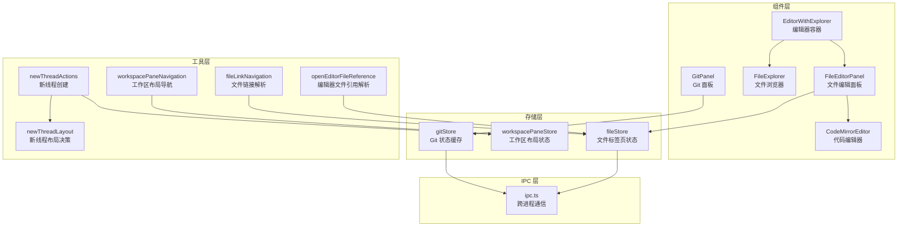
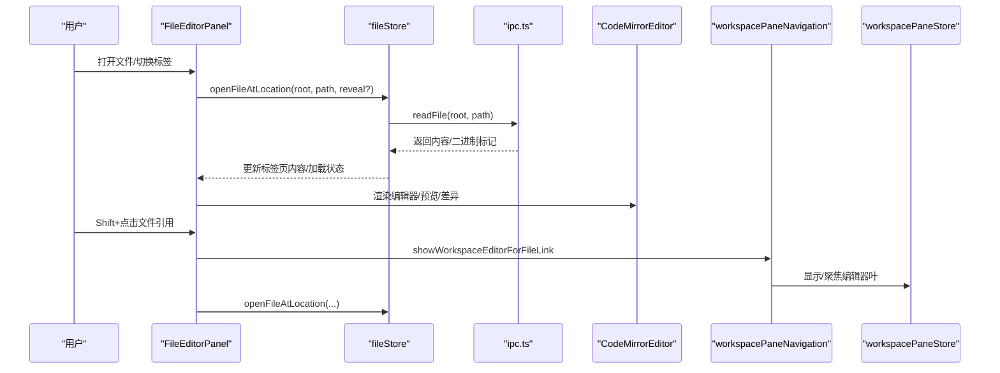
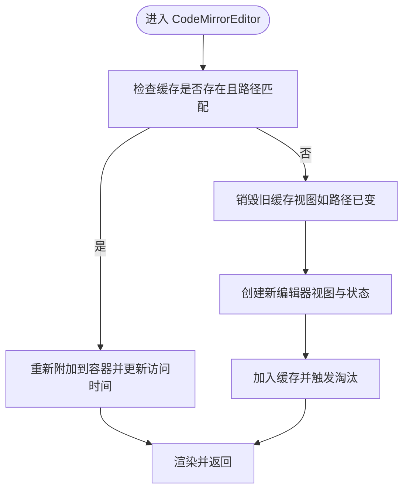
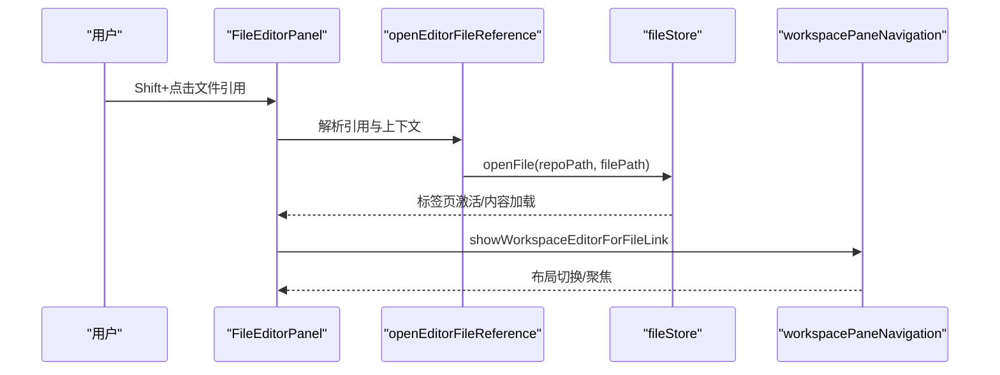
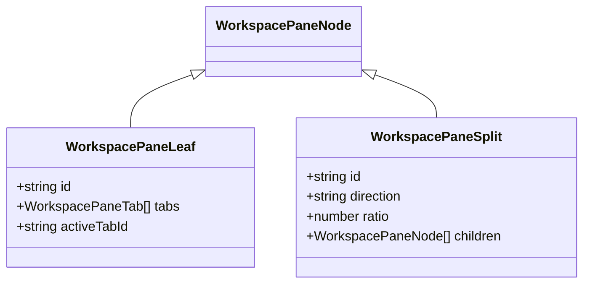
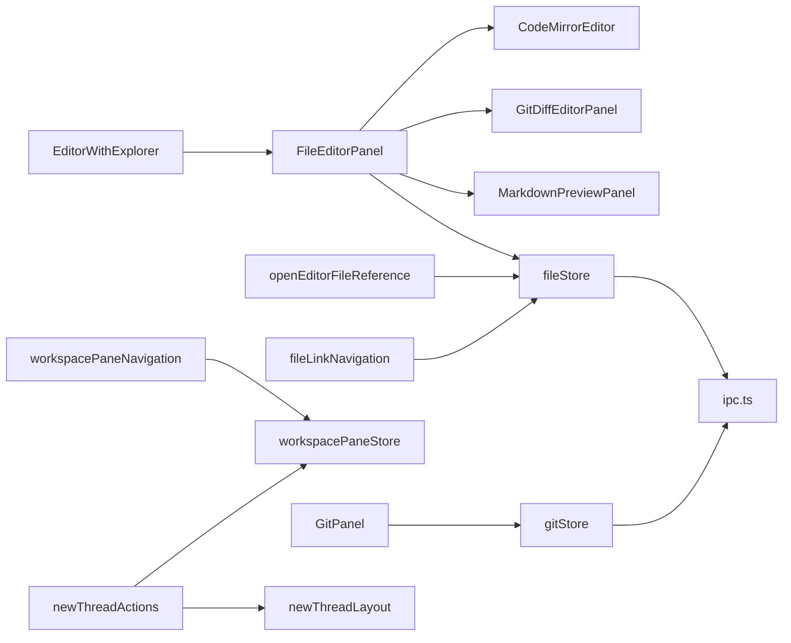

# 编辑器集成

<cite>
**本文档引用的文件**
- [EditorWithExplorer.tsx](file://src/components/editor/EditorWithExplorer.tsx)
- [FileEditorPanel.tsx](file://src/components/editor/FileEditorPanel.tsx)
- [CodeMirrorEditor.tsx](file://src/components/editor/CodeMirrorEditor.tsx)
- [openEditorFileReference.ts](file://src/lib/openEditorFileReference.ts)
- [fileLinkNavigation.ts](file://src/lib/fileLinkNavigation.ts)
- [ipc.ts](file://src/lib/ipc.ts)
- [fileStore.ts](file://src/stores/fileStore.ts)
- [workspacePaneStore.ts](file://src/stores/workspacePaneStore.ts)
- [workspacePaneNavigation.ts](file://src/lib/workspacePaneNavigation.ts)
- [newThreadActions.ts](file://src/lib/newThreadActions.ts)
- [newThreadLayout.ts](file://src/lib/newThreadLayout.ts)
- [GitPanel.tsx](file://src/components/git/GitPanel.tsx)
- [gitStore.ts](file://src/stores/gitStore.ts)
</cite>

## 目录
1. [简介](#简介)
2. [项目结构](#项目结构)
3. [核心组件](#核心组件)
4. [架构总览](#架构总览)
5. [详细组件分析](#详细组件分析)
6. [依赖关系分析](#依赖关系分析)
7. [性能考量](#性能考量)
8. [故障排除指南](#故障排除指南)
9. [结论](#结论)
10. [附录](#附录)

## 简介
本文件系统性阐述编辑器在 Panes 应用中的集成方案，覆盖与工作空间、聊天功能、Git 集成的协作机制；重点说明文件引用打开、编辑器嵌入、多窗口布局管理、状态传递；解释新线程创建、文件上下文传递、编辑器初始化流程；并给出生命周期管理、资源清理、错误处理策略、最佳实践与性能优化建议。

## 项目结构
编辑器相关代码主要分布在以下模块：
- 组件层：编辑器容器与面板、代码编辑器、文件浏览器、Git 面板
- 存储层：文件标签页状态、工作区布局状态、Git 状态缓存
- 工具层：文件链接解析、编辑器文件引用解析、工作区布局导航、新线程创建
- IPC 层：与后端（Tauri）通信，读写文件、Git 操作、线程与引擎交互

图表来源
- [EditorWithExplorer.tsx:1-124](file://src/components/editor/EditorWithExplorer.tsx#L1-L124)
- [FileEditorPanel.tsx:1-358](file://src/components/editor/FileEditorPanel.tsx#L1-L358)
- [CodeMirrorEditor.tsx:1-516](file://src/components/editor/CodeMirrorEditor.tsx#L1-L516)
- [fileStore.ts:1-551](file://src/stores/fileStore.ts#L1-L551)
- [workspacePaneStore.ts:1-696](file://src/stores/workspacePaneStore.ts#L1-L696)
- [gitStore.ts:1-1132](file://src/stores/gitStore.ts#L1-L1132)
- [openEditorFileReference.ts:1-51](file://src/lib/openEditorFileReference.ts#L1-L51)
- [fileLinkNavigation.ts:1-242](file://src/lib/fileLinkNavigation.ts#L1-L242)
- [workspacePaneNavigation.ts:1-139](file://src/lib/workspacePaneNavigation.ts#L1-L139)
- [newThreadActions.ts:1-52](file://src/lib/newThreadActions.ts#L1-L52)
- [newThreadLayout.ts:1-11](file://src/lib/newThreadLayout.ts#L1-L11)
- [GitPanel.tsx:1-864](file://src/components/git/GitPanel.tsx#L1-L864)
- [ipc.ts:1-813](file://src/lib/ipc.ts#L1-L813)

章节来源
- [EditorWithExplorer.tsx:1-124](file://src/components/editor/EditorWithExplorer.tsx#L1-L124)
- [FileEditorPanel.tsx:1-358](file://src/components/editor/FileEditorPanel.tsx#L1-L358)
- [CodeMirrorEditor.tsx:1-516](file://src/components/editor/CodeMirrorEditor.tsx#L1-L516)
- [fileStore.ts:1-551](file://src/stores/fileStore.ts#L1-L551)
- [workspacePaneStore.ts:1-696](file://src/stores/workspacePaneStore.ts#L1-L696)
- [gitStore.ts:1-1132](file://src/stores/gitStore.ts#L1-L1132)
- [openEditorFileReference.ts:1-51](file://src/lib/openEditorFileReference.ts#L1-L51)
- [fileLinkNavigation.ts:1-242](file://src/lib/fileLinkNavigation.ts#L1-L242)
- [workspacePaneNavigation.ts:1-139](file://src/lib/workspacePaneNavigation.ts#L1-L139)
- [newThreadActions.ts:1-52](file://src/lib/newThreadActions.ts#L1-L52)
- [newThreadLayout.ts:1-11](file://src/lib/newThreadLayout.ts#L1-L11)
- [GitPanel.tsx:1-864](file://src/components/git/GitPanel.tsx#L1-L864)
- [ipc.ts:1-813](file://src/lib/ipc.ts#L1-L813)

## 核心组件
- 编辑器容器与布局
  - EditorWithExplorer：负责可拖拽调整宽度的文件浏览器与编辑器区域组合，支持嵌入模式与本地持久化宽度。
  - FileEditorPanel：管理标签页集合、渲染模式切换（纯编辑器/Markdown 预览/Git Diff）、保存与关闭流程、快捷键处理。
  - CodeMirrorEditor：基于 CodeMirror 的高性能编辑器，实现语言高亮、搜索、历史记录、只读切换、增量更新与 LRU 缓存。
- 文件与链接导航
  - openEditorFileReference：解析编辑器内的文件引用（Shift+点击），定位仓库与路径，打开文件并切换到编辑器布局。
  - fileLinkNavigation：解析文本中的本地/外部链接，支持相对/绝对路径、行列跳转、跨仓库与工作区根路径解析。
- 工作区与多窗口
  - workspacePaneStore：树形布局节点（叶子/分割），支持激活表面、分裂、关闭、比例调整等，持久化到 localStorage。
  - workspacePaneNavigation：根据当前布局模式与事件源，决定是否在现有编辑器叶或新建叶中打开文件。
- Git 集成
  - GitPanel：变更、分支、提交、Stash、Worktree 视图，监听仓库变化事件，自动刷新。
  - gitStore：Git 状态缓存（按仓库修订号、TTL、字节限制），并发去重，远程同步状态跟踪。
- 聊天与线程
  - newThreadActions/newThreadLayout：根据当前布局模式决定新线程目标布局（chat/split/editor），切换视图与工作区布局。

章节来源
- [EditorWithExplorer.tsx:1-124](file://src/components/editor/EditorWithExplorer.tsx#L1-L124)
- [FileEditorPanel.tsx:1-358](file://src/components/editor/FileEditorPanel.tsx#L1-L358)
- [CodeMirrorEditor.tsx:1-516](file://src/components/editor/CodeMirrorEditor.tsx#L1-L516)
- [openEditorFileReference.ts:1-51](file://src/lib/openEditorFileReference.ts#L1-L51)
- [fileLinkNavigation.ts:1-242](file://src/lib/fileLinkNavigation.ts#L1-L242)
- [workspacePaneStore.ts:1-696](file://src/stores/workspacePaneStore.ts#L1-L696)
- [workspacePaneNavigation.ts:1-139](file://src/lib/workspacePaneNavigation.ts#L1-L139)
- [GitPanel.tsx:1-864](file://src/components/git/GitPanel.tsx#L1-L864)
- [gitStore.ts:1-1132](file://src/stores/gitStore.ts#L1-L1132)
- [newThreadActions.ts:1-52](file://src/lib/newThreadActions.ts#L1-L52)
- [newThreadLayout.ts:1-11](file://src/lib/newThreadLayout.ts#L1-L11)

## 架构总览
编辑器集成围绕“文件上下文—标签页状态—布局—渲染器”展开，通过 IPC 与后端交互，结合 Git 状态与聊天线程上下文，形成统一的工作空间体验。

图表来源
- [FileEditorPanel.tsx:173-273](file://src/components/editor/FileEditorPanel.tsx#L173-L273)
- [fileStore.ts:209-273](file://src/stores/fileStore.ts#L209-L273)
- [ipc.ts:498-513](file://src/lib/ipc.ts#L498-L513)
- [workspacePaneNavigation.ts:46-96](file://src/lib/workspacePaneNavigation.ts#L46-L96)
- [workspacePaneStore.ts:568-592](file://src/stores/workspacePaneStore.ts#L568-L592)

## 详细组件分析

### 编辑器容器与布局（EditorWithExplorer）
- 可拖拽调整文件浏览器宽度，使用 localStorage 持久化，支持最小/最大宽度约束与点击收起。
- 延迟加载文件浏览器与编辑器面板，减少初始渲染压力。
- 支持嵌入模式（embedded），用于内联编辑场景。

章节来源
- [EditorWithExplorer.tsx:15-124](file://src/components/editor/EditorWithExplorer.tsx#L15-L124)

### 文件编辑面板（FileEditorPanel）
- 标签页管理：激活、切换、关闭、脏状态提示、确认关闭对话框。
- 渲染模式：纯编辑器、Markdown 预览、Git Diff；根据文件类型与上下文动态切换。
- 快捷键：Cmd+S 保存（嵌入模式下受终端布局限制）。
- 外部应用打开：调用默认应用打开当前文件。
- Git 差异视图：在当前仓库上下文中打开文件的差异视图，并支持返回普通编辑器。

章节来源
- [FileEditorPanel.tsx:25-358](file://src/components/editor/FileEditorPanel.tsx#L25-L358)

### 代码编辑器（CodeMirrorEditor）
- 编辑器缓存：LRU 策略，限制数量与内存字节数，断开 DOM 但不销毁实例，提升切换性能。
- 语言扩展：按文件扩展名动态加载语言高亮与语法支持。
- 搜索与历史：内置搜索面板、撤销/重做、折叠、行号、活动行高亮。
- 行为同步：外部内容变更时安全同步，避免循环更新；支持行列跳转与滚动居中。

图表来源
- [CodeMirrorEditor.tsx:254-439](file://src/components/editor/CodeMirrorEditor.tsx#L254-L439)

章节来源
- [CodeMirrorEditor.tsx:1-516](file://src/components/editor/CodeMirrorEditor.tsx#L1-L516)

### 文件引用与链接导航
- 编辑器文件引用：Shift+点击，解析工作区、仓库、当前目录，定位文件并打开。
- 文本链接解析：支持本地/外部链接、相对/绝对路径、行列跳转；按仓库优先级排序匹配根路径。
- 打开行为：定位后显示编辑器，必要时分裂布局并在目标叶中聚焦。

图表来源
- [openEditorFileReference.ts:15-38](file://src/lib/openEditorFileReference.ts#L15-L38)
- [fileStore.ts:209-273](file://src/stores/fileStore.ts#L209-L273)
- [workspacePaneNavigation.ts:46-96](file://src/lib/workspacePaneNavigation.ts#L46-L96)

章节来源
- [openEditorFileReference.ts:1-51](file://src/lib/openEditorFileReference.ts#L1-L51)
- [fileLinkNavigation.ts:118-242](file://src/lib/fileLinkNavigation.ts#L118-L242)

### 工作区布局与多窗口管理
- 布局模型：叶子（含多个表面标签）与分割节点构成二叉树，支持水平/垂直分割、比例调整、焦点叶管理。
- 表面种类：chat/terminal/editor 及扩展类型；同一叶内可切换表面。
- 生命周期：确保工作区存在、持久化布局、按需重建；关闭叶时回退到默认布局。
- 与终端布局同步：工作区布局模式变化时同步到终端存储，保持一致性。

图表来源
- [workspacePaneStore.ts:10-36](file://src/stores/workspacePaneStore.ts#L10-L36)

章节来源
- [workspacePaneStore.ts:1-696](file://src/stores/workspacePaneStore.ts#L1-L696)
- [workspacePaneNavigation.ts:12-139](file://src/lib/workspacePaneNavigation.ts#L12-L139)

### Git 集成
- GitPanel：多视图（变更、分支、提交、Stash、Worktree），支持仓库选择、远程同步、软回滚等。
- gitStore：状态缓存（TTL/条目/字节限制）、并发去重、活跃视图刷新节流、远程同步状态跟踪。
- 事件驱动：监听仓库变化事件，自动刷新；轮询工作树变更，保证实时性。

章节来源
- [GitPanel.tsx:1-864](file://src/components/git/GitPanel.tsx#L1-L864)
- [gitStore.ts:1-1132](file://src/stores/gitStore.ts#L1-L1132)
- [ipc.ts:661-665](file://src/lib/ipc.ts#L661-L665)

### 聊天与新线程创建
- newThreadActions：根据当前布局模式决定目标布局（chat/split/editor），设置活动视图与仓库，创建线程并激活。
- newThreadLayout：提供布局模式决策逻辑，避免终端/拆分模式下丢失编辑器空间。

章节来源
- [newThreadActions.ts:13-51](file://src/lib/newThreadActions.ts#L13-L51)
- [newThreadLayout.ts:3-10](file://src/lib/newThreadLayout.ts#L3-L10)

## 依赖关系分析
- 组件依赖
  - EditorWithExplorer 依赖 FileExplorer 与 FileEditorPanel；FileEditorPanel 依赖 CodeMirrorEditor、GitDiffEditorPanel、MarkdownPreviewPanel。
  - GitPanel 依赖 gitStore；FileEditorPanel 依赖 fileStore。
- 存储依赖
  - fileStore 依赖 ipc 读写文件与 Git 比较；workspacePaneStore 独立管理布局；gitStore 独立管理 Git 缓存。
- 工具依赖
  - openEditorFileReference 与 fileLinkNavigation 依赖 fileStore 与 workspacePaneNavigation；workspacePaneNavigation 依赖 workspacePaneStore 与 terminalStore 的布局模式同步。

图表来源
- [EditorWithExplorer.tsx:1-124](file://src/components/editor/EditorWithExplorer.tsx#L1-L124)
- [FileEditorPanel.tsx:1-358](file://src/components/editor/FileEditorPanel.tsx#L1-L358)
- [CodeMirrorEditor.tsx:1-516](file://src/components/editor/CodeMirrorEditor.tsx#L1-L516)
- [openEditorFileReference.ts:1-51](file://src/lib/openEditorFileReference.ts#L1-L51)
- [fileLinkNavigation.ts:1-242](file://src/lib/fileLinkNavigation.ts#L1-L242)
- [workspacePaneNavigation.ts:1-139](file://src/lib/workspacePaneNavigation.ts#L1-L139)
- [workspacePaneStore.ts:1-696](file://src/stores/workspacePaneStore.ts#L1-L696)
- [GitPanel.tsx:1-864](file://src/components/git/GitPanel.tsx#L1-L864)
- [gitStore.ts:1-1132](file://src/stores/gitStore.ts#L1-L1132)
- [newThreadActions.ts:1-52](file://src/lib/newThreadActions.ts#L1-L52)
- [newThreadLayout.ts:1-11](file://src/lib/newThreadLayout.ts#L1-L11)
- [ipc.ts:1-813](file://src/lib/ipc.ts#L1-L813)

章节来源
- 同上

## 性能考量
- 编辑器缓存
  - LRU 限制数量与内存字节数，断开 DOM 但保留实例，显著降低频繁切换的创建/销毁成本。
  - 文档大小估算与淘汰策略，避免内存膨胀。
- Git 状态缓存
  - 按仓库修订号与 TTL 控制缓存有效性，限制条目数与字节数，主动淘汰最久未访问项。
  - 并发请求去重，避免重复网络请求。
- 布局持久化
  - 使用 localStorage 存储布局，启动时恢复，减少重建成本。
- 渲染优化
  - 懒加载组件（Suspense），延迟初始化非关键模块。
  - 外部内容同步时避免循环更新，仅在必要时 dispatch。

章节来源
- [CodeMirrorEditor.tsx:256-284](file://src/components/editor/CodeMirrorEditor.tsx#L256-L284)
- [gitStore.ts:103-181](file://src/stores/gitStore.ts#L103-L181)
- [workspacePaneStore.ts:375-410](file://src/stores/workspacePaneStore.ts#L375-L410)

## 故障排除指南
- 无法打开文件引用
  - 检查工作区 ID 是否有效；确认引用格式与上下文（仓库、当前目录）是否正确。
  - 若解析失败，前端会提示警告并保持当前视图。
- 文件保存冲突
  - 若文件被外部修改，保存前进行校验，提示“外部修改”，随后以磁盘内容为准更新标签页。
  - 保存失败时弹出错误提示，不影响编辑器可用性。
- Git 面板无响应
  - 确认已监听仓库变化事件并启用轮询；检查网络/权限导致的请求失败。
  - 远程同步期间会显示同步状态，完成后自动刷新。
- 布局异常
  - 若布局未恢复，尝试手动切换一次布局模式，触发持久化写入。
  - 关闭叶后若为空，将回退到默认布局。

章节来源
- [openEditorFileReference.ts:19-38](file://src/lib/openEditorFileReference.ts#L19-L38)
- [fileStore.ts:501-549](file://src/stores/fileStore.ts#L501-L549)
- [GitPanel.tsx:387-418](file://src/components/git/GitPanel.tsx#L387-L418)
- [workspacePaneStore.ts:477-486](file://src/stores/workspacePaneStore.ts#L477-L486)

## 结论
该编辑器集成方案通过清晰的组件边界、完善的存储与缓存策略、以及与 Git 和聊天系统的深度协同，实现了高效、稳定、可扩展的多窗口编辑体验。借助 IPC 抽象与事件驱动刷新，系统在复杂工作空间中仍能保持流畅与一致。

## 附录
- 最佳实践
  - 在需要时使用“编辑器文件引用”快速打开文件，避免手动浏览。
  - 利用 Markdown 预览与 Git Diff 视图提高审阅效率。
  - 合理使用布局分裂与焦点叶管理，最大化编辑器可见区域。
  - 定期清理大文件或临时文件，避免编辑器缓存占用过高。
- 错误处理策略
  - 解析失败、保存失败、网络异常均提供用户提示，不中断主流程。
  - Git 刷新失败不影响编辑器使用，后续可重试或手动刷新。
- 性能优化建议
  - 控制同时打开的标签页数量，避免超出编辑器缓存上限。
  - 对大型文件采用只读模式或外部应用打开，减少内存压力。
  - 合理配置 Git 缓存 TTL 与条目上限，平衡准确性与性能。