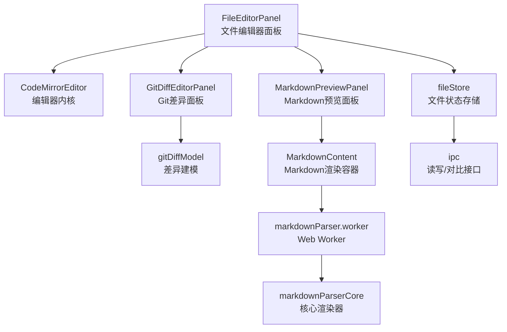
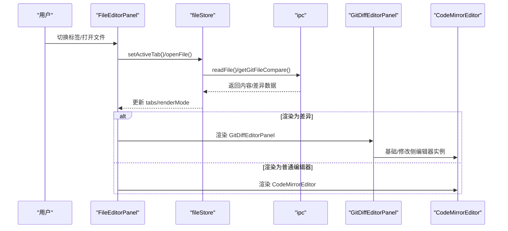
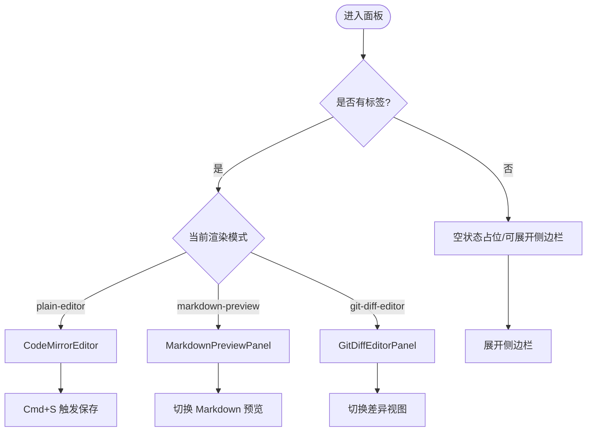
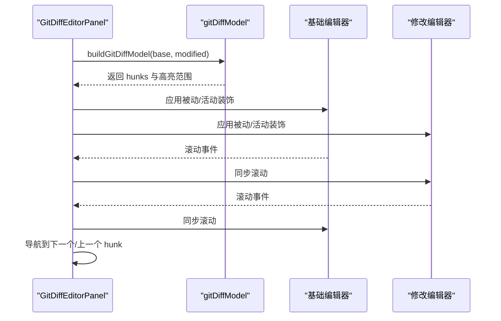
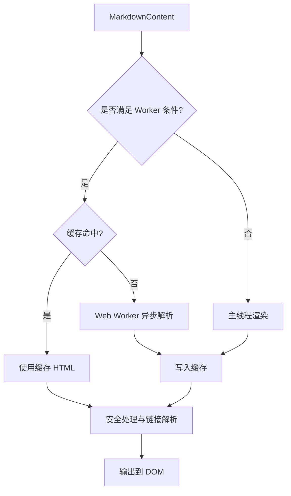
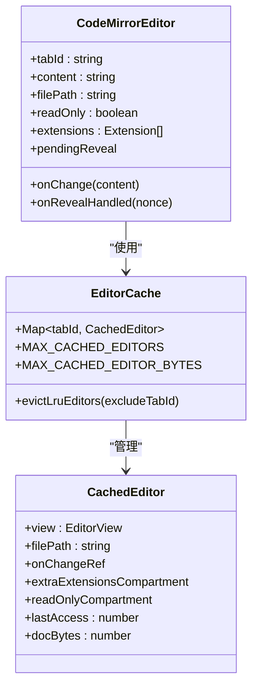
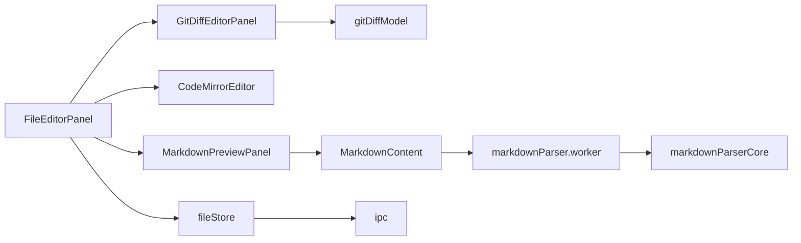

# 编辑器面板

<cite>
**本文引用的文件**
- [FileEditorPanel.tsx](file://src/components/editor/FileEditorPanel.tsx)
- [GitDiffEditorPanel.tsx](file://src/components/editor/GitDiffEditorPanel.tsx)
- [MarkdownPreviewPanel.tsx](file://src/components/editor/MarkdownPreviewPanel.tsx)
- [CodeMirrorEditor.tsx](file://src/components/editor/CodeMirrorEditor.tsx)
- [gitDiffModel.ts](file://src/components/editor/gitDiffModel.ts)
- [parseDiff.ts](file://src/lib/parseDiff.ts)
- [fileStore.ts](file://src/stores/fileStore.ts)
- [editorFileTypes.ts](file://src/lib/editorFileTypes.ts)
- [markdownParser.types.ts](file://src/workers/markdownParser.types.ts)
- [markdownParser.worker.ts](file://src/workers/markdownParser.worker.ts)
- [markdownParserCore.ts](file://src/workers/markdownParserCore.ts)
- [MarkdownContent.tsx](file://src/components/chat/MarkdownContent.tsx)
- [localFileLinkPatterns.ts](file://src/lib/localFileLinkPatterns.ts)
- [globals.css](file://src/globals.css)
- [types.ts](file://src/types.ts)
</cite>

## 目录
1. [简介](#简介)
2. [项目结构](#项目结构)
3. [核心组件](#核心组件)
4. [架构总览](#架构总览)
5. [详细组件分析](#详细组件分析)
6. [依赖关系分析](#依赖关系分析)
7. [性能考量](#性能考量)
8. [故障排查指南](#故障排查指南)
9. [结论](#结论)
10. [附录](#附录)

## 简介
本文件系统性阐述编辑器面板功能，覆盖文件编辑器面板、Git 差异编辑器面板与 Markdown 预览面板的实现细节。内容包含多标签页管理、面板切换、布局调整、状态同步机制；Git 差异显示、行号映射、变更高亮、冲突解决流程；Markdown 渲染、实时预览、滚动同步与图片加载优化策略；以及扩展开发、自定义渲染器与性能监控实践。

## 项目结构
编辑器相关模块主要位于 src/components/editor 与 src/workers 下，并通过 src/stores/fileStore 统一管理状态与生命周期。Markdown 渲染采用主进程外的 Web Worker 与核心解析器，确保大文档渲染不阻塞 UI。

图示来源
- [FileEditorPanel.tsx:1-358](file://src/components/editor/FileEditorPanel.tsx#L1-L358)
- [GitDiffEditorPanel.tsx:1-526](file://src/components/editor/GitDiffEditorPanel.tsx#L1-L526)
- [MarkdownPreviewPanel.tsx:1-19](file://src/components/editor/MarkdownPreviewPanel.tsx#L1-L19)
- [CodeMirrorEditor.tsx:1-516](file://src/components/editor/CodeMirrorEditor.tsx#L1-L516)
- [gitDiffModel.ts:1-298](file://src/components/editor/gitDiffModel.ts#L1-L298)
- [MarkdownContent.tsx:1-358](file://src/components/chat/MarkdownContent.tsx#L1-L358)
- [markdownParser.worker.ts:1-30](file://src/workers/markdownParser.worker.ts#L1-L30)
- [markdownParserCore.ts:1-373](file://src/workers/markdownParserCore.ts#L1-L373)
- [fileStore.ts:1-551](file://src/stores/fileStore.ts#L1-L551)

章节来源
- [FileEditorPanel.tsx:1-358](file://src/components/editor/FileEditorPanel.tsx#L1-L358)
- [fileStore.ts:1-551](file://src/stores/fileStore.ts#L1-L551)

## 核心组件
- 文件编辑器面板：负责标签页展示、切换、关闭、保存、打开外部应用、Markdown 预览切换、Git 差异视图切换等。
- Git 差异编辑器面板：双窗格对比（base 与 modified），基于差异模型进行行级高亮、活动块聚焦、滚动同步与导航。
- Markdown 预览面板：基于 MarkdownContent 的高性能渲染，支持缓存、Web Worker 异步解析与链接点击处理。
- CodeMirrorEditor：编辑器内核，支持语言高亮、语法高亮、搜索、历史、折叠、只读模式、行号、焦点缓存与 LRU 淘汰。
- 差异建模：将文本差异转换为 hunks 与高亮范围，提供锚点定位与最近块选择。
- 文件状态存储：统一管理标签页集合、激活态、脏状态、渲染模式、Git 上下文、保存与关闭流程。

章节来源
- [FileEditorPanel.tsx:25-358](file://src/components/editor/FileEditorPanel.tsx#L25-L358)
- [GitDiffEditorPanel.tsx:125-526](file://src/components/editor/GitDiffEditorPanel.tsx#L125-L526)
- [MarkdownPreviewPanel.tsx:7-19](file://src/components/editor/MarkdownPreviewPanel.tsx#L7-L19)
- [CodeMirrorEditor.tsx:319-516](file://src/components/editor/CodeMirrorEditor.tsx#L319-L516)
- [gitDiffModel.ts:134-298](file://src/components/editor/gitDiffModel.ts#L134-L298)
- [fileStore.ts:200-551](file://src/stores/fileStore.ts#L200-L551)

## 架构总览
编辑器子系统围绕“状态驱动 + 可插拔渲染”展开：fileStore 提供统一状态，FileEditorPanel 作为入口协调不同渲染模式；GitDiffEditorPanel 与 MarkdownPreviewPanel 分别复用 CodeMirrorEditor 或 MarkdownContent 进行高效渲染；差异计算与 Markdown 解析分别在 gitDiffModel 与 markdownParserCore 中完成，必要时通过 Web Worker 异步执行。

图示来源
- [FileEditorPanel.tsx:25-358](file://src/components/editor/FileEditorPanel.tsx#L25-L358)
- [fileStore.ts:205-350](file://src/stores/fileStore.ts#L205-L350)
- [GitDiffEditorPanel.tsx:125-526](file://src/components/editor/GitDiffEditorPanel.tsx#L125-L526)
- [CodeMirrorEditor.tsx:319-516](file://src/components/editor/CodeMirrorEditor.tsx#L319-L516)

## 详细组件分析

### 文件编辑器面板（FileEditorPanel）
- 多标签页管理
  - tabs 数组维护所有打开文件的元信息，activeTabId 标识当前激活项。
  - 支持新建、切换、关闭、请求关闭（脏文件确认）、确认关闭、取消关闭。
- 面板切换与渲染模式
  - renderMode 支持 plain-editor、markdown-preview、git-diff-editor。
  - 根据文件类型自动决定默认渲染模式（Markdown 文件默认进入预览）。
- 布局与交互
  - 标签栏支持关闭按钮、脏点提示；根据上下文显示“打开外部应用”、“切换 Markdown 预览”、“切换差异视图”等操作按钮。
  - 在 Mac 专注模式且侧边栏隐藏时，使用标题栏安全区域适配。
- 状态同步
  - 通过 fileStore 同步内容变更、保存状态、Git 上下文刷新。
  - 打开外部应用通过 ipc.openPathWithDefaultApp 实现。
- 快捷键
  - 全局 Cmd+S 触发保存（嵌入式场景需满足工作区布局条件）。

图示来源
- [FileEditorPanel.tsx:25-358](file://src/components/editor/FileEditorPanel.tsx#L25-L358)
- [fileStore.ts:401-429](file://src/stores/fileStore.ts#L401-L429)

章节来源
- [FileEditorPanel.tsx:25-358](file://src/components/editor/FileEditorPanel.tsx#L25-L358)
- [fileStore.ts:200-551](file://src/stores/fileStore.ts#L200-L551)

### Git 差异编辑器面板（GitDiffEditorPanel）
- 双窗格对比
  - 左侧 base 内容只读，右侧 modified 内容可编辑（受 Git 上下文控制）。
  - 顶部显示差异计数与导航（上一个/下一个 hunk）。
- 差异建模与高亮
  - 使用 gitDiffModel 将 base 与 modified 文本构建为 hunks 与高亮范围。
  - 通过 CodeMirror 装饰层对行进行分类样式（新增/删除/当前活动）。
- 行号映射与锚点
  - 通过 getDiffHunkAnchor 与 getDiffHunkLine 计算锚点与定位行，支持聚焦到对应行并居中滚动。
  - pickClosestHunkIndex 与 hunkContainsAnchor 用于在滚动或导航后维持活动 hunk 的一致性。
- 滚动同步
  - 监听两侧滚动事件，使用 requestAnimationFrame 同步滚动，避免递归触发。
- 冲突解决
  - 当 changeType 为 conflicted 且 modified 不可编辑时，显示提示并仅允许查看。
  - 删除文件场景显示只读遮罩提示。

图示来源
- [GitDiffEditorPanel.tsx:125-526](file://src/components/editor/GitDiffEditorPanel.tsx#L125-L526)
- [gitDiffModel.ts:134-298](file://src/components/editor/gitDiffModel.ts#L134-L298)

章节来源
- [GitDiffEditorPanel.tsx:125-526](file://src/components/editor/GitDiffEditorPanel.tsx#L125-L526)
- [gitDiffModel.ts:134-298](file://src/components/editor/gitDiffModel.ts#L134-L298)

### Markdown 预览面板（MarkdownPreviewPanel 与 MarkdownContent）
- 渲染管线
  - MarkdownPreviewPanel 作为容器，内部使用 MarkdownContent 渲染。
  - MarkdownContent 支持三种路径：
    - 直接渲染：小文档直接在主线程渲染。
    - Worker 渲染：大文档通过 Web Worker 异步解析，解析完成后写入缓存。
    - 占位渲染：在 Worker 未就绪或流式渲染期间显示原文占位。
- 缓存与性能
  - 基于内容长度与哈希生成缓存键，LRU 限制条目数量与字节总量。
  - Worker 错误时自动降级为主线程渲染，并终止 Worker 以释放资源。
- 安全与链接
  - 自动识别本地文件链接（绝对/相对/URL），支持行/列定位跳转。
  - 对 HTML 片段进行安全处理（移除危险标签、事件属性、自动添加 noreferrer noopener）。
- 图片加载优化
  - 通过 CSS 配置图片最大宽度与圆角，避免布局抖动；图片懒加载由浏览器默认行为处理。

图示来源
- [MarkdownContent.tsx:221-358](file://src/components/chat/MarkdownContent.tsx#L221-L358)
- [markdownParser.worker.ts:9-28](file://src/workers/markdownParser.worker.ts#L9-L28)
- [markdownParserCore.ts:350-365](file://src/workers/markdownParserCore.ts#L350-L365)
- [localFileLinkPatterns.ts:290-297](file://src/lib/localFileLinkPatterns.ts#L290-L297)

章节来源
- [MarkdownPreviewPanel.tsx:7-19](file://src/components/editor/MarkdownPreviewPanel.tsx#L7-L19)
- [MarkdownContent.tsx:221-358](file://src/components/chat/MarkdownContent.tsx#L221-L358)
- [markdownParser.types.ts:1-22](file://src/workers/markdownParser.types.ts#L1-L22)
- [markdownParser.worker.ts:1-30](file://src/workers/markdownParser.worker.ts#L1-L30)
- [markdownParserCore.ts:1-373](file://src/workers/markdownParserCore.ts#L1-L373)
- [localFileLinkPatterns.ts:1-297](file://src/lib/localFileLinkPatterns.ts#L1-L297)

### CodeMirror 编辑器内核（CodeMirrorEditor）
- 功能特性
  - 语言高亮：按文件扩展名动态加载语言包（JS/TS/HTML/CSS/JSON/Python/Rust/SQL/YAML/Markdown 等）。
  - 编辑体验：行号、活动行高亮、特殊字符、历史、折叠、搜索、键盘快捷键、矩形选择、十字光标。
  - 主题：Dark Void 主题，支持自定义颜色变量。
- 性能优化
  - 编辑器实例缓存：以 tabId 为键，保留光标、滚动位置与撤销历史，减少重建成本。
  - LRU 淘汰：限制缓存数量与内存占用，断连 DOM 的旧实例优先回收。
  - 外部内容同步：检测到外部更新时以事务方式重放变更，避免循环触发。
- 只读与扩展
  - 通过 Compartment 动态切换只读状态与额外扩展，保证热更新无闪烁。
  - 支持 pendingReveal：根据行/列定位并滚动到目标位置，聚焦后回调通知。

图示来源
- [CodeMirrorEditor.tsx:237-317](file://src/components/editor/CodeMirrorEditor.tsx#L237-L317)
- [CodeMirrorEditor.tsx:319-516](file://src/components/editor/CodeMirrorEditor.tsx#L319-L516)

章节来源
- [CodeMirrorEditor.tsx:237-516](file://src/components/editor/CodeMirrorEditor.tsx#L237-L516)

### 差异建模与解析（gitDiffModel 与 parseDiff）
- gitDiffModel
  - 输入：baseContent 与 modifiedContent。
  - 输出：hunks（含主/次侧、锚点、范围）与两侧行高亮范围。
  - 关键算法：逐块扫描，合并相邻同色块，形成连续高亮区间；记录 pending hunk 并最终落盘。
- parseDiff
  - 针对传统 diff 文本的解析器，提取文件头、元信息、增删行与上下文行，便于后续渲染或导航。

章节来源
- [gitDiffModel.ts:134-298](file://src/components/editor/gitDiffModel.ts#L134-L298)
- [parseDiff.ts:72-175](file://src/lib/parseDiff.ts#L72-L175)

### 文件类型与默认渲染（editorFileTypes）
- 根据文件扩展名判断是否启用 Markdown 预览模式，默认扩展集包含 md/mdx/markdown。

章节来源
- [editorFileTypes.ts:1-7](file://src/lib/editorFileTypes.ts#L1-L7)

### 状态存储与生命周期（fileStore）
- 标签页生命周期
  - openFile/openFileAtLocation：创建/激活标签，读取文件内容，设置默认渲染模式。
  - openGitDiffFile：切换到差异模式，拉取 Git 对比数据并注入 gitContext。
  - saveTab：检查外部修改、写入磁盘、更新 Git 缓存并刷新差异视图。
  - closeTab/requestCloseTab/confirmCloseTab/cancelCloseTab：统一处理关闭与脏文件确认。
- 渲染模式切换
  - setTabRenderMode：在 plain-editor、markdown-preview、git-diff-editor 之间切换。
- Git 上下文刷新
  - refreshGitContext：根据 source（changes/staged）重新获取对比数据。

章节来源
- [fileStore.ts:200-551](file://src/stores/fileStore.ts#L200-L551)
- [types.ts:753-765](file://src/types.ts#L753-L765)

## 依赖关系分析
- 组件耦合
  - FileEditorPanel 依赖 fileStore 与 CodeMirrorEditor/GitDiffEditorPanel/MarkdownPreviewPanel。
  - GitDiffEditorPanel 依赖 gitDiffModel 与 CodeMirrorEditor。
  - MarkdownPreviewPanel 依赖 MarkdownContent。
  - MarkdownContent 依赖 markdownParserCore 与 Web Worker。
- 外部依赖
  - CodeMirror 生态（state/view/language/search/commands 等）。
  - diff 库用于差异建模。
  - highlight.js 与 micromark 用于 Markdown 语法高亮与渲染。
- 存储与 IPC
  - fileStore 通过 ipc 与后端通信，读写文件与获取 Git 对比数据。

图示来源
- [FileEditorPanel.tsx:125-358](file://src/components/editor/FileEditorPanel.tsx#L125-L358)
- [GitDiffEditorPanel.tsx:125-526](file://src/components/editor/GitDiffEditorPanel.tsx#L125-L526)
- [MarkdownPreviewPanel.tsx:7-19](file://src/components/editor/MarkdownPreviewPanel.tsx#L7-L19)
- [MarkdownContent.tsx:221-358](file://src/components/chat/MarkdownContent.tsx#L221-L358)
- [markdownParser.worker.ts:1-30](file://src/workers/markdownParser.worker.ts#L1-L30)
- [markdownParserCore.ts:1-373](file://src/workers/markdownParserCore.ts#L1-L373)
- [fileStore.ts:200-551](file://src/stores/fileStore.ts#L200-L551)

章节来源
- [FileEditorPanel.tsx:125-358](file://src/components/editor/FileEditorPanel.tsx#L125-L358)
- [GitDiffEditorPanel.tsx:125-526](file://src/components/editor/GitDiffEditorPanel.tsx#L125-L526)
- [MarkdownPreviewPanel.tsx:7-19](file://src/components/editor/MarkdownPreviewPanel.tsx#L7-L19)
- [MarkdownContent.tsx:221-358](file://src/components/chat/MarkdownContent.tsx#L221-L358)
- [markdownParser.worker.ts:1-30](file://src/workers/markdownParser.worker.ts#L1-L30)
- [markdownParserCore.ts:1-373](file://src/workers/markdownParserCore.ts#L1-L373)
- [fileStore.ts:200-551](file://src/stores/fileStore.ts#L200-L551)

## 性能考量
- 编辑器缓存
  - 通过 editorCache 与 LRU 回收，限制最大缓存数量与内存占用，避免频繁重建导致的滚动/光标丢失。
- Markdown 渲染
  - 小文档直出，大文档走 Worker 异步解析并缓存结果；当 Worker 出错时自动降级并终止 Worker。
  - 缓存上限与字节上限保护内存峰值。
- 滚动同步
  - 使用 requestAnimationFrame 防抖同步，避免高频滚动引发的卡顿。
- 语言高亮
  - 按需加载语言包，避免一次性引入过多语法导致首帧延迟。

章节来源
- [CodeMirrorEditor.tsx:241-284](file://src/components/editor/CodeMirrorEditor.tsx#L241-L284)
- [MarkdownContent.tsx:21-94](file://src/components/chat/MarkdownContent.tsx#L21-L94)
- [MarkdownContent.tsx:282-309](file://src/components/chat/MarkdownContent.tsx#L282-L309)
- [GitDiffEditorPanel.tsx:225-256](file://src/components/editor/GitDiffEditorPanel.tsx#L225-L256)

## 故障排查指南
- 无法打开外部应用
  - 检查 ipc.openPathWithDefaultApp 是否抛错，toast 会提示失败。
- 保存失败或外部修改
  - 保存前检查磁盘内容是否被外部修改，若不同则提示并更新 savedContent。
- 差异不可用
  - 若为二进制文件或 Git 上下文缺失，面板显示不可用提示。
- Markdown 渲染异常
  - Worker 报错时自动降级为主线程渲染；检查 Worker 初始化与错误回调。
- 链接跳转无效
  - 确认链接格式符合本地文件链接规范（绝对/相对/URL），并正确解析行/列定位。

章节来源
- [FileEditorPanel.tsx:127-137](file://src/components/editor/FileEditorPanel.tsx#L127-L137)
- [fileStore.ts:501-549](file://src/stores/fileStore.ts#L501-L549)
- [GitDiffEditorPanel.tsx:415-421](file://src/components/editor/GitDiffEditorPanel.tsx#L415-L421)
- [MarkdownContent.tsx:105-129](file://src/components/chat/MarkdownContent.tsx#L105-L129)
- [localFileLinkPatterns.ts:290-297](file://src/lib/localFileLinkPatterns.ts#L290-L297)

## 结论
编辑器面板通过清晰的状态分层与可插拔渲染，实现了从纯文本编辑到差异对比再到 Markdown 预览的完整链路。借助 CodeMirror 的高性能缓存、差异建模的精确映射与 Markdown 的 Worker 异步渲染，系统在复杂场景下仍保持流畅体验。建议在扩展新渲染器或面板时遵循现有模式：以 fileStore 为中心、以 CodeMirror/MarkdownContent 为基础、以 Web Worker 优化长耗时任务。

## 附录
- 样式与主题
  - 设计令牌与暗色主题变量集中于全局样式，Markdown prose 样式与代码块高亮样式在全局样式中定义。
- 类型定义
  - EditorTab、GitFileCompare、EditorRenderMode 等类型在 types.ts 中定义，确保跨模块一致的数据契约。

章节来源
- [globals.css:1-800](file://src/globals.css#L1-L800)
- [types.ts:753-765](file://src/types.ts#L753-L765)