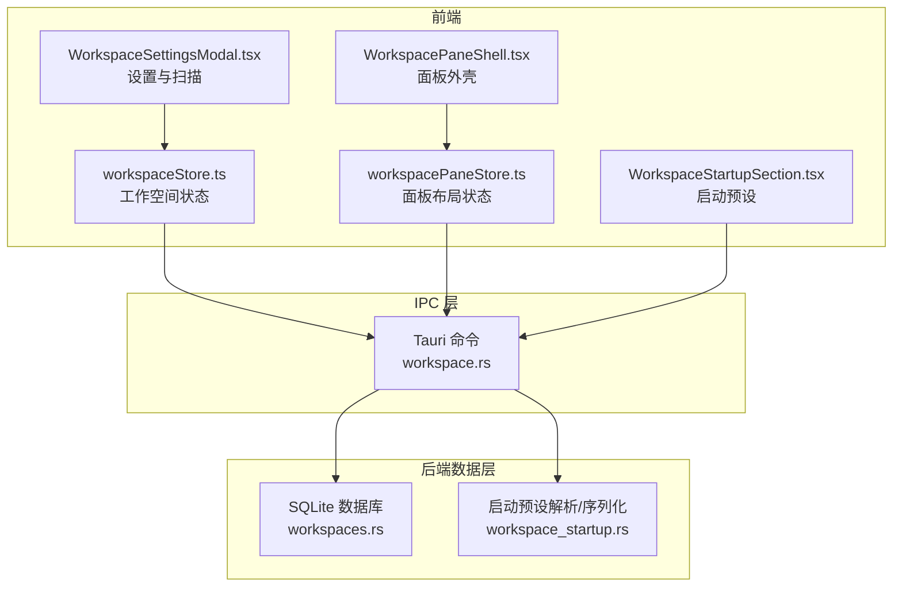
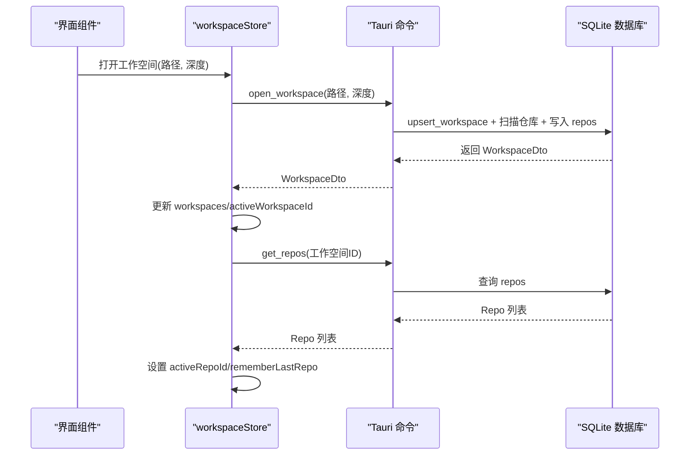
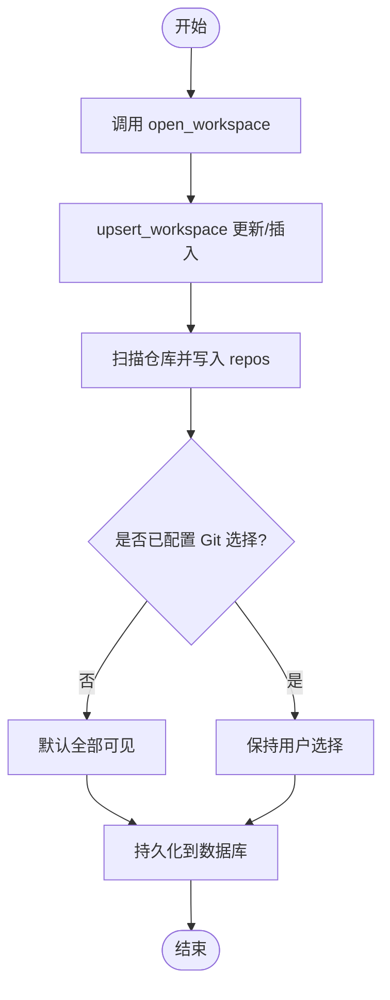
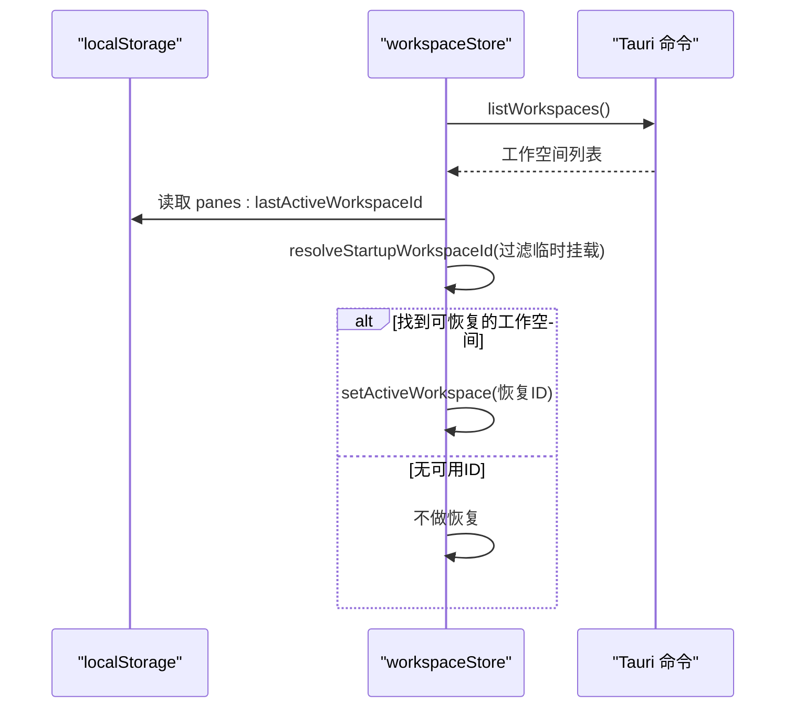
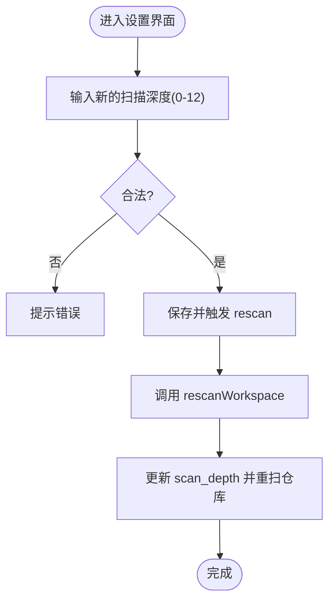
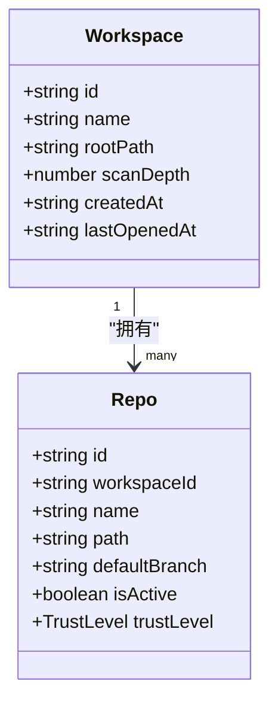
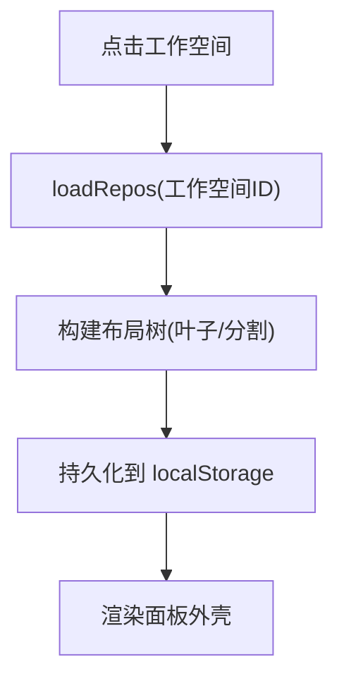
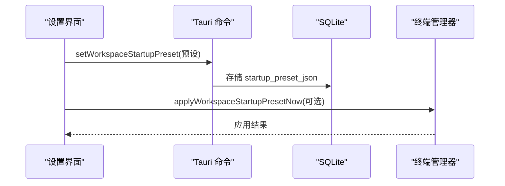
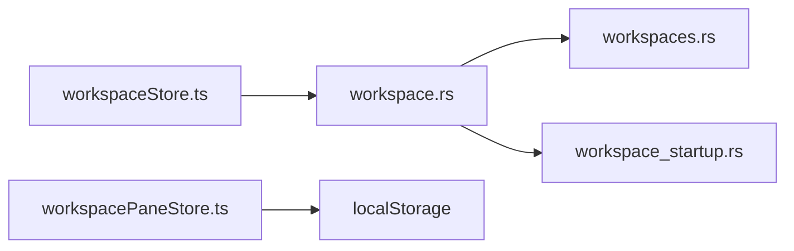

# 工作空间管理

<cite>
**本文引用的文件**
- [workspaceStore.ts](file://src/stores/workspaceStore.ts)
- [workspacePaneStore.ts](file://src/stores/workspacePaneStore.ts)
- [WorkspacePaneShell.tsx](file://src/components/workspace/WorkspacePaneShell.tsx)
- [WorkspaceSettingsModal.tsx](file://src/components/workspace/WorkspaceSettingsModal.tsx)
- [WorkspaceStartupSection.tsx](file://src/components/workspace/WorkspaceStartupSection.tsx)
- [WorkspaceMoreMenu.tsx](file://src/components/workspace/WorkspaceMoreMenu.tsx)
- [workspace.rs](file://src-tauri/src/commands/workspace.rs)
- [workspaces.rs](file://src-tauri/src/db/workspaces.rs)
- [workspace_startup.rs](file://src-tauri/src/workspace_startup.rs)
- [types.ts](file://src/types.ts)
- [state.rs](file://src-tauri/src/state.rs)
- [workspaceStartupUi.ts](file://src/lib/workspaceStartupUi.ts)
</cite>

## 目录
1. [简介](#简介)
2. [项目结构](#项目结构)
3. [核心组件](#核心组件)
4. [架构总览](#架构总览)
5. [详细组件分析](#详细组件分析)
6. [依赖关系分析](#依赖关系分析)
7. [性能考量](#性能考量)
8. [故障排除指南](#故障排除指南)
9. [结论](#结论)
10. [附录](#附录)

## 简介
本文件系统性阐述 Panes 应用中的“工作空间管理”能力，覆盖概念、生命周期、状态持久化、仓库扫描深度控制、多工作空间切换、工作空间设置与启动预设、信任级别管理、Git 活性状态控制等。文档同时给出面向用户的使用场景与最佳实践，并对 Linux AppImage 特殊处理与“最后活动工作空间恢复”等实现细节进行说明。

## 项目结构
工作空间管理由前端 Zustand 状态层与后端 Tauri 命令/数据库层协同完成：
- 前端状态层：工作空间 Store（workspaceStore）、工作空间面板布局 Store（workspacePaneStore）
- 视图层：工作空间面板外壳（WorkspacePaneShell）、设置与启动预设 UI（WorkspaceSettingsModal、WorkspaceStartupSection）
- 后端命令层：工作空间相关 IPC 命令（open_workspace、list_workspaces、get_repos 等）
- 数据层：SQLite 持久化（workspaces 表、repos 表）与启动预设序列化/规范化

图表来源
- [workspaceStore.ts:134-428](file://src/stores/workspaceStore.ts#L134-L428)
- [workspacePaneStore.ts:485-690](file://src/stores/workspacePaneStore.ts#L485-L690)
- [WorkspacePaneShell.tsx:143-503](file://src/components/workspace/WorkspacePaneShell.tsx#L143-L503)
- [WorkspaceSettingsModal.tsx:33-456](file://src/components/workspace/WorkspaceSettingsModal.tsx#L33-L456)
- [WorkspaceStartupSection.tsx:274-762](file://src/components/workspace/WorkspaceStartupSection.tsx#L274-L762)
- [workspace.rs:33-384](file://src-tauri/src/commands/workspace.rs#L33-L384)
- [workspaces.rs:15-344](file://src-tauri/src/db/workspaces.rs#L15-L344)
- [workspace_startup.rs:60-200](file://src-tauri/src/workspace_startup.rs#L60-L200)

章节来源
- [workspaceStore.ts:134-428](file://src/stores/workspaceStore.ts#L134-L428)
- [workspacePaneStore.ts:485-690](file://src/stores/workspacePaneStore.ts#L485-L690)
- [WorkspacePaneShell.tsx:143-503](file://src/components/workspace/WorkspacePaneShell.tsx#L143-L503)
- [WorkspaceSettingsModal.tsx:33-456](file://src/components/workspace/WorkspaceSettingsModal.tsx#L33-L456)
- [WorkspaceStartupSection.tsx:274-762](file://src/components/workspace/WorkspaceStartupSection.tsx#L274-L762)
- [workspace.rs:33-384](file://src-tauri/src/commands/workspace.rs#L33-L384)
- [workspaces.rs:15-344](file://src-tauri/src/db/workspaces.rs#L15-L344)
- [workspace_startup.rs:60-200](file://src-tauri/src/workspace_startup.rs#L60-L200)

## 核心组件
- 工作空间 Store（workspaceStore）
  - 负责工作空间列表、归档列表、当前激活工作空间、仓库列表与 Git 活性状态、信任级别、扫描深度等状态管理
  - 提供打开、归档、恢复、重扫、设置 Git 活性、批量设置信任级别等动作
  - 内置本地持久化：最后活动工作空间 ID、按工作空间的最后活动仓库 ID 映射
- 工作空间面板布局 Store（workspacePaneStore）
  - 维护每个工作空间内的面板树形布局（叶子/分割容器），支持拖拽拆分、标签页切换、比例调整
  - 使用 localStorage 进行布局持久化
- 视图组件
  - WorkspacePaneShell：渲染工作空间面板外壳、标题栏、拖拽拆分、表面切换
  - WorkspaceSettingsModal：工作空间通用信息、扫描深度、仓库列表、信任级别、可见性、启动预设
  - WorkspaceStartupSection：启动预设编辑器（可视化与高级文本模式）、导入导出、应用到终端会话

章节来源
- [workspaceStore.ts:11-428](file://src/stores/workspaceStore.ts#L11-L428)
- [workspacePaneStore.ts:35-690](file://src/stores/workspacePaneStore.ts#L35-L690)
- [WorkspacePaneShell.tsx:143-503](file://src/components/workspace/WorkspacePaneShell.tsx#L143-L503)
- [WorkspaceSettingsModal.tsx:33-456](file://src/components/workspace/WorkspaceSettingsModal.tsx#L33-L456)
- [WorkspaceStartupSection.tsx:274-762](file://src/components/workspace/WorkspaceStartupSection.tsx#L274-L762)

## 架构总览
工作空间管理采用“前端状态 + IPC 命令 + SQLite 数据库”的分层设计：
- 前端通过 IPC 调用后端命令，命令在数据库中执行增删改查
- 启动预设通过 JSON/TOML 解析与规范化，存储于 workspaces 表的 startup_preset_json 字段
- 面板布局独立于工作空间，按工作空间维度持久化在 localStorage

图表来源
- [workspaceStore.ts:167-186](file://src/stores/workspaceStore.ts#L167-L186)
- [workspaceStore.ts:251-286](file://src/stores/workspaceStore.ts#L251-L286)
- [workspace.rs:33-66](file://src-tauri/src/commands/workspace.rs#L33-L66)
- [workspaces.rs:15-58](file://src-tauri/src/db/workspaces.rs#L15-L58)

## 详细组件分析

### 工作空间生命周期与状态持久化
- 生命周期
  - 创建/打开：调用 open_workspace，写入或更新 workspaces 记录，扫描仓库并写入 repos；若未配置 Git 选择则默认全部可见
  - 归档：archive_workspace 将 archived_at 置为当前时间
  - 恢复：restore_workspace 清空 archived_at 并更新 last_opened_at
  - 删除：delete_workspace 直接删除记录（谨慎使用）
- 状态持久化
  - 最后活动工作空间：localStorage panes:lastActiveWorkspaceId
  - 按工作空间的最后活动仓库：localStorage panes:lastActiveRepoByWorkspace（键值映射）
  - 面板布局：localStorage panes:workspacePaneLayout:{workspaceId}

图表来源
- [workspace.rs:33-66](file://src-tauri/src/commands/workspace.rs#L33-L66)
- [workspaces.rs:15-58](file://src-tauri/src/db/workspaces.rs#L15-L58)

章节来源
- [workspaceStore.ts:36-132](file://src/stores/workspaceStore.ts#L36-L132)
- [workspaceStore.ts:167-250](file://src/stores/workspaceStore.ts#L167-L250)
- [workspaceStore.ts:379-407](file://src/stores/workspaceStore.ts#L379-L407)
- [workspaces.rs:218-255](file://src-tauri/src/db/workspaces.rs#L218-L255)

### 多工作空间切换与最后活动恢复
- 切换逻辑
  - setActiveWorkspace：更新 activeWorkspaceId，清空当前仓库列表，准备终端激活，加载该工作空间的仓库
  - 加载仓库时根据 lastActiveRepoByWorkspace 映射回退到上次活动仓库，否则选择第一个活跃仓库
- 最后活动恢复
  - 启动时读取 localStorage 中保存的上一次工作空间 ID
  - 若该工作空间路径不是 Linux AppImage 的临时挂载路径，则优先恢复；否则选择非临时挂载的第一个可用工作空间
  - Linux AppImage 特殊处理：isTransientLinuxAppImageRoot 用于识别临时挂载路径，避免恢复到不可用路径

图表来源
- [workspaceStore.ts:142-158](file://src/stores/workspaceStore.ts#L142-L158)
- [workspaceStore.ts:46-65](file://src/stores/workspaceStore.ts#L46-L65)
- [workspaceStore.ts:287-297](file://src/stores/workspaceStore.ts#L287-L297)

章节来源
- [workspaceStore.ts:46-65](file://src/stores/workspaceStore.ts#L46-L65)
- [workspaceStore.ts:113-132](file://src/stores/workspaceStore.ts#L113-L132)
- [workspaceStore.ts:287-297](file://src/stores/workspaceStore.ts#L287-L297)

### 仓库扫描深度控制与重扫
- 扫描深度范围：0–12，默认 3
- 打开工作空间时可指定 scan_depth，若未提供则沿用旧值
- 设置界面允许修改扫描深度并触发 rescan，重新扫描仓库并更新工作空间记录

图表来源
- [WorkspaceSettingsModal.tsx:92-129](file://src/components/workspace/WorkspaceSettingsModal.tsx#L92-L129)
- [workspaceStore.ts:379-407](file://src/stores/workspaceStore.ts#L379-L407)
- [workspace.rs:19-384](file://src-tauri/src/commands/workspace.rs#L19-L384)
- [workspaces.rs:13-13](file://src-tauri/src/db/workspaces.rs#L13-L13)

章节来源
- [WorkspaceSettingsModal.tsx:25-26](file://src/components/workspace/WorkspaceSettingsModal.tsx#L25-L26)
- [WorkspaceSettingsModal.tsx:92-129](file://src/components/workspace/WorkspaceSettingsModal.tsx#L92-L129)
- [workspaceStore.ts:379-407](file://src/stores/workspaceStore.ts#L379-L407)
- [workspace.rs:19-384](file://src-tauri/src/commands/workspace.rs#L19-L384)
- [workspaces.rs:13-13](file://src-tauri/src/db/workspaces.rs#L13-L13)

### 工作空间与仓库的关系、信任级别与 Git 活性状态
- 关系
  - 一个工作空间包含多个仓库；仓库属于某个工作空间
- 信任级别
  - 支持 trusted/standard/restricted 三档；可在设置界面逐个或批量设置
- Git 活性状态
  - 可设置单个仓库为可见/隐藏；也可一次性设置工作空间内所有仓库的可见性
  - 首次设置某仓库可见会标记“已配置 Git 仓库选择”，后续行为以用户选择为准

图表来源
- [types.ts:3-10](file://src/types.ts#L3-L10)
- [types.ts:72-80](file://src/types.ts#L72-L80)

章节来源
- [workspaceStore.ts:319-378](file://src/stores/workspaceStore.ts#L319-L378)
- [workspaceStore.ts:337-361](file://src/stores/workspaceStore.ts#L337-L361)
- [workspaceStore.ts:408-427](file://src/stores/workspaceStore.ts#L408-L427)
- [workspace.rs:92-133](file://src-tauri/src/commands/workspace.rs#L92-L133)
- [workspaces.rs:308-344](file://src-tauri/src/db/workspaces.rs#L308-L344)

### 工作空间面板布局与多工作空间协作
- 面板布局
  - 支持叶子节点（含多个表面标签页）与分割容器（水平/垂直），可拖拽调整比例
  - 每个工作空间独立维护布局，持久化到 localStorage
- 多工作空间协作
  - 通过 setActiveWorkspace 切换工作空间时，自动准备终端激活并加载对应仓库
  - 面板外壳支持拖拽表面（聊天/终端/编辑器）到不同叶子进行拆分

图表来源
- [workspacePaneStore.ts:485-690](file://src/stores/workspacePaneStore.ts#L485-L690)
- [WorkspacePaneShell.tsx:165-174](file://src/components/workspace/WorkspacePaneShell.tsx#L165-L174)

章节来源
- [workspacePaneStore.ts:485-690](file://src/stores/workspacePaneStore.ts#L485-L690)
- [WorkspacePaneShell.tsx:165-174](file://src/components/workspace/WorkspacePaneShell.tsx#L165-L174)

### 工作空间设置与启动预设
- 设置项
  - 通用：名称、路径、扫描深度、创建/打开时间
  - 仓库：可见性、信任级别、远程仓库管理
  - 启动：默认视图、分割面板大小、终端组与会话树
- 启动预设
  - 支持 JSON/TOML 导入/导出
  - 可将当前运行布局快照保存为启动预设
  - 可按条件（如无实时会话）立即应用预设

图表来源
- [WorkspaceSettingsModal.tsx:116-129](file://src/components/workspace/WorkspaceSettingsModal.tsx#L116-L129)
- [WorkspaceStartupSection.tsx:579-610](file://src/components/workspace/WorkspaceStartupSection.tsx#L579-L610)
- [workspace.rs:242-288](file://src-tauri/src/commands/workspace.rs#L242-L288)
- [workspace_startup.rs:169-199](file://src-tauri/src/workspace_startup.rs#L169-L199)

章节来源
- [WorkspaceSettingsModal.tsx:33-456](file://src/components/workspace/WorkspaceSettingsModal.tsx#L33-L456)
- [WorkspaceStartupSection.tsx:274-762](file://src/components/workspace/WorkspaceStartupSection.tsx#L274-L762)
- [workspace.rs:181-304](file://src-tauri/src/commands/workspace.rs#L181-L304)
- [workspace_startup.rs:60-200](file://src-tauri/src/workspace_startup.rs#L60-L200)

### Linux AppImage 特殊处理与最后活动工作空间恢复
- 临时挂载路径识别
  - isTransientLinuxAppImageRoot 使用正则匹配 /tmp/.mount_* 或 /var/tmp/.mount_* 路径
- 恢复策略
  - 优先恢复上次活动的工作空间（若其路径非临时挂载）
  - 若无可用上次活动工作空间，选择第一个非临时挂载的工作空间
  - 默认工作空间根目录也会跳过临时挂载与系统目录

章节来源
- [workspaceStore.ts:42-44](file://src/stores/workspaceStore.ts#L42-L44)
- [workspaceStore.ts:46-65](file://src/stores/workspaceStore.ts#L46-L65)
- [workspaces.rs:172-200](file://src-tauri/src/db/workspaces.rs#L172-L200)

## 依赖关系分析
- 前端 Store 依赖 IPC 命令
  - workspaceStore 依赖 workspace.rs 中的 open_workspace/list_workspaces/get_repos/archive_workspace/restore_workspace/set_repo_trust_level/set_repo_git_active 等
- 后端命令依赖数据库
  - workspace.rs 命令调用 workspaces.rs 中的 upsert_workspace/list_workspaces/get_repos 等
- 启动预设依赖 workspace_startup.rs
  - 解析/序列化/规范化启动预设，约束面板尺寸与比例范围

图表来源
- [workspaceStore.ts:134-428](file://src/stores/workspaceStore.ts#L134-L428)
- [workspace.rs:33-384](file://src-tauri/src/commands/workspace.rs#L33-L384)
- [workspaces.rs:15-344](file://src-tauri/src/db/workspaces.rs#L15-L344)
- [workspace_startup.rs:169-199](file://src-tauri/src/workspace_startup.rs#L169-L199)

章节来源
- [workspaceStore.ts:134-428](file://src/stores/workspaceStore.ts#L134-L428)
- [workspace.rs:33-384](file://src-tauri/src/commands/workspace.rs#L33-L384)
- [workspaces.rs:15-344](file://src-tauri/src/db/workspaces.rs#L15-L344)
- [workspace_startup.rs:169-199](file://src-tauri/src/workspace_startup.rs#L169-L199)

## 性能考量
- 请求去抖与并发控制
  - loadRepos 使用请求序号（reposLoadSeq）避免并发请求互相覆盖
- 仓库扫描深度
  - 合理设置 scan_depth，避免在大型仓库上产生过多 IO
- 面板布局
  - 分割容器与比例调整仅在本地持久化，避免频繁 IPC 调用
- 终端激活与草稿
  - 切换工作空间前 flush drafts，避免跨工作空间状态污染

章节来源
- [workspaceStore.ts:251-286](file://src/stores/workspaceStore.ts#L251-L286)
- [workspaceStore.ts:287-297](file://src/stores/workspaceStore.ts#L287-L297)

## 故障排除指南
- 打开工作空间失败
  - 检查路径合法性与权限；确认 scan_depth 在 0–12 范围内
  - 查看后端日志与错误提示
- 无法恢复最后活动工作空间
  - 确认 localStorage 中的 panes:lastActiveWorkspaceId 是否存在且路径非临时挂载
  - 检查是否存在非临时挂载的工作空间
- 仓库列表为空
  - 降低 scan_depth 或手动 rescan
  - 检查 Git 仓库是否被设置为不可见
- 启动预设应用失败
  - 确认当前工作空间为激活状态
  - 若存在实时会话，先清理会话再应用
  - 检查 JSON/TOML 格式与字段合法性

章节来源
- [workspaceStore.ts:167-186](file://src/stores/workspaceStore.ts#L167-L186)
- [workspaceStore.ts:46-65](file://src/stores/workspaceStore.ts#L46-L65)
- [WorkspaceStartupSection.tsx:690-714](file://src/components/workspace/WorkspaceStartupSection.tsx#L690-L714)

## 结论
工作空间管理通过清晰的前后端分层与完善的持久化策略，提供了稳定可靠的工作空间生命周期管理、灵活的仓库扫描深度控制、强大的启动预设与面板布局能力。结合 Linux AppImage 特殊处理与“最后活动工作空间恢复”，在多场景下均能提供良好的用户体验。

## 附录
- 类型定义参考
  - Workspace、Repo、TrustLevel、WorkspaceStartupPreset 等类型定义位于 types.ts
- 启动预设 UI 辅助
  - resolveStartupSessionHarnessSelection、shouldShowStartupSplitPanelSize 等辅助函数位于 workspaceStartupUi.ts

章节来源
- [types.ts:1-200](file://src/types.ts#L1-L200)
- [workspaceStartupUi.ts:1-14](file://src/lib/workspaceStartupUi.ts#L1-L14)