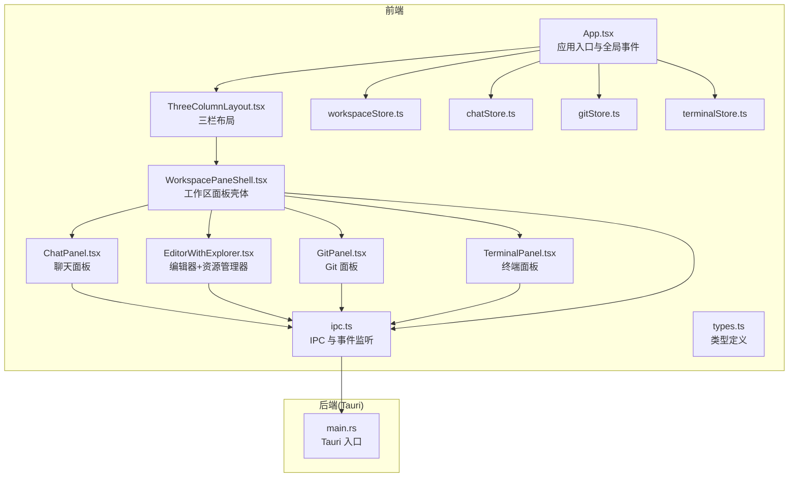
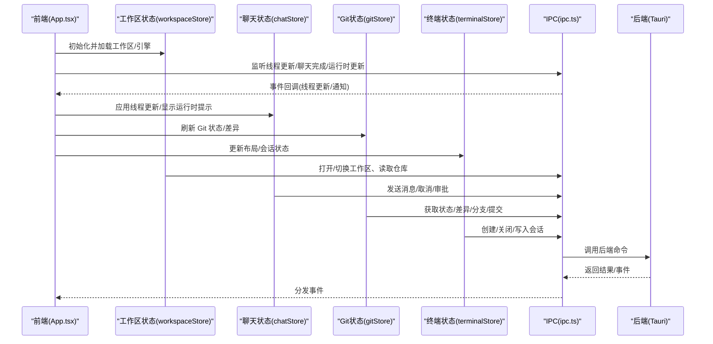
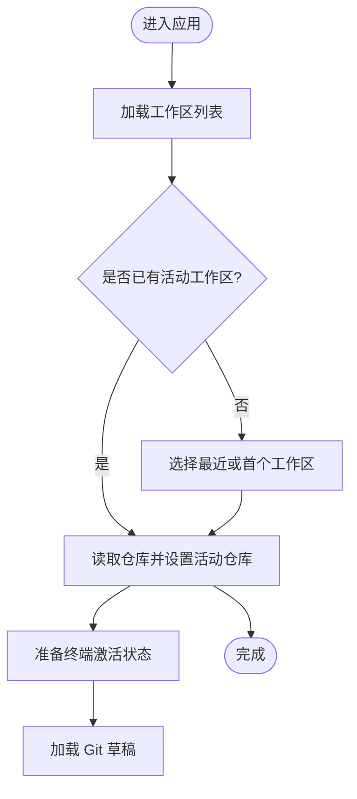
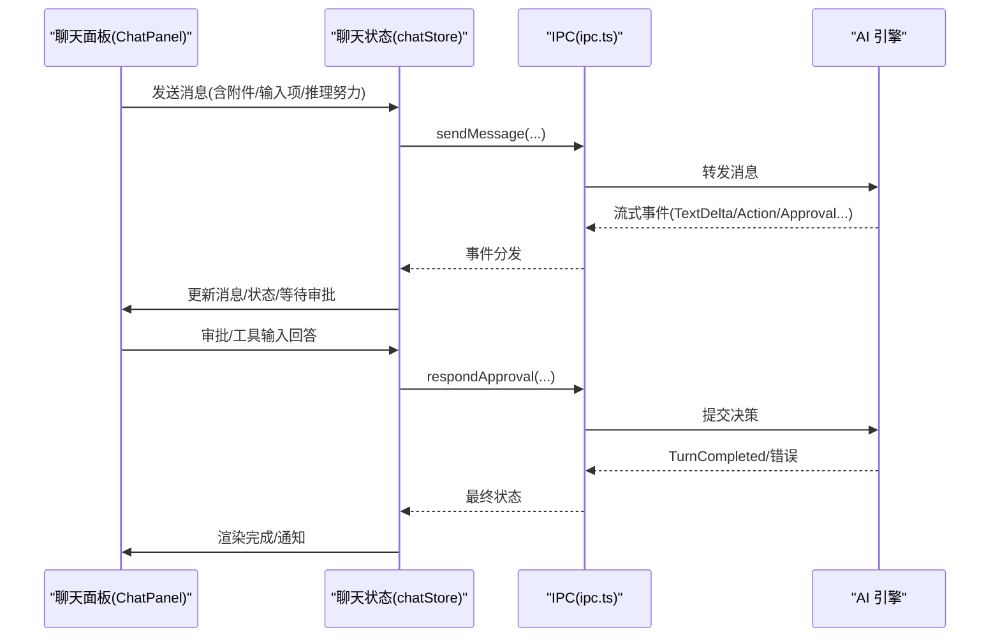
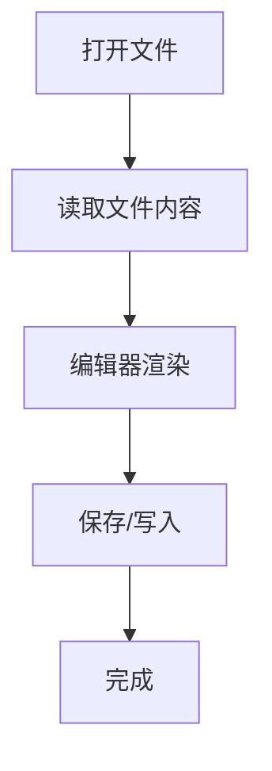
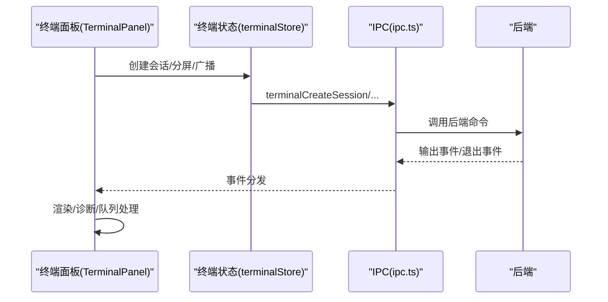
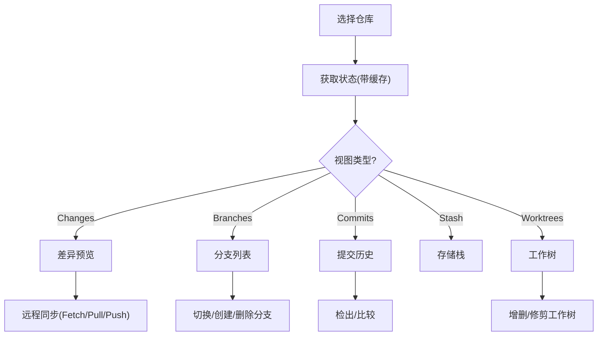
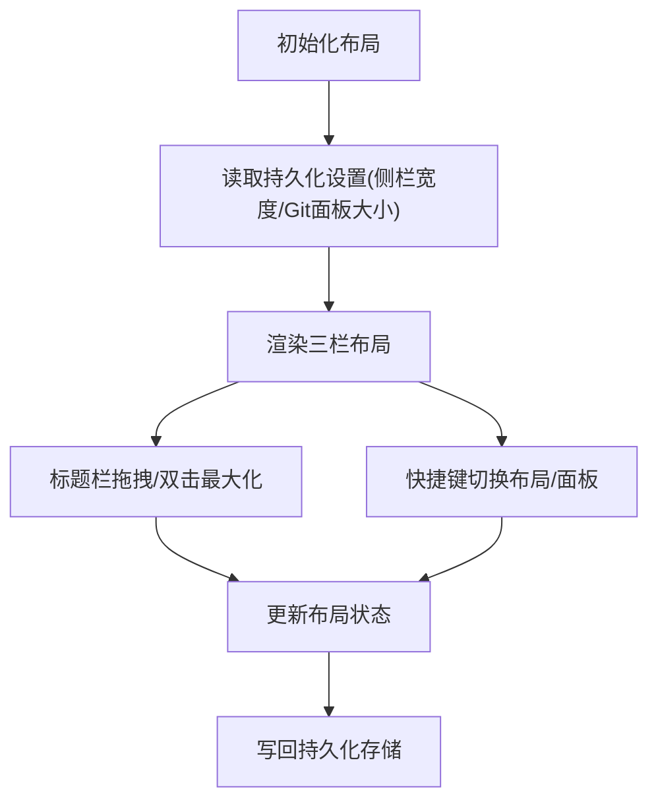
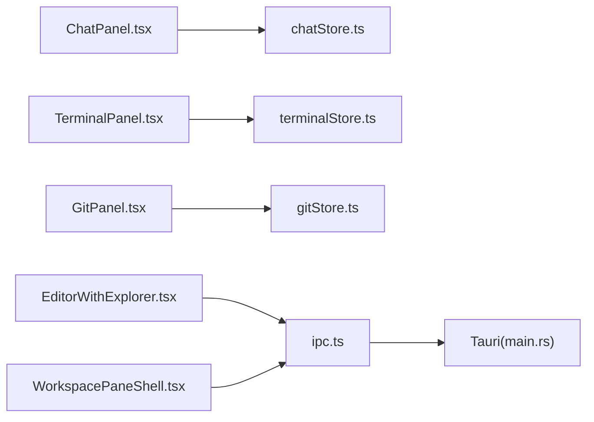

# 核心功能

<cite>
**本文引用的文件**
- [App.tsx](file://src/App.tsx)
- [main.tsx](file://src/main.tsx)
- [types.ts](file://src/types.ts)
- [workspaceStore.ts](file://src/stores/workspaceStore.ts)
- [chatStore.ts](file://src/stores/chatStore.ts)
- [gitStore.ts](file://src/stores/gitStore.ts)
- [terminalStore.ts](file://src/stores/terminalStore.ts)
- [ipc.ts](file://src/lib/ipc.ts)
- [ThreeColumnLayout.tsx](file://src/components/layout/ThreeColumnLayout.tsx)
- [WorkspacePaneShell.tsx](file://src/components/workspace/WorkspacePaneShell.tsx)
- [EditorWithExplorer.tsx](file://src/components/editor/EditorWithExplorer.tsx)
- [GitPanel.tsx](file://src/components/git/GitPanel.tsx)
- [ChatPanel.tsx](file://src/components/chat/ChatPanel.tsx)
- [TerminalPanel.tsx](file://src/components/terminal/TerminalPanel.tsx)
- [main.rs](file://src-tauri/src/main.rs)
</cite>

## 目录
1. [引言](#引言)
2. [项目结构](#项目结构)
3. [核心组件](#核心组件)
4. [架构总览](#架构总览)
5. [详细组件分析](#详细组件分析)
6. [依赖关系分析](#依赖关系分析)
7. [性能考量](#性能考量)
8. [故障排查指南](#故障排查指南)
9. [结论](#结论)
10. [附录](#附录)

## 引言
本文件面向 Panes 的“核心功能”进行全面而深入的技术文档化，覆盖工作空间管理、聊天与 AI 集成、代码编辑器、终端集成、Git 版本控制以及用户界面等模块。文档从系统架构、组件关系、数据流、状态管理模式到关键交互流程进行可视化呈现，并提供使用示例、最佳实践与常见问题解决方案，帮助开发者与使用者快速理解与高效使用。

## 项目结构
Panes 前端采用 React + Zustand 状态管理，后端通过 Tauri 暴露系统能力；IPC 层负责前端与后端的通信。整体采用分层设计：UI 组件层、业务状态层（stores）、类型定义层（types）与底层 IPC 调用层。

图表来源
- [App.tsx:119-577](file://src/App.tsx#L119-L577)
- [ThreeColumnLayout.tsx:55-381](file://src/components/layout/ThreeColumnLayout.tsx#L55-L381)
- [WorkspacePaneShell.tsx:143-638](file://src/components/workspace/WorkspacePaneShell.tsx#L143-L638)
- [ChatPanel.tsx:1-200](file://src/components/chat/ChatPanel.tsx#L1-L200)
- [EditorWithExplorer.tsx:36-124](file://src/components/editor/EditorWithExplorer.tsx#L36-L124)
- [GitPanel.tsx:48-864](file://src/components/git/GitPanel.tsx#L48-L864)
- [TerminalPanel.tsx:1-200](file://src/components/terminal/TerminalPanel.tsx#L1-L200)
- [ipc.ts:72-792](file://src/lib/ipc.ts#L72-L792)
- [main.rs:1-14](file://src-tauri/src/main.rs#L1-L14)

章节来源
- [main.tsx:1-32](file://src/main.tsx#L1-L32)
- [App.tsx:119-577](file://src/App.tsx#L119-L577)
- [types.ts:1-200](file://src/types.ts#L1-L200)

## 核心组件
- 工作空间管理：负责工作区的打开、切换、归档、扫描与仓库选择，维护活动工作区与活动仓库状态。
- 聊天与 AI 集成：支持多引擎（Codex、Claude、OpenCode 等），消息窗口、权限审批、工具输入问卷、计划模式等。
- 代码编辑器：文件树、编辑器与侧边资源管理器联动，支持拖拽与尺寸调整。
- 终端集成：xterm.js 集成，会话管理、分屏、广播、渲染诊断与输出队列优化。
- Git 版本控制：状态缓存、差异预览、分支/提交/stash/worktree 管理、远程同步与工作树切换。
- 用户界面：三栏布局、侧边栏/Git 面板停靠/浮动、焦点模式、窗口拖拽与标题栏行为。

章节来源
- [workspaceStore.ts:134-429](file://src/stores/workspaceStore.ts#L134-L429)
- [chatStore.ts:24-120](file://src/stores/chatStore.ts#L24-L120)
- [gitStore.ts:476-800](file://src/stores/gitStore.ts#L476-L800)
- [terminalStore.ts:751-800](file://src/stores/terminalStore.ts#L751-L800)
- [ThreeColumnLayout.tsx:55-381](file://src/components/layout/ThreeColumnLayout.tsx#L55-L381)
- [EditorWithExplorer.tsx:36-124](file://src/components/editor/EditorWithExplorer.tsx#L36-L124)
- [GitPanel.tsx:48-864](file://src/components/git/GitPanel.tsx#L48-L864)
- [ChatPanel.tsx:1-200](file://src/components/chat/ChatPanel.tsx#L1-L200)
- [TerminalPanel.tsx:1-200](file://src/components/terminal/TerminalPanel.tsx#L1-L200)

## 架构总览
系统采用“前端 React/Zustand + 后端 Tauri”的双层架构。前端通过 IPC 与后端命令交互，同时订阅后端事件以保持 UI 与后端状态一致。全局 App 组件负责初始化、加载工作区与引擎、处理快捷键与菜单动作、监听线程更新与通知事件。

图表来源
- [App.tsx:139-295](file://src/App.tsx#L139-L295)
- [ipc.ts:629-742](file://src/lib/ipc.ts#L629-L742)
- [workspaceStore.ts:142-186](file://src/stores/workspaceStore.ts#L142-L186)
- [chatStore.ts:35-62](file://src/stores/chatStore.ts#L35-L62)
- [gitStore.ts:522-620](file://src/stores/gitStore.ts#L522-L620)
- [terminalStore.ts:751-797](file://src/stores/terminalStore.ts#L751-L797)

## 详细组件分析

### 工作空间管理
- 设计目标：统一管理多个工作区与仓库，提供活动工作区与活动仓库的上下文，支持扫描深度、信任级别与 Git 选中配置。
- 核心特性：
  - 加载/打开/归档/恢复工作区
  - 设置活动仓库、批量设置仓库信任级别
  - 为终端与 Git 子系统准备激活状态
  - 本地持久化最近工作区与最近仓库映射
- 关键数据流：工作区列表 → 选择活动工作区 → 读取仓库 → 设置活动仓库 → 触发终端/Git 初始化

图表来源
- [workspaceStore.ts:142-186](file://src/stores/workspaceStore.ts#L142-L186)
- [workspaceStore.ts:251-286](file://src/stores/workspaceStore.ts#L251-L286)
- [workspaceStore.ts:287-297](file://src/stores/workspaceStore.ts#L287-L297)

章节来源
- [workspaceStore.ts:134-429](file://src/stores/workspaceStore.ts#L134-L429)

### 聊天与 AI 集成
- 设计目标：提供多引擎对话体验，支持消息窗口、权限审批、工具输入问卷、计划模式与附件上传。
- 核心特性：
  - 流式事件批处理与去重
  - 审批请求解析与响应
  - 附件与输入项构建
  - 与终端/编辑器的表面切换
- 关键数据流：发送消息 → 引擎处理 → 流式事件 → UI 渲染 → 审批/工具输入 → 结果回传

图表来源
- [chatStore.ts:35-120](file://src/stores/chatStore.ts#L35-L120)
- [ipc.ts:357-420](file://src/lib/ipc.ts#L357-L420)
- [ChatPanel.tsx:1-200](file://src/components/chat/ChatPanel.tsx#L1-L200)

章节来源
- [chatStore.ts:24-200](file://src/stores/chatStore.ts#L24-L200)
- [ipc.ts:357-420](file://src/lib/ipc.ts#L357-L420)
- [ChatPanel.tsx:1-200](file://src/components/chat/ChatPanel.tsx#L1-L200)

### 代码编辑器
- 设计目标：在工作区内提供文件浏览与编辑能力，支持与 Git 面板联动查看差异。
- 核心特性：
  - 文件树与编辑器分离，可拖拽调整资源管理器宽度
  - 编辑器与文件资源管理器联动
- 关键数据流：打开文件 → 读取内容 → 在编辑器中展示 → 保存/写入

图表来源
- [EditorWithExplorer.tsx:36-124](file://src/components/editor/EditorWithExplorer.tsx#L36-L124)
- [ipc.ts:497-512](file://src/lib/ipc.ts#L497-L512)

章节来源
- [EditorWithExplorer.tsx:36-124](file://src/components/editor/EditorWithExplorer.tsx#L36-L124)
- [ipc.ts:497-512](file://src/lib/ipc.ts#L497-L512)

### 终端集成
- 设计目标：高性能终端体验，支持会话管理、分屏、广播、渲染诊断与输出队列优化。
- 核心特性：
  - xterm.js 集成，WebGL/CSS 渲染与图像支持
  - 会话树管理、分组与广播
  - 输出队列限流、断流重试与诊断导出
- 关键数据流：创建会话 → 写入命令 → 接收输出 → 渲染/诊断

图表来源
- [TerminalPanel.tsx:1-200](file://src/components/terminal/TerminalPanel.tsx#L1-L200)
- [terminalStore.ts:751-800](file://src/stores/terminalStore.ts#L751-L800)
- [ipc.ts:547-615](file://src/lib/ipc.ts#L547-L615)

章节来源
- [TerminalPanel.tsx:1-200](file://src/components/terminal/TerminalPanel.tsx#L1-L200)
- [terminalStore.ts:751-800](file://src/stores/terminalStore.ts#L751-L800)
- [ipc.ts:547-615](file://src/lib/ipc.ts#L547-L615)

### Git 版本控制
- 设计目标：提供高效、稳定的 Git 操作体验，包含状态缓存、差异预览、多仓库与工作树管理。
- 核心特性：
  - 状态/差异缓存与 TTL 控制
  - 多仓库视图与远程同步
  - 工作树管理与回退操作
- 关键数据流：选择仓库 → 获取状态/差异 → 切换分支/提交 → 远程同步

图表来源
- [gitStore.ts:259-350](file://src/stores/gitStore.ts#L259-L350)
- [GitPanel.tsx:48-864](file://src/components/git/GitPanel.tsx#L48-L864)

章节来源
- [gitStore.ts:476-800](file://src/stores/gitStore.ts#L476-L800)
- [GitPanel.tsx:48-864](file://src/components/git/GitPanel.tsx#L48-L864)

### 用户界面与布局
- 设计目标：灵活的三栏布局，支持侧边栏与 Git 面板的停靠/浮动，焦点模式与窗口拖拽。
- 核心特性：
  - 侧边栏宽度与 Git 面板大小持久化
  - 布局模式切换（聊天/终端/拆分/编辑器）
  - 标题栏安全区域与自定义窗口框架
- 关键数据流：布局初始化 → 读取持久化设置 → 渲染面板 → 响应拖拽/键盘事件

图表来源
- [ThreeColumnLayout.tsx:55-381](file://src/components/layout/ThreeColumnLayout.tsx#L55-L381)
- [App.tsx:291-495](file://src/App.tsx#L291-L495)

章节来源
- [ThreeColumnLayout.tsx:55-381](file://src/components/layout/ThreeColumnLayout.tsx#L55-L381)
- [App.tsx:291-495](file://src/App.tsx#L291-L495)

## 依赖关系分析
- 组件耦合：各面板组件通过共享的 stores 与 ipc 连接，避免直接跨层级耦合。
- 外部依赖：xterm.js、@xterm/addon-*、react-resizable-panels、@tauri-apps/*。
- 事件驱动：前端通过 IPC 订阅后端事件，保证 UI 与后端状态一致。

图表来源
- [ChatPanel.tsx:1-200](file://src/components/chat/ChatPanel.tsx#L1-L200)
- [TerminalPanel.tsx:1-200](file://src/components/terminal/TerminalPanel.tsx#L1-L200)
- [GitPanel.tsx:48-864](file://src/components/git/GitPanel.tsx#L48-L864)
- [EditorWithExplorer.tsx:36-124](file://src/components/editor/EditorWithExplorer.tsx#L36-L124)
- [WorkspacePaneShell.tsx:143-638](file://src/components/workspace/WorkspacePaneShell.tsx#L143-L638)
- [ipc.ts:72-792](file://src/lib/ipc.ts#L72-L792)
- [main.rs:1-14](file://src-tauri/src/main.rs#L1-L14)

章节来源
- [ipc.ts:72-792](file://src/lib/ipc.ts#L72-L792)
- [main.rs:1-14](file://src-tauri/src/main.rs#L1-L14)

## 性能考量
- 缓存策略：Git 状态与差异采用 TTL 与字节限制的缓存，减少重复 IO。
- 流式事件批处理：聊天事件按时间窗口合并，降低渲染压力。
- 终端输出队列：字符/块数阈值与掉帧预警，配合断流重试与降级渲染。
- 布局与虚拟化：消息列表启用虚拟化，减少 DOM 节点数量。

章节来源
- [gitStore.ts:15-25](file://src/stores/gitStore.ts#L15-L25)
- [chatStore.ts:64-120](file://src/stores/chatStore.ts#L64-L120)
- [TerminalPanel.tsx:240-270](file://src/components/terminal/TerminalPanel.tsx#L240-L270)

## 故障排查指南
- 无法加载工作区/仓库
  - 检查工作区路径与扫描深度设置
  - 查看工作区归档状态与最近工作区恢复
- 聊天无响应/卡住
  - 查看流式事件是否持续到达
  - 检查审批/工具输入是否阻塞
- Git 面板不刷新
  - 确认仓库路径与监听是否生效
  - 使用强制刷新或检查远程同步状态
- 终端渲染异常
  - 切换 WebGL/CSS 渲染模式
  - 查看输出队列与掉帧统计
- 快捷键无效
  - 检查终端输入聚焦状态与快捷键冲突
  - 确认原生菜单与 JS 事件的去抖机制

章节来源
- [workspaceStore.ts:142-186](file://src/stores/workspaceStore.ts#L142-L186)
- [chatStore.ts:35-120](file://src/stores/chatStore.ts#L35-L120)
- [gitStore.ts:522-620](file://src/stores/gitStore.ts#L522-L620)
- [TerminalPanel.tsx:740-795](file://src/components/terminal/TerminalPanel.tsx#L740-L795)
- [App.tsx:291-495](file://src/App.tsx#L291-L495)

## 结论
Panes 通过清晰的分层架构与事件驱动模型，实现了工作空间、聊天、编辑器、终端与 Git 的一体化协作体验。Zustand 状态管理与 IPC 事件机制保证了高内聚低耦合的组件关系，结合缓存与流式处理策略，在复杂场景下仍能保持良好的性能与稳定性。建议在扩展新功能时遵循现有模式，优先通过 stores 与 ipc 进行解耦，确保一致的用户体验与可维护性。

## 附录
- 实际使用示例
  - 新建工作区：调用 openWorkspace 并设置活动工作区
  - 发送聊天消息：通过 chatStore.send 并处理审批/工具输入
  - 打开文件编辑：通过编辑器组件打开文件并保存
  - 创建终端会话：通过 terminalStore.createSession 并写入命令
  - Git 同步：执行 fetch/pull/push 并观察状态变化
- 最佳实践
  - 使用持久化键存储用户偏好（如侧栏宽度、Git 面板大小）
  - 对高频 IO 操作（Git 状态/差异）启用缓存与去抖
  - 在聊天面板中对长文本与大附件进行分块处理与预览
  - 终端渲染根据设备能力自动降级，保障可用性
- 常见问题
  - 仓库未激活：通过 setWorkspaceGitActiveRepos 自动激活所有仓库
  - 会话丢失：利用缓存与重新附加机制恢复输出
  - 权限审批：提供明确的审批 UI 与默认选项