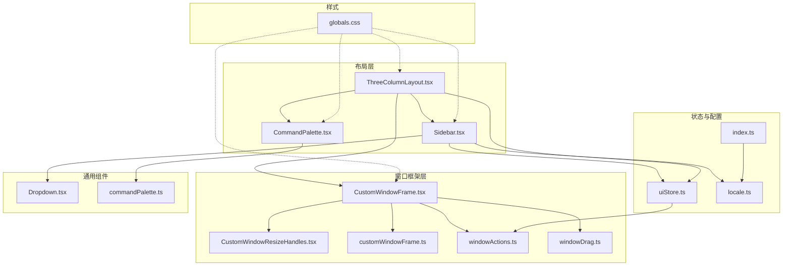
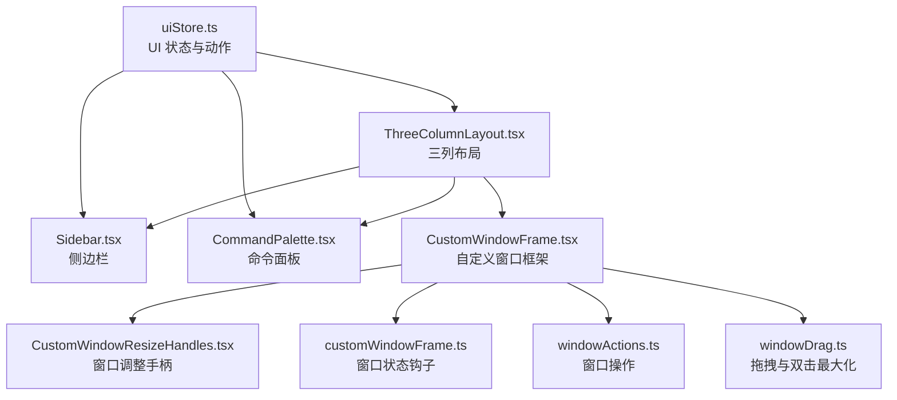
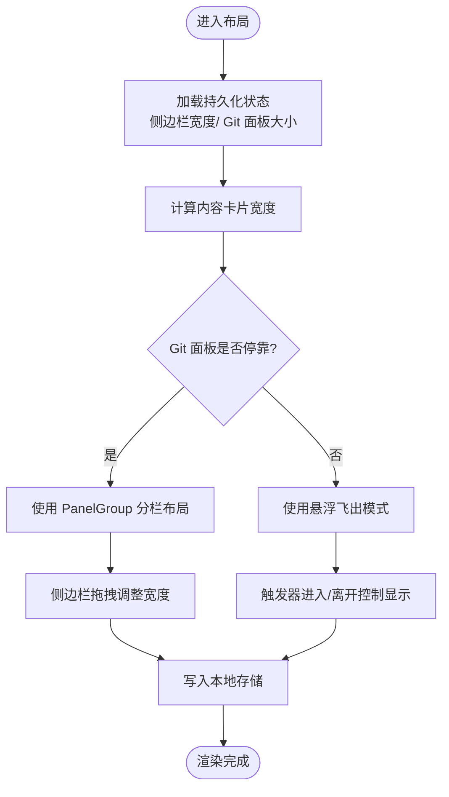
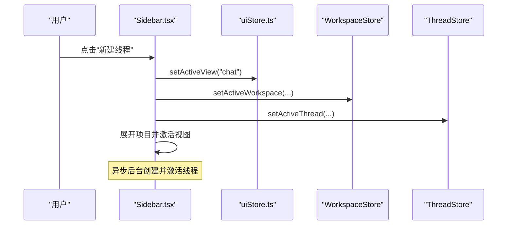
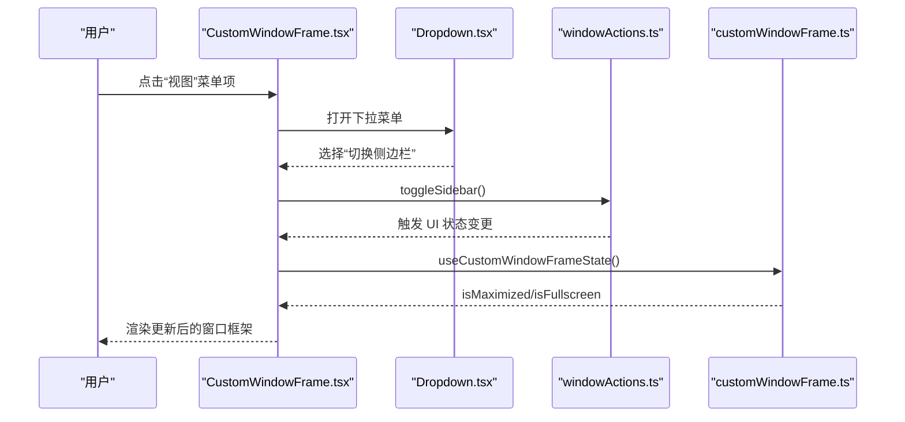
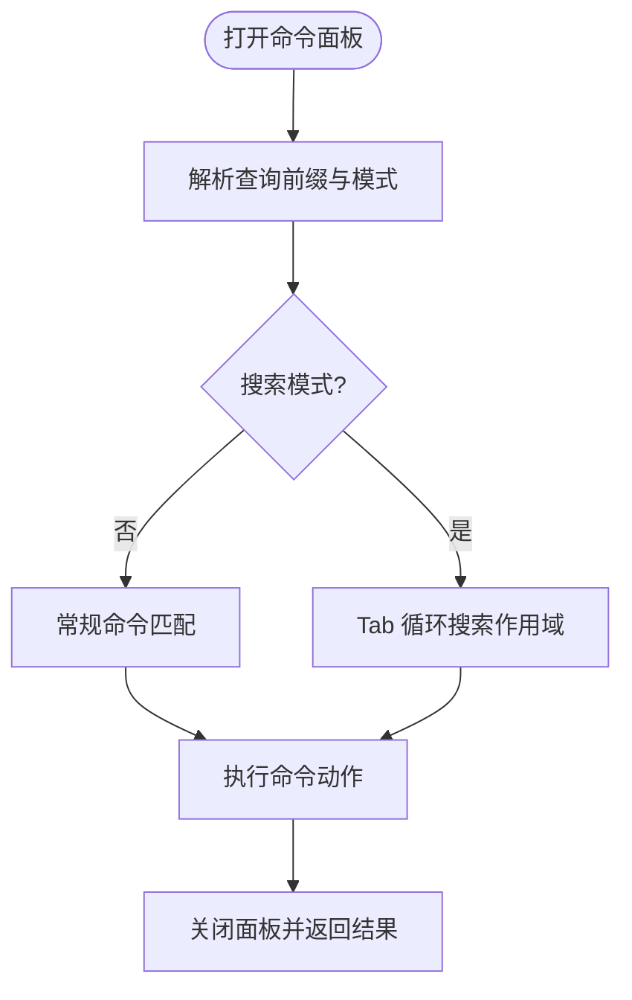
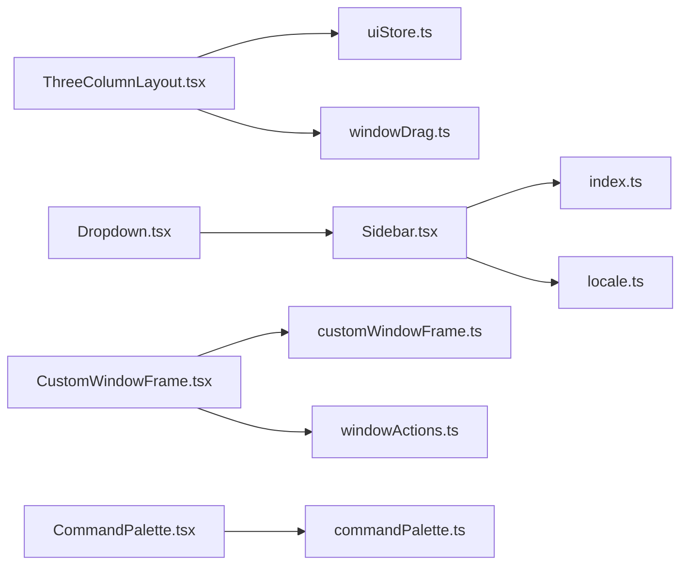

# 用户界面

<cite>
**本文引用的文件**
- [ThreeColumnLayout.tsx](file://src/components/layout/ThreeColumnLayout.tsx)
- [Sidebar.tsx](file://src/components/sidebar/Sidebar.tsx)
- [CustomWindowFrame.tsx](file://src/components/shared/CustomWindowFrame.tsx)
- [CommandPalette.tsx](file://src/components/shared/CommandPalette.tsx)
- [customWindowFrame.ts](file://src/lib/customWindowFrame.ts)
- [windowActions.ts](file://src/lib/windowActions.ts)
- [uiStore.ts](file://src/stores/uiStore.ts)
- [commandPalette.ts](file://src/lib/commandPalette.ts)
- [windowDrag.ts](file://src/lib/windowDrag.ts)
- [CustomWindowResizeHandles.tsx](file://src/components/shared/CustomWindowResizeHandles.tsx)
- [Dropdown.tsx](file://src/components/shared/Dropdown.tsx)
- [index.ts](file://src/i18n/index.ts)
- [locale.ts](file://src/lib/locale.ts)
- [globals.css](file://src/globals.css)
</cite>

## 目录
1. [简介](#简介)
2. [项目结构](#项目结构)
3. [核心组件](#核心组件)
4. [架构总览](#架构总览)
5. [详细组件分析](#详细组件分析)
6. [依赖关系分析](#依赖关系分析)
7. [性能考量](#性能考量)
8. [故障排查指南](#故障排查指南)
9. [结论](#结论)
10. [附录](#附录)

## 简介
本文件面向“用户界面”功能，系统化阐述响应式三列布局、侧边栏管理与窗口框架实现；详解命令面板、快捷键系统、主题与外观定制、窗口操作与拖拽；覆盖 UI 状态管理、布局调整、国际化与无障碍、跨平台兼容策略，并提供界面定制指南、性能优化建议与扩展开发方法。

## 项目结构
- 布局层：三列布局容器负责主内容区、侧边栏与 Git 面板的组合与尺寸控制。
- 侧边栏层：项目树、线程列表、归档区、设置菜单等，支持折叠、展开与 Pin 操作。
- 窗口框架层：在 Linux/Windows 平台提供自定义标题栏与控制按钮，支持拖拽与全屏。
- 交互层：命令面板、下拉菜单、快捷键路由、状态存储与本地持久化。
- 样式层：基于设计令牌的深色主题、玻璃拟态与动画系统。

**图表来源**
- [ThreeColumnLayout.tsx](file://src/components/layout/ThreeColumnLayout.tsx)
- [Sidebar.tsx](file://src/components/sidebar/Sidebar.tsx)
- [CustomWindowFrame.tsx](file://src/components/shared/CustomWindowFrame.tsx)
- [CustomWindowResizeHandles.tsx](file://src/components/shared/CustomWindowResizeHandles.tsx)
- [customWindowFrame.ts](file://src/lib/customWindowFrame.ts)
- [windowActions.ts](file://src/lib/windowActions.ts)
- [windowDrag.ts](file://src/lib/windowDrag.ts)
- [uiStore.ts](file://src/stores/uiStore.ts)
- [commandPalette.ts](file://src/lib/commandPalette.ts)
- [Dropdown.tsx](file://src/components/shared/Dropdown.tsx)
- [index.ts](file://src/i18n/index.ts)
- [locale.ts](file://src/lib/locale.ts)
- [globals.css](file://src/globals.css)

**章节来源**
- [ThreeColumnLayout.tsx](file://src/components/layout/ThreeColumnLayout.tsx)
- [Sidebar.tsx](file://src/components/sidebar/Sidebar.tsx)
- [CustomWindowFrame.tsx](file://src/components/shared/CustomWindowFrame.tsx)
- [CustomWindowResizeHandles.tsx](file://src/components/shared/CustomWindowResizeHandles.tsx)
- [customWindowFrame.ts](file://src/lib/customWindowFrame.ts)
- [windowActions.ts](file://src/lib/windowActions.ts)
- [windowDrag.ts](file://src/lib/windowDrag.ts)
- [uiStore.ts](file://src/stores/uiStore.ts)
- [commandPalette.ts](file://src/lib/commandPalette.ts)
- [Dropdown.tsx](file://src/components/shared/Dropdown.tsx)
- [index.ts](file://src/i18n/index.ts)
- [locale.ts](file://src/lib/locale.ts)
- [globals.css](file://src/globals.css)

## 核心组件
- 响应式三列布局：左侧固定/浮动侧边栏、中部内容区、右侧 Git 面板（可停靠或悬浮飞出）。
- 自定义窗口框架：Linux/Windows 平台提供标题栏菜单、控制按钮与八向调整手柄。
- 命令面板：多模式搜索与命令执行，支持前缀切换、作用域循环与子流程。
- 快捷键系统：应用级快捷键、终端焦点下的例外处理、窗口操作快捷入口。
- 国际化与本地化：多语言资源加载、语言切换、浏览器语言回退。
- UI 状态管理：侧边栏/Git 面板可见性与停靠状态、焦点模式、活动视图与命令面板开关。

**章节来源**
- [ThreeColumnLayout.tsx](file://src/components/layout/ThreeColumnLayout.tsx)
- [Sidebar.tsx](file://src/components/sidebar/Sidebar.tsx)
- [CustomWindowFrame.tsx](file://src/components/shared/CustomWindowFrame.tsx)
- [CommandPalette.tsx](file://src/components/shared/CommandPalette.tsx)
- [uiStore.ts](file://src/stores/uiStore.ts)
- [index.ts](file://src/i18n/index.ts)

## 架构总览
从“布局容器 → 状态存储 → 窗口框架 → 交互组件”的分层架构，确保布局、状态与平台特性解耦，便于扩展与维护。

**图表来源**
- [uiStore.ts](file://src/stores/uiStore.ts)
- [ThreeColumnLayout.tsx](file://src/components/layout/ThreeColumnLayout.tsx)
- [Sidebar.tsx](file://src/components/sidebar/Sidebar.tsx)
- [CommandPalette.tsx](file://src/components/shared/CommandPalette.tsx)
- [CustomWindowFrame.tsx](file://src/components/shared/CustomWindowFrame.tsx)
- [CustomWindowResizeHandles.tsx](file://src/components/shared/CustomWindowResizeHandles.tsx)
- [customWindowFrame.ts](file://src/lib/customWindowFrame.ts)
- [windowActions.ts](file://src/lib/windowActions.ts)
- [windowDrag.ts](file://src/lib/windowDrag.ts)

## 详细组件分析

### 响应式三列布局设计
- 结构组成
  - 固定侧边栏（停靠）与浮动侧边栏（悬停飞出）
  - 中部内容卡片，支持焦点模式下的全屏展示
  - 右侧 Git 面板，可停靠（PanelGroup 分栏）或悬浮飞出（Flyout）
- 尺寸与持久化
  - 侧边栏宽度与 Git 面板大小通过本地存储持久化
  - 内容卡片宽度通过 ResizeObserver 动态计算，用于飞出宽度换算
- 交互行为
  - 侧边栏拖拽调整宽度，点击分隔条可切换停靠状态
  - Git 面板停靠时提供“取消停靠”按钮；悬浮时通过触发器进入/离开控制显示
  - 焦点模式下在内容区顶部提供拖拽条以支持窗口拖拽
- 可访问性
  - 为可调整手柄提供 aria-label/title 提示
  - 焦点模式下隐藏侧边栏与 Git 面板，保留拖拽区域

**图表来源**
- [ThreeColumnLayout.tsx](file://src/components/layout/ThreeColumnLayout.tsx)

**章节来源**
- [ThreeColumnLayout.tsx](file://src/components/layout/ThreeColumnLayout.tsx)

### 侧边栏管理
- 视图与导航
  - 新建线程、命令面板、工作区搜索、Agents 切换等常用入口
  - 工作区树：支持折叠/展开、批量显示更多、归档区切换
  - 线程列表：相对时间显示、归档/恢复操作
- 设置与偏好
  - 更新提示指示、电源与终端通知设置入口
  - 语言切换（基于 i18n 与本地化）
- 拖拽与 Pin
  - 标题区域支持拖拽与双击最大化
  - 支持 Pin/Unpin 切换，Pin 后显示固定宽度与拖拽手柄

**图表来源**
- [Sidebar.tsx](file://src/components/sidebar/Sidebar.tsx)
- [uiStore.ts](file://src/stores/uiStore.ts)

**章节来源**
- [Sidebar.tsx](file://src/components/sidebar/Sidebar.tsx)
- [uiStore.ts](file://src/stores/uiStore.ts)

### 自定义窗口框架与窗口操作
- 平台检测
  - Linux/Windows 使用自定义窗口框架，macOS 使用原生窗口框架
- 菜单与控制
  - 应用菜单、编辑菜单、视图菜单（含快捷键）
  - 最小化、最大化/还原、关闭按钮
- 拖拽与全屏
  - 标题栏区域支持拖拽与双击最大化
  - 全屏状态禁用自定义 Chrome
- 调整手柄
  - 八向调整手柄仅在非全屏且非最大化时可用

**图表来源**
- [CustomWindowFrame.tsx](file://src/components/shared/CustomWindowFrame.tsx)
- [Dropdown.tsx](file://src/components/shared/Dropdown.tsx)
- [windowActions.ts](file://src/lib/windowActions.ts)
- [customWindowFrame.ts](file://src/lib/customWindowFrame.ts)

**章节来源**
- [CustomWindowFrame.tsx](file://src/components/shared/CustomWindowFrame.tsx)
- [CustomWindowResizeHandles.tsx](file://src/components/shared/CustomWindowResizeHandles.tsx)
- [customWindowFrame.ts](file://src/lib/customWindowFrame.ts)
- [windowActions.ts](file://src/lib/windowActions.ts)
- [windowDrag.ts](file://src/lib/windowDrag.ts)
- [Dropdown.tsx](file://src/components/shared/Dropdown.tsx)

### 命令面板与快捷键系统
- 模式与前缀
  - 默认、命令、线程、工作区、文件、搜索等模式
  - 前缀切换：>, @, #, %, ?，以及 Tab 在搜索模式下循环作用域
- 命令注册
  - 布局类：切换侧边栏、Git 面板、焦点模式、布局模式
  - Git 类：fetch/pull/push、分支操作、提交、暂存、切换仓库等
  - 导航类：新建/切换线程、切换工作区
  - 视图类：查看变更、分支、提交、stash、文件树、worktree、Agents
  - Codex 类：分叉、压缩上下文、回滚、代码评审
- 快捷键
  - 应用级快捷键在终端聚焦时有例外白名单
  - 平台差异：Linux/Windows 的窗口控制与菜单快捷键

**图表来源**
- [CommandPalette.tsx](file://src/components/shared/CommandPalette.tsx)
- [commandPalette.ts](file://src/lib/commandPalette.ts)
- [windowActions.ts](file://src/lib/windowActions.ts)

**章节来源**
- [CommandPalette.tsx](file://src/components/shared/CommandPalette.tsx)
- [commandPalette.ts](file://src/lib/commandPalette.ts)
- [windowActions.ts](file://src/lib/windowActions.ts)

### 主题与外观定制
- 设计令牌与深色主题
  - 背景、文本、强调色、语义色、圆角、过渡动效等统一令牌
  - 玻璃拟态、滚动条与动画系统
- 焦点模式与全屏
  - 焦点模式下移除内容区边框与圆角，全屏/最大化时隐藏自定义 Chrome
- 自定义窗口框架
  - Linux/Windows 平台的控制按钮与菜单样式

**章节来源**
- [globals.css](file://src/globals.css)
- [CustomWindowFrame.tsx](file://src/components/shared/CustomWindowFrame.tsx)
- [customWindowFrame.ts](file://src/lib/customWindowFrame.ts)

### 国际化与无障碍
- 多语言资源
  - 英语、葡萄牙语（巴西）、简体中文三套资源
  - 初始化与动态切换，支持命名空间与回退
- 本地化
  - 语言标准化与浏览器语言回退
- 无障碍
  - 按钮提供 aria-label/title
  - 下拉菜单键盘事件与焦点管理
  - 焦点模式与拖拽条提升可用性

**章节来源**
- [index.ts](file://src/i18n/index.ts)
- [locale.ts](file://src/lib/locale.ts)
- [Sidebar.tsx](file://src/components/sidebar/Sidebar.tsx)
- [Dropdown.tsx](file://src/components/shared/Dropdown.tsx)
- [ThreeColumnLayout.tsx](file://src/components/layout/ThreeColumnLayout.tsx)

### 跨平台兼容性
- 平台特性
  - Linux/Windows：自定义窗口框架 + 调整手柄 + 菜单
  - macOS：原生窗口框架
- 输入焦点与快捷键
  - 终端输入聚焦时的快捷键例外处理
- 拖拽与双击
  - 跨平台一致的拖拽与双击最大化行为

**章节来源**
- [windowActions.ts](file://src/lib/windowActions.ts)
- [windowDrag.ts](file://src/lib/windowDrag.ts)
- [CustomWindowFrame.tsx](file://src/components/shared/CustomWindowFrame.tsx)
- [CustomWindowResizeHandles.tsx](file://src/components/shared/CustomWindowResizeHandles.tsx)

## 依赖关系分析
- 组件耦合
  - ThreeColumnLayout 依赖 UI Store 与窗口拖拽能力
  - Sidebar 依赖 Workspace/Thread 存储与 i18n
  - CustomWindowFrame 依赖窗口状态钩子与窗口操作
- 外部依赖
  - react-resizable-panels 用于 PanelGroup 分栏
  - lucide-react 图标库
  - i18next 与 react-i18next 国际化

**图表来源**
- [ThreeColumnLayout.tsx](file://src/components/layout/ThreeColumnLayout.tsx)
- [Sidebar.tsx](file://src/components/sidebar/Sidebar.tsx)
- [CustomWindowFrame.tsx](file://src/components/shared/CustomWindowFrame.tsx)
- [CommandPalette.tsx](file://src/components/shared/CommandPalette.tsx)
- [Dropdown.tsx](file://src/components/shared/Dropdown.tsx)
- [uiStore.ts](file://src/stores/uiStore.ts)
- [windowDrag.ts](file://src/lib/windowDrag.ts)
- [customWindowFrame.ts](file://src/lib/customWindowFrame.ts)
- [windowActions.ts](file://src/lib/windowActions.ts)
- [commandPalette.ts](file://src/lib/commandPalette.ts)
- [index.ts](file://src/i18n/index.ts)
- [locale.ts](file://src/lib/locale.ts)

**章节来源**
- [ThreeColumnLayout.tsx](file://src/components/layout/ThreeColumnLayout.tsx)
- [Sidebar.tsx](file://src/components/sidebar/Sidebar.tsx)
- [CustomWindowFrame.tsx](file://src/components/shared/CustomWindowFrame.tsx)
- [CommandPalette.tsx](file://src/components/shared/CommandPalette.tsx)
- [Dropdown.tsx](file://src/components/shared/Dropdown.tsx)
- [uiStore.ts](file://src/stores/uiStore.ts)
- [windowDrag.ts](file://src/lib/windowDrag.ts)
- [customWindowFrame.ts](file://src/lib/customWindowFrame.ts)
- [windowActions.ts](file://src/lib/windowActions.ts)
- [commandPalette.ts](file://src/lib/commandPalette.ts)
- [index.ts](file://src/i18n/index.ts)
- [locale.ts](file://src/lib/locale.ts)

## 性能考量
- 渲染与重绘
  - 使用 ResizeObserver 计算内容宽度，避免强制同步布局
  - PanelGroup 分栏按需渲染，停靠状态减少 DOM 变更
- 交互性能
  - 下拉菜单与命令面板采用 Portal 渲染，降低层级深度
  - 拖拽与调整手柄事件绑定在根节点，减少重复监听
- 状态与存储
  - 侧边栏与 Git 面板尺寸写入本地存储，减少初始化成本
  - UI Store 使用 zustand，避免不必要的订阅与重渲染

[本节为通用指导，无需特定文件引用]

## 故障排查指南
- 窗口无法拖拽或最大化
  - 检查是否处于全屏/最大化状态
  - 确认鼠标按下的是非交互元素区域
- 自定义窗口框架不显示
  - 确认当前平台为 Linux/Windows
  - 检查窗口状态钩子是否正确同步 isMaximized/isFullscreen
- 命令面板无响应
  - 检查命令前缀与模式识别
  - 确认命令可用性函数（如 Git 命令）对当前仓库有效
- 语言切换失败
  - 检查 i18n 初始化与资源加载
  - 确认本地化标准化逻辑与回退

**章节来源**
- [windowDrag.ts](file://src/lib/windowDrag.ts)
- [customWindowFrame.ts](file://src/lib/customWindowFrame.ts)
- [CustomWindowFrame.tsx](file://src/components/shared/CustomWindowFrame.tsx)
- [commandPalette.ts](file://src/lib/commandPalette.ts)
- [CommandPalette.tsx](file://src/components/shared/CommandPalette.tsx)
- [index.ts](file://src/i18n/index.ts)
- [locale.ts](file://src/lib/locale.ts)

## 结论
该用户界面以“三列布局 + 自定义窗口框架 + 命令面板”为核心，结合状态存储与跨平台适配，实现了高可定制、高性能与良好可访问性的桌面应用体验。通过清晰的模块边界与数据流，开发者可在不影响整体架构的前提下进行界面扩展与优化。

[本节为总结，无需特定文件引用]

## 附录

### 界面定制指南
- 修改布局比例
  - 调整侧边栏默认宽度与最小/最大值常量
  - 修改 Git 面板默认大小与范围
- 定制命令面板
  - 在命令注册处添加新命令，设置图标、分组、关键字与动作
  - 为命令添加可用性判断与副作用处理
- 自定义窗口框架
  - 在菜单选项中新增项，映射到 UI Store 或窗口操作
  - 为控制按钮添加无障碍属性与提示
- 主题与样式
  - 通过设计令牌修改颜色、圆角与动效
  - 使用玻璃拟态与动画系统增强视觉反馈

**章节来源**
- [ThreeColumnLayout.tsx](file://src/components/layout/ThreeColumnLayout.tsx)
- [CommandPalette.tsx](file://src/components/shared/CommandPalette.tsx)
- [CustomWindowFrame.tsx](file://src/components/shared/CustomWindowFrame.tsx)
- [globals.css](file://src/globals.css)

### 扩展开发方法
- 新增布局组件
  - 在 ThreeColumnLayout 中引入新面板，使用 PanelGroup 进行分栏
  - 通过 UI Store 控制可见性与停靠状态
- 新增命令
  - 在静态命令集中注册，提供描述、图标与动作
  - 如需子流程，参考现有 checkout/create/commit 等子流程模式
- 新增平台特性
  - 在 CustomWindowFrame 中扩展菜单项
  - 使用窗口状态钩子与窗口操作 API 实现平台特定行为

**章节来源**
- [ThreeColumnLayout.tsx](file://src/components/layout/ThreeColumnLayout.tsx)
- [CommandPalette.tsx](file://src/components/shared/CommandPalette.tsx)
- [CustomWindowFrame.tsx](file://src/components/shared/CustomWindowFrame.tsx)
- [customWindowFrame.ts](file://src/lib/customWindowFrame.ts)
- [windowActions.ts](file://src/lib/windowActions.ts)