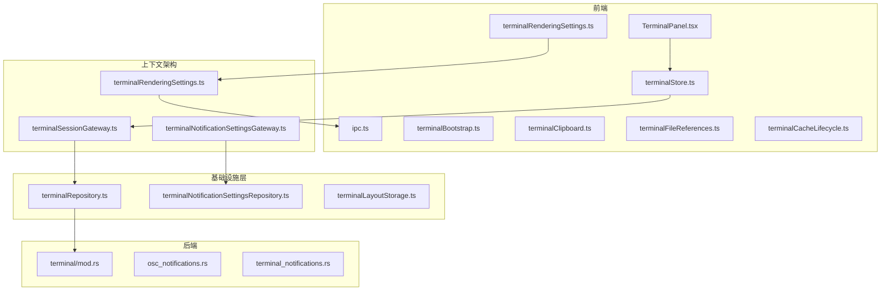
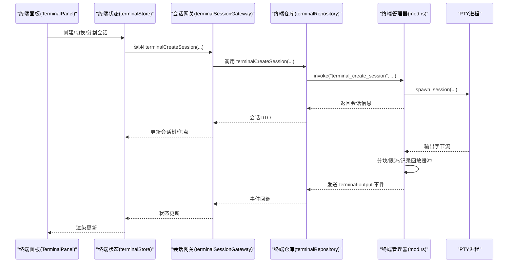
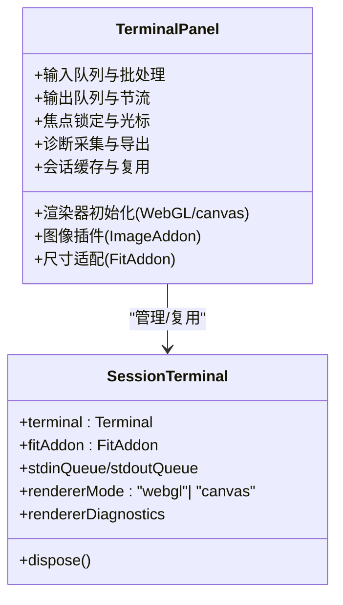
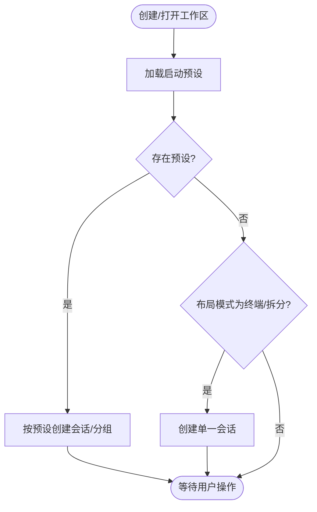
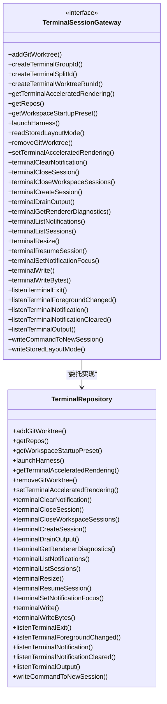
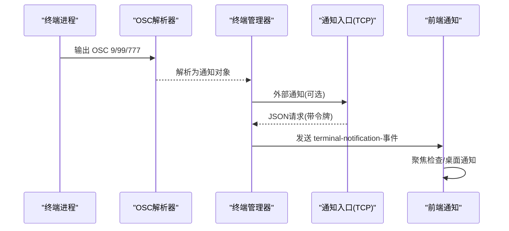
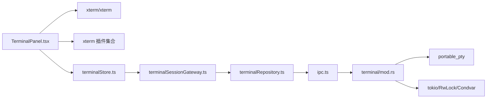

# 终端集成

<cite>
**本文引用的文件**
- [TerminalPanel.tsx](file://src/components/terminal/TerminalPanel.tsx)
- [terminalStore.ts](file://src/stores/terminalStore.ts)
- [terminalBootstrap.ts](file://src/lib/terminalBootstrap.ts)
- [terminalClipboard.ts](file://src/lib/terminalClipboard.ts)
- [terminalRenderingSettings.ts](file://src/lib/terminalRenderingSettings.ts)
- [terminalFileReferences.ts](file://src/lib/terminalFileReferences.ts)
- [terminalCacheLifecycle.ts](file://src/components/terminal/terminalCacheLifecycle.ts)
- [ipc.ts](file://src/lib/ipc.ts)
- [mod.rs](file://src-tauri/src/terminal/mod.rs)
- [osc_notifications.rs](file://src-tauri/src/terminal/osc_notifications.rs)
- [terminal_notifications.rs](file://src-tauri/src/terminal_notifications.rs)
- [terminalNotificationSettingsStore.ts](file://src/stores/terminalNotificationSettingsStore.ts)
- [types.ts](file://src/types.ts)
- [terminalSessionGateway.ts](file://src/contexts/terminal-sessions/application/terminalSessionGateway.ts)
- [terminalRenderingSettings.ts](file://src/contexts/terminal-sessions/application/terminalRenderingSettings.ts)
- [terminalNotificationSettingsStore.ts](file://src/contexts/terminal-sessions/application/terminalNotificationSettingsStore.ts)
- [terminalNotificationSettingsGateway.ts](file://src/contexts/terminal-sessions/application/terminalNotificationSettingsGateway.ts)
- [terminalRepository.ts](file://src/contexts/terminal-sessions/infrastructure/terminalRepository.ts)
- [terminalNotificationSettingsRepository.ts](file://src/contexts/terminal-sessions/infrastructure/terminalNotificationSettingsRepository.ts)
- [terminalLayoutStorage.ts](file://src/contexts/terminal-sessions/infrastructure/terminalLayoutStorage.ts)
- [terminalBootstrap.ts](file://src/contexts/terminal-sessions/domain/terminalBootstrap.ts)
- [terminalNotifications.ts](file://src/contexts/terminal-sessions/domain/terminalNotifications.ts)
- [terminalLayout.ts](file://src/contexts/terminal-sessions/domain/terminalLayout.ts)
- [terminalStartup.ts](file://src/contexts/terminal-sessions/domain/terminalStartup.ts)
</cite>

## 更新摘要
**所做更改**
- 更新了终端上下文架构重构为模块化设计的相关内容
- 新增了终端会话网关和基础设施层的详细说明
- 更新了通知系统的模块化架构描述
- 增强了会话管理和通知系统的边界分析
- 完善了终端功能的上下文分层架构说明

## 目录
1. [简介](#简介)
2. [项目结构](#项目结构)
3. [核心组件](#核心组件)
4. [架构总览](#架构总览)
5. [详细组件分析](#详细组件分析)
6. [依赖关系分析](#依赖关系分析)
7. [性能考量](#性能考量)
8. [故障排除指南](#故障排除指南)
9. [结论](#结论)
10. [附录](#附录)

## 简介
本文件系统性阐述 Panes 的终端集成功能，覆盖原生终端模拟器实现、PTY 系统集成、多会话管理、输入输出处理、通知系统、会话持久化、主题与字体配置、OSC 8 链接协议支持以及与 Git 的工作树联动等。文档以"前端 React 组件 + 后端 Rust 终端管理器"的双层架构为主线，结合 IPC 事件流与渲染诊断，帮助开发者与用户高效使用与优化终端体验。

**更新** 本版本重点介绍了终端功能采用新的上下文架构，terminal-sessions 上下文重构为模块化设计，支持更好的会话管理和通知系统。

## 项目结构
终端相关代码主要分布在以下位置：
- 前端组件与状态：src/components/terminal、src/stores/terminalStore.ts、src/lib/*
- 后端终端管理：src-tauri/src/terminal/mod.rs 及子模块
- 通知系统：src-tauri/src/terminal_notifications.rs、src/stores/terminalNotificationSettingsStore.ts
- 类型定义：src/types.ts
- **新增** 上下文架构：src/contexts/terminal-sessions/

**图示来源**
- [terminalSessionGateway.ts:1-122](file://src/contexts/terminal-sessions/application/terminalSessionGateway.ts#L1-L122)
- [terminalRepository.ts:122-184](file://src/contexts/terminal-sessions/infrastructure/terminalRepository.ts#L122-L184)
- [terminalRenderingSettings.ts:1-49](file://src/contexts/terminal-sessions/application/terminalRenderingSettings.ts#L1-L49)
- [terminalNotificationSettingsGateway.ts:1-33](file://src/contexts/terminal-sessions/application/terminalNotificationSettingsGateway.ts#L1-L33)
- [terminalNotificationSettingsRepository.ts:1-42](file://src/contexts/terminal-sessions/infrastructure/terminalNotificationSettingsRepository.ts#L1-L42)

**章节来源**
- [TerminalPanel.tsx:1-120](file://src/components/terminal/TerminalPanel.tsx#L1-L120)
- [terminalStore.ts:751-800](file://src/stores/terminalStore.ts#L751-L800)
- [ipc.ts:547-596](file://src/lib/ipc.ts#L547-L596)
- [mod.rs:385-429](file://src-tauri/src/terminal/mod.rs#L385-L429)

## 核心组件
- 终端面板组件（TerminalPanel）：负责 xterm 实例生命周期、渲染器选择（WebGL/canvas）、图像增强插件、输出队列与刷新控制、焦点锁定、尺寸适配与诊断导出。
- 终端状态存储（terminalStore）：维护工作区内的会话树、分组、布局模式、通知索引与水合状态、启动预设序列化/反序列化、会话元数据与工作树配置。
- **新增** 终端会话网关（terminalSessionGateway）：提供统一的会话管理接口，封装 IPC 调用和事件监听，支持工作区启动预设、会话创建、输出处理等功能。
- **新增** 终端渲染设置（terminalRenderingSettings）：通过上下文架构提供加速渲染偏好管理，支持事件监听和状态同步。
- **新增** 通知设置存储（terminalNotificationSettingsStore）：基于 Zustand 的状态管理，提供通知设置的加载、更新和预览功能。
- **新增** 通知设置网关（terminalNotificationSettingsGateway）：抽象通知设置的访问接口，支持聊天和终端通知的启用/禁用、声音设置等。
- **新增** 终端仓库（terminalRepository）：基础设施层实现，封装 IPC 调用和事件监听的具体实现。
- **新增** 通知设置仓库（terminalNotificationSettingsRepository）：基础设施层实现，提供通知设置的读写操作。
- 终端引导策略（terminalBootstrap）：根据监听器就绪、布局模式、会话数量等条件决定是否自动创建单一会话或应用启动预设。
- IPC 接口（ipc.ts）：封装后端命令调用（创建/写入/调整大小/关闭/列出会话/获取渲染诊断/恢复输出）与事件监听（输出、退出、前台进程变化、通知）。
- 后端终端管理器（mod.rs）：基于 portable_pty 的 PTY 子系统，管理会话生命周期、输出缓冲与节流、前台进程检测、会话重启回放、环境变量注入与通知入口。
- 通知系统（osc_notifications.rs、terminal_notifications.rs）：解析 OSC 8/9/99/777 通知、TCP 入口接收外部通知、桌面通知展示与聚焦感知。
- 渲染设置（terminalRenderingSettings.ts）：加速渲染偏好变更事件广播与订阅。
- 缓存与生命周期（terminalCacheLifecycle.ts）：分离/回收离线会话缓存、空闲驱逐策略。

**章节来源**
- [TerminalPanel.tsx:1-280](file://src/components/terminal/TerminalPanel.tsx#L1-L280)
- [terminalStore.ts:413-501](file://src/stores/terminalStore.ts#L413-L501)
- [terminalBootstrap.ts:13-44](file://src/lib/terminalBootstrap.ts#L13-L44)
- [terminalSessionGateway.ts:18-108](file://src/contexts/terminal-sessions/application/terminalSessionGateway.ts#L18-L108)
- [terminalRenderingSettings.ts:1-49](file://src/contexts/terminal-sessions/application/terminalRenderingSettings.ts#L1-L49)
- [terminalNotificationSettingsStore.ts:74-285](file://src/contexts/terminal-sessions/application/terminalNotificationSettingsStore.ts#L74-L285)
- [terminalNotificationSettingsGateway.ts:6-15](file://src/contexts/terminal-sessions/application/terminalNotificationSettingsGateway.ts#L6-L15)
- [terminalRepository.ts:122-184](file://src/contexts/terminal-sessions/infrastructure/terminalRepository.ts#L122-L184)
- [terminalNotificationSettingsRepository.ts:8-41](file://src/contexts/terminal-sessions/infrastructure/terminalNotificationSettingsRepository.ts#L8-L41)

## 架构总览
终端系统采用"前端 xterm + 上下文架构 + 后端 PTY"三层架构，通过 IPC 事件进行解耦。上下文架构提供清晰的分层设计，前端负责渲染与交互体验，上下文层负责业务逻辑和状态管理，后端负责 PTY 生命周期与输出节流，通知系统贯穿前后端，支持 OSC 协议与 TCP 入口两种来源。

**图示来源**
- [terminalSessionGateway.ts:44-49](file://src/contexts/terminal-sessions/application/terminalSessionGateway.ts#L44-L49)
- [terminalRepository.ts:133-142](file://src/contexts/terminal-sessions/infrastructure/terminalRepository.ts#L133-L142)
- [mod.rs:622-758](file://src-tauri/src/terminal/mod.rs#L622-L758)

## 详细组件分析

### 终端面板组件（TerminalPanel）
- xterm 实例与插件
  - 使用 FitAddon 自适应容器尺寸，Unicode11Addon 支持扩展字符集，WebglAddon 提升渲染性能，ImageAddon 支持 Sixel/IIP 图像。
  - 渲染器降级：当 WebGL 上下文丢失或不支持时自动降级为 canvas，并记录降级原因。
- 输入/输出队列与节流
  - 输入批处理：按字符限制与立即发送规则（含控制字符）合并发送，避免高频小包。
  - 输出节流：后台线程持续读取 PTY，前端定时器聚合输出，限制每帧最大字节数，防止 UI 冻结。
- 焦点与光标
  - 通过内部钩子强制终端处于"已聚焦"状态以保持闪烁光标，同时避免 onBlur 导致的光标停止。
- 诊断与运行快照
  - 前端/后端渲染诊断采集、运行时快照（输出队列长度、刷新计时器、丢弃统计等），支持导出用于排障。
- 会话缓存与复用
  - 模块级缓存保存 xterm 实例，跨工作区切换保留滚动历史；分离/回收离线会话，空闲超时驱逐。

**图示来源**
- [TerminalPanel.tsx:171-218](file://src/components/terminal/TerminalPanel.tsx#L171-L218)
- [TerminalPanel.tsx:646-720](file://src/components/terminal/TerminalPanel.tsx#L646-L720)
- [TerminalPanel.tsx:722-795](file://src/components/terminal/TerminalPanel.tsx#L722-L795)

**章节来源**
- [TerminalPanel.tsx:1-280](file://src/components/terminal/TerminalPanel.tsx#L1-L280)
- [TerminalPanel.tsx:281-550](file://src/components/terminal/TerminalPanel.tsx#L281-L550)
- [TerminalPanel.tsx:591-627](file://src/components/terminal/TerminalPanel.tsx#L591-L627)
- [TerminalPanel.tsx:646-795](file://src/components/terminal/TerminalPanel.tsx#L646-L795)

### 终端状态与多会话管理（terminalStore）
- 会话树与分组
  - SplitNode 树结构支持叶子节点与分割容器，构建平衡网格布局，支持水平/垂直方向与比例调节。
  - 组（TerminalGroup）可按 harness 维度聚合，提供显示 harness 名称与同质性判断。
- 通知与水合
  - 通知按会话索引，支持"触达所有/指定会话"两种水合策略，避免过期通知。
- 启动预设
  - 序列化/反序列化工作区启动预设，支持按预设一次性创建多会话、分组与布局；支持工作树配置。
- 工作树联动
  - 推断工作树基路径与分支前缀，批量移除工作树失败收集。

**图示来源**
- [terminalStore.ts:751-797](file://src/stores/terminalStore.ts#L751-L797)
- [terminalBootstrap.ts:13-44](file://src/lib/terminalBootstrap.ts#L13-L44)

**章节来源**
- [terminalStore.ts:41-121](file://src/stores/terminalStore.ts#L41-L121)
- [terminalStore.ts:184-224](file://src/stores/terminalStore.ts#L184-L224)
- [terminalStore.ts:279-411](file://src/stores/terminalStore.ts#L279-L411)
- [terminalStore.ts:640-668](file://src/stores/terminalStore.ts#L640-L668)
- [terminalBootstrap.ts:13-44](file://src/lib/terminalBootstrap.ts#L13-L44)

### 终端会话网关与基础设施层
- **新增** 会话网关接口
  - 提供统一的会话管理方法，包括会话创建、关闭、输出处理、通知管理等。
  - 支持工作区启动预设的获取和应用，支持 Git 工作树的添加和移除。
- **新增** 终端仓库实现
  - 封装 IPC 调用，提供会话列表、输出监听、通知监听等具体实现。
  - 支持事件监听的注册和注销，提供异步操作的错误处理。
- **新增** 通知设置网关
  - 抽象通知设置的访问接口，支持聊天和终端通知的启用/禁用。
  - 提供通知声音设置和预览功能，支持通知集成的安装。
- **新增** 通知设置仓库
  - 基于 IPC 实现通知设置的具体操作，包括获取、设置和预览。
  - 支持通知集成的安装和状态查询。

**图示来源**
- [terminalSessionGateway.ts:18-108](file://src/contexts/terminal-sessions/application/terminalSessionGateway.ts#L18-L108)
- [terminalRepository.ts:122-184](file://src/contexts/terminal-sessions/infrastructure/terminalRepository.ts#L122-L184)

**章节来源**
- [terminalSessionGateway.ts:18-108](file://src/contexts/terminal-sessions/application/terminalSessionGateway.ts#L18-L108)
- [terminalRepository.ts:122-184](file://src/contexts/terminal-sessions/infrastructure/terminalRepository.ts#L122-L184)
- [terminalNotificationSettingsGateway.ts:6-15](file://src/contexts/terminal-sessions/application/terminalNotificationSettingsGateway.ts#L6-L15)
- [terminalNotificationSettingsRepository.ts:8-41](file://src/contexts/terminal-sessions/infrastructure/terminalNotificationSettingsRepository.ts#L8-L41)

### 通知系统与 OSC 协议（osc_notifications.rs、terminal_notifications.rs）
- OSC 通知解析
  - 支持 OSC 9/99/777 通知格式，解析标题/正文，Kitty 片段式通知支持 Base64 解码与片段合并。
- TCP 入口
  - 启动本地 TCP 监听，生成一次性令牌，接收外部进程通知并通过 IPC 推送到前端。
- 前端展示与聚焦感知
  - 当目标会话/窗口处于聚焦时，优先清除通知而非弹窗，避免打扰；支持桌面通知与声音。
- 集成安装
  - 提供安装 Claude/Codex 通知集成的命令与状态查询，统一在设置面板中管理。

**图示来源**
- [osc_notifications.rs:146-215](file://src-tauri/src/terminal/osc_notifications.rs#L146-L215)
- [osc_notifications.rs:217-277](file://src-tauri/src/terminal/osc_notifications.rs#L217-L277)
- [terminal_notifications.rs:219-500](file://src-tauri/src/terminal_notifications.rs#L219-L500)
- [terminal_notifications.rs:592-643](file://src-tauri/src/terminal_notifications.rs#L592-L643)

**章节来源**
- [osc_notifications.rs:1-60](file://src-tauri/src/terminal/osc_notifications.rs#L1-L60)
- [osc_notifications.rs:146-277](file://src-tauri/src/terminal/osc_notifications.rs#L146-L277)
- [terminal_notifications.rs:70-125](file://src-tauri/src/terminal_notifications.rs#L70-L125)
- [terminal_notifications.rs:219-500](file://src-tauri/src/terminal_notifications.rs#L219-L500)
- [terminalNotificationSettingsStore.ts:105-312](file://src/stores/terminalNotificationSettingsStore.ts#L105-L312)

### 输入输出处理与剪贴板快捷键（terminalClipboard.ts、TerminalPanel）
- 快捷键识别
  - 识别终端复制/粘贴快捷键组合，区分平台差异（如 Insert 触发粘贴）。
- 输入批处理
  - 控制字符触发立即发送，长文本按字符边界截断，避免 UTF-16 代理项被截断。
- 输出刷新
  - 前端定时器与后端节流协同，避免 UI 卡顿；支持"输出拉取"以满足高吞吐场景。

**章节来源**
- [terminalClipboard.ts:9-39](file://src/lib/terminalClipboard.ts#L9-L39)
- [TerminalPanel.tsx:552-589](file://src/components/terminal/TerminalPanel.tsx#L552-L589)
- [TerminalPanel.tsx:591-627](file://src/components/terminal/TerminalPanel.tsx#L591-L627)

### 会话持久化与缓存生命周期（terminalCacheLifecycle.ts、TerminalPanel）
- 分离标记
  - 切换工作区/面板导致监听器断开时，标记会话为"分离"，需要重放输出。
- 空闲驱逐
  - 按分离时间排序，超过阈值的离线会话被回收，释放内存。
- 缓存复用
  - xterm 实例模块级缓存，保留滚动历史，提升切换体验。

**章节来源**
- [terminalCacheLifecycle.ts:15-74](file://src/components/terminal/terminalCacheLifecycle.ts#L15-L74)
- [TerminalPanel.tsx:284-337](file://src/components/terminal/TerminalPanel.tsx#L284-L337)

### 主题与字体配置（terminalRenderingSettings.ts、TerminalPanel）
- 加速渲染偏好
  - 前端监听"加速渲染变更"事件，动态启用/禁用 WebGL 与图像插件，必要时降级为 canvas。
- 前端渲染诊断
  - 记录 WebGL 初始化/上下文丢失次数、图像插件初始化结果、输出丢弃统计等，支持导出诊断。

**章节来源**
- [terminalRenderingSettings.ts:14-36](file://src/lib/terminalRenderingSettings.ts#L14-L36)
- [TerminalPanel.tsx:463-498](file://src/components/terminal/TerminalPanel.tsx#L463-L498)
- [TerminalPanel.tsx:722-795](file://src/components/terminal/TerminalPanel.tsx#L722-L795)

### 与 Git 集成的工作树联动（terminalStore.ts、mod.rs）
- 工作树推断
  - 根据会话元数据推断工作树基路径与分支前缀，支持批量删除失败收集。
- 启动路径解析
  - 支持绝对路径、工作区根、工作树三种 CWD 来源，自动回退到工作区根。

**章节来源**
- [terminalStore.ts:640-668](file://src/stores/terminalStore.ts#L640-L668)
- [terminalStore.ts:696-711](file://src/stores/terminalStore.ts#L696-L711)
- [mod.rs:1508-1713](file://src-tauri/src/terminal/mod.rs#L1508-L1713)

## 依赖关系分析
- 前端依赖
  - @xterm/* 插件生态（fit/unicode/webgl/image）
  - IPC 封装与事件监听
  - Zustand 状态管理
- **新增** 上下文层依赖
  - 终端会话网关提供统一接口，避免直接依赖 IPC
  - 终端渲染设置通过上下文层管理加速渲染偏好
  - 通知设置存储通过网关接口访问后端功能
- 后端依赖
  - portable_pty 进行 PTY 创建与读写
  - tokio 异步运行时与条件变量
  - serde/chrono/uuid 等工具库

**图示来源**
- [TerminalPanel.tsx:32-50](file://src/components/terminal/TerminalPanel.tsx#L32-L50)
- [terminalSessionGateway.ts:18-108](file://src/contexts/terminal-sessions/application/terminalSessionGateway.ts#L18-L108)
- [terminalRepository.ts:122-184](file://src/contexts/terminal-sessions/infrastructure/terminalRepository.ts#L122-L184)
- [ipc.ts:72-120](file://src/lib/ipc.ts#L72-L120)
- [mod.rs:17-21](file://src-tauri/src/terminal/mod.rs#L17-L21)

**章节来源**
- [TerminalPanel.tsx:32-50](file://src/components/terminal/TerminalPanel.tsx#L32-L50)
- [terminalSessionGateway.ts:18-108](file://src/contexts/terminal-sessions/application/terminalSessionGateway.ts#L18-L108)
- [terminalRepository.ts:122-184](file://src/contexts/terminal-sessions/infrastructure/terminalRepository.ts#L122-L184)
- [ipc.ts:72-120](file://src/lib/ipc.ts#L72-L120)
- [mod.rs:17-21](file://src-tauri/src/terminal/mod.rs#L17-L21)

## 性能考量
- 输出节流
  - 后端每帧最多发射固定字节数，前端定时器聚合，避免 UI 卡顿与 IPC 抖动。
- 输入批处理
  - 控制字符立即发送，长文本按边界截断，减少队列碎片。
- 渲染器选择
  - 自动启用 WebGL 并监控上下文丢失，降级至 canvas 保证稳定性。
- 会话缓存
  - 模块级缓存复用 xterm 实例，降低重建成本；离线会话空闲驱逐释放内存。
- 诊断指标
  - 输出丢弃计数、刷新计时器、队列长度、峰值缓冲等指标，辅助定位瓶颈。
- **新增** 上下文层优化
  - 通过网关接口减少直接 IPC 调用，提高代码可测试性和维护性。

**章节来源**
- [mod.rs:649-758](file://src-tauri/src/terminal/mod.rs#L649-L758)
- [TerminalPanel.tsx:242-266](file://src/components/terminal/TerminalPanel.tsx#L242-L266)
- [TerminalPanel.tsx:722-795](file://src/components/terminal/TerminalPanel.tsx#L722-L795)

## 故障排除指南
- 终端无输出或卡顿
  - 检查前端渲染诊断中的"输出丢弃统计/刷新计时器状态"，确认是否因节流或队列积压导致。
  - 在 macOS/Linux 上尝试禁用加速渲染，切换到 canvas 渲染验证问题是否与 WebGL 相关。
- 前台进程未更新
  - 确认后端前台检测是否正常，查看"前台变更"事件是否推送；部分非 shell 进程可能无法检测。
- 通知未弹窗
  - 若目标会话/窗口处于聚焦，系统会清除通知而非弹窗；检查聚焦状态与通知设置。
- OSC 通知未生效
  - 确认终端进程输出的 OSC 格式（9/99/777），检查解析器日志与 Base64 解码；外部 TCP 通知需正确携带令牌。
- 会话无法恢复
  - 检查"回放缓冲"是否包含所需序号范围；若超出上限或已清理，需重新执行命令或手动重放。
- **新增** 上下文层问题
  - 检查终端会话网关是否正确配置，确认 IPC 调用是否正常；查看基础设施层的错误日志。

**章节来源**
- [TerminalPanel.tsx:463-498](file://src/components/terminal/TerminalPanel.tsx#L463-L498)
- [mod.rs:649-758](file://src-tauri/src/terminal/mod.rs#L649-L758)
- [terminal_notifications.rs:219-500](file://src-tauri/src/terminal_notifications.rs#L219-L500)
- [osc_notifications.rs:146-215](file://src-tauri/src/terminal/osc_notifications.rs#L146-L215)

## 结论
该终端系统通过"前端 xterm + 上下文架构 + 后端 PTY"的三层清晰分层，实现了高性能、可诊断、可扩展的终端体验。新的上下文架构重构为模块化设计，terminal-sessions 上下文提供了更好的会话管理和通知系统。前端负责渲染与交互，上下文层负责业务逻辑和状态管理，后端专注 PTY 生命周期与输出节流，通知系统打通 OSC 与 TCP 两条通道，配合会话缓存与工作树联动，满足多会话、多工作区的复杂使用场景。建议在高吞吐场景下启用加速渲染并在出现异常时利用诊断导出来定位问题。

## 附录
- 使用技巧
  - 使用 Ctrl+Shift+C/V 或 Shift+Insert 触发复制/粘贴，避免与系统快捷键冲突。
  - 在终端面板右上角可开启"广播输入"，将输入同步到同一组的所有会话。
  - 启用"Git 工作树"可在多个分支/工作树间快速切换，配合启动预设一键还原。
  - **新增** 利用上下文架构的网关接口，可以更好地管理会话和通知设置。
- 常见问题
  - Windows 下 PATH/用户目录缺失：后端会自动补齐，若仍异常请检查环境变量注入逻辑。
  - WebGL 不可用：系统自动降级为 canvas，不影响功能但可能影响性能。
  - **新增** 上下文层配置问题：确保终端会话网关正确配置，检查 IPC 调用链路。