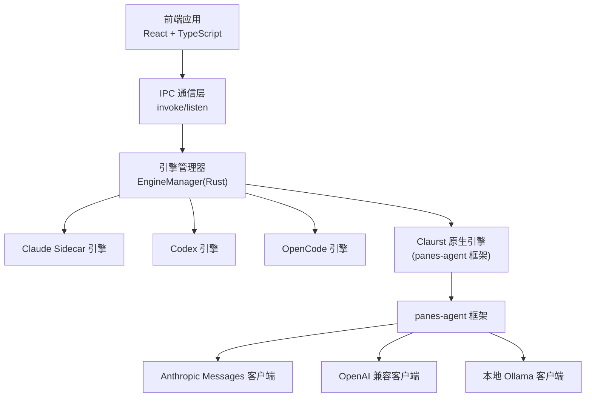
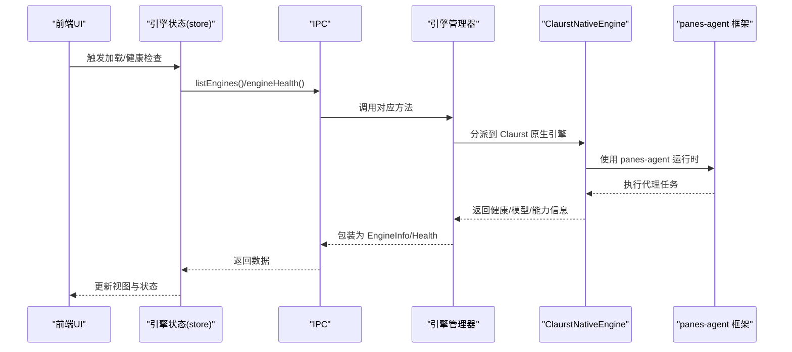
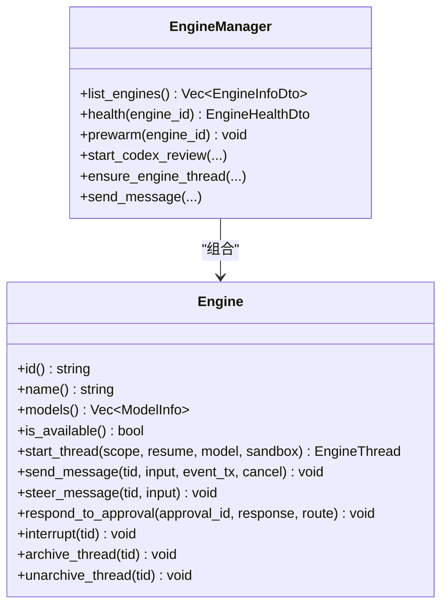
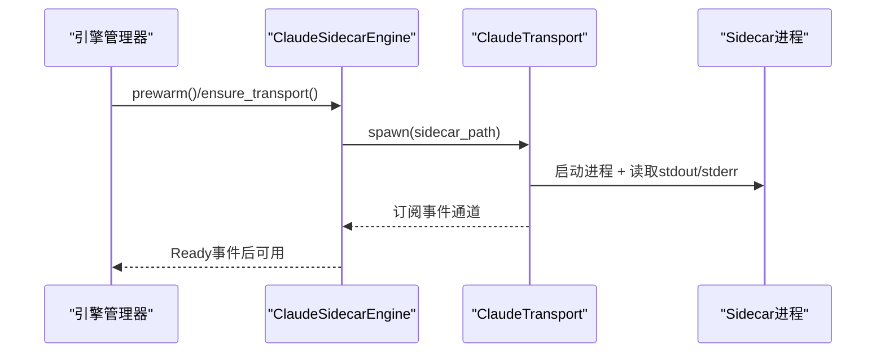
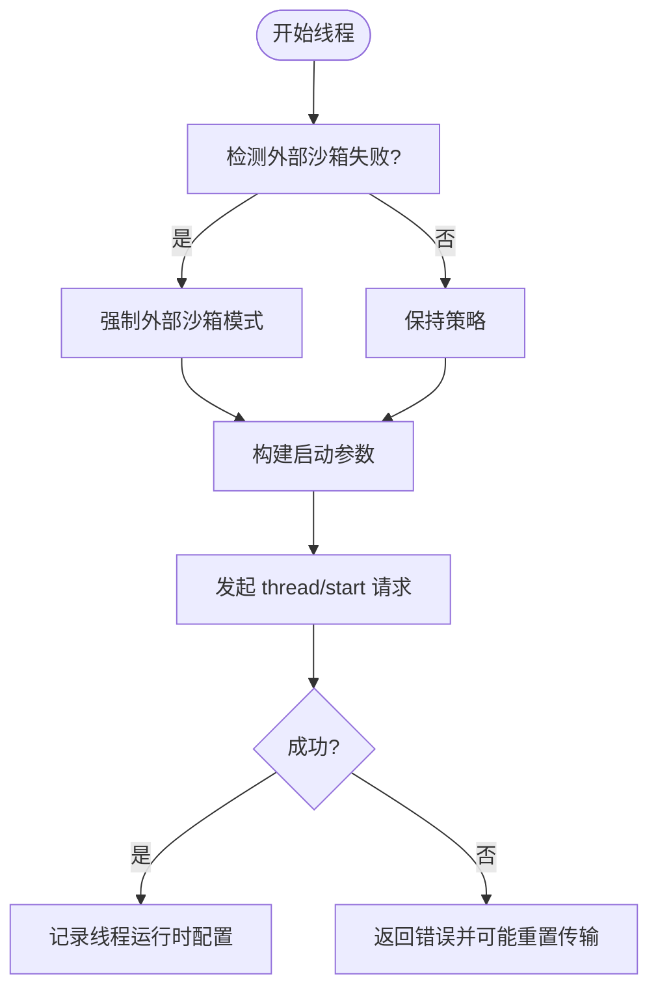
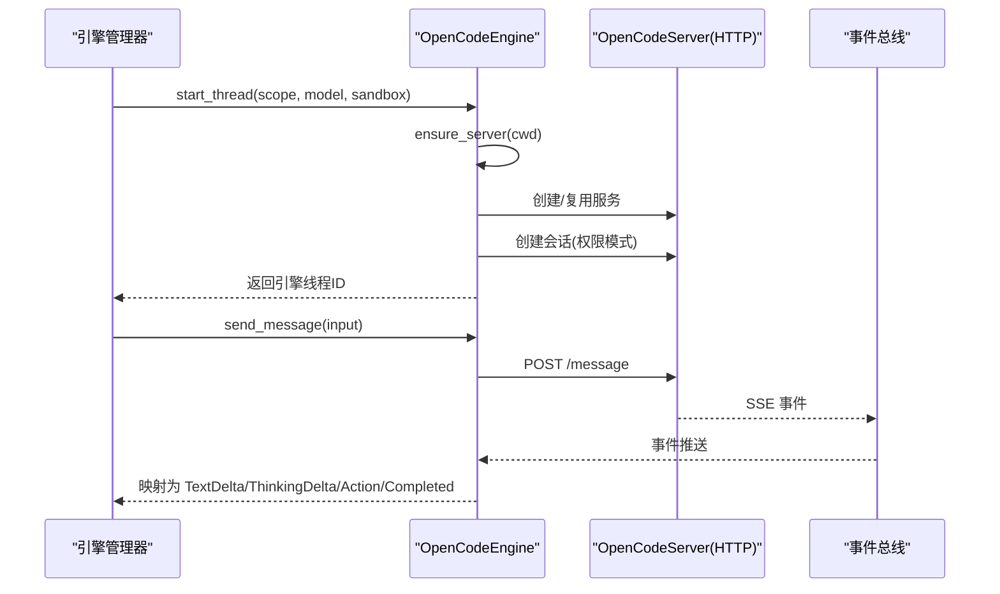
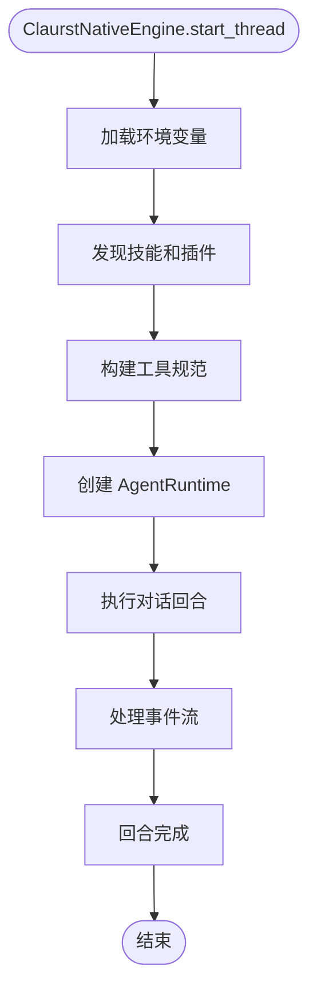
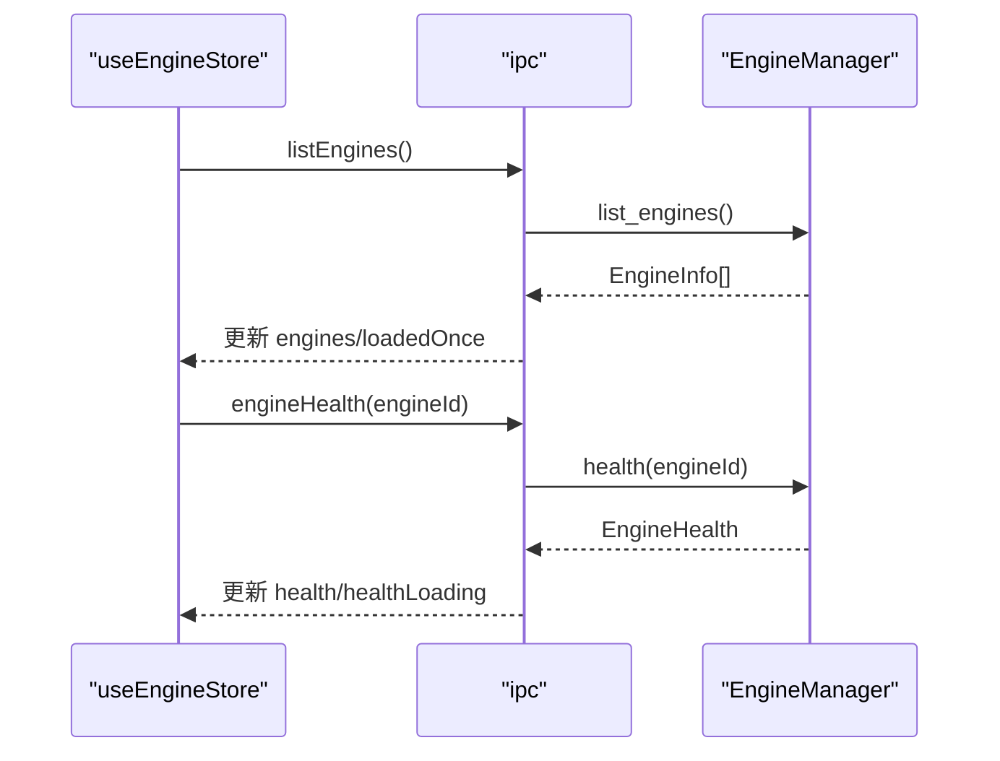
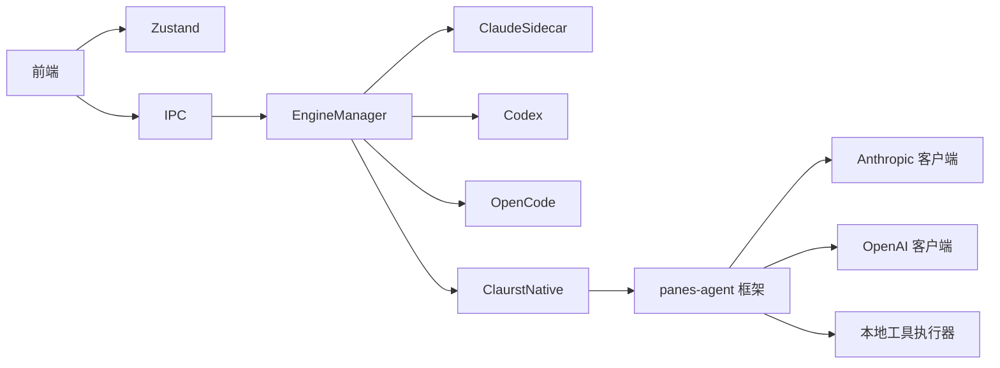

# AI 引擎管理系统

<cite>
**本文档引用的文件**
- [engineStore.ts](file://src/stores/engineStore.ts)
- [engineCapabilities.ts](file://src/components/chat/engineCapabilities.ts)
- [mod.rs](file://src-tauri/src/engines/mod.rs)
- [claurst_native.rs](file://src-tauri/src/engines/claurst_native.rs)
- [ipc.ts](file://src/lib/ipc.ts)
- [lib.rs](file://crates/panes-agent/src/lib.rs)
- [README.md](file://vendor/claurst/README.md)
</cite>

## 更新摘要
**所做更改**
- 新增 Claurst 原生引擎章节，替代原有的 Claude Code Native 引擎
- 更新引擎架构图，反映 panes-agent 通用代理运行时框架
- 新增多提供商适配和增强工具系统的技术规范
- 更新健康检查和生命周期管理章节，包含新的引擎能力
- 新增 panes-agent 框架的详细技术说明

## 目录
1. [引言](#引言)
2. [项目结构](#项目结构)
3. [核心组件](#核心组件)
4. [架构总览](#架构总览)
5. [详细组件分析](#详细组件分析)
6. [依赖关系分析](#依赖关系分析)
7. [性能考虑](#性能考虑)
8. [故障排除指南](#故障排除指南)
9. [结论](#结论)

## 引言
本文件面向 AI 引擎管理系统的开发者与维护者，系统性阐述引擎抽象层设计、生命周期管理、健康检查机制、多引擎集成方案（Claude Sidecar、Codex、OpenCode、Claude Code Native 已废弃，Claurst 原生引擎）、能力检测与动态切换、性能监控与资源统计、错误处理与故障恢复策略，以及扩展点与自定义引擎集成指南。内容基于前端 Zustand 状态管理、IPC 通信与 Rust 后端引擎实现的完整代码库进行提炼与总结。

**更新** Claude Code Native 引擎已被废弃，新的 Claurst 原生引擎采用 panes-agent 通用代理运行时框架，支持多提供商适配和增强的工具系统。

## 项目结构
系统采用前后端分离的架构：
- 前端（React + TypeScript）通过 IPC 与后端交互，负责 UI 展示、状态管理与事件订阅。
- 后端（Rust）实现统一的引擎抽象接口，封装不同引擎的协议、传输与生命周期管理。
- 新增 panes-agent crate 提供通用代理运行时框架，支持多提供商适配。

**图表来源**
- [ipc.ts:336-345](file://src/lib/ipc.ts#L336-L345)
- [mod.rs:463-468](file://src-tauri/src/engines/mod.rs#L463-L468)
- [lib.rs:1-18](file://crates/panes-agent/src/lib.rs#L1-L18)

**章节来源**
- [ipc.ts:336-345](file://src/lib/ipc.ts#L336-L345)
- [mod.rs:463-468](file://src-tauri/src/engines/mod.rs#L463-L468)
- [lib.rs:1-18](file://crates/panes-agent/src/lib.rs#L1-L18)

## 核心组件
- 引擎状态管理（前端）
  - 使用 Zustand 管理引擎列表、健康状态、加载与错误状态，并提供健康检查、合并报告与运行时更新应用等方法。
- 引擎能力与沙箱策略
  - 统一的能力模型（权限模式、沙箱模式、审批决策）与默认回退策略，确保跨引擎一致性。
- IPC 接口
  - 提供 listEngines、engineHealth、prewarmEngine、sendMessage、respondToApproval 等核心 RPC 方法，以及事件监听通道。
- 引擎抽象与实现（后端）
  - Engine trait 抽象统一的生命周期与消息处理接口；各引擎实现具体协议与传输细节。
- panes-agent 框架
  - 提供通用代理运行时，支持多提供商适配、工具系统和权限管理。

**章节来源**
- [engineStore.ts:1-3](file://src/stores/engineStore.ts#L1-L3)
- [engineCapabilities.ts:15-19](file://src/components/chat/engineCapabilities.ts#L15-L19)
- [ipc.ts:336-403](file://src/lib/ipc.ts#L336-L403)
- [lib.rs:12-17](file://crates/panes-agent/src/lib.rs#L12-L17)

## 架构总览
引擎管理采用"统一抽象 + 多实现"的设计：
- 前端通过 IPC 调用后端引擎管理器，后端根据引擎 ID 分发至对应实现。
- 各引擎负责自身健康检查、预热、线程生命周期与消息流处理。
- 健康状态与运行时诊断通过事件通道回传前端，驱动 UI 与策略调整。
- 新的 Claurst 原生引擎通过 panes-agent 框架提供统一的代理运行时。

**图表来源**
- [ipc.ts:336-345](file://src/lib/ipc.ts#L336-L345)
- [mod.rs:484-615](file://src-tauri/src/engines/mod.rs#L484-L615)
- [claurst_native.rs:118-195](file://src-tauri/src/engines/claurst_native.rs#L118-L195)

**章节来源**
- [ipc.ts:336-403](file://src/lib/ipc.ts#L336-L403)
- [mod.rs:484-615](file://src-tauri/src/engines/mod.rs#L484-L615)
- [claurst_native.rs:118-195](file://src-tauri/src/engines/claurst_native.rs#L118-L195)

## 详细组件分析

### 引擎抽象与生命周期（后端）
- Engine trait
  - 统一接口：id、name、models、is_available、start_thread、send_message、steer_message、respond_to_approval、interrupt、archive/unarchive。
  - 用于屏蔽不同引擎的协议差异，保证上层调用一致。
- EngineManager
  - 维护多个引擎实例，提供 list_engines、health、prewarm、线程操作与远程会话管理等聚合方法。
  - 支持特性开关（如非原生 harnesses）以控制引擎暴露范围。
  - 新增对 Claurst 原生引擎的支持，提供统一的引擎 ID 别名映射。

**图表来源**
- [mod.rs:419-461](file://src-tauri/src/engines/mod.rs#L419-L461)
- [mod.rs:463-793](file://src-tauri/src/engines/mod.rs#L463-L793)

**章节来源**
- [mod.rs:419-461](file://src-tauri/src/engines/mod.rs#L419-L461)
- [mod.rs:463-793](file://src-tauri/src/engines/mod.rs#L463-L793)

### Claude Sidecar 引擎
- 传输与进程管理
  - 通过 Node.js 进程托管 Sidecar，标准输入输出与广播事件通道实现事件解码与分发。
  - 两阶段初始化：先获取 transport，再等待 Ready 事件，避免竞态。
- 健康检查
  - 检测 Node.js 可用性、侧车脚本存在性与 API Key 设置情况，生成 checks/warnings/fixes。
- 生命周期
  - 预热（prewarm）等待 Ready；线程启动与消息发送通过 Sidecar 协议完成；异常时可重启进程。
- 审批与动作
  - 支持 ApprovalRequested 事件，映射为 UI 审批块；动作类型与输出流解析完善。

**图表来源**
- [mod.rs:517-596](file://src-tauri/src/engines/mod.rs#L517-L596)
- [mod.rs:186-290](file://src-tauri/src/engines/mod.rs#L186-L290)

**章节来源**
- [mod.rs:517-596](file://src-tauri/src/engines/mod.rs#L517-L596)
- [mod.rs:633-702](file://src-tauri/src/engines/mod.rs#L633-L702)

### Codex 引擎
- 传输与协议
  - 基于自定义协议的消息往返，支持 initialize、thread/*、turn/* 等方法族。
  - 传输层具备重试与背压策略，支持速率限制查询与事件映射。
- 线程与会话
  - 支持 thread/start、thread/resume、thread/read、thread/archive/unarchive 等。
  - 附件大小与数量限制，计划模式与原生计划模式协同。
- 审批与权限
  - 服务器端请求（如外部认证刷新）会被拒绝并上报错误；支持外部沙箱模式探测与强制。
- 健康检查
  - 通过可执行文件解析与超时探测，生成健康报告与诊断信息。

**图表来源**
- [mod.rs:385-522](file://src-tauri/src/engines/mod.rs#L385-L522)
- [mod.rs:416-427](file://src-tauri/src/engines/mod.rs#L416-L427)

**章节来源**
- [mod.rs:385-522](file://src-tauri/src/engines/mod.rs#L385-L522)
- [mod.rs:158-167](file://src-tauri/src/engines/mod.rs#L158-L167)

### OpenCode 引擎
- 服务与会话
  - 每个工作目录独立启动 HTTP 服务，基于 SSE 推送事件；会话与服务器绑定，支持权限模式（ask/allow/deny）。
  - 会话复用与权限匹配，避免重复创建。
- 消息与事件
  - 通过 HTTP 发送提示，持续订阅事件总线，映射为文本增量、思考增量、动作与完成事件。
  - 空闲超时保护，长时间无事件自动完成回合。
- 健康检查
  - 通过可执行文件解析与超时探测，生成健康报告。

**图表来源**
- [mod.rs:582-684](file://src-tauri/src/engines/mod.rs#L582-L684)
- [mod.rs:687-800](file://src-tauri/src/engines/mod.rs#L687-L800)

**章节来源**
- [mod.rs:582-684](file://src-tauri/src/engines/mod.rs#L582-L684)
- [mod.rs:687-800](file://src-tauri/src/engines/mod.rs#L687-L800)

### Claurst 原生引擎（panes-agent 框架）
**更新** Claude Code Native 引擎已废弃，新的 Claurst 原生引擎采用 panes-agent 通用代理运行时框架，提供多提供商适配和增强的工具系统。

- 通用代理运行时框架
  - 基于 panes-agent crate 提供的通用代理运行时，支持多提供商适配（Anthropic、OpenAI、OpenRouter、Ollama）。
  - 内置权限管理、工具执行、系统上下文和对话管理功能。
- 多提供商适配
  - 支持 Anthropic Messages API、OpenAI 兼容 API、OpenRouter API 和本地 Ollama 服务。
  - 动态模型发现与选择，支持多种推理模型。
- 增强工具系统
  - 集成原生工具执行器，支持文件读写、搜索、命令执行等操作。
  - 支持 CueLight 项目工具集成，提供项目特定的工具能力。
  - 插件和技能系统，支持动态扩展工具功能。
- 权限与沙箱控制
  - 基于 AgentAccessLevel 的权限控制，支持只读、搜索和全权限模式。
  - 沙箱模式控制工具执行范围，防止越权操作。
- 生命周期管理
  - 线程状态管理，支持会话恢复和状态持久化。
  - 审批请求处理，支持用户交互式权限控制。
  - 取消和中断处理，确保资源正确释放。

**图表来源**
- [claurst_native.rs:167-195](file://src-tauri/src/engines/claurst_native.rs#L167-L195)
- [claurst_native.rs:197-345](file://src-tauri/src/engines/claurst_native.rs#L197-L345)

**章节来源**
- [claurst_native.rs:50-97](file://src-tauri/src/engines/claurst_native.rs#L50-L97)
- [claurst_native.rs:118-195](file://src-tauri/src/engines/claurst_native.rs#L118-L195)
- [claurst_native.rs:197-345](file://src-tauri/src/engines/claurst_native.rs#L197-L345)

### 前端引擎状态与健康检查
- 状态管理
  - 加载引擎列表、并发健康检查去重、健康加载状态管理、运行时更新合并与审批响应路由。
- 能力与沙箱
  - 基于引擎 ID 的能力回退策略，支持权限模式、沙箱模式与审批决策的统一解析。
  - 新增对 Claurst 原生引擎的能力支持，提供统一的引擎 ID 别名。
- IPC 与事件
  - 列举引擎、健康检查、预热、发送消息、响应审批、运行时更新事件监听。

**图表来源**
- [engineStore.ts:29-57](file://src/stores/engineStore.ts#L29-L57)
- [engineStore.ts:58-115](file://src/stores/engineStore.ts#L58-L115)
- [ipc.ts:336-345](file://src/lib/ipc.ts#L336-L345)

**章节来源**
- [engineStore.ts:29-115](file://src/stores/engineStore.ts#L29-L115)
- [engineCapabilities.ts:33-47](file://src/components/chat/engineCapabilities.ts#L33-L47)
- [ipc.ts:336-403](file://src/lib/ipc.ts#L336-L403)

## 依赖关系分析
- 前端依赖
  - Zustand 状态管理、IPC 通信、类型定义与能力解析模块。
- 后端依赖
  - async-trait、tokio、serde、uuid 等异步与序列化工具；各引擎内部依赖特定 SDK 或库（如 claude-code-rs）。
  - 新增 panes-agent crate 作为通用代理运行时框架。
- 引擎间耦合
  - 通过 Engine trait 低耦合；EngineManager 作为编排中心，避免引擎间直接耦合。
  - panes-agent 框架提供统一的运行时接口，简化引擎集成。

**图表来源**
- [engineStore.ts:1-19](file://src/stores/engineStore.ts#L1-L19)
- [ipc.ts:1-70](file://src/lib/ipc.ts#L1-L70)
- [mod.rs:1-36](file://src-tauri/src/engines/mod.rs#L1-L36)
- [lib.rs:12-17](file://crates/panes-agent/src/lib.rs#L12-L17)

**章节来源**
- [engineStore.ts:1-19](file://src/stores/engineStore.ts#L1-L19)
- [ipc.ts:1-70](file://src/lib/ipc.ts#L1-L70)
- [mod.rs:1-36](file://src-tauri/src/engines/mod.rs#L1-L36)
- [lib.rs:12-17](file://crates/panes-agent/src/lib.rs#L12-L17)

## 性能考虑
- 启动与预热
  - Claude Sidecar 与 OpenCode 在首次使用前进行预热，减少首帧延迟；Codex 与 Claurst 原生通过快速可用性判断与缓存模型列表提升体验。
- 事件与流式处理
  - 各引擎均采用事件/流式推送，前端按需渲染，降低内存占用；OpenCode 通过 SSE 空闲超时避免资源泄露。
- 资源限制
  - 工具输出截断、附件大小与数量限制、最大命令执行时间，防止资源耗尽。
- 并发与去重
  - 健康检查请求去重、事件合并与状态原子更新，避免重复计算与竞态。
- panes-agent 框架优化
  - 内存高效的数据结构设计，减少不必要的对象分配。
  - 异步执行模型，充分利用多核处理器性能。

## 故障排除指南
- 健康检查失败
  - Claude Sidecar：检查 Node.js 可用性、侧车脚本存在与 API Key 设置；按建议修复命令或环境变量。
  - Codex：检查可执行文件解析与传输可用性；关注认证相关错误并重置传输。
  - OpenCode：检查可执行文件解析与服务启动超时；确认工作目录权限与网络可达。
  - Claurst 原生：检查 ANTHROPIC_API_KEY 等提供商凭据设置；验证网络连接和 API 可用性。
- 审批与权限问题
  - Claude/OpenCode：审批响应标准化与路由提取，确保 UI 正确展示与回传。
  - Codex：外部认证令牌刷新请求会被拒绝并提示；注意沙箱模式与权限策略。
  - Claurst 原生：权限网关处理用户审批请求，支持会话级自动放行。
- 传输与协议
  - Codex：传输失败时会重置并上报错误；关注通知与请求归属校验。
  - OpenCode：SSE 空闲超时会触发回合完成；注意事件总线滞后处理。
- 前端状态
  - 健康加载状态与错误信息同步更新；运行时诊断事件合并应用，确保 UI 与后端状态一致。
- panes-agent 框架问题
  - 工具执行失败：检查工具规范和权限配置；验证工作目录访问权限。
  - 模型客户端连接问题：确认提供商凭据和网络连接；检查 API 限制和配额。

**章节来源**
- [mod.rs:618-653](file://src-tauri/src/engines/mod.rs#L618-L653)
- [claurst_native.rs:468-520](file://src-tauri/src/engines/claurst_native.rs#L468-L520)
- [engineStore.ts:58-133](file://src/stores/engineStore.ts#L58-L133)

## 结论
本系统通过统一的引擎抽象与多实现架构，实现了对 Claude Sidecar、Codex、OpenCode、Claude Code Native（已废弃）和 Claurst 原生引擎的一体化管理。前端以 IPC 与状态管理为核心，后端以 EngineManager 为编排中心，结合健康检查、预热、审批与事件流，提供了稳定、可观测且可扩展的 AI 引擎平台。

**更新** 新的 Claurst 原生引擎采用 panes-agent 通用代理运行时框架，显著提升了系统的可扩展性和维护性。该框架支持多提供商适配、增强的工具系统和灵活的权限控制，为未来的功能扩展奠定了坚实基础。

未来可在 Engine trait 上扩展新引擎，或在 EngineManager 中增加新的编排逻辑，以满足更多使用场景。panes-agent 框架的引入使得新引擎的集成更加标准化，降低了开发和维护成本。