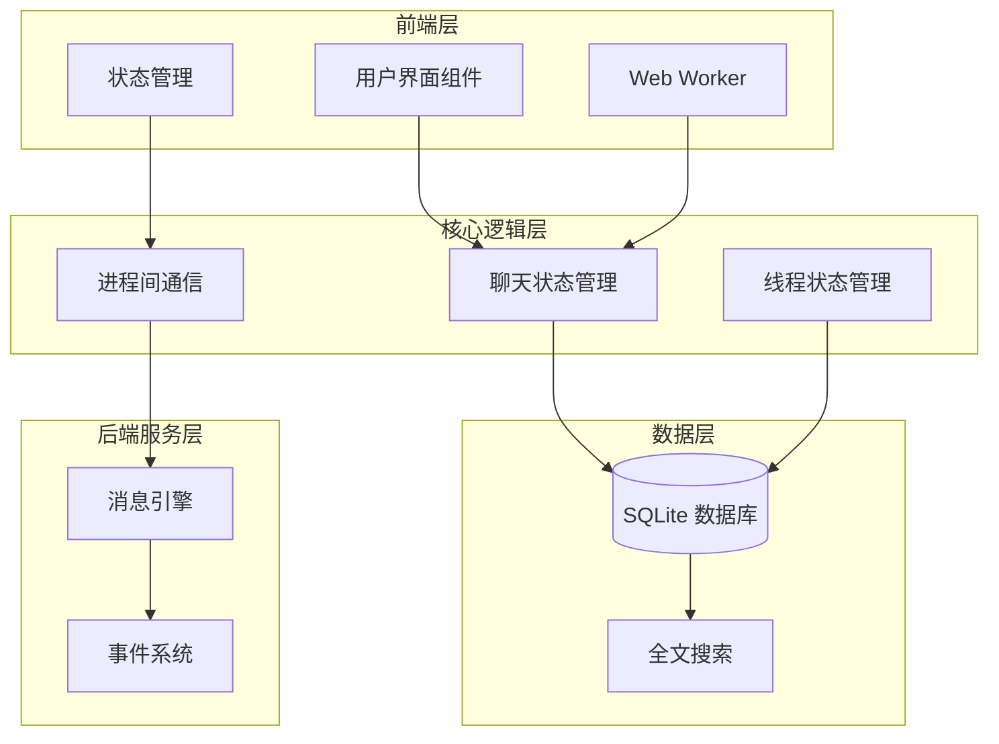
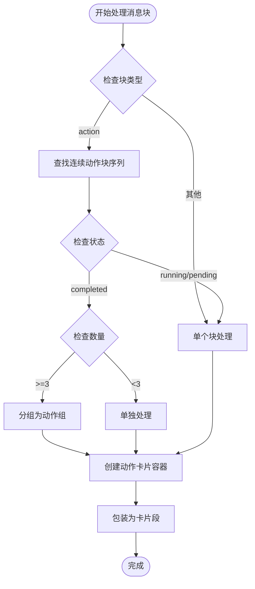
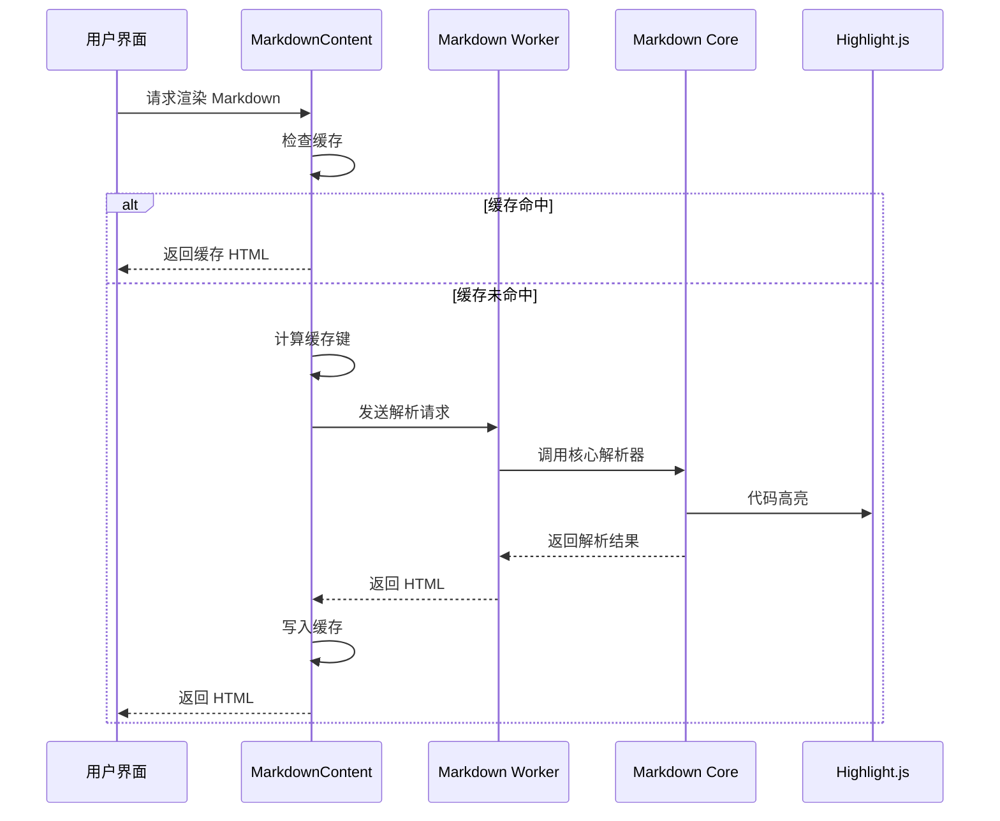
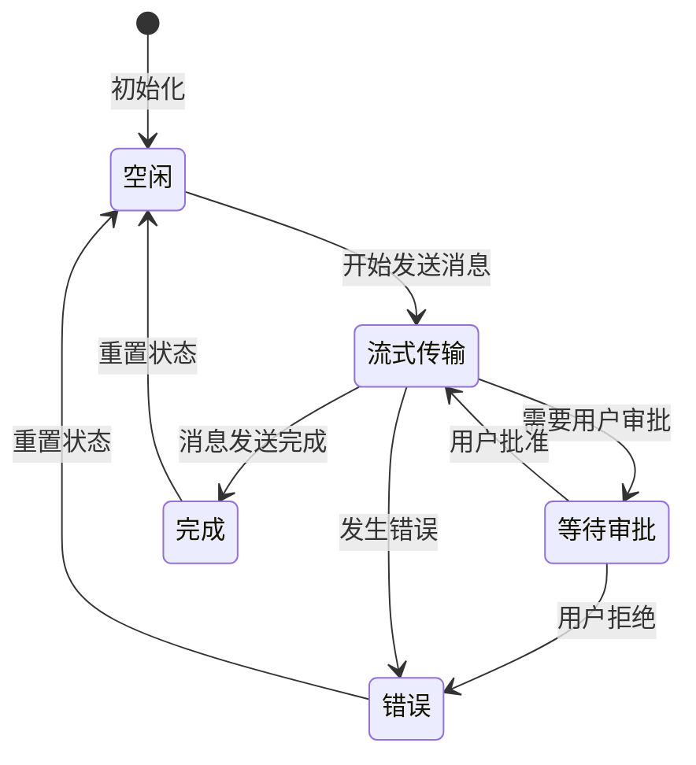
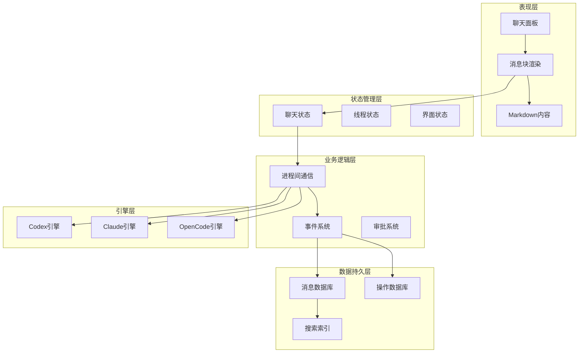
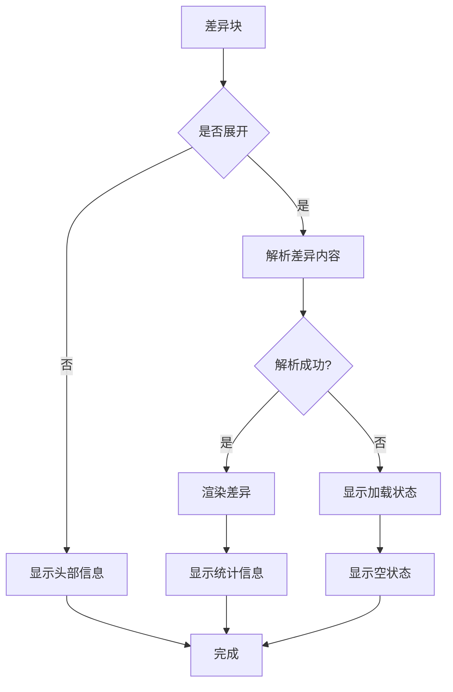
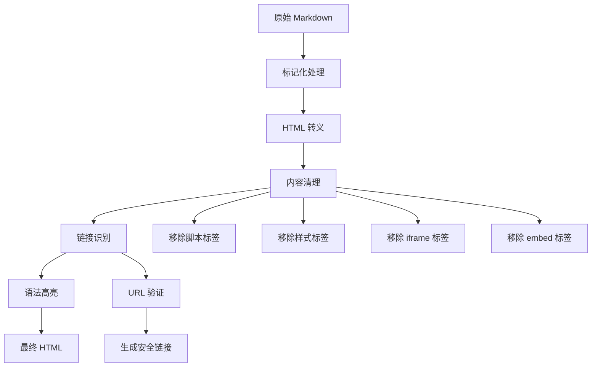
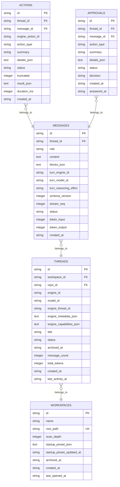
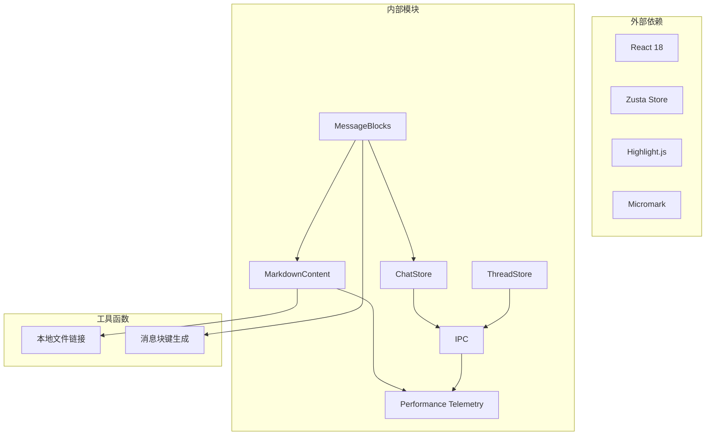
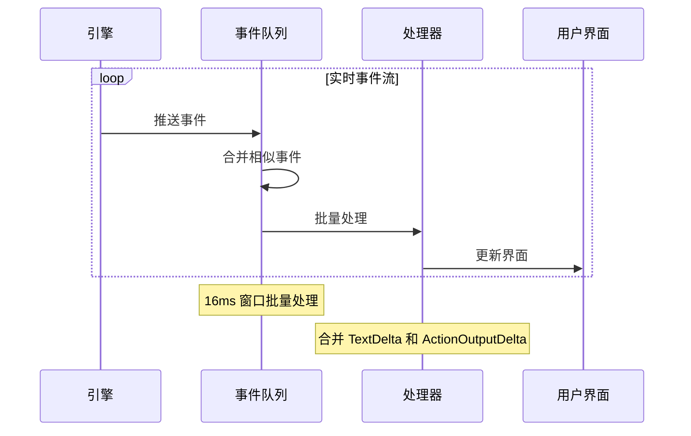

# 消息处理系统

<cite>
**本文档引用的文件**
- [MessageBlocks.tsx](file://src/components/chat/MessageBlocks.tsx)
- [MarkdownContent.tsx](file://src/components/chat/MarkdownContent.tsx)
- [chatStore.ts](file://src/stores/chatStore.ts)
- [markdownParser.worker.ts](file://src/workers/markdownParser.worker.ts)
- [markdownParserCore.ts](file://src/workers/markdownParserCore.ts)
- [types.ts](file://src/types.ts)
- [markdownParser.types.ts](file://src/workers/markdownParser.types.ts)
- [perfTelemetry.ts](file://src/lib/perfTelemetry.ts)
- [ipc.ts](file://src/lib/ipc.ts)
- [messages.rs](file://src-tauri/src/db/messages.rs)
- [actions.rs](file://src-tauri/src/db/actions.rs)
- [001_initial.sql](file://src-tauri/src/db/migrations/001_initial.sql)
- [threadStore.ts](file://src/stores/threadStore.ts)
- [messageBlockKeys.ts](file://src/components/chat/messageBlockKeys.ts)
- [localFileLinkPatterns.ts](file://src/lib/localFileLinkPatterns.ts)
</cite>

## 目录
1. [简介](#简介)
2. [项目结构](#项目结构)
3. [核心组件](#核心组件)
4. [架构概览](#架构概览)
5. [详细组件分析](#详细组件分析)
6. [依赖关系分析](#依赖关系分析)
7. [性能考虑](#性能考虑)
8. [故障排除指南](#故障排除指南)
9. [结论](#结论)

## 简介

消息处理系统是一个基于 React 和 Tauri 的现代化聊天应用，专注于高效的消息存储、状态管理和实时更新机制。该系统支持多种消息块类型（文本、代码、差异、操作、审批等），具备强大的 Markdown 渲染能力，采用 Web Worker 进行高性能解析，并实现了完整的消息历史管理、搜索过滤和导出功能。

系统的核心特点包括：
- 多引擎支持（Codex、Claude、OpenCode）
- 实时消息流事件处理
- 智能增量更新算法
- 完整的消息历史管理
- 高性能的 Markdown 解析和渲染
- 内容安全和性能监控

## 项目结构

消息处理系统采用模块化架构，主要分为以下几个层次：

**图表来源**
- [chatStore.ts:1-800](file://src/stores/chatStore.ts#L1-800)
- [threadStore.ts:1-713](file://src/stores/threadStore.ts#L1-713)
- [ipc.ts:1-792](file://src/lib/ipc.ts#L1-792)

**章节来源**
- [chatStore.ts:1-800](file://src/stores/chatStore.ts#L1-800)
- [threadStore.ts:1-713](file://src/stores/threadStore.ts#L1-713)
- [ipc.ts:1-792](file://src/lib/ipc.ts#L1-792)

## 核心组件

### 消息块渲染系统

消息块渲染系统是整个消息处理的核心，负责将不同类型的消息内容转换为用户友好的界面元素。

#### 主要消息块类型

系统支持以下消息块类型：

| 类型 | 描述 | 特殊属性 |
|------|------|----------|
| text | 文本内容 | planMode, isSteer |
| code | 代码块 | language, filename |
| diff | 文件差异 | scope (turn/file/workspace) |
| notice | 通知信息 | kind, level, title, message |
| action | 操作执行 | actionType, summary, details |
| approval | 权限审批 | actionType, summary, details |
| thinking | 思考过程 | content, durationMs |
| error | 错误信息 | message |
| attachment | 附件 | fileName, filePath, sizeBytes |
| skill | 技能引用 | name, path |
| mention | 用户提及 | name, path |
| steer | 引导指令 | content, planMode |

#### 消息块分段算法

系统实现了智能的消息块分段算法，将连续的操作块进行分组优化：

**图表来源**
- [MessageBlocks.tsx:286-360](file://src/components/chat/MessageBlocks.tsx#L286-360)

**章节来源**
- [MessageBlocks.tsx:1-800](file://src/components/chat/MessageBlocks.tsx#L1-800)
- [types.ts:255-446](file://src/types.ts#L255-446)

### Markdown 解析与渲染

系统采用了多层次的 Markdown 处理架构，确保高性能和安全性：

**图表来源**
- [MarkdownContent.tsx:221-358](file://src/components/chat/MarkdownContent.tsx#L221-358)
- [markdownParser.worker.ts:1-30](file://src/workers/markdownParser.worker.ts#L1-30)
- [markdownParserCore.ts:350-365](file://src/workers/markdownParserCore.ts#L350-365)

**章节来源**
- [MarkdownContent.tsx:1-358](file://src/components/chat/MarkdownContent.tsx#L1-358)
- [markdownParser.worker.ts:1-30](file://src/workers/markdownParser.worker.ts#L1-30)
- [markdownParserCore.ts:1-373](file://src/workers/markdownParserCore.ts#L1-373)

### 状态管理系统

聊天状态管理系统采用 Zusta 库实现，提供了完整的消息生命周期管理：

#### 状态流转图

**图表来源**
- [chatStore.ts:114-155](file://src/stores/chatStore.ts#L114-155)

**章节来源**
- [chatStore.ts:1-800](file://src/stores/chatStore.ts#L1-800)

## 架构概览

消息处理系统采用分层架构设计，确保了良好的可维护性和扩展性：

**图表来源**
- [chatStore.ts:1-800](file://src/stores/chatStore.ts#L1-800)
- [ipc.ts:1-792](file://src/lib/ipc.ts#L1-792)
- [messages.rs:1-800](file://src-tauri/src/db/messages.rs#L1-800)

**章节来源**
- [types.ts:146-232](file://src/types.ts#L146-232)
- [ipc.ts:1-792](file://src/lib/ipc.ts#L1-792)

## 详细组件分析

### 消息块渲染组件

消息块渲染组件是系统中最复杂的组件之一，负责处理各种类型的消息内容：

#### 差异块处理

差异块处理实现了智能的文件差异显示和解析：

**图表来源**
- [MessageBlocks.tsx:364-433](file://src/components/chat/MessageBlocks.tsx#L364-433)

**章节来源**
- [MessageBlocks.tsx:364-433](file://src/components/chat/MessageBlocks.tsx#L364-433)

#### 动作块处理

动作块处理实现了完整的操作执行跟踪和状态管理：

| 状态 | 描述 | 视觉指示 |
|------|------|----------|
| pending | 待执行 | 灰色圆形图标 |
| running | 执行中 | 旋转加载图标 |
| done | 执行完成 | 绿色对勾图标 |
| error | 执行失败 | 红色叉号图标 |

**章节来源**
- [MessageBlocks.tsx:578-608](file://src/components/chat/MessageBlocks.tsx#L578-608)

### Markdown 解析器

Markdown 解析器采用了多层架构设计，确保了高性能和安全性：

#### 安全性保障

解析器实现了多层次的安全防护：

**图表来源**
- [markdownParserCore.ts:93-119](file://src/workers/markdownParserCore.ts#L93-119)

**章节来源**
- [markdownParserCore.ts:1-373](file://src/workers/markdownParserCore.ts#L1-373)

### 数据存储系统

数据存储系统基于 SQLite 实现，提供了完整的消息历史管理和全文搜索功能：

#### 数据库模式

**图表来源**
- [001_initial.sql:1-132](file://src-tauri/src/db/migrations/001_initial.sql#L1-132)

**章节来源**
- [messages.rs:1-800](file://src-tauri/src/db/messages.rs#L1-800)
- [actions.rs:1-187](file://src-tauri/src/db/actions.rs#L1-187)
- [001_initial.sql:1-132](file://src-tauri/src/db/migrations/001_initial.sql#L1-132)

### 性能监控系统

系统内置了完整的性能监控机制，用于跟踪关键性能指标：

#### 性能指标分类

| 指标类别 | 指标名称 | 预算阈值(ms) | 描述 |
|----------|----------|--------------|------|
| 聊天响应 | chat.turn.first_shell.ms | 48 | 首个外壳响应时间 |
| 聊天响应 | chat.turn.first_content.ms | 1400 | 首个内容响应时间 |
| 聊天响应 | chat.turn.first_text.ms | 1800 | 首个文本响应时间 |
| 聊天渲染 | chat.render.commit.ms | 16 | 渲染提交时间 |
| Markdown解析 | chat.markdown.worker.ms | 28 | Markdown解析时间 |
| Git操作 | git.refresh.ms | 350 | Git刷新时间 |
| Git操作 | git.file_diff.ms | 250 | 文件差异计算时间 |

**章节来源**
- [perfTelemetry.ts:1-146](file://src/lib/perfTelemetry.ts#L1-146)

## 依赖关系分析

系统采用了清晰的依赖关系设计，确保了模块间的松耦合：

**图表来源**
- [MessageBlocks.tsx:1-10](file://src/components/chat/MessageBlocks.tsx#L1-10)
- [MarkdownContent.tsx:1-15](file://src/components/chat/MarkdownContent.tsx#L1-15)
- [chatStore.ts:1-5](file://src/stores/chatStore.ts#L1-5)

**章节来源**
- [messageBlockKeys.ts:1-37](file://src/components/chat/messageBlockKeys.ts#L1-37)
- [localFileLinkPatterns.ts:1-297](file://src/lib/localFileLinkPatterns.ts#L1-297)

## 性能考虑

### 缓存策略

系统实现了多层次的缓存机制以提升性能：

#### Markdown 渲染缓存

| 缓存参数 | 值 | 说明 |
|----------|----|------|
| 缓存限制 | 280 个条目 | 最大缓存条目数 |
| 最大字节 | 8 MB | 缓存总大小限制 |
| 阈值字符 | 1000 字符 | 触发 Worker 解析的最小长度 |
| LRU 淘汰 | 是 | 使用最近最少使用算法 |

#### 动作输出缓存

| 参数 | 值 | 说明 |
|------|----|------|
| 最大字符数 | 80,000 | 单个动作输出最大字符数 |
| 目标修剪字符数 | 48,000 | 修剪目标字符数 |
| 最大分片数 | 160 | 单个动作输出最大分片数 |

### 内存管理

系统采用了多种内存管理策略：

1. **Web Worker 隔离**: Markdown 解析在独立的 Web Worker 中执行，避免阻塞主线程
2. **缓存淘汰机制**: 实现 LRU 缓存淘汰，自动清理过期内容
3. **增量更新**: 只更新发生变化的消息块，减少重绘开销
4. **虚拟化渲染**: 对长列表使用虚拟化技术，只渲染可见区域

### 批处理机制

系统实现了智能的批处理机制来优化性能：

**图表来源**
- [chatStore.ts:65-66](file://src/stores/chatStore.ts#L65-66)
- [chatStore.ts:231-291](file://src/stores/chatStore.ts#L231-291)

**章节来源**
- [chatStore.ts:65-66](file://src/stores/chatStore.ts#L65-66)
- [chatStore.ts:231-291](file://src/stores/chatStore.ts#L231-291)

## 故障排除指南

### 常见问题及解决方案

#### Markdown 解析失败

**症状**: Markdown 内容显示为纯文本而非格式化 HTML

**可能原因**:
1. Web Worker 初始化失败
2. 缓存损坏
3. 内存不足

**解决步骤**:
1. 检查浏览器控制台是否有 Web Worker 错误
2. 清除 Markdown 缓存
3. 重启应用

#### 消息渲染延迟

**症状**: 新消息显示延迟或闪烁

**可能原因**:
1. 大消息内容导致的渲染压力
2. 事件处理队列拥塞
3. 缓存未命中

**解决步骤**:
1. 检查性能监控指标
2. 优化消息块分段
3. 调整批处理窗口

#### 数据库同步问题

**症状**: 消息历史不同步或丢失

**可能原因**:
1. 数据库事务失败
2. 网络中断
3. 存储空间不足

**解决步骤**:
1. 检查数据库连接状态
2. 重新同步线程数据
3. 清理数据库日志

**章节来源**
- [perfTelemetry.ts:55-87](file://src/lib/perfTelemetry.ts#L55-87)
- [messages.rs:133-194](file://src-tauri/src/db/messages.rs#L133-194)

## 结论

消息处理系统通过精心设计的架构和多项优化策略，实现了高性能、可扩展的消息处理能力。系统的主要优势包括：

1. **模块化设计**: 清晰的分层架构便于维护和扩展
2. **性能优化**: 多层次缓存和批处理机制确保流畅体验
3. **安全性**: 全面的内容安全防护和权限控制
4. **可扩展性**: 支持多种消息引擎和自定义扩展
5. **用户体验**: 实时更新、智能渲染和丰富的交互功能

未来可以进一步优化的方向包括：
- 实现更智能的增量更新算法
- 增强离线数据同步能力
- 优化大型消息的渲染性能
- 扩展更多的消息块类型和渲染选项