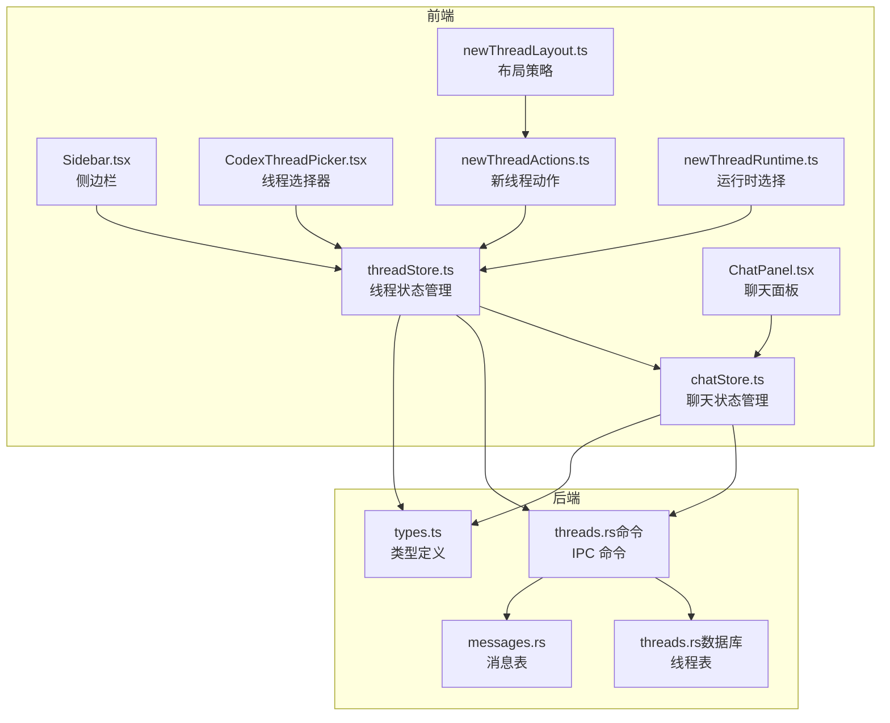
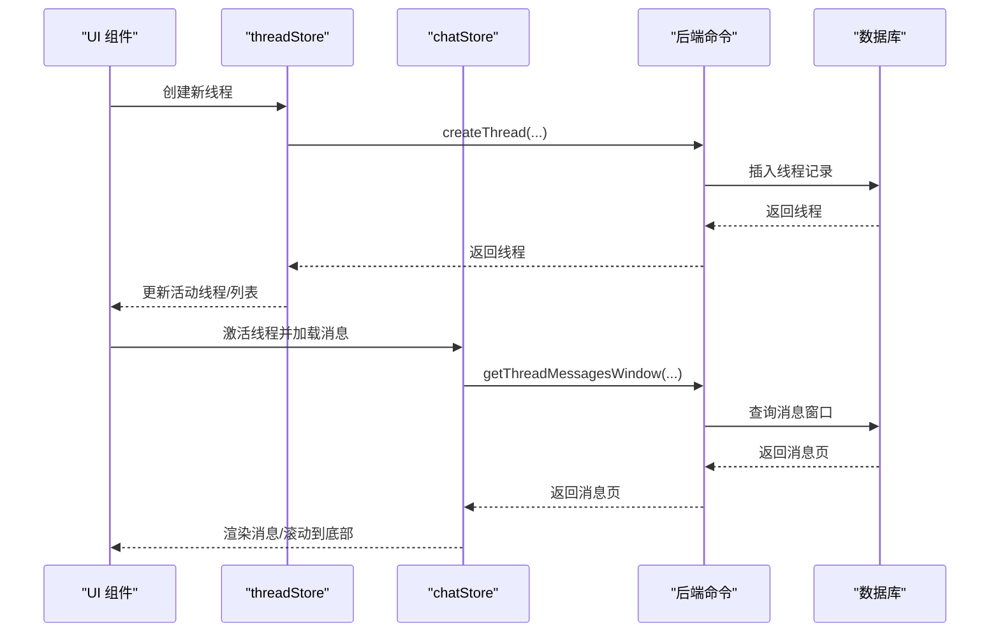
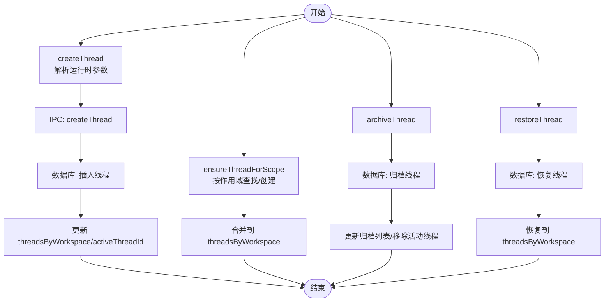
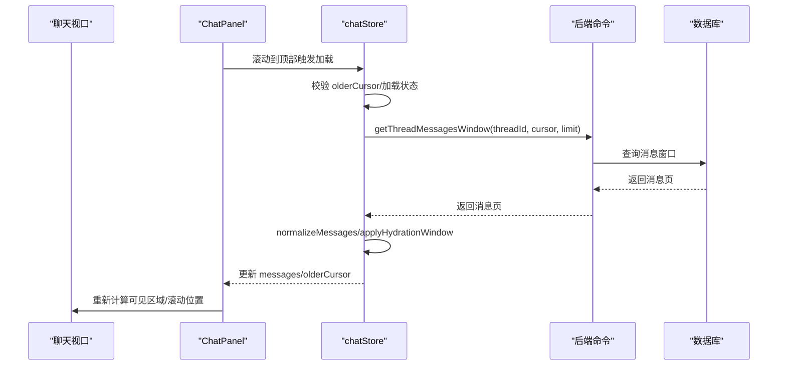
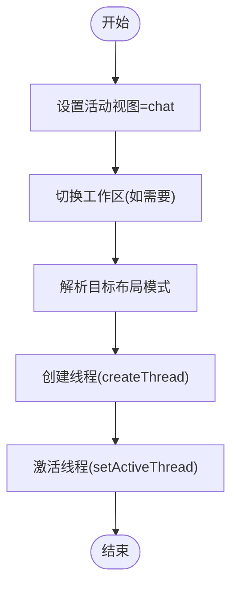
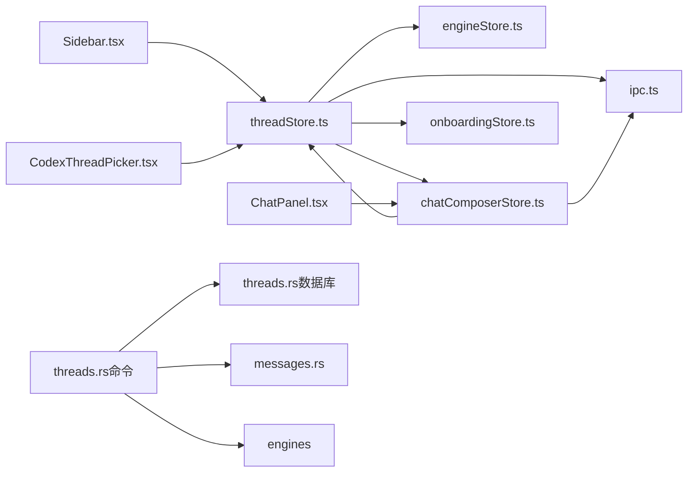

# 线程和对话管理

<cite>
**本文档引用的文件**
- [threadStore.ts](file://src/stores/threadStore.ts)
- [newThreadActions.ts](file://src/lib/newThreadActions.ts)
- [newThreadLayout.ts](file://src/lib/newThreadLayout.ts)
- [newThreadRuntime.ts](file://src/lib/newThreadRuntime.ts)
- [CodexThreadPicker.tsx](file://src/components/chat/CodexThreadPicker.tsx)
- [types.ts](file://src/types.ts)
- [chatStore.ts](file://src/stores/chatStore.ts)
- [threads.rs](file://src-tauri/src/db/threads.rs)
- [threads.rs（命令）](file://src-tauri/src/commands/threads.rs)
- [Sidebar.tsx](file://src/components/sidebar/Sidebar.tsx)
- [ChatPanel.tsx](file://src/components/chat/ChatPanel.tsx)
- [messages.rs](file://src-tauri/src/db/messages.rs)
</cite>

## 目录
1. [简介](#简介)
2. [项目结构](#项目结构)
3. [核心组件](#核心组件)
4. [架构总览](#架构总览)
5. [详细组件分析](#详细组件分析)
6. [依赖关系分析](#依赖关系分析)
7. [性能考虑](#性能考虑)
8. [故障排除指南](#故障排除指南)
9. [结论](#结论)
10. [附录](#附录)

## 简介
本文件系统性阐述线程与对话管理系统的设计与实现，覆盖以下主题：
- 对话线程的创建、维护与销毁流程
- 线程状态管理、消息窗口滚动与历史加载机制
- 新线程创建策略、布局配置与运行时环境设置
- 对话上下文保持、状态持久化与并发访问控制
- 线程迁移、备份恢复与性能优化技术方案
- 多会话管理、线程搜索与批量操作功能实现

## 项目结构
该系统采用前端 Zustand 状态管理 + Tauri 后端数据库与引擎交互的分层架构：
- 前端层：线程状态管理（threadStore）、聊天状态管理（chatStore）、UI 组件（Sidebar、ChatPanel、CodexThreadPicker）
- 业务逻辑层：新线程创建动作（newThreadActions）、运行时选择（newThreadRuntime）、布局策略（newThreadLayout）
- 数据层：SQLite 持久化（threads.rs、messages.rs），后端命令桥接（threads.rs 命令）

图表来源
- [threadStore.ts:164-712](file://src/stores/threadStore.ts#L164-L712)
- [chatStore.ts:1-120](file://src/stores/chatStore.ts#L1-L120)
- [Sidebar.tsx:238-250](file://src/components/sidebar/Sidebar.tsx#L238-L250)
- [ChatPanel.tsx:3083-3132](file://src/components/chat/ChatPanel.tsx#L3083-L3132)
- [CodexThreadPicker.tsx:124-179](file://src/components/chat/CodexThreadPicker.tsx#L124-L179)
- [newThreadActions.ts:13-51](file://src/lib/newThreadActions.ts#L13-L51)
- [newThreadRuntime.ts:118-146](file://src/lib/newThreadRuntime.ts#L118-L146)
- [newThreadLayout.ts:3-10](file://src/lib/newThreadLayout.ts#L3-L10)
- [threads.rs（命令）:32-52](file://src-tauri/src/commands/threads.rs#L32-L52)
- [threads.rs（数据库）:15-46](file://src-tauri/src/db/threads.rs#L15-L46)
- [messages.rs:417-466](file://src-tauri/src/db/messages.rs#L417-L466)
- [types.ts:164-198](file://src/types.ts#L164-L198)

章节来源
- [threadStore.ts:164-712](file://src/stores/threadStore.ts#L164-L712)
- [chatStore.ts:1-120](file://src/stores/chatStore.ts#L1-L120)
- [Sidebar.tsx:238-250](file://src/components/sidebar/Sidebar.tsx#L238-L250)
- [ChatPanel.tsx:3083-3132](file://src/components/chat/ChatPanel.tsx#L3083-L3132)
- [CodexThreadPicker.tsx:124-179](file://src/components/chat/CodexThreadPicker.tsx#L124-L179)
- [newThreadActions.ts:13-51](file://src/lib/newThreadActions.ts#L13-L51)
- [newThreadRuntime.ts:118-146](file://src/lib/newThreadRuntime.ts#L118-L146)
- [newThreadLayout.ts:3-10](file://src/lib/newThreadLayout.ts#L3-L10)
- [threads.rs（命令）:32-52](file://src-tauri/src/commands/threads.rs#L32-L52)
- [threads.rs（数据库）:15-46](file://src-tauri/src/db/threads.rs#L15-L46)
- [messages.rs:417-466](file://src-tauri/src/db/messages.rs#L417-L466)
- [types.ts:164-198](file://src/types.ts#L164-L198)

## 核心组件
- 线程状态存储（threadStore）
  - 负责线程列表、归档列表、活动线程 ID、加载状态与错误状态
  - 提供创建、重命名、确保存在、刷新、归档/恢复、远程线程挂载、本地更新等方法
- 聊天状态存储（chatStore）
  - 负责消息窗口、旧消息加载、流式事件处理、滚动与虚拟化
- 新线程动作（newThreadActions）
  - 将工作区切换、布局模式应用、线程创建与激活串联起来
- 运行时选择（newThreadRuntime）
  - 解析引擎、模型、推理努力度、服务等级等运行时参数
- 布局策略（newThreadLayout）
  - 根据当前布局决定新线程目标布局模式
- 线程选择器（CodexThreadPicker）
  - 支持远程线程浏览、搜索、过滤、挂载、回滚、压缩等操作
- 类型定义（types）
  - 定义 Thread、Message、ThreadStatus、CodexRemoteThread 等核心类型

章节来源
- [threadStore.ts:34-67](file://src/stores/threadStore.ts#L34-L67)
- [chatStore.ts:24-62](file://src/stores/chatStore.ts#L24-L62)
- [newThreadActions.ts:13-51](file://src/lib/newThreadActions.ts#L13-L51)
- [newThreadRuntime.ts:6-27](file://src/lib/newThreadRuntime.ts#L6-L27)
- [newThreadLayout.ts:1-11](file://src/lib/newThreadLayout.ts#L1-L11)
- [CodexThreadPicker.tsx:16-25](file://src/components/chat/CodexThreadPicker.tsx#L16-L25)
- [types.ts:155-198](file://src/types.ts#L155-L198)

## 架构总览
系统通过 IPC 在前端与后端之间传递线程与消息操作请求，后端使用 SQLite 存储线程与消息，并与引擎进行交互以支持远程线程挂载与同步。

图表来源
- [threadStore.ts:170-220](file://src/stores/threadStore.ts#L170-L220)
- [chatStore.ts:1870-1894](file://src/stores/chatStore.ts#L1870-L1894)
- [threads.rs（命令）:652-743](file://src-tauri/src/commands/threads.rs#L652-L743)
- [messages.rs:417-466](file://src-tauri/src/db/messages.rs#L417-L466)

## 详细组件分析

### 线程生命周期与状态管理
- 创建
  - 前端调用 createThread，解析运行时参数（引擎、模型、推理努力度、服务等级），IPC 调用后端创建线程并写入数据库
  - 成功后更新 threadsByWorkspace、activeThreadId，并持久化最近一次活动线程 ID
- 确保存在（ensureThreadForScope）
  - 根据作用域（工作区+仓库+引擎）查找匹配线程，若无则创建；同时更新活动线程
- 刷新
  - refreshThreads/refreshAllThreads 从后端拉取线程列表，合并到 threadsByWorkspace 并维持活动线程
- 归档与恢复
  - archiveThread/restoreThread 调用后端归档/恢复，并同步更新本地状态与归档列表
- 远程线程挂载
  - attachCodexRemoteThread/attachOpenCodeRemoteSession 将远端线程映射为本地线程，必要时恢复已归档的本地线程
- 本地更新
  - applyThreadUpdateLocal 仅在本地更新线程信息，避免重复 IPC

图表来源
- [threadStore.ts:170-220](file://src/stores/threadStore.ts#L170-L220)
- [threadStore.ts:245-306](file://src/stores/threadStore.ts#L245-L306)
- [threadStore.ts:307-326](file://src/stores/threadStore.ts#L307-L326)
- [threadStore.ts:384-426](file://src/stores/threadStore.ts#L384-L426)
- [threadStore.ts:427-459](file://src/stores/threadStore.ts#L427-L459)
- [threads.rs（命令）:652-743](file://src-tauri/src/commands/threads.rs#L652-L743)
- [threads.rs（命令）:955-1000](file://src-tauri/src/commands/threads.rs#L955-L1000)
- [threads.rs（命令）:1003-1035](file://src-tauri/src/commands/threads.rs#L1003-L1035)
- [threads.rs（数据库）:15-46](file://src-tauri/src/db/threads.rs#L15-L46)
- [threads.rs（数据库）:170-207](file://src-tauri/src/db/threads.rs#L170-L207)

章节来源
- [threadStore.ts:170-220](file://src/stores/threadStore.ts#L170-L220)
- [threadStore.ts:245-306](file://src/stores/threadStore.ts#L245-L306)
- [threadStore.ts:307-326](file://src/stores/threadStore.ts#L307-L326)
- [threadStore.ts:384-426](file://src/stores/threadStore.ts#L384-L426)
- [threadStore.ts:427-459](file://src/stores/threadStore.ts#L427-L459)
- [threads.rs（命令）:652-743](file://src-tauri/src/commands/threads.rs#L652-L743)
- [threads.rs（命令）:955-1000](file://src-tauri/src/commands/threads.rs#L955-L1000)
- [threads.rs（命令）:1003-1035](file://src-tauri/src/commands/threads.rs#L1003-L1035)
- [threads.rs（数据库）:15-46](file://src-tauri/src/db/threads.rs#L15-L46)
- [threads.rs（数据库）:170-207](file://src-tauri/src/db/threads.rs#L170-L207)

### 消息窗口滚动与历史加载机制
- 滚动行为
  - ChatPanel 使用 requestAnimationFrame 与 ResizeObserver 管理滚动与高度变化
  - 首次激活线程时自动滚动到底部，保证新消息可见
  - 支持平滑滚动到指定消息并高亮
- 历史加载
  - chatStore.loadOlderMessages 基于游标（olderCursor）分页加载旧消息
  - normalizeMessages 与 applyHydrationWindow 控制消息内存占用与渲染性能
  - hasOlderMessages/olderLoadBlockedUntil 防止重复加载与过度请求

图表来源
- [ChatPanel.tsx:2633-2669](file://src/components/chat/ChatPanel.tsx#L2633-L2669)
- [ChatPanel.tsx:3083-3132](file://src/components/chat/ChatPanel.tsx#L3083-L3132)
- [ChatPanel.tsx:3181-3199](file://src/components/chat/ChatPanel.tsx#L3181-L3199)
- [ChatPanel.tsx:4499-4542](file://src/components/chat/ChatPanel.tsx#L4499-L4542)
- [chatStore.ts:1845-1894](file://src/stores/chatStore.ts#L1845-L1894)
- [messages.rs:417-466](file://src-tauri/src/db/messages.rs#L417-L466)

章节来源
- [ChatPanel.tsx:2633-2669](file://src/components/chat/ChatPanel.tsx#L2633-L2669)
- [ChatPanel.tsx:3083-3132](file://src/components/chat/ChatPanel.tsx#L3083-L3132)
- [ChatPanel.tsx:3181-3199](file://src/components/chat/ChatPanel.tsx#L3181-L3199)
- [ChatPanel.tsx:4499-4542](file://src/components/chat/ChatPanel.tsx#L4499-L4542)
- [chatStore.ts:1845-1894](file://src/stores/chatStore.ts#L1845-L1894)
- [messages.rs:417-466](file://src-tauri/src/db/messages.rs#L417-L466)

### 新线程创建策略、布局配置与运行时环境
- 创建策略
  - newThreadActions.createAndActivateWorkspaceThread 负责：
    - 设置活动视图为 chat
    - 切换工作区（如需要）
    - 应用目标布局模式（resolveNewThreadTargetLayoutMode）
    - 创建线程并激活
- 布局配置
  - resolveNewThreadTargetLayoutMode 根据当前布局（terminal/split）决定新线程目标为 split 或 chat
- 运行时环境
  - resolveNewThreadRuntime 依据 composer 运行时、活跃线程、引导选择与回退值解析引擎、模型、推理努力度、服务等级
  - 若未显式传入，则自动推断最佳运行时

图表来源
- [newThreadActions.ts:13-51](file://src/lib/newThreadActions.ts#L13-L51)
- [newThreadLayout.ts:3-10](file://src/lib/newThreadLayout.ts#L3-L10)
- [newThreadRuntime.ts:118-146](file://src/lib/newThreadRuntime.ts#L118-L146)
- [threadStore.ts:170-220](file://src/stores/threadStore.ts#L170-L220)

章节来源
- [newThreadActions.ts:13-51](file://src/lib/newThreadActions.ts#L13-L51)
- [newThreadLayout.ts:3-10](file://src/lib/newThreadLayout.ts#L3-L10)
- [newThreadRuntime.ts:118-146](file://src/lib/newThreadRuntime.ts#L118-L146)
- [threadStore.ts:170-220](file://src/stores/threadStore.ts#L170-L220)

### 对话上下文保持、状态持久化与并发访问控制
- 上下文保持
  - chatStore.applyHydrationWindow 与 summarizeMessageForMemory 控制消息内存占用，避免全量保留导致性能问题
  - hasRenderableAssistantContent 与 collapseTrailingSteerMessages 保证渲染一致性
- 状态持久化
  - localStorage 记录最近一次活动线程 ID（LAST_THREAD_KEY），用于重启或切换工作区后恢复
  - 数据库存储线程元数据（engine_metadata_json）、状态、计数器等
- 并发访问控制
  - chatStore.backgroundStreamListeners 保持后台线程事件监听，避免切换时丢失事件
  - 通过 olderLoadBlockedUntil 与 loadingOlderMessages 防止并发加载

章节来源
- [chatStore.ts:1036-1060](file://src/stores/chatStore.ts#L1036-L1060)
- [chatStore.ts:1062-1094](file://src/stores/chatStore.ts#L1062-L1094)
- [chatStore.ts:64-82](file://src/stores/chatStore.ts#L64-L82)
- [chatStore.ts:1845-1894](file://src/stores/chatStore.ts#L1845-L1894)
- [threadStore.ts:136-136](file://src/stores/threadStore.ts#L136-L136)
- [threads.rs（数据库）:209-221](file://src-tauri/src/db/threads.rs#L209-L221)

### 线程迁移、备份恢复与性能优化
- 线程迁移
  - attachCodexRemoteThread/attachOpenCodeRemoteSession 将远端线程映射为本地线程，必要时恢复本地线程并更新运行时快照
- 备份恢复
  - archiveThread/restoreThread 支持线程归档与恢复，后端同步远端状态
- 性能优化
  - 消息分页与游标（olderCursor）减少一次性加载
  - applyHydrationWindow 限制“完全水合”消息数量，其余摘要化
  - 虚拟化渲染（ChatPanel 可见区域计算）降低 DOM 负担

章节来源
- [threads.rs（命令）:120-206](file://src-tauri/src/commands/threads.rs#L120-L206)
- [threads.rs（命令）:277-370](file://src-tauri/src/commands/threads.rs#L277-L370)
- [threads.rs（命令）:955-1000](file://src-tauri/src/commands/threads.rs#L955-L1000)
- [threads.rs（命令）:1003-1035](file://src-tauri/src/commands/threads.rs#L1003-L1035)
- [chatStore.ts:1036-1060](file://src/stores/chatStore.ts#L1036-L1060)
- [ChatPanel.tsx:4499-4542](file://src/components/chat/ChatPanel.tsx#L4499-L4542)

### 多会话管理、线程搜索与批量操作
- 多会话管理
  - Sidebar 展示工作区与线程树，支持展开/折叠、切换工作区、切换线程、归档/恢复
- 线程搜索
  - CodexThreadPicker 支持远程线程搜索、过滤（活跃/归档）、分页加载
- 批量操作
  - 通过 CodexThreadPicker 的“回滚/压缩/挂载”等操作对线程进行批量处理（单线程维度）

章节来源
- [Sidebar.tsx:483-624](file://src/components/sidebar/Sidebar.tsx#L483-L624)
- [Sidebar.tsx:627-705](file://src/components/sidebar/Sidebar.tsx#L627-L705)
- [CodexThreadPicker.tsx:124-179](file://src/components/chat/CodexThreadPicker.tsx#L124-L179)
- [CodexThreadPicker.tsx:181-237](file://src/components/chat/CodexThreadPicker.tsx#L181-L237)

## 依赖关系分析
- 前端依赖
  - threadStore 依赖 ipc、engineStore、chatComposerStore、onboardingStore
  - chatStore 依赖 threadStore、ipc、perfTelemetry
  - UI 组件依赖 stores 与 ipc
- 后端依赖
  - threads.rs 命令依赖 db::threads、db::repos、db::workspaces、engines
  - db::threads 与 db::messages 提供线程与消息的 CRUD 与统计

图表来源
- [threadStore.ts:1-12](file://src/stores/threadStore.ts#L1-L12)
- [chatStore.ts:1-22](file://src/stores/chatStore.ts#L1-L22)
- [Sidebar.tsx:26-35](file://src/components/sidebar/Sidebar.tsx#L26-L35)
- [ChatPanel.tsx:3083-3132](file://src/components/chat/ChatPanel.tsx#L3083-L3132)
- [CodexThreadPicker.tsx:12-13](file://src/components/chat/CodexThreadPicker.tsx#L12-L13)
- [threads.rs（命令）:5-17](file://src-tauri/src/commands/threads.rs#L5-L17)
- [threads.rs（数据库）:1-7](file://src-tauri/src/db/threads.rs#L1-L7)
- [messages.rs:1-3](file://src-tauri/src/db/messages.rs#L1-L3)

章节来源
- [threadStore.ts:1-12](file://src/stores/threadStore.ts#L1-L12)
- [chatStore.ts:1-22](file://src/stores/chatStore.ts#L1-L22)
- [Sidebar.tsx:26-35](file://src/components/sidebar/Sidebar.tsx#L26-L35)
- [ChatPanel.tsx:3083-3132](file://src/components/chat/ChatPanel.tsx#L3083-L3132)
- [CodexThreadPicker.tsx:12-13](file://src/components/chat/CodexThreadPicker.tsx#L12-L13)
- [threads.rs（命令）:5-17](file://src-tauri/src/commands/threads.rs#L5-L17)
- [threads.rs（数据库）:1-7](file://src-tauri/src/db/threads.rs#L1-L7)
- [messages.rs:1-3](file://src-tauri/src/db/messages.rs#L1-L3)

## 性能考虑
- 消息窗口与内存
  - 限制“完全水合”消息数量，其余摘要化，降低内存峰值
  - normalizeBlocks 合并相邻文本块，减少渲染节点
- 滚动与虚拟化
  - requestAnimationFrame 与 ResizeObserver 降低滚动抖动
  - ChatPanel 可见区域二分查找，仅渲染可视范围内的消息
- 加载与缓存
  - olderCursor 分页加载，避免一次性加载大量历史消息
  - backgroundStreamListeners 保持后台流式事件，避免重复请求

## 故障排除指南
- 线程创建失败
  - 检查 engineId/modelId 是否有效，必要时回退到默认运行时
  - 查看 threadStore 的 error 字段与后端日志
- 历史加载异常
  - 确认 olderCursor 与 olderLoadBlockedUntil 状态
  - 检查后端 getThreadMessagesWindow 返回是否包含 nextCursor
- 远程线程挂载失败
  - 确认 cwd 在工作区内，模型 ID 有效
  - 检查归档状态与本地是否存在同名远端线程

章节来源
- [threadStore.ts:216-218](file://src/stores/threadStore.ts#L216-L218)
- [chatStore.ts:1845-1894](file://src/stores/chatStore.ts#L1845-L1894)
- [threads.rs（命令）:372-405](file://src-tauri/src/commands/threads.rs#L372-L405)
- [threads.rs（命令）:120-206](file://src-tauri/src/commands/threads.rs#L120-L206)

## 结论
该线程与对话管理系统通过清晰的前后端职责划分、完善的 IPC 接口与数据库持久化，实现了从线程创建、消息滚动、历史加载到远程线程挂载与归档恢复的全链路能力。配合运行时选择与布局策略，系统在可用性与性能之间取得良好平衡。建议后续进一步增强批量操作与跨工作区迁移能力，以满足更复杂的多会话场景需求。

## 附录
- 关键类型定义参考
  - Thread、Message、ThreadStatus、CodexRemoteThread、OpenCodeRemoteSession 等类型定义位于 types.ts

章节来源
- [types.ts:155-213](file://src/types.ts#L155-L213)