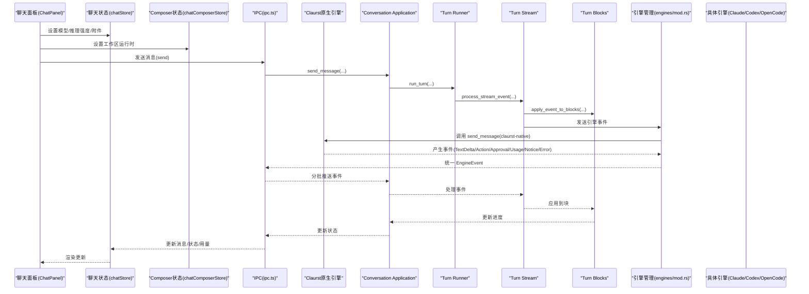
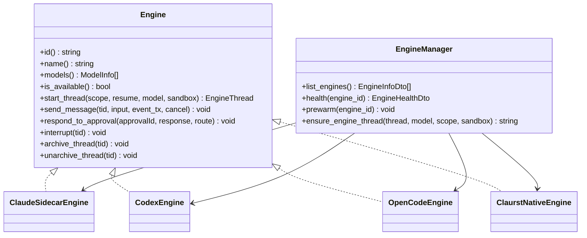
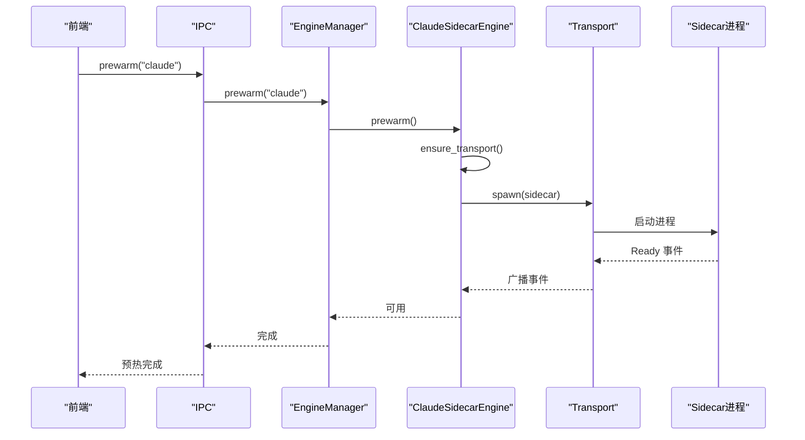
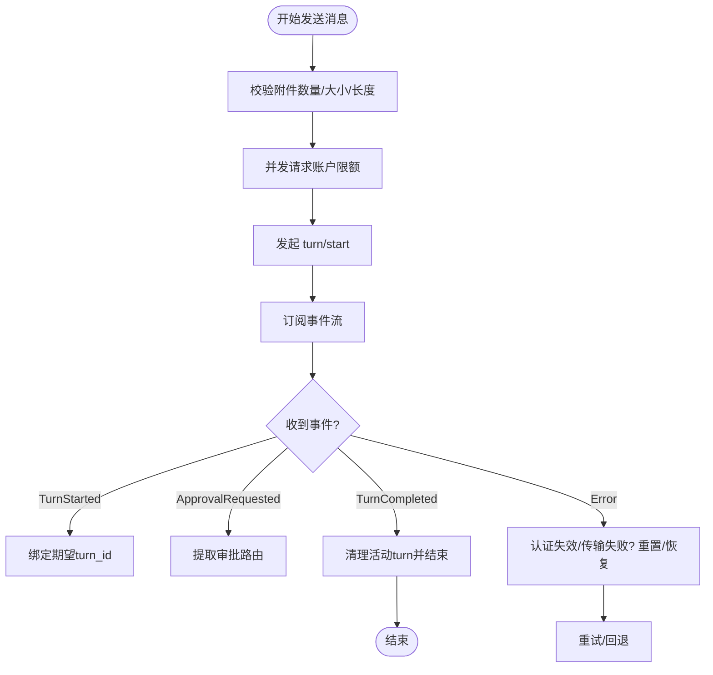
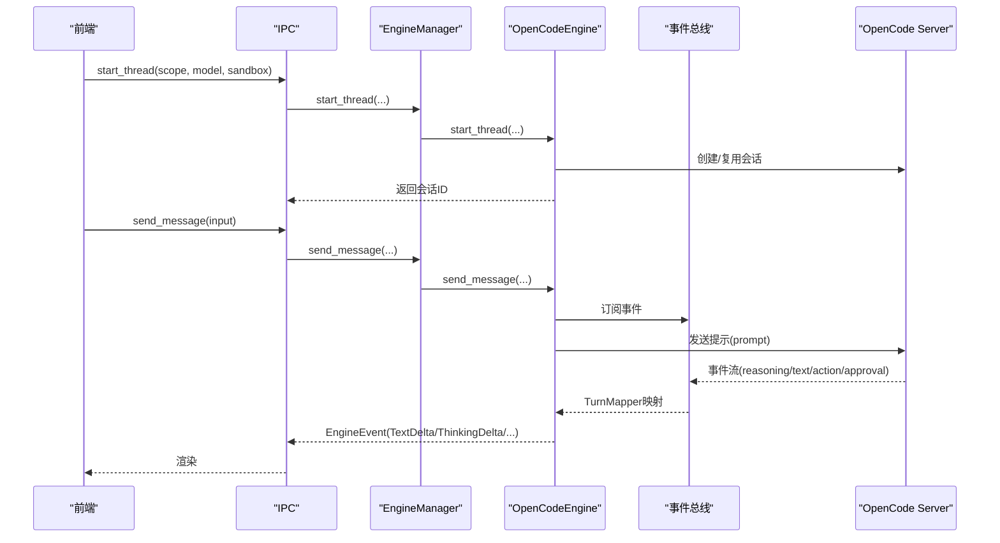
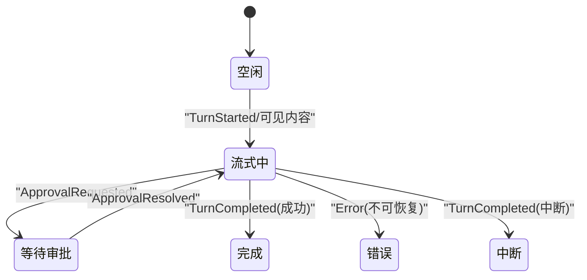
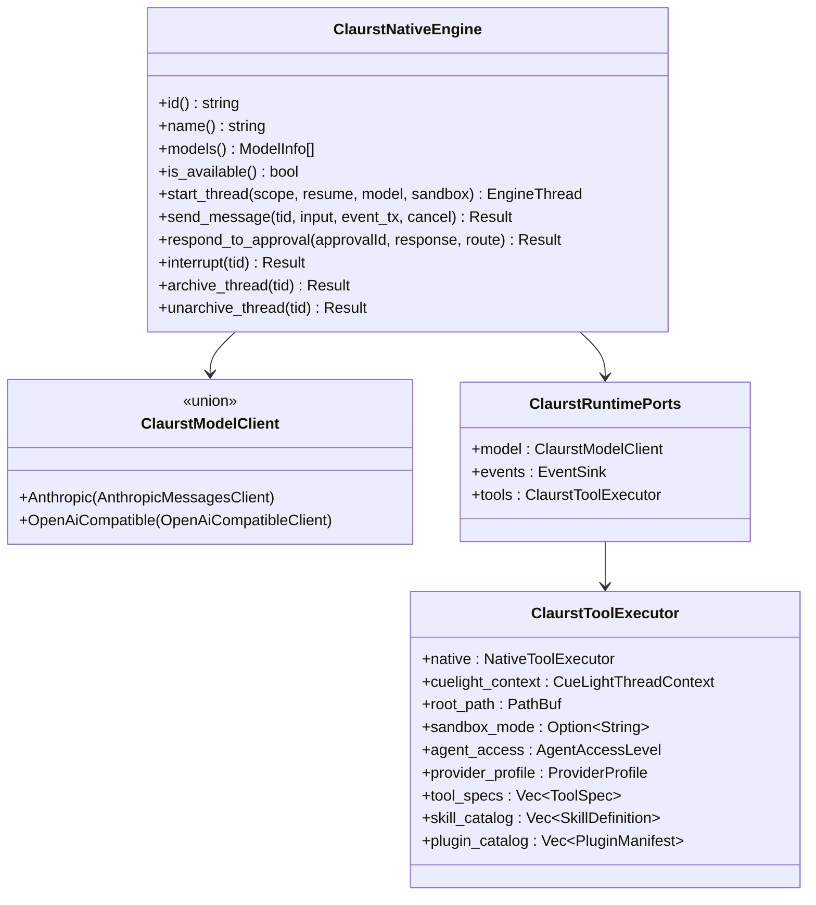
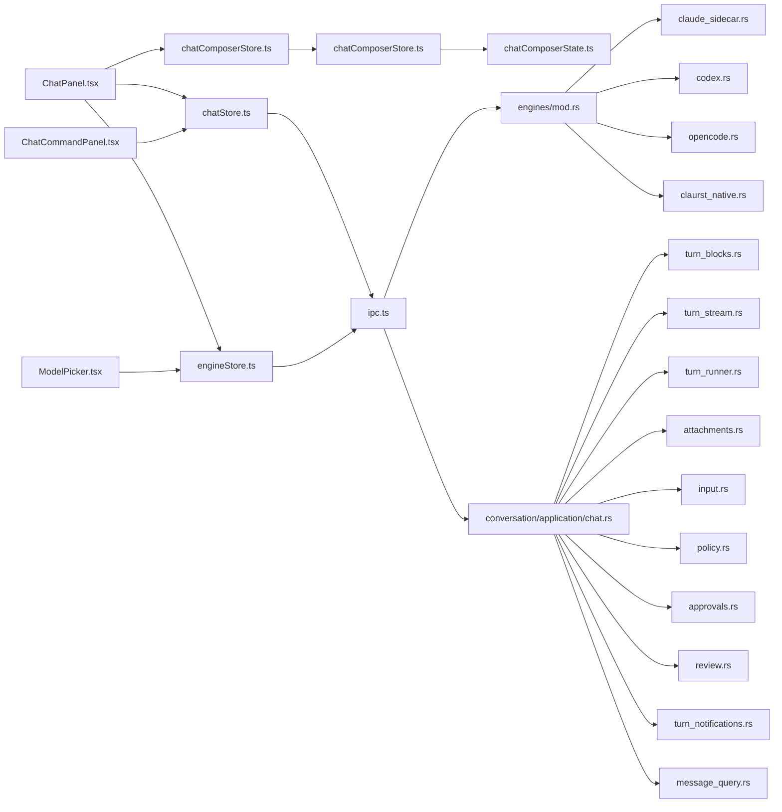

# 聊天和 AI 集成

<cite>
**本文引用的文件**
- [chat.rs](file://src-tauri/src/contexts/conversation/application/chat.rs)
- [types.rs](file://src-tauri/src/contexts/conversation/application/chat/types.rs)
- [input.rs](file://src-tauri/src/contexts/conversation/application/chat/input.rs)
- [attachments.rs](file://src-tauri/src/contexts/conversation/application/chat/attachments.rs)
- [turn_blocks.rs](file://src-tauri/src/contexts/conversation/application/chat/turn_blocks.rs)
- [turn_stream.rs](file://src-tauri/src/contexts/conversation/application/chat/turn_stream.rs)
- [turn_runner.rs](file://src-tauri/src/contexts/conversation/application/chat/turn_runner.rs)
- [approvals.rs](file://src-tauri/src/contexts/conversation/application/chat/approvals.rs)
- [policy.rs](file://src-tauri/src/contexts/conversation/application/chat/policy.rs)
- [review.rs](file://src-tauri/src/contexts/conversation/application/chat/review.rs)
- [turn_notifications.rs](file://src-tauri/src/contexts/conversation/application/chat/turn_notifications.rs)
- [message_query.rs](file://src-tauri/src/contexts/conversation/application/chat/message_query.rs)
- [ChatPanel.tsx](file://src/components/chat/ChatPanel.tsx)
- [chatStore.ts](file://src/stores/chatStore.ts)
- [engineStore.ts](file://src/stores/engineStore.ts)
- [chatEngineIds.ts](file://src/lib/chatEngineIds.ts)
- [ModelPicker.tsx](file://src/components/chat/ModelPicker.tsx)
- [ChatCommandPanel.tsx](file://src/components/chat/ChatCommandPanel.tsx)
- [mod.rs](file://src-tauri/src/engines/mod.rs)
- [claude_sidecar.rs](file://src-tauri/src/engines/claude_sidecar.rs)
- [codex.rs](file://src-tauri/src/engines/codex.rs)
- [opencode.rs](file://src-tauri/src/engines/opencode.rs)
- [claurst_native.rs](file://src-tauri/src/engines/claurst_native.rs)
- [chatComposerStore.ts](file://src/contexts/chat-composer/application/chatComposerStore.ts)
- [chatComposerState.ts](file://src/contexts/chat-composer/domain/chatComposerState.ts)
</cite>

## 更新摘要
**所做更改**
- 新增 chat-composer 上下文架构的全面文档
- 添加 Claurst 原生引擎的详细实现说明
- 更新架构图为基于上下文的全新设计
- 扩展聊天消息管理和状态机章节
- 新增工作区隔离的 Composer 运行时管理
- 增强 Claurst 原生引擎的工具执行和权限系统

## 目录
1. [引言](#引言)
2. [项目结构](#项目结构)
3. [核心组件](#核心组件)
4. [架构总览](#架构总览)
5. [详细组件分析](#详细组件分析)
6. [Chat-Composer 上下文架构](#chat-composer-上下文架构)
7. [Claurst 原生引擎](#claurst-原生引擎)
8. [Conversation Application 模块详解](#conversation-application-模块详解)
9. [依赖关系分析](#依赖关系分析)
10. [性能考量](#性能考量)
11. [故障排查指南](#故障排查指南)
12. [结论](#结论)
13. [附录](#附录)

## 引言
本文件系统性梳理聊天与 AI 集成模块的设计与实现，特别关注新增的 chat-composer 上下文架构和 Claurst 原生引擎。该架构提供了全新的基于上下文的聊天应用框架，包括聊天应用、审批、附件、输入处理、消息查询、策略、审查、转块、通知和流式传输等功能。覆盖以下主题：
- AI 引擎抽象层设计：统一接口、能力边界、生命周期与健康检查
- Chat-Composer 上下文架构：工作区隔离的 Composer 运行时管理
- Claurst 原生引擎：CueLight Agent 的完整实现，支持多提供商和工具执行
- 多引擎集成：Claude（含 Sidecar 与原生）、Codex、OpenCode 的差异与共性
- 聊天消息管理：消息窗口、流式事件聚合、状态机与回放
- 线程与会话：线程启动、沙箱策略、权限模式、模型选择与推理强度
- 用户界面：模型选择器、聊天命令面板、权限与审批交互
- 生命周期管理：预热、健康检查、错误恢复与协议诊断
- 使用场景与配置建议：基于能力矩阵与平台特性给出实践指导

## 项目结构
前端采用 React + Zustand 状态管理，后端以 Tauri Rust 引擎子系统为核心，通过 IPC 桥接前后端。新增的 chat-composer 上下文提供了工作区隔离的 Composer 运行时管理，Claurst 原生引擎作为全新的 AI 引擎实现。

```mermaid
graph TB
subgraph "前端"
CP["ChatPanel.tsx"]
MP["ModelPicker.tsx"]
CCP["ChatCommandPanel.tsx"]
CS["chatStore.ts"]
ES["engineStore.ts"]
CCS["chatComposerStore.ts"]
end
subgraph "IPC"
IPC["ipc.ts"]
end
subgraph "后端引擎(Rust)"
EM["engines/mod.rs"]
CSD["claude_sidecar.rs"]
CX["codex.rs"]
OC["opencode.rs"]
CN["claurst_native.rs"]
end
subgraph "Chat-Composer 上下文"
CCS_APP["chatComposerStore.ts"]
CCS_DOMAIN["chatComposerState.ts"]
end
subgraph "Conversation Application 模块"
CAM["chat.rs"]
TBR["turn_blocks.rs"]
TSR["turn_stream.rs"]
TRR["turn_runner.rs"]
ATT["attachments.rs"]
INP["input.rs"]
POL["policy.rs"]
APP["approvals.rs"]
REV["review.rs"]
TN["turn_notifications.rs"]
MQ["message_query.rs"]
end
CP --> CS
MP --> ES
CCP --> CS
CS --> IPC
ES --> IPC
CCS --> CCS_APP
CCS_APP --> CCS_DOMAIN
IPC --> EM
EM --> CSD
EM --> CX
EM --> OC
EM --> CN
CAM --> IPC
TBR --> CAM
TSR --> CAM
TRR --> CAM
ATT --> CAM
INP --> CAM
POL --> CAM
APP --> CAM
REV --> CAM
TN --> CAM
MQ --> CAM
```

**图示来源**
- [chat.rs:1-842](file://src-tauri/src/contexts/conversation/application/chat.rs#L1-L842)
- [turn_blocks.rs:1-572](file://src-tauri/src/contexts/conversation/application/chat/turn_blocks.rs#L1-L572)
- [turn_stream.rs:1-424](file://src-tauri/src/contexts/conversation/application/chat/turn_stream.rs#L1-L424)
- [turn_runner.rs:1-800](file://src-tauri/src/contexts/conversation/application/chat/turn_runner.rs#L1-L800)
- [chatComposerStore.ts:1-26](file://src/contexts/chat-composer/application/chatComposerStore.ts#L1-L26)
- [chatComposerState.ts:1-37](file://src/contexts/chat-composer/domain/chatComposerState.ts#L1-L37)

**章节来源**
- [chat.rs:1-842](file://src-tauri/src/contexts/conversation/application/chat.rs#L1-L842)
- [types.rs:1-187](file://src-tauri/src/contexts/conversation/application/chat/types.rs#L1-L187)
- [input.rs:1-288](file://src-tauri/src/contexts/conversation/application/chat/input.rs#L1-L288)
- [attachments.rs:1-131](file://src-tauri/src/contexts/conversation/application/chat/attachments.rs#L1-L131)
- [turn_blocks.rs:1-572](file://src-tauri/src/contexts/conversation/application/chat/turn_blocks.rs#L1-L572)
- [turn_stream.rs:1-424](file://src-tauri/src/contexts/conversation/application/chat/turn_stream.rs#L1-L424)
- [turn_runner.rs:1-800](file://src-tauri/src/contexts/conversation/application/chat/turn_runner.rs#L1-L800)
- [approvals.rs:1-137](file://src-tauri/src/contexts/conversation/application/chat/approvals.rs#L1-L137)
- [policy.rs:1-467](file://src-tauri/src/contexts/conversation/application/chat/policy.rs#L1-L467)
- [review.rs:1-100](file://src-tauri/src/contexts/conversation/application/chat/review.rs#L1-L100)
- [turn_notifications.rs:1-187](file://src-tauri/src/contexts/conversation/application/chat/turn_notifications.rs#L1-L187)
- [message_query.rs:1-59](file://src-tauri/src/contexts/conversation/application/chat/message_query.rs#L1-L59)

## 核心组件
- **Chat-Composer 上下文**：提供工作区隔离的 Composer 运行时管理，支持按工作区存储和检索运行时配置
- **Claurst 原生引擎**：CueLight Agent 的完整实现，支持多提供商（Anthropic、OpenAI、OpenRouter、Ollama）和丰富的工具执行能力
- **Conversation Application 模块**：提供完整的聊天应用实现，包括消息发送、附件处理、输入验证、策略管理、审批处理、审查功能、通知和流式传输
- **聊天应用层**：统一管理聊天应用逻辑，协调各个子模块的工作
- **转块处理**：将引擎事件转换为内容块，支持文本、思考、动作、审批、通知、错误等多种类型
- **流式传输**：处理引擎事件流，支持事件合并、去抖和数据库持久化
- **审批系统**：处理用户审批请求，支持不同引擎的审批格式
- **附件管理**：处理图片粘贴、预览和存储
- **输入验证**：验证用户输入，确保数据完整性
- **策略管理**：管理沙箱策略、权限模式和信任级别
- **审查功能**：支持 Codex 审查功能，包括内联和分离模式
- **通知系统**：处理聊天转完成通知和线程标题更新

**章节来源**
- [chatComposerStore.ts:1-26](file://src/contexts/chat-composer/application/chatComposerStore.ts#L1-L26)
- [chatComposerState.ts:1-37](file://src/contexts/chat-composer/domain/chatComposerState.ts#L1-L37)
- [claurst_native.rs:1-200](file://src-tauri/src/engines/claurst_native.rs#L1-L200)
- [chat.rs:109-800](file://src-tauri/src/contexts/conversation/application/chat.rs#L109-L800)
- [turn_blocks.rs:1-572](file://src-tauri/src/contexts/conversation/application/chat/turn_blocks.rs#L1-L572)
- [turn_stream.rs:1-424](file://src-tauri/src/contexts/conversation/application/chat/turn_stream.rs#L1-L424)
- [approvals.rs:1-137](file://src-tauri/src/contexts/conversation/application/chat/approvals.rs#L1-L137)
- [attachments.rs:1-131](file://src-tauri/src/contexts/conversation/application/chat/attachments.rs#L1-L131)
- [input.rs:1-288](file://src-tauri/src/contexts/conversation/application/chat/input.rs#L1-L288)
- [policy.rs:1-467](file://src-tauri/src/contexts/conversation/application/chat/policy.rs#L1-L467)
- [review.rs:1-100](file://src-tauri/src/contexts/conversation/application/chat/review.rs#L1-L100)
- [turn_notifications.rs:1-187](file://src-tauri/src/contexts/conversation/application/chat/turn_notifications.rs#L1-L187)
- [message_query.rs:1-59](file://src-tauri/src/contexts/conversation/application/chat/message_query.rs#L1-L59)

## 架构总览
整体采用"前端 UI + 状态管理 + IPC + Chat-Composer 上下文 + Conversation Application 模块 + 后端引擎"的分层架构。Chat-Composer 上下文提供工作区隔离的运行时管理，Conversation Application 模块作为中间层，协调前端与后端引擎的交互，提供完整的聊天应用功能。



**图示来源**
- [chat.rs:138-516](file://src-tauri/src/contexts/conversation/application/chat.rs#L138-L516)
- [turn_runner.rs:3-479](file://src-tauri/src/contexts/conversation/application/chat/turn_runner.rs#L3-L479)
- [turn_stream.rs:108-244](file://src-tauri/src/contexts/conversation/application/chat/turn_stream.rs#L108-L244)
- [turn_blocks.rs:3-264](file://src-tauri/src/contexts/conversation/application/chat/turn_blocks.rs#L3-L264)
- [claurst_native.rs:197-345](file://src-tauri/src/engines/claurst_native.rs#L197-L345)

**章节来源**
- [chat.rs:138-516](file://src-tauri/src/contexts/conversation/application/chat.rs#L138-L516)
- [turn_runner.rs:3-479](file://src-tauri/src/contexts/conversation/application/chat/turn_runner.rs#L3-L479)
- [turn_stream.rs:108-244](file://src-tauri/src/contexts/conversation/application/chat/turn_stream.rs#L108-L244)
- [turn_blocks.rs:3-264](file://src-tauri/src/contexts/conversation/application/chat/turn_blocks.rs#L3-L264)

## 详细组件分析

### AI 引擎抽象层与生命周期
- **抽象接口 Engine**：定义引擎标识、名称、模型列表、可用性检测、线程启动、消息发送、转向、审批响应、中断、归档/反归档等方法
- **引擎管理 EngineManager**：集中管理 Codex、Claude（Sidecar 与原生）、OpenCode、Claurst 原生，提供 list_engines、health、prewarm 等能力
- **生命周期与健康检查**：各引擎提供 health_report 或 health，包含可用性、版本、检查项、警告、修复建议与协议诊断
- **预热机制**：前端在空闲时按节流阈值触发 prewarm，避免频繁重启带来的延迟



**图示来源**
- [mod.rs:419-461](file://src-tauri/src/engines/mod.rs#L419-L461)
- [mod.rs:463-553](file://src-tauri/src/engines/mod.rs#L463-L553)
- [claurst_native.rs:118-195](file://src-tauri/src/engines/claurst_native.rs#L118-L195)

**章节来源**
- [mod.rs:419-461](file://src-tauri/src/engines/mod.rs#L419-L461)
- [mod.rs:555-615](file://src-tauri/src/engines/mod.rs#L555-L615)
- [ChatPanel.tsx:534-570](file://src/components/chat/ChatPanel.tsx#L534-L570)

### Claude 引擎（Sidecar）
- **传输与协议**：基于 Node.js 进程与 Claude Agent SDK 的 Sidecar，通过 JSON 行协议通信，事件类型覆盖文本增量、思考增量、动作、审批请求、用量更新、错误等
- **健康检查**：检测 Node 可用性、侧车脚本存在性、API Key 状态，生成检查清单、警告与修复建议
- **预热**：确保 Sidecar 就绪，等待 Ready 事件
- **认证与错误**：识别认证失败类错误，必要时终止并清理进程



**图示来源**
- [claude_sidecar.rs:517-596](file://src-tauri/src/engines/claude_sidecar.rs#L517-L596)
- [claude_sidecar.rs:633-702](file://src-tauri/src/engines/claude_sidecar.rs#L633-L702)

**章节来源**
- [claude_sidecar.rs:1-120](file://src-tauri/src/engines/claude_sidecar.rs#L1-L120)
- [claude_sidecar.rs:517-596](file://src-tauri/src/engines/claude_sidecar.rs#L517-L596)
- [claude_sidecar.rs:633-702](file://src-tauri/src/engines/claude_sidecar.rs#L633-L702)

### Codex 引擎
- **协议与传输**：自研协议，支持 thread/start、turn/start、通知/请求分发、审批路由持久化
- **线程与沙箱**：支持工作区写入沙箱探测与外部沙箱强制，记录线程运行时参数（模型、策略、权限、理由强度、服务等级、个性、输出模式）
- **事件映射**：TurnEventMapper 将底层事件映射为统一 EngineEvent，处理速率限制、认证失效、沙箱拒绝等场景
- **速率限制与超时**：账户限额查询、TURN 请求超时、传输重启退避策略



**图示来源**
- [codex.rs:524-750](file://src-tauri/src/engines/codex.rs#L524-L750)
- [codex.rs:745-800](file://src-tauri/src/engines/codex.rs#L745-L800)

**章节来源**
- [codex.rs:1-120](file://src-tauri/src/engines/codex.rs#L1-L120)
- [codex.rs:385-522](file://src-tauri/src/engines/codex.rs#L385-L522)
- [codex.rs:524-750](file://src-tauri/src/engines/codex.rs#L524-L750)

### OpenCode 引擎
- **服务器与会话**：每个工作区维护独立 HTTP 服务器实例，会话按权限模式（ask/allow/deny）隔离
- **事件总线**：基于 SSE 的事件总线，按会话过滤事件，TurnMapper 将部分/增量文本映射为统一事件
- **权限与问题**：支持"问题型"审批（问答），并可直接返回决策
- **代理与推理强度**：支持指定代理与推理强度，模型能力来自运行时目录扫描



**图示来源**
- [opencode.rs:586-685](file://src-tauri/src/engines/opencode.rs#L586-L685)
- [opencode.rs:687-800](file://src-tauri/src/engines/opencode.rs#L687-L800)

**章节来源**
- [opencode.rs:1-120](file://src-tauri/src/engines/opencode.rs#L1-L120)
- [opencode.rs:586-685](file://src-tauri/src/engines/opencode.rs#L586-L685)
- [opencode.rs:687-800](file://src-tauri/src/engines/opencode.rs#L687-L800)

### 聊天消息管理与状态机
- **消息窗口与虚拟化**：大消息集采用虚拟化策略，估算高度与可视区域滚动
- **流式事件聚合**：TextDelta/ThinkingDelta/ActionOutputDelta 等事件按类型合并，减少渲染抖动
- **状态机**：根据事件类型推进状态（等待审批、流式中、完成、错误、中断），并记录首次内容/文本指标
- **审批与权限**：支持不同引擎的审批格式与权限模式，前端构建响应载荷并回传



**图示来源**
- [chatStore.ts:114-155](file://src/stores/chatStore.ts#L114-L155)
- [chatStore.ts:231-291](file://src/stores/chatStore.ts#L231-L291)

**章节来源**
- [chatStore.ts:114-155](file://src/stores/chatStore.ts#L114-L155)
- [chatStore.ts:231-291](file://src/stores/chatStore.ts#L231-L291)

### 模型选择器与推理强度
- **引擎与模型枚举**：前端从引擎状态读取模型列表，按引擎分组显示
- **OpenCode 模型分组**：按 Provider 聚合，支持搜索与"历史隐藏模型"展开
- **元数据与限制**：显示视觉/PDF/文本附件支持、上下文/输入/输出令牌上限
- **推理强度**：按模型支持列出可选强度，短标签与完整标签切换

**章节来源**
- [ModelPicker.tsx:1-120](file://src/components/chat/ModelPicker.tsx#L1-L120)
- [ModelPicker.tsx:116-164](file://src/components/chat/ModelPicker.tsx#L116-L164)
- [ModelPicker.tsx:235-260](file://src/components/chat/ModelPicker.tsx#L235-L260)

### 聊天命令面板与线程操作
- **命令类型**：评审、复刻、回滚、压缩、快速模式、个性、技能、代理、命令、会话、MCP、实验特性
- **评审目标与交付**：支持未提交变更、基线分支、提交、自定义指令
- **会话浏览**：按活跃/归档筛选、搜索、分页加载、附加到本地线程
- **回滚确认**：输入回合数并校验

**章节来源**
- [ChatCommandPanel.tsx:37-120](file://src/components/chat/ChatCommandPanel.tsx#L37-L120)
- [ChatCommandPanel.tsx:107-182](file://src/components/chat/ChatCommandPanel.tsx#L107-L182)
- [ChatCommandPanel.tsx:295-533](file://src/components/chat/ChatCommandPanel.tsx#L295-L533)

## Chat-Composer 上下文架构

### 工作区隔离的运行时管理
Chat-Composer 上下文提供了工作区隔离的 Composer 运行时管理，确保不同工作区的运行时配置相互独立。

#### 核心功能
- **运行时快照**：`ComposerRuntimeSnapshot` 接口定义了运行时的关键属性
- **工作区隔离**：按工作区 ID 存储和检索运行时配置
- **状态管理**：提供设置和清除运行时的方法

#### 运行时属性
- **引擎 ID**：指定使用的 AI 引擎标识符
- **模型 ID**：指定具体的模型标识符
- **推理强度**：控制模型的推理强度设置
- **服务等级**：控制服务的响应速度等级

**章节来源**
- [chatComposerStore.ts:1-26](file://src/contexts/chat-composer/application/chatComposerStore.ts#L1-L26)
- [chatComposerState.ts:1-37](file://src/contexts/chat-composer/domain/chatComposerState.ts#L1-L37)

### Composer 运行时状态管理
`chatComposerStore.ts` 实现了基于 Zustand 的状态管理，提供了响应式的运行时配置管理。

#### 状态结构
- **runtimeByWorkspace**：记录按工作区隔离的运行时配置
- **setWorkspaceRuntime**：设置指定工作区的运行时配置
- **clearWorkspaceRuntime**：清除指定工作区的运行时配置

#### 隔离机制
- **工作区键值**：使用工作区 ID 作为键值进行隔离
- **状态复制**：通过函数式更新确保状态的不可变性
- **内存管理**：自动清理已移除工作区的状态

**章节来源**
- [chatComposerStore.ts:1-26](file://src/contexts/chat-composer/application/chatComposerStore.ts#L1-L26)

### 测试验证
提供了完整的单元测试，验证工作区隔离的正确性：

#### 测试场景
- **工作区隔离**：验证不同工作区的运行时配置相互独立
- **状态清理**：验证清除工作区运行时的正确性
- **配置持久化**：验证运行时配置的正确存储和检索

**章节来源**
- [chatComposerStore.test.ts:1-29](file://src/stores/chatComposerStore.test.ts#L1-L29)

## Claurst 原生引擎

### 引擎架构概述
Claurst 原生引擎是 CueLight Agent 的完整实现，作为全新的 AI 引擎集成到系统中。该引擎支持多提供商（Anthropic、OpenAI、OpenRouter、Ollama）和丰富的工具执行能力。

#### 核心特性
- **多提供商支持**：统一的模型客户端接口，支持多种 AI 服务提供商
- **工具执行系统**：内置的工具执行器，支持本地工具和 CueLight 工具
- **权限控制系统**：细粒度的权限管理，支持审批和自动批准
- **内存文件系统**：支持智能记忆片段的加载和管理



**图示来源**
- [claurst_native.rs:50-97](file://src-tauri/src/engines/claurst_native.rs#L50-L97)
- [claurst_native.rs:394-419](file://src-tauri/src/engines/claurst_native.rs#L394-L419)

**章节来源**
- [claurst_native.rs:1-200](file://src-tauri/src/engines/claurst_native.rs#L1-L200)
- [claurst_native.rs:200-400](file://src-tauri/src/engines/claurst_native.rs#L200-L400)

### 模型客户端实现
Claurst 原生引擎使用统一的模型客户端接口，支持多种 AI 服务提供商：

#### 支持的提供商
- **Anthropic**：Claude 系列模型，通过 Messages API 提供
- **OpenAI**：GPT 系列模型，通过兼容 API 提供
- **OpenRouter**：支持多种第三方模型的统一接口
- **Ollama**：本地模型运行时，支持开源模型

#### 模型发现机制
- **默认模型**：自动发现和注册可用的默认模型
- **模型信息**：提供详细的模型元数据，包括描述和默认推理强度
- **可用性检测**：检查环境变量和凭据的有效性

**章节来源**
- [claurst_native.rs:99-155](file://src-tauri/src/engines/claurst_native.rs#L99-L155)
- [claurst_native.rs:157-165](file://src-tauri/src/engines/claurst_native.rs#L157-L165)

### 工具执行系统
Claurst 原生引擎集成了强大的工具执行系统，支持本地工具和 CueLight 工具：

#### 工具类型
- **本地工具**：系统级工具，如文件操作、命令执行等
- **CueLight 工具**：专门的 CueLight 工具，支持项目特定功能
- **技能插件**：可扩展的技能和插件系统

#### 权限管理
- **权限网关**：统一的权限控制系统，支持审批和自动批准
- **沙箱模式**：支持不同的沙箱模式，控制工具执行的安全级别
- **访问级别**：基于代理配置的访问级别控制

**章节来源**
- [claurst_native.rs:236-262](file://src-tauri/src/engines/claurst_native.rs#L236-L262)
- [claurst_native.rs:240-259](file://src-tauri/src/engines/claurst_native.rs#L240-L259)

### 线程管理与上下文
Claurst 原生引擎提供了完整的线程管理功能，支持复杂的工作区上下文：

#### 线程状态
- **根路径**：工作区的根路径，用于工具执行和文件访问
- **模型配置**：当前线程使用的模型配置
- **自动批准**：控制命令执行的自动批准设置
- **沙箱模式**：当前线程的沙箱安全模式

#### 上下文加载
- **CueLight 上下文**：加载和管理 CueLight 特定的线程上下文
- **环境变量**：动态加载工作区的环境变量文件
- **内存片段**：加载和管理智能记忆片段

**章节来源**
- [claurst_native.rs:57-64](file://src-tauri/src/engines/claurst_native.rs#L57-L64)
- [claurst_native.rs:181-192](file://src-tauri/src/engines/claurst_native.rs#L181-L192)

### 事件处理与生命周期
Claurst 原生引擎实现了完整的事件处理和生命周期管理：

#### 事件处理
- **事件流**：统一的事件流接口，支持各种类型的引擎事件
- **错误处理**：完善的错误处理和恢复机制
- **中断支持**：支持优雅的中断和清理

#### 生命周期管理
- **线程启动**：创建和初始化新的对话线程
- **消息处理**：处理用户消息和系统事件
- **资源清理**：清理线程状态和相关资源

**章节来源**
- [claurst_native.rs:217-225](file://src-tauri/src/engines/claurst_native.rs#L217-L225)
- [claurst_native.rs:307-345](file://src-tauri/src/engines/claurst_native.rs#L307-L345)

## Conversation Application 模块详解

### 聊天应用主控制器
Conversation Application 模块的核心是 `chat.rs` 文件，它提供了完整的聊天应用实现，包括消息发送、附件处理、输入验证、策略管理等功能。

#### 主要功能
- **消息发送**：`send_message` 函数处理用户消息发送，包括附件验证、输入项目处理、模型解析等
- **审查功能**：`start_codex_review` 和 `run_codex_review_turn` 支持 Codex 审查功能
- **中途调整**：`steer_message` 支持 Codex 线程中途调整
- **取消操作**：`cancel_turn` 提供取消当前转的操作
- **审批处理**：`respond_to_approval` 处理用户审批响应

#### 关键特性
- **并发控制**：确保同一时间只有一个转在运行
- **数据库集成**：所有状态变更都持久化到数据库
- **事件广播**：通过 IPC 将事件广播给前端
- **错误处理**：完善的错误处理和回滚机制

**章节来源**
- [chat.rs:138-800](file://src-tauri/src/contexts/conversation/application/chat.rs#L138-L800)

### 内容块处理系统
`turn_blocks.rs` 模块负责将引擎事件转换为内容块，支持多种内容类型：

#### 支持的内容类型
- **文本内容**：普通聊天消息
- **思考内容**：AI 的内部思考过程
- **动作块**：执行的动作及其输出
- **审批块**：需要用户审批的操作
- **通知块**：系统通知和警告
- **错误块**：错误信息
- **附件块**：文件附件信息
- **技能块**：技能引用
- **提及块**：项目引用

#### 处理机制
- **事件应用**：将引擎事件应用到内容块数组
- **索引管理**：维护动作和审批的索引映射
- **块更新**：支持块的插入、更新和删除
- **通知管理**：特殊处理重复的通知块

**章节来源**
- [turn_blocks.rs:1-572](file://src-tauri/src/contexts/conversation/application/chat/turn_blocks.rs#L1-L572)

### 流式传输与事件处理
`turn_stream.rs` 模块处理引擎事件流，实现高效的事件处理和数据库持久化：

#### 流式处理特性
- **事件合并**：合并相似的流式事件以提高效率
- **内容截断**：限制输出内容长度，防止内存溢出
- **数据库持久化**：定时将状态持久化到数据库
- **事件日志**：可选的引擎事件日志记录

#### 处理流程
1. **事件标准化**：标准化事件内容，去除冗余信息
2. **前端通知**：通过 IPC 通知前端事件
3. **数据库更新**：持久化事件到数据库
4. **状态应用**：应用事件到内容块和状态

**章节来源**
- [turn_stream.rs:1-424](file://src-tauri/src/contexts/conversation/application/chat/turn_stream.rs#L1-L424)

### 转运行器
`turn_runner.rs` 模块协调整个转的执行过程：

#### 核心功能
- **事件接收**：接收来自引擎的事件
- **事件处理**：处理和合并事件
- **状态管理**：管理消息和线程状态
- **数据库同步**：同步状态到数据库
- **清理工作**：转完成后清理资源

#### 执行流程
1. **初始化**：设置初始状态和事件通道
2. **事件循环**：处理事件流，支持合并和去抖
3. **状态更新**：更新消息和线程状态
4. **持久化**：定时持久化状态
5. **清理**：转完成后清理资源

**章节来源**
- [turn_runner.rs:1-800](file://src-tauri/src/contexts/conversation/application/chat/turn_runner.rs#L1-L800)

### 附件管理系统
`attachments.rs` 模块处理图片粘贴、预览和存储：

#### 功能特性
- **图片粘贴**：支持从剪贴板粘贴图片
- **格式验证**：验证图片格式和大小
- **自动扩展名**：根据 MIME 类型确定文件扩展名
- **安全存储**：将图片安全存储到应用数据目录
- **预览生成**：生成图片预览

#### 处理流程
1. **格式验证**：验证粘贴的数据格式
2. **解码处理**：解码 Base64 编码的图片数据
3. **大小检查**：检查图片大小限制
4. **扩展名确定**：根据 MIME 类型确定扩展名
5. **文件存储**：存储到临时目录
6. **预览生成**：生成预览数据

**章节来源**
- [attachments.rs:1-131](file://src-tauri/src/contexts/conversation/application/chat/attachments.rs#L1-L131)

### 输入验证与规范化
`input.rs` 模块处理用户输入的验证和规范化：

#### 输入类型
- **文本输入**：普通聊天消息
- **技能引用**：引用工作空间中的技能
- **项目引用**：引用项目文件
- **附件上传**：文件附件

#### 验证规则
- **必需字段**：确保必要的字段不为空
- **格式验证**：验证字段格式的正确性
- **内容合并**：将多个输入项目合并为单个文本
- **附件限制**：限制附件数量和大小

**章节来源**
- [input.rs:1-288](file://src-tauri/src/contexts/conversation/application/chat/input.rs#L1-L288)

### 策略与权限管理
`policy.rs` 模块管理沙箱策略、权限模式和信任级别：

#### 策略类型
- **沙箱模式**：只读、工作区写、危险全权限
- **网络访问**：允许或禁止网络访问
- **审批策略**：不同级别的审批要求
- **信任级别**：工作区的信任级别

#### 管理功能
- **策略解析**：解析和验证策略配置
- **信任级别计算**：根据仓库计算工作区信任级别
- **策略应用**：将策略应用到引擎线程
- **冲突检测**：检测和处理策略冲突

**章节来源**
- [policy.rs:1-467](file://src-tauri/src/contexts/conversation/application/chat/policy.rs#L1-L467)

### 审批处理系统
`approvals.rs` 模块处理用户审批请求：

#### 审批类型
- **权限审批**：用户权限请求
- **操作审批**：可能有风险的操作
- **网络访问**：网络访问请求
- **文件访问**：文件系统访问请求

#### 处理流程
1. **响应验证**：验证用户的审批响应
2. **路由查找**：查找审批的路由信息
3. **引擎响应**：向引擎发送审批结果
4. **状态更新**：更新审批状态到数据库
5. **决策持久化**：持久化审批决策

**章节来源**
- [approvals.rs:1-137](file://src-tauri/src/contexts/conversation/application/chat/approvals.rs#L1-L137)

### 审查功能
`review.rs` 模块提供 Codex 审查功能：

#### 审查目标
- **未提交变更**：审查工作区的未提交变更
- **基线分支**：审查与特定分支的差异
- **提交审查**：审查特定提交的内容
- **自定义指令**：根据用户指令进行审查

#### 审查模式
- **内联模式**：在现有线程中进行审查
- **分离模式**：创建新的独立线程进行审查

**章节来源**
- [review.rs:1-100](file://src-tauri/src/contexts/conversation/application/chat/review.rs#L1-L100)

### 通知与标题管理
`turn_notifications.rs` 模块处理聊天转完成通知和线程标题管理：

#### 通知功能
- **转完成通知**：当聊天转完成后发送通知
- **标题更新**：自动生成和更新线程标题
- **预览生成**：生成通知预览内容

#### 标题管理
- **自动标题**：根据第一条消息自动生成标题
- **手动锁定**：防止标题被自动覆盖
- **长度限制**：限制标题长度

**章节来源**
- [turn_notifications.rs:1-187](file://src-tauri/src/contexts/conversation/application/chat/turn_notifications.rs#L1-L187)

### 消息查询系统
`message_query.rs` 模块提供消息查询功能：

#### 查询功能
- **线程消息**：获取特定线程的所有消息
- **消息窗口**：获取消息的分页视图
- **消息块**：获取消息的内容块
- **动作输出**：获取特定动作的输出
- **消息搜索**：在工作区内搜索消息

#### 性能优化
- **限制查询**：限制查询结果的数量
- **游标分页**：支持高效的分页查询
- **缓存策略**：合理的缓存和查询策略

**章节来源**
- [message_query.rs:1-59](file://src-tauri/src/contexts/conversation/application/chat/message_query.rs#L1-L59)

## 依赖关系分析
- **前端依赖**
  - Zustand 状态：chatStore、engineStore、chatComposerStore
  - IPC：封装后端能力调用（引擎列表、健康、预热、线程操作、远程资源）
  - UI 组件：ChatPanel、ModelPicker、ChatCommandPanel
- **后端依赖**
  - Engine 抽象：统一接口约束
  - 各引擎实现：Claude Sidecar、Codex、OpenCode、Claurst 原生
  - Chat-Composer 上下文：工作区隔离的运行时管理
  - Conversation Application 模块：提供完整的聊天应用实现
  - 协议与传输：JSON 行协议、HTTP SSE、TCP 本地服务



**图示来源**
- [chat.rs:1-842](file://src-tauri/src/contexts/conversation/application/chat.rs#L1-L842)
- [turn_blocks.rs:1-572](file://src-tauri/src/contexts/conversation/application/chat/turn_blocks.rs#L1-L572)
- [turn_stream.rs:1-424](file://src-tauri/src/contexts/conversation/application/chat/turn_stream.rs#L1-L424)
- [turn_runner.rs:1-800](file://src-tauri/src/contexts/conversation/application/chat/turn_runner.rs#L1-L800)
- [attachments.rs:1-131](file://src-tauri/src/contexts/conversation/application/chat/attachments.rs#L1-L131)
- [input.rs:1-288](file://src-tauri/src/contexts/conversation/application/chat/input.rs#L1-L288)
- [policy.rs:1-467](file://src-tauri/src/contexts/conversation/application/chat/policy.rs#L1-L467)
- [approvals.rs:1-137](file://src-tauri/src/contexts/conversation/application/chat/approvals.rs#L1-L137)
- [review.rs:1-100](file://src-tauri/src/contexts/conversation/application/chat/review.rs#L1-L100)
- [turn_notifications.rs:1-187](file://src-tauri/src/contexts/conversation/application/chat/turn_notifications.rs#L1-L187)
- [message_query.rs:1-59](file://src-tauri/src/contexts/conversation/application/chat/message_query.rs#L1-L59)

**章节来源**
- [mod.rs:463-553](file://src-tauri/src/engines/mod.rs#L463-L553)

## 性能考量
- **事件聚合与去抖**：对连续 TextDelta/ThinkingDelta/ActionOutputDelta 合并，降低渲染压力
- **虚拟化与估算**：大消息列表启用虚拟化，按固定行高估算可视范围
- **预热节流**：按引擎维度进行预热节流，避免频繁重启
- **超时与退避**：TURN 请求与传输重启采用超时与指数退避，提升稳定性
- **令牌统计与首帧指标**：记录首次 Shell/内容/文本到达时间，辅助性能观测
- **流式传输优化**：事件合并、内容截断、定时持久化减少内存占用
- **数据库批量操作**：批量更新和查询减少数据库访问开销
- **缓存策略**：合理使用缓存避免重复计算
- **工作区隔离优化**：Chat-Composer 上下文的内存状态管理避免跨工作区干扰
- **Claurst 原生引擎优化**：多提供商缓存、工具执行复用、权限检查优化

**章节来源**
- [chatStore.ts:231-291](file://src/stores/chatStore.ts#L231-L291)
- [chatStore.ts:157-180](file://src/stores/chatStore.ts#L157-L180)
- [ChatPanel.tsx:534-570](file://src/components/chat/ChatPanel.tsx#L534-L570)
- [codex.rs:72-84](file://src-tauri/src/engines/codex.rs#L72-L84)
- [turn_stream.rs:291-424](file://src-tauri/src/contexts/conversation/application/chat/turn_stream.rs#L291-L424)
- [chatComposerStore.ts:1-26](file://src/contexts/chat-composer/application/chatComposerStore.ts#L1-L26)

## 故障排查指南
- **引擎不可用**
  - Claude：检查 Node.js 是否在 PATH、侧车脚本是否存在、API Key 设置情况
  - Codex：检查 `codex` 可执行文件是否在 PATH，认证相关错误需重置传输
  - OpenCode：检查本地可执行文件、SSE 事件总线、会话权限模式
  - Claurst 原生：检查环境变量、提供商凭据、工具执行权限
- **审批与权限**
  - 不同引擎的审批字段与决策集合不同，需按引擎规范化后再提交
  - Claude 支持"取消"映射为"拒绝"，OpenCode 支持"问题型"审批
  - Claurst 原生引擎的权限系统需要正确的沙箱配置
- **会话与线程**
  - 外部沙箱模式：Codex 在探测到工作区写入失败时会强制外部沙箱
  - 回滚/压缩：谨慎使用，注意数据不可逆性
  - Claurst 原生引擎的线程状态管理需要正确的根路径配置
- **事件丢失与超时**
  - SSE/JSON 行协议超时或传输异常时，引擎会尝试重连与恢复，必要时中断 TURN 并清理状态
  - Claurst 原生引擎的事件流需要正确的事件通道配置
- **Chat-Composer 上下文问题**
  - 工作区隔离：确保工作区 ID 的正确性和唯一性
  - 状态同步：检查 Zustand 状态更新的正确性
  - 内存泄漏：监控状态存储的内存使用情况
- **Conversation Application 模块问题**
  - 并发控制：确保同一时间只有一个转在运行
  - 数据库连接：检查数据库连接和事务处理
  - 事件处理：监控事件流和处理延迟
  - 附件处理：检查文件权限和存储空间

**章节来源**
- [claude_sidecar.rs:633-702](file://src-tauri/src/engines/claude_sidecar.rs#L633-L702)
- [codex.rs:745-800](file://src-tauri/src/engines/codex.rs#L745-L800)
- [opencode.rs:687-800](file://src-tauri/src/engines/opencode.rs#L687-L800)
- [mod.rs:189-242](file://src-tauri/src/engines/mod.rs#L189-L242)
- [chat.rs:150-156](file://src-tauri/src/contexts/conversation/application/chat.rs#L150-L156)
- [claurst_native.rs:157-165](file://src-tauri/src/engines/claurst_native.rs#L157-L165)
- [chatComposerStore.ts:1-26](file://src/contexts/chat-composer/application/chatComposerStore.ts#L1-L26)

## 结论
该聊天与 AI 集成方案通过统一的引擎抽象与事件协议，实现了多引擎（Claude、Codex、OpenCode、Claurst 原生）的一致体验。新增的 Chat-Composer 上下文提供了工作区隔离的运行时管理，确保不同工作区的配置相互独立。Claurst 原生引擎作为全新的 AI 引擎实现，支持多提供商和丰富的工具执行能力。Conversation Application 模块提供了完整的聊天应用实现，包括消息发送、附件处理、输入验证、策略管理、审批处理、审查功能、通知和流式传输等功能。前端以状态驱动渲染，结合事件聚合与虚拟化优化，保证了良好的交互性能。后端通过健康检查、预热与错误恢复机制，提升了鲁棒性。命令面板与模型选择器进一步增强了工程化与可配置性。建议在生产环境中结合平台特性（如 macOS 的登录 shell PATH 问题）完善环境准备，并针对不同引擎的能力差异制定合适的权限与沙箱策略。

## 附录
- **引擎能力矩阵**（摘自后端能力常量）
  - Claude/Claude Code Native：权限模式（受限/标准/可信），沙箱模式（只读/工作区写），审批决策（接受/拒绝/会话接受）
  - Codex：权限模式（不受信/按失败/按请求/永不），沙箱模式（只读/工作区写/危险全权限），审批决策（接受/拒绝/取消/会话接受）
  - OpenCode：权限模式（询问/允许/拒绝），审批决策（接受/拒绝/取消/会话接受）
  - Claurst 原生：多提供商支持（Anthropic/OpenAI/OpenRouter/Ollama），权限模式（受限/标准/可信），沙箱模式（只读/工作区写/危险全权限）
- **Chat-Composer 上下文特性**
  - 工作区隔离的运行时管理
  - 响应式的状态更新
  - 内存友好的状态存储
  - 完整的测试覆盖
- **Conversation Application 模块特性**
  - 完整的聊天应用实现
  - 支持多种内容类型的块处理
  - 高效的流式传输和事件处理
  - 完善的附件管理系统
  - 灵活的策略和权限控制
  - 强大的审查功能
  - 自动化的通知和标题管理
  - 面向未来的扩展架构

**章节来源**
- [mod.rs:121-157](file://src-tauri/src/engines/mod.rs#L121-L157)
- [chat.rs:1-842](file://src-tauri/src/contexts/conversation/application/chat.rs#L1-L842)
- [turn_blocks.rs:1-572](file://src-tauri/src/contexts/conversation/application/chat/turn_blocks.rs#L1-L572)
- [turn_stream.rs:1-424](file://src-tauri/src/contexts/conversation/application/chat/turn_stream.rs#L1-L424)
- [turn_runner.rs:1-800](file://src-tauri/src/contexts/conversation/application/chat/turn_runner.rs#L1-L800)
- [claurst_native.rs:1-200](file://src-tauri/src/engines/claurst_native.rs#L1-L200)
- [chatComposerStore.ts:1-26](file://src/contexts/chat-composer/application/chatComposerStore.ts#L1-L26)
- [chatComposerState.ts:1-37](file://src/contexts/chat-composer/domain/chatComposerState.ts#L1-L37)