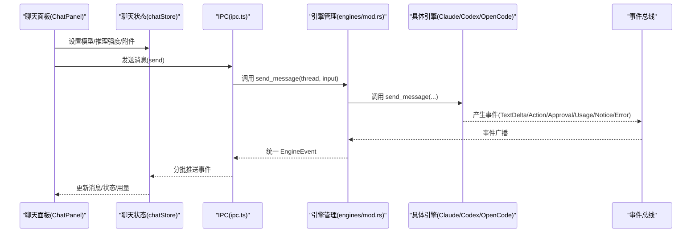
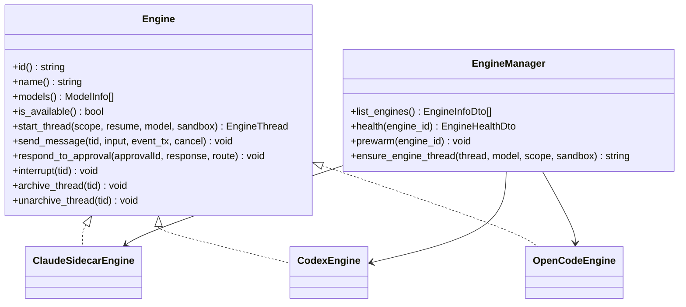
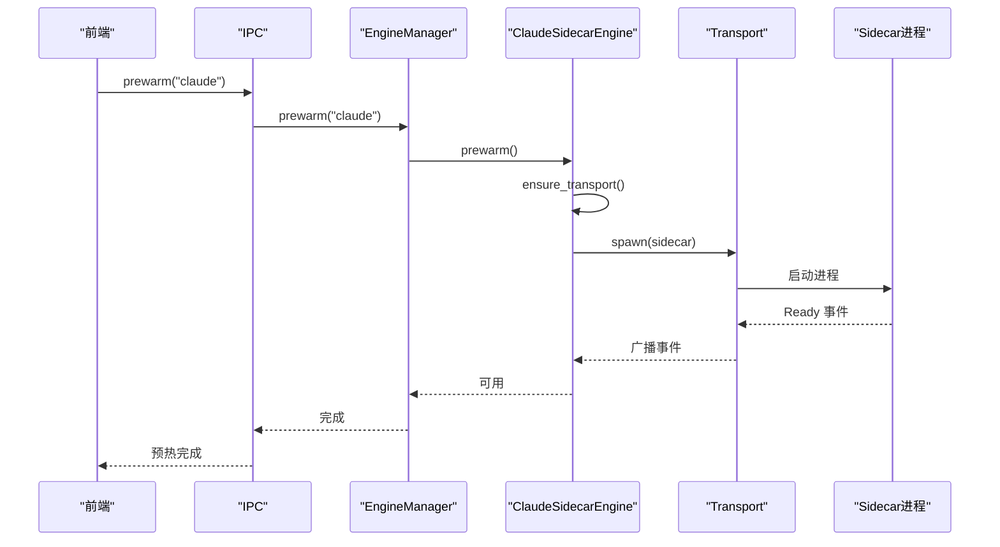
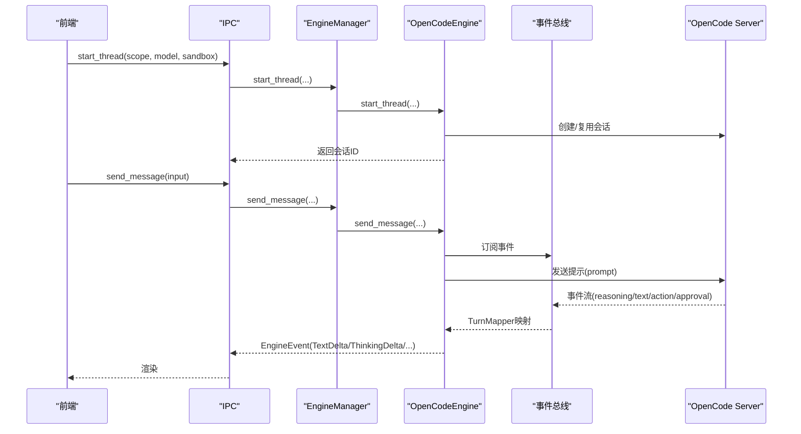
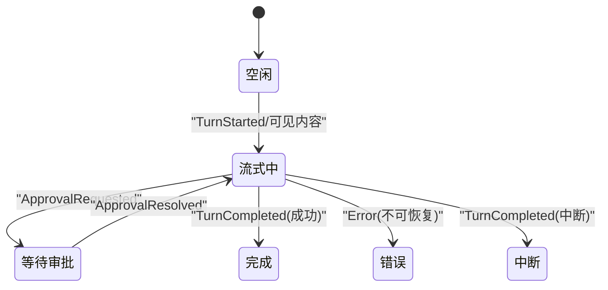
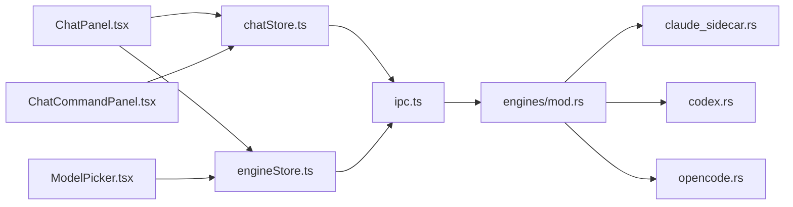

# 聊天和 AI 集成

<cite>
**本文引用的文件**
- [ChatPanel.tsx](file://src/components/chat/ChatPanel.tsx)
- [chatStore.ts](file://src/stores/chatStore.ts)
- [engineStore.ts](file://src/stores/engineStore.ts)
- [chatEngineIds.ts](file://src/lib/chatEngineIds.ts)
- [ModelPicker.tsx](file://src/components/chat/ModelPicker.tsx)
- [ChatCommandPanel.tsx](file://src/components/chat/ChatCommandPanel.tsx)
- [mod.rs](file://src-tauri/src/engines/mod.rs)
- [claude_sidecar.rs](file://src-tauri/src/engines/claude_sidecar.rs)
- [codex.rs](file://src-tauri/src/engines/codex.rs)
- [opencode.rs](file://src-tauri/src/engines/opencode.rs)
</cite>

## 目录
1. [引言](#引言)
2. [项目结构](#项目结构)
3. [核心组件](#核心组件)
4. [架构总览](#架构总览)
5. [详细组件分析](#详细组件分析)
6. [依赖关系分析](#依赖关系分析)
7. [性能考量](#性能考量)
8. [故障排查指南](#故障排查指南)
9. [结论](#结论)
10. [附录](#附录)

## 引言
本文件系统性梳理聊天与 AI 集成模块的设计与实现，覆盖以下主题：
- AI 引擎抽象层设计：统一接口、能力边界、生命周期与健康检查
- 多引擎集成：Claude（含 Sidecar 与本地原生）、Codex、OpenCode 的差异与共性
- 聊天消息管理：消息窗口、流式事件聚合、状态机与回放
- 线程与会话：线程启动、沙箱策略、权限模式、模型选择与推理强度
- 用户界面：模型选择器、聊天命令面板、权限与审批交互
- 生命周期管理：预热、健康检查、错误恢复与协议诊断
- 使用场景与配置建议：基于能力矩阵与平台特性给出实践指导

## 项目结构
前端采用 React + Zustand 状态管理，后端以 Tauri Rust 引擎子系统为核心，通过 IPC 桥接前后端。

```mermaid
graph TB
subgraph "前端"
CP["ChatPanel.tsx"]
MP["ModelPicker.tsx"]
CCP["ChatCommandPanel.tsx"]
CS["chatStore.ts"]
ES["engineStore.ts"]
end
subgraph "IPC"
IPC["ipc.ts"]
end
subgraph "后端引擎(Rust)"
EM["engines/mod.rs"]
CSD["claude_sidecar.rs"]
CX["codex.rs"]
OC["opencode.rs"]
end
CP --> CS
MP --> ES
CCP --> CS
CS --> IPC
ES --> IPC
IPC --> EM
EM --> CSD
EM --> CX
EM --> OC
```

图示来源
- [ChatPanel.tsx:1-120](file://src/components/chat/ChatPanel.tsx#L1-L120)
- [ModelPicker.tsx:1-120](file://src/components/chat/ModelPicker.tsx#L1-L120)
- [ChatCommandPanel.tsx:1-120](file://src/components/chat/ChatCommandPanel.tsx#L1-L120)
- [chatStore.ts:1-120](file://src/stores/chatStore.ts#L1-L120)
- [engineStore.ts:1-120](file://src/stores/engineStore.ts#L1-L120)
- [mod.rs:463-478](file://src-tauri/src/engines/mod.rs#L463-L478)

章节来源
- [ChatPanel.tsx:1-120](file://src/components/chat/ChatPanel.tsx#L1-L120)
- [ModelPicker.tsx:1-120](file://src/components/chat/ModelPicker.tsx#L1-L120)
- [ChatCommandPanel.tsx:1-120](file://src/components/chat/ChatCommandPanel.tsx#L1-L120)
- [chatStore.ts:1-120](file://src/stores/chatStore.ts#L1-L120)
- [engineStore.ts:1-120](file://src/stores/engineStore.ts#L1-L120)
- [mod.rs:463-478](file://src-tauri/src/engines/mod.rs#L463-L478)

## 核心组件
- 前端聊天面板与输入处理：负责消息渲染、附件过滤、工具输入审批、模型与推理强度展示与切换
- 聊天状态存储：统一管理当前线程、消息窗口、流式事件队列、权限审批、用量限制与错误状态
- 引擎状态存储：列举可用引擎、拉取健康报告、合并运行时诊断
- 引擎抽象与多实现：定义统一 Engine 接口，分别由 Claude/Sidecar、Codex、OpenCode 实现
- 命令面板：提供线程级操作（复刻、回滚、压缩）、配置项（服务等级、个性）、信息浏览（技能、代理、命令、会话、MCP、实验特性）

章节来源
- [ChatPanel.tsx:120-300](file://src/components/chat/ChatPanel.tsx#L120-L300)
- [chatStore.ts:24-120](file://src/stores/chatStore.ts#L24-L120)
- [engineStore.ts:5-120](file://src/stores/engineStore.ts#L5-L120)
- [mod.rs:419-461](file://src-tauri/src/engines/mod.rs#L419-L461)
- [ChatCommandPanel.tsx:37-120](file://src/components/chat/ChatCommandPanel.tsx#L37-L120)

## 架构总览
整体采用“前端 UI + 状态管理 + IPC + 后端引擎”的分层架构。前端通过 IPC 发起线程启动、发送消息、响应审批；后端引擎负责与外部服务或本地进程交互，并将事件映射为统一的 EngineEvent 流返回前端。



图示来源
- [ChatPanel.tsx:1-120](file://src/components/chat/ChatPanel.tsx#L1-L120)
- [chatStore.ts:38-80](file://src/stores/chatStore.ts#L38-L80)
- [mod.rs:795-800](file://src-tauri/src/engines/mod.rs#L795-L800)

章节来源
- [mod.rs:795-800](file://src-tauri/src/engines/mod.rs#L795-L800)
- [chatStore.ts:231-291](file://src/stores/chatStore.ts#L231-L291)

## 详细组件分析

### AI 引擎抽象层与生命周期
- 抽象接口 Engine：定义引擎标识、名称、模型列表、可用性检测、线程启动、消息发送、转向、审批响应、中断、归档/反归档等方法
- 引擎管理 EngineManager：集中管理 Codex、Claude（Sidecar 与原生）、OpenCode，提供 list_engines、health、prewarm 等能力
- 生命周期与健康检查：各引擎提供 health_report 或 health，包含可用性、版本、检查项、警告、修复建议与协议诊断
- 预热机制：前端在空闲时按节流阈值触发 prewarm，避免频繁重启带来的延迟



图示来源
- [mod.rs:419-461](file://src-tauri/src/engines/mod.rs#L419-L461)
- [mod.rs:463-553](file://src-tauri/src/engines/mod.rs#L463-L553)

章节来源
- [mod.rs:419-461](file://src-tauri/src/engines/mod.rs#L419-L461)
- [mod.rs:555-615](file://src-tauri/src/engines/mod.rs#L555-L615)
- [ChatPanel.tsx:534-570](file://src/components/chat/ChatPanel.tsx#L534-L570)

### Claude 引擎（Sidecar）
- 传输与协议：基于 Node.js 进程与 Claude Agent SDK 的 Sidecar，通过 JSON 行协议通信，事件类型覆盖文本增量、思考增量、动作、审批请求、用量更新、错误等
- 健康检查：检测 Node 可用性、侧车脚本存在性、API Key 状态，生成检查清单、警告与修复建议
- 预热：确保 Sidecar 就绪，等待 Ready 事件
- 认证与错误：识别认证失败类错误，必要时终止并清理进程



图示来源
- [claude_sidecar.rs:517-596](file://src-tauri/src/engines/claude_sidecar.rs#L517-L596)
- [claude_sidecar.rs:633-702](file://src-tauri/src/engines/claude_sidecar.rs#L633-L702)

章节来源
- [claude_sidecar.rs:1-120](file://src-tauri/src/engines/claude_sidecar.rs#L1-L120)
- [claude_sidecar.rs:517-596](file://src-tauri/src/engines/claude_sidecar.rs#L517-L596)
- [claude_sidecar.rs:633-702](file://src-tauri/src/engines/claude_sidecar.rs#L633-L702)

### Codex 引擎
- 协议与传输：自研协议，支持 thread/start、turn/start、通知/请求分发、审批路由持久化
- 线程与沙箱：支持工作区写入沙箱探测与外部沙箱强制，记录线程运行时参数（模型、策略、权限、理由强度、服务等级、个性、输出模式）
- 事件映射：TurnEventMapper 将底层事件映射为统一 EngineEvent，处理速率限制、认证失效、沙箱拒绝等场景
- 速率限制与超时：账户限额查询、TURN 请求超时、传输重启退避策略


图示来源
- [codex.rs:524-750](file://src-tauri/src/engines/codex.rs#L524-L750)
- [codex.rs:745-800](file://src-tauri/src/engines/codex.rs#L745-L800)

章节来源
- [codex.rs:1-120](file://src-tauri/src/engines/codex.rs#L1-L120)
- [codex.rs:385-522](file://src-tauri/src/engines/codex.rs#L385-L522)
- [codex.rs:524-750](file://src-tauri/src/engines/codex.rs#L524-L750)

### OpenCode 引擎
- 服务器与会话：每个工作区维护独立 HTTP 服务器实例，会话按权限模式（ask/allow/deny）隔离
- 事件总线：基于 SSE 的事件总线，按会话过滤事件，TurnMapper 将部分/增量文本映射为统一事件
- 权限与问题：支持“问题型”审批（问答），并可直接返回决策
- 代理与推理强度：支持指定代理与推理强度，模型能力来自运行时目录扫描



图示来源
- [opencode.rs:586-685](file://src-tauri/src/engines/opencode.rs#L586-L685)
- [opencode.rs:687-800](file://src-tauri/src/engines/opencode.rs#L687-L800)

章节来源
- [opencode.rs:1-120](file://src-tauri/src/engines/opencode.rs#L1-L120)
- [opencode.rs:586-685](file://src-tauri/src/engines/opencode.rs#L586-L685)
- [opencode.rs:687-800](file://src-tauri/src/engines/opencode.rs#L687-L800)

### 聊天消息管理与状态机
- 消息窗口与虚拟化：大消息集采用虚拟化策略，估算高度与可视区域滚动
- 流式事件聚合：TextDelta/ThinkingDelta/ActionOutputDelta 等事件按类型合并，减少渲染抖动
- 状态机：根据事件类型推进状态（等待审批、流式中、完成、错误、中断），并记录首次内容/文本指标
- 审批与权限：支持不同引擎的审批格式与权限模式，前端构建响应载荷并回传



图示来源
- [chatStore.ts:114-155](file://src/stores/chatStore.ts#L114-L155)
- [chatStore.ts:231-291](file://src/stores/chatStore.ts#L231-L291)

章节来源
- [chatStore.ts:114-155](file://src/stores/chatStore.ts#L114-L155)
- [chatStore.ts:231-291](file://src/stores/chatStore.ts#L231-L291)

### 模型选择器与推理强度
- 引擎与模型枚举：前端从引擎状态读取模型列表，按引擎分组显示
- OpenCode 模型分组：按 Provider 聚合，支持搜索与“历史隐藏模型”展开
- 元数据与限制：显示视觉/PDF/文本附件支持、上下文/输入/输出令牌上限
- 推理强度：按模型支持列出可选强度，短标签与完整标签切换

章节来源
- [ModelPicker.tsx:1-120](file://src/components/chat/ModelPicker.tsx#L1-L120)
- [ModelPicker.tsx:116-164](file://src/components/chat/ModelPicker.tsx#L116-L164)
- [ModelPicker.tsx:235-260](file://src/components/chat/ModelPicker.tsx#L235-L260)

### 聊天命令面板与线程操作
- 命令类型：评审、复刻、回滚、压缩、快速模式、个性、技能、代理、命令、会话、MCP、实验特性
- 评审目标与交付：支持未提交变更、基线分支、提交、自定义指令
- 会话浏览：按活跃/归档筛选、搜索、分页加载、附加到本地线程
- 回滚确认：输入回合数并校验

章节来源
- [ChatCommandPanel.tsx:37-120](file://src/components/chat/ChatCommandPanel.tsx#L37-L120)
- [ChatCommandPanel.tsx:107-182](file://src/components/chat/ChatCommandPanel.tsx#L107-L182)
- [ChatCommandPanel.tsx:295-533](file://src/components/chat/ChatCommandPanel.tsx#L295-L533)

## 依赖关系分析
- 前端依赖
  - Zustand 状态：chatStore、engineStore
  - IPC：封装后端能力调用（引擎列表、健康、预热、线程操作、远程资源）
  - UI 组件：ChatPanel、ModelPicker、ChatCommandPanel
- 后端依赖
  - Engine 抽象：统一接口约束
  - 各引擎实现：Claude Sidecar、Codex、OpenCode
  - 协议与传输：JSON 行协议、HTTP SSE、TCP 本地服务



图示来源
- [ChatPanel.tsx:1-120](file://src/components/chat/ChatPanel.tsx#L1-L120)
- [ModelPicker.tsx:1-120](file://src/components/chat/ModelPicker.tsx#L1-L120)
- [ChatCommandPanel.tsx:1-120](file://src/components/chat/ChatCommandPanel.tsx#L1-L120)
- [chatStore.ts:1-120](file://src/stores/chatStore.ts#L1-L120)
- [engineStore.ts:1-120](file://src/stores/engineStore.ts#L1-L120)
- [mod.rs:463-553](file://src-tauri/src/engines/mod.rs#L463-L553)

章节来源
- [mod.rs:463-553](file://src-tauri/src/engines/mod.rs#L463-L553)

## 性能考量
- 事件聚合与去抖：对连续 TextDelta/ThinkingDelta/ActionOutputDelta 合并，降低渲染压力
- 虚拟化与估算：大消息列表启用虚拟化，按固定行高估算可视范围
- 预热节流：按引擎维度进行预热节流，避免频繁重启
- 超时与退避：TURN 请求与传输重启采用超时与指数退避，提升稳定性
- 令牌统计与首帧指标：记录首次 Shell/内容/文本到达时间，辅助性能观测

章节来源
- [chatStore.ts:231-291](file://src/stores/chatStore.ts#L231-L291)
- [chatStore.ts:157-180](file://src/stores/chatStore.ts#L157-L180)
- [ChatPanel.tsx:534-570](file://src/components/chat/ChatPanel.tsx#L534-L570)
- [codex.rs:72-84](file://src-tauri/src/engines/codex.rs#L72-L84)

## 故障排查指南
- 引擎不可用
  - Claude：检查 Node.js 是否在 PATH、侧车脚本是否存在、API Key 设置情况
  - Codex：检查 `codex` 可执行文件是否在 PATH，认证相关错误需重置传输
  - OpenCode：检查本地可执行文件、SSE 事件总线、会话权限模式
- 审批与权限
  - 不同引擎的审批字段与决策集合不同，需按引擎规范化后再提交
  - Claude 支持“取消”映射为“拒绝”，OpenCode 支持“问题型”审批
- 会话与线程
  - 外部沙箱模式：Codex 在探测到工作区写入失败时会强制外部沙箱
  - 回滚/压缩：谨慎使用，注意数据不可逆性
- 事件丢失与超时
  - SSE/JSON 行协议超时或传输异常时，引擎会尝试重连与恢复，必要时中断 TURN 并清理状态

章节来源
- [claude_sidecar.rs:633-702](file://src-tauri/src/engines/claude_sidecar.rs#L633-L702)
- [codex.rs:745-800](file://src-tauri/src/engines/codex.rs#L745-L800)
- [opencode.rs:687-800](file://src-tauri/src/engines/opencode.rs#L687-L800)
- [mod.rs:189-242](file://src-tauri/src/engines/mod.rs#L189-L242)

## 结论
该聊天与 AI 集成方案通过统一的引擎抽象与事件协议，实现了多引擎（Claude、Codex、OpenCode）的一致体验。前端以状态驱动渲染，结合事件聚合与虚拟化优化，保证了良好的交互性能。后端通过健康检查、预热与错误恢复机制，提升了鲁棒性。命令面板与模型选择器进一步增强了工程化与可配置性。建议在生产环境中结合平台特性（如 macOS 的登录 shell PATH 问题）完善环境准备，并针对不同引擎的能力差异制定合适的权限与沙箱策略。

## 附录
- 引擎能力矩阵（摘自后端能力常量）
  - Claude/Claude Code Native：权限模式（受限/标准/可信），沙箱模式（只读/工作区写），审批决策（接受/拒绝/会话接受）
  - Codex：权限模式（不受信/按失败/按请求/永不），沙箱模式（只读/工作区写/危险全权限），审批决策（接受/拒绝/取消/会话接受）
  - OpenCode：权限模式（询问/允许/拒绝），审批决策（接受/拒绝/取消/会话接受）

章节来源
- [mod.rs:121-157](file://src-tauri/src/engines/mod.rs#L121-L157)