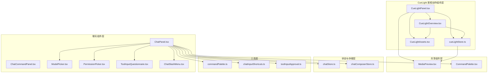
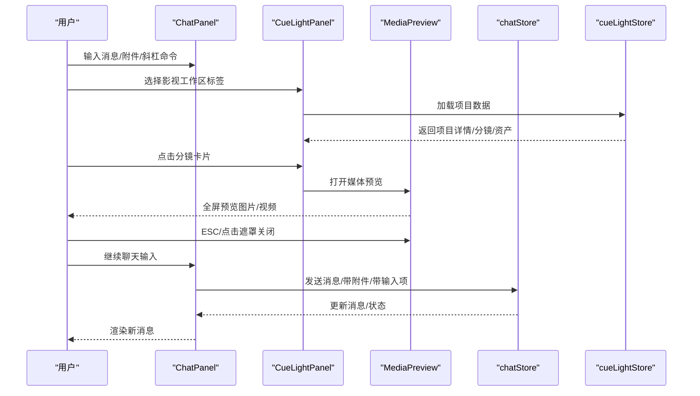
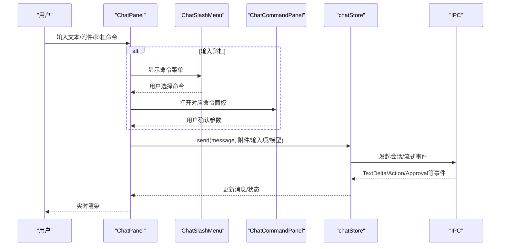
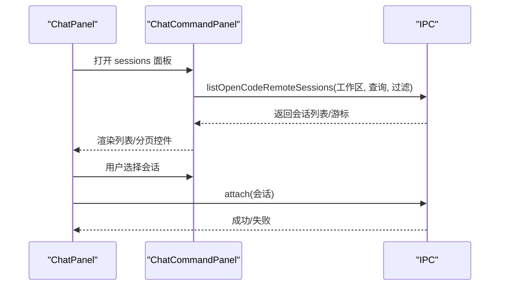
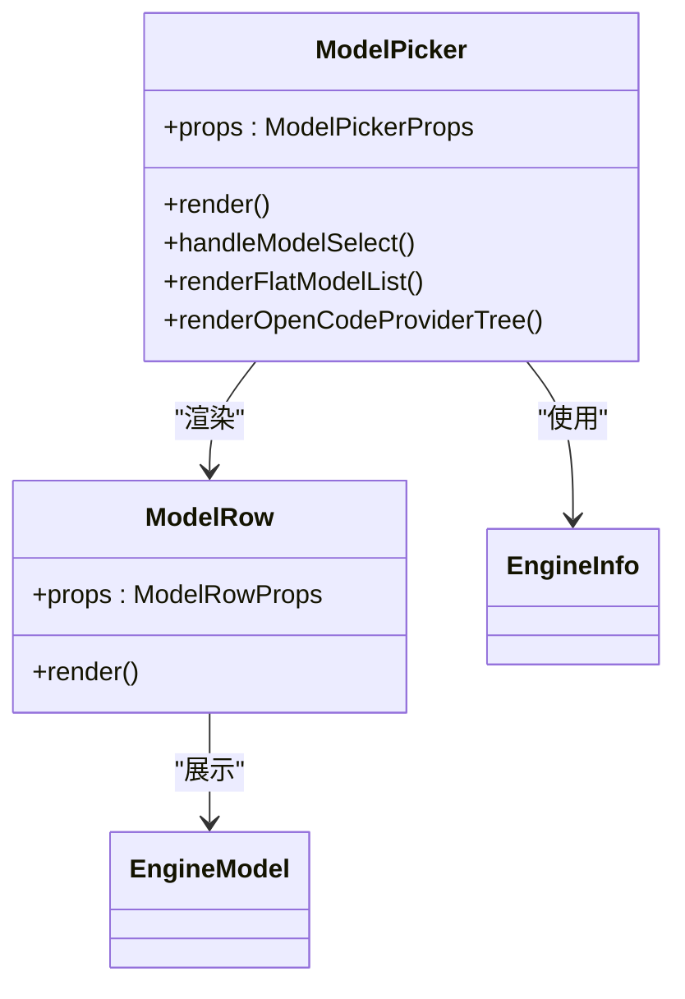
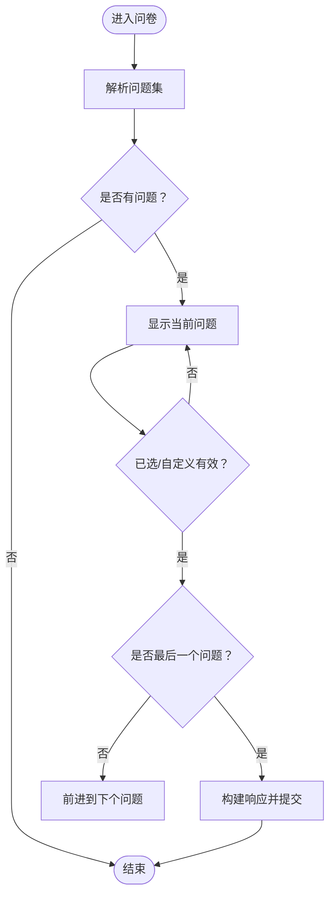
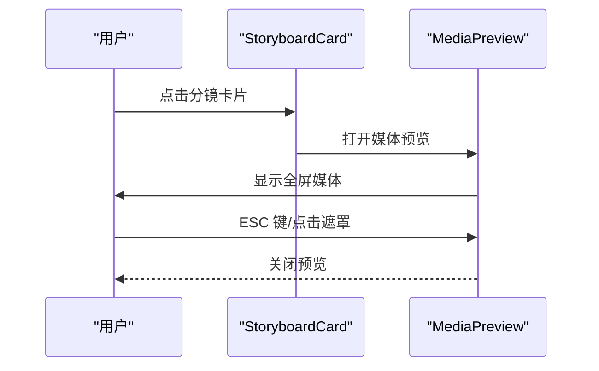
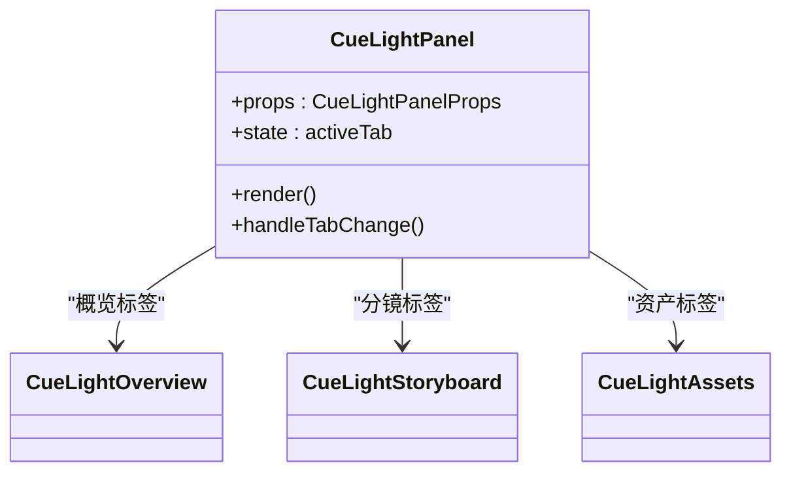
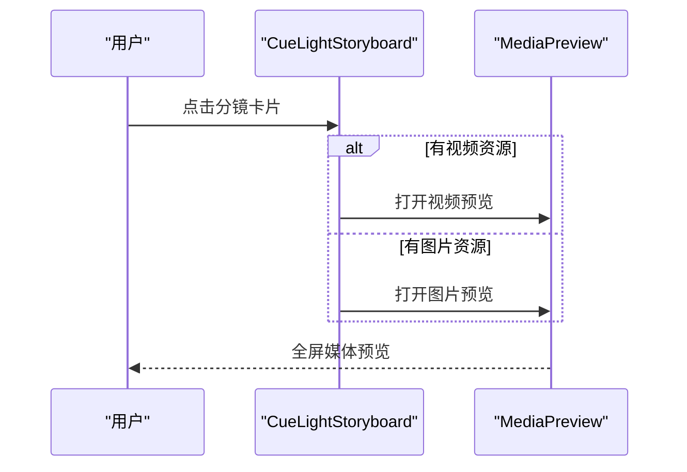
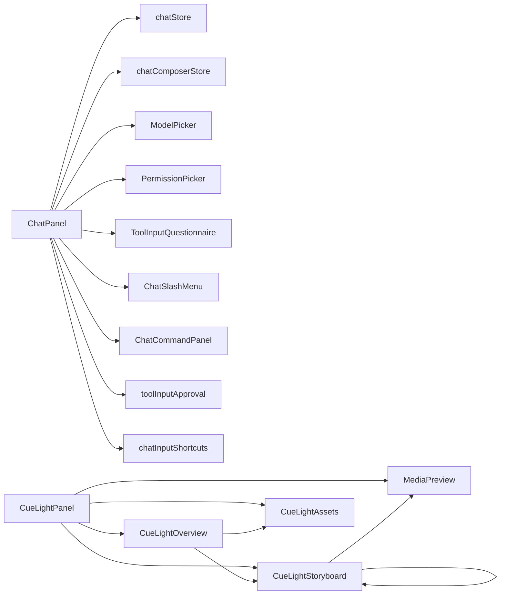

# 聊天界面组件

<cite>
**本文档引用的文件**
- [ChatPanel.tsx](file://src/components/chat/ChatPanel.tsx)
- [ChatCommandPanel.tsx](file://src/components/chat/ChatCommandPanel.tsx)
- [ModelPicker.tsx](file://src/components/chat/ModelPicker.tsx)
- [PermissionPicker.tsx](file://src/components/chat/PermissionPicker.tsx)
- [ToolInputQuestionnaire.tsx](file://src/components/chat/ToolInputQuestionnaire.tsx)
- [ChatSlashMenu.tsx](file://src/components/chat/ChatSlashMenu.tsx)
- [chatInputShortcuts.ts](file://src/components/chat/chatInputShortcuts.ts)
- [toolInputApproval.ts](file://src/components/chat/toolInputApproval.ts)
- [chatStore.ts](file://src/stores/chatStore.ts)
- [chatComposerStore.ts](file://src/stores/chatComposerStore.ts)
- [CommandPalette.tsx](file://src/components/shared/CommandPalette.tsx)
- [commandPalette.ts](file://src/lib/commandPalette.ts)
- [MediaPreview.tsx](file://src/components/shared/MediaPreview.tsx)
- [CueLightPanel.tsx](file://src/components/cuelight/CueLightPanel.tsx)
- [CueLightOverview.tsx](file://src/components/cuelight/CueLightOverview.tsx)
- [CueLightStoryboard.tsx](file://src/components/cuelight/CueLightStoryboard.tsx)
- [CueLightAssets.tsx](file://src/components/cuelight/CueLightAssets.tsx)
- [cueLightStore.ts](file://src/stores/cueLightStore.ts)
- [cueLightState.ts](file://src/contexts/cue-light/domain/cueLightState.ts)
- [cueLightStore.ts](file://src/contexts/cue-light/application/cueLightStore.ts)
- [ModelPicker.test.ts](file://src/components/chat/ModelPicker.test.ts)
- [chatInputShortcuts.test.ts](file://src/components/chat/chatInputShortcuts.test.ts)
</cite>

## 更新摘要
**所做更改**
- 新增 CueLight 影视创作工作区组件章节，包含 CueLightPanel、CueLightOverview、CueLightStoryboard、CueLightAssets 四个核心组件
- 新增 MediaPreview 媒体预览组件章节，支持图片和视频的缩放预览功能
- 更新架构总览图，增加 CueLight 工作流和媒体预览集成
- 扩展组件依赖关系分析，包含新的工作区绑定和媒体预览功能
- 增强聊天界面功能说明，涵盖影视创作工作区集成

## 目录
1. [简介](#简介)
2. [项目结构](#项目结构)
3. [核心组件](#核心组件)
4. [架构总览](#架构总览)
5. [详细组件分析](#详细组件分析)
6. [依赖关系分析](#依赖关系分析)
7. [性能考量](#性能考量)
8. [故障排除指南](#故障排除指南)
9. [结论](#结论)
10. [附录](#附录)

## 简介
本文件系统性梳理聊天界面的核心 UI 组件，涵盖聊天面板、命令面板、模型选择器、权限选择器与工具问卷等模块。重点阐述组件间交互关系、状态传递与事件处理机制，以及聊天输入处理、快捷键支持、自动补全与智能提示能力。同时提供组件定制化、主题适配与响应式设计的技术要点，并给出测试策略与可访问性最佳实践。

**新增** 本次更新特别增加了对 CueLight 影视创作工作区组件和 MediaPreview 媒体预览组件的详细说明，扩展了聊天界面的功能边界，使其能够支持更丰富的多媒体内容处理和影视创作工作流。

## 项目结构
聊天相关组件主要位于 src/components/chat 目录，配合 stores 与 lib 层进行状态管理与业务逻辑处理；新增的 CueLight 影视创作组件位于 src/components/cuelight，共享组件（如媒体预览）位于 src/components/shared；测试用例位于 src/components/chat 下的 *.test.* 文件。

**图表来源**
- [ChatPanel.tsx:1-120](file://src/components/chat/ChatPanel.tsx#L1-L120)
- [CueLightPanel.tsx:1-71](file://src/components/cuelight/CueLightPanel.tsx#L1-L71)
- [MediaPreview.tsx:1-85](file://src/components/shared/MediaPreview.tsx#L1-L85)
- [cueLightStore.ts:1-14](file://src/stores/cueLightStore.ts#L1-L14)

**章节来源**
- [ChatPanel.tsx:1-120](file://src/components/chat/ChatPanel.tsx#L1-L120)
- [CueLightPanel.tsx:1-71](file://src/components/cuelight/CueLightPanel.tsx#L1-L71)
- [MediaPreview.tsx:1-85](file://src/components/shared/MediaPreview.tsx#L1-L85)

## 核心组件
- 聊天面板（ChatPanel）：承载消息渲染、输入处理、附件上传、命令菜单、权限与工具审批流程集成。
- 命令面板（ChatCommandPanel）：针对斜杠命令（/review、/fork、/rollback、/personality、/skills、/agents、/commands、/sessions、/mcp、/experimental）提供交互式配置面板。
- 模型选择器（ModelPicker）：引擎与模型浏览、推理强度（reasoning effort）选择、OpenCode 提供商分组与搜索。
- 权限选择器（PermissionPicker）：信任级别、审批策略、沙箱模式、网络访问等多维度权限配置。
- 工具问卷（ToolInputQuestionnaire）：动态生成工具调用所需的问答式输入表单。
- 斜杠菜单（ChatSlashMenu）：输入"/"时的命令候选项浮动菜单。
- 输入快捷键（chatInputShortcuts）：Enter+Shift/Ctrl/Cmd 的提交判定逻辑。
- 审批工具（toolInputApproval）：解析与构建工具/权限/动态调用的审批响应。
- **新增** 媒体预览（MediaPreview）：支持图片和视频的全屏预览，包含缩放控制和键盘快捷键支持。
- **新增** CueLight 影视创作面板（CueLightPanel）：影视工作区的主控制面板，包含概览、分镜和资产三个标签页。
- **新增** CueLight 概览（CueLightOverview）：展示项目基本信息、统计数据和最近生成内容。
- **新增** CueLight 分镜（CueLightStoryboard）：集数选择和分镜卡片网格展示，支持媒体预览。
- **新增** CueLight 资产（CueLightAssets）：角色、场景、道具和生成历史的分类资产管理。

**章节来源**
- [ChatPanel.tsx:1-120](file://src/components/chat/ChatPanel.tsx#L1-L120)
- [ChatCommandPanel.tsx:1-120](file://src/components/chat/ChatCommandPanel.tsx#L1-L120)
- [ModelPicker.tsx:1-120](file://src/components/chat/ModelPicker.tsx#L1-L120)
- [PermissionPicker.tsx:1-120](file://src/components/chat/PermissionPicker.tsx#L1-L120)
- [ToolInputQuestionnaire.tsx:1-120](file://src/components/chat/ToolInputQuestionnaire.tsx#L1-L120)
- [ChatSlashMenu.tsx:1-116](file://src/components/chat/ChatSlashMenu.tsx#L1-L116)
- [chatInputShortcuts.ts:1-16](file://src/components/chat/chatInputShortcuts.ts#L1-L16)
- [toolInputApproval.ts:1-120](file://src/components/chat/toolInputApproval.ts#L1-L120)
- [MediaPreview.tsx:1-85](file://src/components/shared/MediaPreview.tsx#L1-L85)
- [CueLightPanel.tsx:1-71](file://src/components/cuelight/CueLightPanel.tsx#L1-L71)
- [CueLightOverview.tsx:1-125](file://src/components/cuelight/CueLightOverview.tsx#L1-L125)
- [CueLightStoryboard.tsx:1-193](file://src/components/cuelight/CueLightStoryboard.tsx#L1-L193)
- [CueLightAssets.tsx:1-188](file://src/components/cuelight/CueLightAssets.tsx#L1-L188)

## 架构总览
聊天界面采用"组件-状态-存储-服务"的分层架构，现已扩展支持 CueLight 影视创作工作区和媒体预览功能：
- 组件层负责 UI 渲染与用户交互；
- 存储层（Zustand）集中管理线程、消息、附件、运行时快照以及 CueLight 工作区状态；
- 服务层通过 IPC 与后端引擎通信，处理流式事件与审批请求；
- 工具层提供快捷键、命令面板、审批解析等通用能力；
- **新增** 媒体预览层提供图片和视频的全屏预览功能，支持缩放和键盘控制。

**图表来源**
- [ChatPanel.tsx:1-200](file://src/components/chat/ChatPanel.tsx#L1-L200)
- [CueLightPanel.tsx:20-71](file://src/components/cuelight/CueLightPanel.tsx#L20-L71)
- [MediaPreview.tsx:11-85](file://src/components/shared/MediaPreview.tsx#L11-L85)
- [cueLightStore.ts:17-144](file://src/contexts/cue-light/application/cueLightStore.ts#L17-L144)

## 详细组件分析

### 聊天面板（ChatPanel）
职责与特性
- 消息虚拟化渲染、高度测量与滚动优化；
- 附件类型过滤与扩展名支持（Codex/Cluade/OpenCode）；
- 斜杠命令菜单与命令面板联动；
- 权限与工具审批流程集成；
- 引擎预热与健康检查；
- 性能指标记录与错误处理。

交互流程（发送消息）

**章节来源**
- [ChatPanel.tsx:1-800](file://src/components/chat/ChatPanel.tsx#L1-L800)
- [chatStore.ts:1-200](file://src/stores/chatStore.ts#L1-L200)

### 命令面板（ChatCommandPanel）
职责与特性
- 针对不同斜杠命令（review/fork/rollback/personality/skills/agents/commands/sessions/mcp/experimental/fast）渲染专用面板；
- 支持配置项（服务等级、个性、技能列表、OpenCode 代理/命令/MCP 服务器等）；
- 列表浏览与分页加载（OpenCode 会话）；
- 错误状态与忙碌态反馈。

交互流程（/sessions）

**章节来源**
- [ChatCommandPanel.tsx:1-275](file://src/components/chat/ChatCommandPanel.tsx#L1-L275)

### 模型选择器（ModelPicker）
职责与特性
- 引擎与模型浏览、推理强度选择；
- OpenCode 提供商分组与搜索过滤；
- 元数据芯片（视觉/PDF/文件/上下文/输出限制）；
- 弹出层定位与点击外部关闭、Esc 关闭；
- 与引擎健康检查联动。

类图

**章节来源**
- [ModelPicker.tsx:1-754](file://src/components/chat/ModelPicker.tsx#L1-L754)
- [ModelPicker.test.ts:1-121](file://src/components/chat/ModelPicker.test.ts#L1-L121)

### 权限选择器（PermissionPicker）
职责与特性
- 多轨道配置：信任级别、审批策略、沙箱模式、网络访问；
- 选中态高亮与摘要展示；
- 自定义策略徽章；
- 弹出层定位与交互。

**章节来源**
- [PermissionPicker.tsx:1-382](file://src/components/chat/PermissionPicker.tsx#L1-L382)

### 工具问卷（ToolInputQuestionnaire）
职责与特性
- 解析 details 中的问题集合，按序渲染问答；
- 单选/多选与自定义回答；
- 上一步/下一步/提交流程控制；
- 与审批工具协作生成响应。

流程图

**章节来源**
- [ToolInputQuestionnaire.tsx:1-217](file://src/components/chat/ToolInputQuestionnaire.tsx#L1-L217)
- [toolInputApproval.ts:1-529](file://src/components/chat/toolInputApproval.ts#L1-L529)

### 斜杠菜单（ChatSlashMenu）
职责与特性
- 输入"/"时根据查询过滤命令；
- Portal 定位在触发元素下方；
- 外部点击与 Esc 关闭；
- 活动项滚动可视。

**章节来源**
- [ChatSlashMenu.tsx:1-116](file://src/components/chat/ChatSlashMenu.tsx#L1-L116)

### 输入快捷键（chatInputShortcuts）
职责与特性
- 判断 Enter 是否应提交（Shift/Ctrl/Cmd）；
- 排除 IME 输入组合。

**章节来源**
- [chatInputShortcuts.ts:1-16](file://src/components/chat/chatInputShortcuts.ts#L1-L16)
- [chatInputShortcuts.test.ts:1-59](file://src/components/chat/chatInputShortcuts.test.ts#L1-L59)

### 审批工具（toolInputApproval）
职责与特性
- 解析请求用户输入、动态工具调用、权限请求、MCP 请求等方法；
- 构建默认/自定义审批响应；
- 解析执行策略变更与网络策略变更提案；
- 解析动态工具调用名称与参数、MCP 表单模式与 Schema。

**章节来源**
- [toolInputApproval.ts:1-529](file://src/components/chat/toolInputApproval.ts#L1-L529)

### **新增** 媒体预览（MediaPreview）
职责与特性
- 支持图片和视频两种媒体类型的全屏预览；
- 键盘快捷键支持（ESC 关闭）；
- 图片缩放控制（+/- 按钮，范围 50%-300%）；
- 点击遮罩关闭功能；
- Portal 定位到 document.body，确保层级正确；
- 无障碍支持（关闭按钮 aria-label）。

交互流程

**章节来源**
- [MediaPreview.tsx:1-85](file://src/components/shared/MediaPreview.tsx#L1-L85)

### **新增** CueLight 影视创作面板（CueLightPanel）
职责与特性
- 影视工作区的主控制面板，集成概览、分镜和资产三个功能模块；
- 工作区绑定检查，未绑定时显示引导信息；
- 标签页切换功能，支持概览、分镜、资产三种视图；
- 与工作区存储和 CueLight 状态管理集成。

组件结构

**章节来源**
- [CueLightPanel.tsx:1-71](file://src/components/cuelight/CueLightPanel.tsx#L1-L71)

### **新增** CueLight 概览（CueLightOverview）
职责与特性
- 展示项目基本信息：标题、类型、宽高比等元数据；
- 统计数据展示：集数、分镜数量、视频资产数量；
- 世界观和风格设定的摘要展示；
- 最近生成内容的缩略图网格；
- 加载状态和错误处理。

**章节来源**
- [CueLightOverview.tsx:1-125](file://src/components/cuelight/CueLightOverview.tsx#L1-L125)

### **新增** CueLight 分镜（CueLightStoryboard）
职责与特性
- 集数选择和分镜卡片网格展示；
- 角色关联显示，支持角色头像预览；
- 分镜状态指示（完成/处理中/待处理）；
- 媒体预览集成，支持图片和视频预览；
- 加载状态管理和错误处理。

交互流程（分镜预览）

**章节来源**
- [CueLightStoryboard.tsx:1-193](file://src/components/cuelight/CueLightStoryboard.tsx#L1-L193)

### **新增** CueLight 资产（CueLightAssets）
职责与特性
- 角色、场景、道具和生成历史四个子标签页；
- 资产卡片网格布局，支持缩略图和基本信息展示；
- 动态加载不同类型的资产数据；
- 加载状态管理和错误处理。

**章节来源**
- [CueLightAssets.tsx:1-188](file://src/components/cuelight/CueLightAssets.tsx#L1-L188)

## 依赖关系分析
- ChatPanel 依赖 chatStore、chatComposerStore、ModelPicker、PermissionPicker、ToolInputQuestionnaire、ChatSlashMenu、ChatCommandPanel、toolInputApproval、chatInputShortcuts；
- **新增** CueLightPanel 依赖工作区存储、CueLightOverview、CueLightStoryboard、CueLightAssets；
- **新增** CueLightStoryboard 依赖 MediaPreview 进行媒体预览；
- **新增** MediaPreview 依赖 React Portal 和键盘事件处理；
- **新增** CueLight 状态管理依赖 cueLightStore 和相关 API 网关；
- ModelPicker 依赖引擎信息与健康状态；
- PermissionPicker 依赖信任级别与策略枚举；
- ToolInputQuestionnaire 依赖 toolInputApproval；
- CommandPalette 与 commandPalette 工具共同支撑全局命令入口。

**图表来源**
- [ChatPanel.tsx:1-200](file://src/components/chat/ChatPanel.tsx#L1-L200)
- [CueLightPanel.tsx:1-71](file://src/components/cuelight/CueLightPanel.tsx#L1-L71)
- [MediaPreview.tsx:1-85](file://src/components/shared/MediaPreview.tsx#L1-L85)
- [cueLightStore.ts:1-14](file://src/stores/cueLightStore.ts#L1-L14)

**章节来源**
- [ChatPanel.tsx:1-200](file://src/components/chat/ChatPanel.tsx#L1-L200)
- [CueLightPanel.tsx:1-71](file://src/components/cuelight/CueLightPanel.tsx#L1-L71)
- [MediaPreview.tsx:1-85](file://src/components/shared/MediaPreview.tsx#L1-L85)

## 性能考量
- 消息虚拟化：通过阈值与估算行高、间距与上/下缓冲区减少 DOM 数量，提升长对话渲染性能。
- 引擎预热：按引擎去抖/节流地触发预热，避免频繁初始化。
- 流事件批处理：对 TextDelta/ThinkingDelta/ActionOutputDelta 等进行合并，降低重绘频率。
- 本地状态缓存：Composer 运行时快照按工作区缓存，避免重复计算。
- **新增** CueLight 数据缓存：CueLightStore 内部缓存项目数据，避免重复请求；
- **新增** 媒体资源优化：分镜卡片使用缩略图，大图按需加载，支持懒加载；
- **新增** 预览组件卸载：MediaPreview 在关闭时清理事件监听器，避免内存泄漏。

**章节来源**
- [ChatPanel.tsx:119-170](file://src/components/chat/ChatPanel.tsx#L119-L170)
- [chatStore.ts:64-120](file://src/stores/chatStore.ts#L64-L120)
- [chatComposerStore.ts:1-30](file://src/stores/chatComposerStore.ts#L1-L30)
- [CueLightStoryboard.tsx:133-137](file://src/components/cuelight/CueLightStoryboard.tsx#L133-L137)
- [MediaPreview.tsx:15-23](file://src/components/shared/MediaPreview.tsx#L15-L23)

## 故障排除指南
- 输入提交无效
  - 检查快捷键组合是否满足 Shift/Ctrl/Cmd+Enter；
  - 确认 IME 输入状态未处于 composition。
- 审批弹窗不出现
  - 确认引擎返回了审批请求事件；
  - 检查工具问卷解析是否成功。
- 模型不可选或无建议
  - 检查引擎健康状态与可用性；
  - 对 OpenCode 使用搜索框过滤。
- 命令面板空白
  - 检查工作区 ID、模型 ID 与会话列表接口返回；
  - 查看错误提示与忙碌态。
- **新增** CueLight 工作区无数据显示
  - 检查工作区是否正确绑定 CueLight 项目；
  - 确认网络连接和 API 接口可用性；
  - 查看错误状态和加载指示器。
- **新增** 媒体预览无法打开
  - 检查媒体 URL 是否有效；
  - 确认浏览器对媒体格式的支持；
  - 查看控制台错误信息。

**章节来源**
- [chatInputShortcuts.ts:1-16](file://src/components/chat/chatInputShortcuts.ts#L1-L16)
- [toolInputApproval.ts:416-467](file://src/components/chat/toolInputApproval.ts#L416-L467)
- [ChatCommandPanel.tsx:295-375](file://src/components/chat/ChatCommandPanel.tsx#L295-L375)
- [CueLightPanel.tsx:27-39](file://src/components/cuelight/CueLightPanel.tsx#L27-L39)
- [MediaPreview.tsx:11-85](file://src/components/shared/MediaPreview.tsx#L11-L85)

## 结论
聊天界面组件围绕"输入—状态—渲染—审批—引擎"的闭环构建，具备良好的可扩展性与可维护性。通过虚拟化、预热与批处理等手段保障性能，借助工具问卷与权限选择器增强安全性与可控性。

**更新** 本次更新显著扩展了聊天界面的功能边界，新增的 CueLight 影视创作工作区组件提供了完整的影视制作工作流支持，包括项目概览、分镜管理和资产管控等功能。MediaPreview 组件则增强了多媒体内容的处理能力，支持图片和视频的全屏预览和缩放操作。

建议在后续迭代中进一步完善无障碍与国际化覆盖，并持续优化审批与命令面板的交互体验。同时可以考虑将 CueLight 工作区功能与聊天界面深度集成，实现更流畅的创作工作流。

## 附录

### 组件定制化与主题适配
- 颜色与尺寸：通过 CSS 变量与类名前缀（如 mp-/pp-/chat-*、cuelight-*）隔离样式，便于主题切换。
- 弹出层定位：统一使用 Portal 与相对定位，确保在窗口边界内正确显示。
- 图标与文案：使用 i18n 资源，支持多语言；图标来自 lucide-react，可替换为自定义 SVG。
- **新增** 媒体预览样式：通过独立的 CSS 类（media-preview-*）隔离预览组件样式。

### 响应式设计
- 弹出层宽度与位置：根据触发元素与窗口尺寸动态计算，保证移动端与桌面端一致体验。
- 虚拟化消息区域：基于固定估算高度与缓冲区，避免在小屏设备上出现卡顿。
- **新增** 媒体预览响应式：预览容器自适应不同屏幕尺寸，图片缩放比例在移动设备上可调整。

### 测试策略
- 单元测试
  - ModelPicker：模型分组、提供商识别、查询过滤、紧凑令牌格式化。
  - chatInputShortcuts：Enter 快捷键判定与 IME 排除。
  - **新增** MediaPreview：键盘事件处理、缩放控制、Portal 渲染。
  - **新增** CueLight 组件：工作区绑定检查、数据加载、标签页切换。
- 集成测试
  - ChatPanel 与 chatStore 的事件流对接；
  - ToolInputQuestionnaire 与 toolInputApproval 的响应构建；
  - **新增** CueLightStore 与 API 网关的数据同步。
- 可访问性
  - 为按钮与输入控件提供 aria-label/aria-pressed；
  - 确保键盘导航（Tab/Enter/Escape）完整覆盖；
  - 保持焦点管理与屏幕阅读器友好；
  - **新增** 媒体预览的无障碍支持（aria-label、键盘控制）。

**章节来源**
- [ModelPicker.test.ts:1-121](file://src/components/chat/ModelPicker.test.ts#L1-L121)
- [chatInputShortcuts.test.ts:1-59](file://src/components/chat/chatInputShortcuts.test.ts#L1-L59)
- [MediaPreview.tsx:1-85](file://src/components/shared/MediaPreview.tsx#L1-L85)
- [CueLightPanel.tsx:1-71](file://src/components/cuelight/CueLightPanel.tsx#L1-L71)
- [CueLightOverview.tsx:1-125](file://src/components/cuelight/CueLightOverview.tsx#L1-L125)
- [CueLightStoryboard.tsx:1-193](file://src/components/cuelight/CueLightStoryboard.tsx#L1-L193)
- [CueLightAssets.tsx:1-188](file://src/components/cuelight/CueLightAssets.tsx#L1-L188)