# Store 架构设计

<cite>
**本文档引用的文件**
- [chatStore.ts](file://src/stores/chatStore.ts)
- [threadStore.ts](file://src/stores/threadStore.ts)
- [workspaceStore.ts](file://src/stores/workspaceStore.ts)
- [uiStore.ts](file://src/stores/uiStore.ts)
- [terminalStore.ts](file://src/stores/terminalStore.ts)
- [gitStore.ts](file://src/stores/gitStore.ts)
- [engineStore.ts](file://src/stores/engineStore.ts)
- [harnessStore.ts](file://src/stores/harnessStore.ts)
- [toastStore.ts](file://src/stores/toastStore.ts)
- [onboardingStore.ts](file://src/stores/onboardingStore.ts)
- [chatComposerStore.ts](file://src/stores/chatComposerStore.ts)
- [updateStore.ts](file://src/stores/updateStore.ts)
- [workspacePaneStore.ts](file://src/stores/workspacePaneStore.ts)
- [types.ts](file://src/types.ts)
- [chatStore.test.ts](file://src/stores/chatStore.test.ts)
- [workspaceStore.test.ts](file://src/stores/workspaceStore.test.ts)
</cite>

## 目录
1. [引言](#引言)
2. [项目结构](#项目结构)
3. [核心组件](#核心组件)
4. [架构概览](#架构概览)
5. [详细组件分析](#详细组件分析)
6. [依赖分析](#依赖分析)
7. [性能考虑](#性能考虑)
8. [故障排除指南](#故障排除指南)
9. [结论](#结论)
10. [附录](#附录)

## 引言

Panes 项目采用基于 Zustand 的 Store 架构设计，通过模块化的状态管理实现复杂的多工作区、多线程聊天系统。该架构以功能域为中心进行组织，每个 Store 负责特定领域的状态管理和业务逻辑。

本设计的核心原则包括：
- **单一职责原则**：每个 Store 只负责一个明确的功能领域
- **状态隔离**：不同 Store 之间保持状态隔离，通过接口进行交互
- **异步状态管理**：充分利用 IPC 通信处理外部系统状态
- **性能优化**：实现缓存、去重和批量更新机制
- **类型安全**：完整的 TypeScript 类型定义确保编译时安全

## 项目结构

项目采用按功能域分层的 Store 组织方式：

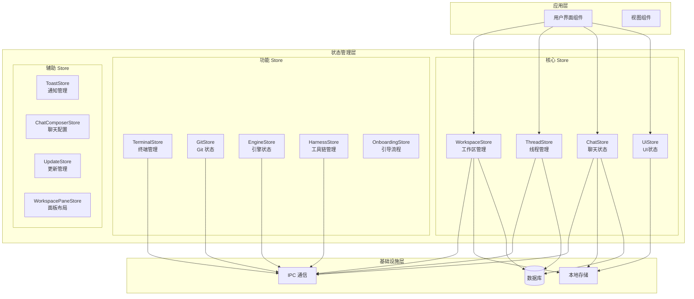

**图表来源**
- [workspaceStore.ts:134-429](file://src/stores/workspaceStore.ts#L134-L429)
- [threadStore.ts:164-713](file://src/stores/threadStore.ts#L164-L713)
- [chatStore.ts:1-800](file://src/stores/chatStore.ts#L1-L800)

**章节来源**
- [workspaceStore.ts:1-429](file://src/stores/workspaceStore.ts#L1-L429)
- [threadStore.ts:1-713](file://src/stores/threadStore.ts#L1-L713)
- [chatStore.ts:1-800](file://src/stores/chatStore.ts#L1-L800)

## 核心组件

### Store 架构模式

Panes 采用的 Store 架构遵循以下设计模式：

#### 1. 状态接口设计
每个 Store 定义清晰的状态接口，包含：
- **状态属性**：描述当前系统状态的数据字段
- **动作方法**：执行状态变更的操作函数
- **派生计算**：基于状态计算的派生属性

#### 2. 状态管理模式
- **局部状态**：Store 内部的私有状态
- **全局状态**：通过 Zustand 全局共享的状态
- **持久化状态**：通过 localStorage 持久化的状态

#### 3. 异步操作模式
- **加载状态**：跟踪异步操作的进行状态
- **错误处理**：统一的错误捕获和处理机制
- **缓存策略**：智能缓存和失效机制

**章节来源**
- [chatStore.ts:24-62](file://src/stores/chatStore.ts#L24-L62)
- [threadStore.ts:34-67](file://src/stores/threadStore.ts#L34-L67)
- [workspaceStore.ts:11-34](file://src/stores/workspaceStore.ts#L11-L34)

## 架构概览

### 整体架构设计

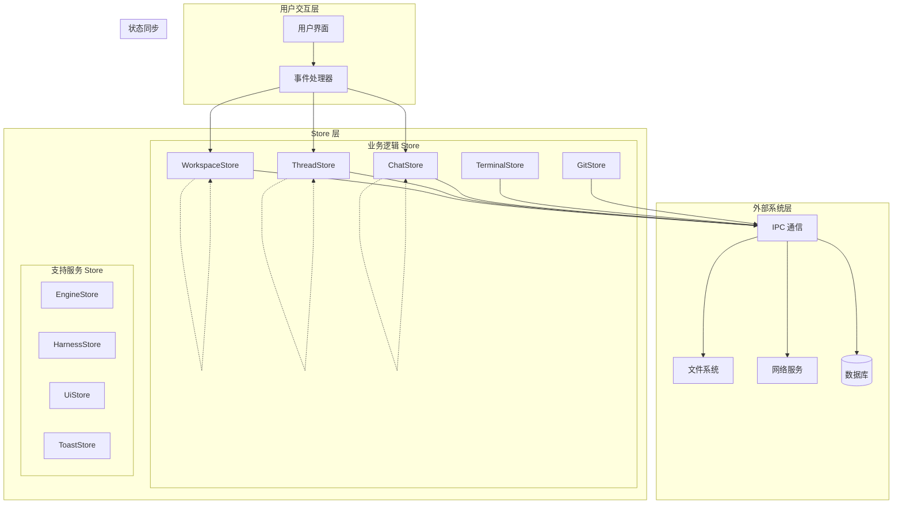

**图表来源**
- [types.ts:1-800](file://src/types.ts#L1-L800)
- [chatStore.ts:1-800](file://src/stores/chatStore.ts#L1-L800)

### 数据流架构

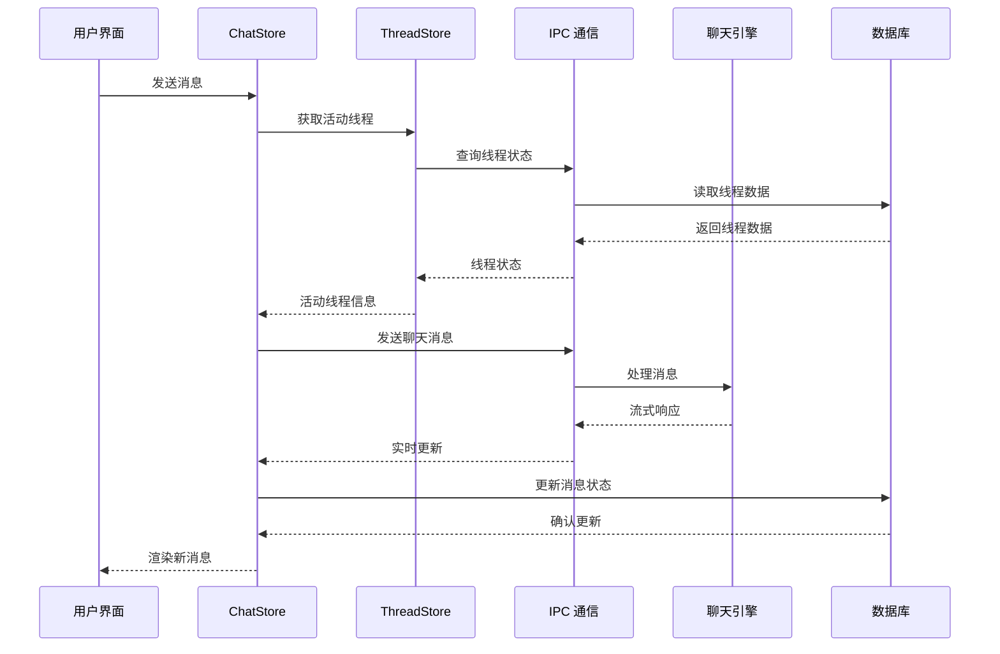

**图表来源**
- [chatStore.ts:38-59](file://src/stores/chatStore.ts#L38-L59)
- [threadStore.ts:41-63](file://src/stores/threadStore.ts#L41-L63)

## 详细组件分析

### WorkspaceStore 分析

WorkspaceStore 负责管理工作区和仓库的生命周期：

#### 核心职责
- 工作区的创建、打开、关闭和归档
- 仓库列表的加载和状态管理
- 工作区激活状态的维护
- Git 集成和信任级别管理

#### 状态结构设计

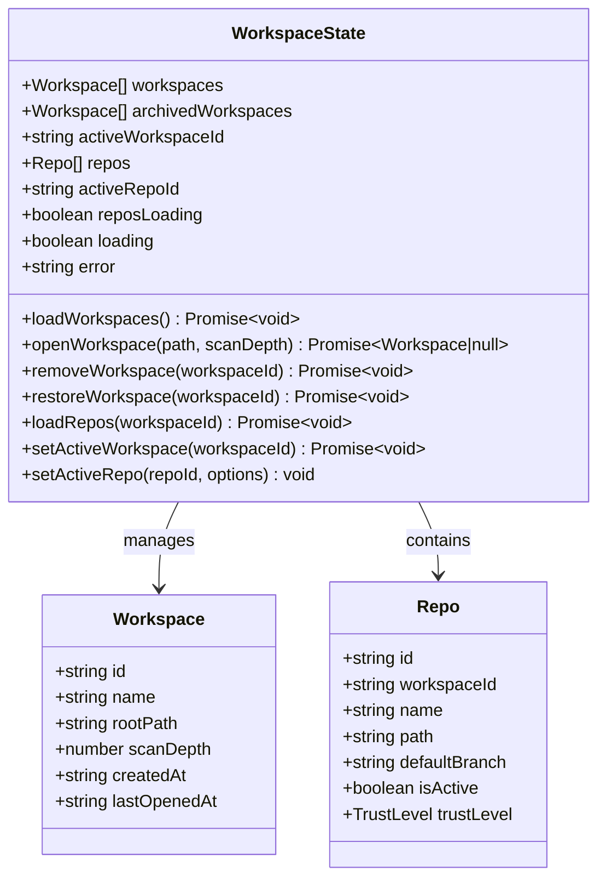

**图表来源**
- [workspaceStore.ts:11-34](file://src/stores/workspaceStore.ts#L11-L34)
- [types.ts:3-80](file://src/types.ts#L3-L80)

#### 关键特性
- **工作区持久化**：通过 localStorage 记录最后激活的工作区
- **仓库选择记忆**：记住每个工作区的最后激活仓库
- **Git 集成**：自动加载 Git 草稿和状态
- **终端准备**：激活工作区时准备终端环境

**章节来源**
- [workspaceStore.ts:134-429](file://src/stores/workspaceStore.ts#L134-L429)
- [types.ts:3-80](file://src/types.ts#L3-L80)

### ThreadStore 分析

ThreadStore 管理聊天线程的完整生命周期：

#### 核心职责
- 线程的创建、查询、更新和删除
- 线程状态的实时同步
- Codex 远程线程的关联和管理
- 线程元数据的持久化

#### 状态模型设计

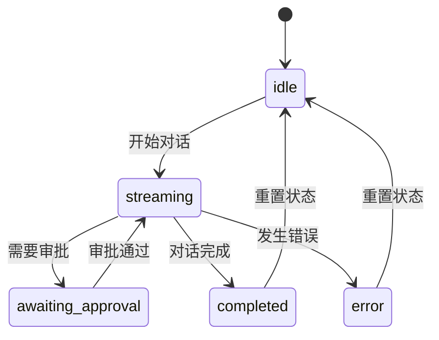

**图表来源**
- [types.ts:146-151](file://src/types.ts#L146-L151)
- [threadStore.ts:34-67](file://src/stores/threadStore.ts#L34-L67)

#### 动作定义规范
- **创建动作**：`createThread(input)` - 创建新线程
- **查询动作**：`ensureThreadForScope(input)` - 确保作用域内存在线程
- **管理动作**：`renameThread(threadId, title)` - 重命名线程
- **生命周期动作**：`removeThread(threadId)` - 删除线程

**章节来源**
- [threadStore.ts:164-713](file://src/stores/threadStore.ts#L164-L713)
- [types.ts:155-169](file://src/types.ts#L155-L169)

### ChatStore 分析

ChatStore 是最复杂的状态管理模块，负责聊天会话的完整生命周期：

#### 核心职责
- 实时聊天消息的发送和接收
- 流式响应的处理和渲染
- 审批请求的管理和响应
- 动作输出的延迟加载和显示

#### 状态结构设计

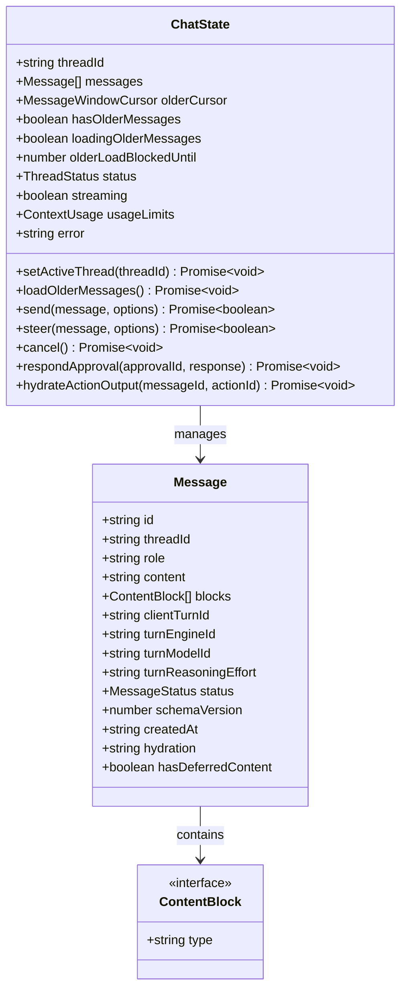

**图表来源**
- [chatStore.ts:24-62](file://src/stores/chatStore.ts#L24-L62)
- [types.ts:216-232](file://src/types.ts#L216-L232)
- [types.ts:434-446](file://src/types.ts#L434-L446)

#### 高级特性
- **流式处理**：智能合并和批处理流式事件
- **乐观更新**：立即显示用户消息，等待确认后更新
- **后台监听**：保持后台线程的事件流
- **性能指标**：记录聊天性能相关的度量数据

**章节来源**
- [chatStore.ts:1-800](file://src/stores/chatStore.ts#L1-L800)
- [types.ts:216-446](file://src/types.ts#L216-L446)

### TerminalStore 分析

TerminalStore 管理终端会话和布局：

#### 核心职责
- 终端会话的创建、管理和销毁
- 终端组的分割和重组
- 启动预设的序列化和反序列化
- 工作树配置和管理

#### 布局管理系统

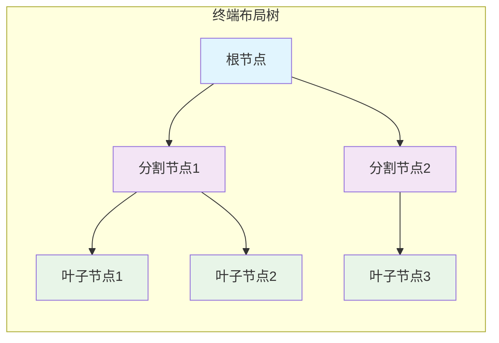

**图表来源**
- [terminalStore.ts:41-114](file://src/stores/terminalStore.ts#L41-L114)
- [workspacePaneStore.ts:12-27](file://src/stores/workspacePaneStore.ts#L12-L27)

**章节来源**
- [terminalStore.ts:1-800](file://src/stores/terminalStore.ts#L1-L800)
- [workspacePaneStore.ts:1-693](file://src/stores/workspacePaneStore.ts#L1-L693)

### GitStore 分析

GitStore 提供 Git 仓库的状态管理和操作：

#### 核心特性
- **智能缓存**：实现状态和差异的缓存机制
- **并发控制**：防止重复的 Git 操作
- **增量更新**：只更新变化的部分
- **性能监控**：记录 Git 操作的性能指标

#### 缓存策略

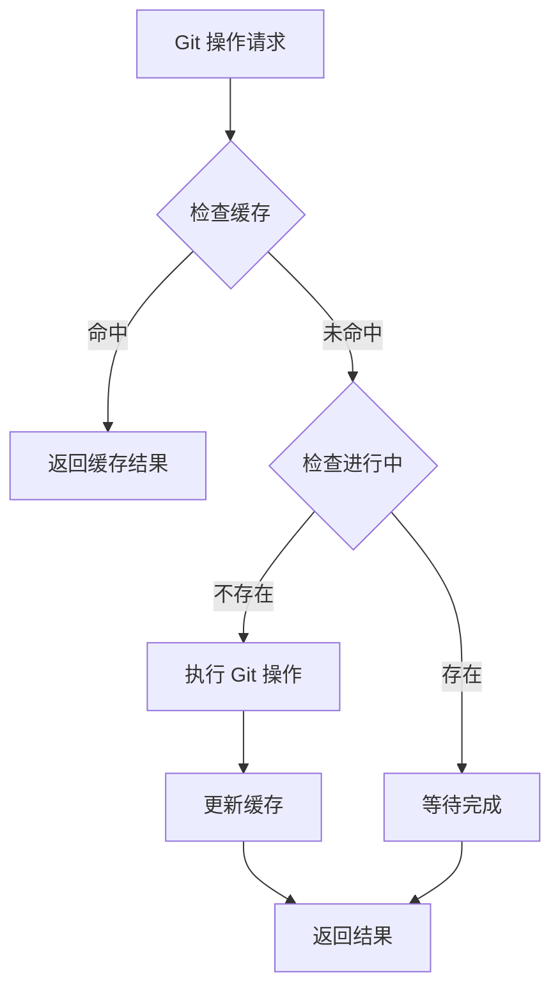

**图表来源**
- [gitStore.ts:259-300](file://src/stores/gitStore.ts#L259-L300)
- [gitStore.ts:302-349](file://src/stores/gitStore.ts#L302-L349)

**章节来源**
- [gitStore.ts:1-800](file://src/stores/gitStore.ts#L1-L800)

## 依赖分析

### Store 间依赖关系

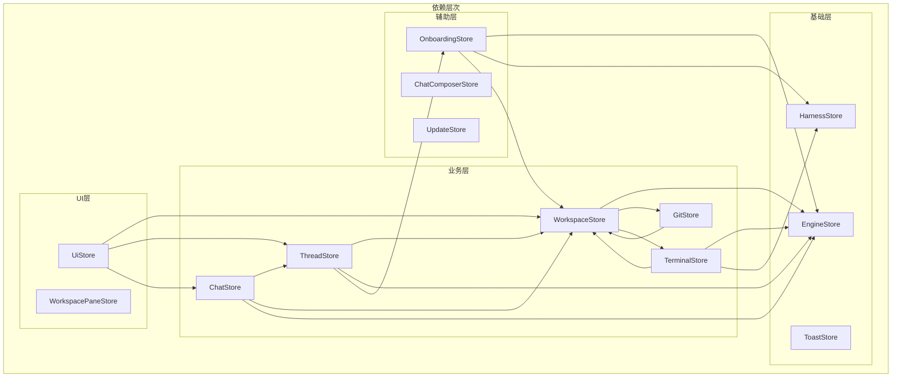

**图表来源**
- [threadStore.ts:1-13](file://src/stores/threadStore.ts#L1-L13)
- [chatStore.ts:1-4](file://src/stores/chatStore.ts#L1-L4)
- [terminalStore.ts:1-6](file://src/stores/terminalStore.ts#L1-L6)

### 数据流向

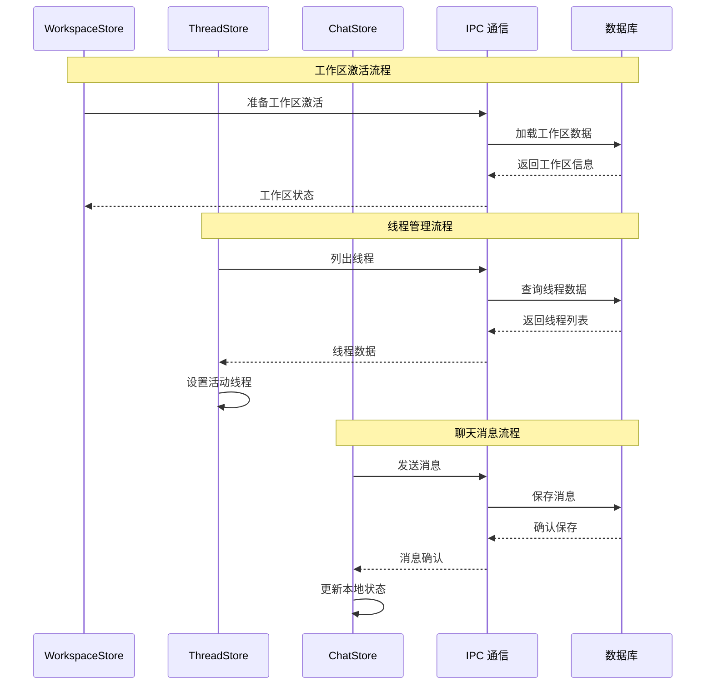

**图表来源**
- [workspaceStore.ts:142-154](file://src/stores/workspaceStore.ts#L142-L154)
- [threadStore.ts:170-220](file://src/stores/threadStore.ts#L170-L220)
- [chatStore.ts:38-59](file://src/stores/chatStore.ts#L38-L59)

**章节来源**
- [threadStore.ts:1-713](file://src/stores/threadStore.ts#L1-L713)
- [chatStore.ts:1-800](file://src/stores/chatStore.ts#L1-L800)

## 性能考虑

### 缓存策略

Panes 实现了多层次的缓存机制：

#### 1. Git 状态缓存
- **时间限制**：默认 1 秒 TTL
- **大小限制**：最多 32 个状态条目
- **内存限制**：最大 3MB 字节
- **智能失效**：基于仓库修订号的失效机制

#### 2. 终端通知缓存
- **按会话索引**：通知按会话 ID 索引
- **触达跟踪**：跟踪已触达的通知
- **批量清理**：定期清理过期通知

#### 3. 聊天流事件缓存
- **事件合并**：合并连续的文本增量
- **批处理刷新**：批量处理流式事件
- **内存优化**：限制最大事件数量

### 性能监控

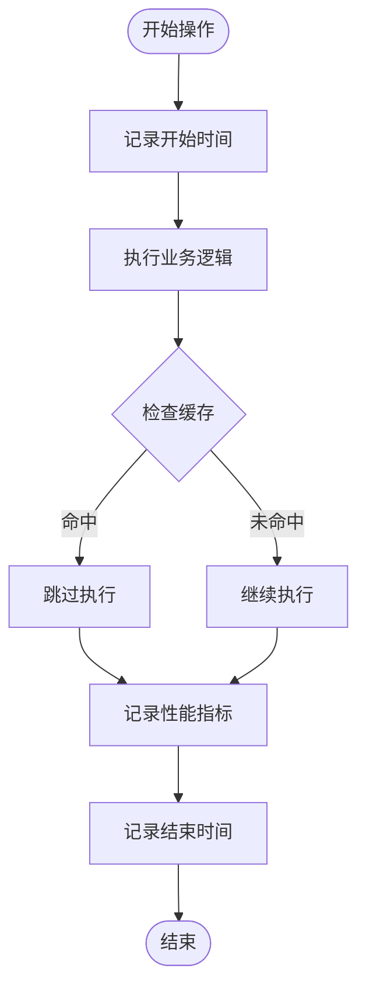

**图表来源**
- [chatStore.ts:221-229](file://src/stores/chatStore.ts#L221-L229)
- [gitStore.ts:604-610](file://src/stores/gitStore.ts#L604-L610)

### 最佳实践建议

1. **合理使用缓存**：根据数据变化频率选择合适的缓存策略
2. **避免过度渲染**：使用选择器模式减少不必要的组件重新渲染
3. **异步操作管理**：实现正确的加载状态和错误处理
4. **内存泄漏防护**：及时清理事件监听器和定时器
5. **性能指标收集**：建立完整的性能监控体系

## 故障排除指南

### 常见问题诊断

#### 1. 状态不一致问题
**症状**：UI 显示与实际状态不符
**排查步骤**：
1. 检查 Store 的状态更新是否正确
2. 验证 IPC 通信是否正常
3. 确认本地存储的持久化状态

#### 2. 性能问题
**症状**：应用响应缓慢或内存占用过高
**排查步骤**：
1. 检查缓存配置和使用情况
2. 分析异步操作的执行时间
3. 监控 Store 的更新频率

#### 3. 数据丢失问题
**症状**：重启后状态丢失
**排查步骤**：
1. 检查 localStorage 的可用性
2. 验证状态持久化的实现
3. 确认关键状态的备份机制

**章节来源**
- [chatStore.test.ts:1-800](file://src/stores/chatStore.test.ts#L1-L800)
- [workspaceStore.test.ts:1-310](file://src/stores/workspaceStore.test.ts#L1-L310)

### 调试技巧

1. **状态快照**：定期导出 Store 状态用于调试
2. **日志记录**：在关键操作点添加详细的日志
3. **单元测试**：为每个 Store 编写全面的测试用例
4. **性能分析**：使用浏览器开发者工具分析性能瓶颈

## 结论

Panes 的 Store 架构设计体现了现代前端应用的最佳实践：

### 设计优势
- **模块化程度高**：每个 Store 专注于特定功能领域
- **状态管理清晰**：明确的职责边界和状态结构
- **性能优化到位**：多层次的缓存和优化策略
- **类型安全**：完整的 TypeScript 类型定义
- **可扩展性强**：良好的架构设计便于功能扩展

### 技术亮点
- **Zustand 的优雅使用**：充分发挥轻量级状态管理的优势
- **异步状态管理**：完善的异步操作处理机制
- **性能监控**：内置的性能指标收集和分析
- **错误处理**：统一的错误处理和恢复机制

### 改进建议
1. **增加状态验证**：实现更严格的状态验证机制
2. **增强测试覆盖**：提高单元测试和集成测试的覆盖率
3. **优化性能监控**：建立更细粒度的性能指标体系
4. **改善错误处理**：提供更友好的错误提示和恢复选项

## 附录

### Store 接口设计规范

#### 1. 状态接口命名
- 使用 `XxxState` 命名状态接口
- 使用 `useXxxStore` 命名 Store 实例
- 使用 `XxxActions` 命名动作接口

#### 2. 动作方法命名
- 使用动词短语命名动作方法
- 异步操作使用 `async` 关键字
- 返回值明确表示操作结果

#### 3. 状态字段命名
- 使用驼峰命名法
- 明确字段含义和用途
- 区分本地状态和全局状态

### 代码组织策略

#### 1. 文件组织
- 每个 Store 单独文件管理
- 相关的辅助类型放在同一文件
- 测试文件与源文件同目录

#### 2. 导入导出
- 使用相对路径导入
- 导出必要的类型和常量
- 避免循环依赖

#### 3. 版本兼容性
- 保持 API 的向后兼容性
- 渐进式迁移策略
- 兼容性测试覆盖