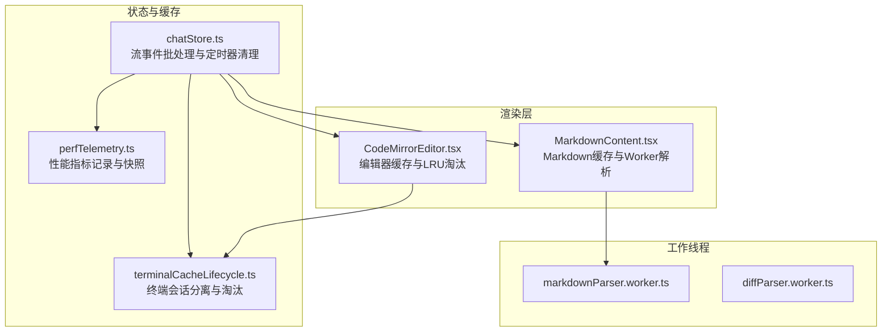
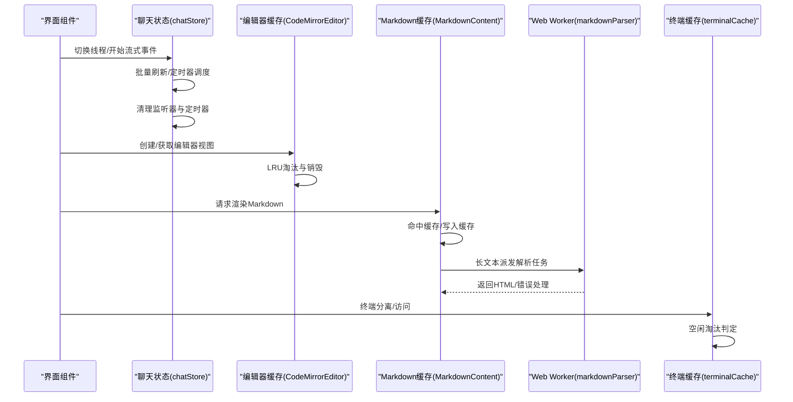
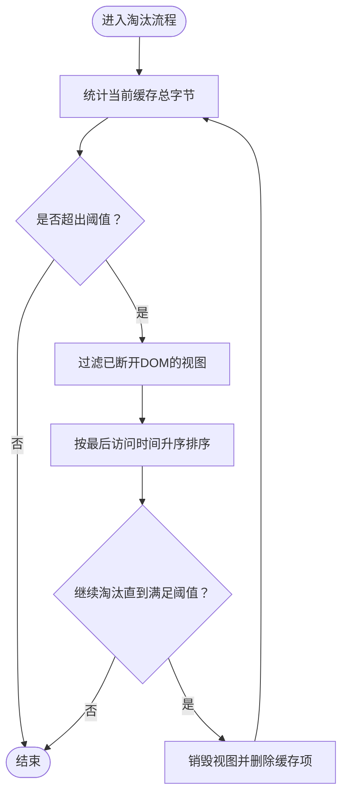
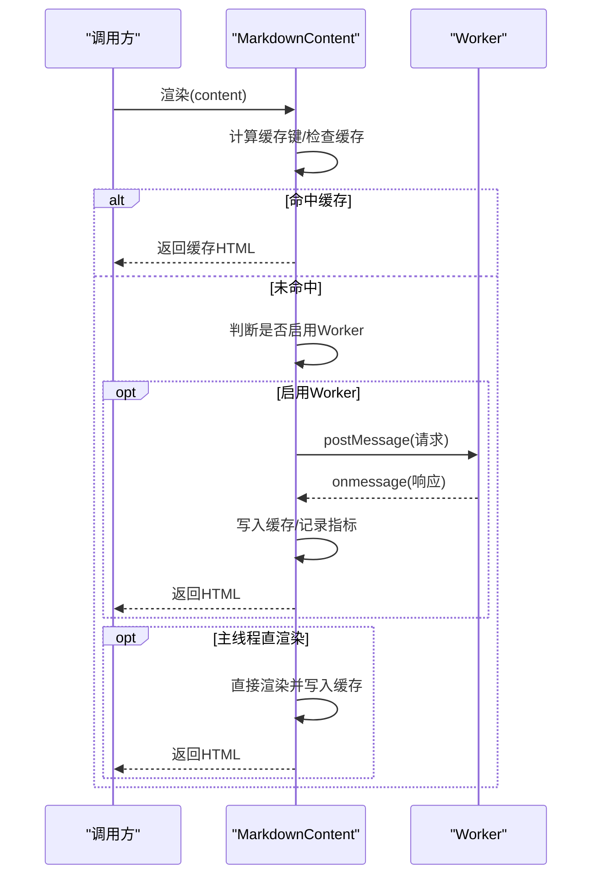
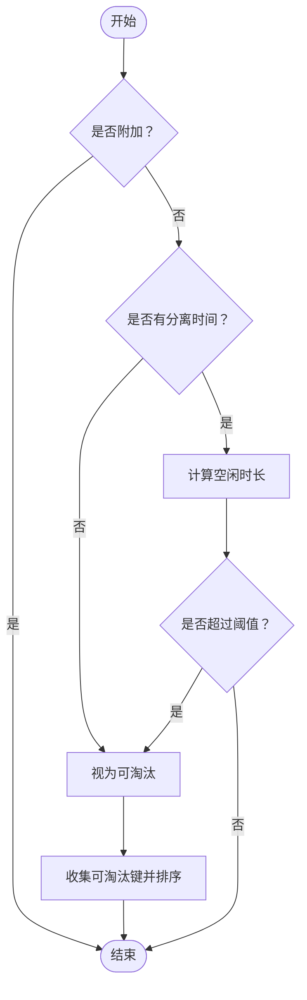
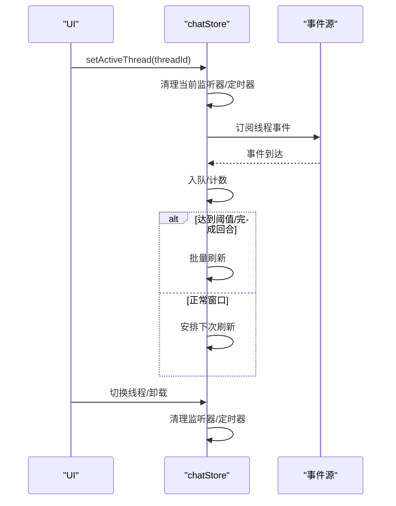
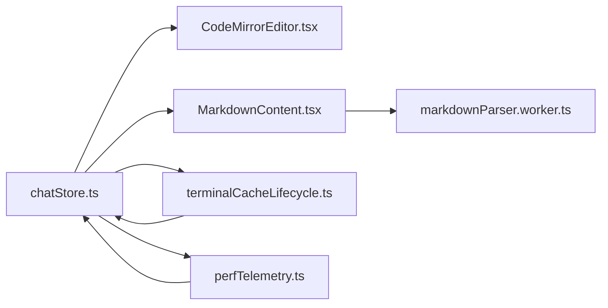

# 内存管理

<cite>
**本文引用的文件**
- [CodeMirrorEditor.tsx](file://src/components/editor/CodeMirrorEditor.tsx)
- [MarkdownContent.tsx](file://src/components/chat/MarkdownContent.tsx)
- [markdownParser.worker.ts](file://src/workers/markdownParser.worker.ts)
- [diffParser.worker.ts](file://src/workers/diffParser.worker.ts)
- [terminalCacheLifecycle.ts](file://src/components/terminal/terminalCacheLifecycle.ts)
- [terminalCacheLifecycle.test.ts](file://src/components/terminal/terminalCacheLifecycle.test.ts)
- [chatStore.ts](file://src/stores/chatStore.ts)
- [perfTelemetry.ts](file://src/lib/perfTelemetry.ts)
</cite>

## 目录
1. [简介](#简介)
2. [项目结构与内存相关模块](#项目结构与内存相关模块)
3. [核心组件与内存管理策略](#核心组件与内存管理策略)
4. [架构总览](#架构总览)
5. [关键组件深度分析](#关键组件深度分析)
6. [依赖关系与耦合度分析](#依赖关系与耦合度分析)
7. [性能与内存优化建议](#性能与内存优化建议)
8. [故障排查与泄漏检测](#故障排查与泄漏检测)
9. [结论](#结论)
10. [附录：内存分析工具与实践清单](#附录内存分析工具与实践清单)

## 简介
本文件聚焦于 Panes 的内存管理设计与最佳实践，覆盖以下主题：
- 预防与检测内存泄漏：事件监听器清理、定时器管理、闭包引用处理
- 大对象优化与缓存策略：编辑器视图缓存、Markdown 渲染缓存、终端会话缓存
- 垃圾回收优化与内存泄漏检测工具链
- Web Workers 的生命周期与资源释放
- 性能遥测与内存使用监控
- 状态存储优化与避免泄漏的实践

## 项目结构与内存相关模块
- 编辑器模块：通过 LRU 缓存与字节限制控制 EditorView 的内存占用，并在淘汰时主动销毁视图实例。
- Markdown 渲染：在主线程与 Web Worker 之间进行权衡，采用缓存与阈值控制，避免重复计算与 DOM 压力。
- 终端面板：对“分离”态的会话进行空闲淘汰策略，防止长时间驻留的无用数据。
- 聊天流式事件：批量刷新与定时器调度，确保切换线程时正确清理监听器与定时器。
- 性能遥测：记录关键指标并提供快照接口，辅助定位内存与性能瓶颈。

图表来源
- [CodeMirrorEditor.tsx:240-297](file://src/components/editor/CodeMirrorEditor.tsx#L240-L297)
- [MarkdownContent.tsx:21-148](file://src/components/chat/MarkdownContent.tsx#L21-L148)
- [markdownParser.worker.ts:1-30](file://src/workers/markdownParser.worker.ts#L1-L30)
- [diffParser.worker.ts:1-40](file://src/workers/diffParser.worker.ts#L1-L40)
- [terminalCacheLifecycle.ts:1-74](file://src/components/terminal/terminalCacheLifecycle.ts#L1-L74)
- [chatStore.ts:1542-1801](file://src/stores/chatStore.ts#L1542-L1801)
- [perfTelemetry.ts:1-146](file://src/lib/perfTelemetry.ts#L1-L146)

章节来源
- [CodeMirrorEditor.tsx:240-297](file://src/components/editor/CodeMirrorEditor.tsx#L240-L297)
- [MarkdownContent.tsx:21-148](file://src/components/chat/MarkdownContent.tsx#L21-L148)
- [terminalCacheLifecycle.ts:1-74](file://src/components/terminal/terminalCacheLifecycle.ts#L1-L74)
- [chatStore.ts:1542-1801](file://src/stores/chatStore.ts#L1542-L1801)
- [perfTelemetry.ts:1-146](file://src/lib/perfTelemetry.ts#L1-L146)

## 核心组件与内存管理策略
- 编辑器缓存（CodeMirrorEditor）
  - 使用 Map 缓存 EditorView 实例，按数量与字节上限进行 LRU 淘汰。
  - 淘汰条件包含：未连接 DOM 的视图优先、按最后访问时间排序。
  - 提供显式销毁函数，避免残留引用导致 GC 困难。
- Markdown 渲染缓存（MarkdownContent）
  - 基于内容哈希的缓存键，限制条目数与总字节数，逐出最旧项。
  - 对长文本启用 Web Worker 解析，短文本直接在主线程渲染，减少阻塞。
  - Worker 错误时清理回调队列并终止实例，防止悬挂任务。
- 终端会话缓存（terminalCacheLifecycle）
  - 记录“分离”态的时间戳与访问时间，空闲超时后收集可淘汰键。
  - 工作区级分离强制回放，面板级分离不强制回放，降低重算成本。
- 聊天流事件（chatStore）
  - 批量刷新与定时器窗口控制，避免高频更新造成内存抖动。
  - 切换线程时清理当前监听器与背景监听器，防止重复订阅与泄漏。
- 性能遥测（perfTelemetry）
  - 记录关键指标并提供快照，便于定位异常峰值与泄漏趋势。

章节来源
- [CodeMirrorEditor.tsx:240-297](file://src/components/editor/CodeMirrorEditor.tsx#L240-L297)
- [MarkdownContent.tsx:21-148](file://src/components/chat/MarkdownContent.tsx#L21-L148)
- [terminalCacheLifecycle.ts:43-74](file://src/components/terminal/terminalCacheLifecycle.ts#L43-L74)
- [chatStore.ts:1542-1801](file://src/stores/chatStore.ts#L1542-L1801)
- [perfTelemetry.ts:55-127](file://src/lib/perfTelemetry.ts#L55-L127)

## 架构总览
下图展示内存相关组件之间的交互关系与职责边界：

图表来源
- [chatStore.ts:1542-1801](file://src/stores/chatStore.ts#L1542-L1801)
- [CodeMirrorEditor.tsx:240-297](file://src/components/editor/CodeMirrorEditor.tsx#L240-L297)
- [MarkdownContent.tsx:21-148](file://src/components/chat/MarkdownContent.tsx#L21-L148)
- [markdownParser.worker.ts:1-30](file://src/workers/markdownParser.worker.ts#L1-L30)
- [terminalCacheLifecycle.ts:43-74](file://src/components/terminal/terminalCacheLifecycle.ts#L43-L74)

## 关键组件深度分析

### 编辑器缓存（CodeMirrorEditor）
- 设计要点
  - 缓存键：tabId；缓存项：EditorView、扩展配置、只读配置、最后访问时间、文档字节估算。
  - 淘汰策略：当数量或字节超过阈值时，过滤掉仍连接到 DOM 的视图，按最后访问时间升序淘汰。
  - 销毁机制：淘汰与手动销毁均调用视图销毁，释放底层 DOM 与监听器。
- 内存优化
  - 字节估算基于字符长度，避免过大的缓存占用。
  - 仅对断开 DOM 的视图进行淘汰，保证用户可见视图优先保留。
- 风险与对策
  - 风险：大量大文件同时打开导致峰值内存升高。
  - 对策：合理设置最大数量与字节上限；必要时在用户操作时主动触发淘汰。

图表来源
- [CodeMirrorEditor.tsx:260-284](file://src/components/editor/CodeMirrorEditor.tsx#L260-L284)

章节来源
- [CodeMirrorEditor.tsx:240-297](file://src/components/editor/CodeMirrorEditor.tsx#L240-L297)

### Markdown 渲染缓存（MarkdownContent）
- 设计要点
  - 缓存键：内容长度+哈希；缓存项：HTML 字符串；字节计数动态维护。
  - 逐出策略：条目数或字节超过阈值时，按插入顺序逐出最旧项。
  - Worker 集成：长文本走 Worker，短文本走主线程；Worker 错误时清理回调并终止实例。
- 内存优化
  - 长文本解析延迟到 Worker，避免主线程阻塞与堆增长。
  - 缓存命中时直接返回 HTML，避免重复解析与 DOM 生成。
- 风险与对策
  - 风险：缓存未命中且 Worker 不可用时回退主线程，可能产生峰值。
  - 对策：合理设置阈值与缓存上限；监控 Worker 异常并降级处理。

图表来源
- [MarkdownContent.tsx:21-148](file://src/components/chat/MarkdownContent.tsx#L21-L148)
- [markdownParser.worker.ts:1-30](file://src/workers/markdownParser.worker.ts#L1-L30)

章节来源
- [MarkdownContent.tsx:21-148](file://src/components/chat/MarkdownContent.tsx#L21-L148)

### 终端会话缓存（terminalCacheLifecycle）
- 设计要点
  - 分离态记录：分离时间、最后访问时间、是否需要回放。
  - 淘汰判定：仅对非附加态且达到空闲阈值的条目进行收集与排序。
  - 工作区分离强制回放，面板分离不强制回放，平衡一致性与性能。
- 内存优化
  - 通过空闲淘汰减少长期驻留的输出缓冲与监听器。
  - 区分工作区与面板分离，避免不必要的重放成本。
- 风险与对策
  - 风险：频繁分离/附加导致状态抖动。
  - 对策：合理设置空闲阈值；在回放前进行必要的数据校验。

图表来源
- [terminalCacheLifecycle.ts:43-74](file://src/components/terminal/terminalCacheLifecycle.ts#L43-L74)

章节来源
- [terminalCacheLifecycle.ts:1-74](file://src/components/terminal/terminalCacheLifecycle.ts#L1-L74)
- [terminalCacheLifecycle.test.ts:22-115](file://src/components/terminal/terminalCacheLifecycle.test.ts#L22-L115)

### 聊天流事件与定时器管理（chatStore）
- 设计要点
  - 流事件批处理：在固定窗口内聚合事件，降低渲染与状态更新频率。
  - 定时器调度：使用 setTimeout 控制刷新节奏，避免高频触发。
  - 线程切换清理：切换线程时清理当前监听器与背景监听器，防止重复订阅。
- 内存优化
  - 批量刷新减少中间状态对象的创建与销毁次数。
  - 及时清理定时器与回调，避免闭包持有历史上下文。
- 风险与对策
  - 风险：后台监听器未清理导致持续接收事件。
  - 对策：在切换线程与卸载时统一清理；使用绑定序列号避免竞态。

图表来源
- [chatStore.ts:1542-1801](file://src/stores/chatStore.ts#L1542-L1801)

章节来源
- [chatStore.ts:1542-1801](file://src/stores/chatStore.ts#L1542-L1801)

### 性能遥测与监控（perfTelemetry）
- 设计要点
  - 指标类型：包含聊天首帧、流刷新、渲染提交、Markdown Worker 等。
  - 预算与告警：为每类指标设定预算阈值，超限后冷却期内抑制重复告警。
  - 快照统计：支持窗口化统计（均值、P95、最大值）。
- 内存优化
  - 限制指标存储上限，避免指标本身成为内存压力。
  - 提供全局接口用于调试与诊断。
- 风险与对策
  - 风险：指标过多导致内存占用上升。
  - 对策：定期清理与限制存储规模；仅记录关键路径指标。

章节来源
- [perfTelemetry.ts:1-146](file://src/lib/perfTelemetry.ts#L1-L146)

## 依赖关系与耦合度分析
- 组件内聚
  - 编辑器缓存、Markdown 缓存、终端缓存均为独立模块，职责清晰。
- 组件耦合
  - chatStore 与多个子系统交互：编辑器、Markdown、终端、遥测。
  - Web Worker 与渲染层解耦，通过消息传递避免主线程阻塞。
- 循环依赖
  - 当前模块间无明显循环依赖迹象；状态更新通过回调与消息传递解耦。

图表来源
- [chatStore.ts:1542-1801](file://src/stores/chatStore.ts#L1542-L1801)
- [CodeMirrorEditor.tsx:240-297](file://src/components/editor/CodeMirrorEditor.tsx#L240-L297)
- [MarkdownContent.tsx:21-148](file://src/components/chat/MarkdownContent.tsx#L21-L148)
- [terminalCacheLifecycle.ts:1-74](file://src/components/terminal/terminalCacheLifecycle.ts#L1-L74)
- [perfTelemetry.ts:1-146](file://src/lib/perfTelemetry.ts#L1-L146)

## 性能与内存优化建议
- 事件监听器清理
  - 在组件卸载、线程切换、会话分离等场景，确保调用清理函数移除监听器与定时器。
  - 使用绑定序列号与竞态保护，避免跨线程状态污染。
- 定时器管理
  - 使用统一的定时器句柄与清理逻辑，避免重复定时器叠加。
  - 对高频批处理场景，采用窗口化策略合并更新。
- 闭包引用处理
  - 避免在回调中捕获大对象或全局状态；必要时传入最小化参数。
  - 使用弱引用或延迟加载策略减少强引用链。
- 大对象优化
  - 编辑器：严格控制缓存数量与字节上限，淘汰断开 DOM 的视图。
  - Markdown：长文本走 Worker，短文本直渲染；缓存命中优先。
  - 终端：分离态空闲淘汰，区分工作区与面板分离策略。
- 垃圾回收优化
  - 减少临时数组与字符串拼接；避免在渲染路径创建大对象。
  - 使用对象池或复用策略降低 GC 压力。
- Web Workers 生命周期
  - Worker 错误时清理回调队列并终止实例；在不需要时及时释放。
  - 对 Worker 任务进行去抖与合并，避免并发高峰。
- 状态存储优化
  - 将大字段拆分为可选或延迟加载；对不可变状态进行浅拷贝与最小化更新。
  - 使用摘要化策略（如消息块摘要）减少内存占用。

## 故障排查与泄漏检测
- 常见症状
  - 页面卡顿、内存缓慢上涨、渲染延迟增加。
  - Worker 报错、回调未触发、缓存命中率低。
- 排查步骤
  - 使用性能遥测快照定位异常指标（如流刷新、渲染提交、Markdown Worker）。
  - 检查线程切换是否正确清理监听器与定时器。
  - 观察编辑器缓存与淘汰日志，确认是否频繁触发销毁。
  - 监控 Worker 错误回调与终止逻辑，确保异常路径被覆盖。
- 工具与实践
  - 浏览器开发者工具：Heap Snapshot、内存带宽、CPU Profile。
  - Heap Snapshot 分析：关注未释放的 DOM 节点、闭包、事件监听器集合。
  - 内存泄漏定位技巧：对比不同时间段的堆快照，查找新增对象与引用链。
  - 日志与指标：结合 perfTelemetry 的快照与最近指标，定位异常窗口。

章节来源
- [perfTelemetry.ts:89-127](file://src/lib/perfTelemetry.ts#L89-L127)
- [chatStore.ts:1781-1799](file://src/stores/chatStore.ts#L1781-L1799)
- [MarkdownContent.tsx:120-130](file://src/components/chat/MarkdownContent.tsx#L120-L130)

## 结论
Panes 的内存管理通过多层策略协同实现：编辑器与 Markdown 的缓存与淘汰、终端会话的空闲淘汰、聊天流事件的批处理与定时器清理、以及性能遥测的监控与告警。这些设计有效降低了峰值内存与 GC 压力，提升了用户体验。建议在后续迭代中持续完善 Worker 异常处理、状态摘要化与更细粒度的指标采集，以进一步增强稳定性与可观测性。

## 附录：内存分析工具与实践清单
- 内存分析工具
  - Chrome DevTools：Heap Snapshot、内存带宽、CPU Profile、Performance 面板。
  - Firefox DevTools：内存面板与性能分析器。
- Heap Snapshot 分析要点
  - 查找未释放的 DOM 节点与容器节点。
  - 追踪闭包与事件监听器的引用链。
  - 对比不同阶段的快照，识别新增对象。
- 内存泄漏定位技巧
  - 使用“脱钩”模式：逐步移除事件监听器与定时器，观察内存变化。
  - 检查 WeakMap/WeakSet 是否正确使用，避免意外强引用。
  - 对长生命周期对象进行弱引用化处理（如缓存键）。
- 实践清单
  - 线程切换/会话分离：清理监听器与定时器
  - Worker 使用：错误回调清理、任务去抖、按需终止
  - 缓存策略：命中优先、逐出最旧、字节上限
  - 指标监控：窗口化统计、预算告警、定期清理