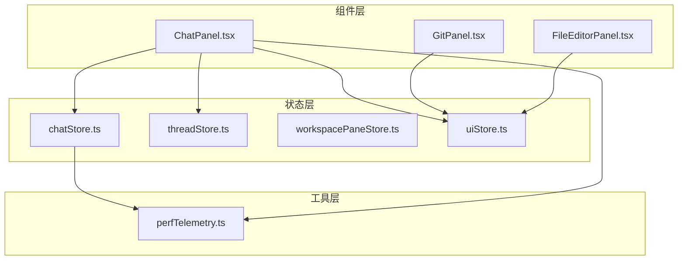
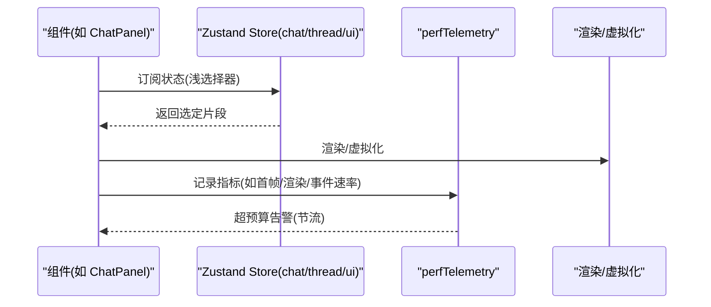
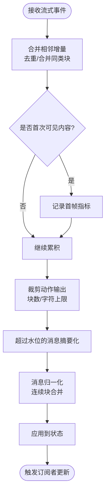
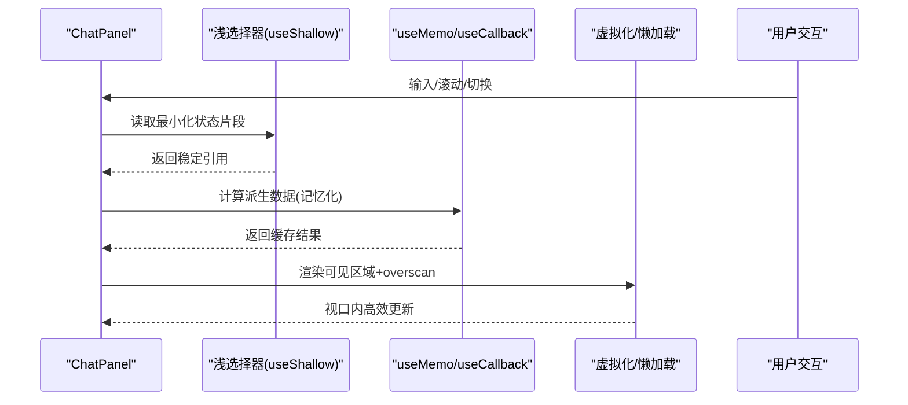
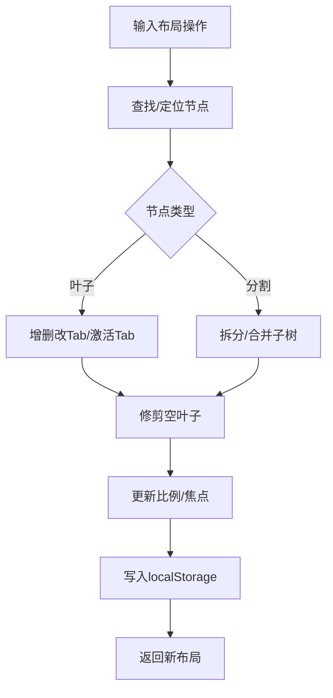
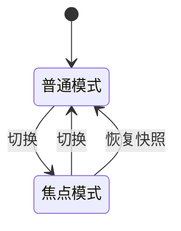
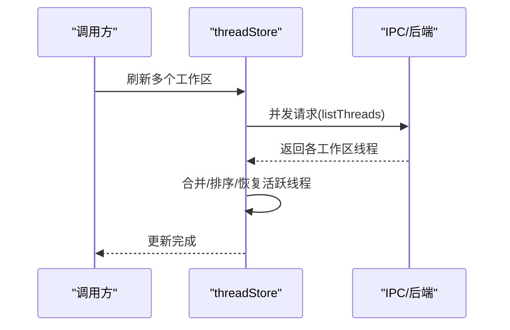
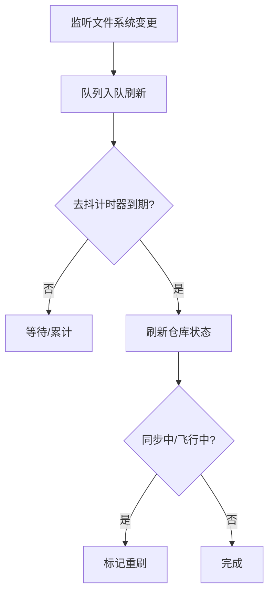
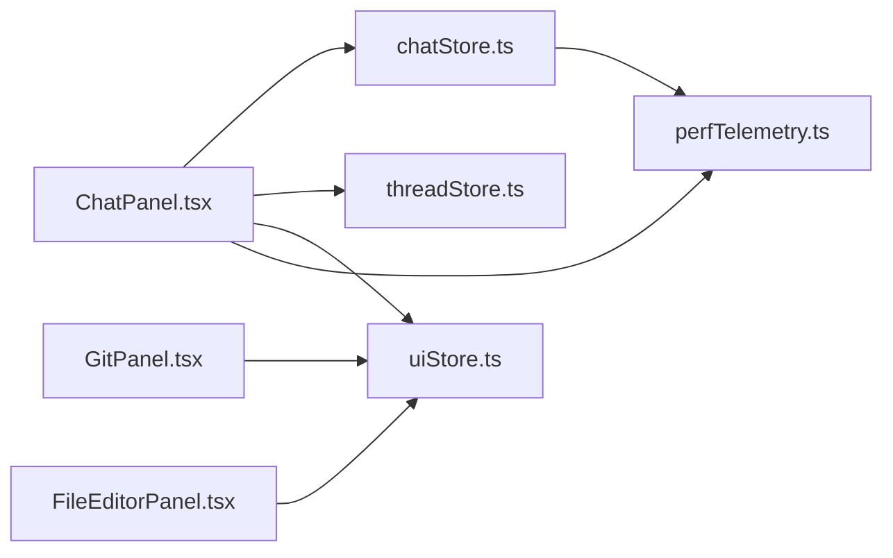

# 性能优化

<cite>
**本文引用的文件**
- [perfTelemetry.ts](file://src/lib/perfTelemetry.ts)
- [chatStore.ts](file://src/stores/chatStore.ts)
- [workspacePaneStore.ts](file://src/stores/workspacePaneStore.ts)
- [uiStore.ts](file://src/stores/uiStore.ts)
- [threadStore.ts](file://src/stores/threadStore.ts)
- [ChatPanel.tsx](file://src/components/chat/ChatPanel.tsx)
- [FileEditorPanel.tsx](file://src/components/editor/FileEditorPanel.tsx)
- [GitPanel.tsx](file://src/components/git/GitPanel.tsx)
</cite>

## 目录
1. [引言](#引言)
2. [项目结构](#项目结构)
3. [核心组件](#核心组件)
4. [架构总览](#架构总览)
5. [详细组件分析](#详细组件分析)
6. [依赖关系分析](#依赖关系分析)
7. [性能考量](#性能考量)
8. [故障排查指南](#故障排查指南)
9. [结论](#结论)
10. [附录](#附录)

## 引言
本文件聚焦于 Panes 的状态管理性能优化，系统性梳理状态更新的性能瓶颈、优化策略与最佳实践；覆盖状态选择器使用、组件重渲染优化、内存泄漏防护；并给出大状态处理、状态缓存与懒加载机制建议，以及性能监控指标、分析工具与调试技巧，最后提供性能测试与基准策略。

## 项目结构
- 状态层：以 Zustand Store 为核心，包含聊天、线程、工作区布局、UI 状态等模块，统一通过 create 构建状态容器。
- 组件层：围绕 ChatPanel、GitPanel、FileEditorPanel 等进行状态订阅与渲染控制，广泛采用浅选择器与记忆化。
- 工具层：perfTelemetry 提供性能指标记录与预算告警，支持按窗口聚合统计与全局快照导出。

图表来源
- [chatStore.ts](file://src/stores/chatStore.ts)
- [threadStore.ts](file://src/stores/threadStore.ts)
- [workspacePaneStore.ts](file://src/stores/workspacePaneStore.ts)
- [uiStore.ts](file://src/stores/uiStore.ts)
- [ChatPanel.tsx](file://src/components/chat/ChatPanel.tsx)
- [GitPanel.tsx](file://src/components/git/GitPanel.tsx)
- [FileEditorPanel.tsx](file://src/components/editor/FileEditorPanel.tsx)
- [perfTelemetry.ts](file://src/lib/perfTelemetry.ts)

章节来源
- [chatStore.ts](file://src/stores/chatStore.ts)
- [threadStore.ts](file://src/stores/threadStore.ts)
- [workspacePaneStore.ts](file://src/stores/workspacePaneStore.ts)
- [uiStore.ts](file://src/stores/uiStore.ts)
- [ChatPanel.tsx](file://src/components/chat/ChatPanel.tsx)
- [GitPanel.tsx](file://src/components/git/GitPanel.tsx)
- [FileEditorPanel.tsx](file://src/components/editor/FileEditorPanel.tsx)
- [perfTelemetry.ts](file://src/lib/perfTelemetry.ts)

## 核心组件
- chatStore：负责消息流式事件合并、首帧延迟度量、动作输出裁剪与内存摘要、消息归一化与水位控制。
- threadStore：线程生命周期管理、批量刷新、本地更新应用、模型与推理努力的本地标记。
- workspacePaneStore：工作区面板布局树操作、叶子节点增删改查、比例更新、持久化与回退默认布局。
- uiStore：侧边栏/Git 面板开关与固定、焦点模式、命令面板、活动视图切换、消息定位目标。
- perfTelemetry：性能指标记录、预算阈值告警、窗口聚合统计、全局快照与清理接口。

章节来源
- [chatStore.ts](file://src/stores/chatStore.ts)
- [threadStore.ts](file://src/stores/threadStore.ts)
- [workspacePaneStore.ts](file://src/stores/workspacePaneStore.ts)
- [uiStore.ts](file://src/stores/uiStore.ts)
- [perfTelemetry.ts](file://src/lib/perfTelemetry.ts)

## 架构总览
状态管理采用集中式 ZUSTAND STORE + 组件浅选择器订阅模式，配合工具层性能遥测，形成“状态变更 → 指标记录 → 告警与可视化”的闭环。

图表来源
- [ChatPanel.tsx](file://src/components/chat/ChatPanel.tsx)
- [chatStore.ts](file://src/stores/chatStore.ts)
- [perfTelemetry.ts](file://src/lib/perfTelemetry.ts)

## 详细组件分析

### chatStore 状态与流式事件处理
- 流式事件批处理与去抖：通过队列与批窗口（约 16ms）合并相邻文本/思考/动作输出增量，减少重复渲染。
- 首帧延迟度量：在可见内容首次出现时记录“首次 Shell/内容/文本”三类指标，并携带线程/引擎/模型元信息。
- 动作输出裁剪与内存摘要：限制最大块数与字符数，对非必要输出进行摘要或延迟加载，避免大对象常驻内存。
- 消息归一化与水位控制：将连续相同类型块合并，维持最近 N 条消息的“完全水位”，其余降级为摘要水位。

图表来源
- [chatStore.ts](file://src/stores/chatStore.ts)

章节来源
- [chatStore.ts](file://src/stores/chatStore.ts)

### ChatPanel 组件状态选择与渲染优化
- 浅选择器 useShallow：仅在所选字段变化时触发重渲染，显著降低无关状态变更导致的重绘。
- 记忆化 useMemo/useCallback：对派生数据（模型选项、信任级别、权限模式等）进行记忆化，避免重复计算。
- 虚拟化与懒加载：消息列表阈值与估算高度、行间距、overscan，结合 Suspense 懒加载终端与编辑器面板，降低初始渲染压力。
- 空闲任务与预热：利用 requestIdleCallback 或定时器调度后台任务，避免阻塞主线程；引擎传输预热降低冷启动成本。

图表来源
- [ChatPanel.tsx](file://src/components/chat/ChatPanel.tsx)

章节来源
- [ChatPanel.tsx](file://src/components/chat/ChatPanel.tsx)

### workspacePaneStore 布局树与持久化
- 不可变更新：所有布局修改均返回新树结构，便于浅比较与快速判定变更。
- 叶子节点操作：查找/替换/删除叶子，自动修剪空叶子，保持树紧凑。
- 比例更新：递归更新指定容器比例，保证布局一致性。
- 持久化与回退：基于 localStorage 的布局持久化，缺失时回退到默认布局。

图表来源
- [workspacePaneStore.ts](file://src/stores/workspacePaneStore.ts)

章节来源
- [workspacePaneStore.ts](file://src/stores/workspacePaneStore.ts)

### uiStore 状态与焦点模式
- 焦点模式快照：进入/退出焦点模式时保存/恢复侧边栏与 Git 面板显示状态。
- 本地存储：侧边栏/面板固定状态与资源管理器开关持久化。
- 命令面板：打开/关闭与启动态管理，避免循环依赖时的懒导入。

图表来源
- [uiStore.ts](file://src/stores/uiStore.ts)

章节来源
- [uiStore.ts](file://src/stores/uiStore.ts)

### threadStore 线程生命周期与批量刷新
- 批量刷新：多工作区并发拉取线程列表，使用 Promise.all 并聚合结果，减少多次重渲染。
- 本地更新：支持对单个线程进行本地更新与归档/恢复，避免全量刷新。
- 默认运行时解析：根据引导选择、组合器运行时与活跃线程推断默认引擎/模型/推理努力。

图表来源
- [threadStore.ts](file://src/stores/threadStore.ts)

章节来源
- [threadStore.ts](file://src/stores/threadStore.ts)

### GitPanel 文件系统监听与刷新节流
- 文件系统监听：针对仓库路径设置监听，收到变更事件后进行去抖刷新。
- 刷新策略：根据视图与同步状态决定是否强制刷新，避免冲突期间的重复刷新。
- 多仓库批量同步：提供批量 fetch/pull，汇总错误并提示部分失败。

图表来源
- [GitPanel.tsx](file://src/components/git/GitPanel.tsx)

章节来源
- [GitPanel.tsx](file://src/components/git/GitPanel.tsx)

### FileEditorPanel 标签页与渲染模式
- 标签页状态：独立维护 tabs/activeTabId/pendingCloseTabId，避免影响其他编辑器状态。
- 渲染模式切换：普通编辑器/Git Diff/Markdown 预览，按需切换，减少不必要的组件实例化。
- 快捷键与上下文：在特定布局下拦截快捷键，避免浏览器默认行为干扰。

章节来源
- [FileEditorPanel.tsx](file://src/components/editor/FileEditorPanel.tsx)

## 依赖关系分析
- 组件对 Store 的依赖：ChatPanel 依赖 chat/thread/ui/store；GitPanel/EditorPanel 依赖各自 UI 与对应 Store。
- Store 内部耦合：chatStore 依赖 perfTelemetry 进行指标记录；threadStore 依赖引擎与引导配置解析。
- 外部集成：IPC 用于线程/仓库/引擎等外部能力调用，刷新与监听通过事件驱动。

图表来源
- [ChatPanel.tsx](file://src/components/chat/ChatPanel.tsx)
- [GitPanel.tsx](file://src/components/git/GitPanel.tsx)
- [FileEditorPanel.tsx](file://src/components/editor/FileEditorPanel.tsx)
- [chatStore.ts](file://src/stores/chatStore.ts)
- [threadStore.ts](file://src/stores/threadStore.ts)
- [uiStore.ts](file://src/stores/uiStore.ts)
- [perfTelemetry.ts](file://src/lib/perfTelemetry.ts)

章节来源
- [ChatPanel.tsx](file://src/components/chat/ChatPanel.tsx)
- [GitPanel.tsx](file://src/components/git/GitPanel.tsx)
- [FileEditorPanel.tsx](file://src/components/editor/FileEditorPanel.tsx)
- [chatStore.ts](file://src/stores/chatStore.ts)
- [threadStore.ts](file://src/stores/threadStore.ts)
- [uiStore.ts](file://src/stores/uiStore.ts)
- [perfTelemetry.ts](file://src/lib/perfTelemetry.ts)

## 性能考量
- 状态选择器与浅比较
  - 使用 useShallow 仅订阅必要字段，避免无关状态导致的重渲染。
  - 对派生数据使用 useMemo/useCallback，确保引用稳定。
- 大状态处理
  - chatStore 将超出水位的消息降级为摘要水位，限制动作输出块数与字符数，避免内存膨胀。
  - threadStore 批量刷新与本地更新，减少全量重算。
- 缓存与懒加载
  - ChatPanel 使用虚拟化与 overscan，Suspense 懒加载终端/编辑器面板，降低初始渲染成本。
  - GitPanel 对仓库状态刷新进行去抖与冲突检测，避免频繁 IO。
- 指标与预算
  - perfTelemetry 提供首帧/渲染/事件速率等指标，内置预算阈值与冷却时间，防止噪声告警。
- 主线程保护
  - 使用 requestIdleCallback 或定时器调度后台任务，避免阻塞 UI。
- 存储与持久化
  - workspacePaneStore/uiStore 将布局与 UI 状态持久化至 localStorage，减少初始化开销。

章节来源
- [ChatPanel.tsx](file://src/components/chat/ChatPanel.tsx)
- [chatStore.ts](file://src/stores/chatStore.ts)
- [threadStore.ts](file://src/stores/threadStore.ts)
- [workspacePaneStore.ts](file://src/stores/workspacePaneStore.ts)
- [uiStore.ts](file://src/stores/uiStore.ts)
- [GitPanel.tsx](file://src/components/git/GitPanel.tsx)
- [perfTelemetry.ts](file://src/lib/perfTelemetry.ts)

## 故障排查指南
- 性能告警定位
  - 通过 window.__panesPerf 快速获取最近指标快照与清理历史，辅助定位异常峰值。
  - 结合具体指标名称（如首帧/渲染/事件速率）缩小范围。
- 渲染抖动与卡顿
  - 检查是否滥用深选择器导致频繁重渲染；优先使用浅选择器与记忆化。
  - 确认虚拟化参数（阈值、估算高度、overscan）合理，避免过度渲染。
- 大状态内存占用
  - 关注动作输出裁剪与摘要水位策略；确认未保留不必要的完整输出。
  - 定期清理后台监听与空叶子，避免树膨胀。
- 文件系统监听风暴
  - 检查去抖与冲突检测逻辑，避免在同步过程中反复刷新。
- 调试技巧
  - 在开发环境开启 React DevTools Profiler，观察组件渲染次数与耗时。
  - 使用浏览器性能面板录制交互，定位长任务与布局抖动。

章节来源
- [perfTelemetry.ts](file://src/lib/perfTelemetry.ts)
- [ChatPanel.tsx](file://src/components/chat/ChatPanel.tsx)
- [GitPanel.tsx](file://src/components/git/GitPanel.tsx)
- [workspacePaneStore.ts](file://src/stores/workspacePaneStore.ts)

## 结论
通过“浅选择器 + 记忆化 + 虚拟化 + 懒加载 + 指标预算”的组合拳，Panes 在状态管理层面实现了可观的性能收益。chatStore 的流式事件批处理与内存摘要策略、threadStore 的批量刷新与本地更新、workspacePaneStore 的不可变树操作与持久化，共同构成了高吞吐、低抖动的状态管理基座。建议持续以 perfTelemetry 为依据迭代优化，逐步引入更细粒度的缓存与更智能的懒加载策略。

## 附录

### 性能监控指标与预算
- 指标类别
  - 首帧延迟：chat.turn.first_shell.ms、chat.turn.first_content.ms、chat.turn.first_text.ms
  - 渲染与处理：chat.render.commit.ms、chat.markdown.worker.ms
  - 流式处理：chat.stream.flush.ms、chat.stream.events_per_sec
  - Git 操作：git.refresh.ms、git.file_diff.ms
- 预算阈值与冷却
  - 每项指标设定预算阈值，超限后按冷却时间（毫秒级）抑制重复告警。
  - 支持按窗口聚合统计（count/avg/p95/max），便于趋势分析。

章节来源
- [perfTelemetry.ts](file://src/lib/perfTelemetry.ts)

### 性能分析工具与调试技巧
- 浏览器性能面板：录制交互，定位长任务、布局与合成阶段耗时。
- React DevTools Profiler：查看组件渲染次数与耗时，验证浅选择器与记忆化效果。
- 自定义快照：通过 window.__panesPerf 导出最近指标与快照，辅助回归对比。

章节来源
- [perfTelemetry.ts](file://src/lib/perfTelemetry.ts)

### 性能测试与基准策略
- 单组件基准
  - 使用 React Profiler 对 ChatPanel 的消息列表进行不同规模（小/中/大）渲染基准，记录渲染耗时与重渲染次数。
- 端到端场景
  - 模拟高频流式事件注入，测量事件速率与渲染 commit 时间，评估批处理与去抖效果。
- 回归对比
  - 在关键路径（消息水位、动作输出裁剪、布局树操作）建立回归用例，确保优化不退化。

章节来源
- [ChatPanel.tsx](file://src/components/chat/ChatPanel.tsx)
- [chatStore.ts](file://src/stores/chatStore.ts)
- [workspacePaneStore.ts](file://src/stores/workspacePaneStore.ts)