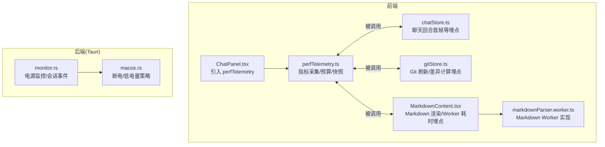
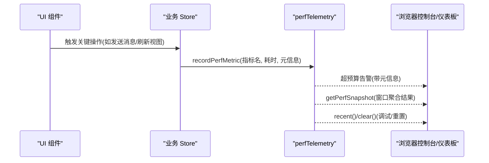
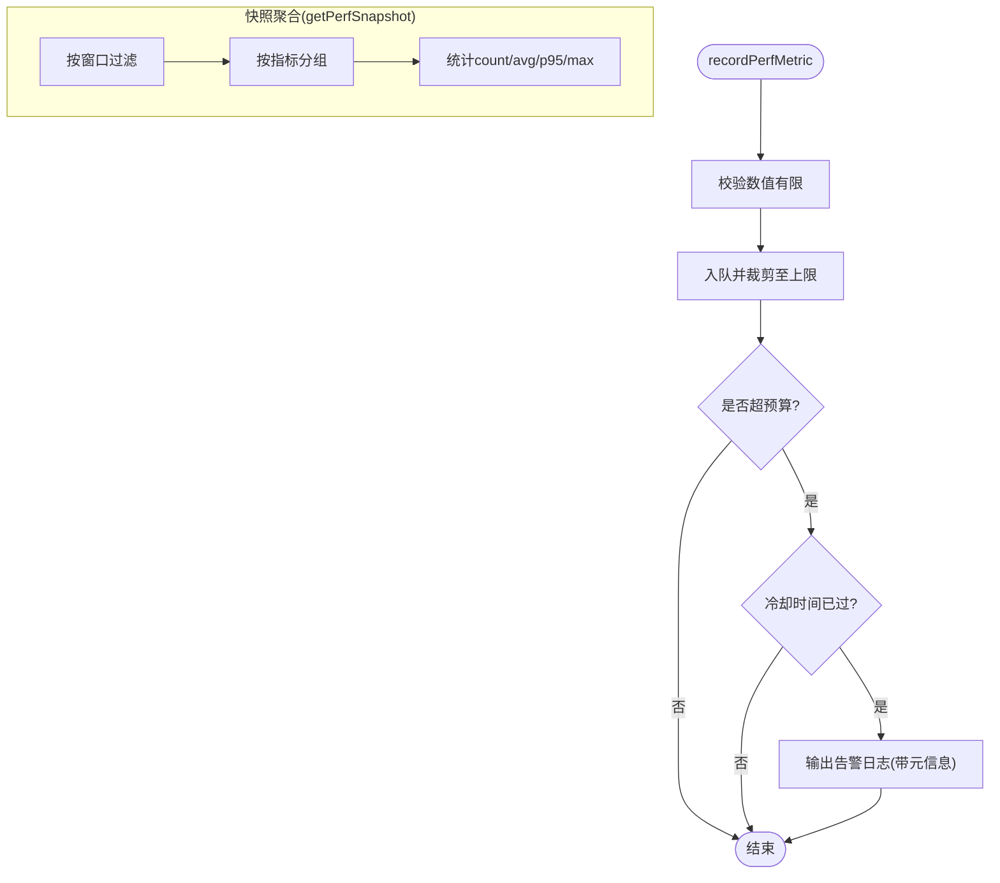
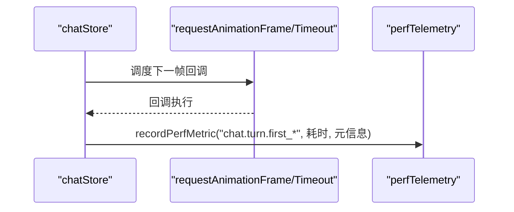
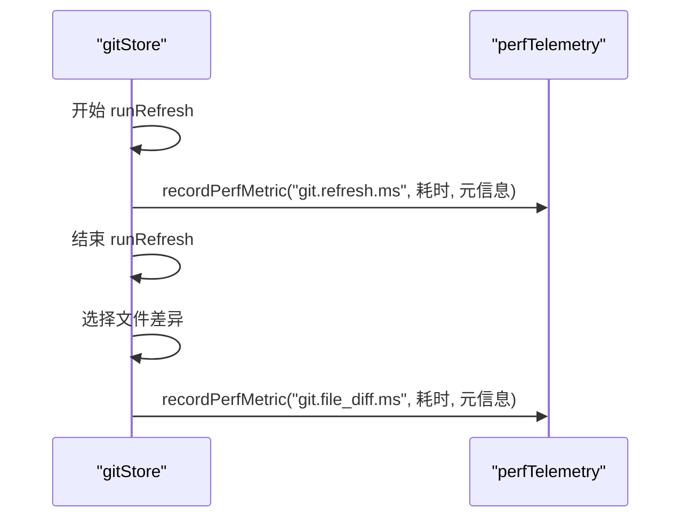
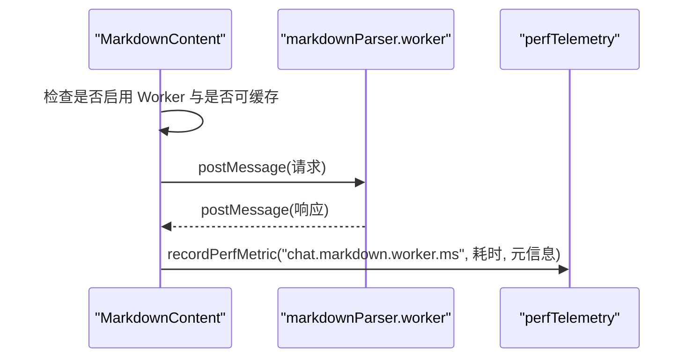
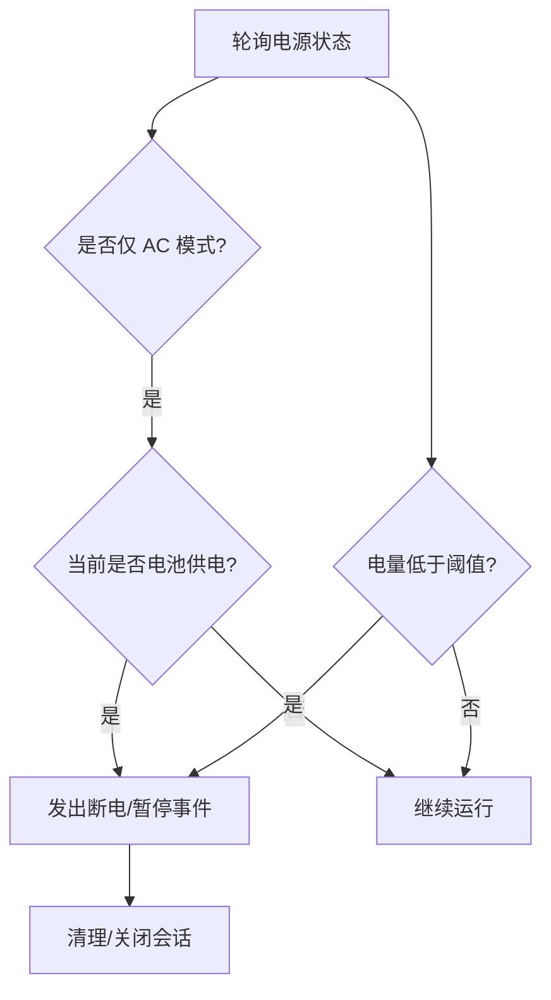
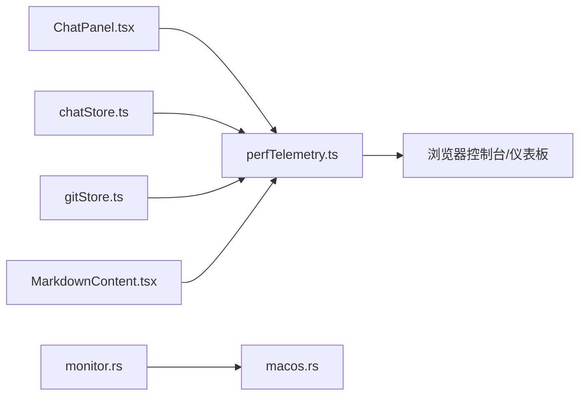

# 性能监控

<cite>
**本文引用的文件**   
- [perfTelemetry.ts](file://src/lib/perfTelemetry.ts)
- [chatStore.ts](file://src/stores/chatStore.ts)
- [gitStore.ts](file://src/stores/gitStore.ts)
- [MarkdownContent.tsx](file://src/components/chat/MarkdownContent.tsx)
- [markdownParser.worker.ts](file://src/workers/markdownParser.worker.ts)
- [ChatPanel.tsx](file://src/components/chat/ChatPanel.tsx)
- [GitPanel.tsx](file://src/components/git/GitPanel.tsx)
- [monitor.rs](file://src-tauri/src/power/monitor.rs)
- [macos.rs](file://src-tauri/src/power/macos.rs)
</cite>

## 目录
1. [简介](#简介)
2. [项目结构](#项目结构)
3. [核心组件](#核心组件)
4. [架构总览](#架构总览)
5. [详细组件分析](#详细组件分析)
6. [依赖关系分析](#依赖关系分析)
7. [性能考量](#性能考量)
8. [故障排查指南](#故障排查指南)
9. [结论](#结论)
10. [附录](#附录)

## 简介
本文件面向 Panes 的性能监控体系，系统化阐述性能指标定义、采集与分析方法，覆盖自定义性能预算与告警机制、性能度量标准、监控仪表板与实时追踪、性能数据存储策略、历史趋势分析与回归检测、工具集成与第三方服务对接、性能报告生成以及性能基线建立、阈值设定与自动化测试流程。内容以仓库现有实现为基础，结合可扩展建议，帮助读者快速理解并落地性能监控。

## 项目结构
Panes 的性能监控由前端指标采集与后端电源状态监控两部分组成：
- 前端：统一的性能指标采集模块负责记录各类指标，并提供快照查询与控制接口；多个业务组件在关键路径上埋点记录指标。
- 后端（Tauri）：电源状态监控模块用于感知设备供电状态与会话时长，辅助判断性能行为与节能策略。

图表来源
- [perfTelemetry.ts:1-146](file://src/lib/perfTelemetry.ts#L1-L146)
- [chatStore.ts:157-204](file://src/stores/chatStore.ts#L157-L204)
- [gitStore.ts:522-620](file://src/stores/gitStore.ts#L522-L620)
- [MarkdownContent.tsx:282-309](file://src/components/chat/MarkdownContent.tsx#L282-L309)
- [markdownParser.worker.ts:1-29](file://src/workers/markdownParser.worker.ts#L1-L29)
- [ChatPanel.tsx:61-61](file://src/components/chat/ChatPanel.tsx#L61-L61)
- [monitor.rs:348-511](file://src-tauri/src/power/monitor.rs#L348-L511)
- [macos.rs:560-608](file://src-tauri/src/power/macos.rs#L560-L608)

章节来源
- [perfTelemetry.ts:1-146](file://src/lib/perfTelemetry.ts#L1-L146)
- [chatStore.ts:157-204](file://src/stores/chatStore.ts#L157-L204)
- [gitStore.ts:522-620](file://src/stores/gitStore.ts#L522-L620)
- [MarkdownContent.tsx:282-309](file://src/components/chat/MarkdownContent.tsx#L282-L309)
- [markdownParser.worker.ts:1-29](file://src/workers/markdownParser.worker.ts#L1-L29)
- [ChatPanel.tsx:61-61](file://src/components/chat/ChatPanel.tsx#L61-L61)
- [monitor.rs:348-511](file://src-tauri/src/power/monitor.rs#L348-L511)
- [macos.rs:560-608](file://src-tauri/src/power/macos.rs#L560-L608)

## 核心组件
- 指标采集与预算模块
  - 定义指标名称集合与指标结构，提供记录函数、窗口快照聚合函数与清空函数。
  - 内置每项指标的预算阈值与告警冷却时间，超过预算时输出警告日志。
  - 提供浏览器全局挂载对象以便调试与仪表板集成。
- 聊天组件埋点
  - 在聊天回合生命周期的关键节点记录“首次 Shell”“首次可见内容”“首次文本”等耗时指标。
  - 使用 requestAnimationFrame 或降级定时器确保在下一帧时机记录首帧指标。
- Git 组件埋点
  - 在刷新与差异计算路径记录耗时与缓存命中情况，支持失败场景的指标记录。
- Markdown 渲染与 Worker 埋点
  - 在 Worker 执行前后记录耗时，区分是否命中缓存，避免主线程阻塞。
- 电源状态监控（后端）
  - 监测 AC/电池状态与电量百分比，支持会话到期、低电量阈值等策略触发。

章节来源
- [perfTelemetry.ts:1-146](file://src/lib/perfTelemetry.ts#L1-L146)
- [chatStore.ts:157-204](file://src/stores/chatStore.ts#L157-L204)
- [gitStore.ts:522-620](file://src/stores/gitStore.ts#L522-L620)
- [MarkdownContent.tsx:282-309](file://src/components/chat/MarkdownContent.tsx#L282-L309)
- [monitor.rs:348-511](file://src-tauri/src/power/monitor.rs#L348-L511)

## 架构总览
下图展示从前端指标采集到后端电源监控的整体链路，以及与业务组件的交互关系。

图表来源
- [perfTelemetry.ts:55-122](file://src/lib/perfTelemetry.ts#L55-L122)
- [chatStore.ts:157-204](file://src/stores/chatStore.ts#L157-L204)
- [gitStore.ts:522-620](file://src/stores/gitStore.ts#L522-L620)
- [MarkdownContent.tsx:282-309](file://src/components/chat/MarkdownContent.tsx#L282-L309)

## 详细组件分析

### 指标采集与预算模块（perfTelemetry）
- 指标类型与预算
  - 包含聊天与 Git 相关的多类指标，如“聊天回合首次 Shell 耗时”“Markdown Worker 耗时”“Git 刷新耗时”等。
  - 每个指标配置独立预算阈值，超过阈值且冷却时间已过，触发一次控制台告警。
- 数据结构与聚合
  - 记录包含指标名、数值、时间戳与可选元信息。
  - 快照按时间窗过滤，按指标分组统计计数、均值、P95、最大值。
- 存储与清理
  - 最大保留指标条目数量限制，超出则丢弃最早一批。
  - 提供清空函数与浏览器全局挂载接口，便于调试与仪表板集成。

图表来源
- [perfTelemetry.ts:55-122](file://src/lib/perfTelemetry.ts#L55-L122)

章节来源
- [perfTelemetry.ts:1-146](file://src/lib/perfTelemetry.ts#L1-L146)

### 聊天组件埋点（chatStore）
- 首帧指标记录
  - 在“Shell 输出”“首次可见内容”“首次文本”三个关键节点记录耗时。
  - 使用下一帧回调确保在渲染稳定后再采样，避免过早测量。
- 元信息
  - 记录线程 ID、客户端回合 ID、引擎与模型 ID，便于定位问题。

图表来源
- [chatStore.ts:157-198](file://src/stores/chatStore.ts#L157-L198)
- [perfTelemetry.ts:55-87](file://src/lib/perfTelemetry.ts#L55-L87)

章节来源
- [chatStore.ts:157-198](file://src/stores/chatStore.ts#L157-L198)

### Git 组件埋点（gitStore）
- 刷新与差异计算
  - 在刷新开始与结束记录“Git 刷新 ms”，并携带仓库路径、文件数、是否缓存命中、视图是否刷新、选中差异是否刷新等元信息。
  - 差异选择路径记录“Git 文件差异 ms”，携带文件路径、是否截断、返回字节数与原始字节数等。
- 失败兜底
  - 异常情况下仍记录一次耗时指标，标记失败字段，便于异常场景的趋势分析。

图表来源
- [gitStore.ts:522-620](file://src/stores/gitStore.ts#L522-L620)
- [gitStore.ts:725-742](file://src/stores/gitStore.ts#L725-L742)

章节来源
- [gitStore.ts:522-620](file://src/stores/gitStore.ts#L522-L620)
- [gitStore.ts:725-742](file://src/stores/gitStore.ts#L725-L742)

### Markdown 渲染与 Worker 埋点（MarkdownContent + Worker）
- 主线程与 Worker 协作
  - 当内容足够长时，使用 Worker 进行解析，避免阻塞主线程。
  - 解析完成后记录“Markdown Worker ms”，区分是否命中缓存。
- 缓存与占位
  - 支持 Worker 解析占位与缓存命中逻辑，减少重复计算。

图表来源
- [MarkdownContent.tsx:282-309](file://src/components/chat/MarkdownContent.tsx#L282-L309)
- [markdownParser.worker.ts:9-28](file://src/workers/markdownParser.worker.ts#L9-L28)
- [perfTelemetry.ts:55-87](file://src/lib/perfTelemetry.ts#L55-L87)

章节来源
- [MarkdownContent.tsx:282-309](file://src/components/chat/MarkdownContent.tsx#L282-L309)
- [markdownParser.worker.ts:1-29](file://src/workers/markdownParser.worker.ts#L1-L29)

### 电源状态监控（后端）
- 功能概述
  - 获取 AC/电池状态与电量百分比，支持会话到期、AC 专用模式、低电量阈值等策略。
  - 在 Windows/macOS 平台分别实现电源状态查询与断电/低电量策略。
- 事件与清理
  - 监控循环中产生事件通道，支持测试与清理流程。

图表来源
- [monitor.rs:348-511](file://src-tauri/src/power/monitor.rs#L348-L511)
- [macos.rs:560-608](file://src-tauri/src/power/macos.rs#L560-L608)

章节来源
- [monitor.rs:348-511](file://src-tauri/src/power/monitor.rs#L348-L511)
- [macos.rs:560-608](file://src-tauri/src/power/macos.rs#L560-L608)

## 依赖关系分析
- 前端依赖
  - ChatPanel 引入 perfTelemetry，作为指标采集入口。
  - 各 Store/组件在关键路径调用 recordPerfMetric，形成指标来源。
- 后端依赖
  - 电源监控模块依赖平台特定实现，提供统一事件接口给上层策略使用。

图表来源
- [ChatPanel.tsx:61-61](file://src/components/chat/ChatPanel.tsx#L61-L61)
- [perfTelemetry.ts:1-146](file://src/lib/perfTelemetry.ts#L1-L146)
- [chatStore.ts:157-204](file://src/stores/chatStore.ts#L157-L204)
- [gitStore.ts:522-620](file://src/stores/gitStore.ts#L522-L620)
- [MarkdownContent.tsx:282-309](file://src/components/chat/MarkdownContent.tsx#L282-L309)
- [monitor.rs:348-511](file://src-tauri/src/power/monitor.rs#L348-L511)
- [macos.rs:560-608](file://src-tauri/src/power/macos.rs#L560-L608)

## 性能考量
- 指标窗口与聚合
  - 默认快照窗口为 60 秒，适合观察短期波动；可根据需要调整窗口大小。
  - P95 能更好反映尾部延迟，建议在告警与报表中同时关注平均与 P95。
- 预算阈值与冷却
  - 预算阈值为经验性设定，建议结合真实用户场景与硬件分布进行迭代优化。
  - 告警冷却时间避免频繁重复告警，提升可观测性体验。
- 存储与内存
  - 指标数组上限为 4000 条，建议配合定期清理与持久化策略，避免长期占用内存。
- 渲染与 Worker
  - 将重计算任务移至 Worker 可显著降低主线程阻塞风险，建议在合适阈值以上启用。

## 故障排查指南
- 指标未出现
  - 确认业务组件是否正确调用 recordPerfMetric。
  - 检查浏览器控制台是否存在预算告警，确认冷却时间是否导致告警被抑制。
- 告警过于频繁
  - 调整对应指标预算阈值或延长冷却时间。
- 快照为空或不更新
  - 使用浏览器全局挂载对象获取最近指标与快照，确认采集是否正常。
- 电源相关问题
  - 检查电源监控事件是否正确触发，平台差异可能导致行为不同。

章节来源
- [perfTelemetry.ts:129-145](file://src/lib/perfTelemetry.ts#L129-L145)
- [monitor.rs:348-511](file://src-tauri/src/power/monitor.rs#L348-L511)

## 结论
Panes 的性能监控以统一的指标采集模块为核心，围绕聊天、Git、Markdown 渲染等关键路径进行埋点，并通过预算阈值与冷却机制实现可控的告警。结合电源状态监控，可在不同设备与供电条件下评估性能表现。建议后续完善历史趋势分析、回归检测与自动化测试流程，持续优化预算阈值与可视化仪表板。

## 附录

### 指标清单与含义
- 聊天类
  - chat.turn.first_shell.ms：聊天回合首次 Shell 输出耗时
  - chat.turn.first_content.ms：首次可见内容可用耗时
  - chat.turn.first_text.ms：首次文本可读耗时
  - chat.stream.flush.ms：流式输出刷新耗时
  - chat.stream.events_per_sec：流式事件速率
  - chat.render.commit.ms：单次渲染提交耗时
  - chat.markdown.worker.ms：Markdown Worker 解析耗时
- Git 类
  - git.refresh.ms：Git 状态/视图刷新耗时
  - git.file_diff.ms：文件差异计算耗时

章节来源
- [perfTelemetry.ts:1-38](file://src/lib/perfTelemetry.ts#L1-L38)

### 预算阈值参考
- 聊天类
  - chat.turn.first_shell.ms：约 48ms
  - chat.turn.first_content.ms：约 1400ms
  - chat.turn.first_text.ms：约 1800ms
  - chat.stream.flush.ms：约 12ms
  - chat.stream.events_per_sec：约 450 evt/sec
  - chat.render.commit.ms：约 16ms
  - chat.markdown.worker.ms：约 28ms
- Git 类
  - git.refresh.ms：约 350ms
  - git.file_diff.ms：约 250ms

章节来源
- [perfTelemetry.ts:28-38](file://src/lib/perfTelemetry.ts#L28-L38)

### 快照聚合字段说明
- count：指标条目数
- avg：平均值
- p95：95 分位数
- max：最大值

章节来源
- [perfTelemetry.ts:89-122](file://src/lib/perfTelemetry.ts#L89-L122)