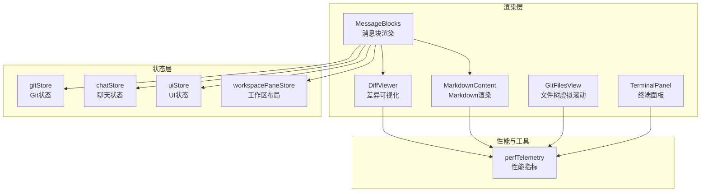
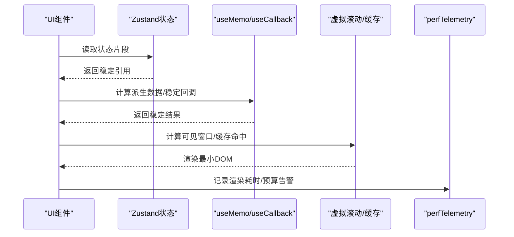
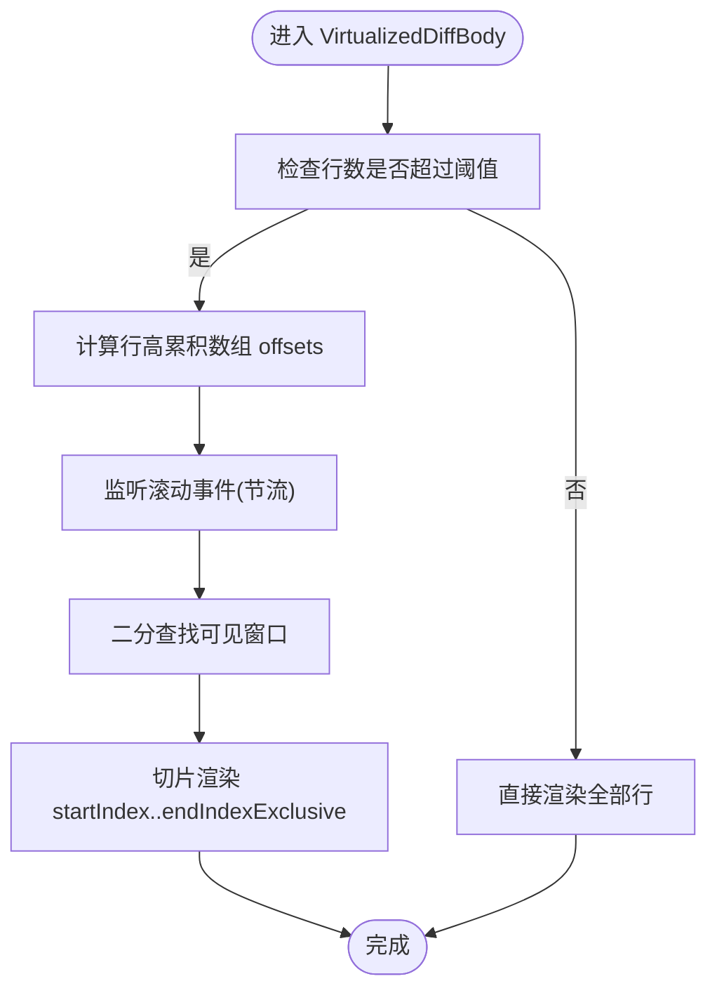
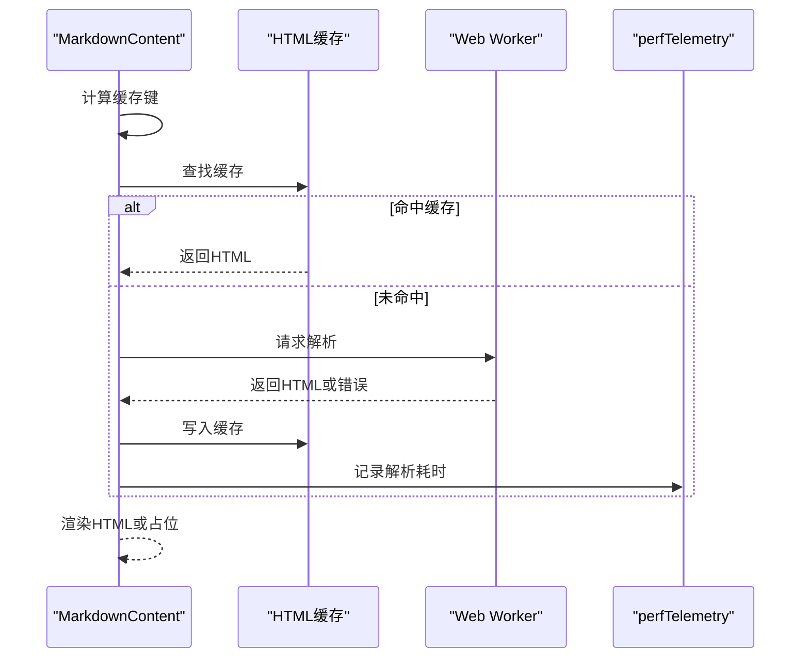
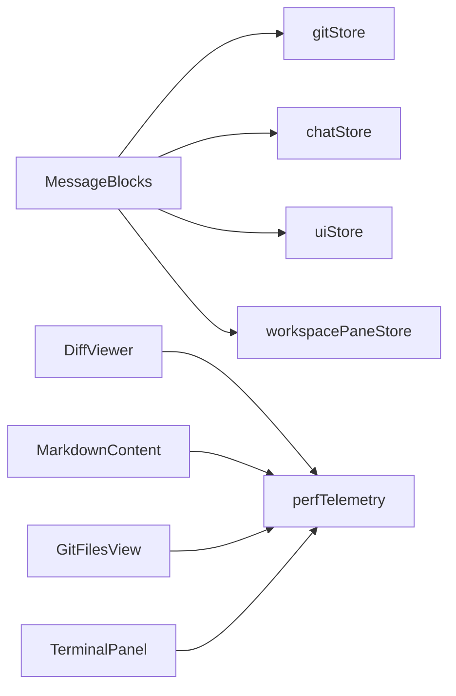

# 渲染优化

<cite>
**本文引用的文件**
- [DiffViewer.tsx](file://src/components/shared/DiffViewer.tsx)
- [MarkdownContent.tsx](file://src/components/chat/MarkdownContent.tsx)
- [perfTelemetry.ts](file://src/lib/perfTelemetry.ts)
- [MessageBlocks.tsx](file://src/components/chat/MessageBlocks.tsx)
- [gitStore.ts](file://src/stores/gitStore.ts)
- [chatStore.ts](file://src/stores/chatStore.ts)
- [uiStore.ts](file://src/stores/uiStore.ts)
- [workspacePaneStore.ts](file://src/stores/workspacePaneStore.ts)
- [GitFilesView.tsx](file://src/components/git/GitFilesView.tsx)
- [TerminalPanel.tsx](file://src/components/terminal/TerminalPanel.tsx)
</cite>

## 目录
1. [简介](#简介)
2. [项目结构](#项目结构)
3. [核心组件](#核心组件)
4. [架构总览](#架构总览)
5. [详细组件分析](#详细组件分析)
6. [依赖关系分析](#依赖关系分析)
7. [性能考量](#性能考量)
8. [故障排查指南](#故障排查指南)
9. [结论](#结论)
10. [附录](#附录)

## 简介
本文件聚焦于 Panes 的渲染优化实践，系统梳理 React 组件在大列表、复杂内容与多视图场景下的重渲染控制策略，涵盖 memo 包装、useMemo/useCallback 的正确使用、状态选择器优化、组件层级优化、虚拟滚动、图片懒加载与组件拆分策略，并提供渲染性能分析工具、Fiber 调试技巧与性能瓶颈识别方法，帮助读者建立可落地的渲染性能治理体系。

## 项目结构
- 渲染优化主要分布在以下模块：
  - 共享组件：DiffViewer（差异可视化与虚拟滚动）
  - 内容渲染：MarkdownContent（Markdown 解析与缓存）
  - 性能度量：perfTelemetry（指标记录与预算告警）
  - 消息块渲染：MessageBlocks（消息块组合与交互）
  - 状态管理：gitStore、chatStore、uiStore、workspacePaneStore（状态选择与更新粒度）
  - 列表视图：GitFilesView（树形列表虚拟滚动）
  - 终端面板：TerminalPanel（状态聚合与计算属性）

图表来源
- [MessageBlocks.tsx:1-120](file://src/components/chat/MessageBlocks.tsx#L1-L120)
- [DiffViewer.tsx:1-120](file://src/components/shared/DiffViewer.tsx#L1-L120)
- [MarkdownContent.tsx:1-120](file://src/components/chat/MarkdownContent.tsx#L1-L120)
- [GitFilesView.tsx:267-306](file://src/components/git/GitFilesView.tsx#L267-L306)
- [TerminalPanel.tsx:2724-2763](file://src/components/terminal/TerminalPanel.tsx#L2724-L2763)
- [gitStore.ts:476-707](file://src/stores/gitStore.ts#L476-L707)
- [chatStore.ts:1-120](file://src/stores/chatStore.ts#L1-L120)
- [uiStore.ts:1-120](file://src/stores/uiStore.ts#L1-L120)
- [workspacePaneStore.ts:645-692](file://src/stores/workspacePaneStore.ts#L645-L692)
- [perfTelemetry.ts:1-120](file://src/lib/perfTelemetry.ts#L1-L120)

章节来源
- [DiffViewer.tsx:1-120](file://src/components/shared/DiffViewer.tsx#L1-L120)
- [MarkdownContent.tsx:1-120](file://src/components/chat/MarkdownContent.tsx#L1-L120)
- [perfTelemetry.ts:1-120](file://src/lib/perfTelemetry.ts#L1-L120)
- [MessageBlocks.tsx:1-120](file://src/components/chat/MessageBlocks.tsx#L1-L120)
- [gitStore.ts:476-707](file://src/stores/gitStore.ts#L476-L707)
- [chatStore.ts:1-120](file://src/stores/chatStore.ts#L1-L120)
- [uiStore.ts:1-120](file://src/stores/uiStore.ts#L1-L120)
- [workspacePaneStore.ts:645-692](file://src/stores/workspacePaneStore.ts#L645-L692)
- [GitFilesView.tsx:267-306](file://src/components/git/GitFilesView.tsx#L267-L306)
- [TerminalPanel.tsx:2724-2763](file://src/components/terminal/TerminalPanel.tsx#L2724-L2763)

## 核心组件
- DiffViewer：提供差异解析与虚拟滚动，通过 requestAnimationFrame 限流滚动事件、按需解析、二分查找可见窗口，显著降低长 diff 的渲染成本。
- MarkdownContent：基于阈值启用 Web Worker 解析、LRU 缓存 HTML、占位渲染与回填，避免主线程阻塞与重复计算。
- perfTelemetry：统一记录与预算告警，支持 p95、最大值统计与冷却去噪，便于定位异常波动。
- MessageBlocks：对子块进行 memo 化与回调稳定化，结合状态选择器减少不必要重渲染。
- GitFilesView：树形列表虚拟滚动，按行高估算可见区间并预留 overscan 行数。
- TerminalPanel：通过 useMemo 计算展开 ID、总数等派生数据，避免每次渲染都重新计算。

章节来源
- [DiffViewer.tsx:243-418](file://src/components/shared/DiffViewer.tsx#L243-L418)
- [MarkdownContent.tsx:221-358](file://src/components/chat/MarkdownContent.tsx#L221-L358)
- [perfTelemetry.ts:55-122](file://src/lib/perfTelemetry.ts#L55-L122)
- [MessageBlocks.tsx:1-120](file://src/components/chat/MessageBlocks.tsx#L1-L120)
- [GitFilesView.tsx:267-306](file://src/components/git/GitFilesView.tsx#L267-L306)
- [TerminalPanel.tsx:2738-2763](file://src/components/terminal/TerminalPanel.tsx#L2738-L2763)

## 架构总览
渲染优化贯穿“状态选择器 → 计算属性 → 虚拟滚动/缓存 → 性能度量”的闭环：

图表来源
- [MessageBlocks.tsx:1-120](file://src/components/chat/MessageBlocks.tsx#L1-L120)
- [DiffViewer.tsx:314-357](file://src/components/shared/DiffViewer.tsx#L314-L357)
- [MarkdownContent.tsx:228-309](file://src/components/chat/MarkdownContent.tsx#L228-L309)
- [perfTelemetry.ts:55-87](file://src/lib/perfTelemetry.ts#L55-L87)

## 详细组件分析

### DiffViewer 虚拟滚动与解析优化
- 关键点
  - 使用 requestAnimationFrame 合并滚动事件，避免高频重排。
  - 基于行高累积数组 offsets，二分查找可见窗口，计算 startIndex/endIndexExclusive。
  - 可见区域外预留 overscan 高度，保证滚动过程中的无缝体验。
  - 大文本阈值启用 Web Worker 解析，解析失败回退同步解析并自动终止空闲 Worker。
- 性能收益
  - 将 O(N) 行渲染压缩到可视窗口行数，内存占用与 DOM 节点大幅下降。
  - 主线程仅处理滚动与可见区间计算，解析与渲染分离。

图表来源
- [DiffViewer.tsx:256-357](file://src/components/shared/DiffViewer.tsx#L256-L357)

章节来源
- [DiffViewer.tsx:243-418](file://src/components/shared/DiffViewer.tsx#L243-L418)

### MarkdownContent 缓存与占位渲染
- 关键点
  - 超过阈值启用 Web Worker 解析，解析时间计入性能指标。
  - LRU 缓存 HTML 字符串，按字节数与条目上限淘汰最旧项。
  - 流式渲染期间显示占位，解析完成后回填，避免闪烁。
  - 错误时回退到同步渲染并标记错误状态。
- 性能收益
  - 避免主线程长时间阻塞，提升交互流畅度。
  - 大段 Markdown 重复渲染命中缓存，显著降低 CPU 占用。

图表来源
- [MarkdownContent.tsx:228-309](file://src/components/chat/MarkdownContent.tsx#L228-L309)
- [perfTelemetry.ts:55-87](file://src/lib/perfTelemetry.ts#L55-L87)

章节来源
- [MarkdownContent.tsx:221-358](file://src/components/chat/MarkdownContent.tsx#L221-L358)
- [perfTelemetry.ts:55-87](file://src/lib/perfTelemetry.ts#L55-L87)

### MessageBlocks 子块渲染与交互优化
- 关键点
  - 对复制按钮、链接点击等交互使用 useCallback，确保事件处理器引用稳定。
  - 对链接匹配、代码块输出等使用 useMemo，避免重复计算。
  - 差异块按需解析，仅在展开时触发 useParsedDiff。
- 性能收益
  - 减少子组件重渲染次数，提升消息列表滚动性能。
  - 交互响应更稳定，避免因回调不稳定导致的额外渲染。

章节来源
- [MessageBlocks.tsx:113-197](file://src/components/chat/MessageBlocks.tsx#L113-L197)
- [MessageBlocks.tsx:364-433](file://src/components/chat/MessageBlocks.tsx#L364-L433)

### GitFilesView 树形列表虚拟滚动
- 关键点
  - 基于滚动位置与视口高度估算可见起止索引，预留 overscan 行数。
  - 仅渲染可见行，行高固定，计算复杂度低。
- 性能收益
  - 大型文件列表滚动顺滑，DOM 数量与重排开销可控。

章节来源
- [GitFilesView.tsx:267-306](file://src/components/git/GitFilesView.tsx#L267-L306)

### TerminalPanel 状态聚合与计算属性
- 关键点
  - 使用 useMemo 计算展开 ID 数组与总数，避免每次渲染都重新计算。
  - 通过 Map 结构存储数量，配合 setQty 更新，保持引用稳定。
- 性能收益
  - 减少不必要的渲染与计算，提升面板交互性能。

章节来源
- [TerminalPanel.tsx:2738-2763](file://src/components/terminal/TerminalPanel.tsx#L2738-L2763)

## 依赖关系分析
- 组件与状态层
  - MessageBlocks 依赖 gitStore、chatStore、uiStore、workspacePaneStore 的状态片段，通过细粒度选择器避免全局状态变更引发的重渲染。
  - DiffViewer 与 MarkdownContent 作为纯展示组件，依赖外部状态与工具函数，内部通过 useMemo/useCallback 控制渲染。
- 性能度量
  - perfTelemetry 作为全局指标采集器，被各渲染组件调用以记录耗时与触发预算告警。

图表来源
- [MessageBlocks.tsx:1-120](file://src/components/chat/MessageBlocks.tsx#L1-L120)
- [gitStore.ts:476-707](file://src/stores/gitStore.ts#L476-L707)
- [chatStore.ts:1-120](file://src/stores/chatStore.ts#L1-L120)
- [uiStore.ts:1-120](file://src/stores/uiStore.ts#L1-L120)
- [workspacePaneStore.ts:645-692](file://src/stores/workspacePaneStore.ts#L645-L692)
- [DiffViewer.tsx:1-120](file://src/components/shared/DiffViewer.tsx#L1-L120)
- [MarkdownContent.tsx:1-120](file://src/components/chat/MarkdownContent.tsx#L1-L120)
- [GitFilesView.tsx:267-306](file://src/components/git/GitFilesView.tsx#L267-L306)
- [TerminalPanel.tsx:2724-2763](file://src/components/terminal/TerminalPanel.tsx#L2724-L2763)
- [perfTelemetry.ts:1-120](file://src/lib/perfTelemetry.ts#L1-L120)

章节来源
- [MessageBlocks.tsx:1-120](file://src/components/chat/MessageBlocks.tsx#L1-L120)
- [gitStore.ts:476-707](file://src/stores/gitStore.ts#L476-L707)
- [chatStore.ts:1-120](file://src/stores/chatStore.ts#L1-L120)
- [uiStore.ts:1-120](file://src/stores/uiStore.ts#L1-L120)
- [workspacePaneStore.ts:645-692](file://src/stores/workspacePaneStore.ts#L645-L692)
- [DiffViewer.tsx:1-120](file://src/components/shared/DiffViewer.tsx#L1-L120)
- [MarkdownContent.tsx:1-120](file://src/components/chat/MarkdownContent.tsx#L1-L120)
- [GitFilesView.tsx:267-306](file://src/components/git/GitFilesView.tsx#L267-L306)
- [TerminalPanel.tsx:2724-2763](file://src/components/terminal/TerminalPanel.tsx#L2724-L2763)
- [perfTelemetry.ts:1-120](file://src/lib/perfTelemetry.ts#L1-L120)

## 性能考量
- 重渲染控制
  - 使用 memo 包装无状态展示组件，确保 props 引用稳定。
  - 使用 useMemo/useCallback 缓存计算结果与稳定回调，避免父组件重渲染引发的连锁反应。
- 状态选择器
  - 从 Zustand 中仅选择需要的状态片段，避免无关状态变化触发重渲染。
  - 将派生数据放入 useMemo，减少重复计算。
- 虚拟滚动与缓存
  - 大列表采用虚拟滚动，仅渲染可见区域；长文本采用缓存与 Web Worker 分离计算。
- 图片懒加载与组件拆分
  - 对图片资源采用懒加载策略，延迟到可见时再请求。
  - 将复杂 UI 拆分为多个小而稳定的组件，降低单次渲染压力。
- 性能度量与预算
  - 使用 perfTelemetry 记录关键指标，设置预算阈值并进行冷却去噪，及时发现异常波动。

## 故障排查指南
- 如何识别重渲染问题
  - 在开发模式下使用 React DevTools Profiler 进行录制，观察组件树中频繁更新的节点。
  - 检查是否存在不必要的对象/函数在每次渲染中创建，优先使用 useMemo/useCallback。
- 如何定位性能瓶颈
  - 使用浏览器性能面板（Performance）录制滚动/切换操作，查看主线程耗时热点。
  - 通过 perfTelemetry 的快照接口获取最近窗口内的 p95、最大值，判断是否超出预算。
- 常见问题与修复
  - 父组件频繁重渲染导致子组件重渲染：使用 memo 包装子组件，确保 props 引用稳定。
  - 回调不稳定导致事件处理器反复重建：使用 useCallback 包裹事件处理函数。
  - 大列表滚动卡顿：确认是否启用虚拟滚动，检查 overscan 设置与行高估算。
  - 长文本渲染缓慢：确认是否启用 Web Worker 解析与缓存，检查缓存命中率。

章节来源
- [perfTelemetry.ts:89-122](file://src/lib/perfTelemetry.ts#L89-L122)

## 结论
通过在渲染层引入虚拟滚动、缓存与 Web Worker、在状态层采用细粒度选择器与计算属性、在工具层引入统一性能度量与预算告警，Panes 在复杂内容与大列表场景下实现了稳定的渲染性能。建议在后续迭代中持续监控关键指标，完善组件拆分与缓存策略，进一步降低重渲染与主线程阻塞风险。

## 附录
- 渲染性能分析工具
  - React DevTools Profiler：录制渲染路径，识别重渲染热点。
  - 浏览器性能面板：录制用户操作，定位主线程耗时。
  - perfTelemetry：记录与统计关键指标，设置预算阈值并告警。
- Fiber 调试技巧
  - 使用 React DevTools 的“Highlight Updates”功能，快速定位受更新影响的组件树。
  - 结合 React Profiler 的交互录制，对比不同优化前后的渲染树变化。
- 渲染树结构优化建议
  - 将大型容器拆分为多个独立组件，减少单一组件的渲染范围。
  - 对高频交互元素使用 memo 包装，确保 props 引用稳定。
  - 将计算密集型逻辑移出渲染函数，使用 useMemo/useCallback 缓存结果。