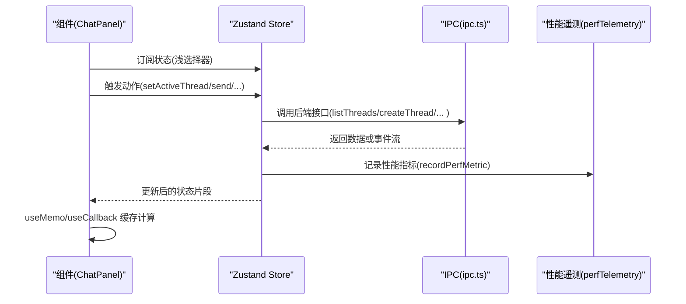
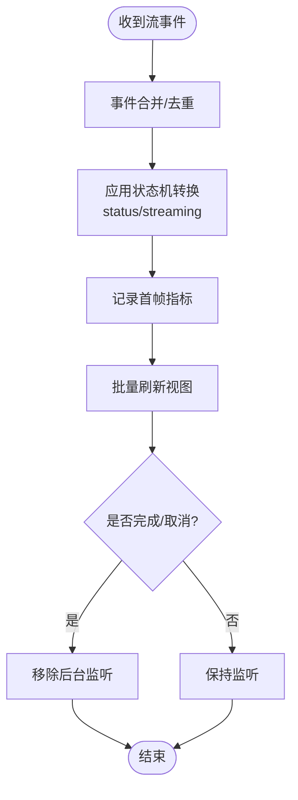
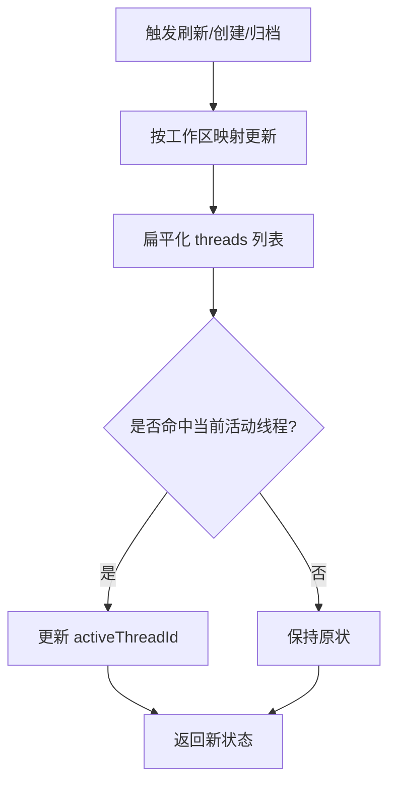
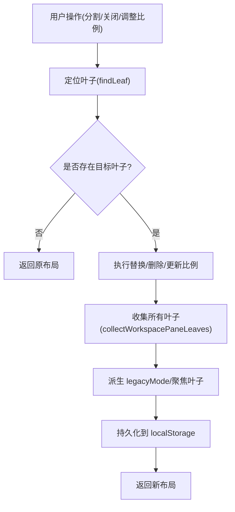
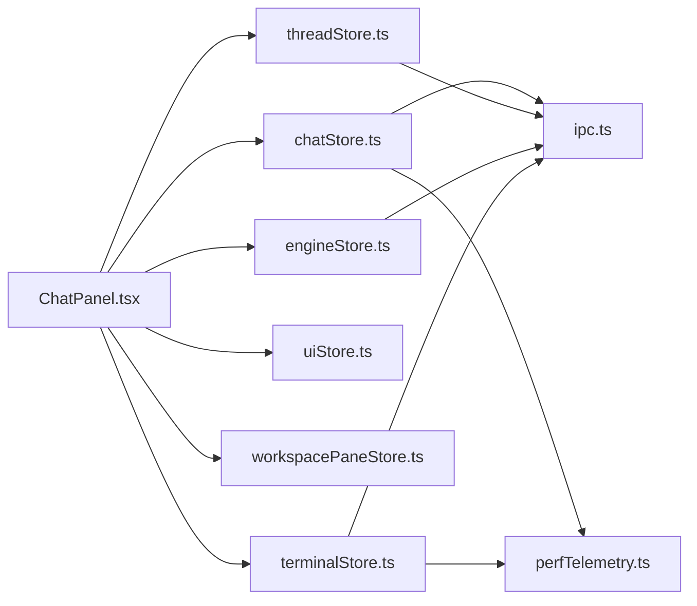

# 状态性能优化

<cite>
**本文引用的文件**
- [chatStore.ts](file://src/stores/chatStore.ts)
- [workspacePaneStore.ts](file://src/stores/workspacePaneStore.ts)
- [uiStore.ts](file://src/stores/uiStore.ts)
- [threadStore.ts](file://src/stores/threadStore.ts)
- [perfTelemetry.ts](file://src/lib/perfTelemetry.ts)
- [chatComposerStore.ts](file://src/stores/chatComposerStore.ts)
- [engineStore.ts](file://src/stores/engineStore.ts)
- [terminalStore.ts](file://src/stores/terminalStore.ts)
- [ChatPanel.tsx](file://src/components/chat/ChatPanel.tsx)
- [ipc.ts](file://src/lib/ipc.ts)
</cite>

## 目录
1. [引言](#引言)
2. [项目结构](#项目结构)
3. [核心组件](#核心组件)
4. [架构总览](#架构总览)
5. [详细组件分析](#详细组件分析)
6. [依赖分析](#依赖分析)
7. [性能考量](#性能考量)
8. [故障排查指南](#故障排查指南)
9. [结论](#结论)
10. [附录](#附录)

## 引言
本文件聚焦于 Panes 的状态管理性能优化，系统性梳理状态更新的性能瓶颈、优化策略与最佳实践。内容覆盖状态选择器使用、组件重渲染优化、内存泄漏防护、大状态处理、状态缓存与懒加载、性能测试与基准策略、状态订阅优化、状态分片与持久化性能等主题，并结合仓库中实际实现进行可视化说明与落地建议。

## 项目结构
Panes 使用 Zustand 进行前端状态管理，围绕聊天、线程、终端、工作区面板、UI 控制等模块构建。状态主要分布在 stores 目录，性能度量在 lib/perfTelemetry.ts 中集中记录与统计；组件层通过 shallow 选择器减少订阅范围，避免不必要重渲染。

```mermaid
graph TB
subgraph "状态存储(zustand)"
CS["chatStore.ts"]
TS["threadStore.ts"]
WS["workspacePaneStore.ts"]
US["uiStore.ts"]
ES["engineStore.ts"]
TMS["terminalStore.ts"]
CCS["chatComposerStore.ts"]
end
subgraph "性能度量"
PT["perfTelemetry.ts"]
end
subgraph "组件层"
CP["ChatPanel.tsx"]
end
subgraph "IPC"
IPC["ipc.ts"]
end
CP --> CS
CP --> TS
CP --> WS
CP --> US
CP --> ES
CP --> TMS
CP --> CCS
CS --> IPC
TS --> IPC
ES --> IPC
TMS --> IPC
CS --> PT
TS --> PT
TMS --> PT
```

图示来源
- [chatStore.ts](file://src/stores/chatStore.ts)
- [threadStore.ts](file://src/stores/threadStore.ts)
- [workspacePaneStore.ts](file://src/stores/workspacePaneStore.ts)
- [uiStore.ts](file://src/stores/uiStore.ts)
- [engineStore.ts](file://src/stores/engineStore.ts)
- [terminalStore.ts](file://src/stores/terminalStore.ts)
- [chatComposerStore.ts](file://src/stores/chatComposerStore.ts)
- [perfTelemetry.ts](file://src/lib/perfTelemetry.ts)
- [ChatPanel.tsx](file://src/components/chat/ChatPanel.tsx)
- [ipc.ts](file://src/lib/ipc.ts)

章节来源
- [chatStore.ts](file://src/stores/chatStore.ts)
- [threadStore.ts](file://src/stores/threadStore.ts)
- [workspacePaneStore.ts](file://src/stores/workspacePaneStore.ts)
- [uiStore.ts](file://src/stores/uiStore.ts)
- [engineStore.ts](file://src/stores/engineStore.ts)
- [terminalStore.ts](file://src/stores/terminalStore.ts)
- [chatComposerStore.ts](file://src/stores/chatComposerStore.ts)
- [perfTelemetry.ts](file://src/lib/perfTelemetry.ts)
- [ChatPanel.tsx](file://src/components/chat/ChatPanel.tsx)
- [ipc.ts](file://src/lib/ipc.ts)

## 核心组件
- 聊天状态(chatStore.ts)：负责消息窗口、流式事件批处理、状态机转换、性能指标记录与后台监听清理。
- 线程状态(threadStore.ts)：线程列表、活动线程、本地更新合并、跨工作区聚合与排序。
- 工作区面板状态(workspacePaneStore.ts)：多叶面板布局树、分割与比例调整、持久化到 localStorage。
- UI 状态(uiStore.ts)：侧边栏、Git 面板、探索器开关与固定状态、焦点模式快照与命令面板。
- 终端状态(terminalStore.ts)：会话树、分组、通知、启动预设序列化与反序列化。
- 引擎状态(engineStore.ts)：引擎发现、健康检查去重与并发控制、运行时更新应用。
- 性能遥测(perfTelemetry.ts)：性能指标记录、预算阈值告警、滑动窗口统计与全局暴露接口。
- 组件层(ChatPanel.tsx)：大量 useMemo/useCallback/memo 使用，配合 zustand/shallow 选择器降低重渲染。

章节来源
- [chatStore.ts](file://src/stores/chatStore.ts)
- [threadStore.ts](file://src/stores/threadStore.ts)
- [workspacePaneStore.ts](file://src/stores/workspacePaneStore.ts)
- [uiStore.ts](file://src/stores/uiStore.ts)
- [terminalStore.ts](file://src/stores/terminalStore.ts)
- [engineStore.ts](file://src/stores/engineStore.ts)
- [perfTelemetry.ts](file://src/lib/perfTelemetry.ts)
- [ChatPanel.tsx](file://src/components/chat/ChatPanel.tsx)

## 架构总览
状态管理采用“单页应用 + 多 store + IPC 同步”的架构。组件通过浅选择器订阅最小状态片段，store 内部对大对象进行局部更新与不可变拷贝，IPC 层负责与后端通信并回灌状态。



图示来源
- [ChatPanel.tsx](file://src/components/chat/ChatPanel.tsx)
- [chatStore.ts](file://src/stores/chatStore.ts)
- [threadStore.ts](file://src/stores/threadStore.ts)
- [ipc.ts](file://src/lib/ipc.ts)
- [perfTelemetry.ts](file://src/lib/perfTelemetry.ts)

## 详细组件分析

### 聊天状态(chatStore.ts)性能特性
- 流事件批处理与去重：对 TextDelta、ThinkingDelta、ActionOutputDelta、DiffUpdated、UsageLimitsUpdated 等事件进行队列合并，减少渲染抖动与状态写入次数。
- 状态机转换：根据事件类型精确更新 status/streaming，避免不必要的状态漂移。
- 后台监听清理：切换页面时保留流监听，完成或取消后清理，防止内存泄漏。
- 性能指标：记录首次 Shell/内容/文本可见时间，以及流刷新耗时、事件速率等，用于性能回归监控。



图示来源
- [chatStore.ts](file://src/stores/chatStore.ts)
- [perfTelemetry.ts](file://src/lib/perfTelemetry.ts)

章节来源
- [chatStore.ts](file://src/stores/chatStore.ts)
- [perfTelemetry.ts](file://src/lib/perfTelemetry.ts)

### 线程状态(threadStore.ts)性能特性
- 按工作区聚合：threadsByWorkspace 与 archivedThreadsByWorkspace 分离维护，避免全量数组遍历。
- 本地更新：applyThreadUpdateLocal 只在命中目标工作区时更新，减少全局重渲染。
- 批量刷新：Promise.all 并行拉取多个工作区线程，快速恢复状态。
- 本地模型与推理努力字段：通过 applyThreadLastModel/applyThreadReasoningEffort 局部更新元数据，避免整条线程深拷贝。



图示来源
- [threadStore.ts](file://src/stores/threadStore.ts)

章节来源
- [threadStore.ts](file://src/stores/threadStore.ts)

### 工作区面板状态(workspacePaneStore.ts)性能特性
- 布局树操作：findLeaf/replaceLeaf/removeLeaf/pruneEmptyLeaves 等纯函数递归，返回新树节点，避免共享可变状态。
- 比例与分割：updateRatioInTree/splitLeaf/closeLeaf 等操作均返回新树，便于浅比较判断变更。
- 持久化：localStorage 存储布局，读取失败安全降级，写入失败静默忽略，保证 UI 不阻塞。



图示来源
- [workspacePaneStore.ts](file://src/stores/workspacePaneStore.ts)

章节来源
- [workspacePaneStore.ts](file://src/stores/workspacePaneStore.ts)

### UI 状态(uiStore.ts)性能特性
- 小型布尔位与快照：sidebar/gitPanel/explorer 开关与 focusMode 快照，状态体量小，适合全量订阅。
- 持久化：localStorage 保存固定键值，失败静默，避免阻塞 UI。
- 命令面板：launch 状态与打开/关闭逻辑分离，减少无关字段变更。

章节来源
- [uiStore.ts](file://src/stores/uiStore.ts)

### 终端状态(terminalStore.ts)性能特性
- 分割树与分组：buildGridSplitTree/buildVerticalColumn 等函数生成平衡树，提升布局稳定性与渲染效率。
- 通知与水合：notificationHydrating/notificationTouchedAll 等字段用于增量水合，避免一次性渲染大量通知。
- 启动预设：序列化/反序列化启动配置，支持按需应用，减少初始化成本。

章节来源
- [terminalStore.ts](file://src/stores/terminalStore.ts)

### 引擎状态(engineStore.ts)性能特性
- 健康检查去重：pendingHealthRequests 避免重复请求，确保并发安全。
- 加载状态：healthLoading 仅标记正在加载，避免 UI 闪烁。
- 运行时更新：applyRuntimeUpdate 合并可用状态与诊断信息，减少多次渲染。

章节来源
- [engineStore.ts](file://src/stores/engineStore.ts)

### 组件层(ChatPanel.tsx)性能特性
- 浅选择器：useShallow 仅在指定字段变化时触发重渲染，显著降低昂贵子树重绘。
- 计算缓存：useMemo/useCallback 包裹复杂计算与回调，避免每次渲染重建。
- 虚拟化：MESSAGE_VIRTUALIZATION_THRESHOLD 与估算高度/间距参数，控制消息列表虚拟化阈值与可视区域。

章节来源
- [ChatPanel.tsx](file://src/components/chat/ChatPanel.tsx)

## 依赖分析
- 组件对 store 的依赖：ChatPanel 同时依赖 chatStore/threadStore/engineStore/uiStore/workspaceStore/terminalStore 等，应通过浅选择器限定订阅范围。
- store 对 IPC 的依赖：chatStore/threadStore/engineStore/terminalStore 均通过 ipc.ts 调用后端能力，注意错误处理与超时控制。
- 性能遥测：chatStore/terminalStore 在关键路径调用 recordPerfMetric，形成统一的性能观测面。



图示来源
- [ChatPanel.tsx](file://src/components/chat/ChatPanel.tsx)
- [chatStore.ts](file://src/stores/chatStore.ts)
- [threadStore.ts](file://src/stores/threadStore.ts)
- [workspacePaneStore.ts](file://src/stores/workspacePaneStore.ts)
- [uiStore.ts](file://src/stores/uiStore.ts)
- [engineStore.ts](file://src/stores/engineStore.ts)
- [terminalStore.ts](file://src/stores/terminalStore.ts)
- [ipc.ts](file://src/lib/ipc.ts)
- [perfTelemetry.ts](file://src/lib/perfTelemetry.ts)

章节来源
- [ChatPanel.tsx](file://src/components/chat/ChatPanel.tsx)
- [chatStore.ts](file://src/stores/chatStore.ts)
- [threadStore.ts](file://src/stores/threadStore.ts)
- [workspacePaneStore.ts](file://src/stores/workspacePaneStore.ts)
- [uiStore.ts](file://src/stores/uiStore.ts)
- [engineStore.ts](file://src/stores/engineStore.ts)
- [terminalStore.ts](file://src/stores/terminalStore.ts)
- [ipc.ts](file://src/lib/ipc.ts)
- [perfTelemetry.ts](file://src/lib/perfTelemetry.ts)

## 性能考量
- 状态选择器与订阅优化
  - 使用 zustand/react 的 useShallow 仅订阅所需字段，避免因对象引用变化导致的全组件重渲染。
  - ChatPanel 中已广泛使用浅选择器与 useMemo/useCallback，建议在其他大型组件中推广相同模式。
- 组件重渲染优化
  - 对昂贵计算使用 useMemo 缓存，对回调使用 useCallback，对稳定子树使用 memo。
  - 虚拟化消息列表，合理设置阈值与估算高度，减少 DOM 节点数量。
- 大状态处理
  - chatStore 的消息窗口与 action 输出块采用分片与裁剪策略，避免单次渲染过多文本。
  - threadStore 的按工作区聚合与扁平化列表，降低全量遍历成本。
- 状态缓存与懒加载
  - workspacePaneStore 持久化布局，读取失败安全降级；uiStore 的面板开关状态持久化。
  - ChatPanel 对部分重型组件使用 lazy 动态导入，减少初始包体积与首屏压力。
- 性能测试与基准
  - 使用 perfTelemetry 的 recordPerfMetric 记录关键指标（如首次 Shell/内容/文本可见、流刷新耗时、事件速率）。
  - 通过 getPerfSnapshot 获取滑动窗口统计，结合预算阈值进行告警与回归检测。
- 状态订阅优化与分片
  - 将大 store 拆分为更细粒度的 store（如 chatComposerStore），减少跨模块耦合。
  - 对高频更新的状态（如终端输出）采用局部订阅与增量更新。
- 状态持久化性能
  - localStorage 写入失败静默处理，避免阻塞主线程；读取失败时提供默认布局。
- 内存泄漏防护
  - chatStore 的后台监听清理与 backgroundStreamListeners 映射，确保 turn 完成或取消后释放资源。
  - engineStore 的 pendingHealthRequests 去重与 finally 清理，避免悬挂请求。

章节来源
- [ChatPanel.tsx](file://src/components/chat/ChatPanel.tsx)
- [chatStore.ts](file://src/stores/chatStore.ts)
- [threadStore.ts](file://src/stores/threadStore.ts)
- [workspacePaneStore.ts](file://src/stores/workspacePaneStore.ts)
- [uiStore.ts](file://src/stores/uiStore.ts)
- [engineStore.ts](file://src/stores/engineStore.ts)
- [perfTelemetry.ts](file://src/lib/perfTelemetry.ts)

## 故障排查指南
- 性能指标异常
  - 检查 perfTelemetry 的预算告警与冷却时间，确认是否超过阈值。
  - 使用 getPerfSnapshot 查看滑动窗口统计，定位峰值与异常波动。
- 聊天流卡顿
  - 关注 chatStore 的事件批处理与 flush 阈值，确认渲染节流是否生效。
  - 检查后台监听是否正确清理，避免重复事件堆积。
- 线程列表卡顿
  - 确认 threadStore 的按工作区聚合与 applyThreadUpdateLocal 是否命中目标工作区。
  - 检查 Promise.all 并行拉取是否出现超时或错误。
- 终端通知水合问题
  - 检查 notificationHydrating 与 notificationTouchedAll 的状态变化，确认增量水合逻辑。
- 引擎健康检查重复请求
  - 确认 pendingHealthRequests 去重逻辑与 finally 清理是否执行。
- 工作区面板布局异常
  - 检查 findLeaf/replaceLeaf/removeLeaf/pruneEmptyLeaves 等纯函数是否返回新树，避免共享引用。

章节来源
- [perfTelemetry.ts](file://src/lib/perfTelemetry.ts)
- [chatStore.ts](file://src/stores/chatStore.ts)
- [threadStore.ts](file://src/stores/threadStore.ts)
- [terminalStore.ts](file://src/stores/terminalStore.ts)
- [engineStore.ts](file://src/stores/engineStore.ts)
- [workspacePaneStore.ts](file://src/stores/workspacePaneStore.ts)

## 结论
Panes 的状态管理在组件层与 store 层均体现了良好的性能意识：浅选择器、计算缓存、事件批处理、后台监听清理、健康检查去重、布局树纯函数更新与持久化降级等。建议在现有基础上进一步细化状态分片、完善性能指标覆盖、强化错误与超时处理，并持续通过性能遥测进行回归监控，以保障大规模状态场景下的流畅体验。

## 附录
- 性能测试方法与基准策略
  - 使用 recordPerfMetric 记录关键路径指标，结合 getPerfSnapshot 与预算阈值进行回归检测。
  - 对聊天流、终端输出、线程列表等高频交互建立自动化基准脚本，定期跑测。
- 最佳实践清单
  - 组件层：优先使用浅选择器；对昂贵计算使用 useMemo；对回调使用 useCallback；对稳定子树使用 memo。
  - store 层：局部更新优于深拷贝；按工作区聚合；事件批处理与去重；后台监听及时清理；健康检查去重。
  - IPC 层：错误与超时处理；失败静默与降级；避免阻塞 UI。
  - 持久化：失败静默；默认值降级；只持久化必要字段。