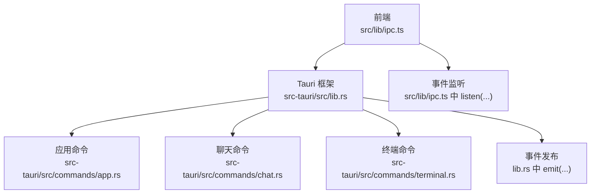
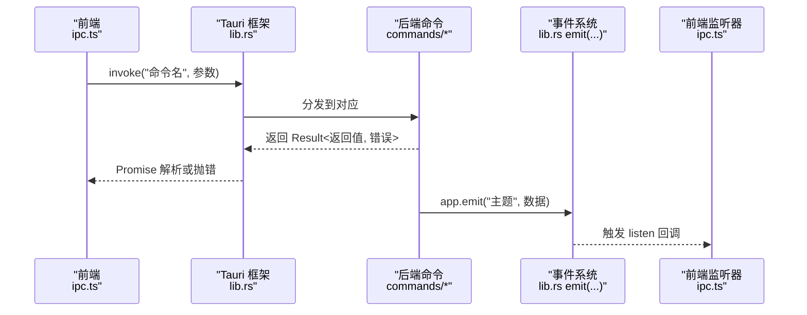
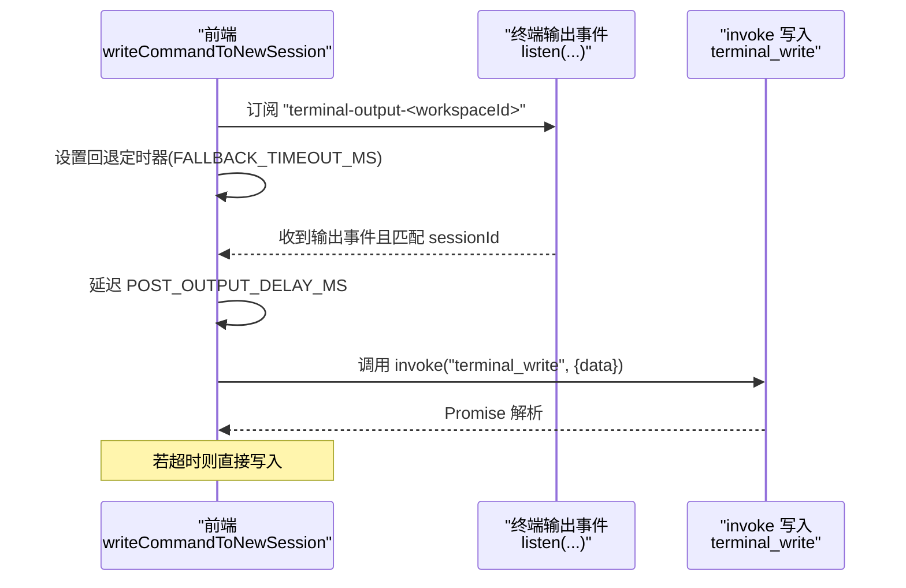
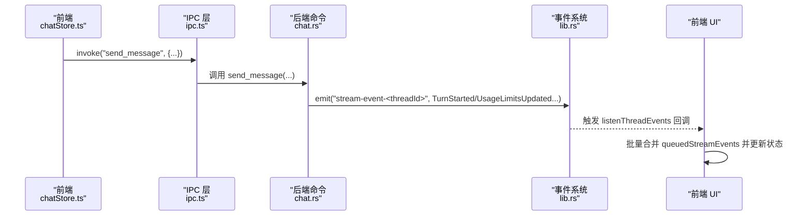
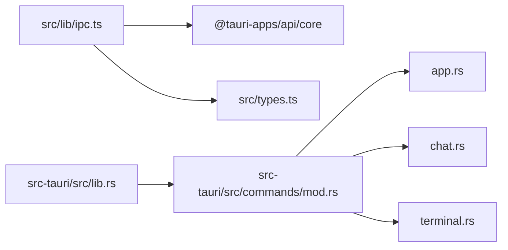

# IPC 通信协议

<cite>
**本文档引用的文件**
- [src/lib/ipc.ts](file://src/lib/ipc.ts)
- [src-tauri/src/lib.rs](file://src-tauri/src/lib.rs)
- [src-tauri/src/commands/mod.rs](file://src-tauri/src/commands/mod.rs)
- [src-tauri/src/commands/app.rs](file://src-tauri/src/commands/app.rs)
- [src-tauri/src/commands/chat.rs](file://src-tauri/src/commands/chat.rs)
- [src-tauri/src/commands/terminal.rs](file://src-tauri/src/commands/terminal.rs)
- [src/types.ts](file://src/types.ts)
- [src/main.tsx](file://src/main.tsx)
- [src/stores/chatStore.ts](file://src/stores/chatStore.ts)
- [src/components/git/MultiRepoChangesView.tsx](file://src/components/git/MultiRepoChangesView.tsx)
- [src-tauri/src/terminal_notifications.rs](file://src-tauri/src/terminal_notifications.rs)
- [src-tauri/src/power/macos_helper.rs](file://src-tauri/src/power/macos_helper.rs)
- [src-tauri/src/sidecars/claude_agent/src/protocol.ts](file://src-tauri/src/sidecars/claude_agent/src/protocol.ts)
</cite>

## 目录
1. [简介](#简介)
2. [项目结构](#项目结构)
3. [核心组件](#核心组件)
4. [架构总览](#架构总览)
5. [详细组件分析](#详细组件分析)
6. [依赖关系分析](#依赖关系分析)
7. [性能考虑](#性能考虑)
8. [故障排除指南](#故障排除指南)
9. [结论](#结论)
10. [附录](#附录)

## 简介
本文件系统性梳理 Panes 前端与后端之间的 IPC（进程间）通信协议，重点覆盖：
- 异步通信机制与 invoke 调用模式
- 事件监听系统与主题命名规范
- 命令注册流程与类型安全机制
- 错误处理策略与超时控制
- 性能优化建议、重试机制与最佳实践

## 项目结构
Panes 的 IPC 由前端 TypeScript 模块统一导出命令接口，并通过 Tauri 的 invoke 桥接至 Rust 后端命令模块；后端通过 Emitter 发布事件，前端通过 listen 订阅。

图表来源
- [src/lib/ipc.ts:72-627](file://src/lib/ipc.ts#L72-L627)
- [src-tauri/src/lib.rs:181-322](file://src-tauri/src/lib.rs#L181-L322)

章节来源
- [src/lib/ipc.ts:72-627](file://src/lib/ipc.ts#L72-L627)
- [src-tauri/src/lib.rs:181-322](file://src-tauri/src/lib.rs#L181-L322)

## 核心组件
- 前端 IPC 封装：集中定义所有 invoke 命令与事件监听函数，统一参数与返回值类型，确保类型安全。
- Tauri 命令注册：在 lib.rs 中通过 generate_handler! 注册所有命令，形成 invoke 映射。
- 事件系统：后端使用 Emitter 发布主题事件，前端通过 listen 订阅并回调处理。
- 类型系统：前端 types.ts 定义数据模型，后端命令层进行序列化/反序列化与校验。

章节来源
- [src/lib/ipc.ts:72-627](file://src/lib/ipc.ts#L72-L627)
- [src-tauri/src/lib.rs:181-322](file://src-tauri/src/lib.rs#L181-L322)
- [src/types.ts:1-200](file://src/types.ts#L1-L200)

## 架构总览
下图展示从前端 invoke 到后端命令执行再到事件发布的完整链路。

图表来源
- [src/lib/ipc.ts:72-627](file://src/lib/ipc.ts#L72-L627)
- [src-tauri/src/lib.rs:181-322](file://src-tauri/src/lib.rs#L181-L322)

## 详细组件分析

### invoke 函数工作原理与调用模式
- 前端封装：所有命令以 ipc.xxx() 形式暴露，内部统一使用 @tauri-apps/api/core 的 invoke，泛型约束返回值类型。
- 参数传递：参数对象统一传入，空值统一转换为 null，避免类型不一致。
- 返回值处理：invoke 返回 Promise<Result<T, string>>，前端捕获错误并进行降级处理。
- 典型场景：国际化设置、终端会话管理、线程消息发送等。

章节来源
- [src/lib/ipc.ts:72-627](file://src/lib/ipc.ts#L72-L627)
- [src/main.tsx:11-31](file://src/main.tsx#L11-L31)

### 命令注册流程与类型安全
- 命令注册：lib.rs 在 setup 阶段通过 generate_handler! 将各模块命令注册到 Tauri invoke 分发器。
- 模块组织：commands/mod.rs 统一导出子模块，便于维护与扩展。
- 类型安全：前端 types.ts 定义强类型接口，后端命令参数/返回值通过 serde 序列化，结合 Rust 类型系统保证一致性。

章节来源
- [src-tauri/src/lib.rs:181-322](file://src-tauri/src/lib.rs#L181-L322)
- [src-tauri/src/commands/mod.rs:1-12](file://src-tauri/src/commands/mod.rs#L1-L12)
- [src/types.ts:1-200](file://src/types.ts#L1-L200)

### 事件监听系统
- 主题命名：事件主题采用小驼峰命名，如 "thread-updated"、"stream-event-<threadId>"、"menu-action" 等。
- 订阅与退订：前端通过 listenXXX() 返回 UnlistenFn，用于在组件卸载或切换时清理监听。
- 典型事件：
  - 流事件：按线程维度广播，前端按 threadId 订阅。
  - Git 变更：git-repo-changed，配合后端 GitWatcherManager 实现文件系统变更通知。
  - 终端输出/退出/焦点变化：terminal-output-<workspaceId>、terminal-exit-<workspaceId> 等。

章节来源
- [src/lib/ipc.ts:629-791](file://src/lib/ipc.ts#L629-L791)
- [src-tauri/src/lib.rs:340-511](file://src-tauri/src/lib.rs#L340-L511)
- [src-tauri/src/git/watcher.rs:1-124](file://src-tauri/src/git/watcher.rs#L1-L124)

### invoke 调用模式与参数/返回值约定
- 参数规范化：前端对可选参数统一转换为 null，避免 undefined 传播。
- 返回值类型：invoke 泛型约束返回值类型，前端按需解析。
- 错误处理：后端命令统一返回 Result<T, String>，前端捕获字符串错误并进行 UI 提示或降级。

章节来源
- [src/lib/ipc.ts:103-107](file://src/lib/ipc.ts#L103-L107)
- [src-tauri/src/commands/app.rs:128-136](file://src-tauri/src/commands/app.rs#L128-L136)

### 事件系统实现细节
- 流事件：后端在引擎运行过程中生成流事件并通过 app.emit("stream-event-<threadId>", ...) 广播，前端按线程订阅并批量合并渲染。
- Git 变更：后端 GitWatcherManager 监听仓库变更，触发 git-repo-changed 事件，前端组件根据可见仓库路径去抖刷新。
- 终端通知：后端通过 TCP 入口接收外部通知，根据窗口焦点状态决定是否清空通知或发出桌面通知。

章节来源
- [src-tauri/src/lib.rs:340-511](file://src-tauri/src/lib.rs#L340-L511)
- [src-tauri/src/git/watcher.rs:24-54](file://src-tauri/src/git/watcher.rs#L24-L54)
- [src-tauri/src/terminal_notifications.rs:326-365](file://src-tauri/src/terminal_notifications.rs#L326-L365)

### 写入新终端会话的时序
该流程展示了前端如何等待终端输出就绪后再写入命令，包含超时回退与防抖逻辑。

图表来源
- [src/lib/ipc.ts:749-791](file://src/lib/ipc.ts#L749-L791)

章节来源
- [src/lib/ipc.ts:749-791](file://src/lib/ipc.ts#L749-L791)

### 聊天消息发送与事件流处理
该流程展示前端发送消息到后端，后端启动引擎回合并在流中推送事件，前端批量合并渲染。

图表来源
- [src/stores/chatStore.ts:1600-1799](file://src/stores/chatStore.ts#L1600-L1799)
- [src-tauri/src/commands/chat.rs:384-499](file://src-tauri/src/commands/chat.rs#L384-L499)
- [src-tauri/src/lib.rs:340-511](file://src-tauri/src/lib.rs#L340-L511)

章节来源
- [src/stores/chatStore.ts:1600-1799](file://src/stores/chatStore.ts#L1600-L1799)
- [src-tauri/src/commands/chat.rs:384-499](file://src-tauri/src/commands/chat.rs#L384-L499)
- [src-tauri/src/lib.rs:340-511](file://src-tauri/src/lib.rs#L340-L511)

### 终端命令与事件主题映射
- 终端会话生命周期：创建、写入、字节写入、调整大小、关闭、列出、诊断、恢复、输出/退出/焦点变化等。
- 事件主题：terminal-output-<workspaceId>、terminal-exit-<workspaceId>、terminal-fg-changed-<workspaceId>、terminal-notification-<workspaceId>、terminal-notification-cleared-<workspaceId>。

章节来源
- [src/lib/ipc.ts:547-742](file://src/lib/ipc.ts#L547-L742)
- [src-tauri/src/commands/terminal.rs:88-124](file://src-tauri/src/commands/terminal.rs#L88-L124)

### 菜单事件与应用命令
- 菜单事件：lib.rs 监听菜单事件并发布 "menu-action" 主题。
- 应用命令：国际化、终端加速渲染、通知设置、声音预览、桌面通知等。

章节来源
- [src-tauri/src/lib.rs:167-196](file://src-tauri/src/lib.rs#L167-L196)
- [src-tauri/src/commands/app.rs:128-292](file://src-tauri/src/commands/app.rs#L128-L292)

### 辅助进程与超时/重试
- macOS 辅助进程：通过 HelperConnection 进行 IPC，支持超时与指数退避重试连接。
- 超时策略：HelperConnection.send_raw 使用 timeout 包裹，避免阻塞。

章节来源
- [src-tauri/src/power/macos_helper.rs:219-259](file://src-tauri/src/power/macos_helper.rs#L219-L259)

### Sidecar 协议与通知
- Sidecar 协议：定义请求/响应/通知三类消息，支持方法与参数字段。
- 通知集成：终端通知管理器通过 TCP 接收外部通知，结合窗口焦点状态进行处理。

章节来源
- [src-tauri/src/sidecars/claude_agent/src/protocol.ts:1-21](file://src-tauri/src/sidecars/claude_agent/src/protocol.ts#L1-L21)
- [src-tauri/src/terminal_notifications.rs:326-365](file://src-tauri/src/terminal_notifications.rs#L326-L365)

## 依赖关系分析
- 前端依赖：@tauri-apps/api/core 提供 invoke、listen；自定义 ipc.ts 封装命令与事件。
- 后端依赖：Tauri 框架提供 invoke_handler、Emitter、State 等；各命令模块通过 #[tauri::command] 导出。
- 类型依赖：前端 types.ts 与后端 serde 结构相互映射，确保跨边界数据一致性。

图表来源
- [src/lib/ipc.ts:1-7](file://src/lib/ipc.ts#L1-L7)
- [src-tauri/src/lib.rs:1-20](file://src-tauri/src/lib.rs#L1-L20)
- [src-tauri/src/commands/mod.rs:1-12](file://src-tauri/src/commands/mod.rs#L1-L12)

章节来源
- [src/lib/ipc.ts:1-7](file://src/lib/ipc.ts#L1-L7)
- [src-tauri/src/lib.rs:1-20](file://src-tauri/src/lib.rs#L1-L20)
- [src-tauri/src/commands/mod.rs:1-12](file://src-tauri/src/commands/mod.rs#L1-L12)

## 性能考虑
- 事件批处理：前端在聊天流中对事件进行队列化与批量刷新，减少渲染开销。
- 去抖与节流：Git 变更监听使用去抖窗口，避免频繁刷新。
- 超时与回退：写入新终端会话时采用回退定时器，提升可靠性。
- I/O 分离：命令层使用 spawn_blocking 处理阻塞操作，避免阻塞事件循环。

章节来源
- [src/stores/chatStore.ts:1628-1740](file://src/stores/chatStore.ts#L1628-L1740)
- [src-tauri/src/git/watcher.rs:42-50](file://src-tauri/src/git/watcher.rs#L42-L50)
- [src/lib/ipc.ts:749-791](file://src/lib/ipc.ts#L749-L791)
- [src-tauri/src/commands/app.rs:128-136](file://src-tauri/src/commands/app.rs#L128-L136)

## 故障排除指南
- invoke 返回错误：检查后端命令是否正确实现，返回 Result<T, String>；前端捕获并提示用户。
- 事件未到达：确认主题名称与订阅通道一致；检查前端是否正确调用 listen 并在组件卸载时调用 UnlistenFn。
- 超时问题：对于需要外部进程交互的命令（如 macOS 辅助进程），合理设置超时与重试策略。
- Git 变更无反应：确认已调用 watchGitRepo 并检查去抖窗口配置。

章节来源
- [src-tauri/src/power/macos_helper.rs:219-259](file://src-tauri/src/power/macos_helper.rs#L219-L259)
- [src/components/git/MultiRepoChangesView.tsx:174-228](file://src/components/git/MultiRepoChangesView.tsx#L174-L228)

## 结论
Panes 的 IPC 体系通过前端统一封装、后端命令注册与事件发布机制，实现了类型安全、可扩展且高性能的前后端通信。遵循本文档的调用模式、事件命名与错误处理策略，可在保证稳定性的同时获得良好的用户体验。

## 附录
- 常用命令与事件主题速查：
  - 应用：get_app_locale、set_app_locale、get_terminal_accelerated_rendering、set_terminal_accelerated_rendering、show_agent_notification 等。
  - 聊天：send_message、get_thread_messages、listenThreadEvents、listenChatTurnFinished 等。
  - 终端：terminal_create_session、terminal_write、terminal_resize、listenTerminalOutput、listenTerminalExit 等。
  - Git：watch_git_repo、listenGitRepoChanged 等。

章节来源
- [src/lib/ipc.ts:72-627](file://src/lib/ipc.ts#L72-L627)
- [src-tauri/src/lib.rs:181-322](file://src-tauri/src/lib.rs#L181-L322)