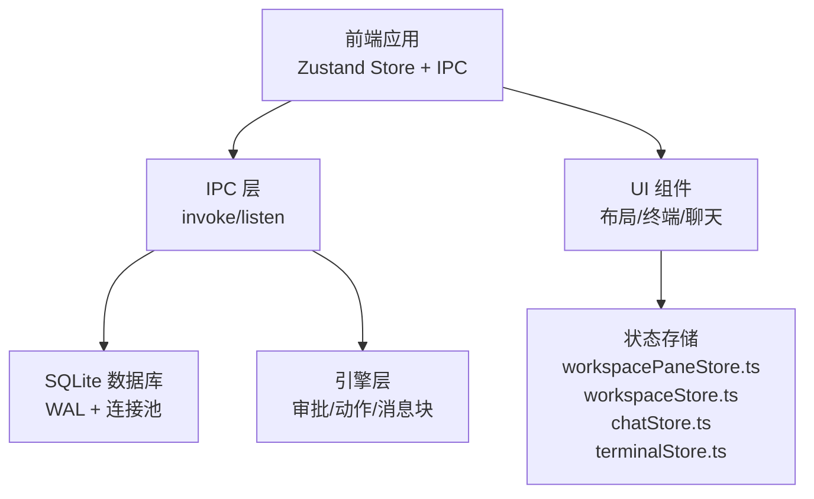
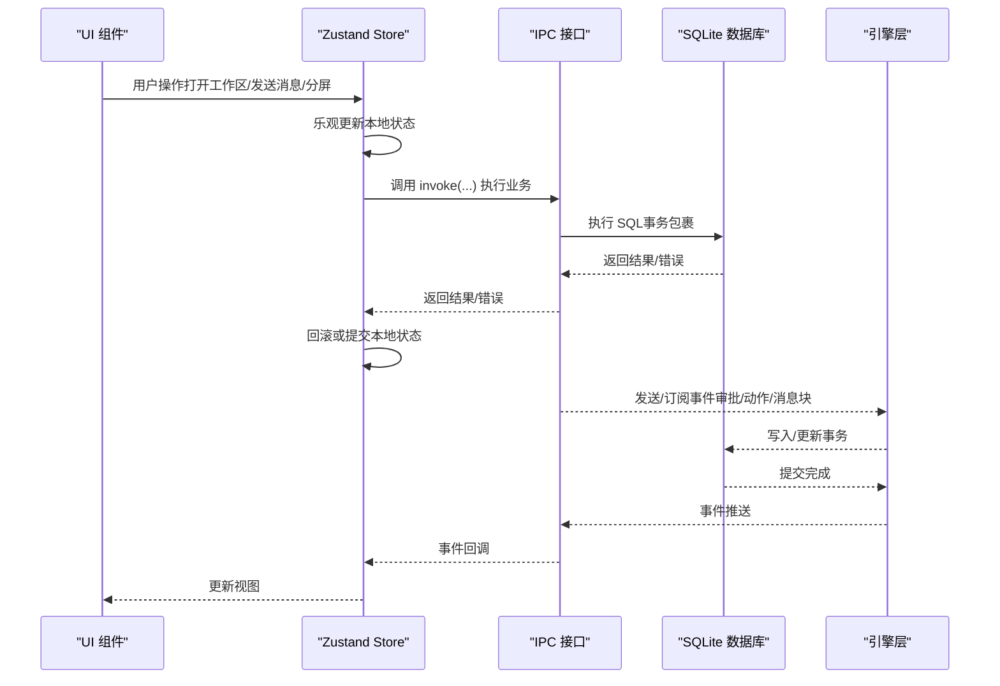
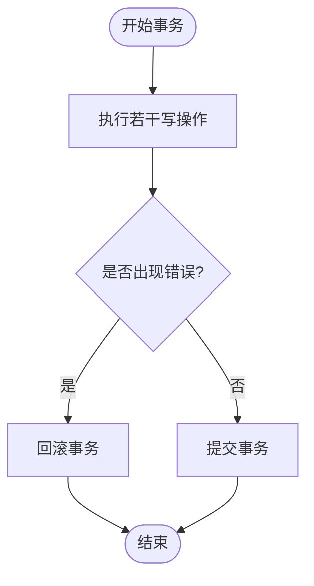
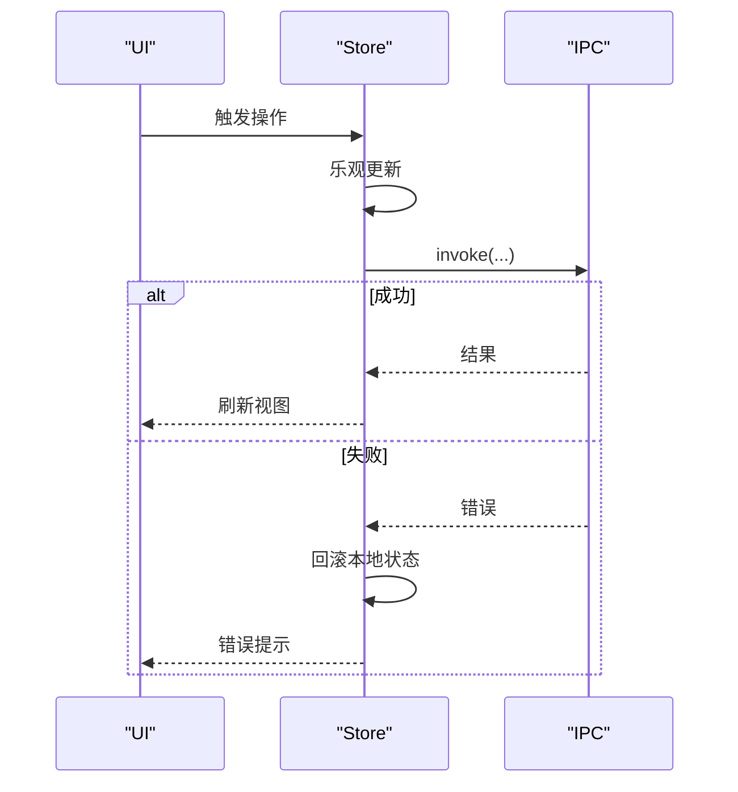
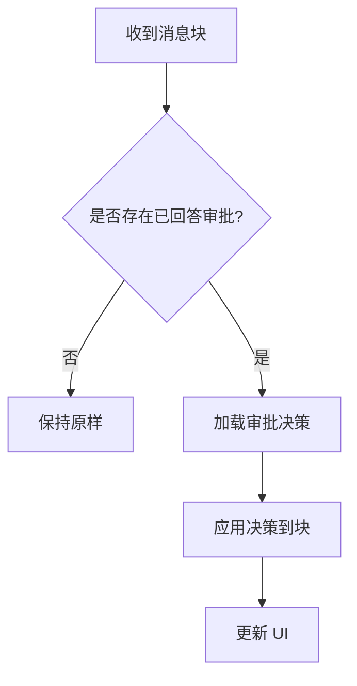
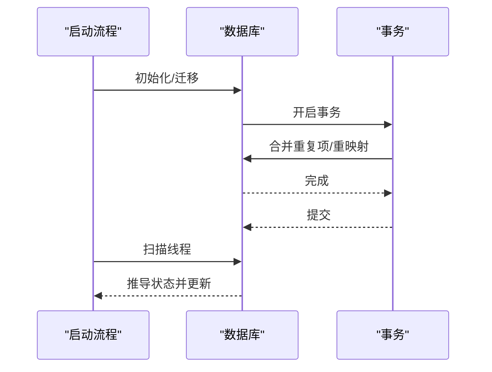
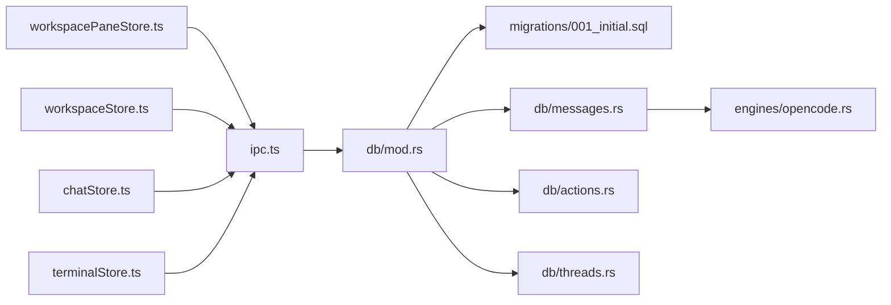

# 一致性保证

<cite>
**本文引用的文件**
- [src-tauri/src/db/mod.rs](file://src-tauri/src/db/mod.rs)
- [src-tauri/src/db/migrations/001_initial.sql](file://src-tauri/src/db/migrations/001_initial.sql)
- [src-tauri/src/db/messages.rs](file://src-tauri/src/db/messages.rs)
- [src-tauri/src/db/actions.rs](file://src-tauri/src/db/actions.rs)
- [src-tauri/src/db/threads.rs](file://src-tauri/src/db/threads.rs)
- [src-tauri/src/engines/opencode.rs](file://src-tauri/src/engines/opencode.rs)
- [src/lib/ipc.ts](file://src/lib/ipc.ts)
- [src/stores/workspacePaneStore.ts](file://src/stores/workspacePaneStore.ts)
- [src/stores/workspaceStore.ts](file://src/stores/workspaceStore.ts)
- [src/stores/chatStore.ts](file://src/stores/chatStore.ts)
- [src/stores/terminalStore.ts](file://src/stores/terminalStore.ts)
</cite>

## 目录
1. [引言](#引言)
2. [项目结构](#项目结构)
3. [核心组件](#核心组件)
4. [架构总览](#架构总览)
5. [详细组件分析](#详细组件分析)
6. [依赖关系分析](#依赖关系分析)
7. [性能考量](#性能考量)
8. [故障排查指南](#故障排查指南)
9. [结论](#结论)

## 引言
本文件聚焦于 Panes 的“状态一致性保证机制”，系统阐述前端状态与后端状态的对齐策略、事务与回滚、数据库 ACID 与并发控制、冲突解决与版本/时间戳管理、一致性校验与数据完整性、以及在分布式场景下的 CAP 定理应用。目标是帮助读者理解从界面交互到数据库持久化、再到引擎执行与事件流的全链路一致性保障。

## 项目结构
- 前端使用 Zustand 管理工作区布局、仓库与线程状态，并通过 IPC 与后端通信。
- 后端以 SQLite 为核心存储，采用 WAL 模式与连接池，配合显式的事务封装与迁移脚本确保模式演进一致。
- 引擎侧提供审批、动作与消息块的最终一致性与冲突化解耦。

图表来源
- [src/lib/ipc.ts:73-648](file://src/lib/ipc.ts#L73-L648)
- [src-tauri/src/db/mod.rs:74-150](file://src-tauri/src/db/mod.rs#L74-L150)

章节来源
- [src/lib/ipc.ts:73-648](file://src/lib/ipc.ts#L73-L648)
- [src-tauri/src/db/mod.rs:74-150](file://src-tauri/src/db/mod.rs#L74-L150)

## 核心组件
- 数据库层：连接池、WAL 模式、外键约束、索引与触发器，提供 ACID 与并发安全。
- 状态存储层：前端 Zustand Store 管理布局、仓库、线程与终端状态，提供乐观更新与回滚。
- IPC 层：统一的调用与事件监听接口，承载前后端交互契约。
- 引擎层：审批与动作的生命周期管理，消息块的最终一致性与冲突化解码。

章节来源
- [src-tauri/src/db/mod.rs:74-150](file://src-tauri/src/db/mod.rs#L74-L150)
- [src/stores/workspacePaneStore.ts:496-701](file://src/stores/workspacePaneStore.ts#L496-L701)
- [src/stores/workspaceStore.ts:134-428](file://src/stores/workspaceStore.ts#L134-L428)
- [src/lib/ipc.ts:73-648](file://src/lib/ipc.ts#L73-L648)

## 架构总览
从前端到后端的数据流与一致性路径如下：

图表来源
- [src/lib/ipc.ts:358-404](file://src/lib/ipc.ts#L358-L404)
- [src-tauri/src/db/messages.rs:30-77](file://src-tauri/src/db/messages.rs#L30-L77)
- [src-tauri/src/db/actions.rs:9-98](file://src-tauri/src/db/actions.rs#L9-L98)

## 详细组件分析

### 数据库事务与 ACID 保障
- 连接池与 WAL：数据库初始化启用 WAL 模式与连接池，提升并发读写性能与可靠性。
- 显式事务：多处关键路径使用事务包裹（如消息克隆、导入、路径修复、运行时恢复）。
- 外键与索引：通过迁移脚本建立外键约束与复合索引，保证参照完整性与查询效率。
- 运行时恢复：启动时扫描线程并基于审批状态与消息状态推导线程状态，批量更新并提交。

图表来源
- [src-tauri/src/db/messages.rs:86-131](file://src-tauri/src/db/messages.rs#L86-L131)
- [src-tauri/src/db/messages.rs:138-194](file://src-tauri/src/db/messages.rs#L138-L194)
- [src-tauri/src/db/mod.rs:259-268](file://src-tauri/src/db/mod.rs#L259-L268)
- [src-tauri/src/db/threads.rs:331-367](file://src-tauri/src/db/threads.rs#L331-L367)

章节来源
- [src-tauri/src/db/mod.rs:138-150](file://src-tauri/src/db/mod.rs#L138-L150)
- [src-tauri/src/db/migrations/001_initial.sql:1-132](file://src-tauri/src/db/migrations/001_initial.sql#L1-L132)
- [src-tauri/src/db/messages.rs:86-131](file://src-tauri/src/db/messages.rs#L86-L131)
- [src-tauri/src/db/messages.rs:138-194](file://src-tauri/src/db/messages.rs#L138-L194)
- [src-tauri/src/db/mod.rs:259-268](file://src-tauri/src/db/mod.rs#L259-L268)
- [src-tauri/src/db/threads.rs:331-367](file://src-tauri/src/db/threads.rs#L331-L367)

### 前端状态与 IPC 对齐
- 乐观更新：聊天与终端状态在发起请求前先更新本地，失败时回滚。
- 事件驱动：通过 listen* API 订阅后端事件，实时刷新 UI。
- 工作区与仓库：加载与切换时维护 last-active 与 repo 选择记忆，避免状态漂移。

图表来源
- [src/stores/chatStore.ts:2089-2094](file://src/stores/chatStore.ts#L2089-L2094)
- [src/lib/ipc.ts:650-701](file://src/lib/ipc.ts#L650-L701)
- [src/stores/workspaceStore.ts:142-158](file://src/stores/workspaceStore.ts#L142-L158)

章节来源
- [src/stores/chatStore.ts:2089-2094](file://src/stores/chatStore.ts#L2089-L2094)
- [src/lib/ipc.ts:650-701](file://src/lib/ipc.ts#L650-L701)
- [src/stores/workspaceStore.ts:142-158](file://src/stores/workspaceStore.ts#L142-L158)

### 冲突解决与版本/时间戳管理
- 审批与动作：审批状态（pending/answered）与动作状态（running/done/error）作为冲突源，通过后端查询与前端回填实现最终一致。
- 消息块冲突：根据已回答的审批决策对消息块进行重解码与应用，保证展示一致性。
- 时间戳与排序：消息按 created_at 升序排列，部分场景使用倒排时间戳辅助排序。
- 引擎消息 ID：OpenCode 使用时间+计数+随机串组合生成有序且低冲突的消息 ID。

图表来源
- [src-tauri/src/db/messages.rs:1012-1023](file://src-tauri/src/db/messages.rs#L1012-L1023)
- [src-tauri/src/db/messages.rs:1025-1050](file://src-tauri/src/db/messages.rs#L1025-L1050)
- [src-tauri/src/engines/opencode.rs:2983-3010](file://src-tauri/src/engines/opencode.rs#L2983-L3010)

章节来源
- [src-tauri/src/db/messages.rs:1012-1023](file://src-tauri/src/db/messages.rs#L1012-L1023)
- [src-tauri/src/db/messages.rs:1025-1050](file://src-tauri/src/db/messages.rs#L1025-L1050)
- [src-tauri/src/engines/opencode.rs:2983-3010](file://src-tauri/src/engines/opencode.rs#L2983-L3010)

### 并发控制与恢复
- 数据库并发：WAL + 连接池 + 忙等待超时，减少锁竞争。
- 路径修复与去重：启动时合并重复工作区/仓库路径，重映射引用并更新元数据。
- 运行时恢复：扫描线程，依据审批与消息状态推导线程状态并批量更新。

图表来源
- [src-tauri/src/db/mod.rs:122-135](file://src-tauri/src/db/mod.rs#L122-L135)
- [src-tauri/src/db/mod.rs:259-268](file://src-tauri/src/db/mod.rs#L259-L268)
- [src-tauri/src/db/mod.rs:338-406](file://src-tauri/src/db/mod.rs#L338-L406)
- [src-tauri/src/db/threads.rs:331-367](file://src-tauri/src/db/threads.rs#L331-L367)

章节来源
- [src-tauri/src/db/mod.rs:122-135](file://src-tauri/src/db/mod.rs#L122-L135)
- [src-tauri/src/db/mod.rs:259-268](file://src-tauri/src/db/mod.rs#L259-L268)
- [src-tauri/src/db/mod.rs:338-406](file://src-tauri/src/db/mod.rs#L338-L406)
- [src-tauri/src/db/threads.rs:331-367](file://src-tauri/src/db/threads.rs#L331-L367)

### 分布式状态同步与 CAP 定理
- 一致性模型：后端以数据库为中心，前端通过 IPC 与事件驱动实现最终一致；引擎侧以消息块与审批为冲突点，通过后端查询与前端回填达成收敛。
- 可用性：IPC 事件监听与本地乐观更新提升用户体验；数据库 WAL 降低写入阻塞。
- 分区容错：工作区与仓库状态通过 last-active 与持久化键值维持跨会话一致性；终端会话通过事件序列号与恢复机制保证输出不丢失。

章节来源
- [src/lib/ipc.ts:650-701](file://src/lib/ipc.ts#L650-L701)
- [src/stores/workspacePaneStore.ts:383-418](file://src/stores/workspacePaneStore.ts#L383-L418)
- [src/stores/terminalStore.ts:1482-1494](file://src/stores/terminalStore.ts#L1482-L1494)

## 依赖关系分析

图表来源
- [src/stores/workspacePaneStore.ts:496-701](file://src/stores/workspacePaneStore.ts#L496-L701)
- [src/stores/workspaceStore.ts:134-428](file://src/stores/workspaceStore.ts#L134-L428)
- [src/stores/chatStore.ts:1-2127](file://src/stores/chatStore.ts#L1-L2127)
- [src/stores/terminalStore.ts:819-1494](file://src/stores/terminalStore.ts#L819-L1494)
- [src/lib/ipc.ts:73-648](file://src/lib/ipc.ts#L73-L648)
- [src-tauri/src/db/mod.rs:1-800](file://src-tauri/src/db/mod.rs#L1-L800)
- [src-tauri/src/db/migrations/001_initial.sql:1-132](file://src-tauri/src/db/migrations/001_initial.sql#L1-L132)
- [src-tauri/src/db/messages.rs:1-200](file://src-tauri/src/db/messages.rs#L1-L200)
- [src-tauri/src/db/actions.rs:1-187](file://src-tauri/src/db/actions.rs#L1-L187)
- [src-tauri/src/db/threads.rs:331-367](file://src-tauri/src/db/threads.rs#L331-L367)
- [src-tauri/src/engines/opencode.rs:2983-3010](file://src-tauri/src/engines/opencode.rs#L2983-L3010)

章节来源
- [src/stores/workspacePaneStore.ts:496-701](file://src/stores/workspacePaneStore.ts#L496-L701)
- [src/stores/workspaceStore.ts:134-428](file://src/stores/workspaceStore.ts#L134-L428)
- [src/stores/chatStore.ts:1-2127](file://src/stores/chatStore.ts#L1-L2127)
- [src/stores/terminalStore.ts:819-1494](file://src/stores/terminalStore.ts#L819-L1494)
- [src/lib/ipc.ts:73-648](file://src/lib/ipc.ts#L73-L648)
- [src-tauri/src/db/mod.rs:1-800](file://src-tauri/src/db/mod.rs#L1-L800)
- [src-tauri/src/db/migrations/001_initial.sql:1-132](file://src-tauri/src/db/migrations/001_initial.sql#L1-L132)
- [src-tauri/src/db/messages.rs:1-200](file://src-tauri/src/db/messages.rs#L1-L200)
- [src-tauri/src/db/actions.rs:1-187](file://src-tauri/src/db/actions.rs#L1-L187)
- [src-tauri/src/db/threads.rs:331-367](file://src-tauri/src/db/threads.rs#L331-L367)
- [src-tauri/src/engines/opencode.rs:2983-3010](file://src-tauri/src/engines/opencode.rs#L2983-L3010)

## 性能考量
- 数据库：WAL 模式提升并发读取；索引覆盖常用查询；连接池复用连接；busy_timeout 避免忙轮询。
- 前端：乐观更新减少等待；批量更新布局与状态；事件驱动增量刷新。
- 引擎：消息 ID 有序生成降低冲突概率；动作输出分片与裁剪避免前端过度渲染。

章节来源
- [src-tauri/src/db/mod.rs:138-150](file://src-tauri/src/db/mod.rs#L138-L150)
- [src-tauri/src/db/migrations/001_initial.sql:96-132](file://src-tauri/src/db/migrations/001_initial.sql#L96-L132)
- [src/stores/workspacePaneStore.ts:485-494](file://src/stores/workspacePaneStore.ts#L485-L494)
- [src/stores/chatStore.ts:2095-2127](file://src/stores/chatStore.ts#L2095-L2127)
- [src-tauri/src/engines/opencode.rs:2983-3010](file://src-tauri/src/engines/opencode.rs#L2983-L3010)

## 故障排查指南
- 事务失败：检查事务包裹范围与错误上下文，确认回滚路径是否执行。
- 审批未生效：确认审批状态与决策是否正确写入，前端是否回填消息块。
- 线程状态异常：运行时恢复会根据审批与消息状态批量更新，关注日志与报告。
- 终端输出丢失：依赖事件序列号与恢复机制，检查事件监听与会话序列。

章节来源
- [src-tauri/src/db/messages.rs:1012-1023](file://src-tauri/src/db/messages.rs#L1012-L1023)
- [src-tauri/src/db/threads.rs:331-367](file://src-tauri/src/db/threads.rs#L331-L367)
- [src/lib/ipc.ts:770-800](file://src/lib/ipc.ts#L770-L800)
- [src/stores/terminalStore.ts:1482-1494](file://src/stores/terminalStore.ts#L1482-L1494)

## 结论
Panes 的一致性保证以“数据库为中心、前端乐观更新、后端事务与事件驱动”为核心策略。通过 WAL、外键与索引确保 ACID 与查询效率；通过事务包裹关键路径与运行时恢复保障异常场景一致性；通过审批与动作的状态机与消息块冲突解码实现最终一致；在分布式场景下遵循 CAP，在可用性与分区容错上做足准备，同时以强一致的数据库作为最终锚点。