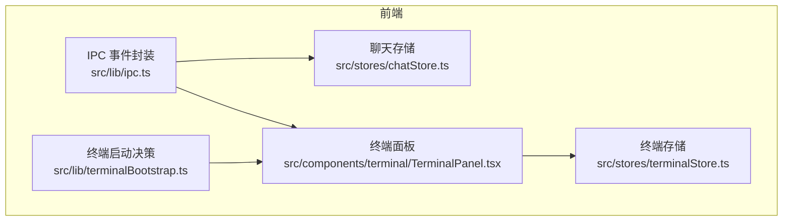
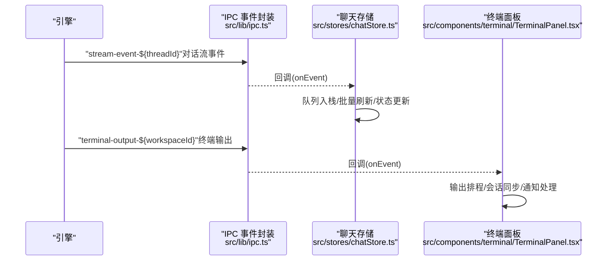
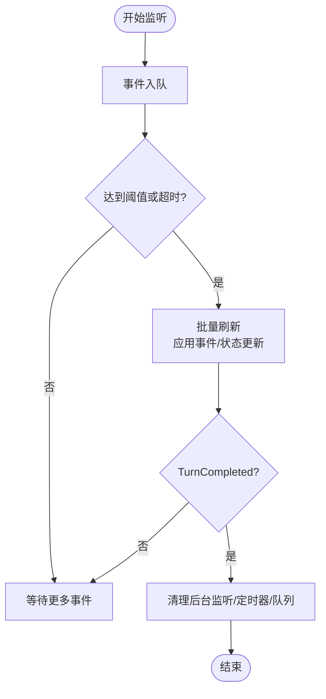
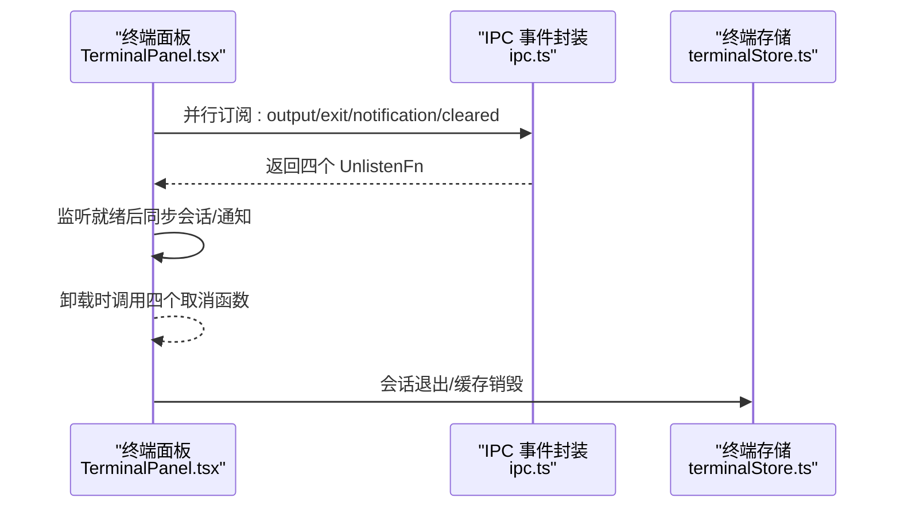
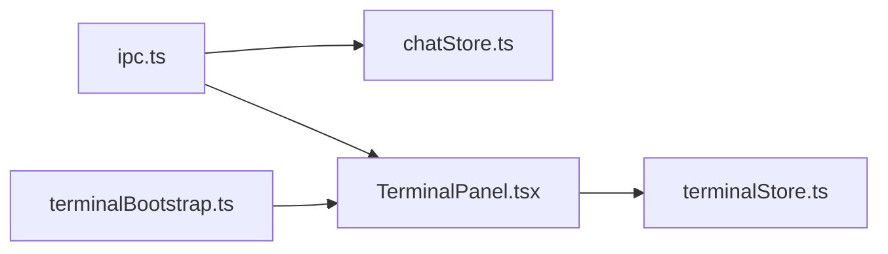

# 事件处理器

<cite>
**本文引用的文件**
- [src/lib/ipc.ts](file://src/lib/ipc.ts)
- [src/stores/chatStore.ts](file://src/stores/chatStore.ts)
- [src/components/terminal/TerminalPanel.tsx](file://src/components/terminal/TerminalPanel.tsx)
- [src/lib/terminalBootstrap.ts](file://src/lib/terminalBootstrap.ts)
- [src/stores/terminalStore.ts](file://src/stores/terminalStore.ts)
</cite>

## 目录
1. [简介](#简介)
2. [项目结构](#项目结构)
3. [核心组件](#核心组件)
4. [架构总览](#架构总览)
5. [详细组件分析](#详细组件分析)
6. [依赖关系分析](#依赖关系分析)
7. [性能考量](#性能考量)
8. [故障排查指南](#故障排查指南)
9. [结论](#结论)
10. [附录](#附录)

## 简介
本文件聚焦于 Panes 的事件处理器系统，系统性阐述事件处理器的注册机制、生命周期管理、错误处理与清理策略，并深入解析关键事件处理器的实现原理与使用方法，包括但不限于：
- listenThreadEvents：对话流事件监听
- listenGitRepoChanged：Git 仓库变更监听
- listenTerminalOutput：终端输出就绪监听
- 其他相关事件监听器（终端退出、前台会话变化、通知等）

同时给出参数传递、返回值处理、清理机制、最佳实践、性能优化与内存泄漏防护策略。

## 项目结构
事件处理器主要分布在以下位置：
- 通用 IPC 事件封装与监听函数：src/lib/ipc.ts
- 对话流事件处理与批处理逻辑：src/stores/chatStore.ts
- 终端面板事件监听与状态同步：src/components/terminal/TerminalPanel.tsx
- 终端启动决策与工作区上下文：src/lib/terminalBootstrap.ts
- 终端会话状态与退出处理：src/stores/terminalStore.ts

图表来源
- [src/lib/ipc.ts:649-763](file://src/lib/ipc.ts#L649-L763)
- [src/stores/chatStore.ts:1542-1801](file://src/stores/chatStore.ts#L1542-L1801)
- [src/components/terminal/TerminalPanel.tsx:3632-3706](file://src/components/terminal/TerminalPanel.tsx#L3632-L3706)
- [src/lib/terminalBootstrap.ts:13-44](file://src/lib/terminalBootstrap.ts#L13-L44)
- [src/stores/terminalStore.ts:476](file://src/stores/terminalStore.ts#L476)

章节来源
- [src/lib/ipc.ts:649-763](file://src/lib/ipc.ts#L649-L763)
- [src/stores/chatStore.ts:1542-1801](file://src/stores/chatStore.ts#L1542-L1801)
- [src/components/terminal/TerminalPanel.tsx:3632-3706](file://src/components/terminal/TerminalPanel.tsx#L3632-L3706)
- [src/lib/terminalBootstrap.ts:13-44](file://src/lib/terminalBootstrap.ts#L13-L44)
- [src/stores/terminalStore.ts:476](file://src/stores/terminalStore.ts#L476)

## 核心组件
- 事件监听工厂（IPC 层）
  - 提供统一的 listenXxx 包装函数，基于 @tauri-apps/api/event.listen 注册监听并返回取消函数 UnlistenFn，便于在组件卸载或切换时清理。
  - 支持命名空间事件（如 terminal-output-${workspaceId}），确保多工作区隔离。
- 聊天流事件处理器（Store 层）
  - 使用 listenThreadEvents 订阅对话流事件，内部实现事件队列、批量刷新、速率统计与后台监听清理，保证在用户切线程时仍能正确接收后续事件。
- 终端事件处理器（UI 层）
  - 在终端面板中并行注册多个终端事件监听（输出、退出、通知、通知清除），并在组件卸载时统一清理；同时结合启动决策逻辑，在监听就绪后进行会话同步与初始化。

章节来源
- [src/lib/ipc.ts:649-763](file://src/lib/ipc.ts#L649-L763)
- [src/stores/chatStore.ts:1542-1801](file://src/stores/chatStore.ts#L1542-L1801)
- [src/components/terminal/TerminalPanel.tsx:3632-3706](file://src/components/terminal/TerminalPanel.tsx#L3632-L3706)

## 架构总览
事件从后端引擎发出，经 IPC 层封装为命名空间事件，前端 Store 或组件订阅后进行业务处理与状态更新。下图展示典型对话流事件与终端事件的调用链路。

图表来源
- [src/lib/ipc.ts:649-763](file://src/lib/ipc.ts#L649-L763)
- [src/stores/chatStore.ts:1742-1799](file://src/stores/chatStore.ts#L1742-L1799)
- [src/components/terminal/TerminalPanel.tsx:3644-3662](file://src/components/terminal/TerminalPanel.tsx#L3644-L3662)

## 详细组件分析

### 事件监听工厂（IPC 层）
- 注册机制
  - 所有 listenXxx 函数均通过 listen<T>(channel, handler) 订阅事件通道，handler 接收 { payload } 结构，解构后传入用户回调。
  - 返回值为 UnlistenFn，调用该函数可立即取消监听。
- 命名空间与作用域
  - 终端相关事件采用 `${prefix}-${workspaceId}` 命名，避免跨工作区事件冲突。
- 错误处理
  - listenXxx 本身不捕获异常，若订阅失败由上层捕获（例如终端面板 useEffect 中的 try/catch）。
- 清理机制
  - 组件卸载或切换时应调用返回的取消函数；聊天存储在切换线程时会先取消旧监听再注册新监听。

章节来源
- [src/lib/ipc.ts:649-763](file://src/lib/ipc.ts#L649-L763)

### 对话流事件处理器（聊天存储）
- 参数与返回
  - listenThreadEvents(threadId, onEvent)：订阅指定线程的流事件；返回 UnlistenFn。
- 生命周期管理
  - 切换线程时，先取消当前监听；若原线程仍在流式传输，则注册“后台监听”以捕获 TurnCompleted，确保状态正确回填。
  - 使用 bindSeq 与 activeThreadBindSeq 防止竞态：若绑定序列号不匹配则忽略事件。
- 事件批处理与性能
  - 内部维护事件队列与定时器，按窗口大小与阈值触发批量刷新，减少渲染抖动。
  - 统计每秒事件数与刷新耗时，用于性能观测。
- 错误处理
  - 监听回调内对不可恢复错误将线程置为 error 状态；TurnCompleted 后清理后台监听。
- 清理机制
  - 提供 unlisten 函数，内部会清理定时器、清空队列并调用 unlistenStream。

图表来源
- [src/stores/chatStore.ts:1651-1779](file://src/stores/chatStore.ts#L1651-L1779)

章节来源
- [src/stores/chatStore.ts:1542-1801](file://src/stores/chatStore.ts#L1542-L1801)

### 终端事件处理器（终端面板）
- 并行监听
  - 在组件挂载时并行注册四类监听：终端输出、终端退出、终端通知、通知清除。
  - 使用 Promise.all 并发订阅，提升初始化速度；若组件已销毁则立即取消所有监听。
- 生命周期与清理
  - 卸载时统一调用四个取消函数，防止内存泄漏。
  - 监听就绪后执行会话同步与通知水化，确保初始状态一致。
- 错误处理
  - 监听初始化阶段的异常被捕获并设置工作区状态为失败，避免静默失败。
- 与启动流程联动
  - 仅当监听就绪且满足布局/打开条件时，才执行终端启动动作（预设或新建会话）。

图表来源
- [src/components/terminal/TerminalPanel.tsx:3644-3662](file://src/components/terminal/TerminalPanel.tsx#L3644-L3662)
- [src/components/terminal/TerminalPanel.tsx:3689-3695](file://src/components/terminal/TerminalPanel.tsx#L3689-L3695)
- [src/stores/terminalStore.ts:476](file://src/stores/terminalStore.ts#L476)

章节来源
- [src/components/terminal/TerminalPanel.tsx:3632-3706](file://src/components/terminal/TerminalPanel.tsx#L3632-L3706)

### 终端命令写入辅助（IPC 层）
- 功能概述
  - writeCommandToNewSession：等待终端输出（shell 就绪）后再写入命令，否则在超时后回退写入。
  - 内部监听 terminal-output-${workspaceId}，根据 sessionId 过滤事件，避免写入到错误会话。
- 参数与返回
  - 输入：workspaceId、sessionId、command；返回 Promise<void>。
- 清理机制
  - 成功写入后清理监听与定时器，防止泄漏。

章节来源
- [src/lib/ipc.ts:770-813](file://src/lib/ipc.ts#L770-L813)

### 终端启动决策（工具层）
- 功能概述
  - resolveTerminalBootstrapAction：根据监听就绪、工作区 ID、布局模式、会话数量等条件决定是否创建会话或应用启动预设。
- 关键点
  - 若监听未就绪或已有创建在途，则返回 "none"，避免重复初始化。

章节来源
- [src/lib/terminalBootstrap.ts:13-44](file://src/lib/terminalBootstrap.ts#L13-L44)

## 依赖关系分析
- IPC 层为上层提供统一的事件订阅接口，降低耦合度。
- 聊天存储依赖 IPC 的 listenThreadEvents 实现流式体验，同时自行管理批处理与后台监听。
- 终端面板依赖 IPC 的终端事件监听，并与终端存储协作完成会话与通知管理。
- 启动决策模块为终端面板提供“何时创建会话”的策略依据。

图表来源
- [src/lib/ipc.ts:649-763](file://src/lib/ipc.ts#L649-L763)
- [src/stores/chatStore.ts:1542-1801](file://src/stores/chatStore.ts#L1542-L1801)
- [src/components/terminal/TerminalPanel.tsx:3632-3706](file://src/components/terminal/TerminalPanel.tsx#L3632-L3706)
- [src/lib/terminalBootstrap.ts:13-44](file://src/lib/terminalBootstrap.ts#L13-L44)
- [src/stores/terminalStore.ts:476](file://src/stores/terminalStore.ts#L476)

## 性能考量
- 事件批处理
  - 聊天存储使用固定时间窗口与队列阈值控制批量刷新频率，降低频繁渲染带来的开销。
- 定时器与防抖
  - 使用 setTimeout 控制刷新节奏，避免高频事件导致主线程阻塞。
- 后台监听清理
  - 切线程时及时清理后台监听，避免无用事件堆积。
- 监听就绪与并发
  - 终端面板使用 Promise.all 并发订阅，缩短初始化时间；监听就绪后再进行昂贵操作（会话同步、通知水化）。
- 超时与回退
  - 命令写入采用超时回退策略，避免长时间等待。

## 故障排查指南
- 监听未生效
  - 检查命名空间是否正确（终端事件需包含 workspaceId）。
  - 确认组件已调用取消函数，避免重复监听导致事件重复处理。
- 事件丢失
  - 切线程场景下确认后台监听是否注册并清理时机是否正确。
  - 检查 bindSeq 是否被重置或不匹配。
- 性能问题
  - 观察事件每秒速率与刷新耗时指标，必要时增大窗口或阈值。
  - 检查是否存在过多不必要的渲染或状态更新。
- 终端初始化失败
  - 查看监听初始化异常日志，确认工作区状态是否被标记为失败。
  - 检查布局与打开状态是否满足启动决策条件。

章节来源
- [src/stores/chatStore.ts:1542-1801](file://src/stores/chatStore.ts#L1542-L1801)
- [src/components/terminal/TerminalPanel.tsx:3681-3686](file://src/components/terminal/TerminalPanel.tsx#L3681-L3686)

## 结论
Panes 的事件处理器系统通过 IPC 层统一封装、Store/组件层精细化管理，实现了高可用、低耦合、可扩展的事件驱动架构。其关键特性包括：
- 明确的命名空间与作用域隔离
- 严格的生命周期与清理策略
- 面向性能的批处理与速率控制
- 面向用户体验的后台监听与启动决策

遵循本文最佳实践与注意事项，可在复杂交互场景下保持稳定与高性能。

## 附录
- 最佳实践清单
  - 始终在组件卸载时调用返回的取消函数
  - 使用命名空间事件区分多实例场景
  - 切线程/切会话时清理后台监听
  - 合理设置批处理窗口与阈值
  - 对关键路径增加性能指标埋点
- 内存泄漏防护
  - 及时清理定时器与事件监听
  - 避免闭包持有过期引用
  - 在并发订阅中统一管理取消函数