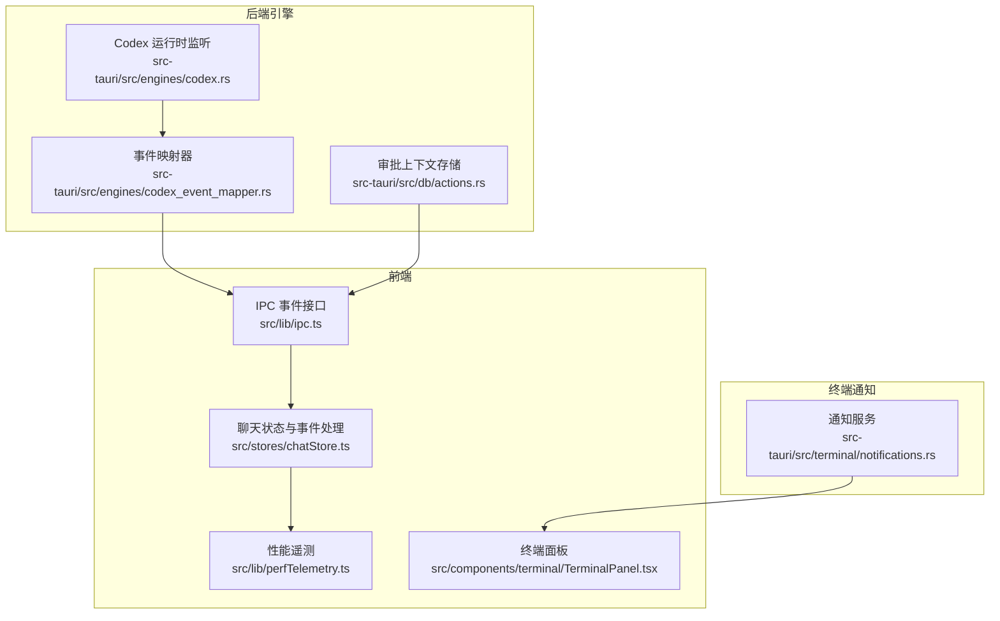
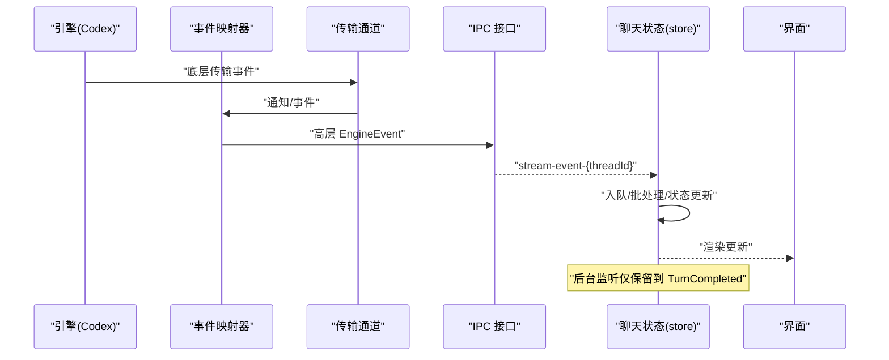
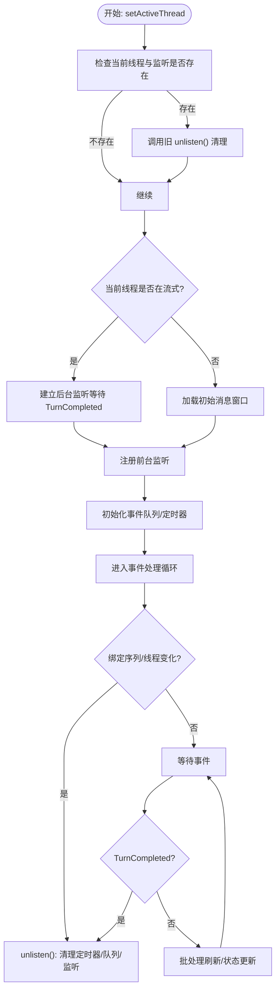
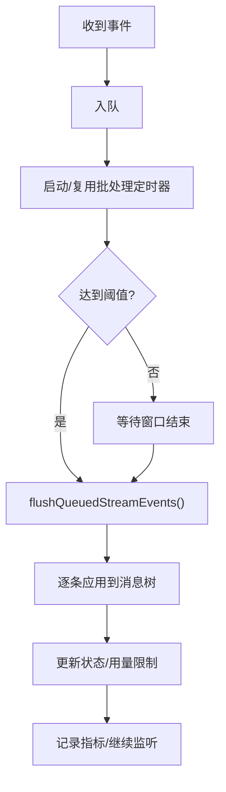
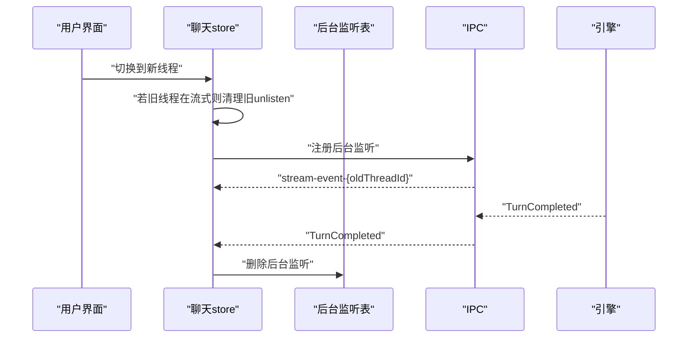
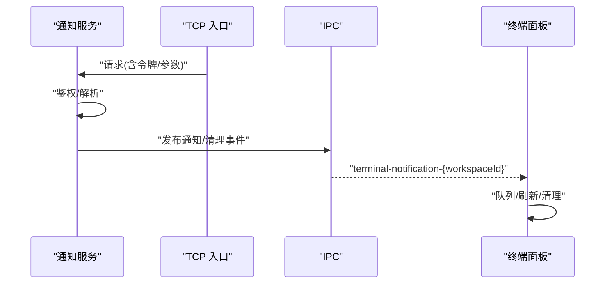
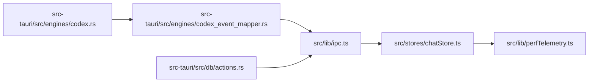

# 事件生命周期

<cite>
**本文引用的文件**
- [src/lib/ipc.ts](file://src/lib/ipc.ts)
- [src/stores/chatStore.ts](file://src/stores/chatStore.ts)
- [src/lib/perfTelemetry.ts](file://src/lib/perfTelemetry.ts)
- [src-tauri/src/engines/codex.rs](file://src-tauri/src/engines/codex.rs)
- [src-tauri/src/engines/codex_event_mapper.rs](file://src-tauri/src/engines/codex_event_mapper.rs)
- [src-tauri/src/db/actions.rs](file://src-tauri/src/db/actions.rs)
- [src-tauri/src/terminal/notifications.rs](file://src-tauri/src/terminal/notifications.rs)
- [src/components/terminal/TerminalPanel.tsx](file://src/components/terminal/TerminalPanel.tsx)
</cite>

## 目录
1. [简介](#简介)
2. [项目结构](#项目结构)
3. [核心组件](#核心组件)
4. [架构总览](#架构总览)
5. [详细组件分析](#详细组件分析)
6. [依赖关系分析](#依赖关系分析)
7. [性能考量](#性能考量)
8. [故障排查指南](#故障排查指南)
9. [结论](#结论)

## 简介
本文件系统性阐述 Panes 中“事件生命周期”的设计与实现，覆盖事件从创建到销毁的完整流程：创建时机、传播路径、处理顺序、批处理与刷新、后台监听与清理、冲突处理与优先级策略、并发处理与性能监控等。重点围绕聊天线程事件（如流式事件、审批请求、转轮完成）以及终端通知事件展开，并给出调试与性能优化建议。

## 项目结构
与事件生命周期直接相关的关键模块：
- 前端事件订阅与分发：src/lib/ipc.ts 提供统一的事件监听接口与命名空间
- 聊天状态与事件处理：src/stores/chatStore.ts 实现事件队列、批处理、状态机转换与清理
- 性能遥测：src/lib/perfTelemetry.ts 记录并告警关键指标
- 引擎侧事件映射与传输：src-tauri/src/engines/codex.rs、codex_event_mapper.rs
- 数据库审批上下文：src-tauri/src/db/actions.rs
- 终端通知发布与消费：src-tauri/src/terminal/notifications.rs、src/components/terminal/TerminalPanel.tsx

**图表来源**
- [src/lib/ipc.ts:650-763](file://src/lib/ipc.ts#L650-L763)
- [src/stores/chatStore.ts:64-1825](file://src/stores/chatStore.ts#L64-L1825)
- [src/lib/perfTelemetry.ts:1-146](file://src/lib/perfTelemetry.ts#L1-L146)
- [src-tauri/src/engines/codex.rs:2410-2434](file://src-tauri/src/engines/codex.rs#L2410-L2434)
- [src-tauri/src/engines/codex_event_mapper.rs:1003-1038](file://src-tauri/src/engines/codex_event_mapper.rs#L1003-L1038)
- [src-tauri/src/db/actions.rs:134-186](file://src-tauri/src/db/actions.rs#L134-L186)
- [src-tauri/src/terminal/notifications.rs:247-397](file://src-tauri/src/terminal/notifications.rs#L247-L397)
- [src/components/terminal/TerminalPanel.tsx:1437-1474](file://src/components/terminal/TerminalPanel.tsx#L1437-L1474)

**章节来源**
- [src/lib/ipc.ts:650-763](file://src/lib/ipc.ts#L650-L763)
- [src/stores/chatStore.ts:64-1825](file://src/stores/chatStore.ts#L64-L1825)
- [src/lib/perfTelemetry.ts:1-146](file://src/lib/perfTelemetry.ts#L1-L146)
- [src-tauri/src/engines/codex.rs:2410-2434](file://src-tauri/src/engines/codex.rs#L2410-L2434)
- [src-tauri/src/engines/codex_event_mapper.rs:1003-1038](file://src-tauri/src/engines/codex_event_mapper.rs#L1003-L1038)
- [src-tauri/src/db/actions.rs:134-186](file://src-tauri/src/db/actions.rs#L134-L186)
- [src-tauri/src/terminal/notifications.rs:247-397](file://src-tauri/src/terminal/notifications.rs#L247-L397)
- [src/components/terminal/TerminalPanel.tsx:1437-1474](file://src/components/terminal/TerminalPanel.tsx#L1437-L1474)

## 核心组件
- 事件订阅与命名空间
  - 前端通过统一的 listenXxx 接口订阅事件，使用命名空间区分作用域（如 threadId、workspaceId）
  - 示例：线程事件、终端输出、安装进度、菜单动作等
- 聊天事件处理流水线
  - 事件入队、批量窗口、阈值触发、批处理刷新、状态机更新、后台监听与清理
- 性能遥测与预算告警
  - 关键指标记录与阈值告警，便于定位瓶颈
- 引擎事件映射与传输
  - 后端将底层传输事件映射为高层 EngineEvent，再经 IPC 分发至前端
- 审批上下文持久化
  - 审批请求在数据库中建立上下文，确保前后端一致

**章节来源**
- [src/lib/ipc.ts:650-763](file://src/lib/ipc.ts#L650-L763)
- [src/stores/chatStore.ts:64-1825](file://src/stores/chatStore.ts#L64-L1825)
- [src/lib/perfTelemetry.ts:28-87](file://src/lib/perfTelemetry.ts#L28-L87)
- [src-tauri/src/engines/codex.rs:2410-2434](file://src-tauri/src/engines/codex.rs#L2410-L2434)
- [src-tauri/src/db/actions.rs:134-186](file://src-tauri/src/db/actions.rs#L134-L186)

## 架构总览
事件生命周期由“前端订阅—后端映射—IPC 分发—前端处理—状态更新—清理回收”构成闭环。关键路径如下：
- 后端引擎产生事件 → 映射为高层事件 → 通过传输通道发送 → 前端按 threadId/工作区订阅 → 入队批处理 → 更新状态与消息树 → 清理监听

**图表来源**
- [src-tauri/src/engines/codex.rs:2410-2434](file://src-tauri/src/engines/codex.rs#L2410-L2434)
- [src-tauri/src/engines/codex_event_mapper.rs:1003-1038](file://src-tauri/src/engines/codex_event_mapper.rs#L1003-L1038)
- [src/lib/ipc.ts:650-655](file://src/lib/ipc.ts#L650-L655)
- [src/stores/chatStore.ts:1627-1789](file://src/stores/chatStore.ts#L1627-L1789)

## 详细组件分析

### 事件创建与订阅生命周期
- 创建时机
  - 前端在激活线程时创建订阅；若当前线程仍在流式中，先清理旧监听，再建立新监听
  - 若用户切换线程且原线程仍流式，则建立轻量后台监听，仅等待 TurnCompleted 以保持状态正确
- 订阅与命名空间
  - 使用 listenThreadEvents 等接口，事件通道按 threadId 或 workspaceId 命名，避免跨线程/跨会话干扰
- 自动清理
  - 每次重新绑定前清理旧 unlisten；当绑定序列号变化或线程切换，立即停止旧监听
  - 后台监听在 TurnCompleted 时自动清理
- 手动清理
  - 提供 unlisten 函数，调用后清除定时器、清空队列、停止监听

**图表来源**
- [src/stores/chatStore.ts:1542-1578](file://src/stores/chatStore.ts#L1542-L1578)
- [src/stores/chatStore.ts:1600-1825](file://src/stores/chatStore.ts#L1600-L1825)
- [src/stores/chatStore.ts:1742-1789](file://src/stores/chatStore.ts#L1742-L1789)

**章节来源**
- [src/stores/chatStore.ts:64-1825](file://src/stores/chatStore.ts#L64-L1825)
- [src/lib/ipc.ts:650-763](file://src/lib/ipc.ts#L650-L763)

### 事件传播路径与处理顺序
- 传播路径
  - 后端传输事件 → 映射为 EngineEvent → 通过 IPC 发布到前端命名通道
- 处理顺序
  - 事件入队后按时间窗口（约 16ms）或阈值（固定数量）触发批处理
  - 批处理内逐条应用到消息树，同时更新状态（如从 streaming 切换到 completed/idle/error）
  - 特殊事件优先处理：UsageLimitsUpdated、TurnCompleted 等
- 冲突与重入保护
  - 使用 activeThreadBindSeq 防止竞态：若绑定序列变化，忽略后续事件并停止监听
  - 后台监听去重：同一 threadId 只保留一个后台监听，避免重复清理

**图表来源**
- [src/stores/chatStore.ts:1627-1730](file://src/stores/chatStore.ts#L1627-L1730)
- [src/stores/chatStore.ts:1651-1730](file://src/stores/chatStore.ts#L1651-L1730)
- [src/stores/chatStore.ts:1667-1725](file://src/stores/chatStore.ts#L1667-L1725)

**章节来源**
- [src/stores/chatStore.ts:1627-1730](file://src/stores/chatStore.ts#L1627-L1730)
- [src/stores/chatStore.ts:1651-1730](file://src/stores/chatStore.ts#L1651-L1730)
- [src/stores/chatStore.ts:1667-1725](file://src/stores/chatStore.ts#L1667-L1725)

### 后台监听与自动清理机制
- 触发条件
  - 用户切换线程但原线程仍在流式中，为避免丢失事件，建立后台监听
- 清理策略
  - 监听仅关注 TurnCompleted；一旦收到即清理该后台监听
  - 若用户快速切回原线程，不再注册后台监听
- 并发安全
  - Map 存储 threadId → unlisten，避免重复注册与泄漏

**图表来源**
- [src/stores/chatStore.ts:1558-1577](file://src/stores/chatStore.ts#L1558-L1577)
- [src/stores/chatStore.ts:76-82](file://src/stores/chatStore.ts#L76-L82)

**章节来源**
- [src/stores/chatStore.ts:76-82](file://src/stores/chatStore.ts#L76-L82)
- [src/stores/chatStore.ts:1558-1577](file://src/stores/chatStore.ts#L1558-L1577)

### 事件冲突处理与优先级管理
- 冲突处理
  - 绑定序列 activeThreadBindSeq 作为全局“代币”，任何事件处理前校验是否匹配；不匹配则丢弃，避免旧线程事件污染新状态
  - 后台监听去重：同一 threadId 仅保留最新 unlisten
- 优先级策略
  - 特定事件优先处理：如 UsageLimitsUpdated、TurnCompleted 等，确保 UI 与状态及时反映
  - 流速控制：通过批处理窗口与阈值限制每批事件数量，避免 UI 抖动与卡顿

**章节来源**
- [src/stores/chatStore.ts:1667-1696](file://src/stores/chatStore.ts#L1667-L1696)
- [src/stores/chatStore.ts:1742-1778](file://src/stores/chatStore.ts#L1742-L1778)

### 并发处理策略
- 前端
  - 事件处理串行化：批处理期间禁止再次进入 flush，防止并发写入
  - 定时器去抖：统一在 16ms 窗口内合并事件，降低渲染压力
- 后端
  - 传输层异步接收事件，映射器按通知类型生成高层事件
  - 通知服务对 TCP 流进行拆包与鉴权，保证事件到达的有序与安全

**章节来源**
- [src/stores/chatStore.ts:1651-1730](file://src/stores/chatStore.ts#L1651-L1730)
- [src-tauri/src/engines/codex.rs:2410-2434](file://src-tauri/src/engines/codex.rs#L2410-L2434)
- [src-tauri/src/terminal/notifications.rs:362-397](file://src-tauri/src/terminal/notifications.rs#L362-L397)

### 终端通知事件生命周期（补充）
- 创建与发布
  - 后端监听 TCP 入口，解析请求令牌与内容，发布到指定工作区/会话
- 订阅与消费
  - 前端按 workspaceId 订阅通知与清理事件，面板根据会话焦点与队列深度调度刷新
- 清理
  - 通知列表按时间排序，支持按会话清理与全局清理

**图表来源**
- [src-tauri/src/terminal/notifications.rs:247-397](file://src-tauri/src/terminal/notifications.rs#L247-L397)
- [src/lib/ipc.ts:745-762](file://src/lib/ipc.ts#L745-L762)
- [src/components/terminal/TerminalPanel.tsx:1437-1474](file://src/components/terminal/TerminalPanel.tsx#L1437-L1474)

**章节来源**
- [src-tauri/src/terminal/notifications.rs:247-397](file://src-tauri/src/terminal/notifications.rs#L247-L397)
- [src/lib/ipc.ts:745-762](file://src/lib/ipc.ts#L745-L762)
- [src/components/terminal/TerminalPanel.tsx:1437-1474](file://src/components/terminal/TerminalPanel.tsx#L1437-L1474)

## 依赖关系分析
- 前端依赖
  - ipc.ts 提供统一事件接口，chatStore.ts 依赖其进行订阅与解绑
  - perfTelemetry.ts 为事件处理提供性能指标记录
- 后端依赖
  - codex.rs 依赖传输通道接收底层事件
  - codex_event_mapper.rs 将底层通知映射为高层 EngineEvent
  - db/actions.rs 为审批类事件提供上下文持久化

**图表来源**
- [src/lib/ipc.ts:650-763](file://src/lib/ipc.ts#L650-L763)
- [src/stores/chatStore.ts:64-1825](file://src/stores/chatStore.ts#L64-L1825)
- [src/lib/perfTelemetry.ts:1-146](file://src/lib/perfTelemetry.ts#L1-L146)
- [src-tauri/src/engines/codex.rs:2410-2434](file://src-tauri/src/engines/codex.rs#L2410-L2434)
- [src-tauri/src/engines/codex_event_mapper.rs:1003-1038](file://src-tauri/src/engines/codex_event_mapper.rs#L1003-L1038)
- [src-tauri/src/db/actions.rs:134-186](file://src-tauri/src/db/actions.rs#L134-L186)

**章节来源**
- [src/lib/ipc.ts:650-763](file://src/lib/ipc.ts#L650-L763)
- [src/stores/chatStore.ts:64-1825](file://src/stores/chatStore.ts#L64-L1825)
- [src/lib/perfTelemetry.ts:1-146](file://src/lib/perfTelemetry.ts#L1-L146)
- [src-tauri/src/engines/codex.rs:2410-2434](file://src-tauri/src/engines/codex.rs#L2410-L2434)
- [src-tauri/src/engines/codex_event_mapper.rs:1003-1038](file://src-tauri/src/engines/codex_event_mapper.rs#L1003-L1038)
- [src-tauri/src/db/actions.rs:134-186](file://src-tauri/src/db/actions.rs#L134-L186)

## 性能考量
- 指标与预算
  - 关键指标：首次 Shell/内容/文本耗时、批处理耗时、事件每秒数
  - 预算阈值：超过预算触发告警，便于快速定位异常
- 优化策略
  - 批处理窗口与阈值：平衡实时性与渲染开销
  - 绑定序列校验：避免过期事件造成额外计算
  - 后台监听只保留必要事件：TurnCompleted 即停，减少内存占用
- 监控入口
  - 通过 window.__panesPerf 获取快照、最近指标与清空

**章节来源**
- [src/lib/perfTelemetry.ts:28-87](file://src/lib/perfTelemetry.ts#L28-L87)
- [src/lib/perfTelemetry.ts:89-127](file://src/lib/perfTelemetry.ts#L89-L127)
- [src/stores/chatStore.ts:1634-1649](file://src/stores/chatStore.ts#L1634-L1649)
- [src/stores/chatStore.ts:1722-1725](file://src/stores/chatStore.ts#L1722-L1725)

## 故障排查指南
- 常见问题
  - 事件未到达/延迟：检查批处理定时器是否被频繁取消、事件速率是否过高
  - 状态不一致：确认 activeThreadBindSeq 是否匹配，避免旧监听残留
  - 后台监听泄漏：确认 TurnCompleted 是否触发清理
  - 终端通知不显示：核对令牌、命名通道与订阅逻辑
- 调试手段
  - 查看性能快照与最近指标：window.__panesPerf.getSnapshot()/recent()
  - 在事件处理关键点打点（如 flush 开始/结束、TurnCompleted 收到），观察窗口内事件数与耗时
  - 对比“事件到达时间—批处理时间—渲染提交时间”，定位瓶颈阶段

**章节来源**
- [src/lib/perfTelemetry.ts:139-145](file://src/lib/perfTelemetry.ts#L139-L145)
- [src/stores/chatStore.ts:1667-1725](file://src/stores/chatStore.ts#L1667-L1725)
- [src-tauri/src/terminal/notifications.rs:362-397](file://src-tauri/src/terminal/notifications.rs#L362-L397)

## 结论
Panes 的事件生命周期通过“命名空间订阅 + 批处理 + 状态机 + 后台监听 + 绑定序列校验 + 性能预算”形成闭环，既保证了高吞吐下的稳定性，又提供了清晰的调试与优化路径。遵循本文所述的生命周期与最佳实践，可有效避免事件冲突、内存泄漏与性能退化。