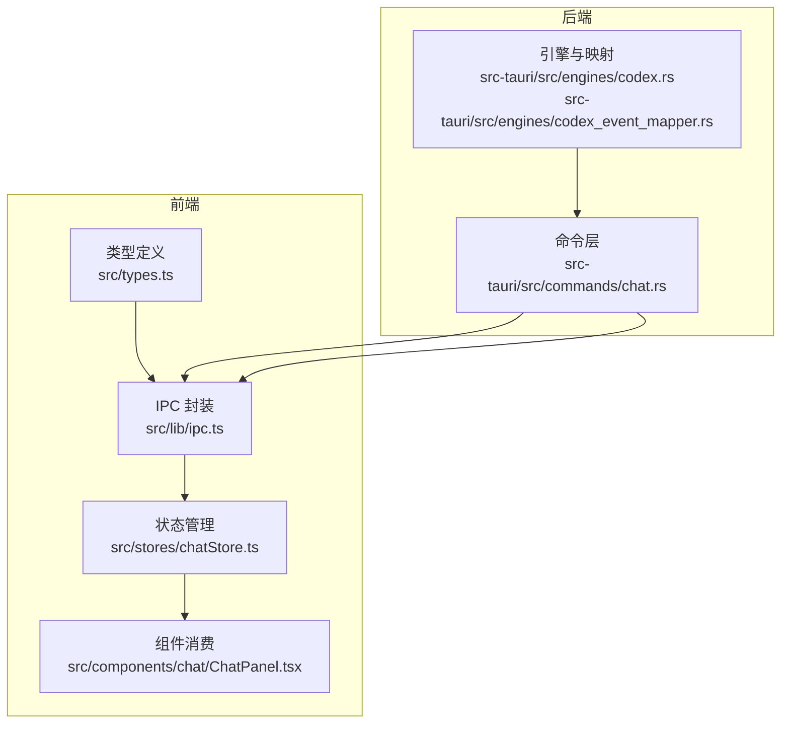
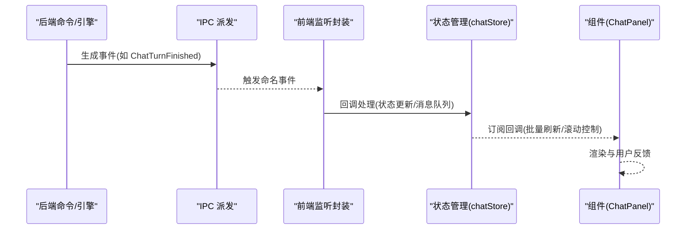
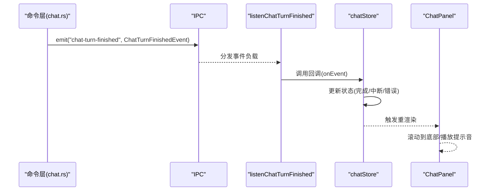
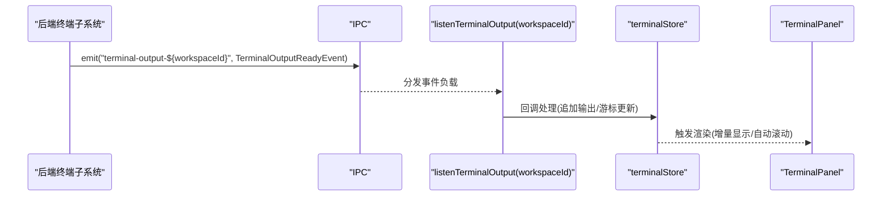
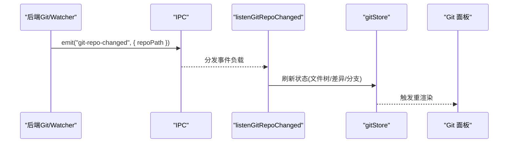
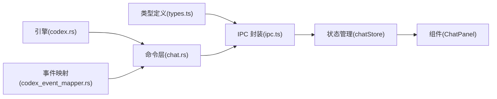

# 事件类型定义

<cite>
**本文引用的文件**
- [src/lib/ipc.ts](file://src/lib/ipc.ts)
- [src/types.ts](file://src/types.ts)
- [src/stores/chatStore.ts](file://src/stores/chatStore.ts)
- [src/components/chat/ChatPanel.tsx](file://src/components/chat/ChatPanel.tsx)
- [src-tauri/src/commands/chat.rs](file://src-tauri/src/commands/chat.rs)
- [src-tauri/src/engines/codex.rs](file://src-tauri/src/engines/codex.rs)
- [src-tauri/src/engines/codex_event_mapper.rs](file://src-tauri/src/engines/codex_event_mapper.rs)
</cite>

## 目录
1. [简介](#简介)
2. [项目结构](#项目结构)
3. [核心组件](#核心组件)
4. [架构总览](#架构总览)
5. [详细组件分析](#详细组件分析)
6. [依赖关系分析](#依赖关系分析)
7. [性能考量](#性能考量)
8. [故障排查指南](#故障排查指南)
9. [结论](#结论)
10. [附录](#附录)

## 简介
本文件系统性梳理 Panes 的事件类型体系，重点覆盖以下核心事件：ThreadUpdatedEvent、GitRepoChangedEvent、ChatTurnFinishedEvent、TerminalOutputReadyEvent 等。文档从数据结构、字段语义、使用场景、设计原则与扩展方法等维度进行说明，并阐述事件与状态管理（Zustand）的交互方式及在组件中的正确用法。

## 项目结构
事件类型主要分布在前端 TypeScript 类型定义与 IPC 监听封装中，同时后端 Rust 命令与引擎侧负责事件的生成与派发。整体采用“类型定义 → IPC 封装 → 状态管理订阅 → 组件消费”的链路。



图表来源
- [src/lib/ipc.ts:656-763](file://src/lib/ipc.ts#L656-L763)
- [src/types.ts:658-711](file://src/types.ts#L658-L711)
- [src/stores/chatStore.ts:1-200](file://src/stores/chatStore.ts#L1-L200)
- [src-tauri/src/commands/chat.rs:3192-3222](file://src-tauri/src/commands/chat.rs#L3192-L3222)
- [src-tauri/src/engines/codex.rs:6686-6720](file://src-tauri/src/engines/codex.rs#L6686-L6720)
- [src-tauri/src/engines/codex_event_mapper.rs:225-259](file://src-tauri/src/engines/codex_event_mapper.rs#L225-L259)

章节来源
- [src/lib/ipc.ts:656-763](file://src/lib/ipc.ts#L656-L763)
- [src/types.ts:658-711](file://src/types.ts#L658-L711)
- [src/stores/chatStore.ts:1-200](file://src/stores/chatStore.ts#L1-L200)

## 核心组件
本节聚焦四大核心事件类型及其配套监听函数，说明其数据结构、字段含义与典型使用场景。

- ThreadUpdatedEvent
  - 定义位置：[src/lib/ipc.ts:666-671](file://src/lib/ipc.ts#L666-L671)
  - 字段含义
    - threadId: 所属线程标识
    - workspaceId: 工作区标识
    - thread?: 可选的线程快照或空值
  - 使用场景：当线程元数据或内容发生更新时，通知订阅者刷新视图或触发同步逻辑。

- GitRepoChangedEvent
  - 定义位置：[src/lib/ipc.ts:656-659](file://src/lib/ipc.ts#L656-L659)
  - 字段含义
    - repoPath: 发生变更的仓库路径
  - 使用场景：Git 面板或相关视图需要响应仓库状态变化，重新加载文件树或差异视图。

- ChatTurnFinishedEvent
  - 定义位置：[src/lib/ipc.ts:673-680](file://src/lib/ipc.ts#L673-L680)
  - 字段含义
    - threadId、workspaceId、engineId、threadTitle：上下文标识
    - status：完成状态枚举，包含 completed、interrupted、error
    - preview：可选的消息预览文本
  - 使用场景：聊天面板在一次对话回合结束后，根据状态决定 UI 行为（如提示音、通知、滚动定位）。

- TerminalOutputReadyEvent
  - 定义位置：[src/types.ts:927-932](file://src/types.ts#L927-L932)
  - 字段含义
    - sessionId：终端会话标识
    - latestSeq：最新输出序列号
    - ts：时间戳
    - bytes：本次输出字节数
  - 使用场景：终端面板按工作区维度监听输出事件，增量渲染新输出并维护滚动与焦点。

章节来源
- [src/lib/ipc.ts:656-680](file://src/lib/ipc.ts#L656-L680)
- [src/types.ts:927-932](file://src/types.ts#L927-L932)

## 架构总览
事件从后端产生，经由 IPC 派发到前端，前端通过统一的监听函数注册回调，状态管理层（Zustand）接收事件并更新应用状态，最终驱动 UI 组件渲染。



图表来源
- [src-tauri/src/commands/chat.rs:3192-3222](file://src-tauri/src/commands/chat.rs#L3192-L3222)
- [src/lib/ipc.ts:688-692](file://src/lib/ipc.ts#L688-L692)
- [src/stores/chatStore.ts:1742-1799](file://src/stores/chatStore.ts#L1742-L1799)
- [src/components/chat/ChatPanel.tsx:3080-3134](file://src/components/chat/ChatPanel.tsx#L3080-L3134)

## 详细组件分析

### ChatTurnFinishedEvent 流程
该事件用于标记一次聊天回合的结束，前端监听后可据此更新 UI 状态与通知策略。



图表来源
- [src-tauri/src/commands/chat.rs:3192-3222](file://src-tauri/src/commands/chat.rs#L3192-L3222)
- [src/lib/ipc.ts:688-692](file://src/lib/ipc.ts#L688-L692)
- [src/stores/chatStore.ts:1742-1799](file://src/stores/chatStore.ts#L1742-L1799)
- [src/components/chat/ChatPanel.tsx:3080-3134](file://src/components/chat/ChatPanel.tsx#L3080-L3134)

章节来源
- [src-tauri/src/commands/chat.rs:3192-3222](file://src-tauri/src/commands/chat.rs#L3192-L3222)
- [src/lib/ipc.ts:688-692](file://src/lib/ipc.ts#L688-L692)
- [src/stores/chatStore.ts:1742-1799](file://src/stores/chatStore.ts#L1742-L1799)
- [src/components/chat/ChatPanel.tsx:3080-3134](file://src/components/chat/ChatPanel.tsx#L3080-L3134)

### 终端输出事件流
终端输出事件以工作区维度命名，前端按工作区订阅，后端在输出可用时触发。



图表来源
- [src/lib/ipc.ts:709-717](file://src/lib/ipc.ts#L709-L717)
- [src/types.ts:927-932](file://src/types.ts#L927-L932)

章节来源
- [src/lib/ipc.ts:709-717](file://src/lib/ipc.ts#L709-L717)
- [src/types.ts:927-932](file://src/types.ts#L927-L932)

### 线程更新事件与状态机
线程更新事件用于通知前端线程元数据或内容的变化，配合状态机转换控制 UI 行为。

```mermaid
flowchart TD
Start(["收到事件"]) --> Type{"事件类型"}
Type --> |ThreadUpdated| Apply["应用线程更新"]
Type --> |UsageLimitsUpdated| UpdateLimits["更新用量限制"]
Type --> |ApprovalRequested| SetAwait["设置等待审批状态"]
Type --> |ApprovalResolved| Resume["恢复流式状态"]
Type --> |Error(不可恢复)| SetError["设置错误状态"]
Type --> |TurnCompleted| Complete["根据状态切换完成/中断/错误"]
Type --> |TurnStarted/可见内容| Streaming["进入流式状态"]
Apply --> Render["触发渲染"]
UpdateLimits --> Render
SetAwait --> Render
Resume --> Render
SetError --> Render
Complete --> Render
Streaming --> Render
Render --> End(["结束"])
```

图表来源
- [src/lib/ipc.ts:666-671](file://src/lib/ipc.ts#L666-L671)
- [src/types.ts:1217-1228](file://src/types.ts#L1217-L1228)
- [src/stores/chatStore.ts:118-155](file://src/stores/chatStore.ts#L118-L155)

章节来源
- [src/lib/ipc.ts:666-671](file://src/lib/ipc.ts#L666-L671)
- [src/types.ts:1217-1228](file://src/types.ts#L1217-L1228)
- [src/stores/chatStore.ts:118-155](file://src/stores/chatStore.ts#L118-L155)

### Git 仓库变更事件
Git 仓库变更事件用于通知前端仓库状态变化，便于刷新相关视图。



图表来源
- [src/lib/ipc.ts:661-665](file://src/lib/ipc.ts#L661-L665)

章节来源
- [src/lib/ipc.ts:656-665](file://src/lib/ipc.ts#L656-L665)

## 依赖关系分析
事件类型与状态管理之间的耦合度低，通过统一的 IPC 监听接口解耦。前端状态管理对事件进行聚合与归并，再向 UI 层推送最小化更新。



图表来源
- [src/types.ts:658-711](file://src/types.ts#L658-L711)
- [src/lib/ipc.ts:656-763](file://src/lib/ipc.ts#L656-L763)
- [src/stores/chatStore.ts:1-200](file://src/stores/chatStore.ts#L1-L200)
- [src-tauri/src/commands/chat.rs:3192-3222](file://src-tauri/src/commands/chat.rs#L3192-L3222)
- [src-tauri/src/engines/codex.rs:6686-6720](file://src-tauri/src/engines/codex.rs#L6686-L6720)
- [src-tauri/src/engines/codex_event_mapper.rs:225-259](file://src-tauri/src/engines/codex_event_mapper.rs#L225-L259)

章节来源
- [src/types.ts:658-711](file://src/types.ts#L658-L711)
- [src/lib/ipc.ts:656-763](file://src/lib/ipc.ts#L656-L763)
- [src/stores/chatStore.ts:1-200](file://src/stores/chatStore.ts#L1-L200)
- [src-tauri/src/commands/chat.rs:3192-3222](file://src-tauri/src/commands/chat.rs#L3192-L3222)
- [src-tauri/src/engines/codex.rs:6686-6720](file://src-tauri/src/engines/codex.rs#L6686-L6720)
- [src-tauri/src/engines/codex_event_mapper.rs:225-259](file://src-tauri/src/engines/codex_event_mapper.rs#L225-L259)

## 性能考量
- 事件批处理与合并
  - 文本增量合并：连续的文本/思考/动作输出会被合并，减少渲染次数。
  - 事件队列与定时刷新：超过阈值或窗口到期后批量刷新，降低抖动。
- 背景监听与资源回收
  - 当线程仍在流式但用户切换页面时，保留轻量监听以确保状态正确回填。
- 终端输出优化
  - 按工作区维度订阅，避免全局广播带来的冗余处理。
  - 输出事件携带字节计数与时序信息，便于终端面板做节流与回放。

章节来源
- [src/stores/chatStore.ts:231-291](file://src/stores/chatStore.ts#L231-L291)
- [src/stores/chatStore.ts:1732-1740](file://src/stores/chatStore.ts#L1732-L1740)
- [src/stores/chatStore.ts:1558-1578](file://src/stores/chatStore.ts#L1558-L1578)
- [src/lib/ipc.ts:709-717](file://src/lib/ipc.ts#L709-L717)

## 故障排查指南
- 事件未到达 UI
  - 检查是否正确注册监听：确认调用对应 listen 函数且未提前取消。
  - 检查工作区维度命名：终端事件需按 workspaceId 订阅。
- 状态未更新
  - 确认事件类型被状态机识别并转换为状态：例如 ApprovalRequested/Resolved、TurnCompleted 等。
  - 查看批处理与合并逻辑是否导致延迟或丢失。
- 后端未发出事件
  - 检查命令层是否正确 emit 对应事件名。
  - 对于引擎事件，确认事件映射与过滤逻辑。

章节来源
- [src/lib/ipc.ts:688-692](file://src/lib/ipc.ts#L688-L692)
- [src-tauri/src/commands/chat.rs:3192-3222](file://src-tauri/src/commands/chat.rs#L3192-L3222)
- [src/stores/chatStore.ts:118-155](file://src/stores/chatStore.ts#L118-L155)

## 结论
Panes 的事件系统以清晰的类型定义为基础，通过 IPC 实现前后端解耦，结合状态管理的批处理与状态机转换，实现了稳定高效的 UI 更新。核心事件（线程更新、Git 变更、聊天回合结束、终端输出）覆盖了主要业务场景，具备良好的扩展性与可维护性。

## 附录

### 设计原则与命名规范
- 命名风格
  - 事件类型采用名词短语或动宾结构，如 ThreadUpdated、ChatTurnFinished、TerminalOutputReady。
  - 前端监听函数以 listen 前缀命名，如 listenThreadUpdated、listenChatTurnFinished、listenTerminalOutput。
- 数据结构
  - 事件对象尽量包含上下文标识（threadId、workspaceId 等），便于组件快速定位与联动。
  - 对高频事件（如文本/输出）支持增量合并，降低渲染压力。
- 扩展方法
  - 新增事件时，先在类型定义中声明接口，再在 IPC 中添加监听函数与派发点，最后在状态管理中接入状态机转换与 UI 消费。

章节来源
- [src/types.ts:658-711](file://src/types.ts#L658-L711)
- [src/lib/ipc.ts:656-763](file://src/lib/ipc.ts#L656-L763)
- [src/stores/chatStore.ts:118-155](file://src/stores/chatStore.ts#L118-L155)