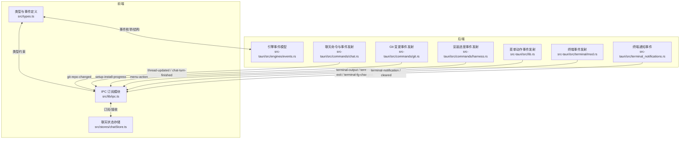
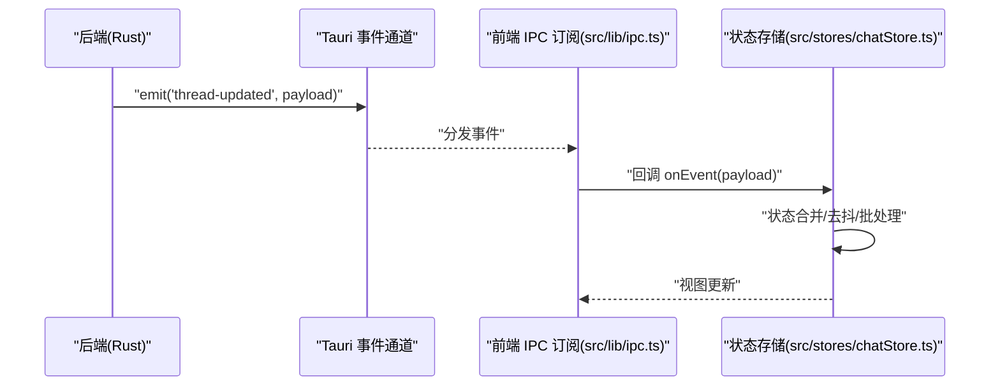
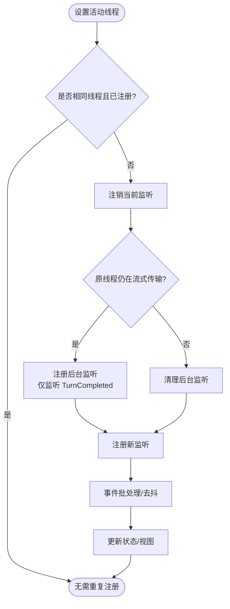
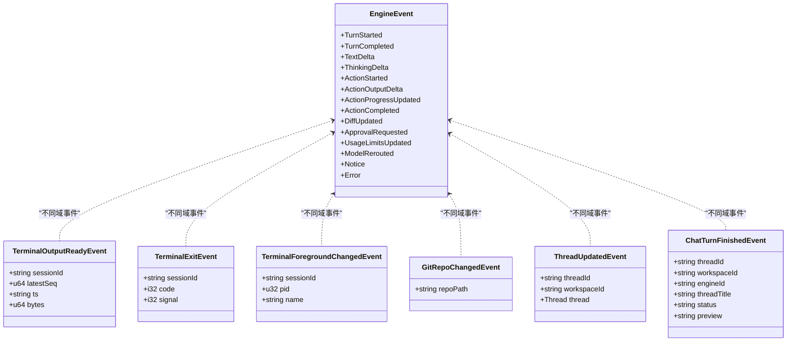
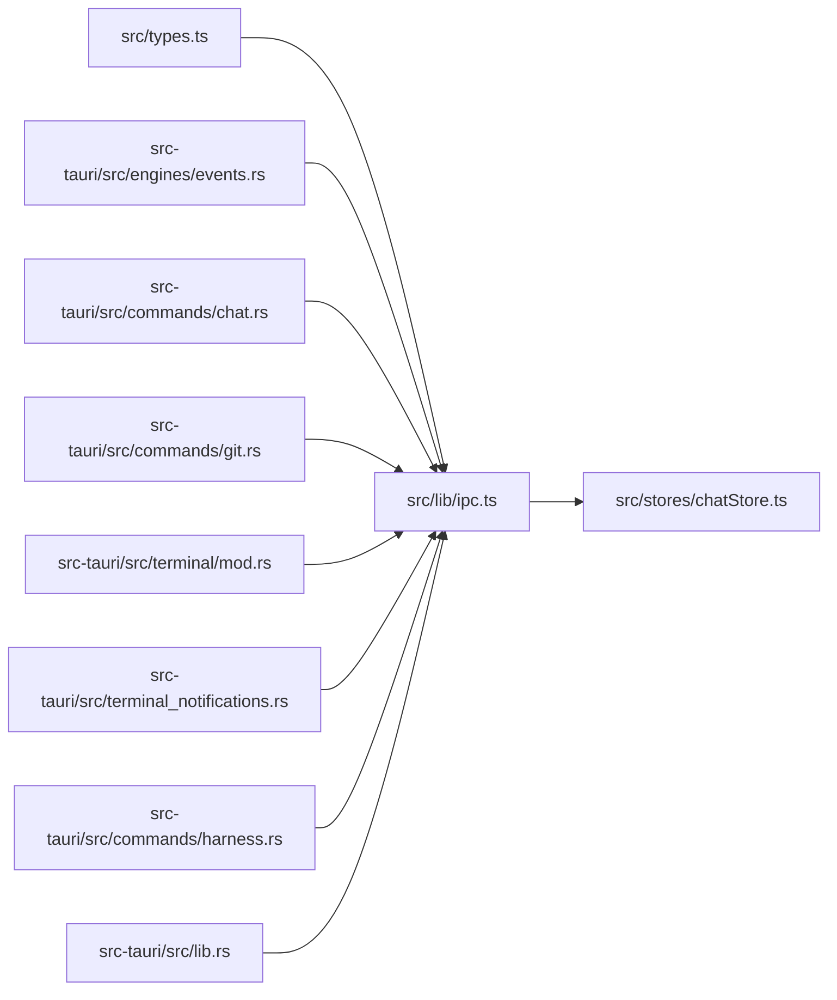

# 事件系统

<cite>
**本文引用的文件**
- [src/lib/ipc.ts](file://src/lib/ipc.ts)
- [src/stores/chatStore.ts](file://src/stores/chatStore.ts)
- [src/types.ts](file://src/types.ts)
- [src-tauri/src/engines/events.rs](file://src-tauri/src/engines/events.rs)
- [src-tauri/src/terminal/mod.rs](file://src-tauri/src/terminal/mod.rs)
- [src-tauri/src/terminal_notifications.rs](file://src-tauri/src/terminal_notifications.rs)
- [src-tauri/src/commands/chat.rs](file://src-tauri/src/commands/chat.rs)
- [src-tauri/src/commands/git.rs](file://src-tauri/src/commands/git.rs)
- [src-tauri/src/commands/harness.rs](file://src-tauri/src/commands/harness.rs)
- [src-tauri/src/lib.rs](file://src-tauri/src/lib.rs)
</cite>

## 目录
1. [简介](#简介)
2. [项目结构](#项目结构)
3. [核心组件](#核心组件)
4. [架构总览](#架构总览)
5. [详细组件分析](#详细组件分析)
6. [依赖关系分析](#依赖关系分析)
7. [性能考量](#性能考量)
8. [故障排查指南](#故障排查指南)
9. [结论](#结论)

## 简介
本文件系统性梳理 Panes 的事件驱动架构，覆盖前端事件订阅与后端事件发射的完整链路，重点说明以下方面：
- 事件类型定义与数据结构
- 事件处理器注册与生命周期管理
- 各类事件（如 thread-updated、git-repo-changed、terminal-output 等）的触发条件与传播路径
- 订阅模式、后台监听与内存泄漏防护策略
- 调试方法、性能监控与常见问题排查

## 项目结构
事件系统横跨前端 TypeScript 与后端 Rust 两部分：
- 前端通过统一的 IPC 模块进行事件订阅与命令调用，暴露若干 listenXxx 函数用于订阅特定事件。
- 后端在多个子系统中通过 Tauri 的 app.emit 发射事件，前端通过对应通道接收并更新状态。

**图表来源**
- [src/lib/ipc.ts:629-792](file://src/lib/ipc.ts#L629-L792)
- [src/stores/chatStore.ts:1-200](file://src/stores/chatStore.ts#L1-L200)
- [src-tauri/src/engines/events.rs:113-177](file://src-tauri/src/engines/events.rs#L113-L177)
- [src-tauri/src/terminal/mod.rs:288-311](file://src-tauri/src/terminal/mod.rs#L288-L311)
- [src-tauri/src/terminal_notifications.rs:483-500](file://src-tauri/src/terminal_notifications.rs#L483-L500)
- [src-tauri/src/commands/chat.rs:2077](file://src-tauri/src/commands/chat.rs#L2077)
- [src-tauri/src/commands/git.rs:341](file://src-tauri/src/commands/git.rs#L341)
- [src-tauri/src/commands/harness.rs:297](file://src-tauri/src/commands/harness.rs#L297)
- [src-tauri/src/lib.rs:173](file://src-tauri/src/lib.rs#L173)

**章节来源**
- [src/lib/ipc.ts:629-792](file://src/lib/ipc.ts#L629-L792)
- [src/stores/chatStore.ts:1-200](file://src/stores/chatStore.ts#L1-L200)
- [src-tauri/src/engines/events.rs:113-177](file://src-tauri/src/engines/events.rs#L113-L177)
- [src-tauri/src/terminal/mod.rs:288-311](file://src-tauri/src/terminal/mod.rs#L288-L311)
- [src-tauri/src/terminal_notifications.rs:483-500](file://src-tauri/src/terminal_notifications.rs#L483-L500)
- [src-tauri/src/commands/chat.rs:2077](file://src-tauri/src/commands/chat.rs#L2077)
- [src-tauri/src/commands/git.rs:341](file://src-tauri/src/commands/git.rs#L341)
- [src-tauri/src/commands/harness.rs:297](file://src-tauri/src/commands/harness.rs#L297)
- [src-tauri/src/lib.rs:173](file://src-tauri/src/lib.rs#L173)

## 核心组件
- 前端事件订阅与类型
  - 统一的事件订阅入口位于 IPC 模块，提供多种 listenXxx 方法，分别订阅线程流事件、Git 变更、终端输出、安装进度等。
  - 事件类型在 types.ts 中以接口形式定义，确保前后端契约一致。
- 后端事件发射
  - 引擎事件模型定义了聊天/工具执行过程中的各类事件（如 TurnStarted、TextDelta、ActionCompleted 等），由命令层在运行时发射。
  - 终端子系统负责将输出、退出、前台进程变化等事件按工作区维度广播。
  - 其他子系统（Git、安装流程、菜单）也通过 app.emit 发布各自事件。
- 状态与生命周期
  - 聊天状态存储负责线程事件的批量合并与去抖，以及后台监听的清理，避免切换线程时丢失事件并防止内存泄漏。

**章节来源**
- [src/lib/ipc.ts:629-792](file://src/lib/ipc.ts#L629-L792)
- [src/types.ts:650-655](file://src/types.ts#L650-L655)
- [src-tauri/src/engines/events.rs:113-177](file://src-tauri/src/engines/events.rs#L113-L177)
- [src-tauri/src/terminal/mod.rs:1856-1896](file://src-tauri/src/terminal/mod.rs#L1856-L1896)
- [src-tauri/src/commands/chat.rs:2077](file://src-tauri/src/commands/chat.rs#L2077)
- [src/stores/chatStore.ts:64-82](file://src/stores/chatStore.ts#L64-L82)

## 架构总览
事件从后端产生，经 Tauri 通道到达前端，前端根据订阅者进行处理与状态更新。下图展示典型事件流：

**图表来源**
- [src-tauri/src/commands/chat.rs:2077](file://src-tauri/src/commands/chat.rs#L2077)
- [src/lib/ipc.ts:661-665](file://src/lib/ipc.ts#L661-L665)
- [src/stores/chatStore.ts:1542-1684](file://src/stores/chatStore.ts#L1542-L1684)

## 详细组件分析

### 事件类型与数据结构
- 引擎事件（EngineEvent）
  - 定义于后端引擎事件模型，涵盖对话轮次开始/完成、文本增量、思考内容增量、动作执行、差异更新、审批请求、用量限制、错误等。
  - 前端通过 listenThreadEvents 接收流式事件，类型在 types.ts 中映射为 StreamEvent。
- 终端事件
  - 输出就绪：包含会话 ID、最新序列号、时间戳、字节数。
  - 退出：包含退出码与信号。
  - 前台进程变化：包含 PID 与名称。
- Git 事件
  - Git 仓库变更事件携带仓库路径。
- 安装进度事件
  - 安装流程事件，用于 UI 进度反馈。
- 菜单动作事件
  - 菜单点击事件，携带动作标识。

**章节来源**
- [src-tauri/src/engines/events.rs:113-177](file://src-tauri/src/engines/events.rs#L113-L177)
- [src/types.ts:650-655](file://src/types.ts#L650-L655)
- [src-tauri/src/terminal/mod.rs:288-311](file://src-tauri/src/terminal/mod.rs#L288-L311)
- [src/lib/ipc.ts:636-644](file://src/lib/ipc.ts#L636-L644)
- [src/lib/ipc.ts:698-702](file://src/lib/ipc.ts#L698-L702)
- [src-tauri/src/lib.rs:173](file://src-tauri/src/lib.rs#L173)

### 事件处理器注册与生命周期
- 注册方式
  - 前端通过 ipc.listenXxx 系列函数订阅事件，返回取消函数以便在组件卸载或切换时释放资源。
- 生命周期管理
  - 切换活动线程时，先注销当前监听；若原线程仍在流式传输，则建立轻量后台监听，仅关注 TurnCompleted，保证用户切回时状态正确。
  - 使用 Map 记录后台监听句柄，并在 TurnCompleted 或取消时清理，避免悬挂监听导致内存泄漏。
- 批处理与去抖
  - 将短时间内到达的流式事件批量合并，设定窗口阈值与刷新阈值，降低渲染压力并提升交互流畅度。

**图表来源**
- [src/stores/chatStore.ts:1542-1580](file://src/stores/chatStore.ts#L1542-L1580)
- [src/stores/chatStore.ts:1649-1684](file://src/stores/chatStore.ts#L1649-L1684)

**章节来源**
- [src/stores/chatStore.ts:64-82](file://src/stores/chatStore.ts#L64-L82)
- [src/stores/chatStore.ts:1542-1580](file://src/stores/chatStore.ts#L1542-L1580)
- [src/stores/chatStore.ts:1649-1684](file://src/stores/chatStore.ts#L1649-L1684)

### 各类事件详解与触发条件

#### thread-updated
- 触发条件
  - 后端聊天命令在线程元数据或状态发生变更时发射该事件。
- 数据结构
  - 包含线程 ID、工作区 ID、可选线程对象。
- 前端订阅
  - 通过 listenThreadUpdated 订阅，用于 UI 层同步线程信息。

**章节来源**
- [src-tauri/src/commands/chat.rs:2077](file://src-tauri/src/commands/chat.rs#L2077)
- [src/lib/ipc.ts:661-665](file://src/lib/ipc.ts#L661-L665)

#### git-repo-changed
- 触发条件
  - 后端 Git 命令检测到仓库变更后发射。
- 数据结构
  - 包含仓库路径。
- 前端订阅
  - 通过 listenGitRepoChanged 订阅，用于刷新 Git 面板或相关视图。

**章节来源**
- [src-tauri/src/commands/git.rs:341](file://src-tauri/src/commands/git.rs#L341)
- [src/lib/ipc.ts:640-644](file://src/lib/ipc.ts#L640-L644)

#### terminal-output
- 触发条件
  - 终端会话有新的输出可用，按最小发射间隔聚合后发射。
- 数据结构
  - 输出就绪事件包含会话 ID、最新序列号、时间戳、字节数。
- 前端订阅
  - 通过 listenTerminalOutput 订阅，按工作区维度区分事件通道。

**章节来源**
- [src-tauri/src/terminal/mod.rs:1856-1871](file://src-tauri/src/terminal/mod.rs#L1856-L1871)
- [src/lib/ipc.ts:688-696](file://src/lib/ipc.ts#L688-L696)

#### terminal-exit
- 触发条件
  - 终端会话退出后发射。
- 数据结构
  - 包含会话 ID、退出码、信号。
- 前端订阅
  - 通过 listenTerminalExit 订阅。

**章节来源**
- [src-tauri/src/terminal/mod.rs:1873-1881](file://src-tauri/src/terminal/mod.rs#L1873-L1881)
- [src/lib/ipc.ts:704-712](file://src/lib/ipc.ts#L704-L712)

#### terminal-fg-changed
- 触发条件
  - 前台进程检测到变化后发射。
- 数据结构
  - 包含会话 ID、PID、进程名。
- 前端订阅
  - 通过 listenTerminalForegroundChanged 订阅。

**章节来源**
- [src-tauri/src/terminal/mod.rs:1883-1896](file://src-tauri/src/terminal/mod.rs#L1883-L1896)
- [src/lib/ipc.ts:714-722](file://src/lib/ipc.ts#L714-L722)

#### terminal-notification / terminal-notification-cleared
- 触发条件
  - 终端通知发布或清理时发射。
- 数据结构
  - 通知事件包含工作区 ID、会话 ID、标题、正文、来源、时间等。
- 前端订阅
  - 通过 listenTerminalNotification / listenTerminalNotificationCleared 订阅。

**章节来源**
- [src-tauri/src/terminal_notifications.rs:483-500](file://src-tauri/src/terminal_notifications.rs#L483-L500)
- [src/lib/ipc.ts:724-742](file://src/lib/ipc.ts#L724-L742)

#### chat-turn-finished
- 触发条件
  - 后端聊天命令在一轮对话完成后发射。
- 数据结构
  - 包含线程 ID、工作区 ID、引擎 ID、标题、状态（完成/中断/错误）、可选预览。
- 前端订阅
  - 通过 listenChatTurnFinished 订阅。

**章节来源**
- [src-tauri/src/commands/chat.rs:3211](file://src-tauri/src/commands/chat.rs#L3211)
- [src/lib/ipc.ts:667-671](file://src/lib/ipc.ts#L667-L671)

#### setup-install-progress
- 触发条件
  - 安装流程阶段推进时发射。
- 数据结构
  - 进度事件。
- 前端订阅
  - 通过 listenInstallProgress 订阅。

**章节来源**
- [src-tauri/src/commands/harness.rs:297](file://src-tauri/src/commands/harness.rs#L297)
- [src/lib/ipc.ts:698-702](file://src/lib/ipc.ts#L698-L702)

#### menu-action
- 触发条件
  - 菜单项被点击时发射。
- 数据结构
  - 动作字符串。
- 前端订阅
  - 通过 listenMenuAction 订阅。

**章节来源**
- [src-tauri/src/lib.rs:173](file://src-tauri/src/lib.rs#L173)
- [src/lib/ipc.ts:682-686](file://src/lib/ipc.ts#L682-L686)

### 类关系图（事件模型）

**图表来源**
- [src-tauri/src/engines/events.rs:113-177](file://src-tauri/src/engines/events.rs#L113-L177)
- [src-tauri/src/terminal/mod.rs:288-311](file://src-tauri/src/terminal/mod.rs#L288-L311)
- [src/lib/ipc.ts:636-671](file://src/lib/ipc.ts#L636-L671)

## 依赖关系分析
- 前端依赖
  - IPC 模块依赖 @tauri-apps/api 的 listen 与 UnlistenFn，提供事件订阅能力。
  - 聊天状态存储依赖 IPC 提供的线程事件订阅，结合自身批处理逻辑更新 UI。
- 后端依赖
  - 各命令模块依赖 Tauri 的 app.emit 发射事件。
  - 终端模块依赖内部共享缓冲与定时器线程，负责输出聚合与前台进程检测。
- 类型契约
  - types.ts 中的事件接口与后端引擎事件模型保持一致，确保序列化/反序列化安全。

**图表来源**
- [src/lib/ipc.ts:629-792](file://src/lib/ipc.ts#L629-L792)
- [src/stores/chatStore.ts:1-200](file://src/stores/chatStore.ts#L1-L200)
- [src-tauri/src/engines/events.rs:113-177](file://src-tauri/src/engines/events.rs#L113-L177)
- [src-tauri/src/commands/chat.rs:2077](file://src-tauri/src/commands/chat.rs#L2077)
- [src-tauri/src/commands/git.rs:341](file://src-tauri/src/commands/git.rs#L341)
- [src-tauri/src/terminal/mod.rs:1856-1896](file://src-tauri/src/terminal/mod.rs#L1856-L1896)
- [src-tauri/src/terminal_notifications.rs:483-500](file://src-tauri/src/terminal_notifications.rs#L483-L500)
- [src-tauri/src/commands/harness.rs:297](file://src-tauri/src/commands/harness.rs#L297)
- [src-tauri/src/lib.rs:173](file://src-tauri/src/lib.rs#L173)

**章节来源**
- [src/lib/ipc.ts:629-792](file://src/lib/ipc.ts#L629-L792)
- [src/stores/chatStore.ts:1-200](file://src/stores/chatStore.ts#L1-L200)
- [src-tauri/src/engines/events.rs:113-177](file://src-tauri/src/engines/events.rs#L113-L177)
- [src-tauri/src/commands/chat.rs:2077](file://src-tauri/src/commands/chat.rs#L2077)
- [src-tauri/src/commands/git.rs:341](file://src-tauri/src/commands/git.rs#L341)
- [src-tauri/src/terminal/mod.rs:1856-1896](file://src-tauri/src/terminal/mod.rs#L1856-L1896)
- [src-tauri/src/terminal_notifications.rs:483-500](file://src-tauri/src/terminal_notifications.rs#L483-L500)
- [src-tauri/src/commands/harness.rs:297](file://src-tauri/src/commands/harness.rs#L297)
- [src-tauri/src/lib.rs:173](file://src-tauri/src/lib.rs#L173)

## 性能考量
- 终端输出聚合
  - 采用固定最小发射间隔与前台进程检测周期，兼顾实时性与 IPC 开销。
  - 输出事件包含字节计数与时间戳，便于统计与诊断。
- 流式事件批处理
  - 设定批处理窗口与刷新阈值，减少频繁渲染与状态更新带来的抖动。
- 资源回收
  - 切换线程时注销监听并清理后台监听，避免事件堆积与内存泄漏。

**章节来源**
- [src-tauri/src/terminal/mod.rs:639-740](file://src-tauri/src/terminal/mod.rs#L639-L740)
- [src/stores/chatStore.ts:65-66](file://src/stores/chatStore.ts#L65-L66)
- [src/stores/chatStore.ts:1542-1580](file://src/stores/chatStore.ts#L1542-L1580)

## 故障排查指南
- 事件未到达前端
  - 检查后端是否正确调用 app.emit 以及事件名是否匹配前端订阅通道。
  - 确认前端是否在组件卸载前调用了取消函数，避免重复订阅。
- 线程事件丢失
  - 若用户快速切换线程，确认后台监听是否已注册并在 TurnCompleted 时清理。
- 终端事件异常
  - 检查终端输出聚合参数与最小发射间隔配置，确认前台进程检测逻辑是否正常。
- 安装进度不更新
  - 确认安装命令模块是否持续发射进度事件，前端订阅是否正确。

**章节来源**
- [src-tauri/src/commands/chat.rs:2077](file://src-tauri/src/commands/chat.rs#L2077)
- [src-tauri/src/commands/git.rs:341](file://src-tauri/src/commands/git.rs#L341)
- [src-tauri/src/terminal/mod.rs:1856-1896](file://src-tauri/src/terminal/mod.rs#L1856-L1896)
- [src-tauri/src/commands/harness.rs:297](file://src-tauri/src/commands/harness.rs#L297)
- [src/lib/ipc.ts:682-686](file://src/lib/ipc.ts#L682-L686)
- [src/stores/chatStore.ts:1542-1580](file://src/stores/chatStore.ts#L1542-L1580)

## 结论
Panes 的事件系统通过前后端清晰的契约与严格的生命周期管理，实现了稳定高效的异步事件传递。前端以 IPC 为桥梁统一订阅各类事件，后端在各子系统中按需发射，配合批处理与后台监听机制，既保证了用户体验，又有效控制了性能开销与资源占用。建议在扩展新事件时遵循现有命名规范与数据结构约定，确保订阅与发射两端的一致性。