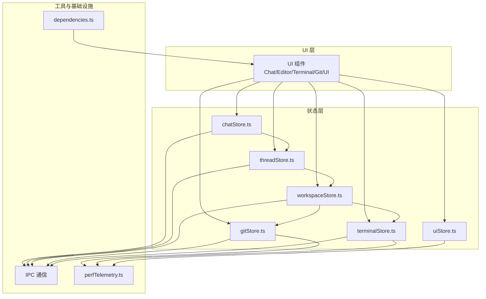
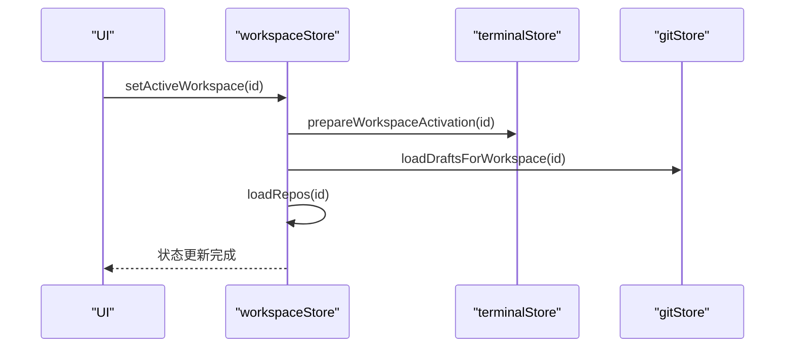
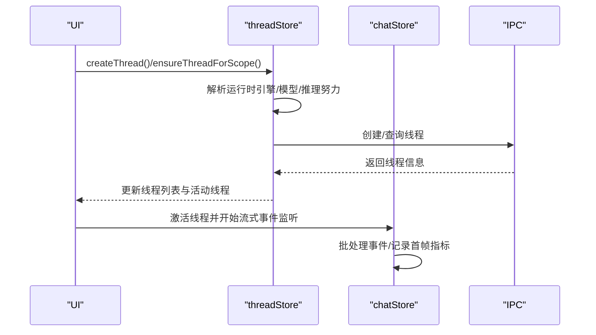
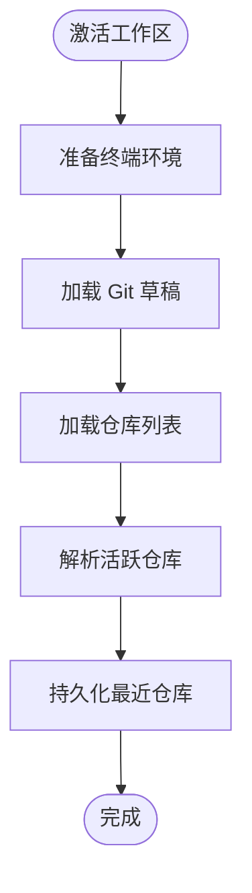
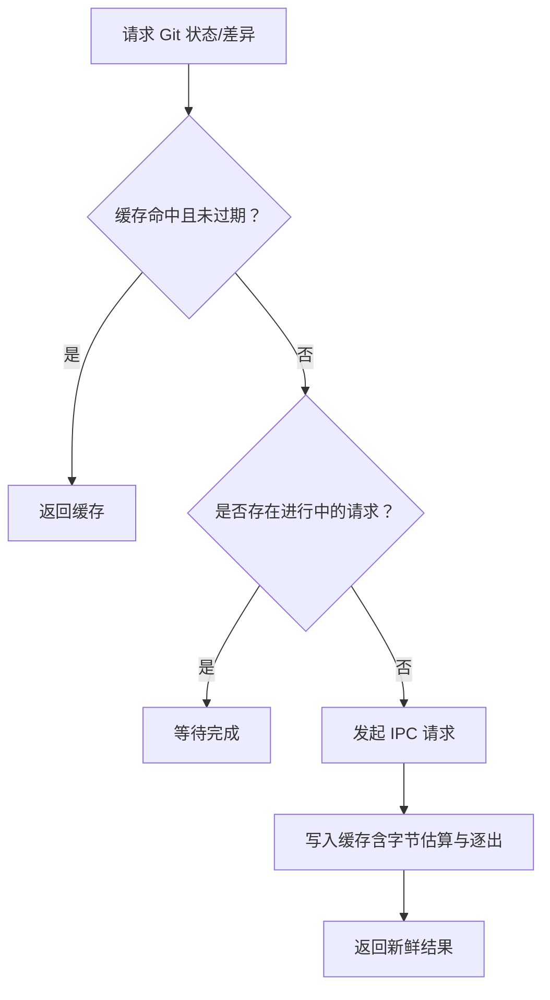
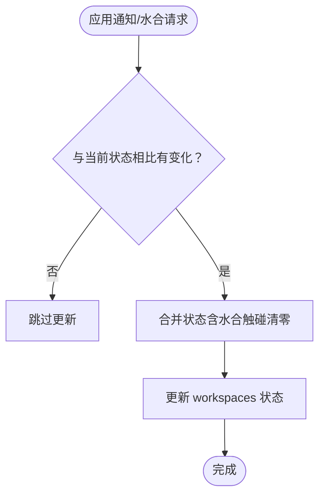
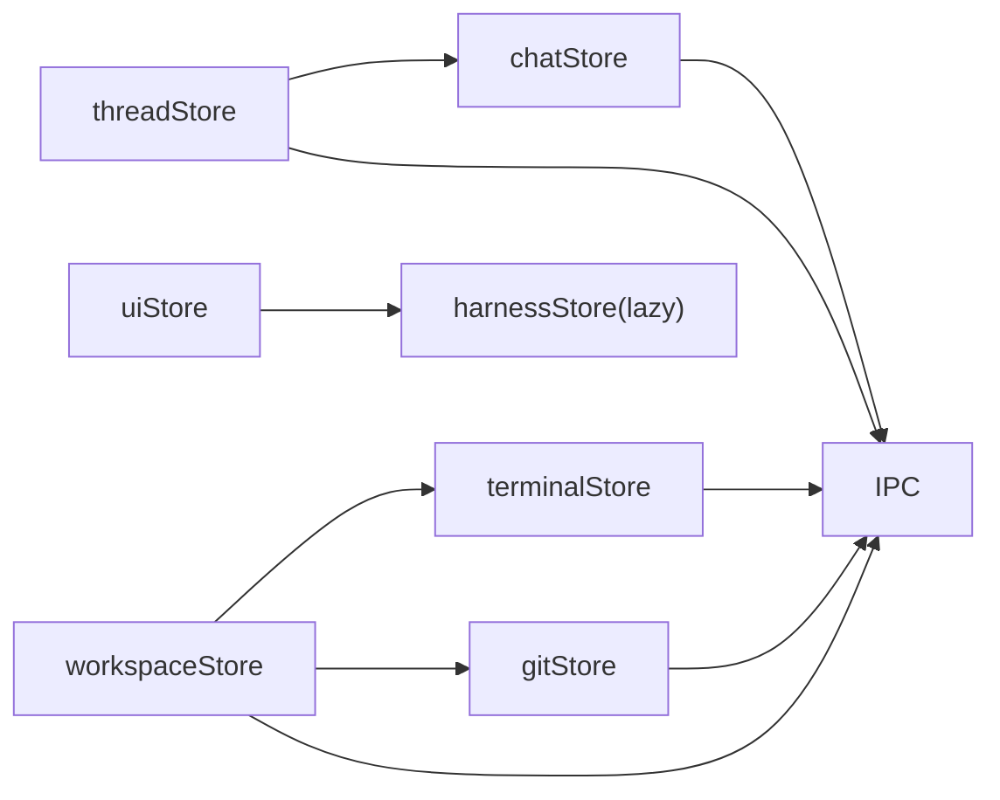

# 依赖追踪

<cite>
**本文引用的文件**
- [dependencies.ts](file://src/lib/dependencies.ts)
- [dependencies.test.ts](file://src/lib/dependencies.test.ts)
- [chatStore.ts](file://src/stores/chatStore.ts)
- [threadStore.ts](file://src/stores/threadStore.ts)
- [workspaceStore.ts](file://src/stores/workspaceStore.ts)
- [gitStore.ts](file://src/stores/gitStore.ts)
- [terminalStore.ts](file://src/stores/terminalStore.ts)
- [uiStore.ts](file://src/stores/uiStore.ts)
- [perfTelemetry.ts](file://src/lib/perfTelemetry.ts)
</cite>

## 目录
1. [引言](#引言)
2. [项目结构](#项目结构)
3. [核心组件](#核心组件)
4. [架构总览](#架构总览)
5. [详细组件分析](#详细组件分析)
6. [依赖分析](#依赖分析)
7. [性能考量](#性能考量)
8. [故障排查指南](#故障排查指南)
9. [结论](#结论)
10. [附录](#附录)

## 引言
本文件围绕 Panes 的“依赖追踪”体系进行系统化梳理，重点解释以下方面：
- 组件间依赖关系的建立与维护：如何通过跨 Store 的协作实现数据联动（如线程状态驱动聊天面板、工作区变更触发终端准备等）。
- 状态订阅与通知机制：如何在 Store 内部或跨 Store 之间进行状态变更传播与副作用触发。
- 依赖收集算法与变化检测：如何识别并最小化重渲染范围（例如 Git 状态缓存、终端布局树更新）。
- 循环依赖检测与处理：如何避免跨 Store 的相互依赖导致死锁或抖动。
- 内存泄漏防护：如何清理监听器、缓存与定时器，防止资源泄露。
- 调试工具、性能监控与优化建议：如何利用现有指标与工具定位问题并提升性能。
- 跨 Store 协调与数据一致性：如何在多 Store 场景下保持状态一致与行为可预期。

## 项目结构
Panes 使用 Zustand 作为轻量状态管理库，Store 以功能域划分（chat、thread、workspace、git、terminal、ui 等），并通过 IPC 与后端交互。依赖追踪并非传统意义上的“响应式依赖图”，而是通过 Store 之间的显式调用与缓存策略实现“按需刷新”。

图表来源
- [chatStore.ts](file://src/stores/chatStore.ts)
- [threadStore.ts](file://src/stores/threadStore.ts)
- [workspaceStore.ts](file://src/stores/workspaceStore.ts)
- [gitStore.ts](file://src/stores/gitStore.ts)
- [terminalStore.ts](file://src/stores/terminalStore.ts)
- [uiStore.ts](file://src/stores/uiStore.ts)
- [perfTelemetry.ts](file://src/lib/perfTelemetry.ts)
- [dependencies.ts](file://src/lib/dependencies.ts)

章节来源
- [chatStore.ts](file://src/stores/chatStore.ts)
- [threadStore.ts](file://src/stores/threadStore.ts)
- [workspaceStore.ts](file://src/stores/workspaceStore.ts)
- [gitStore.ts](file://src/stores/gitStore.ts)
- [terminalStore.ts](file://src/stores/terminalStore.ts)
- [uiStore.ts](file://src/stores/uiStore.ts)
- [perfTelemetry.ts](file://src/lib/perfTelemetry.ts)
- [dependencies.ts](file://src/lib/dependencies.ts)

## 核心组件
- chatStore：负责聊天线程的消息流、事件批处理与渲染指标记录。
- threadStore：负责线程生命周期、运行时选择与跨 Store 的隐式依赖（引擎、聊天组合器、引导选择）。
- workspaceStore：负责工作区与仓库的加载、激活切换，并在切换时触发终端与 Git 的准备工作。
- gitStore：负责 Git 状态与差异的缓存、并发请求去重、视图刷新节流与性能指标记录。
- terminalStore：负责终端会话、分屏布局树与通知状态的最小化更新。
- uiStore：负责 UI 视图状态与持久化，包含惰性加载与焦点模式快照。
- perfTelemetry：统一的性能指标采集与告警，用于依赖追踪的性能回归监控。
- dependencies：依赖报告的标准化工具，确保跨平台与跨包管理器的兼容性。

章节来源
- [chatStore.ts](file://src/stores/chatStore.ts)
- [threadStore.ts](file://src/stores/threadStore.ts)
- [workspaceStore.ts](file://src/stores/workspaceStore.ts)
- [gitStore.ts](file://src/stores/gitStore.ts)
- [terminalStore.ts](file://src/stores/terminalStore.ts)
- [uiStore.ts](file://src/stores/uiStore.ts)
- [perfTelemetry.ts](file://src/lib/perfTelemetry.ts)
- [dependencies.ts](file://src/lib/dependencies.ts)

## 架构总览
依赖追踪在 Panes 中体现为“跨 Store 的显式依赖链 + 缓存与节流”的组合：
- 显式依赖链：threadStore 在创建/选择线程时读取引擎、聊天组合器与引导选择；workspaceStore 在激活工作区时准备终端与 Git。
- 缓存与节流：gitStore 对状态与差异进行 TTL 与容量控制的缓存，避免重复请求；terminalStore 对布局树与通知状态采用最小化合并策略。
- 性能监控：通过 perfTelemetry 记录关键路径耗时，结合预算阈值进行告警。

图表来源
- [workspaceStore.ts](file://src/stores/workspaceStore.ts)
- [gitStore.ts](file://src/stores/gitStore.ts)
- [terminalStore.ts](file://src/stores/terminalStore.ts)

## 详细组件分析

### 组件 A：线程与聊天依赖链（threadStore → chatStore）
- 依赖关系
  - threadStore 在创建/选择线程时，会根据引擎、聊天组合器与引导选择解析默认运行时，从而影响后续聊天行为。
  - chatStore 在处理流事件时，会根据事件类型更新状态并记录性能指标。
- 变化检测与最小化重渲染
  - chatStore 通过事件批处理与延迟队列减少频繁渲染；使用“可见内容”判断决定是否记录首帧指标。
- 循环依赖与防护
  - 该链路为单向依赖（threadStore → chatStore），未见反向依赖，避免循环。
- 调试与监控
  - 使用 perfTelemetry 记录聊天首帧与渲染耗时，便于定位卡顿。

图表来源
- [threadStore.ts](file://src/stores/threadStore.ts)
- [chatStore.ts](file://src/stores/chatStore.ts)

章节来源
- [threadStore.ts](file://src/stores/threadStore.ts)
- [chatStore.ts](file://src/stores/chatStore.ts)
- [perfTelemetry.ts](file://src/lib/perfTelemetry.ts)

### 组件 B：工作区切换与跨 Store 协调（workspaceStore → terminalStore/Git）
- 依赖关系
  - workspaceStore 在激活工作区时，会调用 terminalStore.prepareWorkspaceActivation 并加载 Git 草稿。
  - 切换仓库时，会持久化最近仓库选择并在必要时回退到可用仓库。
- 变化检测与最小化重渲染
  - 通过序列号与活跃仓库校验，避免过期请求覆盖最新状态。
- 循环依赖与防护
  - 该链路为单向（workspaceStore → terminalStore/Git），无反向依赖。
- 调试与监控
  - 使用 perfTelemetry 记录 Git 刷新耗时，结合缓存命中率评估效果。

图表来源
- [workspaceStore.ts](file://src/stores/workspaceStore.ts)
- [gitStore.ts](file://src/stores/gitStore.ts)
- [terminalStore.ts](file://src/stores/terminalStore.ts)

章节来源
- [workspaceStore.ts](file://src/stores/workspaceStore.ts)
- [gitStore.ts](file://src/stores/gitStore.ts)
- [terminalStore.ts](file://src/stores/terminalStore.ts)

### 组件 C：Git 状态与差异缓存（gitStore）
- 依赖关系
  - gitStore 内部维护状态与差异的 TTL 缓存，通过修订号与键空间隔离避免脏读。
  - 针对“活跃视图”设置最小刷新间隔，降低频繁刷新带来的抖动。
- 变化检测与最小化重渲染
  - 通过缓存条目字节估算与逐出策略，维持内存上限；对同一仓库的多次请求进行去重。
- 循环依赖与防护
  - 仅内部缓存，不直接依赖其他 Store，天然避免循环。
- 调试与监控
  - 记录刷新耗时与失败率，支持按仓库维度分析性能。

图表来源
- [gitStore.ts](file://src/stores/gitStore.ts)

章节来源
- [gitStore.ts](file://src/stores/gitStore.ts)
- [perfTelemetry.ts](file://src/lib/perfTelemetry.ts)

### 组件 D：终端布局树与通知状态（terminalStore）
- 依赖关系
  - terminalStore 维护分屏布局树与会话元信息，提供会话 ID 收集、叶子替换与删除等操作。
  - 通知状态采用“水合（hydrate）+ 触碰标记”的策略，最小化状态变更。
- 变化检测与最小化重渲染
  - 通过“水合触碰集合”与请求 ID 对比，仅在状态真正变化时更新。
- 循环依赖与防护
  - 逻辑集中在 Store 内部，不直接依赖外部 Store，避免循环。
- 调试与监控
  - 结合 perfTelemetry 与日志，定位通知水合与触碰变更的异常。

图表来源
- [terminalStore.ts](file://src/stores/terminalStore.ts)

章节来源
- [terminalStore.ts](file://src/stores/terminalStore.ts)

### 组件 E：UI 状态与惰性加载（uiStore）
- 依赖关系
  - uiStore 负责侧边栏、Git 面板、资源管理器等 UI 状态，并在切换到“harnesses”视图时惰性加载 harnessStore。
- 变化检测与最小化重渲染
  - 通过本地存储持久化状态，避免每次渲染都重新计算。
- 循环依赖与防护
  - 仅在特定动作触发惰性加载，不形成循环依赖。
- 调试与监控
  - 通过命令面板开关与视图切换行为辅助定位 UI 呈现问题。

章节来源
- [uiStore.ts](file://src/stores/uiStore.ts)

### 组件 F：依赖报告标准化（dependencies）
- 作用
  - 将来自不同来源的依赖报告规范化为统一结构，填充缺失字段并过滤无效项。
- 依赖关系
  - 作为工具函数被 UI 或安装流程消费，保障跨平台显示一致性。
- 循环依赖与防护
  - 工具函数无外部依赖，天然安全。

章节来源
- [dependencies.ts](file://src/lib/dependencies.ts)
- [dependencies.test.ts](file://src/lib/dependencies.test.ts)

## 依赖分析
- 跨 Store 依赖链
  - workspaceStore → terminalStore/Git：工作区激活触发终端与 Git 准备。
  - threadStore → chatStore：线程运行时解析影响聊天行为。
  - uiStore → harnessStore：视图切换触发惰性加载。
- 依赖环与循环依赖
  - 当前实现均为单向依赖，未发现循环依赖迹象。
- 外部依赖与集成点
  - IPC：所有 Store 通过 IPC 与后端交互，是主要的外部依赖。
  - localStorage：uiStore 与 workspaceStore 使用持久化存储，避免重复计算。
- 接口契约
  - 各 Store 通过 create 返回的 set/get 控制状态更新，遵循一致的更新协议。

图表来源
- [workspaceStore.ts](file://src/stores/workspaceStore.ts)
- [gitStore.ts](file://src/stores/gitStore.ts)
- [terminalStore.ts](file://src/stores/terminalStore.ts)
- [threadStore.ts](file://src/stores/threadStore.ts)
- [chatStore.ts](file://src/stores/chatStore.ts)
- [uiStore.ts](file://src/stores/uiStore.ts)

章节来源
- [workspaceStore.ts](file://src/stores/workspaceStore.ts)
- [gitStore.ts](file://src/stores/gitStore.ts)
- [terminalStore.ts](file://src/stores/terminalStore.ts)
- [threadStore.ts](file://src/stores/threadStore.ts)
- [chatStore.ts](file://src/stores/chatStore.ts)
- [uiStore.ts](file://src/stores/uiStore.ts)

## 性能考量
- 缓存与去重
  - gitStore 对状态与差异进行 TTL 与容量控制，避免重复请求与内存膨胀。
- 最小化重渲染
  - chatStore 通过事件批处理与可见内容判断减少渲染次数；terminalStore 通过水合触碰集合最小化状态变更。
- 性能预算与告警
  - perfTelemetry 定义关键指标预算，超过阈值进行冷却后的告警，便于快速定位瓶颈。
- I/O 与 IPC
  - 通过序列号与修订号校验，避免过期请求覆盖最新状态；对活跃视图设置刷新间隔，降低抖动。

章节来源
- [gitStore.ts](file://src/stores/gitStore.ts)
- [chatStore.ts](file://src/stores/chatStore.ts)
- [terminalStore.ts](file://src/stores/terminalStore.ts)
- [perfTelemetry.ts](file://src/lib/perfTelemetry.ts)

## 故障排查指南
- Git 刷新异常
  - 现象：刷新耗时过高或频繁失败。
  - 排查：检查缓存命中率、请求序列号与修订号是否匹配；确认活跃视图刷新间隔配置。
  - 参考
    - [gitStore.ts](file://src/stores/gitStore.ts)
    - [perfTelemetry.ts](file://src/lib/perfTelemetry.ts)
- 终端通知水合异常
  - 现象：通知状态未正确更新或反复闪烁。
  - 排查：核对水合触碰集合与请求 ID 是否一致；确认会话 ID 是否存在于当前会话列表。
  - 参考
    - [terminalStore.ts](file://src/stores/terminalStore.ts)
- 线程/聊天卡顿
  - 现象：首帧渲染时间过长。
  - 排查：查看 perfTelemetry 中的聊天首帧指标；检查事件批处理与可见内容判断逻辑。
  - 参考
    - [chatStore.ts](file://src/stores/chatStore.ts)
    - [perfTelemetry.ts](file://src/lib/perfTelemetry.ts)
- 工作区切换抖动
  - 现象：切换后界面闪烁或状态错乱。
  - 排查：确认序列号与活跃仓库校验是否生效；检查持久化最近仓库逻辑。
  - 参考
    - [workspaceStore.ts](file://src/stores/workspaceStore.ts)

章节来源
- [gitStore.ts](file://src/stores/gitStore.ts)
- [terminalStore.ts](file://src/stores/terminalStore.ts)
- [chatStore.ts](file://src/stores/chatStore.ts)
- [workspaceStore.ts](file://src/stores/workspaceStore.ts)
- [perfTelemetry.ts](file://src/lib/perfTelemetry.ts)

## 结论
Panes 的依赖追踪以“显式依赖链 + 缓存与节流”为核心，通过跨 Store 的协同与严格的变更检测，实现了稳定且高性能的状态流转。在工程实践中，应持续关注缓存命中率、IPC 请求序列与 UI 渲染路径，配合 perfTelemetry 的预算告警，确保系统在复杂场景下的可维护性与可预测性。

## 附录
- 调试工具
  - 浏览器全局对象提供性能快照与最近指标访问，便于前端侧快速诊断。
- 优化建议
  - 对高频变更的 Store 引入更细粒度的局部状态切片，进一步降低合并成本。
  - 在 IPC 层引入请求去重与超时重试策略，增强鲁棒性。
  - 对 UI 呈现路径增加骨架屏或占位符，改善感知性能。

章节来源
- [perfTelemetry.ts](file://src/lib/perfTelemetry.ts)