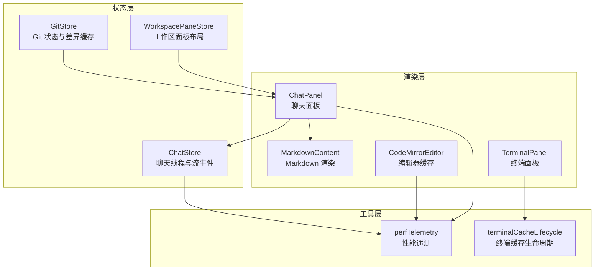
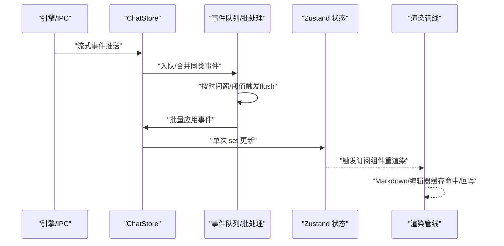
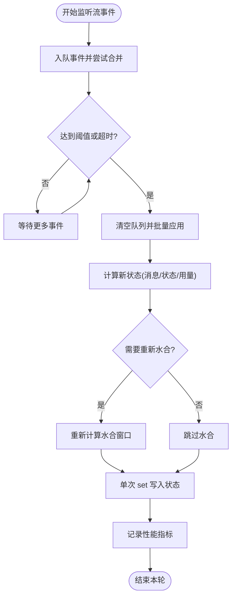
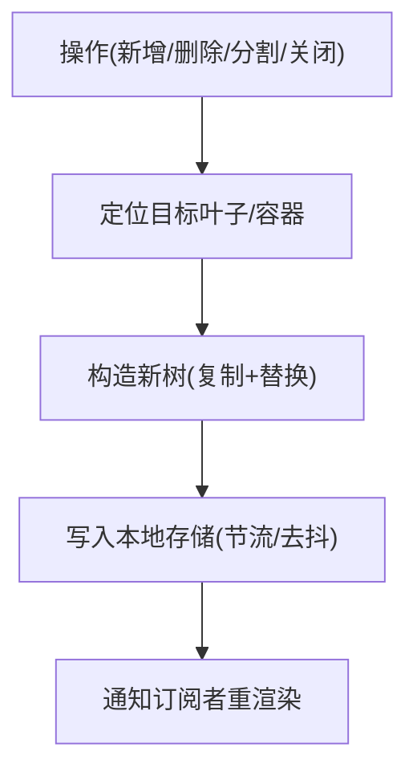
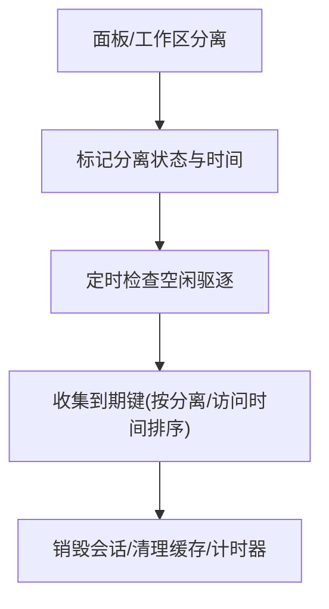
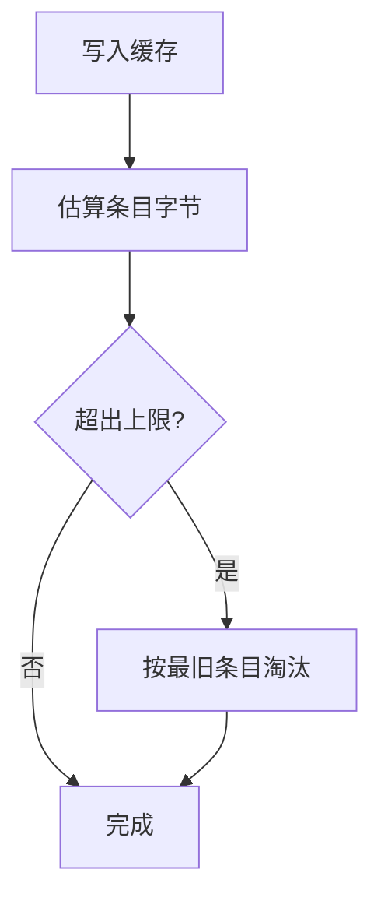
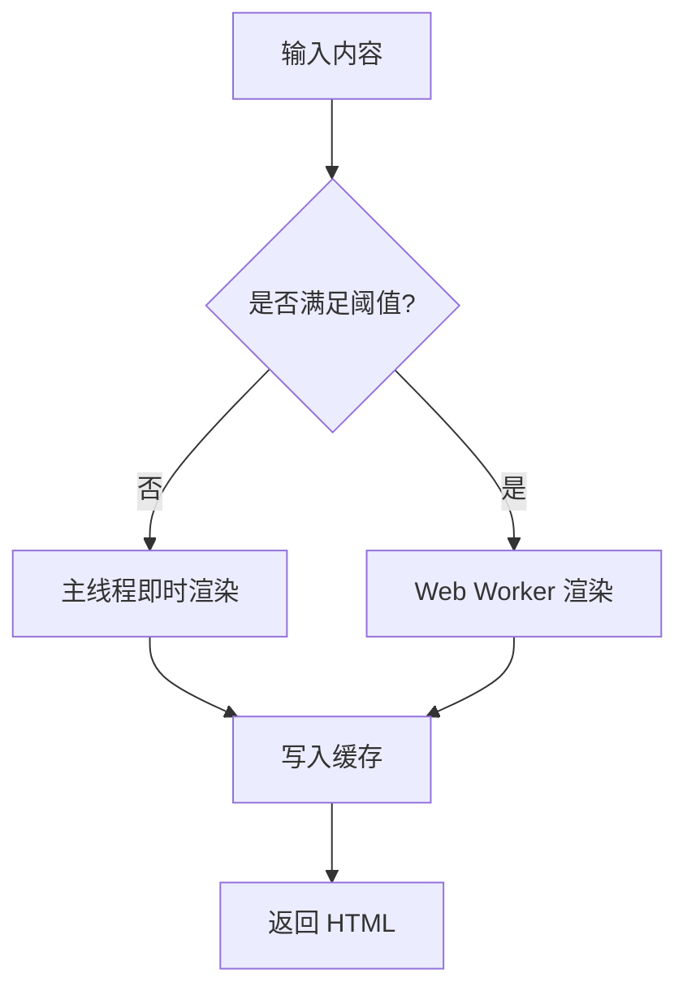
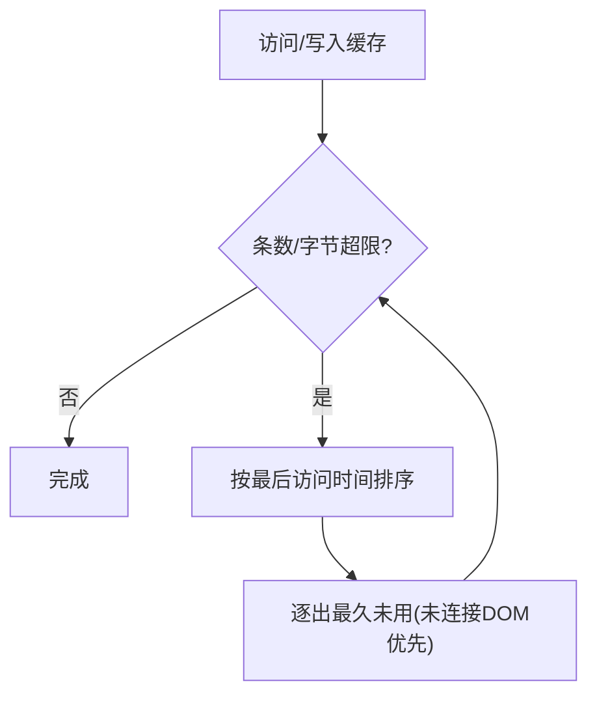
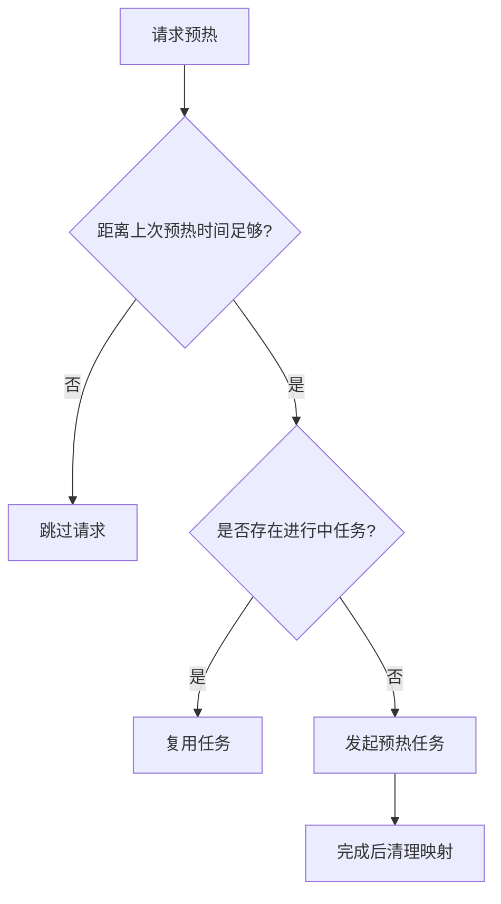
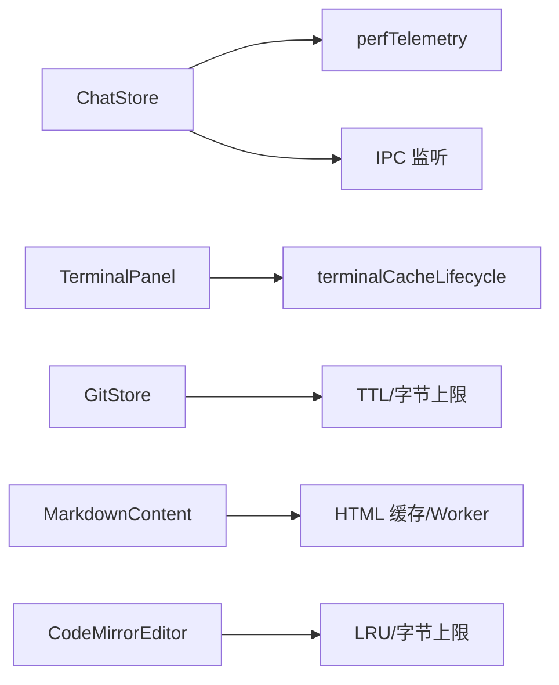

# 性能优化

<cite>
**本文引用的文件**
- [workspacePaneStore.ts](file://src/stores/workspacePaneStore.ts)
- [chatStore.ts](file://src/stores/chatStore.ts)
- [perfTelemetry.ts](file://src/lib/perfTelemetry.ts)
- [terminalCacheLifecycle.ts](file://src/components/terminal/terminalCacheLifecycle.ts)
- [TerminalPanel.tsx](file://src/components/terminal/TerminalPanel.tsx)
- [gitStore.ts](file://src/stores/gitStore.ts)
- [MarkdownContent.tsx](file://src/components/chat/MarkdownContent.tsx)
- [CodeMirrorEditor.tsx](file://src/components/editor/CodeMirrorEditor.tsx)
- [ChatPanel.tsx](file://src/components/chat/ChatPanel.tsx)
</cite>

## 目录
1. [简介](#简介)
2. [项目结构](#项目结构)
3. [核心组件](#核心组件)
4. [架构总览](#架构总览)
5. [详细组件分析](#详细组件分析)
6. [依赖关系分析](#依赖关系分析)
7. [性能考量](#性能考量)
8. [故障排查指南](#故障排查指南)
9. [结论](#结论)
10. [附录](#附录)

## 简介
本文件聚焦于 Panes 的状态传播性能优化，系统梳理状态传播中的性能瓶颈、优化策略与最佳实践。内容覆盖批量更新、防抖与节流、状态序列化与内存管理、垃圾回收优化、性能监控指标与基准测试、状态缓存策略（含懒加载与预取）、以及大规模状态管理的扩展性建议。目标是帮助开发者在高频事件流（如聊天流式输出）与复杂布局状态（工作区面板）中保持流畅体验。

## 项目结构
围绕状态传播与渲染的关键模块如下：
- 状态层：Zustand 存储（聊天、工作区面板、Git、终端等）
- 渲染层：React 组件（聊天面板、Markdown 渲染、编辑器、终端面板）
- 工具层：性能遥测、缓存与淘汰、事件队列与批处理
- IPC 层：与后端/引擎交互，触发状态变更

图示来源
- [workspacePaneStore.ts](file://src/stores/workspacePaneStore.ts)
- [chatStore.ts](file://src/stores/chatStore.ts)
- [perfTelemetry.ts](file://src/lib/perfTelemetry.ts)
- [terminalCacheLifecycle.ts](file://src/components/terminal/terminalCacheLifecycle.ts)
- [TerminalPanel.tsx](file://src/components/terminal/TerminalPanel.tsx)
- [MarkdownContent.tsx](file://src/components/chat/MarkdownContent.tsx)
- [CodeMirrorEditor.tsx](file://src/components/editor/CodeMirrorEditor.tsx)
- [ChatPanel.tsx](file://src/components/chat/ChatPanel.tsx)

章节来源
- [workspacePaneStore.ts](file://src/stores/workspacePaneStore.ts)
- [chatStore.ts](file://src/stores/chatStore.ts)
- [perfTelemetry.ts](file://src/lib/perfTelemetry.ts)
- [terminalCacheLifecycle.ts](file://src/components/terminal/terminalCacheLifecycle.ts)
- [TerminalPanel.tsx](file://src/components/terminal/TerminalPanel.tsx)
- [MarkdownContent.tsx](file://src/components/chat/MarkdownContent.tsx)
- [CodeMirrorEditor.tsx](file://src/components/editor/CodeMirrorEditor.tsx)
- [ChatPanel.tsx](file://src/components/chat/ChatPanel.tsx)

## 核心组件
- 工作区面板状态（WorkspacePaneStore）：负责多面板布局树的增删改查、比例调整、焦点切换与表面激活，采用不可变更新与最小化持久化，避免冗余重绘。
- 聊天状态（ChatStore）：实现流事件的批量合并、防抖/节流刷新、运行时状态推断、水合窗口计算与延迟度量记录。
- 性能遥测（perfTelemetry）：统一记录与统计关键指标，设置预算阈值并发出告警，支持快照查询与清理。
- 终端缓存生命周期（terminalCacheLifecycle + TerminalPanel）：分离/挂起时标记、空闲驱逐、定时清理与销毁，降低资源占用。
- Git 缓存（gitStore）：基于 TTL 与字节上限的 LRU 风格淘汰，控制内存与 IO 压力。
- Markdown 渲染缓存（MarkdownContent）：HTML 缓存与 Web Worker 解耦，阈值触发与占位渲染，减少主线程阻塞。
- 编辑器缓存（CodeMirrorEditor）：LRU 淘汰与字节上限控制，未连接 DOM 的缓存优先淘汰。

章节来源
- [workspacePaneStore.ts](file://src/stores/workspacePaneStore.ts)
- [chatStore.ts](file://src/stores/chatStore.ts)
- [perfTelemetry.ts](file://src/lib/perfTelemetry.ts)
- [terminalCacheLifecycle.ts](file://src/components/terminal/terminalCacheLifecycle.ts)
- [TerminalPanel.tsx](file://src/components/terminal/TerminalPanel.tsx)
- [gitStore.ts](file://src/stores/gitStore.ts)
- [MarkdownContent.tsx](file://src/components/chat/MarkdownContent.tsx)
- [CodeMirrorEditor.tsx](file://src/components/editor/CodeMirrorEditor.tsx)

## 架构总览
下图展示从事件源到状态更新再到渲染的整体流程，重点标注了批量合并、防抖/节流与缓存策略的位置。

图示来源
- [chatStore.ts](file://src/stores/chatStore.ts)
- [perfTelemetry.ts](file://src/lib/perfTelemetry.ts)
- [MarkdownContent.tsx](file://src/components/chat/MarkdownContent.tsx)
- [CodeMirrorEditor.tsx](file://src/components/editor/CodeMirrorEditor.tsx)

## 详细组件分析

### 聊天状态传播与批处理
- 批量合并：同类事件（文本增量、思考增量、动作输出、进度、差异、用量限制）在入队时进行合并，减少重复计算与渲染。
- 防抖/节流：使用时间窗与阈值控制 flush 触发频率，避免高频事件导致的频繁重算与渲染。
- 运行时状态推断：根据事件类型动态更新状态（如等待审批、完成、错误），并在 Turn 完成时清理元数据。
- 水合窗口：在消息长度变化或用量更新时重新计算水合范围，避免一次性渲染过多历史消息。
- 指标记录：记录首次 Shell 提交、首次可见内容、首次文本到达、流式刷新耗时、事件速率等，用于性能监控与回归预警。

图示来源
- [chatStore.ts](file://src/stores/chatStore.ts)
- [perfTelemetry.ts](file://src/lib/perfTelemetry.ts)

章节来源
- [chatStore.ts](file://src/stores/chatStore.ts)
- [perfTelemetry.ts](file://src/lib/perfTelemetry.ts)

### 工作区面板状态传播
- 不可变更新：所有布局修改通过复制节点与替换子树的方式进行，确保状态一致性与可追踪性。
- 最小化持久化：仅在必要时写入本地存储，避免频繁 IO；读取时进行安全校验与修复。
- 快速定位：通过查找/替换/删除叶子节点的递归函数快速定位目标容器，减少遍历成本。
- 比例与表面：支持按容器 ID 更新比例，按表面类型激活/切换，避免不必要的重排。

图示来源
- [workspacePaneStore.ts](file://src/stores/workspacePaneStore.ts)

章节来源
- [workspacePaneStore.ts](file://src/stores/workspacePaneStore.ts)

### 终端缓存生命周期与内存回收
- 分离/挂起标记：工作区切换与面板分离分别标记是否需要回放，避免输出丢失。
- 空闲驱逐：基于“分离时间 + 空闲阈值”的判定，定期收集可回收键并销毁会话、清理计时器与诊断缓存。
- 及时清理：销毁前清除所有定时器与输出队列，防止悬挂回调与内存泄漏。

图示来源
- [terminalCacheLifecycle.ts](file://src/components/terminal/terminalCacheLifecycle.ts)
- [TerminalPanel.tsx](file://src/components/terminal/TerminalPanel.tsx)

章节来源
- [terminalCacheLifecycle.ts](file://src/components/terminal/terminalCacheLifecycle.ts)
- [TerminalPanel.tsx](file://src/components/terminal/TerminalPanel.tsx)

### Git 状态与差异缓存
- TTL 与字节上限：状态与差异缓存均设置 TTL 与条目/字节上限，超过阈值按最旧条目淘汰。
- 字节估算：针对不同字段估算缓存条目大小，保证上限控制的准确性。
- 主动失效：仓库路径变更或包含关系变更时主动失效相关缓存，确保一致性。

图示来源
- [gitStore.ts](file://src/stores/gitStore.ts)

章节来源
- [gitStore.ts](file://src/stores/gitStore.ts)

### Markdown 渲染缓存与 Web Worker
- HTML 缓存：渲染结果按内容键缓存，命中则直接返回，避免重复计算。
- 占位与回写：当内容较大且未流式时，先用占位渲染，完成后回写缓存。
- Worker 解耦：大文本交给 Web Worker 处理，失败时降级回主线程，并终止 Worker 释放资源。

图示来源
- [MarkdownContent.tsx](file://src/components/chat/MarkdownContent.tsx)

章节来源
- [MarkdownContent.tsx](file://src/components/chat/MarkdownContent.tsx)

### 编辑器缓存与 LRU 淘汰
- LRU 淘汰：按最后访问时间排序，优先淘汰未连接 DOM 的缓存条目。
- 字节上限：累计字节数超过阈值时持续淘汰，直至满足条件。
- 销毁释放：删除时调用视图销毁，确保资源回收。

图示来源
- [CodeMirrorEditor.tsx](file://src/components/editor/CodeMirrorEditor.tsx)

章节来源
- [CodeMirrorEditor.tsx](file://src/components/editor/CodeMirrorEditor.tsx)

### 预热与节流（聊天引擎）
- 引擎预热：在短时间内对同一引擎的预热请求进行节流，避免重复初始化带来的抖动。
- 失败容忍：预热失败不影响主流程，仅记录日志并清理进行中任务。

图示来源
- [ChatPanel.tsx](file://src/components/chat/ChatPanel.tsx)

章节来源
- [ChatPanel.tsx](file://src/components/chat/ChatPanel.tsx)

## 依赖关系分析
- ChatStore 依赖 perfTelemetry 记录指标，依赖 IPC 监听线程事件，内部维护事件队列与批处理逻辑。
- 终端面板依赖 terminalCacheLifecycle 进行分离标记与空闲驱逐，配合 TerminalPanel 的销毁与清理。
- GitStore 通过 TTL 与字节上限控制缓存规模，避免内存膨胀。
- MarkdownContent 与 CodeMirrorEditor 分别在渲染与编辑场景下实施缓存与淘汰策略，降低主线程压力。

图示来源
- [chatStore.ts](file://src/stores/chatStore.ts)
- [perfTelemetry.ts](file://src/lib/perfTelemetry.ts)
- [terminalCacheLifecycle.ts](file://src/components/terminal/terminalCacheLifecycle.ts)
- [TerminalPanel.tsx](file://src/components/terminal/TerminalPanel.tsx)
- [gitStore.ts](file://src/stores/gitStore.ts)
- [MarkdownContent.tsx](file://src/components/chat/MarkdownContent.tsx)
- [CodeMirrorEditor.tsx](file://src/components/editor/CodeMirrorEditor.tsx)

章节来源
- [chatStore.ts](file://src/stores/chatStore.ts)
- [perfTelemetry.ts](file://src/lib/perfTelemetry.ts)
- [terminalCacheLifecycle.ts](file://src/components/terminal/terminalCacheLifecycle.ts)
- [TerminalPanel.tsx](file://src/components/terminal/TerminalPanel.tsx)
- [gitStore.ts](file://src/stores/gitStore.ts)
- [MarkdownContent.tsx](file://src/components/chat/MarkdownContent.tsx)
- [CodeMirrorEditor.tsx](file://src/components/editor/CodeMirrorEditor.tsx)

## 性能考量
- 批量更新与最小化渲染
  - ChatStore 使用事件队列与批处理，单次 set 合并多次状态变更，显著降低渲染次数。
  - WorkspacePaneStore 采用不可变更新与最小化持久化，避免不必要 IO。
- 防抖与节流
  - 流事件按时间窗与阈值触发 flush，Turn 完成或达到阈值立即刷新，兼顾实时性与吞吐。
  - ChatPanel 对引擎预热请求进行节流，避免频繁初始化。
- 状态序列化与内存管理
  - 本地存储采用 JSON 序列化，读取时进行安全校验与修复，防止损坏导致崩溃。
  - Git 缓存与编辑器缓存均设置字节上限与条目上限，结合 TTL 与 LRU 淘汰策略。
- 垃圾回收优化
  - 终端面板在销毁时清理所有计时器、输出队列与诊断缓存，避免悬挂回调。
  - MarkdownContent 在 Worker 出错时终止实例并清理回调，防止资源泄漏。
- 性能监控与基准
  - perfTelemetry 提供预算阈值与告警冷却，支持快照统计（均值、P95、最大值）与最近指标查询。
  - 关键指标包括：聊天首帧、流式刷新耗时、事件速率、渲染提交耗时、Markdown Worker 耗时、Git 刷新/差异耗时。
- 缓存策略与懒加载
  - Markdown HTML 缓存与 Worker 解耦，占位渲染提升感知速度。
  - 编辑器缓存按 LRU 与字节上限淘汰，未连接 DOM 的条目优先回收。
  - Git 缓存按 TTL 与字节上限淘汰，主动失效确保一致性。
- 扩展性建议
  - 将高频事件进一步分片与优先级队列化，避免单一通道拥塞。
  - 对大型渲染（如长 Markdown/大文件 diff）引入分块渲染与虚拟滚动。
  - 在多工作区场景下，按需加载与懒初始化面板，减少初始内存占用。

章节来源
- [chatStore.ts](file://src/stores/chatStore.ts)
- [workspacePaneStore.ts](file://src/stores/workspacePaneStore.ts)
- [perfTelemetry.ts](file://src/lib/perfTelemetry.ts)
- [terminalCacheLifecycle.ts](file://src/components/terminal/terminalCacheLifecycle.ts)
- [TerminalPanel.tsx](file://src/components/terminal/TerminalPanel.tsx)
- [gitStore.ts](file://src/stores/gitStore.ts)
- [MarkdownContent.tsx](file://src/components/chat/MarkdownContent.tsx)
- [CodeMirrorEditor.tsx](file://src/components/editor/CodeMirrorEditor.tsx)
- [ChatPanel.tsx](file://src/components/chat/ChatPanel.tsx)

## 故障排查指南
- 聊天流卡顿或掉帧
  - 检查事件速率与批处理阈值，适当增大时间窗或阈值以减少 flush 频率。
  - 关注 perfTelemetry 中的事件速率与流式刷新耗时指标，定位异常峰值。
- 终端面板内存增长
  - 确认分离/挂起标记是否正确，空闲驱逐是否按期执行。
  - 检查销毁流程是否清理计时器与输出队列。
- Git 面板卡顿
  - 查看状态/差异缓存条目数量与字节是否接近上限，必要时缩短 TTL 或减小上限。
  - 确保失效逻辑在仓库路径变更时被触发。
- Markdown 渲染滞后
  - 检查是否启用 Worker 与阈值设置，确认缓存命中率。
  - 若 Worker 报错，确认实例终止与回调清理逻辑是否生效。
- 编辑器卡顿
  - 检查 LRU 排序与字节上限，确认未连接 DOM 的条目优先淘汰。

章节来源
- [perfTelemetry.ts](file://src/lib/perfTelemetry.ts)
- [terminalCacheLifecycle.ts](file://src/components/terminal/terminalCacheLifecycle.ts)
- [TerminalPanel.tsx](file://src/components/terminal/TerminalPanel.tsx)
- [gitStore.ts](file://src/stores/gitStore.ts)
- [MarkdownContent.tsx](file://src/components/chat/MarkdownContent.tsx)
- [CodeMirrorEditor.tsx](file://src/components/editor/CodeMirrorEditor.tsx)

## 结论
通过对事件队列、批处理、缓存与淘汰策略的系统化设计，Panes 在高并发与大数据场景下实现了稳定的状态传播与渲染性能。结合统一的性能遥测与预算阈值，能够及时发现并定位性能问题。未来可在分片队列、分块渲染与按需初始化方面进一步增强扩展性与资源利用率。

## 附录
- 性能指标清单
  - 聊天：首 Shell 提交、首可见内容、首文本到达、流式刷新耗时、事件速率
  - 渲染：Markdown Worker 耗时、渲染提交耗时
  - Git：刷新耗时、文件差异耗时
- 建议的基准测试方法
  - 使用浏览器性能分析工具录制典型操作（发送长消息、打开多个面板、切换工作区、大量文件 diff），对比开启/关闭缓存与批处理的差异。
  - 在不同设备与网络条件下评估指标，确保阈值与策略的普适性。