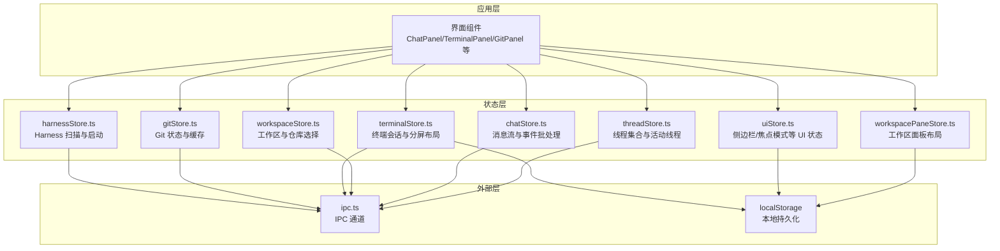
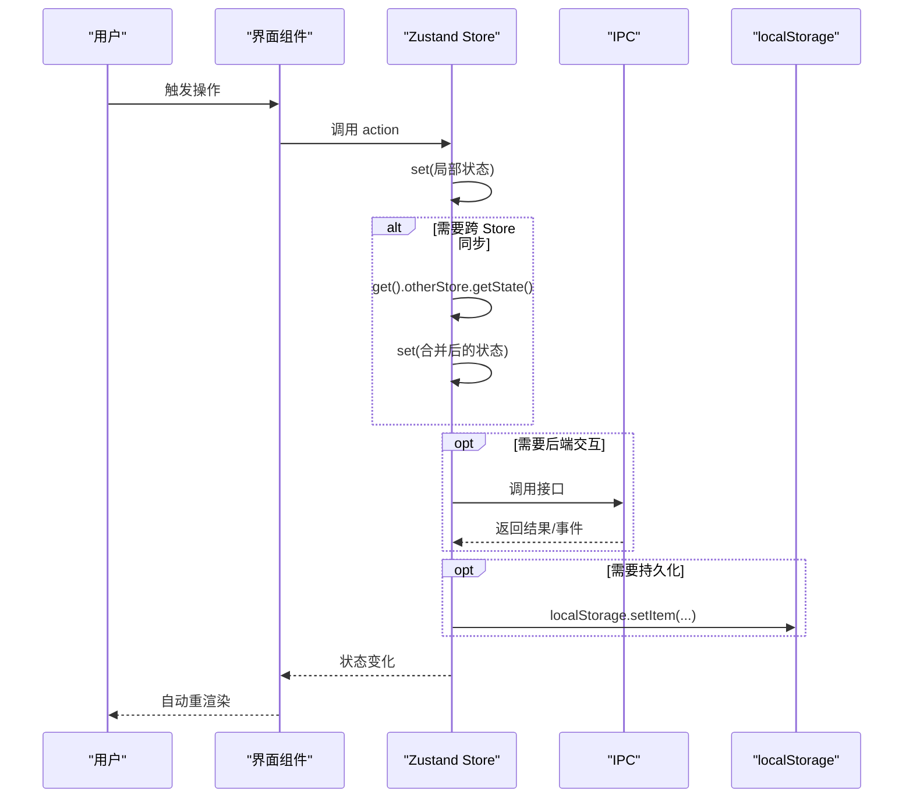
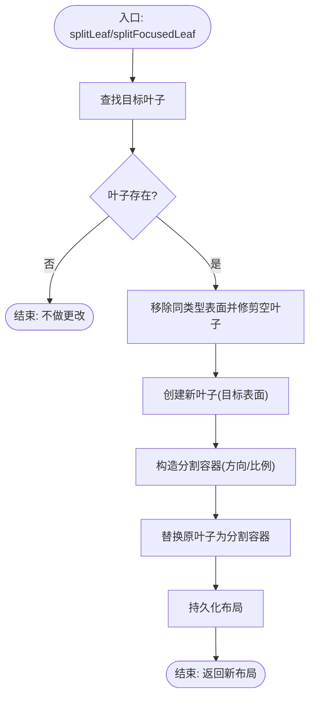
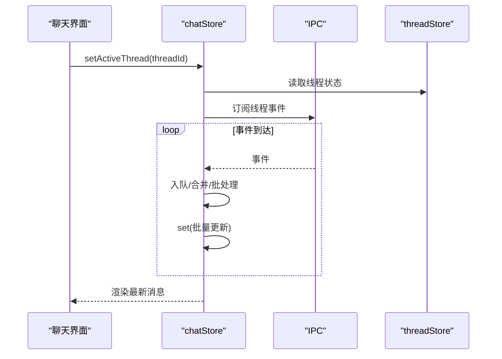
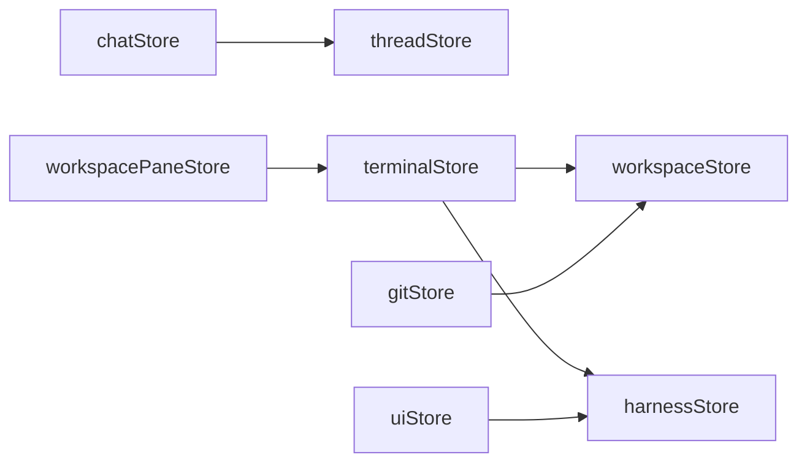

# 状态传播

<cite>
**本文引用的文件**
- [workspacePaneStore.ts](file://src/stores/workspacePaneStore.ts)
- [uiStore.ts](file://src/stores/uiStore.ts)
- [chatStore.ts](file://src/stores/chatStore.ts)
- [threadStore.ts](file://src/stores/threadStore.ts)
- [workspaceStore.ts](file://src/stores/workspaceStore.ts)
- [terminalStore.ts](file://src/stores/terminalStore.ts)
- [gitStore.ts](file://src/stores/gitStore.ts)
- [harnessStore.ts](file://src/stores/harnessStore.ts)
</cite>

## 目录
1. [引言](#引言)
2. [项目结构](#项目结构)
3. [核心组件](#核心组件)
4. [架构总览](#架构总览)
5. [详细组件分析](#详细组件分析)
6. [依赖关系分析](#依赖关系分析)
7. [性能考量](#性能考量)
8. [故障排查指南](#故障排查指南)
9. [结论](#结论)
10. [附录](#附录)

## 引言
本文件聚焦于 Panes 的状态传播机制，系统性阐述以下主题：
- 状态变更的传播路径与组件间同步策略
- 数据流向与跨 Store 协作
- Zustand Store 的状态更新机制、依赖追踪与自动重渲染
- 状态合并策略、冲突检测与解决方案
- 性能优化技巧（批量更新、防抖、缓存）
- 调试工具与监控方法

## 项目结构
Panes 使用 Zustand 构建多 Store 的状态管理，围绕工作区（Workspace）、线程（Thread）、聊天（Chat）、终端（Terminal）、Git、UI 等模块划分职责边界，通过 IPC 与后端交互，并在 Store 内部维护本地持久化与缓存。

图示来源
- [workspacePaneStore.ts](file://src/stores/workspacePaneStore.ts)
- [uiStore.ts](file://src/stores/uiStore.ts)
- [chatStore.ts](file://src/stores/chatStore.ts)
- [threadStore.ts](file://src/stores/threadStore.ts)
- [workspaceStore.ts](file://src/stores/workspaceStore.ts)
- [terminalStore.ts](file://src/stores/terminalStore.ts)
- [gitStore.ts](file://src/stores/gitStore.ts)
- [harnessStore.ts](file://src/stores/harnessStore.ts)

章节来源
- [workspacePaneStore.ts](file://src/stores/workspacePaneStore.ts)
- [uiStore.ts](file://src/stores/uiStore.ts)
- [chatStore.ts](file://src/stores/chatStore.ts)
- [threadStore.ts](file://src/stores/threadStore.ts)
- [workspaceStore.ts](file://src/stores/workspaceStore.ts)
- [terminalStore.ts](file://src/stores/terminalStore.ts)
- [gitStore.ts](file://src/stores/gitStore.ts)
- [harnessStore.ts](file://src/stores/harnessStore.ts)

## 核心组件
- 工作区面板 Store：管理多工作区的面板树布局、叶子节点聚焦、标签页切换与分割等。
- 线程 Store：集中管理线程列表、活动线程、归档线程、模型推理努力等元数据。
- 聊天 Store：负责消息窗口、流式事件批处理、乐观更新、权限审批、动作输出水合等。
- 终端 Store：管理会话、分屏树、组、通知、启动预设、工作树等。
- Git Store：封装状态与差异缓存、视图刷新节流、远程操作等。
- UI Store：侧边栏、Git 面板、探索器、焦点模式等 UI 状态与持久化。
- 工作区 Store：工作区与仓库选择、激活、扫描、信任级别等。
- Harness Store：Harness 扫描、安装可用性、启动命令生成。

章节来源
- [workspacePaneStore.ts](file://src/stores/workspacePaneStore.ts)
- [threadStore.ts](file://src/stores/threadStore.ts)
- [chatStore.ts](file://src/stores/chatStore.ts)
- [terminalStore.ts](file://src/stores/terminalStore.ts)
- [gitStore.ts](file://src/stores/gitStore.ts)
- [uiStore.ts](file://src/stores/uiStore.ts)
- [workspaceStore.ts](file://src/stores/workspaceStore.ts)
- [harnessStore.ts](file://src/stores/harnessStore.ts)

## 架构总览
Zustand 以函数式 Store 定义状态与派生逻辑，通过 set/get 实现内部状态更新与跨 Store 访问。典型流程：
- 用户操作触发某个 Store 的 action
- action 内部调用 set 更新状态或调用 get 获取其他 Store 状态
- IPC 或本地持久化被调用以同步到后端或持久化
- React 组件订阅相关状态并自动重渲染

图示来源
- [chatStore.ts](file://src/stores/chatStore.ts)
- [threadStore.ts](file://src/stores/threadStore.ts)
- [workspacePaneStore.ts](file://src/stores/workspacePaneStore.ts)
- [terminalStore.ts](file://src/stores/terminalStore.ts)
- [uiStore.ts](file://src/stores/uiStore.ts)
- [workspaceStore.ts](file://src/stores/workspaceStore.ts)
- [gitStore.ts](file://src/stores/gitStore.ts)
- [harnessStore.ts](file://src/stores/harnessStore.ts)

## 详细组件分析

### 工作区面板状态传播（workspacePaneStore）
- 状态结构：按工作区 ID 维护一棵可变的面板树（叶子/分割容器），包含当前聚焦叶子、Legacy 模式推断等。
- 关键能力：
  - 确保工作区存在并加载/回退默认布局
  - 聚焦叶子、设置活动标签页、激活特定表面（chat/terminal/editor）
  - 分割叶子、关闭叶子/标签页、调整分割比例
  - 基于持久化键进行本地恢复
- 状态合并与冲突：
  - 通过 updateWorkspace 包装器统一写入持久化与返回新映射
  - 查找/替换/修剪空叶子避免无效节点
  - 比例值进行边界裁剪，保证数值合法
- 依赖追踪与重渲染：
  - 外部通过 useWorkspacePaneStore 订阅；每个工作区独立状态对象，减少无关重渲染
- 性能要点：
  - 递归遍历查找叶子与更新树时采用不可变复制，避免深层共享导致的重复计算
  - 比例更新与节点移除/修剪均在单次 set 中完成，降低多次重渲染

图示来源
- [workspacePaneStore.ts](file://src/stores/workspacePaneStore.ts)

章节来源
- [workspacePaneStore.ts](file://src/stores/workspacePaneStore.ts)

### 聊天状态传播（chatStore）
- 流式事件批处理与批量刷新：
  - 事件队列 + 时间窗/阈值触发 flush，避免高频事件导致的频繁重渲染
  - applyStreamEvent 将事件合并到消息数组，支持文本/思考/动作/差异/通知/错误等块级合并
  - 使用 hydration 窗口控制内存占用，仅对最近消息保持完整水合
- 乐观更新与回滚：
  - 发送消息前插入“乐观助手消息”，失败时回滚
  - 权限审批响应先乐观应用，IPC 失败则回滚
- 状态合并与冲突：
  - 事件合并遵循“最后写入获胜”原则，同时维护块级去重（如 ActionOutputDelta 合并）
  - TurnCompleted 作为批处理边界，清理挂起指标
- 依赖追踪与重渲染：
  - 通过 bindSeq 防止并发切换导致的竞态
  - 仅当消息/状态/用量发生实质性变化时才 set，避免无意义重渲染

图示来源
- [chatStore.ts](file://src/stores/chatStore.ts)
- [threadStore.ts](file://src/stores/threadStore.ts)

章节来源
- [chatStore.ts](file://src/stores/chatStore.ts)
- [threadStore.ts](file://src/stores/threadStore.ts)

### 线程状态传播（threadStore）
- 线程生命周期管理：
  - 创建/重命名/归档/恢复/附加远端线程等
  - 本地应用更新与跨 Store 同步（如 chatStore 在切换时同步线程）
- 状态合并与冲突：
  - applyThreadUpdateLocal 仅在目标工作区存在该线程时才应用，避免跨工作区污染
  - setThreadReasoningEffortLocal/setThreadLastModelLocal 通过映射更新所有工作区中的线程
- 依赖追踪：
  - 读取引擎健康、聊天合成器运行时等外部状态以决定默认运行时

章节来源
- [threadStore.ts](file://src/stores/threadStore.ts)

### 终端状态传播（terminalStore）
- 启动预设与运行时序列化：
  - materializeWorkspaceStartupPreset 将预设转换为运行时会话/分屏树
  - serializeWorkspaceRuntimeAsStartupPreset 反向序列化当前运行时
- 会话与分屏树：
  - 提供构建网格分屏树、替换/删除叶子、更新比例等工具函数
- 通知与焦点同步：
  - hydrateNotifications 按会话聚合通知，支持“触碰”标记与批量清理
  - syncNotificationFocus 与窗口焦点联动，失败时回退到重新拉取

章节来源
- [terminalStore.ts](file://src/stores/terminalStore.ts)

### Git 状态传播（gitStore）
- 缓存与节流：
  - 状态与差异缓存基于 repoPath 键，带 TTL 与大小限制，LRU 淘汰
  - activeView 刷新最小间隔，避免频繁请求
- 一致性与失效：
  - 通过 repoRevision 版本号与缓存条目 revision 对比，确保缓存命中正确
  - 任一变更触发 invalidateRepoCaches，清理相关缓存与飞行中请求

章节来源
- [gitStore.ts](file://src/stores/gitStore.ts)

### UI 状态传播（uiStore）
- UI 状态与持久化：
  - 侧边栏/Git 面板/探索器开关与固定状态持久化到 localStorage
  - 焦点模式快照与恢复，避免不必要的布局抖动
- 跨 Store 协作：
  - 切换到 harnesses 视图时懒加载 harnessStore 并触发扫描

章节来源
- [uiStore.ts](file://src/stores/uiStore.ts)

### 工作区状态传播（workspaceStore）
- 工作区与仓库选择：
  - 加载/打开/归档/恢复工作区，激活工作区时准备终端、加载 Git 草稿
  - 仓库选择记忆与回退策略
- 依赖追踪：
  - 与 terminalStore/gitStore 协作，确保激活顺序与数据一致性

章节来源
- [workspaceStore.ts](file://src/stores/workspaceStore.ts)

### Harness 状态传播（harnessStore）
- 扫描与启动：
  - scan/ensureScanned 防止重复扫描，记录 npm 可用性
  - launch 返回命令字符串，供终端写入使用

章节来源
- [harnessStore.ts](file://src/stores/harnessStore.ts)

## 依赖关系分析
- 跨 Store 依赖：
  - chatStore 依赖 threadStore（活动线程、引擎元数据）
  - terminalStore 依赖 workspaceStore（根路径、仓库信息）、harnessStore（启动命令）
  - workspacePaneStore 依赖 terminalStore 的布局模式与面板尺寸
  - uiStore 依赖 harnessStore（切换视图时触发扫描）
  - gitStore 与 workspaceStore 协作（仓库选择、主仓库上下文）
- 外部依赖：
  - IPC 提供线程、终端、Git、引擎、工作区等后端能力
  - localStorage 提供 UI 与布局的本地持久化

图示来源
- [chatStore.ts](file://src/stores/chatStore.ts)
- [threadStore.ts](file://src/stores/threadStore.ts)
- [terminalStore.ts](file://src/stores/terminalStore.ts)
- [workspacePaneStore.ts](file://src/stores/workspacePaneStore.ts)
- [uiStore.ts](file://src/stores/uiStore.ts)
- [workspaceStore.ts](file://src/stores/workspaceStore.ts)
- [gitStore.ts](file://src/stores/gitStore.ts)
- [harnessStore.ts](file://src/stores/harnessStore.ts)

## 性能考量
- 批量更新与事件批处理
  - chatStore 使用时间窗与阈值触发 flush，减少 set 次数
  - workspacePaneStore 的 updateWorkspace 在单次 set 中完成持久化与状态写入
- 防抖与节流
  - gitStore 对活跃视图刷新设置最小间隔，避免频繁请求
  - chatStore 对事件速率进行统计，便于性能监控
- 缓存与内存控制
  - gitStore 的状态/差异缓存带 TTL 与字节上限，LRU 淘汰
  - chatStore 的 hydration 窗口限制消息数量，避免内存膨胀
- 乐观更新与回滚
  - 减少等待后端响应的时间，失败时快速回滚，提升用户体验
- 本地持久化
  - 通过 localStorage 快速恢复 UI 与布局，降低首次渲染成本

## 故障排查指南
- 聊天流异常
  - 检查事件队列是否堆积，确认 flush 是否被触发
  - 关注 TurnCompleted 边界是否清理挂起指标
  - 审核 applyStreamEvent 的块级合并逻辑，避免重复或丢失
- 线程状态不一致
  - 确认 applyThreadUpdateLocal 的工作区匹配
  - 检查 threadStore 的 IPC 调用与错误处理
- 终端通知不同步
  - 核查 hydrateNotifications 的请求序号与会话存活集合
  - 检查 syncNotificationFocus 的 IPC 失败回退
- Git 状态陈旧
  - 确认 repoRevision 是否递增
  - 检查缓存 TTL 与大小限制是否触发淘汰
- 工作区/面板恢复失败
  - 校验持久化的布局 JSON 结构与节点合法性
  - 确认 Legacy 模式推断与默认布局回退逻辑

章节来源
- [chatStore.ts](file://src/stores/chatStore.ts)
- [threadStore.ts](file://src/stores/threadStore.ts)
- [terminalStore.ts](file://src/stores/terminalStore.ts)
- [gitStore.ts](file://src/stores/gitStore.ts)
- [workspacePaneStore.ts](file://src/stores/workspacePaneStore.ts)

## 结论
Panes 的状态传播以 Zustand 为核心，结合 IPC 与 localStorage，实现了高内聚、低耦合的状态管理。通过事件批处理、缓存与乐观更新等策略，兼顾了实时性与性能。跨 Store 的协作通过明确的依赖链与状态合并策略得以稳定运行。建议在新增功能时遵循现有模式：优先使用 set 的原子更新、必要时进行批量合并、严格控制持久化时机，并为关键路径添加监控与回退逻辑。

## 附录
- 调试建议
  - 在 chatStore 中记录事件速率与批处理耗时
  - 在 gitStore 中记录缓存命中率与淘汰事件
  - 在 workspacePaneStore 中记录布局更新耗时与节点变更次数
- 最佳实践
  - 将复杂状态合并逻辑封装为纯函数，便于测试与复用
  - 使用 bindSeq/请求序号防止竞态
  - 对外暴露最小必要的 action，避免 Store 间直接互相 set