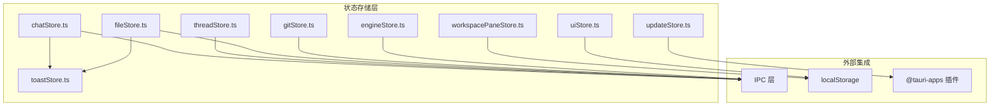
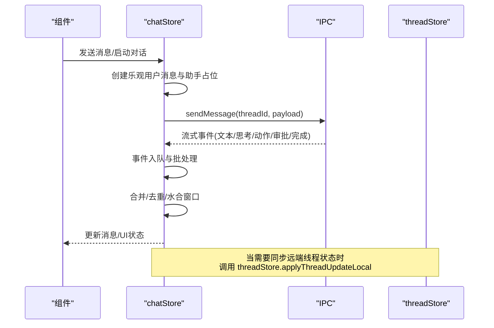
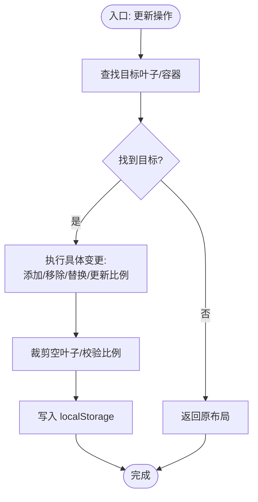
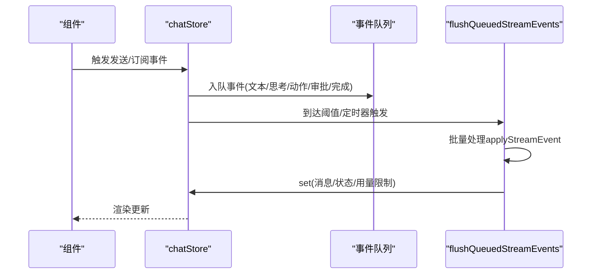
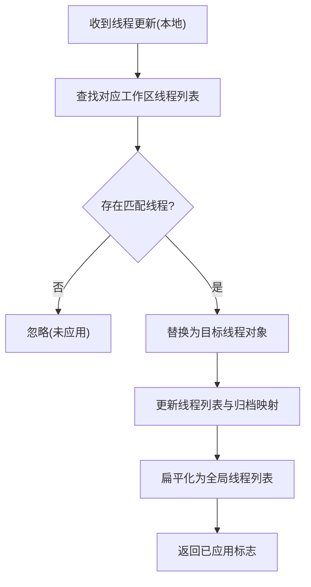
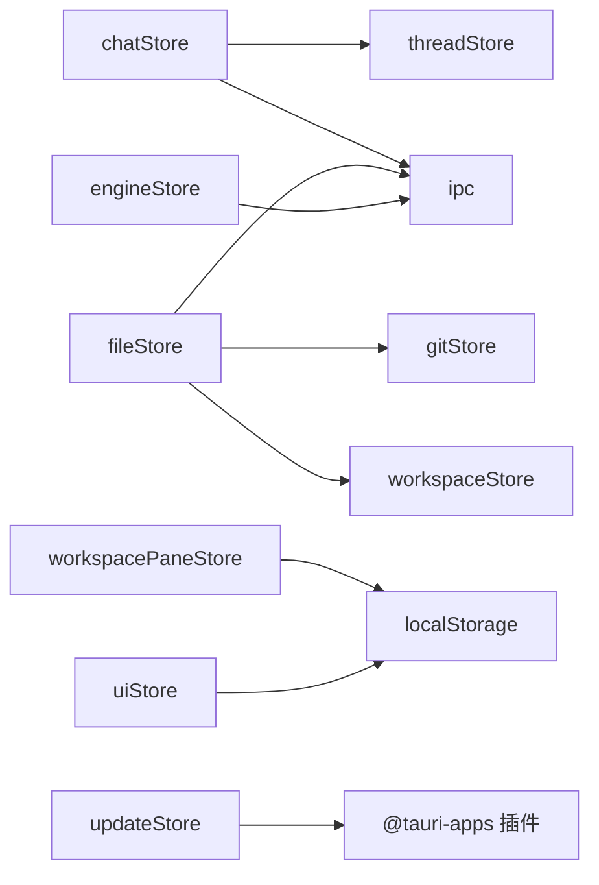

# 状态更新机制

<cite>
**本文档引用的文件**
- [workspacePaneStore.ts](file://src/stores/workspacePaneStore.ts)
- [chatStore.ts](file://src/stores/chatStore.ts)
- [threadStore.ts](file://src/stores/threadStore.ts)
- [uiStore.ts](file://src/stores/uiStore.ts)
- [fileStore.ts](file://src/stores/fileStore.ts)
- [gitStore.ts](file://src/stores/gitStore.ts)
- [engineStore.ts](file://src/stores/engineStore.ts)
- [updateStore.ts](file://src/stores/updateStore.ts)
- [toastStore.ts](file://src/stores/toastStore.ts)
</cite>

## 目录
1. [引言](#引言)
2. [项目结构](#项目结构)
3. [核心组件](#核心组件)
4. [架构总览](#架构总览)
5. [详细组件分析](#详细组件分析)
6. [依赖关系分析](#依赖关系分析)
7. [性能考量](#性能考量)
8. [故障排除指南](#故障排除指南)
9. [结论](#结论)

## 引言
本文件系统化梳理 Panes 中基于 Zustand 的状态更新机制，聚焦于以下目标：
- 解释 Zustand Store 的状态更新流程与触发条件
- 深入解析乐观更新、悲观更新与事务性更新的实现方式
- 总结幂等性保障、重复状态检测与去重机制
- 提供最佳实践、错误处理与回滚策略
- 讨论性能优化与批量处理技术

## 项目结构
Panes 使用多个独立的 Zustand Store 管理不同领域的状态，采用“按功能域分层”的组织方式：
- 工作区与面板布局：workspacePaneStore
- 聊天与消息流：chatStore、threadStore
- 用户界面与视图：uiStore
- 文件与编辑器：fileStore
- Git 面板与缓存：gitStore
- 引擎与运行时：engineStore
- 应用更新：updateStore
- 通知系统：toastStore

图表来源
- [workspacePaneStore.ts:1-696](file://src/stores/workspacePaneStore.ts#L1-L696)
- [chatStore.ts:1-2183](file://src/stores/chatStore.ts#L1-L2183)
- [threadStore.ts:1-713](file://src/stores/threadStore.ts#L1-L713)
- [uiStore.ts:1-231](file://src/stores/uiStore.ts#L1-L231)
- [fileStore.ts:1-551](file://src/stores/fileStore.ts#L1-L551)
- [gitStore.ts:1-200](file://src/stores/gitStore.ts#L1-L200)
- [engineStore.ts:1-164](file://src/stores/engineStore.ts#L1-L164)
- [updateStore.ts:1-69](file://src/stores/updateStore.ts#L1-L69)
- [toastStore.ts:1-58](file://src/stores/toastStore.ts#L1-L58)

章节来源
- [workspacePaneStore.ts:1-696](file://src/stores/workspacePaneStore.ts#L1-L696)
- [chatStore.ts:1-2183](file://src/stores/chatStore.ts#L1-L2183)
- [threadStore.ts:1-713](file://src/stores/threadStore.ts#L1-L713)
- [uiStore.ts:1-231](file://src/stores/uiStore.ts#L1-L231)
- [fileStore.ts:1-551](file://src/stores/fileStore.ts#L1-L551)
- [gitStore.ts:1-200](file://src/stores/gitStore.ts#L1-L200)
- [engineStore.ts:1-164](file://src/stores/engineStore.ts#L1-L164)
- [updateStore.ts:1-69](file://src/stores/updateStore.ts#L1-L69)
- [toastStore.ts:1-58](file://src/stores/toastStore.ts#L1-L58)

## 核心组件
- workspacePaneStore：管理工作区的面板布局树（叶子节点与分割容器），支持聚焦、激活表面、拆分、关闭等操作，并持久化到 localStorage。
- chatStore：管理聊天线程的消息窗口、流事件批处理、乐观更新、取消与回滚、动作输出延迟加载。
- threadStore：管理线程列表、归档、活动线程切换、本地元数据更新（推理努力、模型）。
- uiStore：管理侧边栏、Git 面板、资源管理器显示状态与焦点模式。
- fileStore：管理编辑器标签页集合、打开/关闭、渲染模式切换、Git diff 视图、保存与外部修改检测。
- gitStore：管理 Git 状态与差异缓存、历史草稿、刷新节流与缓存淘汰。
- engineStore：管理引擎列表与健康检查、运行时更新应用。
- updateStore：管理应用更新检查、下载安装与重启。
- toastStore：管理全局通知队列。

章节来源
- [workspacePaneStore.ts:38-696](file://src/stores/workspacePaneStore.ts#L38-L696)
- [chatStore.ts:24-2183](file://src/stores/chatStore.ts#L24-L2183)
- [threadStore.ts:34-713](file://src/stores/threadStore.ts#L34-L713)
- [uiStore.ts:24-231](file://src/stores/uiStore.ts#L24-L231)
- [fileStore.ts:168-551](file://src/stores/fileStore.ts#L168-L551)
- [gitStore.ts:79-200](file://src/stores/gitStore.ts#L79-L200)
- [engineStore.ts:5-164](file://src/stores/engineStore.ts#L5-L164)
- [updateStore.ts:7-69](file://src/stores/updateStore.ts#L7-L69)
- [toastStore.ts:10-58](file://src/stores/toastStore.ts#L10-L58)

## 架构总览
Zustand Store 通过 set/get 回调统一驱动状态更新，结合 IPC 与本地存储实现跨进程与持久化能力。消息流采用事件队列与批处理策略，确保高吞吐下的 UI 响应与一致性。

图表来源
- [chatStore.ts:1532-2183](file://src/stores/chatStore.ts#L1532-L2183)
- [threadStore.ts:635-673](file://src/stores/threadStore.ts#L635-L673)

## 详细组件分析

### workspacePaneStore：面板布局状态更新
- 数据结构
  - WorkspacePaneLayout：根节点、当前聚焦叶子、传统布局模式
  - 叶子节点包含标签页数组与活动标签 ID
  - 分割容器包含方向、比例与两个子节点
- 关键更新策略
  - ensureWorkspace：惰性初始化工作区布局，从 localStorage 或默认布局恢复
  - focusLeaf/setActiveTab/activateSurfaceInLeaf：在布局树上定位并更新叶子或标签页
  - showSurface/showSingleSurface：向目标叶子添加表面（去重与激活）
  - splitLeaf/splitFocusedLeaf：在指定叶子前/后插入新叶子，保持唯一性
  - closeLeaf/closeTab：移除叶子或标签页，空叶子裁剪
  - updateRatio：递归更新分割容器比例
- 幂等性与去重
  - addSurfaceToLeaf/removeSurfaceKind/pruneEmptyLeaves：确保同一表面仅出现一次，空叶子自动清理
  - findLeaf/replaceLeaf/removeLeaf/updateRatioInTree：通过查找与替换实现幂等更新
- 持久化
  - readPersistedLayout/persistLayout：JSON 序列化/反序列化，带校验与降级

图表来源
- [workspacePaneStore.ts:109-183](file://src/stores/workspacePaneStore.ts#L109-L183)
- [workspacePaneStore.ts:205-261](file://src/stores/workspacePaneStore.ts#L205-L261)
- [workspacePaneStore.ts:477-486](file://src/stores/workspacePaneStore.ts#L477-L486)

章节来源
- [workspacePaneStore.ts:38-696](file://src/stores/workspacePaneStore.ts#L38-L696)

### chatStore：消息流与状态更新
- 乐观更新
  - send：创建乐观用户消息与占位助手消息，立即插入 UI；失败时回滚
  - respondApproval：乐观应用审批决策，失败时回滚
- 悲观更新
  - loadOlderMessages：加载更早消息时设置 loadingOlderMessages，避免并发请求
- 事务性更新
  - 流事件批处理：enqueueStreamEvent 合并相邻事件，flushQueuedStreamEvents 批量应用，确保状态一致性
  - applyHydrationWindow：维护消息水合窗口，避免内存膨胀
- 幂等性与去重
  - normalizeBlocks/normalizeMessages：合并相邻文本/思考块，避免重复
  - applyStreamEvent：针对不同事件类型进行幂等合并（如 ActionOutputDelta 追加、DiffUpdated 替换同作用域）
- 错误处理与回滚
  - send 失败时移除乐观消息
  - respondApproval 失败时恢复旧消息
  - loadOlderMessages 失败时设置阻塞时间与错误
- 性能优化
  - 事件批处理窗口与阈值控制
  - 水合窗口与摘要化减少渲染压力
  - 背景监听与绑定序列号防止竞态

图表来源
- [chatStore.ts:1628-1780](file://src/stores/chatStore.ts#L1628-L1780)
- [chatStore.ts:1211-1530](file://src/stores/chatStore.ts#L1211-L1530)
- [chatStore.ts:1913-1989](file://src/stores/chatStore.ts#L1913-L1989)
- [chatStore.ts:2067-2094](file://src/stores/chatStore.ts#L2067-L2094)

章节来源
- [chatStore.ts:24-2183](file://src/stores/chatStore.ts#L24-L2183)

### threadStore：线程状态的本地更新
- 本地更新接口
  - applyThreadUpdateLocal：在不触发 IPC 的前提下更新线程列表与归档列表
  - setThreadReasoningEffortLocal/setThreadLastModelLocal：更新线程元数据（推理努力、最后模型）
- 幂等性
  - 通过查找目标线程并比较 ID 实现幂等更新
- 与 chatStore 协作
  - chatStore 在需要时调用 threadStore.applyThreadUpdateLocal 同步远端线程状态

图表来源
- [threadStore.ts:635-673](file://src/stores/threadStore.ts#L635-L673)

章节来源
- [threadStore.ts:34-713](file://src/stores/threadStore.ts#L34-L713)

### uiStore：界面状态与持久化
- 状态字段：侧边栏/Git 面板显示与固定、资源管理器开关、焦点模式、活动视图、命令面板状态、消息焦点目标
- 持久化：通过 localStorage 存储固定与展开状态
- 幂等性：切换/设置操作若与当前状态相同则直接返回

章节来源
- [uiStore.ts:24-231](file://src/stores/uiStore.ts#L24-L231)

### fileStore：文件与编辑器状态
- 标签页生命周期：打开/关闭/置顶/渲染模式切换
- Git diff：根据比较源生成对比视图，支持二进制文件与错误提示
- 保存逻辑：外部修改检测、保存成功后的 Git 缓存失效与刷新
- 幂等性：内容变更仅在实际变化时更新 isDirty

章节来源
- [fileStore.ts:168-551](file://src/stores/fileStore.ts#L168-L551)

### gitStore：缓存与刷新节流
- 缓存策略：状态与差异缓存，带 TTL 与大小限制，LRU 淘汰
- 刷新节流：活跃视图最小刷新间隔，避免频繁 IO
- 幂等性：缓存命中直接返回，未命中才发起 IPC 请求

章节来源
- [gitStore.ts:79-200](file://src/stores/gitStore.ts#L79-L200)

### engineStore：引擎健康与运行时更新
- 加载与健康检查：异步加载引擎列表，按需健康检查，防抖重复请求
- 运行时更新：接收协议诊断并合并到健康报告中

章节来源
- [engineStore.ts:5-164](file://src/stores/engineStore.ts#L5-L164)

### updateStore：应用更新状态
- 状态机：idle/checking/available/downloading/ready/error
- 幂等性：检查阶段避免重复请求，失败静默处理

章节来源
- [updateStore.ts:7-69](file://src/stores/updateStore.ts#L7-L69)

### toastStore：通知队列
- 最大数量限制与去重策略
- 统一的添加/关闭接口

章节来源
- [toastStore.ts:10-58](file://src/stores/toastStore.ts#L10-L58)

## 依赖关系分析
- 组件耦合
  - chatStore 依赖 threadStore（线程状态同步）、ipc（消息与事件）、perfTelemetry（指标）
  - threadStore 依赖 engineStore、onboardingStore、chatComposerStore（运行时推断）
  - fileStore 依赖 gitStore、workspaceStore、ipc（文件与 Git 操作）
  - workspacePaneStore 依赖 localStorage 与工具函数（ID 生成、布局遍历）
- 外部依赖
  - @tauri-apps/plugin-updater/process：updateStore
  - @tauri-apps/plugin-process：updateStore
  - localStorage：uiStore、workspacePaneStore、gitStore 草稿

图表来源
- [chatStore.ts:1-23](file://src/stores/chatStore.ts#L1-L23)
- [threadStore.ts:1-12](file://src/stores/threadStore.ts#L1-L12)
- [fileStore.ts:1-14](file://src/stores/fileStore.ts#L1-L14)
- [workspacePaneStore.ts:1-1](file://src/stores/workspacePaneStore.ts#L1-L1)
- [uiStore.ts:1-1](file://src/stores/uiStore.ts#L1-L1)
- [engineStore.ts:1-3](file://src/stores/engineStore.ts#L1-L3)
- [updateStore.ts:1-3](file://src/stores/updateStore.ts#L1-L3)

## 性能考量
- 批量处理
  - chatStore 使用事件队列与定时器/阈值触发批量刷新，降低渲染次数
  - workspacePaneStore 的布局更新采用不可变深拷贝与局部替换，避免整树重绘
- 内存管理
  - chatStore 的水合窗口与摘要化减少消息内存占用
  - gitStore 的缓存 TTL 与字节上限控制内存增长
- I/O 优化
  - fileStore 的保存前外部修改检测与 Git 缓存失效刷新分离，避免阻塞主流程
  - gitStore 的活跃视图刷新节流与缓存命中优先策略
- 幂等性与去重
  - chatStore 的块合并与重复事件去重
  - workspacePaneStore 的表面去重与空叶子裁剪

## 故障排除指南
- 消息流异常
  - 症状：消息卡顿或丢失
  - 排查：检查事件队列是否被定时器或阈值正确触发；确认 flushInProgress 与 bindSeq 竞态
  - 参考路径：[chatStore.ts:1651-1780](file://src/stores/chatStore.ts#L1651-L1780)
- 乐观更新回滚
  - 症状：发送失败后 UI 仍显示占位消息
  - 排查：确认 send 的错误分支是否正确移除乐观消息
  - 参考路径：[chatStore.ts:1977-1988](file://src/stores/chatStore.ts#L1977-L1988)
- 审批响应失败回滚
  - 症状：UI 显示已批准但远端失败
  - 排查：确认 respondApproval 的回滚分支是否恢复旧消息
  - 参考路径：[chatStore.ts:2088-2094](file://src/stores/chatStore.ts#L2088-L2094)
- 线程状态不同步
  - 症状：远端状态更新但 UI 未反映
  - 排查：确认 chatStore 是否调用 threadStore.applyThreadUpdateLocal
  - 参考路径：[chatStore.ts:1606-1614](file://src/stores/chatStore.ts#L1606-L1614)
- 面板布局异常
  - 症状：拆分后比例异常或叶子消失
  - 排查：检查 updateRatioInTree 与 pruneEmptyLeaves 的调用顺序
  - 参考路径：[workspacePaneStore.ts:185-203](file://src/stores/workspacePaneStore.ts#L185-L203)
- Git 缓存命中率低
  - 症状：频繁刷新导致卡顿
  - 排查：检查 TTL、最大条目数与字节上限配置
  - 参考路径：[gitStore.ts:139-181](file://src/stores/gitStore.ts#L139-L181)

章节来源
- [chatStore.ts:1651-1780](file://src/stores/chatStore.ts#L1651-L1780)
- [chatStore.ts:1977-1988](file://src/stores/chatStore.ts#L1977-L1988)
- [chatStore.ts:2088-2094](file://src/stores/chatStore.ts#L2088-L2094)
- [chatStore.ts:1606-1614](file://src/stores/chatStore.ts#L1606-L1614)
- [workspacePaneStore.ts:185-203](file://src/stores/workspacePaneStore.ts#L185-L203)
- [gitStore.ts:139-181](file://src/stores/gitStore.ts#L139-L181)

## 结论
Panes 的 Zustand 状态更新机制围绕“幂等、去重、批处理、回滚”四大原则构建：
- 幂等性通过查找/替换、去重算法与绑定序列号保障
- 去重通过事件合并、表面去重与空叶子裁剪实现
- 批处理通过事件队列与阈值/定时器降低渲染压力
- 回滚通过乐观更新失败分支与审批响应撤销实现

该机制在聊天流、面板布局、文件编辑与 Git 操作等场景中得到良好验证，具备可扩展性与可维护性。建议在新增状态域时遵循相同的模式：明确触发条件、设计幂等更新、引入批处理与必要的去重策略，并提供清晰的错误回滚路径。